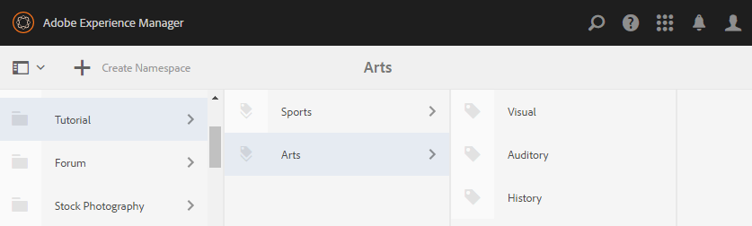

# Configuração inicial {#initial-setup}

## Iniciar instâncias de autor e do Publish {#start-author-and-publish-instances}

Para fins de desenvolvimento e demonstração, é necessário executar um autor e uma instância de publicação.

Para fazer isso, siga as instruções básicas do Adobe Experience Manager (AEM) [Introdução](../../help/sites-deploying/deploy.md#getting-started), que resultam no seguinte:

* Ambiente de autor em [localhost:4502](http://localhost:4502/)
* Ambiente do Publish em [localhost:4503](http://localhost:4503/)

Para o AEM Communities,

* O ambiente do Autor destina-se a:

   * Desenvolvimento de sites, modelos e componentes.
   * Tarefas administrativas e de configuração.

* O ambiente do Publish é para:

   * A experiência da comunidade na publicação e moderação de conteúdo.
   * Criação de grupos da comunidade, membros e grupos de membros.

>[!NOTE]
>
>Se não estiver familiarizado com o AEM, exiba a documentação sobre [manuseio básico](../../help/sites-authoring/basic-handling.md) e um [guia rápido para a criação de páginas](../../help/sites-authoring/qg-page-authoring.md).

## Instalar versão mais recente do Communities {#install-latest-communities-release}

Este tutorial cria um [site da comunidade do engagement](overview.md#engagement-community) e é baseado no pacote de recursos do AEM Communities 6.2 versão 1.10.

Para verificar se o pacote de recursos mais recente está instalado, visite:

* [Versões mais recentes](deploy-communities.md#latest-releases)

## Configurar Analytics {#configure-analytics}

Quando o [Adobe Analytics é configurado para o site da comunidade](analytics.md), são disponibilizadas informações sobre a atividade da comunidade que melhoram a experiência do membro da comunidade e fornecem feedback aos administradores do site.

A integração com o Adobe Analytics é opcional.

## Configurar email para notificações {#configure-email-for-notifications}

O recurso de notificações, disponível por padrão para todos os sites criados usando o console `Communities Sites`, fornece um canal de email para notificações.

O que é necessário é que o e-mail seja configurado corretamente para o site.

Consulte [Configurando Email](email.md).

## Habilitar o serviço de túnel {#enable-the-tunnel-service}

Ao criar um site da comunidade no ambiente do Autor, o serviço de túnel possibilita atribuir funções a membros confiáveis da comunidade registrados no ambiente do Publish. O serviço de túnel também permite acesso aos membros da comunidade a partir dos [consoles Membros e Grupos](members.md) no ambiente de criação.

A convenção é para membros e grupos de membros criados no ambiente Publish para *não* serem recriados no ambiente de autor. Para obter mais informações, consulte [Gerenciando usuários e grupos de usuários](users.md).

Para obter instruções simples para habilitar o serviço de túnel em uma instância do **Author**, consulte [Serviço de Túnel](deploy-communities.md#tunnel-service-on-author).

## Função de administrador da comunidade {#community-administrator-role}

Os membros do grupo Administradores da comunidade podem criar sites da comunidade, gerenciar sites, gerenciar membros (eles podem proibir membros da comunidade) e moderar conteúdo.

### Criar usuário {#create-user}

Crie um usuário no *autor*, ao qual foi atribuída a função de Administrador da comunidade:

* Na instância do autor

   * Por exemplo, [http://localhost:4502/](http://localhost:4503/)

* Entrar com privilégios de administrador

   * Por exemplo, nome de usuário &#39;admin&#39; / senha &#39;admin&#39;

* No console principal, navegue até **[!UICONTROL Ferramentas]** > **[!UICONTROL Operações]** > **[!UICONTROL Segurança]** > **[!UICONTROL Usuários]**.
* No menu **Editar**, selecione **[!UICONTROL Adicionar usuário]**

* Na caixa de diálogo `Create New User`, digite:

   * **[!UICONTROL ID]**: sirius
   * **[!UICONTROL Endereço de email]**: sirius.nilson@mailinator.com
   * **[!UICONTROL Senha]**: senha
   * **[!UICONTROL Confirmar Senha&ast;]**: senha
   * **[!UICONTROL Nome]**: Sirius
   * **[!UICONTROL Sobrenome]**: Nilson

### Atribuir a Sirius ao grupo de administradores da comunidade {#assign-sirius-to-community-administrators-group}

Role para baixo até `Add User to Groups`:

* Digite &quot;C&quot; para pesquisar

   * Selecionar `Community Administrators`
   * Selecionar `Community Enablement Managers`

* Selecione **[!UICONTROL Salvar]**.

## Ativar logon social {#enable-social-login}

Antes que as versões de demonstração do logon social com Facebook e Twitter possam ser usadas, é necessário

1. Instale um fix pack ou o [último feature pack](deploy-communities.md#latestfeaturepack) (para alterações na API do Facebook em março de 2017).
1. [Habilite o provedor OAuth](social-login.md#adobe-granite-oauth-authentication-handler) no ambiente de publicação.

Para servidores de produção, é necessário criar os serviços em nuvem necessários para fornecer logon social.

Consulte [Logon social com o Facebook e o Twitter](social-login.md).

## Criar tags do tutorial {#create-tutorial-tags}

Crie marcas para poder usá-las em tutoriais de participação, usando o namespace de marca `Tutorial`.

Use o [console de Marcação](../../help/sites-administering/tags.md#tagging-console) para criar as seguintes marcas:

* `Tutorial: Sports / Baseball`
* `Tutorial: Sports / Gymnastics`
* `Tutorial: Sports / Skiing`
* `Tutorial: Arts / Visual`
* `Tutorial: Arts / Auditory`
* `Tutorial: Arts / History`

Em seguida, siga as instruções para:

1. [Definir as permissões de marca](../../help/sites-administering/tags.md#setting-tag-permissions).
1. [Publish as marcas](../../help/sites-administering/tags.md#publishing-tags).

Exemplo de pacote de tags criado para os Tutorials de introdução do AEM Communities

[Obter arquivo](assets/tutorial_tags-v63.zip)

## MongoDB para armazenamento comum de UGC {#mongodb-for-ugc-common-store}

É recomendável, mas opcional, definir o [MSRP](msrp.md) (MongoDB) como o [armazenamento comum](working-with-srp.md) para experimentar a flexibilidade de moderar todo o UGC de ambientes de publicação e/ou criação.

Para obter instruções, visite [Como configurar o MongoDB para demonstração](demo-mongo.md).

Por padrão, a instalação das instâncias AEM do autor e de publicação resulta no armazenamento do conteúdo gerado pelo usuário (UGC) no [armazenamento JCR Tar](../../help/sites-deploying/platform.md), que é acessado usando [JSRP](jsrp.md). JSRP não é um armazenamento comum, o que significa que o UGC é visível somente na instância em que foi inserido. Normalmente, o UGC é inserido em uma instância de publicação e não estaria visível no ambiente de criação, resultando em todas as tarefas de moderação que precisam usar a instância de publicação.
