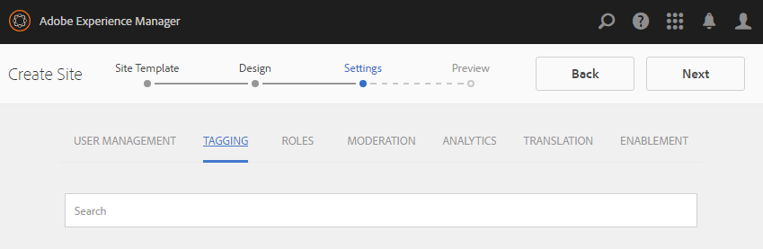

# Console de sites das comunidades {#communities-sites-console}

O console Sites de comunidades fornece acesso a:

* Criação do site
* Edição do site
* Gerenciamento do site
* [Criação e edição de grupos aninhados](/help/communities/groups.md) (subcomunidades)

Consulte [Introdução ao AEM Communities](/help/communities/getting-started.md), onde você pode experimentar a rapidez com que um site da comunidade pode ser criado no ambiente de criação, e como criar grupos da comunidade a partir dos ambientes de criação e publicação.

>[!NOTE]
>
>Os menus principais das Comunidades para a criação de [sites de comunidade](/help/communities/sites-console.md), [modelos de site de comunidade](/help/communities/sites.md), [modelos de grupo de comunidade](/help/communities/tools-groups.md) e [funções de comunidade](/help/communities/functions.md) são para uso somente no ambiente de criação.

## Pré-requisitos {#prerequisites}

Antes de criar um site da comunidade, é *necessário*:

* Verifique se uma ou mais instâncias do Publish estão em execução.
* Habilite o [serviço de túnel](/help/communities/deploy-communities.md#tunnel-service-on-author) para gerenciar membros e grupos de membros.
* Identifique o [publicador principal](/help/communities/deploy-communities.md#primary-publisher).
* [Configure a replicação](/help/communities/deploy-communities.md#replication-agents-on-author) quando a porta do publicador primário não for o padrão (4503).

A prática recomendada para garantir que o site esteja preparado para suportar muitos recursos é executar as seguintes etapas:

* Instale o [pacote de recursos mais recente](/help/communities/deploy-communities.md#latestfeaturepack).
* Habilitar o [Adobe Analytics](/help/communities/analytics.md) para AEM Communities.
* Configurar [email](/help/communities/email.md)
* Identificar [Administradores da Comunidade](/help/communities/users.md#creating-community-members).
* [Habilite o manipulador OAuth](/help/communities/social-login.md#adobe-granite-oauth-authentication-handler) para logon social.

## Acesso ao console Sites de comunidades {#accessing-communities-sites-console}

No ambiente Autor, para acessar o console Sites de comunidades:

* Da navegação global: **[!UICONTROL Comunidades]** > **[!UICONTROL Sites]**

O console Sites de comunidades exibe todos os sites de comunidades existentes. A partir desse console, os sites da comunidade podem ser criados, editados, gerenciados e excluídos.

Para criar um site da comunidade, selecione o ícone **Criar**.

Para acessar um site da comunidade existente para criar, modificar, publicar, exportar ou adicionar um grupo aninhado, selecione o ícone de pasta do site.

## Criação do site {#site-creation}

O console de criação de sites fornece uma abordagem passo a passo para reunir os recursos do site com base em um [modelo de site de comunidade](/help/communities/sites.md) e configurações selecionados.

Todo site criado inclui um recurso de logon, pois os visitantes do site são solicitados a entrar antes de poder publicar conteúdo, enviar mensagens ou participar de um grupo. Outros recursos incluídos são perfis de usuário, mensagens, notificações, menu do site, pesquisa, temas e identidade visual.

O processo é iniciado clicando no botão `Create` na parte superior do console Sites de Comunidades.

O processo de criação é uma série de etapas apresentadas como painéis que contêm um conjunto de recursos a serem configurados (apresentados como subpainéis). É possível avançar para a etapa **Avançar** ou **Voltar** até a etapa anterior antes de confirmar o site na etapa final.

### Etapa 1: modelo de site {#step-site-template}

No painel Modelo de site, o Título, a Descrição, a Raiz do site, o Idioma base, o Nome e o Modelo de site são especificados:

* **Título do site da comunidade**

  Um título de exibição para o site.

  O título é exibido no site publicado e na interface do administrador do site.

* **Descrição do site da comunidade**

  Uma descrição do site.

  A descrição não aparece no site publicado.

* **Raiz do site da comunidade**

  O caminho raiz para o site.

  A raiz padrão é `/content/sites`, mas a raiz pode ser movida para qualquer local dentro do site.

* **Idioma base do site da comunidade**

  (Deixe intocado para um único idioma: inglês) Use o menu suspenso para escolher um *ou mais* idiomas básicos entre os idiomas disponíveis: alemão, italiano, francês, japonês, espanhol, português (Brasil), chinês (tradicional) e chinês (simplificado). Um site da comunidade é criado para cada idioma adicionado e existe na mesma pasta do site, seguindo a prática recomendada descrita em [Tradução de conteúdo para sites multilíngues](/help/sites-administering/translation.md). A página raiz de cada site contém uma página secundária chamada pelo código de idioma de um dos idiomas selecionados, como &quot;en&quot; para inglês ou &quot;fr&quot; para francês.

* **Nome do site da comunidade**:

  O nome da página raiz do site que aparece no URL.

   * Verifique novamente o nome, pois ele não pode ser facilmente alterado após a criação do site.
   * A URL base ( `https://server:port/site root/site name)`) é exibida abaixo de `Community Site Name`.

   * Para um URL válido, anexe um código de idioma base + &quot;.html&quot;

     *Por exemplo*, `https://localhost:4502/content/sites/mysight/en.html`

* Menu **Modelo de site da comunidade**

  Use o menu suspenso para escolher um [modelo de site de comunidade](/help/communities/tools.md) disponível.

* Selecione **Próximo**.

### Etapa 2: design {#step-design}

O painel Design contém dois subpainéis para selecionar o tema e o banner da marca:

#### TEMA DO SITE DA COMUNIDADE {#community-site-theme}

A estrutura usa o `Twitter Bootstrap` para trazer um design responsivo e flexível para o site. Um dos muitos temas de Bootstrap pré-carregados pode ser selecionado para criar um estilo para o modelo de site de comunidade selecionado, ou um tema de Bootstrap pode ser carregado.

Quando selecionado, o tema é sobreposto por uma marca de seleção azul opaca.

Depois que o site da comunidade for publicado, será possível [editar as propriedades](#modifying-site-properties) e selecionar um tema diferente.

#### MARCA DO SITE DA COMUNIDADE {#community-site-branding}

A marca do site da comunidade é uma imagem exibida como um cabeçalho na parte superior de cada página.

A imagem deve ser dimensionada para ter a largura esperada da página no navegador e 120 pixels de altura.

Ao criar ou selecionar uma imagem, lembre-se:

* A altura da imagem é cortada para 120 pixels, medidos a partir da borda superior da imagem.
* A imagem é fixada na borda esquerda da janela do navegador.
* Não há redimensionamento da imagem, de modo que, quando a largura da imagem for...

   * Menor que a largura do navegador, a imagem se repete horizontalmente.
   * Maior que a largura do navegador, a imagem parece estar cortada.

* Selecione **Próximo**.

### Etapa 3: Configurações {#step-settings}

O painel Configurações contém vários subpainéis que apresentam recursos a serem configurados antes de passar para a última etapa para criar o site.

* [GERENCIAMENTO DE USUÁRIOS](#user-management)
* [MARCAÇÃO](#tagging)
* [FUNÇÕES](#roles)
* [MODERAÇÃO](#moderation)
* [ANALYTICS](#analytics)
* [TRADUÇÃO](#translation)

>[!NOTE]
>
>**Habilitar Serviço de Túnel**
>
>Vários dos subpainéis Configurações permitem a atribuição de um membro confiável para moderar o UGC, gerenciar grupos ou ser contatos para recursos de ativação no ambiente de publicação.
>
>A convenção é para [usuários e grupos de usuários](/help/communities/users.md) do lado da publicação (membros e grupos de membros) não serem duplicados no ambiente de criação.
>
>Assim, ao criar o site da comunidade no ambiente de criação e atribuir membros confiáveis a várias funções, é necessário recuperar os dados do membro do ambiente de publicação.
>
>Isso é feito habilitando o ` [AEM Communities Publish Tunnel Service](/help/communities/deploy-communities.md#tunnel-service-on-author)` para o ambiente de criação.

#### GERENCIAMENTO DE USUÁRIOS {#user-management}

* **Permitir Registro de Usuário**

  Se marcado, os visitantes do site podem se tornar membros da comunidade por meio do autorregistro.
Se desmarcado, o site da comunidade é *restrito* e os visitantes do site devem ser atribuídos ao grupo de membros do site da comunidade, fazer uma solicitação ou receber um convite por email. Se desmarcado, o acesso anônimo não deverá ser permitido.
Desmarque para um site de comunidade *privado*. O padrão está marcado.

* **Permitir acesso anônimo**

  Se marcado, o site da comunidade será *aberto* e qualquer visitante do site poderá acessá-lo.
Se a opção estiver desmarcada, somente os membros conectados poderão acessar o site.
Desmarque para um site de comunidade *privado*. O padrão está marcado.

* **Permitir mensagens**

  Se marcados, os membros poderão enviar mensagens entre si e para o grupo no site da comunidade.
Se desmarcada, as mensagens não estão configuradas para a comunidade.
O padrão está desmarcado.

* **Permitir logons sociais: Facebook**

  Se marcado, permitirá que os visitantes do site façam logon com suas credenciais de conta da Facebook. A [configuração de nuvem do Facebook](/help/communities/social-login.md#create-a-facebook-connect-cloud-service) selecionada deve ser configurada para adicionar usuários ao grupo de membros do site da comunidade após a criação do site.
Se desmarcada, nenhum logon do Facebook será apresentado.
Deixe desmarcado para um site da comunidade *privado*. O padrão está desmarcado.

* **Permitir logons sociais: Twitter**

  Se marcado, permitirá que os visitantes do site façam logon com suas credenciais de conta do Twitter. A [configuração da nuvem do Twitter](/help/communities/social-login.md#create-a-twitter-connect-cloud-service) selecionada deve ser configurada para adicionar usuários ao grupo de membros do site da comunidade depois que o site da comunidade for criado.
Se desmarcada, nenhum login do Twitter será apresentado.
Deixe desmarcado para um site da comunidade *privado*. O padrão está desmarcado.

>[!NOTE]
>
>**Permitindo logons sociais**
>
>Embora possam existir exemplos de configurações do Facebook e do Twitter que possam ser selecionadas para um [ambiente de produção](/help/sites-administering/production-ready.md), é necessário criar aplicativos personalizados do Facebook e do Twitter. Consulte [Logon social com o Facebook e o Twitter](/help/communities/social-login.md).

#### MARCAÇÃO {#tagging}

As marcas, que podem ser aplicadas ao conteúdo da comunidade, são controladas selecionando Namespaces de Marca previamente definidos pelo [Console de Marcação](/help/sites-administering/tags.md#tagging-console).

Além disso, a seleção de namespaces de tag para o site da comunidade limita a seleção apresentada ao definir catálogos e recursos.

* caixa de pesquisa de texto : comece a digitar para identificar as tags que podem ser usadas no site.

#### FUNÇÕES {#roles}

As [funções dos membros da comunidade](/help/communities/users.md) são atribuídas com essas configurações.

Encontrar membros da comunidade é fácil usando a pesquisa com digitação antecipada.

* **Gerentes da comunidade**

  Comece a digitar para selecionar um ou mais membros da comunidade ou grupos de membros que podem gerenciar membros da comunidade e grupos de membros.

* **Moderadores da comunidade**

  Comece a digitar para selecionar um ou mais membros da comunidade ou grupos de membros confiáveis como moderadores de conteúdo gerado pelo usuário.

* **Membros privilegiados da comunidade**

  Comece a digitar para selecionar um ou mais membros da comunidade ou grupos de membros que terão a capacidade de criar conteúdo quando `Allow Privileged Member` for selecionado para uma [função da comunidade](/help/communities/functions.md).

* **Administradores da comunidade**

  Comece a digitar para selecionar um ou mais administradores de site que possam lidar com a estrutura do site independentemente dos outros administradores de site e do administrador de comunidade padrão. Eles podem criar grupos em qualquer nível da hierarquia e se tornar o administrador padrão dos grupos aninhados (mas podem ser removidos posteriormente da função de administrador dos grupos aninhados).

#### MODERAÇÃO {#moderation}

A configuração global para moderar conteúdo gerado pelo usuário (UGC) é controlada por essas configurações. Os componentes individuais têm configurações adicionais para controlar a moderação.

* **O conteúdo é pré-moderado**

  Se marcado, o conteúdo publicado da comunidade não será exibido até que seja aprovado por um moderador. O padrão está desmarcado. Para obter mais informações, consulte [Moderando conteúdo da comunidade](/help/communities/moderate-ugc.md#premoderation).

* **Sinalizando limite antes do conteúdo estar oculto**

  Se maior que 0, o número de vezes que um tópico ou publicação deve ser sinalizado antes de ser ocultado da visualização pública. Se definido como -1, o tópico ou publicação sinalizada nunca será ocultada da visualização pública. O padrão é 5.

#### ANALYTICS {#analytics}

* **Habilitar Analytics**

  Disponível somente quando o Adobe Analytics foi [configurado](/help/communities/analytics.md) para os recursos das Comunidades.
O padrão está desmarcado. Quando marcado, um menu de seleção adicional é exibido:

* **Referência da estrutura de configuração da nuvem**

  No menu suspenso, selecione a estrutura de serviço do Analytics Cloud configurada para este site da comunidade.
  `Communities` é o exemplo de estrutura da documentação de [Configuração do Analytics para Recursos de Comunidades](/help/communities/analytics.md#aem-analytics-framework-configuration).

#### TRADUÇÃO {#translation}

* **Permitir tradução automática**

  Quando marcado (o padrão está desmarcado), a tradução automática é habilitada para UGC no site. Isso não afetará nenhum outro conteúdo, como conteúdo de página, mesmo se o site estiver configurado como multilíngue. Consulte [Tradução de conteúdo gerado pelo usuário](/help/communities/translate-ugc.md) para obter informações sobre como configurar um serviço de tradução licenciado para o AEM Communities. Consulte [Tradução de conteúdo para sites multilíngues](/help/sites-administering/translation.md) para obter uma visão geral completa.

* **Habilitar a Tradução Automática para os idiomas selecionados**

  Os idiomas habilitados para tradução automática assumem como padrão a configuração do sistema especificada pela [configuração de integração de tradução](/help/communities/translate-ugc.md#translation-integration-configuration). Essas configurações padrão podem ser substituídas para este site, excluindo os padrões e/ou selecionando outros idiomas no menu suspenso.

* **Escolher um provedor de tradução**

  Por padrão, o provedor de serviços é um serviço de avaliação que usa o `microsoft` somente para demonstração. Se nenhum provedor de serviços de tradução estiver licenciado, a opção **Permitir Tradução Automática** deverá ser desmarcada.

* **Escolher um armazenamento global compartilhado**

  Para um site com várias cópias de idioma, um armazenamento global compartilhado fornece um único thread de conversa, visível de cada cópia de idioma. Isso é feito selecionando um dos idiomas incluídos como cópia de idioma. O padrão é *Nenhum armazenamento global compartilhado*.

* **Escolher configuração do provedor de tradução**

  Escolha uma [estrutura de integração de tradução](/help/sites-administering/tc-tic.md) criada para o provedor de tradução licenciado.

* **Selecione as opções de tradução para seu site da comunidade**

   * **Traduzir página inteira**

     Se selecionado, todo o UGC em uma página será traduzido para o idioma base da página.

     O padrão é *não selecionado*.

   * **Traduzir somente a seleção**

     Se selecionada, uma opção de tradução é exibida ao lado de cada postagem, permitindo que postagens individuais sejam traduzidas para o idioma base da página.
O padrão é *seleted*.

* **Selecionar Opções de Persistência**

   * **Traduzir as contribuições sob solicitação do usuário e continuar posteriormente**
Se selecionado, o conteúdo não é traduzido até que uma solicitação seja feita. Depois de traduzida, a tradução é armazenada no repositório.

     O padrão é *não selecionado*.

   * **Não continuar com as traduções**

     Se selecionada, as traduções não são armazenadas no repositório.

     Se não for selecionada, as traduções serão mantidas.

     O padrão é *não selecionado*.

* **Renderização inteligente**

  Selecione um de:

   * `Always show contributions in the original language` (default)
   * `Always show contributions in user preferred language`
   * `Show contributions in user preferred language for only logged-in users`

### Etapa 4: Criar site das comunidades {#step-create-communities-site}

Se forem necessários ajustes, use o botão **Voltar** para fazer os ajustes.

Depois que **Criar** é selecionado e iniciado, o processo de criação do site não pode ser interrompido.

Depois que o site for criado:

* Não há suporte para alteração do url (nome do nó).
* Alterações futuras no modelo de site da comunidade não afetarão o site da comunidade criado.
* Desativar o modelo de site da comunidade não afeta o site da comunidade criado.
* É possível editar a [ESTRUTURA](#modify-structure) de um site da comunidade modificando suas propriedades.

Quando o processo for concluído, a pasta do novo site será exibida no console Sites de comunidades, onde os autores poderão adicionar conteúdo à página ou os administradores poderão modificar as propriedades do site.

Para editar um site da comunidade, selecione a pasta do projeto correspondente para abri-lo:

Ao passar o mouse sobre um site ou tocar em um cartão de site, são exibidos ícones que permitem o seguinte:

* [editar o site no modo autor](#authoring-site-content)
* [abrir as propriedades do site para modificação](#modifying-site-properties)
* [publicação do site](#publishing-the-site)
* [exportação do site](#exporting-the-site)
* [excluir o site](#deleting-the-site)

## Criação de conteúdo do site {#authoring-site-content}

O conteúdo de um site pode ser criado com as mesmas ferramentas de qualquer outro site de AEM. Para abrir o site para criação, selecione o ícone `Open Site` que aparece ao passar o mouse sobre o site. O site é aberto em uma nova guia, de modo que o console Sites de comunidades permaneça acessível.

>[!NOTE]
>
>Se não estiver familiarizado com o AEM, exiba a documentação sobre [manuseio básico](/help/sites-authoring/basic-handling.md) e um [guia rápido para a criação de páginas](/help/sites-authoring/qg-page-authoring.md).

## Modificação das Propriedades do Site {#modifying-site-properties}

As propriedades de um site existente, especificadas durante o processo de criação do site, podem ser modificadas ao selecionar o ícone `Edit Site` que aparece ao passar o mouse sobre o site.

Seção `Details of the following properties match the descriptions provided in the` [Criação de Site](#site-creation).

### Modificar Básico {#modify-basic}

O painel BÁSICO permite a modificação:

* Título do site da comunidade
* Descrição do site da comunidade

O Nome do site da comunidade não pode ser modificado.

Escolher um modelo de site da comunidade diferente não teria efeito em um site da comunidade existente, pois nenhuma conexão permanece entre modelos e sites.

Em vez disso, a [ESTRUTURA](#modify-structure) do site da comunidade pode ser modificada.

### Modificar estrutura {#modify-structure}

O painel ESTRUTURA permite a modificação da estrutura criada inicialmente a partir do modelo de site de comunidade selecionado. No painel, é possível:

* Arraste e solte [funções adicionais da comunidade](/help/communities/functions.md) na estrutura do site.
* Em uma instância de uma função da comunidade na estrutura do site:

   * **`gear icon`**

     Edite as configurações, incluindo o título de exibição e o nome da URL, e [grupos de membros privilegiados](/help/communities/users.md#privilegedmembersgroups).

   * **`trashcan icon`**

     Remover (excluir) funções da estrutura do site.

   * **`grid icon`**

     Modifique a ordem das funções conforme exibidas na barra de navegação de nível superior do site.

>[!NOTE]
>
>Você pode alterar a ordem de todas as funções na Estrutura do site, exceto a função na parte superior. Portanto, a home page de um site da comunidade não pode ser alterada.

>[!CAUTION]
>
>* Embora o título de exibição possa ser alterado sem efeitos colaterais, não é recomendável editar o nome do URL de uma função da comunidade que pertence a um site da comunidade.
>
>Por exemplo, renomear o URL não move o UGC existente, portanto, &quot;perde&quot; o UGC.

>[!CAUTION]
>
>A função de grupos deve *não* ser a *primeira nem a única* função na estrutura do site.
>
>Qualquer outra função, como a [função de página](/help/communities/functions.md#page-function), deve ser incluída e listada primeiro.

#### Exemplo: adição de uma função de catálogo a uma estrutura do site da comunidade {#example-adding-a-catalog-function-to-a-community-site-structure}

### Modificar design {#modify-design}

O painel DESIGN permite que um novo tema seja aplicado:

* [Tema do site da comunidade](#community-site-theme)
* [Marca do site da comunidade](#community-site-branding)

   * Role até a parte inferior do painel para que você possa alterar a imagem da marca.

### Modificar configurações {#modify-settings}

O painel CONFIGURAÇÕES permite acesso à maioria das configurações nos subpainéis do para a Etapa 3 da criação do site da comunidade:

* [Gerenciamento de usuários](#user-management)
* [Tags](#tagging)
* [Moderação](#moderation)
* [Funções de membro](#roles)
* [Analytics](#analytics)
* [Tradução](#translation)

### Modificar miniatura {#modify-thumbnail}

O painel MINIATURA permite que uma imagem seja carregada para representar o site no console Sites de comunidades.

## Publicar o site {#publishing-the-site}

Depois que um site da comunidade for recém-criado ou modificado, é possível publicá-lo (ativá-lo) selecionando o ícone `Publish Site` que aparece ao passar o mouse sobre o site.

Há uma indicação depois que o site é publicado com êxito.

### Publicação com grupos aninhados {#publishing-with-nested-groups}

Após a publicação de um site da comunidade, é necessário publicar individualmente cada subcomunidade (grupo aninhado) criada com o [console Grupos](/help/communities/groups.md).

## Exportar o site {#exporting-the-site}

Selecione o ícone de exportação, ao passar o mouse sobre o site, para que você possa criar um pacote do site da comunidade que esteja armazenado no [Gerenciador de Pacotes](/help/sites-administering/package-manager.md) e baixado.

O UGC não está incluído no pacote do site.

## Excluir o site {#deleting-the-site}

Para excluir o site da comunidade, selecione o ícone Excluir site que aparece ao passar o mouse sobre o site no Console de sites das comunidades. Essa ação remove todos os itens associados ao site, como UGC, grupos de usuários, ativos e registros de banco de dados.

## Grupos de usuários da comunidade criados {#created-community-user-groups}

Depois que o novo site da comunidade for publicado, novos grupos de membros (grupos de usuários são criados no ambiente de publicação) que têm as permissões apropriadas definidas para várias funções administrativas e de membros.

O nome criado para os grupos de membros inclui o *nome-do-site* fornecido na [Etapa 1](#step13asitetemplate) (o nome que aparece na URL). Ele também inclui uma ID exclusiva para evitar conflitos com sites de comunidade e grupos que têm o mesmo nome de site para diferentes raízes de site de comunidade.

Por exemplo, se o nome fosse &quot;engage&quot; em um site intitulado &quot;Tutorial de introdução&quot;, o grupo de usuários para moderadores seria:

* title: Moderadores do engajamento da comunidade
* nome: comunidade-*engage-uid*-moderadores

Todos os membros com funções atribuídas como moderadores ou administradores de grupo ao criar o site são atribuídos ao grupo apropriado e atribuídos ao grupo de membros. Esses grupos e atribuições de membros são criados na publicação quando o novo site é publicado.

Para obter detalhes, consulte [Gerenciamento de usuários e grupos de usuários](/help/communities/users.md).

>[!NOTE]
>
>Se [Permitir Logon Social: Facebook](#user-management) estiver habilitado, depois que o grupo de usuários `community-<site-name>-<uid>-members`
>for criado, o [serviço de nuvem do Facebook](/help/communities/social-login.md#createafacebookcloudservice) aplicado deverá ser configurado para adicionar usuários a esse grupo.

## Configurar para erro de autenticação {#configure-for-authentication-error}

Por padrão, um site da comunidade é redirecionado para uma página de logon de exemplo quando o usuário insere as credenciais erradas e não faz logon. Este exemplo de logon não está presente em um [servidor de produção](/help/sites-administering/production-ready.md).

Para redirecionar corretamente, depois que um site for configurado e enviado para publicação, conclua estas etapas para obter falha de autenticação para redirecionar para o site da comunidade:

* Em cada instância de publicação do AEM.
* Faça logon com privilégios de administrador.
* Acesse o [Console da Web](/help/sites-deploying/configuring-osgi.md).

   * Por exemplo, [https://localhost:4503/system/console/configMgr](https://localhost:4503/system/console/configMgr).

* Localizar `Adobe Granite Login Selector Authentication Handler`.
* Selecione o ícone `pencil` para poder abrir a configuração para edição.
* Insira um **Mapeamentos da página de logon** da seguinte maneira:

  `/content/sites/<site-name>/path/to/login/page:/content/sites/<site-name>`

  Por exemplo:
  `/content/sites/engage/en/signin:/content/sites/engage/en`

* Selecione **Salvar**.

### Redirecionamento de Autenticação de Teste {#test-authentication-redirection}

Na mesma instância de publicação do AEM configurada com um mapeamento de página de logon para o site da comunidade:

* Navegue até a página inicial do site da comunidade.

   * Por exemplo, [https://localhost:4503/content/sites/engage/en.html](https://localhost:4503/content/sites/engage/en.html)

* Selecione Fazer logoff.
* Selecione Fazer logon.
* Digite credenciais incorretas, como nome de usuário &quot;x&quot; e senha &quot;x&quot;.
* A página de logon deve ser exibida com um erro de &quot;logon inválido&quot;.

## Acesso ao Sites da comunidade a partir do console do Sites principal {#accessing-community-sites-from-main-sites-console}

No console Sites de navegação global, os sites da comunidade estão na pasta `Community Sites`.

Embora seja possível acessar um site da comunidade dessa maneira, para tarefas administrativas, o site da comunidade deve ser acessado do console Sites de comunidades.

