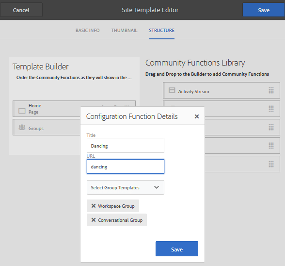

# Modelos de site {#site-templates}

O console Modelos de site é muito semelhante ao console [Modelos de grupo](tools-groups.md), que está focado em funções de interesse para grupos da Comunidade.

>[!NOTE]
>
>Os consoles para a criação de [sites da comunidade](sites-console.md), [modelos de site da comunidade](sites.md), [modelos de grupo da comunidade](tools-groups.md) e [funções da comunidade](functions.md) são para uso somente no ambiente do autor.

## Console de Modelos de Site {#site-templates-console}

No ambiente de criação, para acessar o console de sites da comunidade:

* Na navegação global: **[!UICONTROL Ferramentas > Comunidades > Modelos do site]**

Esse console exibe os modelos a partir dos quais um [site da comunidade](sites-console.md) pode ser criado e permite a criação de novos modelos de site.

## Criar modelo de site {#create-site-template}

Para começar a criar um novo modelo de site, selecione `Create`.

Isso exibirá o painel Editor de sites , que contém três subpainéis:

### Informações básicas {#basic-info}

No painel Informações básicas , um nome, uma descrição e se o modelo está ativado ou desativado são configurados:

* **[!UICONTROL Nome do modelo do site da comunidade]**

   A ID do nome do modelo.

* **[!UICONTROL Descrição do modelo do site da comunidade]**

   A descrição do modelo.

* **[!UICONTROL Desativado/Ativado]**

   Um switch de alternância que controla se o modelo é referenciável.

### Miniatura  {#thumbnail}

(Opcional) Selecione o ícone Fazer upload da imagem para exibir uma miniatura junto com o nome e a descrição para os criadores de sites da comunidade.

### Estrutura {#structure}

Para adicionar funções de comunidade, arraste do lado direito para a esquerda na ordem em que os links de menu do site devem aparecer. Os estilos serão aplicados ao modelo durante a criação do site.

Por exemplo, se você deseja uma página inicial, arraste a função Página da biblioteca e solte no construtor de modelos. Isso resultará na abertura da caixa de diálogo de configuração da página. Consulte o [console de funções](functions.md) para obter informações sobre as caixas de diálogo de configuração.

Continue arrastando e soltando quaisquer outras funções da comunidade desejadas para um site da comunidade com base neste modelo.

A função de página fornece uma página vazia. A função de grupos fornece a capacidade de criar um site de grupo (subcomunidade) no site da comunidade.

>[!CAUTION]
>
>A função de grupos deve *não* ser a *primeira nem a única* função na estrutura do site.
>
>Qualquer outra função, como [page function](functions.md#page-function), deve ser incluída e listada primeiro.

### Modelos de Grupo para a Função de Grupos {#group-templates-for-groups-function}

Ao incluir uma função de grupos no modelo do site, a configuração requer a especificação das opções de modelo de grupo permitidas quando um novo grupo é criado no ambiente de publicação.

>[!CAUTION]
>
>A função Grupos deve *não* ser a *primeira nem a única* função na estrutura do site.

Ao selecionar dois ou mais modelos de grupo da comunidade, uma opção é fornecida ao administrador do grupo ao realmente criar um novo grupo na comunidade.

## Modelo de site de edição {#edit-site-template}

Ao visualizar modelos de site no [console Modelos de site](#site-templates-console) principal, é possível selecionar um modelo de site existente para edição.

Esse processo fornece os mesmos painéis que [criar um modelo de site](#create-site-template).
