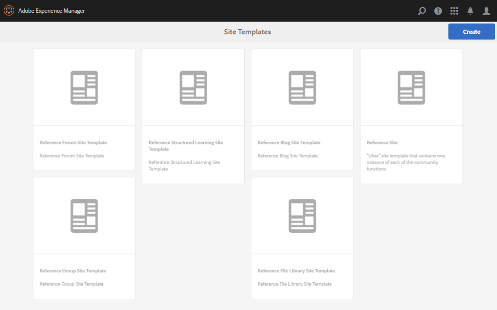

# Modelos de site {#site-templates}

O console Modelos de Site é semelhante ao console [Modelos de Grupo](tools-groups.md), que se concentra em funções de interesse para grupos da Comunidade.

>[!NOTE]
>
>Os consoles para a criação de [sites de comunidade](sites-console.md), [modelos de site de comunidade](sites.md), [modelos de grupo de comunidade](tools-groups.md) e [funções de comunidade](functions.md) são para uso somente no ambiente de autor.

## Console de modelos de site {#site-templates-console}

No ambiente Autor, para acessar o console de sites da comunidade:

* Na navegação global: **[!UICONTROL Ferramentas > Comunidades > Modelos de site]**

Este console exibe os modelos a partir dos quais um [site da comunidade](sites-console.md) pode ser criado e permite que novos modelos de site sejam criados.

## Criar modelo de site {#create-site-template}

Para começar a criar um modelo de site, selecione `Create`.

Isso abre o painel Editor de sites, que contém três subpainéis:

### Informações básicas {#basic-info}

No painel Informações básicas, um nome, uma descrição e se o modelo está ativado ou desativado são configurados:

* **[!UICONTROL Nome do Modelo do Site da Comunidade]**

  A ID do nome do modelo.

* **[!UICONTROL Descrição do modelo de site da comunidade]**

  A descrição do modelo.

* **[!UICONTROL Desabilitado/Habilitado]**

  Um switch que controla se o modelo é referenciável.

### Miniatura  {#thumbnail}

(Opcional) Selecione o ícone Fazer upload da imagem para exibir uma miniatura junto com o nome e a descrição para os criadores de sites da comunidade.

### Estrutura {#structure}

Para adicionar funções da comunidade, arraste do lado direito para o lado esquerdo na ordem em que os links do menu do site devem aparecer. Os estilos são aplicados ao modelo durante a criação do site.

Por exemplo, se você quiser uma página inicial, arraste a função Página da biblioteca e solte-a no construtor de modelos. Isso resulta na abertura da caixa de diálogo de configuração da página. Consulte o [console de funções](functions.md) para obter informações sobre as caixas de diálogo de configuração.

Continue arrastando e soltando quaisquer outras funções da comunidade desejadas para um site da comunidade com base nesse modelo.

A função page fornece uma página vazia. A função Grupos permite criar um site de grupo (subcomunidade) no site de comunidade.

>[!CAUTION]
>
>A função Groups não deve *ser a primeira nem a única função* na estrutura do site.
>
>Qualquer outra função, como a [função de página](functions.md#page-function), deve ser incluída e listada primeiro.

### Função Modelos de grupo para grupos {#group-templates-for-groups-function}

Ao incluir uma função Grupos no modelo de site, a configuração exige a especificação das opções de modelo de grupo permitidas quando um novo grupo é criado no ambiente de publicação.

>[!CAUTION]
>
>A função Groups não deve *ser a primeira nem a única função* na estrutura do site.

Ao selecionar dois ou mais templates do grupo da comunidade, uma escolha é fornecida ao administrador do grupo ao realmente criar um grupo na comunidade.

## Modelo de sites de edição {#edit-site-template}

Ao exibir modelos de site no [console de Modelos de Site](#site-templates-console) principal, é possível selecionar um modelo de site existente para edição.

Este processo fornece os mesmos painéis que [criando um modelo de site](#create-site-template).
