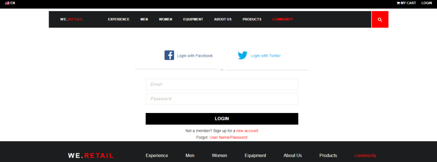

# Logon social com Facebook e Twitter {#social-login-with-facebook-and-twitter}

O login do Social é a capacidade de apresentar a opção de fazer logon em um visitante do site com sua conta do Facebook ou Twitter. Portanto, incluindo dados permitidos do Facebook ou Twitter no perfil de membros AEM.

## Visão geral do logon social {#social-login-overview}

Para incluir o login social, é *necessário* criar aplicativos personalizados do Facebook e do Twitter.

Embora a amostra de varejo no mercado ofereça exemplos de aplicativos do Facebook e Twitter e serviços em nuvem, eles não estão disponíveis em um site [de](../../help/sites-administering/production-ready.md)produção.

As etapas necessárias são:

1. [Ative a autenticação](#adobe-granite-oauth-authentication-handler) OAuth em todas as instâncias de publicação AEM.

   Sem o OAuth ativado, as tentativas de logon falham.

1. **Crie** um aplicativo social e um serviço em nuvem.

   * Para suportar o logon com o Facebook:

      * Crie um aplicativo [do Facebook](#create-a-facebook-app).
      * Crie e publique um serviço [em nuvem do](#create-a-facebook-connect-cloud-service)Facebook Connect.
   * Para suportar o logon com o Twitter:

      * Crie um aplicativo [do Twitter](#create-a-twitter-app).
      * Crie e publique um serviço [em nuvem do](#create-a-twitter-connect-cloud-service)Twitter Connect.

1. [**Ative** o login](#enable-social-login) social para um site da comunidade.

Há dois conceitos básicos:

1. **O escopo** (permissões) especifica os dados que o aplicativo tem permissão para solicitar.

   * Por padrão, as instâncias de Aplicativo e Provedor [OAuth Granite e](#adobe-granite-oauth-application-and-provider) Adobe do Facebook e do Twitter incluem as permissões básicas do aplicativo dentro de seu escopo.

1. **Campos** (params) especifica os dados reais solicitados usando parâmetros de URL.

   * Esses campos são especificados no Provedor [OAuth do](#aem-communities-facebook-oauth-provider) AEM Communities Facebook e no Provedor OAuth do [AEM Communities Twitter](#aem-communities-twitter-oauth-provider).
   * Os campos padrão são suficientes para a maioria dos casos de uso, mas podem ser modificados.

## Logon do Facebook {#facebook-login}

### Versão da API do Facebook {#facebook-api-version}

O logon do Social e a amostra do Facebook no varejo foram desenvolvidos quando a API do Facebook Graph era a versão 1.0.
A partir AEM 6.4 GA e AEM 6.3 SP1 o login social foi atualizado para funcionar com a versão mais recente da API 2.5 do Facebook Graph.

>[!NOTE]
>
>Para versões AEM mais antigas, se você estiver enfrentando uma exceção nos registros **Não é possível extrair um token desta** versão, atualize para o CFP mais recente para essa versão AEM.

Para obter informações sobre a versão da API de gráfico do Facebook, consulte o log de alterações [da API do](https://developers.facebook.com/docs/apps/changelog)Facebook.

### Criar um aplicativo do Facebook {#create-a-facebook-app}

Um aplicativo do Facebook corretamente configurado é necessário para habilitar o logon social do Facebook.

Para criar um aplicativo do Facebook, siga as instruções do Facebook em [https://developers.facebook.com/apps/](https://developers.facebook.com/apps/). As alterações às suas instruções não são refletidas nas seguintes informações.

Em geral, a partir da API do Facebook v2.7:

* *Adicionar um novo aplicativo do Facebook*
   * Para *Plataforma*, escolha Site:
      * Para URL *do* site, insira `  https://<server>:<port>.`
      * Para Nome *de* exibição, insira um título para uso como o Título do serviço de conexão do Facebook.
      * Para *Categoria*, é recomendável escolher *Aplicativos para páginas*, mas pode ser qualquer coisa.
      * *Adicionar produto:  Logon do Facebook*
      * Para URIs de redirecionamento OAuth *válidos*, digite `  https://<server>:<port>.`

>[!NOTE]
>
>Para desenvolvimento, http://localhost:4503 funcionará.

Depois que o aplicativo for criado, localize a ID **[!UICONTROL do]** aplicativo e as configurações de segredo **[!UICONTROL do]** aplicativo. Essas informações são necessárias para configurar o serviço [de nuvem do](#createafacebookcloudservice)Facebook.

### Criar um Cloud Service do Facebook Connect {#create-a-facebook-connect-cloud-service}

A instância de Aplicativo e Provedor [OAuth do](#adobe-granite-oauth-application-and-provider) Adobe Granite, instanciada ao criar uma configuração de serviço em nuvem, identifica o aplicativo do Facebook e os grupos de membros aos quais os novos usuários são adicionados.

1. Na instância do autor AEM, faça logon com privilégios de administrador.
1. Na navegação global, selecione **[!UICONTROL Ferramentas]** > **[!UICONTROL Cloud Services]** > Configuração **[!UICONTROL de logon do]** Facebook Social.
1. Selecione o caminho **[!UICONTROL do]** contexto de configuração.

   **[!UICONTROL O caminho]** de contexto deve ser o mesmo que o caminho de configuração da nuvem selecionado ao criar/editar um site da comunidade.

1. Verifique se o caminho de contexto está habilitado para criar serviços em nuvem abaixo dele.
1. Vá até **[!UICONTROL Ferramentas]** > **[!UICONTROL Geral]** > Navegador **** de configuração. Selecione o contexto e edite as propriedades. Habilite Configurações de nuvem se ainda não estiver habilitado.

   

   * See the [Configuration Browser](/help/sites-administering/configurations.md) documentation for more information.

1. **Criar/editar** a configuração do serviço de nuvem do Facebook.

   

   * **[!UICONTROL Título]** (*obrigatório*) Insira um título de exibição que identifica o aplicativo do Facebook. É recomendável usar o mesmo nome inserido como Nome *de* exibição para o aplicativo do Facebook.
   * **[!UICONTROL ID do aplicativo/chave]** da API (*obrigatório*) Insira a ID ***do*** aplicativo para o aplicativo do Facebook. Isso identifica a instância de Aplicativo e Provedor [OAuth](https://helpx.adobe.com/experience-manager/6-3/communities/using/social-login.html#AdobeGraniteOAuthApplicationandProvider) Granite criada a partir da caixa de diálogo.
   * **[!UICONTROL Segredo]** do aplicativo (*obrigatório*) Insira o segredo ***do*** aplicativo para o aplicativo do Facebook.
   * **[!UICONTROL Criar usuários]** Se marcada, o logon com uma conta do Facebook criará uma entrada de usuário AEM e as adicionará como membro ao(s) grupo(s) de usuários selecionado(s).  O padrão está marcado (altamente recomendado).
   * **[!UICONTROL Mascarar IDs]** de usuário: Deixe desmarcada.
   * **[!UICONTROL Email]** do escopo: a ID de email do usuário deve ser obtida do Facebook.
   * **[!UICONTROL Adicionar a grupos]** de usuários selecione Adicionar grupo de usuários para escolher um ou mais grupos [de](https://helpx.adobe.com/experience-manager/6-3/communities/using/users.html) membros para o site da comunidade ao qual os usuários serão adicionados.

   >[!NOTE]
   >
   >Os grupos podem ser adicionados ou removidos a qualquer momento. Mas as associações de usuários existentes não serão afetadas. A associação automática se aplica somente a novos usuários que estão sendo criados após esta atualização de campo. Para sites nos quais usuários anônimos estão desativados, opte por adicionar usuários ao grupo correspondente de membros da comunidade criado para esse site fechado da comunidade.

   * Select **[!UICONTROL SAVE]**.
   * **[!UICONTROL Publicação]**.

O resultado é uma instância de Aplicativo e Provedor [OAuth](https://helpx.adobe.com/experience-manager/6-3/communities/using/social-login.html#adobe-granite-oauth-application-and-provider) Granite OAuth que não requer modificação adicional a menos que seja adicionado um escopo adicional (permissões). O escopo padrão é as permissões padrão para logon do Facebook. Se desejar um escopo adicional, é necessário editar a configuração do OSGI diretamente. Se houver modificações feitas diretamente pelo sistema/console, evite editar as configurações do serviço de nuvem da interface de usuário do toque para evitar a substituição.

### Provedor OAuth do AEM Communities Facebook {#aem-communities-facebook-oauth-provider}

O provedor AEM Communities estende a instância de Aplicativo e Provedor [OAuth do](#adobe-granite-oauth-application-and-provider) Adobe Granite.

Esse provedor exigirá edição para:

* Permitir atualizações de usuários
* Adicionar campos adicionais [dentro do escopo](#adobe-granite-oauth-application-and-provider)

   * Nem todos os campos permitidos por padrão são incluídos por padrão.

Se a edição for necessária, em cada instância de publicação AEM:

1. Faça logon com privilégios de administrador.
1. Navegue até o Console [da Web](../../help/sites-deploying/configuring-osgi.md). Por exemplo, http://localhost:4503/system/console/configMgr.
1. Localize o AEM Communities Facebook OAuth Provider.
1. Selecione o ícone de lápis para abrir para edição.

   

   * **[!UICONTROL ID do Provedor OAuth]**

      (*Obrigatório*) O valor padrão é *soco-facebook*. Não edite.

   * **[!UICONTROL Configuração de Cloud Service]**

      O valor padrão é `/etc/  cloudservices /  facebookconnect`. Não edite.

   * **[!UICONTROL Configuração do Serviço Provedor OAuth]**

      O valor padrão é `/apps/social/facebookprovider/config/`. Não edite.

   * **[!UICONTROL Ativar tags]**

      Não editar.

   * **[!UICONTROL Caminho do usuário]**

      Localização no repositório onde os dados do usuário são armazenados. Para um site da comunidade, para garantir que os membros tenham permissões para visualização no perfil dos outros, o caminho deve ser o padrão */home/users/community*.

   * **[!UICONTROL Ativar campos]**

      Se marcada, os Campos listados são especificados na solicitação ao Facebook para autenticação de usuário e informações. O padrão é desmarcado.

   * **[!UICONTROL Fields]**

      Quando Campos estão ativados, os seguintes campos são incluídos ao chamar a API de gráfico do Facebook. Os campos devem ser permitidos dentro do escopo definido na configuração do serviço de nuvem. Campos adicionais podem exigir aprovação do Facebook. Consulte a seção Permissões de logon do Facebook na documentação do Facebook. Os campos padrão adicionados como parâmetros são:

      * id
      * name
      * first_name
      * last_name
      * link
      * locale
      * picture
      * fuso horário
      * update_time
      * verified
      * email

   Se algum campo for adicionado ou alterado, atualize a configuração correspondente do manipulador de Sincronização padrão para corrigir o mapeamento.

   * **[!UICONTROL Atualizar usuário]**

      Se marcada, atualiza os dados do usuário no repositório em cada logon para refletir as alterações no perfil ou os dados adicionais solicitados. O padrão está desmarcado.

#### Próximas etapas {#next-steps}

As próximas etapas são as mesmas para o Facebook e Twitter:

* [Publicar as configurações do serviço de nuvem](#publishcloudservices)
* [Ativar para um site da comunidade](#enable-social-login)

## Logon no Twitter {#twitter-login}

### Criar um aplicativo do Twitter {#create-a-twitter-app}

Um aplicativo do Twitter configurado é necessário para ativar o login social do Twitter.

Siga as instruções mais recentes para criar um novo aplicativo do Twitter em [https://apps.twitter.com](https://apps.twitter.com/).

Em geral:

1. Insira um *Nome* que identificará seu aplicativo do Twitter para os usuários do seu site.
1. Informe uma *Descrição*.
1. Para *site* - insira `https://<server>`.
1. Para URL *de* retorno de chamada - insira `https://server`.

   >[!NOTE]
   >
   >Não é necessário especificar a porta.
   >
   >Para desenvolvimento, https://127.0.0.1/ funcionará.

1. Depois que o aplicativo for criado, localize a chave **[!UICONTROL do]** consumidor (API) e o segredo do **[!UICONTROL consumidor (API)]**. Essas informações serão necessárias para configurar o serviço [de nuvem do](#createatwittercloudservice)Twitter.

#### Permissões  {#permissions}

Na seção de permissões do gerenciamento de aplicativos do Twitter:

* **[!UICONTROL Acesso]**: Selecione `Read only`.

   * Outras opções não são suportadas

* **[!UICONTROL Permissões]** adicionais: Opcionalmente, escolha `Request email addresses from users`.

   * Se não estiver selecionado, o perfil do usuário no AEM não incluirá seu endereço de email.
   * As instruções do Twitter anotam outras etapas a serem tomadas.

A única solicitação REST feita para login social é *[GET de credenciais](https://dev.twitter.com/rest/reference/get/account/verify_credentials)* de conta/verificação.

### Criar um Cloud Service do Twitter Connect {#create-a-twitter-connect-cloud-service}

A instância de Aplicativo e Provedor [OAuth](#adobe-granite-oauth-application-and-provider) Granite, instanciada ao criar uma configuração de serviço em nuvem, identifica o aplicativo do Twitter e os grupos de membros aos quais os novos usuários são adicionados.

1. Na instância do autor, faça logon com privilégios de administrador.
1. Na navegação global, selecione **[!UICONTROL Ferramentas]** > **[!UICONTROL Cloud Services]** > Configuração **[!UICONTROL de logon do]** Twitter Social.
1. Escolha a configuração do caminho **[!UICONTROL de]** contexto.

   O caminho de contexto deve ser o mesmo que o caminho de configuração da nuvem selecionado ao criar/editar um site da comunidade.

1. Verifique se o caminho de contexto está habilitado para criar serviços em nuvem abaixo dele.
1. Vá até **[!UICONTROL Ferramentas]** > **[!UICONTROL Geral]** > Navegador **** de configuração. Selecione o contexto e edite as propriedades. Habilite Configurações de nuvem se ainda não estiver habilitado.

   

   * See the [Configuration Browser](/help/sites-administering/configurations.md) documentation for more information.

1. Criar/editar a configuração do serviço de nuvem do Twitter.

   

   * **[!UICONTROL Título]**

      (*Obrigatório*) Insira um título de exibição que identifica o aplicativo do Twitter. É recomendável usar o mesmo nome inserido como Nome *de* exibição para o aplicativo do Twitter.

   * **[!UICONTROL Chave do consumidor]**

      (*Obrigatório*) Digite a chave **de** consumidor (API) para o aplicativo do Twitter. Isso identifica a instância de Aplicativo e Provedor [OAuth](https://helpx.adobe.com/experience-manager/6-3/communities/using/social-login.html#AdobeGraniteOAuthApplicationandProvider) Granite criada a partir da caixa de diálogo.

   * **[!UICONTROL Segredo do consumidor]**

      (*Obrigatório*) Digite o segredo ***de*** consumidor (API) para o aplicativo do Twitter.

   * **[!UICONTROL Criar usuários]**

      Se marcada, fazer logon com uma conta do Twitter criará uma entrada de usuário AEM e as adicionará como membro ao(s) grupo(s) de usuários selecionado(s). O padrão está marcado (altamente recomendado).

   * **[!UICONTROL Mascarar IDs de usuário]**

      Deixe desmarcada.

   * **[!UICONTROL Adicionar aos Grupos de usuários]**

      Selecione Adicionar grupo de usuários para escolher um ou mais grupos [de](https://helpx.adobe.com/experience-manager/6-3/communities/using/users.html) membros para o site da comunidade ao qual os usuários serão adicionados.
   >[!NOTE]
   >
   >Os grupos podem ser adicionados ou removidos a qualquer momento. Mas as associações de usuários existentes não serão afetadas. A associação automática se aplica somente a novos usuários que estão sendo criados após esta atualização de campo. Para sites nos quais usuários anônimos estão desativados, adicione usuários ao grupo correspondente de membros da comunidade criado para esse site fechado da comunidade.

1. Selecione **[!UICONTROL SALVAR]** e **[!UICONTROL Publicar]**.

O resultado é uma instância de Aplicativo e Provedor [OAuth](https://helpx.adobe.com/experience-manager/6-3/communities/using/social-login.html#adobe-granite-oauth-application-and-provider) Granite OAuth que não requer modificação adicional. O escopo padrão é as permissões padrão para logon no Twitter.

### Provedor OAuth do AEM Communities Twitter {#aem-communities-twitter-oauth-provider}

A configuração do AEM Communities estende a instância de Aplicativo e Provedor [OAuth do](#adobe-granite-oauth-application-and-provider) Adobe Granite. Esse provedor precisará de edição para permitir atualizações do usuário.

Se a edição for necessária, em cada instância de publicação AEM:

1. Faça logon com privilégios de administrador.
1. Navegue até o Console [da Web](../../help/sites-deploying/configuring-osgi.md).

   Por exemplo, http://localhost:4503/system/console/configMgr.

1. Localize o AEM Communities Twitter OAuth Provider.
1. Selecione o ícone de lápis para abrir para edição.

   

   * **[!UICONTROL ID do Provedor OAuth]**

   (*Obrigatório*) O valor padrão é *soco -twitter*. Não edite.

   * **[!UICONTROL Configuração de Cloud Service]**

      The default value is *conf.* Não edite.

   * **[!UICONTROL Configuração do Serviço Provedor OAuth]**

      O valor padrão é `/apps/social/twitterprovider/config/`. Não edite.

   * **[!UICONTROL Caminho do usuário]**

      Localização no repositório onde os dados do usuário são armazenados. Para um site da comunidade, para garantir que os membros tenham permissões para visualização no perfil dos outros, o caminho deve ser o padrão `/home/users/community`.

   * **[!UICONTROL Ativar parâmetros]** não editar
   * **[!UICONTROL Parâmetros]** de URL não editam
   * **[!UICONTROL Atualizar usuário]**

      Se marcada, atualiza os dados do usuário no repositório em cada logon para refletir as alterações no perfil ou os dados adicionais solicitados. O padrão é desmarcado.

#### Próximas etapas {#next-steps-1}

As próximas etapas são as mesmas para o Facebook e Twitter:

* [Publicar as configurações do serviço de nuvem](#publishcloudservices)
* [Ativar para um site da comunidade](#enable-social-login)

## Ativar login do Social {#enable-social-login}

### AEM Communities Sites Console {#aem-communities-sites-console}

Depois que um serviço em nuvem é configurado, ele pode ser ativado para a configuração relevante de Logon social para um site da comunidade usando o subpainel Configurações de gerenciamento [de](https://helpx.adobe.com/experience-manager/6-3/communities/using/sites-console.html#USERMANAGEMENT) usuários durante a [criação](https://helpx.adobe.com/experience-manager/6-3/communities/using/sites-console.html#SiteCreation) ou o [gerenciamento](https://helpx.adobe.com/experience-manager/6-3/communities/using/sites-console.html#ModifyingSiteProperties)do site da comunidade.

1. Escolha o contexto de configuração do site no qual você salvou suas configurações de login social.

1. Na guia Geral, defina as configurações da nuvem.

   

1. Na guia Configurações, ative Logons **** sociais e Salvar.

   

## Testar login social {#test-social-login}

* Verifique se [Adobe Granite OAuth Authentication Handler](#adobe-granite-oauth-authentication-handler) foi ativado em todas as instâncias de publicação.
* Verifique se os serviços em nuvem foram publicados.
* Verifique se o site da comunidade foi publicado.
* Inicie o site publicado em um navegador.
Por exemplo, http://localhost:4503/content/sites/engage/en.html
* Selecione **[!UICONTROL Logon]**.
* Selecione **[!UICONTROL Fazer logon com o Facebook]** ou **[!UICONTROL Fazer logon com o Twitter]**.
* Se ainda não tiver feito logon no Facebook ou Twitter, faça logon com as credenciais apropriadas.
* Pode ser necessário conceder permissão dependendo da caixa de diálogo exibida pelo aplicativo do Facebook ou Twitter.
* Observe que a barra de ferramentas na parte superior da página é atualizada para refletir o login bem-sucedido.
* Selecionar **[!UICONTROL Perfil]**: a página Perfil exibe a imagem de avatar, o nome e o sobrenome do usuário. Ele também exibe as informações do perfil do Facebook ou Twitter de acordo com os campos/parâmetros permitidos.

## Configurações OAuth da plataforma AEM {#aem-platform-oauth-configurations}

### Manipulador de Autenticação OAuth do Adobe Granite {#adobe-granite-oauth-authentication-handler}

O não `Adobe Granite OAuth Authentication Handler` está ativado por padrão e ***deve estar ativado em todas as instâncias de publicação AEM.***

Para ativar o manipulador de autenticação na publicação, basta abrir a configuração do OSGi e salvá-la:

* Faça logon com privilégios de administrador.
* Navegue até o Console [da Web](../../help/sites-deploying/configuring-osgi.md).
Por exemplo, http://localhost:4503/system/console/configMgr
* Localize `Adobe Granite OAuth Authentication Handler`.
* Selecione para abrir a configuração para edição.
* Selecione **[!UICONTROL Salvar]**.

>[!CAUTION]
>
>Tenha cuidado para não confundir o manipulador de autenticação com uma instância do Facebook ou Twitter do *Adobe Granite OAuth Application and Provider*.

### Aplicativo e Provedor OAuth do Adobe Granite {#adobe-granite-oauth-application-and-provider}

Quando um serviço em nuvem para Facebook ou Twitter é criado, uma instância do `Adobe Granite OAuth Authentication Handler` é criada.

Para localizar a instância criada para um aplicativo do Facebook ou Twitter:

1. Faça logon com privilégios de administrador.
1. Navegue até o Console [da Web](../../help/sites-deploying/configuring-osgi.md).

   Por exemplo, http://localhost:4503/system/console/configMgr.

1. Localize o Aplicativo e o Provedor OAuth Adobe Granite.

   * Localize a instância em que a ID **[!UICONTROL do]** cliente corresponde à ID **[!UICONTROL do]** aplicativo.

      

      Exceto as seguintes propriedades, deixe as outras propriedades da configuração inalteradas:

   * **[!UICONTROL ID de configuração]**

      (*obrigatório*) As IDs de configuração OAuth devem ser exclusivas. Gerado automaticamente quando o serviço de nuvem é criado.

   * **[!UICONTROL ID do cliente]**

      (*Obrigatório*) O ID da aplicação fornecido quando o serviço de nuvem foi criado.

   * **[!UICONTROL Client Secret]**

      (*Obrigatório*) A senha da aplicação fornecida quando o serviço de nuvem foi criado.

   * **[!UICONTROL Escopo]**

      (*Opcional*) É possível solicitar ao provedor um escopo adicional para o que é permitido. O escopo padrão abrange as permissões necessárias para fornecer autenticação social e dados de perfil.

   * **[!UICONTROL ID do provedor]**

      (*Obrigatório*) A ID do provedor para AEM Communities é definida quando o serviço de nuvem é criado. Não edite. Para o Facebook Connect, o valor é *soco-facebook*. Para o Twitter Connect, o valor é *soco-twitter*.

   * **[!UICONTROL Grupos]**

      (*Recomendado*) Um ou mais grupos de membros aos quais os usuários criados são adicionados. No AEM Communities, é recomendável lista do grupo de membros para o site da comunidade.

   * **[!UICONTROL URL de retorno]**

      (*Opcional*) URL configurado com os provedores OAuth para redirecionar o cliente de volta. Use um url relativo para usar o host da solicitação original. Deixe em branco para usar o URL originalmente solicitado. O sufixo &quot;/callback/j_security_check&quot; é anexado automaticamente a este url.
   >[!NOTE]
   >
   >O domínio do retorno de chamada deve ser registrado com o provedor (Facebook ou Twitter).

Para cada configuração do manipulador de autenticação OAuth, há duas configurações adicionais criadas na instância:

* Manipulador de sincronização padrão do Apache Jackrabbit Oak (org.apache.Jackrabbit.oak.spi.security.authentication.external.impl.DefaultSyncHandler) - Nenhuma edição é necessária, mas você pode verificar se o campo do usuário mapeia como os campos do Facebook são mapeados para um nó de perfil do usuário do CQ. Observe também que &quot;Sync Handler Name&quot; corresponde à ID de configuração da configuração do provedor OAuth.
* Módulo de logon externo do Apache Jackrabbit Oak (org.apache.Jackrabbit.oak.spi.security.authentication.external.impl.ExternalLoginModuleFactory) - Nenhuma edição é necessária aqui, mas você pode notar que &#39;Nome do provedor de identidade&#39; e &#39;Nome do manipulador de sincronização&#39; são iguais e apontam para as configurações correspondentes do manipulador de sincronização e OAuth, respectivamente.

Para obter mais informações, consulte [Autenticação com o Apache Oak External Login Module](https://jackrabbit.apache.org/oak/docs/security/authentication/externalloginmodule.html).

## Desempenho transversal do usuário OAuth {#oauth-user-traversal-performance}

Para sites da comunidade que veem centenas de milhares de usuários se registrarem usando seu login no Facebook ou no Twitter, o desempenho transversal do query executado quando um visitante do site usa seu login social pode ser melhorado com a adição do seguinte índice Oak.

Se forem vistos avisos transversais nos registros, é recomendável adicionar esse índice.

Em uma instância do autor, conectado com privilégios administrativos:

1. Da navegação global: selecione **Ferramentas, [CRX/DE Lite](../../help/sites-developing/developing-with-crxde-lite.md).**
1. Crie um índice chamado ntBaseLucene-oauth a partir de uma cópia de ntBaseLucene:

   * No nó `/oak:index`
   * Selecionar nó `ntBaseLucene`
   * Selecionar **[!UICONTROL cópia]**
   * Selecionar `/oak:index`
   * Selecionar **[!UICONTROL colar]**
   * Renomear cópia de ntBaseLucene como `ntBaseLucene-oauth`

1. Modifique as propriedades do nó ntBaseLucene-oauth:

   * **[!UICONTROL indexPath]**: `/oak:index/ntBaseLucene-oauth`
   * **[!UICONTROL name]**: `oauthid-123****`
   * **[!UICONTROL reindexar]**: `true`
   * **[!UICONTROL reindexCount]**: `1`

1. Em node /oak:index/ntBaseLucene-oauth/indexRules/nt:base/properties:

   * Exclua todos os nós filhos, exceto cqTags.
   * Renomear cqTags como `oauthid-123****`
   * Modificar as propriedades do nó `oauthid-123****`

      * **[!UICONTROL name]**: `oauthid-123****`
   * Selecione **[!UICONTROL Salvar tudo]**.

* Para o **nome** `oauthid-123`, substitua *123* pela ID ***do*** aplicativo do Facebook ou Chave ***do*** consumidor do Twitter (API) que é o valor da ID do **cliente na configuração do aplicativo e do provedor OAuth OA**  Granite.

   

Para obter informações e ferramentas adicionais, consulte [Oak Query and Indexing](../../help/sites-deploying/queries-and-indexing.md).

## Configuração do Dispatcher {#dispatcher-configuration}

Consulte [Configuração do Dispatcher para Comunidades](dispatcher.md).
