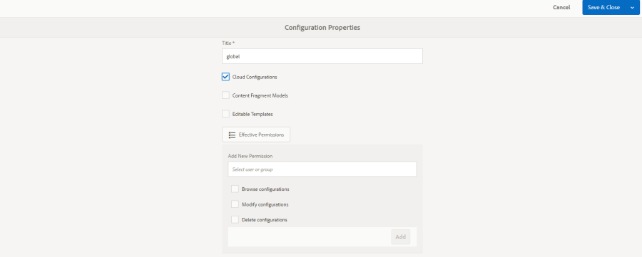

# Logon social com Facebook e Twitter {#social-login-with-facebook-and-twitter}

O logon social é a capacidade de apresentar a um visitante do site a opção de fazer logon com sua conta do Facebook ou do Twitter. Portanto, incluindo dados permitidos do Facebook ou do Twitter em seu perfil de membro do AEM.

## Visão geral do logon social {#social-login-overview}

Para incluir logon social, é *necessário* criar aplicativos personalizados do Facebook e do Twitter.

Embora a amostra do we-retail forneça aplicativos de amostra do Facebook e do Twitter e serviços em nuvem, eles não estão disponíveis em um [site de produção](../../help/sites-administering/production-ready.md).

As etapas necessárias são:

1. [Habilite a ](#adobe-granite-oauth-authentication-handler) autenticação OAuth em todas as instâncias de publicação AEM.

   Sem o OAuth habilitado, as tentativas de fazer logon falham.

1. **** Crie um aplicativo social e um serviço em nuvem.

   * Para suportar o logon com o Facebook:

      * Crie um [aplicativo do Facebook](#create-a-facebook-app).
      * Crie e publique um [serviço em nuvem do Facebook Connect](#create-a-facebook-connect-cloud-service).
   * Para suportar o logon com o Twitter:

      * Crie um [aplicativo do Twitter](#create-a-twitter-app).
      * Crie e publique um [Serviço de nuvem do Twitter Connect](#create-a-twitter-connect-cloud-service).

1. [**** Habilite o ](#enable-social-login) logon social para um site da comunidade.

Há dois conceitos básicos:

1. **O escopo**  (permissões) especifica os dados que o aplicativo pode solicitar.

   * Por padrão, as instâncias do aplicativo e do provedor OAuth do Facebook e do Twitter [Adobe Granite e ](#adobe-granite-oauth-application-and-provider) incluem as permissões básicas do aplicativo no escopo.

1. **Fields**  (params) especifica os dados reais solicitados usando parâmetros de URL.

   * Esses campos são especificados em [AEM Communities Facebook OAuth Provider](#aem-communities-facebook-oauth-provider) e [AEM Communities Twitter OAuth Provider](#aem-communities-twitter-oauth-provider).
   * Os campos padrão são suficientes para a maioria dos casos de uso, mas podem ser modificados.

## Logon do Facebook {#facebook-login}

### Versão da API do Facebook {#facebook-api-version}

O logon social e a amostra do Facebook de varejo foram desenvolvidos quando a API do gráfico do Facebook era a versão 1.0.
A partir AEM 6.4 GA e AEM 6.3 SP1 o login social foi atualizado para funcionar com a versão mais recente da API de gráfico do Facebook 2.5.

>[!NOTE]
>
>Para versões de AEM mais antigas, se estiver enfrentando uma exceção em logs **Não é possível extrair um token desse**, atualize para o CFP mais recente para essa versão AEM.

Para obter as informações de versão da API do Facebook Graph, consulte o [log de alterações da API do Facebook](https://developers.facebook.com/docs/apps/changelog).

### Criar um aplicativo do Facebook {#create-a-facebook-app}

Um aplicativo do Facebook corretamente configurado é necessário para ativar o logon social do Facebook.

Para criar um aplicativo do Facebook, siga as instruções do Facebook em [https://developers.facebook.com/apps/](https://developers.facebook.com/apps/). As alterações às suas instruções não são refletidas nas informações seguintes.

Em geral, a partir da API do Facebook v2.7:

* *Adicionar um novo aplicativo do Facebook*
   * Para *Plataforma*, escolha Site:
      * Para *URL do Site*, digite `  https://<server>:<port>.`
      * Para *Display Name*, insira um título para usar como o Título do serviço de conexão do Facebook.
      * Para *Categoria*, é recomendável escolher *Aplicativos para páginas*, mas pode ser qualquer coisa.
      * *Adicionar produto: Logon do Facebook*
      * Para *URIs de redirecionamento OAuth válidos*, digite `  https://<server>:<port>.`

>[!NOTE]
>
>Para desenvolvimento, http://localhost:4503 funcionará.

Depois que o aplicativo for criado, localize as configurações **[!UICONTROL ID do aplicativo]** e **[!UICONTROL Segredo do aplicativo]**. Essas informações são necessárias para configurar o [serviço de nuvem do Facebook](#createafacebookcloudservice).

### Criar um Cloud Service de conexão do Facebook {#create-a-facebook-connect-cloud-service}

A instância [Adobe Granite OAuth Application and Provider](#adobe-granite-oauth-application-and-provider), instanciada ao criar uma configuração de serviço de nuvem, identifica o aplicativo do Facebook e os grupos de membros aos quais os novos usuários são adicionados.

1. Na instância do autor do AEM, faça logon com privilégios de administrador.
1. Na navegação global, selecione **[!UICONTROL Ferramentas]** > **[!UICONTROL Cloud Services]** > **[!UICONTROL Configuração de logon do Facebook Social]**.
1. Selecione o **[!UICONTROL caminho de contexto]** da configuração.

   **[!UICONTROL O]** caminho de contexto deve ser o mesmo do caminho de configuração de nuvem que você selecionou ao criar/editar um site de comunidade.

1. Verifique se o caminho do contexto está habilitado para criar serviços em nuvem abaixo dele.
1. Vá para **[!UICONTROL Ferramentas]** > **[!UICONTROL Geral]** > **[!UICONTROL Navegador de configuração]**. Selecione o contexto e edite as propriedades. Ative as Configurações da nuvem se ainda não estiverem ativadas.

   

   * Consulte a documentação do [Navegador de configuração](/help/sites-administering/configurations.md) para obter mais informações.

1. **Criar/** editar a configuração do serviço de nuvem do Facebook.

   

   * **[!UICONTROL Título]**  (*Obrigatório*) Insira um título de exibição que identifique o aplicativo do Facebook. É recomendável usar o mesmo nome inserido como *Nome de exibição* para o aplicativo do Facebook.
   * **[!UICONTROL ID do aplicativo/Chave da API]**  (*Obrigatório*) Insira a  ***ID do*** aplicativo para o aplicativo do Facebook. Isso identifica a instância [Adobe Granite OAuth Application and Provider](https://helpx.adobe.com/experience-manager/6-3/communities/using/social-login.html#AdobeGraniteOAuthApplicationandProvider) criada a partir da caixa de diálogo.
   * **[!UICONTROL Segredo do aplicativo]**  (*Obrigatório*) Insira a  ***Secretaria do*** aplicativo para o aplicativo do Facebook.
   * **[!UICONTROL Criar]** usuáriosSe marcada, o logon com uma conta do Facebook criará uma entrada de usuário AEM e a adicionará como membro ao(s) grupo(s) de usuários selecionado(s).  O padrão está marcado (altamente recomendado).
   * **[!UICONTROL Mascarar IDs de usuário]**: Deixe desmarcada.
   * **[!UICONTROL Email]** do escopo: a id de email do usuário deve ser obtida do Facebook.
   * **[!UICONTROL Adicionar a]** grupos de usuários selecione Adicionar grupo de usuários para escolher um ou mais grupos de  [membros ](https://helpx.adobe.com/experience-manager/6-3/communities/using/users.html) para o site da comunidade ao qual os usuários serão adicionados.

   >[!NOTE]
   >
   >Os grupos podem ser adicionados ou removidos a qualquer momento. Mas as associações de usuários existentes não serão afetadas. A associação automática se aplica somente a novos usuários que estão sendo criados após essa atualização de campo. Para Sites onde usuários anônimos estão desativados, escolha adicionar usuários ao grupo correspondente de membros da comunidade criado para esse site fechado da comunidade.

   * Selecione **[!UICONTROL SAVE]**.
   * **[!UICONTROL Publicação]**.

O resultado é uma instância [Adobe Granite OAuth Application and Provider](https://helpx.adobe.com/experience-manager/6-3/communities/using/social-login.html#adobe-granite-oauth-application-and-provider) que não requer mais modificação a menos que seja adicionado um escopo adicional (permissões). O escopo padrão são as permissões padrão para logon do Facebook. Se desejar um escopo adicional, é necessário editar a configuração do OSGI diretamente. Se houver modificações feitas diretamente pelo sistema/console, evite editar as configurações do serviço de nuvem da interface do usuário de toque para evitar sobreposição.

### Provedor OAuth do AEM Communities do Facebook {#aem-communities-facebook-oauth-provider}

O provedor AEM Communities estende a instância [Adobe Granite OAuth Application and Provider](#adobe-granite-oauth-application-and-provider).

Este provedor precisará ser editado para:

* Permitir atualizações do usuário
* Adicionar campos adicionais [dentro do escopo](#adobe-granite-oauth-application-and-provider)

   * Nem todos os campos permitidos por padrão são incluídos por padrão.

Se a edição for necessária, em cada instância de publicação de AEM:

1. Faça logon com privilégios de administrador.
1. Navegue até [Console da Web](../../help/sites-deploying/configuring-osgi.md). Por exemplo, http://localhost:4503/system/console/configMgr.
1. Localize AEM Communities Facebook OAuth Provider.
1. Selecione o ícone de lápis para abrir para edição.

   

   * **[!UICONTROL ID do provedor OAuth]**

      (*Obrigatório*) O valor padrão é *soco -facebook*. Não edite.

   * **[!UICONTROL Cloud Service Config]**

      O valor padrão é `/etc/  cloudservices /  facebookconnect`. Não edite.

   * **[!UICONTROL Configuração do Serviço de Provedor OAuth]**

      O valor padrão é `/apps/social/facebookprovider/config/`. Não edite.

   * **[!UICONTROL Ativar Tags]**

      Não editar.

   * **[!UICONTROL Caminho do usuário]**

      Localização no repositório onde os dados do usuário são armazenados. Para um site da comunidade, para garantir que os membros visualizem o perfil um do outro, o caminho deve ser o padrão */home/users/community*.

   * **[!UICONTROL Ativar campos]**

      Se marcada, os Campos listados são especificados na solicitação para o Facebook para autenticação de usuário e informações. O padrão é desmarcado.

   * **[!UICONTROL Fields]**

      Quando os Campos são ativados, os seguintes campos são incluídos ao chamar a API de gráfico do Facebook. Os campos devem ser permitidos dentro do escopo definido na configuração do serviço de nuvem. Campos adicionais podem exigir aprovação pelo Facebook. Consulte a seção Permissões de logon do Facebook da documentação do Facebook. Os campos padrão adicionados como parâmetros são:

      * id
      * name
      * first_name
      * last_name
      * link
      * locale
      * picture
      * fuso horário
      * update_time
      * verificado
      * email

   Se qualquer campo for adicionado ou alterado, atualize a configuração do manipulador de Sincronização padrão correspondente para corrigir o mapeamento.

   * **[!UICONTROL Atualizar usuário]**

      Se marcada, atualiza os dados do usuário no repositório em cada logon para refletir as alterações de perfil ou os dados adicionais solicitados. O padrão está desmarcado.

#### Próximas etapas {#next-steps}

As próximas etapas são as mesmas para Facebook e Twitter:

* [Publicar as configurações do serviço de nuvem](#publishcloudservices)
* [Habilitar para um site da comunidade](#enable-social-login)

## Logon do Twitter {#twitter-login}

### Criar um aplicativo do Twitter {#create-a-twitter-app}

Um aplicativo do Twitter configurado é necessário para ativar o logon social do Twitter.

Siga as instruções mais recentes para criar um novo aplicativo do Twitter em [https://apps.twitter.com](https://apps.twitter.com/).

Em geral:

1. Insira um *Name* que identificará seu aplicativo do Twitter para os usuários do seu site.
1. Insira um *Description*.
1. Para *site* - digite `https://<server>`.
1. Para *Callback URL* - digite `https://server`.

   >[!NOTE]
   >
   >Não é necessário especificar a porta.
   >
   >Para desenvolvimento, https://127.0.0.1/ funcionará.

1. Depois que o aplicativo for criado, localize a **[!UICONTROL Chave do consumidor (API)]** e **[!UICONTROL Segredo do consumidor (API)]**. Essas informações serão necessárias para configurar o [serviço de nuvem do Twitter](#createatwittercloudservice).

#### Permissões  {#permissions}

Na seção de permissões do gerenciamento de aplicativos do Twitter:

* **[!UICONTROL Acesso]**: Selecione  `Read only`.

   * Outras opções não são compatíveis

* **[!UICONTROL Permissões]** adicionais: Opcionalmente, escolha  `Request email addresses from users`.

   * Se não estiver selecionado, o perfil do usuário no AEM não incluirá seu endereço de email.
   * As instruções do Twitter apontam outras etapas a serem seguidas.

A única solicitação REST feita para logon social é para *[GET account/verify credentials](https://dev.twitter.com/rest/reference/get/account/verify_credentials)*.

### Criar um Cloud Service de conexão do Twitter {#create-a-twitter-connect-cloud-service}

A instância [Adobe Granite OAuth Application and Provider](#adobe-granite-oauth-application-and-provider), instanciada ao criar uma configuração de serviço de nuvem, identifica o aplicativo do Twitter e os grupos de membros aos quais os novos usuários são adicionados.

1. Na instância do autor, faça logon com privilégios de administrador.
1. Na navegação global, selecione **[!UICONTROL Ferramentas]** > **[!UICONTROL Cloud Services]** > **[!UICONTROL Configuração de logon do Twitter Social]**.
1. Escolha a configuração **[!UICONTROL context path]**.

   O Caminho do contexto deve ser o mesmo do caminho de configuração da nuvem selecionado ao criar/editar um site da comunidade.

1. Verifique se o caminho do contexto está habilitado para criar serviços em nuvem abaixo dele.
1. Vá para **[!UICONTROL Ferramentas]** > **[!UICONTROL Geral]** > **[!UICONTROL Navegador de configuração]**. Selecione o contexto e edite as propriedades. Ative as Configurações da nuvem se ainda não estiverem ativadas.

   

   * Consulte a documentação do [Navegador de configuração](/help/sites-administering/configurations.md) para obter mais informações.

1. Criar/editar a configuração do serviço de nuvem do Twitter.

   

   * **[!UICONTROL Título]**

      (*Obrigatório*) Insira um título de exibição que identifique o aplicativo do Twitter. É recomendável usar o mesmo nome inserido como *Nome de exibição* para o aplicativo do Twitter.

   * **[!UICONTROL Chave do consumidor]**

      (*Obrigatório*) Insira a **Chave do consumidor (API)** para o aplicativo do Twitter. Isso identifica a instância [Adobe Granite OAuth Application and Provider](https://helpx.adobe.com/experience-manager/6-3/communities/using/social-login.html#AdobeGraniteOAuthApplicationandProvider) criada a partir da caixa de diálogo.

   * **[!UICONTROL Segredo do consumidor]**

      (*Obrigatório*) Insira o ***Segredo do Consumidor(API)*** para o Aplicativo do Twitter.

   * **[!UICONTROL Criar usuários]**

      Se marcada, fazer logon com uma conta do Twitter criará uma entrada de usuário AEM e a adicionará como membro ao(s) grupo(s) de usuários selecionado(s). O padrão está marcado (altamente recomendado).

   * **[!UICONTROL Mascarar IDs de usuário]**

      Deixe desmarcada.

   * **[!UICONTROL Adicionar aos Grupos de usuários]**

      Selecione Adicionar grupo de usuários para escolher um ou mais [grupos de membros](https://helpx.adobe.com/experience-manager/6-3/communities/using/users.html) para o site da comunidade ao qual os usuários serão adicionados.
   >[!NOTE]
   >
   >Os grupos podem ser adicionados ou removidos a qualquer momento. Mas as associações de usuários existentes não serão afetadas. A associação automática se aplica somente a novos usuários que estão sendo criados após essa atualização de campo. Para Sites onde usuários anônimos estão desativados, adicione usuários ao grupo de membros da comunidade correspondente criado para esse site fechado da comunidade.

1. Selecione **[!UICONTROL SAVE]** e **[!UICONTROL Publish]**.

O resultado é uma instância [Adobe Granite OAuth Application and Provider](https://helpx.adobe.com/experience-manager/6-3/communities/using/social-login.html#adobe-granite-oauth-application-and-provider) que não requer modificação adicional. O escopo padrão são as permissões padrão para logon no Twitter.

### Provedor OAuth do AEM Communities Twitter {#aem-communities-twitter-oauth-provider}

A configuração do AEM Communities estende a instância [Adobe Granite OAuth Application and Provider](#adobe-granite-oauth-application-and-provider). Este provedor precisará de edição para permitir atualizações de usuário.

Se a edição for necessária, em cada instância de publicação de AEM:

1. Faça logon com privilégios de administrador.
1. Navegue até [Console da Web](../../help/sites-deploying/configuring-osgi.md).

   Por exemplo, http://localhost:4503/system/console/configMgr.

1. Localize AEM Communities Twitter OAuth Provider.
1. Selecione o ícone de lápis para abrir para edição.

   

   * **[!UICONTROL ID do provedor OAuth]**

   (*Obrigatório*) O valor padrão é *soco -twitter*. Não edite.

   * **[!UICONTROL Cloud Service Config]**

      O valor padrão é *conf.* Não edite.

   * **[!UICONTROL Configuração do Serviço de Provedor OAuth]**

      O valor padrão é `/apps/social/twitterprovider/config/`. Não edite.

   * **[!UICONTROL Caminho do usuário]**

      Localização no repositório onde os dados do usuário são armazenados. Para um site da comunidade, para garantir permissões para os membros visualizarem o perfil um do outro, o caminho deve ser o `/home/users/community` padrão.

   * **[!UICONTROL Ativar]** parâmetros não editar
   * **[!UICONTROL Parâmetros]** de URL não editam
   * **[!UICONTROL Atualizar usuário]**

      Se marcada, atualiza os dados do usuário no repositório em cada logon para refletir as alterações de perfil ou os dados adicionais solicitados. O padrão é desmarcado.

#### Próximas etapas {#next-steps-1}

As próximas etapas são as mesmas para Facebook e Twitter:

* [Publicar as configurações do serviço de nuvem](#publishcloudservices)
* [Habilitar para um site da comunidade](#enable-social-login)

## Ativar o logon social {#enable-social-login}

### Console de sites da AEM Communities {#aem-communities-sites-console}

Depois que um serviço em nuvem é configurado, ele pode ser ativado para a configuração relevante de Logon social de um site da comunidade usando o subpainel [Gerenciamento de usuários](https://helpx.adobe.com/experience-manager/6-3/communities/using/sites-console.html#USERMANAGEMENT) Configurações durante o site da comunidade [criação](https://helpx.adobe.com/experience-manager/6-3/communities/using/sites-console.html#SiteCreation) ou [gerenciamento](https://helpx.adobe.com/experience-manager/6-3/communities/using/sites-console.html#ModifyingSiteProperties).

1. Escolha o contexto de configuração do site em que você salvou as configurações de logon social.

1. Na guia General , defina as configurações da nuvem.

   

1. Na guia Configurações , ative **[!UICONTROL Logons sociais]** e Salvar.

   

## Testar logon social {#test-social-login}

* Verifique se [Adobe Granite OAuth Authentication Handler](#adobe-granite-oauth-authentication-handler) foi ativado em todas as instâncias de publicação.
* Verifique se os serviços de nuvem foram publicados.
* Certifique-se de que o site da comunidade foi publicado.
* Inicie o site publicado em um navegador.
Por exemplo, http://localhost:4503/content/sites/engage/en.html
* Selecione **[!UICONTROL Iniciar Sessão]**.
* Selecione **[!UICONTROL Fazer logon com o Facebook]** ou **[!UICONTROL Fazer logon com o Twitter]**.
* Se ainda não tiver feito logon no Facebook ou no Twitter, faça logon com as credenciais apropriadas.
* Pode ser necessário conceder permissão dependendo da caixa de diálogo exibida pelo aplicativo do Facebook ou Twitter.
* Observe que a barra de ferramentas na parte superior da página é atualizada para refletir o logon bem-sucedido.
* Selecione **[!UICONTROL Perfil]**: a página Perfil exibe a imagem de avatar, o nome e o sobrenome do usuário. Também exibe as informações do perfil do Facebook ou do Twitter de acordo com os campos/parâmetros permitidos.

## AEM configurações OAuth da plataforma {#aem-platform-oauth-configurations}

### Manipulador de Autenticação OAuth do Adobe Granite {#adobe-granite-oauth-authentication-handler}

O `Adobe Granite OAuth Authentication Handler` não está habilitado por padrão e ***deve estar habilitado em todas as instâncias de publicação AEM.***

Para ativar o manipulador de autenticação na publicação, basta abrir a configuração do OSGi e salvá-la:

* Faça logon com privilégios de administrador.
* Navegue até [Console da Web](../../help/sites-deploying/configuring-osgi.md).
Por exemplo, http://localhost:4503/system/console/configMgr
* Localize `Adobe Granite OAuth Authentication Handler`.
* Selecione para abrir a configuração para edição.
* Selecione **[!UICONTROL Salvar]**.

>[!CAUTION]
>
>Tenha cuidado para não confundir o manipulador de autenticação com uma instância do Facebook ou Twitter de *Adobe Granite OAuth Application and Provider*.

### Aplicativo e provedor OAuth do Adobe Granite {#adobe-granite-oauth-application-and-provider}

Quando um serviço em nuvem para Facebook ou Twitter é criado, uma instância de `Adobe Granite OAuth Authentication Handler` é criada.

Para localizar a instância criada para um aplicativo do Facebook ou Twitter:

1. Faça logon com privilégios de administrador.
1. Navegue até [Console da Web](../../help/sites-deploying/configuring-osgi.md).

   Por exemplo, http://localhost:4503/system/console/configMgr.

1. Localize o aplicativo e provedor OAuth do Adobe Granite.

   * Localize a instância em que **[!UICONTROL ID do cliente]** corresponde ao **[!UICONTROL ID do aplicativo]**.

      

      Exceto as seguintes propriedades, deixe as outras propriedades da configuração inalteradas:

   * **[!UICONTROL ID de configuração]**

      (*As IDs de configuração OAuth necessárias*) devem ser exclusivas. Gerado automaticamente quando o serviço de nuvem é criado.

   * **[!UICONTROL ID do cliente]**

      (*Obrigatório*) A ID do aplicativo fornecida quando o serviço de nuvem foi criado.

   * **[!UICONTROL Client Secret]**

      (*Obrigatório*) O segredo do aplicativo fornecido quando o serviço de nuvem foi criado.

   * **[!UICONTROL Escopo]**

      (*Opcional*) O escopo adicional para o que é permitido pode ser perguntado ao provedor. O escopo padrão abrange as permissões necessárias para fornecer autenticação social e dados de perfil.

   * **[!UICONTROL ID do provedor]**

      (*Obrigatório*) A ID do provedor do AEM Communities é definida quando o serviço de nuvem é criado. Não edite. Para Facebook Connect, o valor é *soco -facebook*. Para o Twitter Connect, o valor é *soco -twitter*.

   * **[!UICONTROL Grupos]**

      (*Recomendado*) Um ou mais grupos de membros aos quais os usuários criados são adicionados. Para o AEM Communities, é recomendável listar o grupo de membros para o site da comunidade.

   * **[!UICONTROL URL de retorno]**

      (*Opcional*) URL configurado com os provedores OAuth para redirecionar o cliente de volta. Use um url relativo para usar o host da solicitação original. Deixe em branco para usar o URL solicitado originalmente. O sufixo &quot;/callback/j_security_check&quot; é anexado automaticamente a este url .
   >[!NOTE]
   >
   >O domínio para o retorno de chamada deve ser registrado com o provedor (Facebook ou Twitter).

Para cada configuração do manipulador de autenticação OAuth, há duas configurações adicionais criadas na instância:

* Manipulador de sincronização padrão do Apache Jackrabbit Oak (org.apache.jackrabbit.oak.spi.security.authentication.external.impl.DefaultSyncHandler) - Nenhuma edição é necessária, mas você pode observar o campo de usuário mapeia como os campos do Facebook são mapeados para um nó de perfil de usuário do CQ. Observe também que &quot;Sync Handler Name&quot; corresponde à ID de configuração da configuração do provedor OAuth.
* Módulo de logon externo do Apache Jackrabbit Oak (org.apache.jackrabbit.oak.spi.security.authentication.external.impl.ExternalLoginModuleFactory) - Nenhuma edição é necessária lá, mas você pode notar que &#39;Nome do provedor de identidade&#39; e &#39;Nome do manipulador de sincronização&#39; são iguais e apontam para configurações do manipulador de sincronização e OAuth correspondentes, respectivamente.

Para obter mais informações, consulte [Autenticação com o Apache Oak External Login Module](https://jackrabbit.apache.org/oak/docs/security/authentication/externalloginmodule.html).

## Desempenho de passagem do usuário do OAuth {#oauth-user-traversal-performance}

Para sites da comunidade que veem centenas de milhares de usuários se registrarem usando seu login do Facebook ou do Twitter, o desempenho de travessia do query executado quando um visitante do site usa seu login social pode ser melhorado adicionando o seguinte índice Oak.

Se avisos transversais forem vistos nos logs, é recomendável adicionar esse índice.

Em uma instância de autor, conectado com privilégios administrativos:

1. Na navegação global: selecione **Ferramentas, [CRX/DE Lite](../../help/sites-developing/developing-with-crxde-lite.md).**
1. Crie um índice chamado ntBaseLucene-oauth a partir de uma cópia de ntBaseLucene:

   * No nó `/oak:index`
   * Selecione o nó `ntBaseLucene`
   * Selecione **[!UICONTROL Copiar]**
   * Selecionar `/oak:index`
   * Selecione **[!UICONTROL Colar]**
   * Renomear cópia de ntBaseLucene para `ntBaseLucene-oauth`

1. Modifique as propriedades do nó ntBaseLucene-oauth:

   * **[!UICONTROL indexPath]**:  `/oak:index/ntBaseLucene-oauth`
   * **[!UICONTROL name]**: `oauthid-123****`
   * **[!UICONTROL reindexar]**:  `true`
   * **[!UICONTROL reindexCount]**:  `1`

1. Em node /oak:index/ntBaseLucene-oauth/indexRules/nt:base/properties:

   * Exclua todos os nós secundários, exceto cqTags.
   * Renomeie cqTags para `oauthid-123****`
   * Modifique as propriedades do nó `oauthid-123****`

      * **[!UICONTROL name]**:  `oauthid-123****`
   * Selecione **[!UICONTROL Salvar tudo]**.

* Para o **nome** `oauthid-123`, substitua *123* pelo ***App ID*** ou pelo Twitter ***Consumer (API) Key*** que é o valor do **Client ID** no [Adobe Configuração do Granite OAuth Application e Provider](social-login.md#adobe-granite-oauth-application-and-provider).

   

Para obter informações e ferramentas adicionais, consulte [Consultas e Indexação do Oak](../../help/sites-deploying/queries-and-indexing.md).

## Configuração do Dispatcher {#dispatcher-configuration}

Consulte [Configuração do Dispatcher para Comunidades](dispatcher.md).
