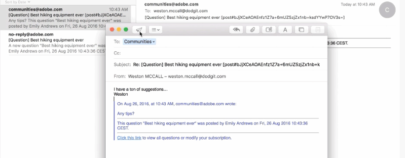

# Assinaturas das Comunidades {#communities-subscriptions}

## Visão geral {#overview}

A partir das Comunidades [FP1](deploy-communities.md#latestfeaturepack), os membros da comunidade podem interagir com a comunidade por email usando um recurso conhecido como assinaturas.

As assinaturas são semelhantes a [notificações](notifications.md), pois os membros podem se inscrever ao seguir artigos do blog, tópicos do fórum ou perguntas sobre QnA.

O que diferencia assinaturas de notificações é:

* Os membros não podem se inscrever quando estiverem seguindo outros membros.
* A única ação a ser executada pelos membros é selecionar `Email Subscriptions` ao seguir.
* Quando a resposta por e-mail é configurada, os membros podem postar conteúdo efetivamente simplesmente respondendo ao e-mail recebido.

### Requisitos {#requirements}

**Configurar Email**

O email deve ser configurado para que as assinaturas sejam funcionais e para que os membros respondam por email.

Para obter instruções sobre como configurar emails, consulte [Configurando Email](email.md).

**Habilitar Assinaturas e Seguir**

Os componentes devem ser configurados para habilitar as assinaturas *e* a seguir. Os recursos que permitem assinaturas são [blog](blog-feature.md), [fórum](forum.md) e [QnA](working-with-qna.md).

## Assinaturas do Seguinte {#subscriptions-from-following}

O botão **Seguir** fornece um meio de seguir entradas como atividades, assinaturas e/ou notificações. Sempre que o botão **Seguir** é selecionado, é possível ativar ou desativar uma seleção.

Se qualquer método de acompanhamento for selecionado, o texto do botão será alterado para **Seguinte**. Para maior comodidade, é possível selecionar `Unfollow All` para desligar todos os métodos.

O botão **Seguir** incluirá a opção `Email Subscriptions` somente quando um fórum, QnA ou blog for configurado para habilitar assinaturas de email. Esse botão aparecerá:

* Na página principal do recurso do fórum, QnA ou blog ativado, enviará um email para todas as atividades sob esse recurso.

* Para uma entrada específica, como um tópico do fórum, pergunta do QnA ou artigo do blog Enviará um email quando houver atividade para essa entrada específica.

## Responder por e-mail {#reply-by-email}

Quando o email estiver [configurado para resposta por email](email.md#configure-polling-importer), o membro que se inscreveu receberá um email com o conteúdo postado e um link para o conteúdo online.

Se responderem ao email, o conteúdo inserido na resposta será exibido como conteúdo online.

O tempo necessário para que uma resposta seja postada é controlado pelo [intervalo de atualização do importador de sondagem](email.md#configure-polling-importer).

