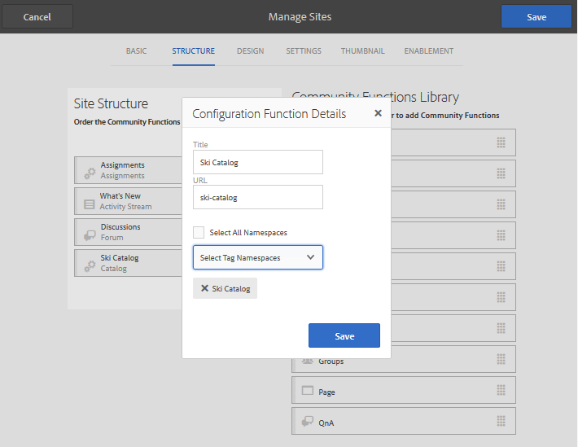

# Marcar recursos de ativação {#tagging-enablement-resources}

## Visão geral {#overview}

A marcação dos recursos de ativação permite filtrar recursos e caminhos de aprendizagem conforme os membros navegam [catálogos](functions.md#catalog-function).

Essencialmente:

* [Criar um ](../../help/sites-administering/tags.md#creating-a-namespace) namespace de tag para cada catálogo

   * [Definir permissões de tag](../../help/sites-administering/tags.md#setting-tag-permissions)
   * Apenas para membros da comunidade (comunidade fechada)

      * Permitir acesso de leitura para o [grupo de membros do site da comunidade](users.md#publish-group-roles)
   * Para qualquer visitante do site, independentemente de ter feito logon ou ser anônimo (comunidade aberta)

      * Permitir acesso de leitura para o grupo `Everyone`
   * [Publicar as tags](../../help/sites-administering/tags.md#publishing-tags)

* [Definir o escopo das tags para um site da comunidade](sites-console.md#tagging)

   * [Configurar catálogos que existem na estrutura do site](functions.md#catalog-function)

      * Pode adicionar tags à instância do catálogo para controlar a lista de tags apresentadas nos filtros da interface do usuário.
      * Pode adicionar [pré-filtros](catalog-developer-essentials.md#pre-filters), para restringir os recursos incluídos de um catálogo.

* [Publicar o site da comunidade](sites-console.md#publishing-the-site)
* [Aplique tags para ativar ](resources.md#create-a-resource) recursos, mas elas podem ser filtradas categoricamente
* [Publicar os recursos de ativação](resources.md#publish)

## Tags de site da comunidade {#community-site-tags}

Ao criar ou editar um site da comunidade, a [Configuração de marcação](sites-console.md#tagging) define o escopo das tags disponíveis para os recursos do site selecionando um subconjunto de namespaces de tags existentes.

Embora as tags possam ser criadas e adicionadas ao site da comunidade a qualquer momento, é recomendável projetar uma taxonomia antecipadamente, de forma semelhante à criação de um banco de dados. Consulte [Uso de tags](../../help/sites-authoring/tags.md).

Posteriormente, ao adicionar tags a um site da comunidade existente, é necessário salvar a edição antes de poder adicionar a nova tag a uma função de catálogo na estrutura do site.

Para um site da comunidade, depois que o site é publicado e as tags são publicadas, é necessário habilitar o acesso de leitura aos membros da comunidade. Consulte [Definir permissões de tag](../../help/sites-administering/tags.md#setting-tag-permissions).

Veja a seguir como ele aparece no CRXDE quando um administrador aplica permissões de leitura a `/etc/tags/ski-catalog` para o grupo `Community Enable Members`.

## Namespaces de tag de catálogo {#catalog-tag-namespaces}

O recurso de catálogo usa tags para se definir. Ao configurar a função de catálogo em um site da comunidade, o conjunto de namespaces de tag a serem escolhidos é definido pelo escopo de namespaces de tag definidos para o site da comunidade.

A função Catálogo inclui uma configuração de tag que define as tags listadas na interface do usuário de filtro do catálogo. A configuração &quot;Todos os namespaces&quot; refere-se ao escopo dos namespaces de tags selecionados para o site da comunidade.

## Aplicação de tags a recursos de ativação {#applying-tags-to-enablement-resources}

Os recursos de ativação e os caminhos de aprendizado aparecerão em todos os catálogos quando `Show in Catalog` estiver marcado. Adicionar tags aos recursos e caminhos de aprendizagem permitirá a filtragem prévia em catálogos específicos, bem como a filtragem na interface do usuário do catálogo.

Restringir os recursos de ativação e os caminhos de aprendizado para catálogos específicos é feito criando [pré-filtros](catalog-developer-essentials.md#pre-filters).

A interface do usuário do catálogo permite que os visitantes apliquem um filtro de tags à lista de recursos e caminhos de aprendizado que aparecem nesse catálogo.

O administrador que aplica as tags aos recursos de ativação deve estar ciente dos namespaces de tags associados aos catálogos, bem como da taxonomia para selecionar uma subtag para uma categorização mais refinada.

Por exemplo, se um namespace `ski-catalog` foi criado e definido em um catálogo chamado `Ski Catalog`, ele pode ter duas tags-filho: `lesson-1` e `lesson-2`.

Assim, qualquer recurso de ativação marcado com um dos seguintes itens:

* catálogo de esqui:lição-1
* catálogo de esqui:lição-2

aparecerá em `Ski Catalog` após a publicação do recurso de ativação.

## Exibindo o catálogo na publicação {#viewing-catalog-on-publish}

Depois que tudo tiver sido configurado no ambiente de criação e publicado, a experiência de usar o catálogo para encontrar recursos de ativação poderá ser sentida no ambiente de publicação.

Se nenhum namespace de tag for exibido no menu suspenso, verifique se as permissões foram definidas corretamente no ambiente de publicação.

Se os namespaces de tag foram adicionados e estiverem ausentes, verifique se as tags e o site foram publicados novamente.

Se nenhum recurso de ativação for exibido depois de selecionar uma tag ao visualizar o catálogo, verifique se há uma tag do(s) namespace(s) do catálogo aplicada(s) ao recurso de ativação.

