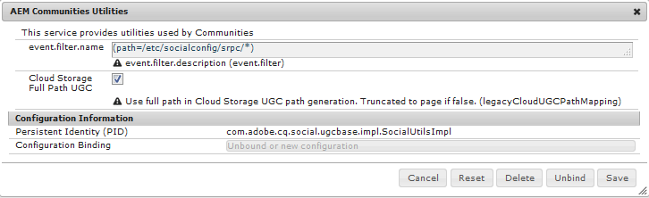

# Atualização para comunidades do AEM 6.5 {#upgrading-to-aem-communities}

Dependendo da topologia e dos recursos de cada site, as seguintes ações podem ser necessárias ao atualizar para o AEM Communities 6.5 ou instalar o pacote de recursos mais recente.

Esta seção é específica para as Comunidades e complementa as informações fornecidas em [Atualização para o AEM 6.5](/help/sites-deploying/upgrade.md) (plataforma).

## Atualização do AEM 6.1 ou posterior {#upgrading-from-aem-or-later}

### Reindexar Solr {#reindex-solr}

Ao instalar um novo pacote de recursos das Comunidades em uma implantação configurada com MSRP, será necessário:

1. Instale o [pacote de recursos mais recente](/help/communities/deploy-communities.md#latestfeaturepack).
1. Instale o [arquivos de configuração Solr mais recentes](/help/communities/msrp.md#upgrading).
1. Reindexar MSRP consulte a seção [Ferramenta Reindexação MSRP](/help/communities/msrp.md#msrp-reindex-tool).

## Atualização do AEM 6.0 {#upgrading-from-aem}

Se for necessário manter o UGC pré-existente, o meio de fazer isso dependerá se a implantação armazenou o UGC [no local](#on-premise-storage) ou no [nuvem de Adobe](#adobe-cloud-storage).

### Armazenamento em nuvem Adobe {#adobe-cloud-storage}

Se o site atualizado foi configurado para usar o armazenamento na nuvem do Adobe, pode parecer (incorretamente) que todo o UGC foi perdido, pois os métodos SRP não conseguirão localizar o UGC pré-existente no local antigo.

Portanto, há a capacidade de instruir o ASRP a usar `AEM 6.0 compatability-mode` para acessar o UGC.

Para todas as instâncias de autor e publicação do AEM 6.3:

* Faça logon com privilégios de administrador.
* Configurar [ASRP](/help/communities/asrp.md).
* Siga estas etapas para tornar visível o UGC pré-existente:

   * Navegue até o console da Web:

      * Por exemplo, [https://&lt;host>:&lt;port>/system/console/configMgr](https://localhost:4502/system/console/configMgr)

      * Localizar **Utilitários AEM Communities** configuração.
      * Selecione para expandir o painel de configuração:

         * *Desmarcar* `Cloud Storage`

         * Selecione **Salvar**

      

### Armazenamento no local {#on-premise-storage}

Se o site atualizado não usou o armazenamento na nuvem, qualquer UGC pré-existente deve ser convertido para se adequar à nova estrutura introduzida nas comunidades AEM 6.1 em apoio ao armazenamento comum.

Para essa finalidade, uma ferramenta de migração de código aberto está disponível no GitHub:
[Ferramenta de migração UGC do AEM Communities](https://github.com/Adobe-Marketing-Cloud/communities-ugc-migration)

### APIs Java {#java-apis}

Ao atualizar de comunidades sociais do AEM 6.0 para comunidades do AEM 6.3, esteja ciente de que muitas APIs foram reorganizadas em pacotes diferentes. A maioria deve ser facilmente resolvida ao usar um IDE para personalização de recursos de Comunidades.

Para obter detalhes sobre o pacote SocialUtils obsoleto, visite [Refatoração de SocialUtils](/help/communities/socialutils.md).

Consulte também [Uso do Maven para comunidades](/help/communities/maven.md).

### Nenhum modelo de componente JSP {#no-jsp-component-templates}

A variável [estrutura da componente social](/help/communities/scf.md) (SCF) utiliza o [HandlebarsJS](https://handlebarsjs.com/) (HBS) linguagem de modelo no lugar do Java Server Pages (JSP) usada antes do AEM 6.0.

No AEM 6.0, os componentes JSP permaneceram ao lado dos novos componentes da estrutura HBS no mesmo local, com os componentes HBS normalmente localizados em subpastas chamadas &quot;hbs&quot;.

A partir do AEM 6.1, os componentes JSP foram completamente removidos. Para Comunidades, é recomendável substituir todo o uso de componentes JSP por componentes SCF.

## Ferramenta de migração UGC do AEM Communities {#aem-communities-ugc-migration-tool}

A variável [Ferramenta de migração UGC do AEM Communities](https://github.com/Adobe-Marketing-Cloud/communities-ugc-migration) O é uma ferramenta de migração de código aberto, disponível no GitHub, que pode ser personalizada para exportar UGC de versões anteriores de comunidades sociais de AEM e importar para o AEM Communities 6.1 ou posterior.

Além de mover o UGC de versões anteriores, também é possível usar a ferramenta para mover o UGC de um [SRP](/help/communities/working-with-srp.md) para outro, como de MSRP para DSRP.

## Atualização do AEM 5.6.1 ou anterior {#upgrading-from-aem-or-earlier}

Conceitualmente, há três gerações de componentes de comunidades:

**Ger 1**: Aproximadamente CQ 5.4 a AEM 5.6.0, esses são os **collab** componentes que armazenaram o UGC no repositório local usando a replicação como meio de sincronizar o UGC entre plataformas. Outras diferenças envolvem a implementação usando Java Server Pages (JSP), bem como o recurso de blog que consiste em criar somente no ambiente de criação.

**Ger 2**: Do AEM 5.6.1 ao AEM 6.1, esta é uma combinação de **collab** e **social** componentes. O AEM 6.0 apresentou o novo [estrutura da componente social](/help/communities/scf.md) (SCF) e o AEM 6.2 introduziram um [armazenamento de UGC comum](/help/communities/working-with-srp.md) em que o UGC é acessado usando um [provedor de recursos de armazenamento](/help/communities/srp.md) (SRP)

**Ger 3**: A partir do AEM 6.2, há apenas **social** componentes, implementados no SCF como componentes Handlebars (HBS) que exigem a escolha de SRP para UGC.
