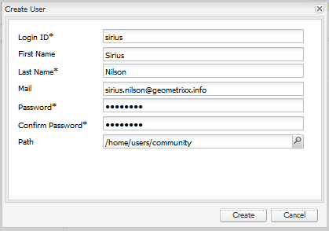

# Gerenciando usuários e grupos de usuários {#managing-users-and-user-groups}

## Visão geral {#overview}

No AEM Communities, no ambiente de publicação, os usuários podem se registrar e editar seus perfis. Dadas as permissões apropriadas, elas também podem:

* Crie subcomunidades no site da comunidade (consulte [grupos da comunidade](creating-groups.md)).

* [](moderation.md) Moderar o conteúdo gerado pelo usuário (UGC).

* Ser contatos [do recurso de ativação](resources.md).

* Seja [privilegiado](#privileged-members-group) para criar entradas para blogs, calendários, QnA e fóruns.

Os usuários registrados no ambiente de publicação são geralmente chamados de *membros da comunidade (membros)* para diferenciá-los de *usuários* no ambiente de criação.

As permissões são concedidas atribuindo membros a um dos grupos [membro (usuário) ](#publish-group-roles) criados dinamicamente quando o site da comunidade é [criado](sites-console.md) ou [modificado](sites-console.md#modifying-site-properties) a partir do ambiente do autor. Ao trabalhar a partir do ambiente de criação, os membros são visíveis no ambiente de publicação por meio do [túnel service](#tunnel-service).

Por design, os membros e grupos de membros criados no ambiente de publicação não devem aparecer no ambiente do autor. Usuários e grupos de usuários criados no ambiente de criação têm o objetivo de permanecer no ambiente de criação.

Quando os usuários no autor e os membros no Publish vêm da mesma lista de usuários, como sincronizados do mesmo diretório LDAP, eles não são considerados o mesmo usuário com as mesmas permissões e associação de grupo nos ambientes do autor e de publicação. As funções dos membros e dos utilizadores devem ser estabelecidas separadamente em matéria de publicação e de autor, conforme adequado.

Para um [farm de publicação](topologies.md), o registro e as modificações feitas em uma instância de publicação precisam ser sincronizados com outras instâncias de publicação para que elas tenham acesso aos mesmos dados do usuário. Para obter detalhes, consulte [Sincronização de Usuário](sync.md), que inclui uma seção que descreve [O que acontece quando...](sync.md#what-happens-when).

### Limites de contribuição {#contribution-limits}

Para proteger contra spam, é possível limitar a frequência de publicação de conteúdo dos membros. Além disso, é possível limitar automaticamente as contribuições dos novos membros registrados.

Para obter detalhes, consulte [Limites de contribuição do membro](limits.md).

### Grupos de usuários criados dinamicamente {#dynamically-created-user-groups}

Quando um novo site da comunidade é criado, novos grupos de usuários são criados dinamicamente com ids exclusivas (uid) e permissões apropriadas para várias funções administrativas necessárias para gerenciar o site da comunidade no ambiente de criação (consulte [Funções do grupo de autores](#author-group-roles)) ou no ambiente de publicação (consulte [Publicar funções do grupo](#publish-group-roles)).

Os nomes dos grupos são gerados a partir do nome dado ao site durante [criação do site da comunidade](sites-console.md#step13asitetemplate). As ids exclusivas evitam nomear conflitos para sites de comunidade e grupos de comunidade com nomes semelhantes no mesmo servidor.

Por exemplo, se o nome do site fosse &quot;*engagement*&quot; para um site intitulado &quot;We.Retail Engage&quot;, um dos grupos de usuários criados seria:

* Membros *Envolver* da comunidade

## Ambiente de criação {#author-environment}

### Serviço de túnel {#tunnel-service}

Ao usar o ambiente de criação para [criar sites](sites-console.md), [modificar propriedades do site](sites-console.md#modifying-site-properties) e [gerenciar membros da comunidade e grupos de membros](members.md), é necessário acessar usuários e grupos de usuários registrados no ambiente de publicação.

O serviço de túnel fornece esse acesso usando o agente de replicação do autor.

* Para obter detalhes, consulte [instruções de configuração](deploy-communities.md#tunnel-service-on-author) na página de implantação.

Os [consoles Membros e grupos de comunidades](members.md) são para o único objetivo de gerenciar usuários (membros) e grupos de usuários (grupos de membros) registrados somente no ambiente de publicação.

Para gerenciar usuários e grupos de usuários registrados no ambiente de criação, use o [Console de segurança](../../help/sites-administering/security.md)

### Funções do Grupo de Autores {#author-group-roles}

| Se Membro do Grupo... | Função principal |
|---|---|
| administradores | O grupo de administradores consiste em administradores de sistema que têm todas as capacidades de um Administrador da Comunidade, bem como a capacidade de gerenciar o grupo Administradores da Comunidade. |
| Administradores da comunidade | O grupo Administradores da comunidade torna-se automaticamente membro de todos os sites da comunidade e de quaisquer grupos da comunidade criados no site. Um membro inicial do grupo Administradores da Comunidade é o grupo de administradores. No ambiente de criação, os administradores da comunidade podem criar sites da comunidade, gerenciar sites, gerenciar membros (eles podem banir membros da comunidade) e moderar conteúdo. |
| Comunidade &lt;*nome do site*> Sitecontentmanager | O Gerente de conteúdo do site da comunidade pode executar a criação tradicional de AEM, a criação de conteúdo e a modificação de páginas para um site da comunidade. |
| Gerentes de ativação da comunidade | O grupo Gerentes de ativação da comunidade consiste em usuários que estão disponíveis para atribuição para gerenciar o grupo Gerentes de ativação de um site da comunidade. |
| Comunidade &lt;*nome do site* > Siteenablementmanager | O grupo Community Site Enablement Managers consiste em usuários que foram atribuídos para gerenciar a ativação de um site da comunidade [resources](resources.md). |
| Nenhum | Um visitante anônimo do site pode não acessar o ambiente do autor. |

### Administradores do sistema {#system-administrators}

Os membros do grupo de administradores são administradores de sistema que podem executar a configuração inicial de uma instalação AEM para os ambientes de autor e publicação.

Para fins de demonstração e desenvolvimento, o grupo de administradores tem um membro cujo ID de usuário é *admin* e a senha é *admin*.

Para ambientes de produção, o grupo de administradores padrão deve ser modificado.

Certifique-se de seguir a [Lista de Verificação de Segurança](../../help/sites-administering/security-checklist.md).

## Ambiente de publicação {#publish-environment}

### Tornando-se um Membro {#becoming-a-member}

No ambiente de publicação, dependendo das [configurações](sites-console.md#user-management) do site da comunidade, um visitante do site pode se tornar um membro da comunidade:

* Quando o site da comunidade é privado (fechado):
   * Por convite
   * Por ações de um administrador

* Quando o site da comunidade for público (aberto):
   * Por autoregistro
   * Por logon social com o Facebook e o Twitter

>[!NOTE]
>
>Se um visitante do site se registrar como membro de um site aberto da comunidade, ele se tornará automaticamente membro de outros sites abertos da comunidade no mesmo ambiente de publicação.

### Publicar funções de grupo {#publish-group-roles}

| Se Membro do Grupo... | Função principal |
|---|---|
| Comunidade &lt;*nome do site* Membros | Um membro do site da comunidade é um usuário registrado. Eles podem fazer logon, modificar o perfil, ingressar em um grupo aberto da comunidade, publicar conteúdo na comunidade, enviar mensagens para outros membros e seguir as atividades do site. |
| Moderadores de comunidade &lt;*nome do site*> | Um moderador de site da comunidade é um membro da comunidade confiável que pode moderar o UGC em massa, usando o console de moderação ou no contexto, na página em que o conteúdo é publicado. |
| Comunidade &lt;*nome do site*> &lt;*nome do grupo*> Membros | Um membro do grupo da comunidade é um membro da comunidade que ingressou em um grupo aberto da comunidade ou foi convidado para um grupo fechado da comunidade. Eles têm as habilidades de um membro para esse grupo da comunidade dentro do site. |
| Comunidade &lt;*nome do site* Grupos de administradores | Um administrador de grupo de sites da comunidade é um membro confiável da comunidade que está atribuído para criar e gerenciar subcomunidades (grupos) em um site da comunidade. Inclui a capacidade de fornecer moderação no contexto. |
| *Grupo de Segurança de Membros Privados* | Um grupo de usuários criado e mantido manualmente para restringir a criação de conteúdo. Consulte [Grupo de Membros Privados](#privileged-members-group). |
| Nenhum | Um visitante anônimo do site, que descobre o site, pode visualizar e pesquisar sites da comunidade que permitem acesso anônimo. Para participar e publicar conteúdo, o usuário deve se registrar automaticamente (se permitido) e se tornar um membro da comunidade. |

### Atribuindo Membros para Publicar Funções de Grupo {#assigning-members-to-publish-group-roles}

Quando [criar um site da comunidade](sites-console.md) no ambiente de criação, ou quando [modificar propriedades do site,](sites-console.md#modifying-site-properties) os membros podem receber várias funções executadas no ambiente de publicação, como moderadores, administradores de grupo, contatos de recursos ou membros privilegiados.

[Ativar o ](sync.md#accessingpublishusersfromauthor) serviço de túnel resulta em opções de atribuição apresentadas de membros em publicação, em vez de usuários em autor.

Os membros selecionados serão automaticamente atribuídos ao [grupo apropriado](#publish-group-roles) e suas associações serão incluídas quando o site da comunidade for (re)publicado.

### Grupo de membros privilegiados {#privileged-members-group}

A finalidade de um grupo de segurança de membros privilegiados é restringir a criação de conteúdo para determinadas funções da comunidade a um subconjunto privilegiado de membros de um site da comunidade.

O grupo de membros privilegiados é um grupo de membros criado e gerenciado usando o [console Grupos de Comunidades](members.md).

Depois que um grupo de membros privilegiados é criado, e com o [serviço de túnel ativado](sync.md#accessingpublishusersfromauthor), a estrutura de um site da comunidade existente pode ser [modificada](sites-console.md#modify-structure) para editar a configuração de suas funções de comunidade como &#39;Permitir Membros Privilegiados&#39; e adicionar o grupo criado.

As funções da comunidade que permitem especificar um ou mais grupos de membros privilegiados são:

* [Função do blog](functions.md#blog-function)  - Para restringir a criação de novos artigos.
* [Função de calendário](functions.md#calendar-function)  - Para restringir a criação de novos eventos.
* [Função do fórum](functions.md#forum-function)  - Para restringir a criação de novos tópicos.
* [Função QnA](functions.md#qna-function)  - Para restringir a criação de novas perguntas.

Quando uma função da comunidade não é protegida (nenhum grupo de membros privilegiados é atribuído), todos os membros do site da comunidade podem criar conteúdo de recurso (artigos, eventos, tópicos, perguntas).

>[!NOTE]
>
>Adicionar um usuário a um grupo de membros privilegiados de um site da comunidade somente lhes concederá privilégios de criação se também forem membros desse mesmo site da comunidade.

## Criação de membros da comunidade {#creating-community-members}

### Localização do Repositório {#repository-location}

Para que determinados recursos funcionem corretamente, é necessário criar usuários e grupos de usuários com os privilégios apropriados.

Quando os membros são criados em `/home/users/community`, eles herdam as ACLs adequadas que dão privilégios de leitura aos perfis dos membros.

Da mesma forma, grupos de usuários personalizados da comunidade (como grupos de membros privilegiados) devem ser criados em `/home/groups/community`.

Usar os [consoles Membros e grupos de comunidades](members.md) criará usuários e grupos nesses caminhos.

Para especificar um caminho personalizado, é necessário usar a interface de usuário de segurança clássica, que pode ser acessada em [https://&lt;server>:&lt;port>/useradmin](http://localhost:4503/useradmin).

Para conceder privilégios de leitura para caminhos de membro personalizados, em todas as instâncias de publicação defina ACLs semelhantes a `/home/users/community`:

```xml
<allow
  jcr:primaryType="rep:GrantACE"
  rep:principalName="everyone"
  rep:privileges="{Name}[jcr:read]" >
  <rep:restrictions
    jcr:primaryType="rep:Restrictions"
    rep:glob="*/profile*" />
</allow>
```

Para conceder os privilégios adequados para caminhos de grupos de membros personalizados, como /home/groups/mycompany, em todas as instâncias de publicação defina ACLs semelhantes a `/home/groups/community`:

```xml
<allow
  jcr:primaryType="rep:GrantACE"
  rep:principalName="community-administrators"
  rep:privileges="{Name}[jcr:read]"  />
```

### Consoles {#consoles}

Há quatro consoles separados disponíveis apenas no ambiente do autor:

| console | Ferramentas, Segurança, Usuários | Ferramentas, segurança, grupos | Comunidades, Membros | Comunidades, Grupos |
|----------|-----------------------|------------------------|------------------------------------------------------------|------------------------------------------------------------|
| gerenciadores | usuários no autor | grupos de usuários no autor | membros ao publicar | grupos de membros ao publicar |
| exige | permissão de administrador | permissão de administrador | permissão de administrador, serviço de túnel, sincronização de usuário para o farm de publicação | permissão de administrador, serviço de túnel, sincronização de usuário para o farm de publicação |

### Função do gerenciador de ativação da comunidade {#community-enablement-manager-role}

A capacidade de um visitante do site se registrar automaticamente normalmente não é permitida para uma [comunidade de ativação](overview.md#enablement-community), pois há custos associados a cada membro. Os aprendentes e os recursos de ativação são gerenciados por um usuário atribuído à função [de ](#author-group-roles) `enablement manager` [durante a criação do site](sites-console.md#enablement) no autor (adicionado como membro do grupo `Community <site-name> Siteenablementmanagers`). O `enablement manager` também é responsável por [atribuir recursos de aprendizagem](resources.md) aos membros da comunidade no autor.

Somente os usuários que são membros do grupo global `Community Enablement Managers` podem ser selecionados como um `enablement manager` para um site de comunidade específico.

Para criar um usuário que possa receber a função de `Community Site Enablement Manager`, use o console de segurança da interface clássica para especificar o caminho:

Em uma instância do autor:

1. Conectado com privilégios de administrador, navegue até o console de segurança da interface clássica.

   Por exemplo, [http://localhost:4502/useradmin](http://localhost:4502/useradmin)

2. No menu Editar, selecione **[!UICONTROL Criar usuário]**.
3. Preencha a caixa de diálogo `Create User`.
   * O caminho deve ser `/home/users/community`.
4. Selecione **[!UICONTROL Criar]**.

   

* No painel esquerdo, pesquise pelo usuário recém-criado e selecione para exibir no painel direito.

   

No painel esquerdo:

1. Desmarque a caixa de pesquisa e selecione **[!UICONTROL Ocultar usuários]**.
2. Localize e arraste `community-enablementmanagers` até a guia **[!UICONTROL Grupos]** do novo usuário exibido no painel direito.

   

### Função de administradores da comunidade {#community-administrators-role}

Conforme declarado no gráfico [Funções do Grupo de Autores](#author-group-roles), os membros do grupo Administradores da Comunidade podem criar sites da comunidade, gerenciar sites, gerenciar membros (eles podem banir membros da comunidade) e moderar conteúdo.

Siga as mesmas etapas que criar e atribuir um usuário à função de [gerenciador de ativação](#communitysiteenablementmanagerrole), mas adicione o grupo c `ommunity-administrators` na guia Grupos do usuário.

### Integração LDAP {#ldap-integration}

AEM suporta o uso do LDAP para autenticação de usuários, bem como a criação de contas de usuários. Isso é detalhado em [Configuração do LDAP com AEM 6](../../help/sites-administering/ldap-config.md).

A seguir estão alguns detalhes de configuração específicos para membros da comunidade e grupos de membros.

1. Configure o LDAP para cada instância de publicação de AEM.
2. [O provedor de identidade LDAP](../../help/sites-administering/ldap-config.md#configuring-the-ldap-identity-provider)

   * Sem instruções especiais

3. [O Manipulador de Sincronização](../../help/sites-administering/ldap-config.md#configuring-the-synchronization-handler)

   * Defina as seguintes propriedades:

      * **[!UICONTROL Associação]** automática do usuário:  `community-<site name>-<uid>-members`
      * **[!UICONTROL Prefixo]** do caminho do usuário:  `/community`
      * **[!UICONTROL Prefixo]** do caminho do grupo:  `/community`

4. [O módulo de logon externo](../../help/sites-administering/ldap-config.md#the-external-login-module)

   * sem instruções especiais

Isso faz com que os usuários sejam automaticamente atribuídos ao grupo de membros do site da comunidade e o local do repositório seja `/home/users/community` e `/home/groups/community`, de modo que herdem as permissões apropriadas para ver o perfil de um do outro.

* O valor `User auto membership` deve ser a propriedade `rep:authorizableId`, não o `givenName` (nome de exibição) do perfil.

## Sincronizar usuários entre instâncias AEM {#synchronizing-users-among-aem-instances}

Ao usar um [publish farm](topologies.md), certifique-se de que os usuários tenham o mesmo caminho em cada instância de publicação importando os usuários primeiro para uma instância e [permitindo a sincronização do usuário](sync.md) para o Sling distribuir os usuários para as outras instâncias de publicação.

Ao importar grupos de usuários, para garantir que os grupos de usuários tenham o mesmo caminho em cada instância de publicação, importe para uma instância e [crie um pacote](../../help/sites-administering/package-manager.md#creating-a-new-package) para exportação e instale esse pacote em todas as outras instâncias de publicação.

Embora a sincronização de grupos de usuários por meio da sincronização de usuários seja incluída em uma versão futura, atualmente, somente a *associação* de um grupo de usuários será sincronizada quando a sincronização de usuários for executada.

## Sobre grupos da comunidade {#about-community-groups}

Ao discutir grupos, há dois tópicos distintos:

* **[Grupos da comunidade](overview.md#communitygroups)**

   Grupos da comunidade são subcomunidades que podem ser criadas no ambiente de publicação de um site da comunidade que suporta a criação de grupos da comunidade. A criação de um grupo da comunidade resulta em mais páginas adicionadas ao site e são gerenciadas de maneira semelhante ao site da comunidade principal. Para obter mais informações, visite [Community Group Essentials](essentials-groups.md) para desenvolvedores e [Community Group](creating-groups.md) para autores.

* **[Grupos de membros](../../help/sites-administering/security.md)**

   Grupos de membros são os grupos aos quais os membros podem pertencer e são gerenciados por meio do console Grupos . Grande parte da discussão desta página foi dedicada aos grupos de membros. Os grupos de membros criados automaticamente para um site da comunidade, que têm o prefixo *`Community`*, podem ser chamados de grupos da comunidade, portanto, o contexto da discussão deve ser considerado.
