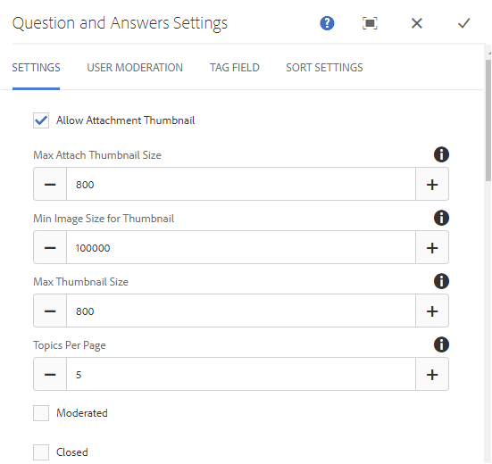

# Recurso do fórum de perguntas e respostas{#q-a-forum-feature}

## Introdução {#introduction}

O recurso de fórum QnA (perguntas e respostas) fornece uma área para os membros da comunidade fazerem e responderem perguntas. Ele permite que os membros:

* Criar perguntas
* Adicionar imagens em linha (com suporte para arrastar e soltar)
* Exibir e responder perguntas
* Pesquisar uma pergunta
* Ajudar a moderar o conteúdo de QnA
* Identificar as melhores respostas
* Mover perguntas de QnA de uma página para outra

A documentação descreve:

* Adicionando o recurso de fórum QnA a um site AEM.
* Definições de configuração para o `QnA`componente.

## Adicionar um fórum de perguntas e respostas a uma página {#adding-a-q-a-forum-to-a-page}

Para adicionar um `QnA` para uma página no modo de autor, use o navegador de componentes para localizar `Communities / QnA` e arraste-o para o local em uma página onde o fórum QnA deve aparecer.

Para obter as informações necessárias, visite [Noções básicas sobre componentes das comunidades](/help/communities/basics.md).

Quando a variável [bibliotecas obrigatórias do lado do cliente](/help/communities/qna-essentials.md#essentials-for-client-side) são incluídos, é assim que a variável `QnA` é exibido:

### Configurar QnA {#configuring-qna}

Selecione o colocado `QnA` para que você possa acessar e selecionar o `Configure` ícone que abre a caixa de diálogo de edição.

#### Guia Configurações {#settings-tab}

No **Configurações** especifique as configurações para tópicos (perguntas) e respostas (respostas):

* **Permitir miniatura do anexo**

  Se marcada, uma miniatura da imagem anexada é criada.

* **Tamanho máximo da miniatura do anexo**

  Tamanho máximo (em pixels) da imagem em miniatura do anexo. O valor padrão é 800 x 800.

* **Tamanho mínimo de imagem para a miniatura**

  Tamanho mínimo (em bytes) da imagem para gerar a miniatura para imagens integradas. O valor padrão é 100.000 bytes (100 kb).

* **Tamanho máximo da miniatura**

  Tamanho máximo (em pixels) da imagem em miniatura para imagem integrada. O valor padrão é 800 x 800.

* **Tópicos por página**

  Define o número de perguntas/postagens exibidas por página. O padrão é 10.

* **Moderado**

  Se marcados, a postagem de tópicos e comentários deve ser aprovada antes de serem exibidos em um site de publicação. O padrão está desmarcado.

* **Fechado**

  Se marcado, o fórum será fechado para novas perguntas e comentários. O padrão está desmarcado.

* **Editor de Rich Text**

  Se marcados, os tópicos e comentários podem ser inseridos com marcação. O padrão está desmarcado.

* **Permitir marcação**

  Se marcados, permitem que os membros adicionem rótulos de tag às suas publicações (consulte **Campo de tag** guia ). O padrão está desmarcado.

* **Permitir carregamentos de arquivo**

  Se marcado, permite que anexos de arquivo sejam adicionados à pergunta ou ao comentário. O padrão está desmarcado.

* **Permitir acompanhamento**

  Se marcado, inclui o seguinte recurso para publicações do fórum, o que permite que os membros sejam [notificado](/help/communities/notifications.md) de novos posts. O padrão está desmarcado.

* **Permitir fixação**

  Se marcados, os tópicos do fórum poderão ser fixados no topo da lista de tópicos. O padrão está desmarcado.

* **Permitir assinaturas de email**

  Se marcado, permitir que os membros sejam notificados sobre novas publicações por email ([subscrição](/help/communities/subscriptions.md)). Exige que a opção Permitir monitoramento seja marcada e [email configurado](/help/communities/email.md). O padrão está desmarcado.

* **Tamanho máximo do arquivo**

  Relevante apenas se `Allow File Uploads` está marcado. Este campo limita o tamanho (em bytes) de um arquivo carregado. O padrão é 104857600 (10 Mb).

* **Tipos de arquivo permitidos**

  Relevante apenas se `Allow File Uploads` está marcado. Uma lista separada por vírgulas de extensões de arquivo com o separador &quot;ponto&quot;. Por exemplo: .jpg, .jpeg, .png, .doc, .docx, .pdf. Se algum tipo de arquivo for especificado, os não especificados não poderão ser carregados. O padrão é nenhum especificado, de modo que **all** tipos de arquivo são permitidos.

* **Tamanho máximo do arquivo de imagem a ser anexado**

  Relevante somente se Permitir uploads de arquivo estiver marcado. O número máximo de bytes que um arquivo de imagem carregado pode ter. O padrão é 2097152 (2 Mb).

* **Permitir respostas**

  Se marcado, permite respostas aos comentários postados na pergunta. O padrão está desmarcado.

* **Permitir votação**

  Se marcado, inclui o recurso Votação com uma pergunta. O padrão está desmarcado.

* **Permitir que usuários excluam comentários e tópicos**

  Se marcado, permite que os membros excluam os comentários e perguntas publicados. O padrão está desmarcado.

* **Permitir membros privilegiados**

  Se marcado, somente os membros Privilegiados poderão criar conteúdo.

* **Bloquear conteúdo gerado pelo usuário no modo Edição do autor**

  Se estiver ativado, bloqueia o conteúdo gerado pelo usuário ao editar no Modo Autor.

* **Mover a resposta selecionada para cima**

  Se marcada, a primeira resposta mostrada será uma resposta selecionada. O padrão está desmarcado.
* **Exibir selos**

  Se marcado, exibir ganho e atribuído [medalhas](/help/communities/implementing-scoring.md) com uma entrada de blog do membro. O padrão está desmarcado.

* **Permitir conteúdo em destaque**

  Se marcada, a ideia é identificável como [conteúdo em destaque](/help/communities/featured.md). O padrão está desmarcado.

* **Ativar a menção**

  Se ativado, permite que os usuários registrados da comunidade identifiquem outros membros registrados (usando nome, sobrenome, nome de usuário) e marquem-nos usando a sintaxe comum @user-name. Os usuários marcados recebem notificações sobre suas menções.

* **Max Mentions**

  Restringir o número máximo de menções permitidas em uma publicação. O padrão é 10.

* **Padrão de menção da interface do usuário**

  Especifique a string do padrão permitido para marcar (@mention) o usuário registrado em uma publicação. Por exemplo, `~{{familyName}}{{givenName}}`.

#### Guia Moderação de usuário {#user-moderation-tab}

No **Moderação de usuário** especifique como os tópicos publicados (perguntas) e as respostas (conteúdo gerado pelo usuário) são gerenciados. Para obter mais informações, consulte [Moderação de conteúdo gerado pelo usuário](/help/communities/moderate-ugc.md).

* **Negar respostas**

  Se marcados, os moderadores de membros confiáveis têm permissão para negar as respostas publicadas e impedir que elas apareçam no fórum público de perguntas e respostas. O padrão está desmarcado.

* **Fechar/Reabrir tópicos**

  Se marcados, os moderadores de membros confiáveis podem fechar uma pergunta (tópico) para edições e respostas adicionais, e também reabrir uma pergunta. O padrão está desmarcado.

* **Mover tópicos**
Se marcado, permitir que os moderadores de publicação movam perguntas. O padrão está desmarcado.

* **Sinalizar postagens**

  Se marcado, permite que os membros sinalizem as perguntas ou respostas de outras pessoas como inapropriadas. O padrão está desmarcado.

* **Sinalizar lista de motivo**

  Se marcado, permite que os membros escolham, em uma lista suspensa, o motivo para sinalizar uma pergunta ou resposta como inapropriada. O padrão está desmarcado.

* **Motivo personalizado de sinalização**

  Se marcado, permite que os membros insiram seu próprio motivo para sinalizar uma pergunta ou resposta como inapropriada. O padrão está desmarcado.

* **Limite de moderação**

  Insira o número de vezes que uma pergunta ou resposta precisa ser marcada por membros antes que os moderadores sejam notificados. O padrão é 1 (uma vez).

* **Limite de sinalização**

  Insira o número de vezes que uma pergunta ou resposta precisa ser sinalizada antes de ser ocultada da visualização pública. Se definida como -1, a pergunta ou resposta sinalizada nunca será ocultada da visualização pública. Caso contrário, esse número deve ser maior ou igual ao Limite de moderação. O padrão é 5.

#### Guia Campo de tag {#tag-field-tab}

No **Campo de tag** , as tags que podem ser aplicadas, se permitido na guia **Configurações** são limitadas de acordo com os namespaces escolhidos.

* **Namespaces permitidos**

  Relevante se `Allow Tagging` é verificado sob o **Configurações** guia. As tags que podem ser aplicadas são limitadas àquelas dentro das categorias de namespace marcadas. A lista de namespaces inclui &quot;Tags padrão&quot; (o namespace padrão) e &quot;Incluir todas as tags&quot;. O padrão é nenhum marcado, o que significa que todos os namespaces são permitidos.

* **Limite sugerido**

  Insira o número de tags a serem exibidas como sugestão para a publicação do membro no fórum. Um valor de **-**1 significa sem limites. O padrão é 0.

#### Guia Configurações de classificação {#sort-settings-tab}

No **Configurações de classificação** especifique como os comentários publicados são classificados quando exibidos.

* **Classificar por**

  Verificar todas as seleções de classificação permitidas: `Newest, Oldest, Last Updated, Most Viewed, Most Active, Most Followed and Most Liked`. O padrão é `Newest, Oldest, Last Updated`.

* **Definir como padrão**

  Selecione uma das opções de classificação marcadas para aparecer como padrão. O padrão é `Newest`.

* **Selecionar opções de tempo para classificação do Analytics**

  Selecione um dos `All, Last 24 Hours, Last 7 Days, Last 30 Days`. O padrão é `All`.

## Experiência de visitante do site {#site-visitor-experience}

### Identificação de respostas {#identifying-answers}

Uma resposta pode ser marcada como correta ou útil usando o `Select Answer` botão. Depois que uma pergunta é marcada como respondida, outra resposta não pode ser selecionada até que a primeira seja desmarcada usando o `Unmark Chosen Answer` botão.

Depois de selecionada como uma resposta viável, ela pode ser desmarcada usando o `Unmark Chosen Answer` botão.

Depois que uma resposta for selecionada como a resposta viável, uma indicação de que a pergunta foi `Answered` é exibido ao lado do tópico da pergunta na página principal do QnA.

#### Moderadores e administradores {#moderators-and-administrators}

Quando o usuário conectado tem privilégios de moderador ou administrador, ele pode executar as tarefas de moderação permitidas pela configuração do componente, independentemente de quem criou a pergunta ou a resposta.

Eles também podem identificar as respostas.

#### Membros {#members}

Quando os visitantes do site estão conectados, dependendo da configuração, eles podem:

* Poste uma nova pergunta.
* Editar ou excluir perguntas criadas por eles.
* Sinalizar perguntas ou respostas de outros membros.
* Identificar respostas para perguntas criadas por eles.

#### Anônimo {#anonymous}

Os visitantes do site que não estão conectados só podem ler as perguntas e respostas postadas, traduzi-las se houver suporte, mas não podem adicionar uma pergunta ou resposta, nem sinalizar postagens de outras pessoas.

## Informações adicionais {#additional-information}

Mais informações podem ser encontradas no [Fundamentos de QnA](/help/communities/qna-essentials.md) página para desenvolvedores.

Para moderação de tópicos e comentários publicados, consulte [Moderação de conteúdo gerado pelo usuário](/help/communities/moderate-ugc.md).

Para marcar tópicos e comentários publicados, consulte [Marcação do conteúdo gerado pelo usuário](/help/communities/tag-ugc.md).
