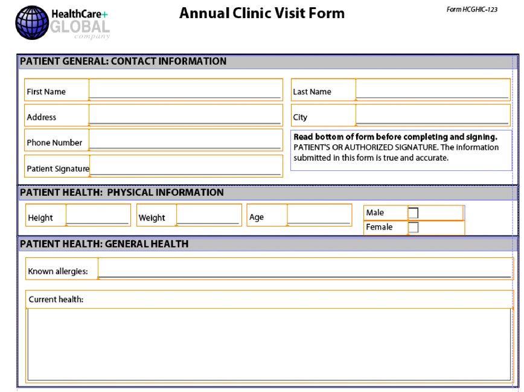

# Montagem de vários fragmentos XDP{#assembling-multiple-xdp-fragments}

É possível reunir vários fragmentos XDP em um único documento XDP. Por exemplo, considere fragmentos XDP em que cada arquivo XDP contém um ou mais subformulários usados para criar um formulário de integridade. A ilustração a seguir mostra a exibição de estrutura de tópicos (representa o arquivo tuc018_template_flowed.xdp usado no *Montando vários fragmentos XDP* início rápido):


A ilustração a seguir mostra a seção paciente (representa o arquivo tuc018_contact.xdp usado no *Montagem de vários fragmentos XDP* início rápido):


A ilustração a seguir mostra a seção integridade do paciente (representa o arquivo tuc018_paciente.xdp usado no *Montagem de vários fragmentos XDP* início rápido):


Este fragmento contém dois subformulários chamados *subPatientPhysical* e *subPatientHealth*. Ambos os subformulários são referenciados no documento DDX passado para o serviço Assembler. Usando o serviço Assembler, é possível combinar todos esses fragmentos XDP em um único documento XDP, conforme mostrado na ilustração a seguir.



O documento DDX a seguir reúne vários fragmentos XDP em um documento XDP.

```xml
 <?xml version="1.0" encoding="UTF-8"?>
 <DDX xmlns="https://ns.adobe.com/DDX/1.0/">
         <XDP result="tuc018result.xdp">
            <XDP source="tuc018_template_flowed.xdp">
             <XDPContent insertionPoint="ddx_fragment" source="tuc018_contact.xdp" fragment="subPatientContact" required="false"/>
               <XDPContent insertionPoint="ddx_fragment" source="tuc018_patient.xdp" fragment="subPatientPhysical" required="false"/>
               <XDPContent insertionPoint="ddx_fragment" source="tuc018_patient.xdp" fragment="subPatientHealth" required="false"/>
            </XDP>
         </XDP>
 </DDX>
```

O documento DDX contém uma marca XDP `result` que especifica o nome do resultado. Nessa situação, o valor é `tuc018result.xdp`. Esse valor é referenciado na lógica do aplicativo usada para recuperar o documento XDP depois que o serviço do Assembler retorna o resultado. Por exemplo, considere a seguinte lógica de aplicativo Java usada para recuperar o documento XDP montado (observe que o valor está em negrito):

```java
 //Iterate through the map object to retrieve the result XDP document
 for (Iterator i = allDocs.entrySet().iterator(); i.hasNext();) {
     // Retrieve the Map object’s value
     Map.Entry e = (Map.Entry)i.next();
     //Get the key name as specified in the
     //DDX document
     String keyName = (String)e.getKey();
     if (keyName.equalsIgnoreCase("tuc018result.xdp"))
                 {
         Object o = e.getValue();
         outDoc = (Document)o;
         //Save the result PDF file
         File myOutFile = new File("C:\\AssemblerResultXDP.xdp");
         outDoc.copyToFile(myOutFile);
     }
 }
```

A marca `XDP source` especifica o arquivo XDP que representa um documento XDP completo que pode ser usado como um contêiner para adicionar fragmentos XDP ou como um dos vários documentos anexados em ordem. Nessa situação, o documento XDP é usado somente como um contêiner (a primeira ilustração mostrada em *Montando vários fragmentos XDP*). Ou seja, os outros arquivos XDP são colocados no contêiner XDP.

Para cada subformulário, você pode adicionar um elemento `XDPContent` (esse elemento é opcional). No exemplo acima, observe que há três subformulários: `subPatientContact`, `subPatientPhysical` e `subPatientHealth`. O subformulário `subPatientPhysical` e o subformulário `subPatientHealth` estão no mesmo arquivo XDP, tuc018_paciente.xdp. O elemento do fragmento especifica o nome do subformulário, conforme definido no Designer.

>[!NOTE]
>
>Para obter mais informações sobre o serviço Assembler, consulte [Referência de serviços para AEM Forms](https://www.adobe.com/go/learn_aemforms_services_63).

>[!NOTE]
>
>Para obter mais informações sobre um documento DDX, consulte [Serviço do Assembler e Referência DDX](https://www.adobe.com/go/learn_aemforms_ddx_63).

## Resumo das etapas {#summary-of-steps}

Para montar vários fragmentos XDP, execute as seguintes tarefas:

1. Incluir arquivos de projeto.
1. Crie um cliente PDF Assembler.
1. Consulte um documento DDX existente.
1. Consulte os documentos XDP.
1. Definir opções de tempo de execução.
1. Montar os vários documentos XDP.
1. Recupere o documento XDP montado.

**Incluir arquivos de projeto**

Inclua os arquivos necessários no projeto de desenvolvimento. Se você estiver criando uma aplicação cliente usando Java, inclua os arquivos JAR necessários. Se você estiver usando serviços da Web, certifique-se de incluir os arquivos proxy.

Os seguintes arquivos JAR devem ser adicionados ao caminho de classe do projeto:

* adobe-livecycle-client.jar
* adobe-usermanager-client.jar
* adobe-assembler-client.jar
* adobe-utilities.jar (necessário se o AEM Forms for implantado no JBoss)
* jbossall-client.jar (necessário se o AEM Forms for implantado no JBoss)

**Criar um cliente PDF Assembler**

Antes de executar programaticamente uma operação do Assembler, crie um cliente de serviço do Assembler.

**Referenciar um documento DDX existente**

Um documento DDX deve ser referenciado para reunir vários documentos XDP. Este documento DDX deve conter elementos `XDP result`, `XDP source` e `XDPContent`.

**Referenciar os documentos XDP**

Para montar vários documentos XDP, consulte todos os arquivos XDP usados para montar o documento XDP resultante. Verifique se o nome do subformulário contido no documento XDP referenciado pelo atributo `source` está especificado no atributo `fragment`. Um subformulário é definido no Designer. Por exemplo, considere o seguinte XML.

```xml
 <XDPContent insertionPoint="ddx_fragment" source="tuc018_contact.xdp" fragment="subPatientContact" required="false"/>
```

O subformulário chamado *subPatientContact* deve estar no arquivo XDP chamado *tuc018_contact.xdp*.

**Definir opções de tempo de execução**

Você pode definir opções de tempo de execução que controlam o comportamento do serviço Assembler enquanto ele executa um job. Por exemplo, você pode definir uma opção que instrui o serviço Assembler a continuar processando um job se um erro for encontrado.

**Montar vários documentos XDP**

Para reunir vários arquivos XDP, chame a operação `invokeDDX`. O serviço Assembler retorna o documento XDP montado em um objeto de coleção.

**Recuperar o documento XDP montado**

Um documento XDP montado é retornado em um objeto de coleção. Repita o objeto de coleção e salve o documento XDP como um arquivo XDP. Você também pode passar o documento XDP para outro serviço do AEM Forms, como Saída.

**Consulte também**

[Montar vários fragmentos XDP usando a API Java](assembling-multiple-xdp-fragments.md#assemble-multiple-xdp-fragments-using-the-java-api)

[Montar vários fragmentos XDP usando a API do serviço da Web](assembling-multiple-xdp-fragments.md#assemble-multiple-xdp-fragments-using-the-web-service-api)

[Inclusão de arquivos da biblioteca Java do AEM Forms](/help/forms/developing/invoking-aem-forms-using-java.md#including-aem-forms-java-library-files)

[Definindo propriedades de conexão](/help/forms/developing/invoking-aem-forms-using-java.md#setting-connection-properties)

[Montagem programática de documentos do PDF](/help/forms/developing/programmatically-assembling-pdf-documents.md#programmatically-assembling-pdf-documents)

[Criação de documentos PDF usando fragmentos](/help/forms/developing/creating-document-output-streams.md#creating-pdf-documents-using-fragments)

## Montar vários fragmentos XDP usando a API Java {#assemble-multiple-xdp-fragments-using-the-java-api}

Montar vários fragmentos XDP usando a API de serviço do Assembler (Java):

1. Incluir arquivos de projeto.

   Inclua arquivos JAR do cliente, como adobe-assembler-client.jar, no caminho de classe do projeto Java.

1. Crie um cliente PDF Assembler.

   * Crie um objeto `ServiceClientFactory` que contenha propriedades de conexão.
   * Crie um objeto `AssemblerServiceClient` usando seu construtor e transmitindo o objeto `ServiceClientFactory`.

1. Consulte um documento DDX existente.

   * Crie um objeto `java.io.FileInputStream` que represente o documento DDX usando seu construtor e transmitindo um valor de cadeia de caracteres que especifique o local do arquivo DDX.
   * Crie um objeto `com.adobe.idp.Document` usando seu construtor e transmitindo o objeto `java.io.FileInputStream`.

1. Consulte os documentos XDP.

   * Crie um objeto `java.util.Map` usado para armazenar documentos XDP de entrada usando um construtor `HashMap`.
   * Crie um objeto `com.adobe.idp.Document` e passe o objeto `java.io.FileInputStream` que contém o arquivo XDP de entrada (repita essa tarefa para cada arquivo XDP).
   * Adicione uma entrada ao objeto `java.util.Map` invocando seu método `put` e transmitindo os seguintes argumentos:

      * Um valor de string que representa o nome da chave. Este valor deve corresponder ao valor do elemento `source` especificado no documento DDX (repita esta tarefa para cada arquivo XDP).
      * Um objeto `com.adobe.idp.Document` que contém o documento XDP que corresponde ao elemento `source` (repita esta tarefa para cada arquivo XDP).

1. Defina as opções de tempo de execução.

   * Crie um objeto `AssemblerOptionSpec` que armazene opções de tempo de execução usando seu construtor.
   * Defina as opções de tempo de execução para atender aos requisitos da sua empresa invocando um método que pertença ao objeto `AssemblerOptionSpec`. Por exemplo, para instruir o serviço Assembler a continuar processando um trabalho quando ocorrer um erro, chame o método `setFailOnError` do objeto `AssemblerOptionSpec` e passe `false`.

1. Montar os vários documentos XDP.

   Chame o método `invokeDDX` do objeto `AssemblerServiceClient` e passe os seguintes valores obrigatórios:

   * Um objeto `com.adobe.idp.Document` que representa o documento DDX a ser usado
   * Um objeto `java.util.Map` que contém os arquivos XDP de entrada
   * Um objeto `com.adobe.livecycle.assembler.client.AssemblerOptionSpec` que especifica as opções de tempo de execução, incluindo a fonte padrão e o nível de log do trabalho

   O método `invokeDDX` retorna um objeto `com.adobe.livecycle.assembler.client.AssemblerResult` que contém o documento XDP montado.

1. Recupere o documento XDP montado.

   Para obter o documento XDP montado, execute as seguintes ações:

   * Invoque o método `getDocuments` do objeto `AssemblerResult`. Este método retorna um objeto `java.util.Map`.
   * Repita o objeto `java.util.Map` até encontrar o objeto `com.adobe.idp.Document` resultante.
   * Invoque o método `copyToFile` do objeto `com.adobe.idp.Document` para extrair o documento XDP montado.

**Consulte também**

[Montando vários fragmentos XDP](assembling-multiple-xdp-fragments.md#assembling-multiple-xdp-fragments)
[Início rápido (modo SOAP): Montando vários fragmentos XDP usando a API Java](/help/forms/developing/assembler-service-java-api-quick.md#quick-start-soap-mode-assembling-multiple-xdp-fragments-using-the-java-api)
[Incluindo arquivos da biblioteca AEM Forms Java](/help/forms/developing/invoking-aem-forms-using-java.md#including-aem-forms-java-library-files)
[Definindo propriedades de conexão](/help/forms/developing/invoking-aem-forms-using-java.md#setting-connection-properties)

## Montar vários fragmentos XDP usando a API do serviço da Web {#assemble-multiple-xdp-fragments-using-the-web-service-api}

Montar vários fragmentos XDP usando a API de serviço do Assembler (serviço da Web):

1. Incluir arquivos de projeto.

   Crie um projeto Microsoft .NET que use MTOM. Certifique-se de usar a seguinte definição WSDL ao configurar uma referência de serviço:

   ```java
    https://localhost:8080/soap/services/AssemblerService?WSDL&lc_version=9.0.1.
   ```

   >[!NOTE]
   >
   >Substitua `localhost` pelo endereço IP do servidor que hospeda o AEM Forms.

1. Crie um cliente PDF Assembler.

   * Crie um objeto `AssemblerServiceClient` usando seu construtor padrão.
   * Crie um objeto `AssemblerServiceClient.Endpoint.Address` usando o construtor `System.ServiceModel.EndpointAddress`. Transmita um valor de cadeia de caracteres que especifique o WSDL para o serviço AEM Forms (como `https://localhost:8080/soap/services/AssemblerService?blob=mtom`). Você não precisa usar o atributo `lc_version`. Esse atributo é usado quando você cria uma referência de serviço.
   * Crie um objeto `System.ServiceModel.BasicHttpBinding` obtendo o valor do campo `AssemblerServiceClient.Endpoint.Binding`. Converter o valor de retorno em `BasicHttpBinding`.
   * Defina o campo `MessageEncoding` do objeto `System.ServiceModel.BasicHttpBinding` como `WSMessageEncoding.Mtom`. Esse valor garante que a MTOM seja usada.
   * Ative a autenticação HTTP básica executando as seguintes tarefas:

      * Atribua o nome de usuário dos formulários AEM ao campo `AssemblerServiceClient.ClientCredentials.UserName.UserName`.
      * Atribua o valor de senha correspondente ao campo `AssemblerServiceClient.ClientCredentials.UserName.Password`.
      * Atribua o valor da constante `HttpClientCredentialType.Basic` ao campo `BasicHttpBindingSecurity.Transport.ClientCredentialType`.
      * Atribua o valor da constante `BasicHttpSecurityMode.TransportCredentialOnly` ao campo `BasicHttpBindingSecurity.Security.Mode`.

1. Consulte um documento DDX existente.

   * Crie um objeto `BLOB` usando seu construtor. O objeto `BLOB` é usado para armazenar o documento DDX.
   * Crie um objeto `System.IO.FileStream` chamando seu construtor e transmitindo um valor de cadeia de caracteres que representa o local do arquivo do documento DDX e o modo no qual o arquivo será aberto.
   * Crie uma matriz de bytes que armazene o conteúdo do objeto `System.IO.FileStream`. Você pode determinar o tamanho da matriz de bytes obtendo a propriedade `Length` do objeto `System.IO.FileStream`.
   * Preencha a matriz de bytes com dados de fluxo invocando o método `Read` do objeto `System.IO.FileStream`. Passe a matriz de bytes, a posição inicial e o comprimento do fluxo para leitura.
   * Preencha o objeto `BLOB` atribuindo sua propriedade `MTOM` com o conteúdo da matriz de bytes.

1. Consulte os documentos XDP.

   * Para cada arquivo XDP de entrada, crie um objeto `BLOB` usando seu construtor. O objeto `BLOB` é usado para armazenar o arquivo de entrada.
   * Crie um objeto `System.IO.FileStream` chamando seu construtor e transmitindo um valor de cadeia de caracteres que representa o local do arquivo de entrada e o modo no qual o arquivo será aberto.
   * Crie uma matriz de bytes que armazene o conteúdo do objeto `System.IO.FileStream`. Você pode determinar o tamanho da matriz de bytes obtendo a propriedade `Length` do objeto `System.IO.FileStream`.
   * Preencha a matriz de bytes com dados de fluxo invocando o método `Read` do objeto `System.IO.FileStream`. Passe a matriz de bytes, a posição inicial e o comprimento do fluxo para leitura.
   * Preencha o objeto `BLOB` atribuindo seu campo `MTOM` com o conteúdo da matriz de bytes.
   * Crie um objeto `MyMapOf_xsd_string_To_xsd_anyType`. Esse objeto de coleção é usado para armazenar arquivos de entrada necessários para criar um documento XDP montado.
   * Para cada arquivo de entrada, crie um objeto `MyMapOf_xsd_string_To_xsd_anyType_Item`.
   * Atribua um valor de cadeia de caracteres que represente o nome da chave para o campo `key` do objeto `MyMapOf_xsd_string_To_xsd_anyType_Item`. Este valor deve corresponder ao valor do elemento especificado no documento DDX. (Execute essa tarefa para cada arquivo XDP de entrada.)
   * Atribua o objeto `BLOB` que armazena o arquivo de entrada ao campo `value` do objeto `MyMapOf_xsd_string_To_xsd_anyType_Item`. (Execute essa tarefa para cada arquivo XDP de entrada.)
   * Adicione o objeto `MyMapOf_xsd_string_To_xsd_anyType_Item` ao objeto `MyMapOf_xsd_string_To_xsd_anyType`. Invoque o método `Add` do objeto `MyMapOf_xsd_string_To_xsd_anyType` e passe o objeto `MyMapOf_xsd_string_To_xsd_anyType`. (Execute esta tarefa para cada documento XDP de entrada.)

1. Definir opções de tempo de execução.

   * Crie um objeto `AssemblerOptionSpec` que armazene opções de tempo de execução usando seu construtor.
   * Defina opções de tempo de execução para atender aos requisitos comerciais atribuindo um valor a um membro de dados que pertença ao objeto `AssemblerOptionSpec`. Por exemplo, para instruir o serviço Assembler a continuar processando um trabalho quando ocorrer um erro, atribua `false` ao membro de dados `failOnError` do objeto `AssemblerOptionSpec`.

1. Montar os vários documentos XDP.

   Chame o método `invokeDDX` do objeto `AssemblerServiceClient` e passe os seguintes valores:

   * Um objeto `BLOB` que representa o documento DDX
   * O objeto `MyMapOf_xsd_string_To_xsd_anyType` que contém os arquivos necessários
   * Um objeto `AssemblerOptionSpec` que especifica as opções de tempo de execução

   O método `invokeDDX` retorna um objeto `AssemblerResult` que contém os resultados do trabalho e as exceções que ocorreram.

1. Recupere o documento XDP montado.

   Para obter o documento XDP recém-criado, execute as seguintes ações:

   * Acesse o campo `documents` do objeto `AssemblerResult`, que é um objeto `Map` que contém os documentos PDF resultantes.
   * Repita através do objeto `Map` para obter cada documento resultante. Em seguida, converta o `value` desse membro da matriz em um `BLOB`.
   * Extraia os dados binários que representam o documento PDF acessando a propriedade `MTOM` do objeto `BLOB`. Isso retorna uma matriz de bytes que você pode gravar em um arquivo XDP.

**Consulte também**

[Montando vários fragmentos XDP](assembling-multiple-xdp-fragments.md#assembling-multiple-xdp-fragments)
[Chamando o AEM Forms usando MTOM](/help/forms/developing/invoking-aem-forms-using-web.md#invoking-aem-forms-using-mtom)
