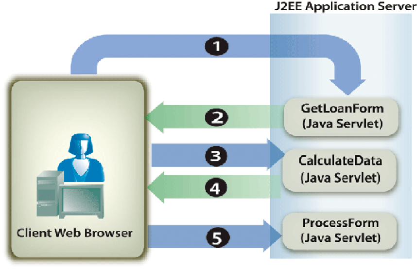

# Cálculo de dados de formulário {#calculating-form-data}

**Os exemplos e amostras neste documento são somente para AEM Forms no ambiente JEE.**

O serviço Forms pode calcular os valores que um usuário insere em um formulário e exibir os resultados. Para calcular dados de formulário, você deve executar duas tarefas. Primeiro, crie um script de design de formulário que calcula os dados de formulário. Um design de formulário é compatível com três tipos de scripts. Um tipo de script é executado no cliente, outro é executado no servidor e o terceiro é executado no servidor e no cliente. O tipo de script discutido neste tópico é executado no servidor. Os cálculos do lado do servidor são compatíveis com as transformações de HTML, PDF e Guia de forma (obsoleto).

Como parte do processo de design do formulário, você pode usar cálculos e scripts para fornecer uma experiência do usuário mais avançada. Cálculos e scripts podem ser adicionados à maioria dos campos e objetos de formulário. Crie um script de design de formulário para executar operações de cálculo nos dados que um usuário insere em um formulário interativo.

O usuário insere valores no formulário e clica no botão Calculate para exibir os resultados. O processo a seguir descreve um aplicativo de exemplo que permite ao usuário calcular dados:

* O usuário acessa uma página de HTML chamada StartLoan.html que atua como a página inicial da aplicação Web. Esta página chama um Servlet Java chamado `GetLoanForm`.
* A variável `GetLoanForm` O servlet renderiza um formulário de empréstimo. Este formulário contém um script, campos interativos, um botão calcular e um botão enviar.
* O usuário insere valores nos campos do formulário e clica no botão Calcular. O formulário é enviado para o `CalculateData` Java Servlet onde o script é executado. O formulário é enviado de volta ao usuário com os resultados do cálculo exibidos no formulário.
* O usuário continua informando e calculando valores até que um resultado satisfatório seja exibido. Quando satisfeito, o usuário clica no botão Submit para processar o formulário. O formulário é enviado para outro Java Servlet chamado `ProcessForm` que é responsável pela recuperação dos dados enviados. (Consulte [Manuseio de Forms enviado](/help/forms/developing/rendering-forms.md#handling-submitted-forms).)


O diagrama a seguir mostra o fluxo lógico do aplicativo.



A tabela a seguir descreve as etapas deste diagrama.

<table>
 <thead>
  <tr>
   <th><p>Etapa</p></th>
   <th><p>Descrição</p></th>
  </tr>
 </thead>
 <tbody>
  <tr>
   <td><p>1</p></td>
   <td><p>A variável <code>GetLoanForm</code> O Java Servlet é chamado da página inicial do HTML. </p></td>
  </tr>
  <tr>
   <td><p>2</p></td>
   <td><p>A variável <code>GetLoanForm</code> O Java Servlet usa a API do cliente do serviço Forms para renderizar o formulário de empréstimo para o navegador da Web do cliente. A diferença entre renderizar um formulário que contém um script configurado para ser executado no servidor e renderizar um formulário que não contém um script é que você deve especificar o local de destino usado para executar o script. Se um local de destino não for especificado, um script configurado para ser executado no servidor não será executado. Por exemplo, considere o aplicativo introduzido nesta seção. A variável <code>CalculateData</code> Java Servlet é o local de destino onde o script é executado.</p></td>
  </tr>
  <tr>
   <td><p>3</p></td>
   <td><p>O usuário insere os dados em campos interativos e clica no botão Calcular. O formulário é enviado para o <code>CalculateData</code> Java Servlet, em que o script é executado. </p></td>
  </tr>
  <tr>
   <td><p>4</p></td>
   <td><p>O formulário é renderizado no navegador da web com os resultados do cálculo exibidos no formulário. </p></td>
  </tr>
  <tr>
   <td><p>5</p></td>
   <td><p>O usuário clica no botão Submit quando os valores forem satisfatórios. O formulário é enviado para outro Java Servlet chamado <code>ProcessForm</code>.</p></td>
  </tr>
 </tbody>
</table>

Normalmente, um formulário enviado como conteúdo de PDF contém scripts que são executados no cliente. No entanto, os cálculos do lado do servidor também podem ser executados. Um botão Enviar não pode ser usado para calcular scripts. Nessa situação, os cálculos não são executados porque o serviço do Forms considera a interação concluída.

Para ilustrar o uso de um script de design de formulário, esta seção examina um formulário interativo simples que contém um script configurado para execução no servidor. O diagrama a seguir mostra um design de formulário contendo um script que adiciona valores inseridos por um usuário nos dois primeiros campos e exibe o resultado no terceiro campo.


**A.** Um campo chamado NumericField1 **B.** Um campo chamado NumericField2 **C** Um campo chamado NumericField3

A sintaxe do script nesse design de formulário é a seguinte:

```javascript
     NumericField3 = NumericField2 + NumericField1
```

Neste design de formulário, o botão Calcular é um botão de comando e o script está no `Click` evento. Quando um usuário insere valores nos dois primeiros campos (NumericField1 e NumericField2) e clica no botão Calcular, o formulário é enviado ao serviço do Forms, onde o script é executado. O serviço Forms renderiza o formulário de volta para o dispositivo cliente com os resultados do cálculo exibidos no campo NumericField3.

>[!NOTE]
>
>Para obter informações sobre como criar um script de design de formulário, consulte [Forms Designer](https://www.adobe.com/go/learn_aemforms_designer_63).

>[!NOTE]
>
>Para obter mais informações sobre o serviço Forms, consulte [Referência de serviços para o AEM Forms](https://www.adobe.com/go/learn_aemforms_services_63).

## Resumo das etapas {#summary-of-steps}

Para calcular dados de formulário, execute as seguintes tarefas:

1. Incluir arquivos de projeto.
1. Crie um objeto da API do cliente do Forms.
1. Recupere um formulário que contenha um script de cálculo.
1. Gravar o fluxo de dados do formulário de volta no navegador da Web do cliente

**Incluir arquivos de projeto**

Inclua os arquivos necessários no projeto de desenvolvimento. Se você estiver criando uma aplicação cliente usando Java, inclua os arquivos JAR necessários. Se você estiver usando serviços da Web, certifique-se de incluir os arquivos proxy.

**Criar um objeto da API do cliente do Forms**

Antes de executar programaticamente uma operação da API do cliente de serviço do Forms, você deve criar um cliente de serviço do Forms. Se estiver usando a API Java, crie uma `FormsServiceClient` objeto. Se estiver usando a API do serviço Web Forms, crie uma `FormsServiceService` objeto.

**Recuperar um formulário que contenha um script de cálculo**

Use a API do cliente de serviço do Forms para criar uma lógica de aplicativo que manipula um formulário que contém um script configurado para execução no servidor. O processo é semelhante ao manuseio de um formulário enviado. (Consulte [Manuseio de Forms enviado](/help/forms/developing/handling-submitted-forms.md).)

Verificar se o estado de processamento associado ao formulário enviado é `1` `(Calculate)`, o que significa que o serviço Forms está executando uma operação de cálculo nos dados de formulário e os resultados devem ser gravados de volta para o usuário. Nessa situação, um script configurado para ser executado no servidor é executado automaticamente.

**Gravar o fluxo de dados do formulário de volta no navegador da Web do cliente**

Depois de verificar se o estado de processamento associado a um formulário enviado é `1`, você deve gravar os resultados no navegador da Web do cliente. Quando o formulário for exibido, o valor calculado será exibido nos campos apropriados.

**Consulte também**

[Inclusão de arquivos da biblioteca Java do AEM Forms](/help/forms/developing/invoking-aem-forms-using-java.md#including-aem-forms-java-library-files)
[Calcular dados do formulário usando a API Java](/help/forms/developing/calculating-form-data.md#calculate-form-data-using-the-java-api)
[Calcular dados do formulário usando a API do serviço Web](/help/forms/developing/calculating-form-data.md#calculate-form-data-using-the-web-service-api)
[Definindo propriedades de conexão](/help/forms/developing/invoking-aem-forms-using-java.md#setting-connection-properties)
[Início rápido da API de serviço do Forms](/help/forms/developing/forms-service-api-quick-starts.md#forms-service-api-quick-starts)
[Renderização de PDF forms interativos](/help/forms/developing/rendering-interactive-pdf-forms.md)
[Criação de aplicações Web que renderizam o Forms](/help/forms/developing/creating-web-applications-renders-forms.md)

## Calcular dados do formulário usando a API Java {#calculate-form-data-using-the-java-api}

Calcule dados de formulário usando a API do Forms (Java):

1. Incluir arquivos de projeto

   Inclua arquivos JAR do cliente, como adobe-forms-client.jar, no caminho de classe do projeto Java.

1. Criar um objeto da API do cliente do Forms

   * Criar um `ServiceClientFactory` objeto que contém propriedades de conexão.
   * Criar um `FormsServiceClient` usando seu construtor e transmitindo o `ServiceClientFactory` objeto.

1. Recuperar um formulário que contenha um script de cálculo

   * Para recuperar dados de formulário que contenham um script de cálculo, crie um `com.adobe.idp.Document` usando seu construtor e chamando o `javax.servlet.http.HttpServletResponse` do objeto `getInputStream` no construtor.
   * Chame o `FormsServiceClient` do objeto `processFormSubmission` e passe os seguintes valores:

      * A variável `com.adobe.idp.Document` objeto que contém os dados de formulário.
      * Um valor de string que especifica variáveis de ambiente, incluindo todos os cabeçalhos HTTP relevantes. Especifique o tipo de conteúdo a ser manipulado especificando um ou mais valores para o `CONTENT_TYPE` variável de ambiente. Por exemplo, para manipular dados XML e PDF, especifique o seguinte valor de string para esse parâmetro: `CONTENT_TYPE=application/xml&CONTENT_TYPE=application/pdf`
      * Um valor de string que especifica a `HTTP_USER_AGENT` valor do cabeçalho; por exemplo, `Mozilla/4.0 (compatible; MSIE 6.0; Windows NT 5.1; SV1; .NET CLR 1.1.4322)`.
      * A `RenderOptionsSpec` objeto que armazena opções de tempo de execução.

     A variável `processFormSubmission` o método retorna um `FormsResult` objeto que contém os resultados do envio do formulário.

   * Verificar se o estado de processamento associado a um formulário enviado é `1` ao invocar o `FormsResult` do objeto `getAction` método. Se esse método retornar o valor `1`, o cálculo foi executado e os dados podem ser gravados no navegador da web do cliente.

1. Gravar o fluxo de dados do formulário de volta no navegador da Web do cliente

   * Criar um `javax.servlet.ServletOutputStream` objeto usado para enviar um fluxo de dados de formulário para o navegador da web cliente.
   * Criar um `com.adobe.idp.Document` ao invocar o `FormsResult` do objeto `getOutputContent` método.
   * Criar um `java.io.InputStream` ao invocar o `com.adobe.idp.Document` do objeto `getInputStream` método.
   * Crie uma matriz de bytes e preencha-a com o fluxo de dados de formulário chamando o `InputStream` do objeto `read` e transmitindo a matriz de bytes como um argumento.
   * Chame o `javax.servlet.ServletOutputStream` do objeto `write` para enviar o fluxo de dados de formulário para o navegador web cliente. Passe a matriz de bytes para o `write` método.

**Consulte também**


[Inclusão de arquivos da biblioteca Java do AEM Forms](/help/forms/developing/invoking-aem-forms-using-java.md#including-aem-forms-java-library-files)
[Definindo propriedades de conexão](/help/forms/developing/invoking-aem-forms-using-java.md#setting-connection-properties)

## Calcular dados do formulário usando a API do serviço Web {#calculate-form-data-using-the-web-service-api}

Calcule dados de formulário usando a API do Forms (serviço da Web):

1. Incluir arquivos de projeto

   * Crie classes de proxy Java que consomem o serviço WSDL do Forms.
   * Inclua as classes de proxy Java no caminho da classe.

1. Criar um objeto da API do cliente do Forms

   Criar um `FormsService` objeto e definir valores de autenticação.

1. Recuperar um formulário que contenha um script de cálculo

   * Para recuperar dados de formulário publicados em um Servlet Java, crie um `BLOB` usando seu construtor.
   * Criar um `java.io.InputStream` usando o `javax.servlet.http.HttpServletResponse` do objeto `getInputStream` método.
   * Criar um `java.io.ByteArrayOutputStream` usando seu construtor e transmitindo o comprimento do objeto `java.io.InputStream` objeto.
   * Copie o conteúdo de `java.io.InputStream` objeto na `java.io.ByteArrayOutputStream` objeto.
   * Crie uma matriz de bytes chamando o `java.io.ByteArrayOutputStream` do objeto `toByteArray` método.
   * Preencha o `BLOB` ao invocar seu `setBinaryData` e transmitindo a matriz de bytes como um argumento.
   * Criar um `RenderOptionsSpec` usando seu construtor. Defina o valor do local chamando o `RenderOptionsSpec` do objeto `setLocale` e transmitindo um valor de string que especifica o valor do local.
   * Chame o `FormsServiceClient` do objeto `processFormSubmission` e passe os seguintes valores:

      * A variável `BLOB` objeto que contém os dados de formulário.
      * Um valor de string que especifica variáveis de ambiente incluídas em todos os cabeçalhos HTTP relevantes. Por exemplo, você pode especificar o seguinte valor da string: `HTTP_REFERER=referrer&HTTP_CONNECTION=keep-alive&CONTENT_TYPE=application/xml`
      * Um valor de string que especifica a `HTTP_USER_AGENT` valor do cabeçalho; por exemplo, `Mozilla/4.0 (compatible; MSIE 6.0; Windows NT 5.1; SV1; .NET CLR 1.1.4322)`.
      * A `RenderOptionsSpec` objeto que armazena opções de tempo de execução. Para obter mais informações, .
      * Um vazio `BLOBHolder` objeto preenchido pelo método.
      * Um vazio `javax.xml.rpc.holders.StringHolder` objeto preenchido pelo método.
      * Um vazio `BLOBHolder` objeto preenchido pelo método.
      * Um vazio `BLOBHolder` objeto preenchido pelo método.
      * Um vazio `javax.xml.rpc.holders.ShortHolder` objeto preenchido pelo método.
      * Um vazio `MyArrayOf_xsd_anyTypeHolder` objeto preenchido pelo método. Esse parâmetro é usado para armazenar anexos de arquivo enviados junto com o formulário.
      * Um vazio `FormsResultHolder` objeto que é preenchido pelo método com o formulário enviado.

     A variável `processFormSubmission` O método preenche o `FormsResultHolder` com os resultados do envio do formulário. A variável `processFormSubmission` o método retorna um `FormsResult` objeto que contém os resultados do envio do formulário.

   * Verificar se o estado de processamento associado a um formulário enviado é `1` ao invocar o `FormsResult` do objeto `getAction` método. Se esse método retornar o valor `1`, o cálculo foi executado e os dados podem ser gravados no navegador da web do cliente.

1. Gravar o fluxo de dados do formulário de volta no navegador da Web do cliente

   * Criar um `javax.servlet.ServletOutputStream` objeto usado para enviar um fluxo de dados de formulário para o navegador da web cliente.
   * Criar um `BLOB` objeto que contém dados de formulário chamando o `FormsResult` do objeto `getOutputContent` método.
   * Crie uma matriz de bytes e preencha-a chamando o `BLOB` do objeto `getBinaryData` método. Esta tarefa atribui o conteúdo do `FormsResult` à matriz de bytes.
   * Chame o `javax.servlet.http.HttpServletResponse` do objeto `write` para enviar o fluxo de dados de formulário para o navegador web cliente. Passe a matriz de bytes para o `write` método.

**Consulte também**
[Chamada de AEM Forms usando codificação Base64](/help/forms/developing/invoking-aem-forms-using-web.md#invoking-aem-forms-using-base64-encoding)
