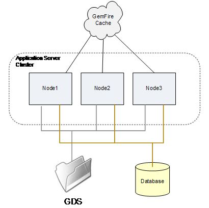

# Configuração e solução de problemas de um AEM Forms no cluster de servidores JEE {#configuring-troubleshooting-aem-forms-jee-server-cluster}

## Conhecimento pré-requisito {#prerequisites}

Familiaridade com AEM Forms em sistemas operacionais JEE, JBoss, WebSphere e Webogic application, Red Hat Linux, SUSE Linux, Microsoft Windows, IBM AIX ou Sun Solaris, Oracle, IBM DB2 ou servidores de banco de dados SQL Server e ambientes da Web.

## Nível do usuário {#user-level}

Avançado 

Um AEM Forms no JEE Cluster é uma topologia projetada para permitir que o AEM Forms no JEE seja resiliente à falha de um nó de cluster e para dimensionar a capacidade do sistema além das habilidades de um único nó. Um cluster combina vários nós em um único sistema lógico que compartilha dados e permite que as transações expandam vários nós em sua execução. Um cluster é a maneira mais geral de dimensionar o AEM Forms no JEE, na medida em que qualquer combinação de serviços que manipule qualquer combinação de cargas de trabalho pode ser suportada. Um AEM Forms em um cluster JEE não é necessariamente o melhor ajuste para todos os tipos de implantações e, em particular, uma arquitetura sem cluster de balanceamento de carga do servidor pode ser apropriada em muitos casos.

O objetivo deste documento é discutir os requisitos de configuração específicos e as possíveis áreas de problemas que você pode encontrar com um AEM Forms no cluster JEE.

## O que há em um cluster? {#what-is-in-cluster}

O AEM Forms nos nós de cluster JEE se comunica entre si e compartilha informações para permitir que o cluster como um todo tenha uma única configuração consistente e um estado de aplicativo. O compartilhamento de informações no cluster é feito de várias maneiras diferentes simultaneamente, que são usadas em diferentes contextos. Os métodos básicos de compartilhamento de informações estão ilustrados na Figura abaixo:



### Cluster do servidor de aplicativos {#application-server-cluster}

Um cluster AEM Forms em JEE depende dos recursos de cluster do servidor de aplicativos subjacentes. Os clusters do servidor de aplicativos permitem que a configuração do cluster seja gerenciada como um todo e fornecem serviços de cluster de baixo nível, como Java Naming e Diretory Interface (JNDI), que permitem que os componentes de software se encontrem no cluster. A sofisticação dos serviços de cluster e as dependências técnicas subjacentes que o servidor de aplicativos tem dependem do servidor de aplicativos. O WebSphere e o WebLogic possuem recursos de gerenciamento sofisticados para clusters, enquanto o JBoss tem uma abordagem muito básica.

### Cache GemFire {#gemfire-cache}

O cache GemFire é um mecanismo de cache distribuído implementado em cada nó do cluster. Os nós se encontram e criam um único cache lógico que é mantido coerente entre os nós. Os nós que se encontram se unem para manter um único cache nocional que é mostrado como uma nuvem na Figura 1. Diferentemente do GDS e do banco de dados, o cache é uma entidade meramente nocional. O conteúdo em cache real é armazenado na memória e no `LC_TEMP` em cada um dos nós do cluster.

### Banco de dados {#database}

O banco de dados AEM Forms on JEE, que é acessado por meio das fontes de dados JDBC IDP_DS, EDC_DS e outros, é compartilhado por todos os nós do cluster. A maioria dos dados persistentes relacionados ao estado do AEM Forms no JEE, como quais transações estão em andamento, os dados do usuário associados às transações em andamento, os dados relativos a como as configurações do sistema foram definidas e assim por diante, estão localizados neste banco de dados.

### Armazenamento de documentos global {#global-document-storage}

O Global Document Storage (GDS) é uma área de armazenamento baseada em sistema de arquivos usada pelo Document Manager (classe IDPDocument) na AEM Forms no JEE. O GDS armazena arquivos de duração curta e longa que devem ser acessíveis a todos os nós do cluster.

### Outras rubricas {#other-items}

Além desses principais recursos compartilhados, há outros itens que têm um comportamento específico de cluster, como o Quartz. O Quartz é um subsistema de agendador usado pela AEM Forms no JEE e usa tabelas de banco de dados para manter seu conhecimento do que foi agendado e quais atividades agendadas estão sendo executadas. O Quartz deve ser configurado de forma diferente para instalações e clusters de nó único, e ele tira a dica de outro AEM Forms nas configurações JEE.

## Problemas comuns de configuração {#common-configuration}

Uma das coisas mais frustrantes sobre a manutenção ou solução de problemas de um AEM Forms no cluster JEE é que não há um único lugar para procurar confirmar positivamente que o cluster está íntegro. Para confirmar se tudo está bem no cluster, é necessário realizar uma investigação e análise, e há vários modos de falha para a operação do cluster, dependendo do que está errado com a configuração do cluster. A figura abaixo ilustra um cluster mal configurado no qual vários dos recursos compartilhados são compartilhados incorretamente.


Uma coisa interessante e importante a ter em mente é que você precisa estar familiarizado com a maneira como o clustering funciona e os tipos de coisas para procurar e verificar em um cluster, mesmo que não pretenda executar o AEM Forms no JEE em um cluster. Isso ocorre porque algumas partes do AEM Forms no JEE podem ter suas dicas sobre operar em um cluster incorretamente e assumir o comportamento do cluster que você não espera.

Então, o que há de errado com a configuração de compartilhamento da Figura acima? As seções a seguir descrevem os problemas:

### (1) Configuração do cluster GemFire {#gemfire-cluster-configuration}

Várias coisas podem dar errado com o cache do Gemfire. Dois cenários típicos são:

* Nós que deveriam ser capazes de encontrar uns aos outros não podem fazê-lo.

* Os nós que não deveriam ser agrupados se encontram e compartilham um cache quando não deveriam.

Se você tem nós que pretende agrupar, é essencial que eles se encontrem na rede. Por padrão, eles fazem isso por meio de mensagens UDP multicast. Cada nó envia mensagens de transmissão anunciando que está presente, e qualquer nó que receba tal mensagem começa a falar com os outros nós encontrados. Esse tipo de método de autodescoberta é muito comum, e muitos tipos de software e aparelhos fazem isso.

Um problema comum com a detecção automática é que mensagens multicast podem ser filtradas pela rede como parte da política de rede ou devido a regras de firewall de software, ou simplesmente não podem ser roteadas pela rede existente entre nós. Devido à dificuldade geral em fazer com que a autodetecção UDP funcione em redes complexas, é prática comum que as implantações de produção usem um método de descoberta alternativo: Localizadores TCP. Uma discussão geral sobre localizadores TCP pode ser encontrada nas referências.

**Como faço para saber se estou usando localizadores ou UDP?**

As seguintes propriedades da JVM controlam o método que o cache GemFire usa para localizar outros nós.

Configurações de multicast:

* `adobe.cache.multicast-port`: A porta de multicast usada para se comunicar com outros membros do sistema distribuído. Se estiver definido como zero, a multicast será desativada para detecção e distribuição de membros.

* `gemfire.mcast-address` (opcional): Substitui o endereço IP padrão usado pelo Gemfire.

Configurações do localizador TCP:

* `adobe.cache.cluster-locators`: O endereço IP/nome do host do localizador TCP e da porta do localizador TCP para todos os localizadores usados pelos membros do sistema para se comunicar com localizadores em execução.

A lista deve incluir todos os localizadores em uso no momento e deve ser configurada de forma consistente para cada membro do sistema de cluster.

Se a lista Localizador de TCP estiver vazia, os localizadores não serão usados e o método multicast será usado.

**Como posso verificar se meu localizador TCP está em execução?**

Primeiro, se os localizadores TCP estiverem em uso, você deverá ter seus localizadores TCP listados na seguinte propriedade JVM em todos os nós do cluster:

`-Dadobe.cache.cluster-locators=aix01.adobe.com[22345],aix02.adobe.com[22345]`

Não é necessário executar os localizadores no AEM Forms em nós de cluster JEE; eles podem ser executados em outros sistemas separados do cluster, se desejado. Mais de um sistema pode executar localizadores e, em geral, é considerada prática recomendada ter localizadores em execução em dois locais em relação à possibilidade de uma única falha dos localizadores causar um problema na reinicialização do cluster. Em cada um dos sistemas que executam localizadores, você deve ser capaz de verificar se eles estão sendo executados usando os seguintes comandos nessas máquinas:

`netstat -an | grep 22345`

A resposta esperada deve ser a seguinte:

`tcp 0 0 *.22345 *.* LISTEN`

Outro comando de verificação é o seguinte:

`ps -ef | grep gemfire`

A resposta esperada deve ser semelhante a:

`livecycl 331984 1 0 10:14:51 pts/0 0:03 java -cp ./gemfire.jar: -Dgemfire.license-type=production -Dlocators=localhost[22345] com.gemstone.gemfire.distributed.Locator 22345`

**Como vejo quais nós o GemFire acha que estão no cluster?**

O GemFire produz informações de registro que podem ser usadas para diagnosticar quais membros do cluster foram encontrados e adotados pelo cache GemFire. Isso pode ser usado para verificar se todos os membros de cluster corretos foram encontrados e se não houve detecção de nó de cluster extra ou incorreto. O arquivo de log do GemFire está localizado no AEM Forms configurado no diretório temporário JEE:

`.../LC_TEMP/adobeZZ__123456/Caching/Gemfire.log`

A sequência numérica após `adobeZZ_` O é exclusivo para o nó do servidor e, portanto, você deve pesquisar o conteúdo real do diretório temporário. Os dois caracteres após `adobe` dependem do tipo de servidor de aplicativos: ou `wl`, `jb`ou `ws`.

Os seguintes registros de amostra mostram o que acontece quando um cluster de dois nós se encontra.

No primeiro nó, AP-HP8:

```xml
[config 2011/08/05 09:28:09.143 EDT GemfireCacheAdapter <server.startup : 0> tid=0x65] This member, ap-hp8(4268):18763, is becoming group coordinator.
[info 2011/08/05 09:28:09.151 EDT GemfireCacheAdapter <server.startup : 0> tid=0x65] Entered into membership in group GF6.5.1.17 with ID ap-hp8(4268)<v0>:18763/56449.
[info 2011/08/05 09:28:09.152 EDT GemfireCacheAdapter <server.startup : 0> tid=0x65] Starting DistributionManager ap-hp8(4268)<v0>:18763/56449.
[info 2011/08/05 09:28:09.153 EDT GemfireCacheAdapter <server.startup : 0> tid=0x65] Initial (membershipManager) view =  [ap-hp8(4268)<v0>:18763/56449]
[info 2011/08/05 09:28:09.153 EDT GemfireCacheAdapter <server.startup : 0> tid=0x65] Admitting member <ap-hp8(4268)<v0>:18763/56449>. Now there are 1 non-admin member(s).
[info 2011/08/05 09:28:09.154 EDT GemfireCacheAdapter <server.startup : 0> tid=0x65] ap-hp8(4268)<v0>:18763/56449 is the elder and the only member.
[info 2011/08/05 09:28:09.163 EDT GemfireCacheAdapter <server.startup : 0> tid=0x65] Did not hear back from any other system. I am the first one.
[info 2011/08/05 09:28:09.164 EDT GemfireCacheAdapter <server.startup : 0> tid=0x65] DistributionManager ap-hp8(4268)<v0>:18763/56449 started on 239.192.81.1[33456]. There were 0 other DMs. others: []
[info 2011/08/05 09:28:20.841 EDT GemfireCacheAdapter <Pooled Message Processor 1> tid=0xc4] New administration member detected at ap-hp7(2821)<v1>:19498/59136.
```

No outro nó, AP-HP7:

```xml
[info 2011/08/05 09:28:09.830 EDT GemfireCacheAdapter <server.startup : 0> tid=0x64] Attempting to join distributed system whose membership coordinator is ap-hp8(4268)<v0>:18763 using membership ID ap-hp7(2821):19498
[info 2011/08/05 09:28:10.058 EDT GemfireCacheAdapter <server.startup : 0> tid=0x64] Entered into membership in group GF6.5.1.17 with ID ap-hp7(2821)<v1>:19498/59136.
[info 2011/08/05 09:28:10.059 EDT GemfireCacheAdapter <server.startup : 0> tid=0x64] Starting DistributionManager ap-hp7(2821)<v1>:19498/59136.
[info 2011/08/05 09:28:10.060 EDT GemfireCacheAdapter <server.startup : 0> tid=0x64] Initial (membershipManager) view =  [ap-hp8(4268)<v0>:18763/56449, ap-hp7(2821)<v1>:19498/59136]
[info 2011/08/05 09:28:10.060 EDT GemfireCacheAdapter <server.startup : 0> tid=0x64] Admitting member <ap-hp8(4268)<v0>:18763/56449>. Now there are 1 non-admin member(s).
[info 2011/08/05 09:28:10.060 EDT GemfireCacheAdapter <server.startup : 0> tid=0x64] Admitting member <ap-hp7(2821)<v1>:19498/59136>. Now there are 2 non-admin member(s).
[info 2011/08/05 09:28:10.128 EDT GemfireCacheAdapter <server.startup : 0> tid=0x64] DistributionManager ap-hp7(2821)<v1>:19498/59136 started on 239.192.81.1[33456]. There were 1 other DMs. others: [ap-hp8(4268)<v0>:18763/56449]
```

**E se o GemFire estiver encontrando nós que não deveria?**

Cada cluster distinto que compartilha uma rede corporativa deve usar um conjunto separado de localizadores TCP, se forem usados localizadores TCP, ou um número de porta UDP separado, se a configuração UDP de multicast for usada. Como a autodescoberta UDP é a configuração padrão do AEM Forms no JEE, e a mesma porta padrão, 33456, pode estar sendo usada por vários clusters, é possível que os clusters que não devem estar tentando se comunicar possam estar fazendo isso inesperadamente. Por exemplo, os clusters de produção e controle de qualidade devem permanecer separados, mas podem se conectar uns aos outros por meio do multicast UDP.

A situação mais comum em que você pode descobrir portas duplicadas em uma rede na qual o GemFire está com cluster inadequado é durante o bootstrap de um cluster. O que você pode descobrir é que o processo de inicialização falha sem causa clara. Normalmente, erros como este são vistos:

```xml
Caused by: com.ibm.ejs.container.UnknownLocalException: nested exception is: com.adobe.pof.schema.ObjectTypeNotFoundException: Object Type: dsc.sc_service_configuration not found.
                at com.adobe.pof.schema.POFDefaultDomain.getObjectType(POFDefaultDomain.java:93)
                at com.adobe.idp.dsc.initializer.DSCInitializerBean.serviceConfigAuditAttributeExists(DSCInitializerBean.java:225)
                at com.adobe.idp.dsc.initializer.DSCInitializerBean.installSchema(DSCInitializerBean.java:186)
                at com.adobe.idp.dsc.initializer.DSCInitializerBean.bootstrap(DSCInitializerBean.java:94)
                at com.adobe.idp.dsc.initializer.EJSLocalStatelessDSCInitializerBeanLocalEJB_7bb34e85.bootstrap(Unknown Source)
                at com.adobe.livecycle.bootstrap.bootstrappers.DSCBootstrapper.bootstrap(DSCBootstrapper.java:68)
```

Nesse caso, o bootstrapper está trabalhando com o GemFire para acessar as tabelas necessárias e há uma inconsistência entre as tabelas acessadas por meio do JDBC e as informações da tabela em cache retornadas pelo GemFire, que vem de um cluster diferente com um banco de dados subjacente diferente.

Embora uma porta duplicada muitas vezes se torne evidente durante o bootstrap, é possível que essa situação seja exibida posteriormente, quando um cluster é reiniciado após ficar inativo quando o bootstrap do outro cluster ocorreu, ou quando a configuração de rede é alterada para tornar os clusters que foram anteriormente isolados, para fins de multicast, visíveis um ao outro.

Para diagnosticar essas situações, é melhor examinar os logs do GemFire e considerar cuidadosamente se apenas os nós esperados estão sendo encontrados. Para corrigir o problema, é necessário alterar a variável

`adobe.cache.multicast-port`

propriedade com um valor diferente em um ou ambos os clusters.

### 2) Compartilhamento GDS {#gds-sharing}

O compartilhamento GDS é configurado fora do AEM Forms no próprio JEE, no nível O/S, onde você deve organizar para que a mesma estrutura de diretório compartilhado esteja disponível para todos os nós do cluster. Em sistemas do tipo Windows, isso geralmente é feito configurando um compartilhamento de arquivos de um nó para outro ou de um sistema de arquivos remoto, como um dispositivo NAS para todos os nós. Em sistemas UNIX, o compartilhamento de GDS normalmente é feito por meio do compartilhamento de arquivos NFS, novamente, de um nó para outro ou de um dispositivo NAS.

Um modo de falha possível para o cluster é se esse compartilhamento de arquivo remoto ficar indisponível ou tiver problemas sutis. Uma montagem remota pode falhar devido a problemas de rede, configurações de segurança ou configuração incorreta. Uma reinicialização do sistema pode fazer com que as alterações de configuração sejam feitas dias ou semanas antes de entrar em vigor, o que pode causar surpresas.

**O que aconteceria se um compartilhamento NFS falhasse em crescer?**

No UNIX, a forma como as montagens NFS são mapeadas para a estrutura de diretório pode permitir que um diretório GDS aparentemente utilizável esteja disponível, mesmo que a montagem falhe. Considere:

* Servidor NAS: Pasta compartilhada NFS /u01/iapply/livecycle_gds
* Nó 1: um ponto de montagem para a pasta compartilhada (hospedada no servidor de banco de dados) localizada aqui: /u01/iapply/livecycle_gds
* Nó 2: um ponto de montagem para a pasta compartilhada (hospedada no servidor de banco de dados) localizada aqui: /u01/iapply/livecycle_gds

* O LCES especifica o caminho para GDS: /u01/iapply/livecycle_gds

Se a montagem no Nó 1 falhar, a estrutura do diretório ainda conterá um caminho /u01/iapply/livecycle_gds para o ponto de montagem vazio, e o nó será exibido para ser executado corretamente. Mas como o conteúdo GDS não está sendo compartilhado com o outro nó, o cluster não funcionará corretamente. Isso pode e realmente acontece, e o resultado é que o cluster falha de maneiras misteriosas.

A prática recomendada é organizar as coisas para que o ponto de montagem do Linux não seja usado como a raiz do GDS, mas, em vez disso, algum diretório dentro dele seja usado como a raiz do GDS:

* Se você tiver um servidor NFS, ele poderá ter um diretório: /some/storage/lc_cluster_dev/LC_GDS
* E no nó do cluster você tem um ponto de montagem: /u01/iapply/shared
* Monte nfs_server: /some/storage/lc_cluster_dev/u01/iapply/shared
* Aponte seu GDS para /u01/iapply/shared/LC_GDS

Agora, se por algum motivo a montagem não tiver êxito, o ponto de montagem simples não conterá um diretório LC_GDS e seu cluster falhará previsivelmente, pois não poderá encontrar nenhum GDS.

**Como posso verificar se todos os nós veem o mesmo GDS e têm permissões?**

A verificação do acesso e compartilhamento de GDS é melhor feita acessando cada um dos nós como um usuário interativo, via SSH ou telnet para nós UNIX ou via desktop remoto para sistemas Windows. Você deve ser capaz de navegar até o diretório ou sistema de arquivos GDS configurado em cada nó e criar arquivos de teste a partir de cada nó que esteja visível em todos os outros nós.

Preste atenção à ID de usuário sob a qual o AEM Forms no JEE opera. Nas instalações do turnkey do Windows, isso é como um administrador local. No UNIX, pode ser como um usuário de serviço específico configurado no script de inicialização ou na configuração do servidor de aplicativos. É importante que essa ID de usuário possa criar e manipular arquivos GDS igualmente em todos os nós.

Em sistemas UNIX, as configurações NFS geralmente assumem o padrão de desconfiar da propriedade de raiz ou dos direitos de acesso de raiz a arquivos e objetos. Se você estiver executando o servidor de aplicativos como o usuário raiz, descobrirá principalmente que precisa especificar opções no servidor NFS, o nó que monta os arquivos ou ambos para permitir o acesso bilateral e o controle de arquivos criados por um nó e acessados por outro.

### (3) Partilha de bases de dados {#database-sharing}

Para que um cluster funcione corretamente, é essencial que o mesmo banco de dados seja compartilhado por todos os membros do cluster. O escopo para errar é basicamente:

* configurar acidentalmente IDP_DS, EDC_DS, AdobeDefaultSA_DS ou outras fontes de dados necessárias de forma diferente em nós de cluster separados, de modo que os nós apontem para bancos de dados diferentes.
* definindo acidentalmente vários nós separados para compartilhar um banco de dados quando não deveriam.

Dependendo do servidor de aplicativos, pode ser natural que a conexão JDBC seja definida em um escopo de cluster, de modo que definições diferentes não sejam possíveis em nós diferentes. No Jboss, no entanto, é totalmente possível configurar itens para que uma fonte de dados, como IDP_DS, aponte para um banco de dados no nó 1, mas aponte para outra coisa no nó 2.

O problema reverso é na verdade mais comum, ou seja, uma situação em que vários AEM Forms independentes (ou de cluster) em nós JEE apontam acidentalmente para o mesmo esquema quando não se destinam a isso. Isso acontece com mais frequência quando um DBA fornece, sem conhecimento, um único AEM Forms nas informações de conexão do banco de dados JEE para as equipes de configuração de DEV e QA, e nenhum deles percebe que as instâncias de DEV e QA exigem bancos de dados separados.

## Cluster do servidor de aplicativos {#application-server-cluster-1}

Para ter um AEM Forms bem-sucedido no cluster JEE, é essencial que o servidor de aplicativos seja configurado e opere corretamente como um cluster. No WebSphere e Weblogic, este é um processo simples e bem documentado. No Jboss, a configuração de cluster é um pouco mais prática e garantir que os nós sejam configurados para atuar como um cluster e, de fato, localizar e comunicar uns com os outros pode ser um desafio. O JBoss depende internamente do JGroups, que usa o multicast UDP para localizar e coordenar com nós pares, e alguns dos problemas mencionados com o GemFire podem ocorrer, como nós que não se encontram quando deveriam, ou quando não deveriam.

Referências:

* [Serviços empresariais de alta disponibilidade por meio de clusters JBoss](https://docs.jboss.org/jbossas/jboss4guide/r4/html/cluster.chapt.html)

* [Oracle WebLogic Server - Utilização de clusters](https://docs.oracle.com/cd/E12840_01/wls/docs103/pdf/cluster.pdf)

### Como faço para verificar se o JBoss está fazendo o cluster corretamente? {#check-jboss-clustering}

Quando o JBoss é iniciado, à medida que os membros do cluster são descobertos, as mensagens no nível INFO sobre o nó que entra no cluster são registradas no arquivo de log/console.

Se um nome de cluster tiver sido especificado por meio da opção de linha de comando -g em execução, você verá mensagens semelhantes a:

```xml
GMS: address is 10.36.34.44:55200 (cluster=QE_cluster)
GMS: address is 10.36.34.44:55200 (cluster=QE_cluster-HAPartitionCache)
and ones like:

[org.jboss.ha.framework.interfaces.HAPartition.QE_cluster] (JBoss System Threads(1)-3) Number of cluster members: 1
2011-07-14 11:34:03,072 INFO  [org.jboss.ha.framework.interfaces.HAPartition.QE_cluster] (JBoss System Threads(1)-3) Other members: 0
2011-07-14 11:34:03,138 INFO  [org.jboss.cache.RPCManagerImpl] (main) Received new cluster view: [10.36.34.44:55200|0] [10.36.34.44:55200]
2011-07-14 11:34:03,139 INFO  [org.jboss.cache.RPCManagerImpl] (main) Cache local address is 10.36.34.44:55200
```

### Programador do Quartz {#quartz-scheduler}

Na maioria das vezes, o AEM Forms sobre o uso do agendador interno do Quartz em um cluster deve seguir automaticamente a configuração de cluster global do AEM Forms no JEE em geral. No entanto, há um bug, #2794033, que faz com que a configuração automática do cluster do Quartz falhe se os localizadores TCP estiverem sendo usados para o Gemfire em vez da autodescoberta de multicast. Nesse caso, o Quartz será executado incorretamente em um modo sem cluster. Isso criará bloqueios e corrupção de dados nas tabelas do Quartz. Os efeitos secundários são piores na versão 8.2.x do que 9.0, uma vez que Quartz não é utilizado tanto, mas ainda existe.

As correções estão disponíveis da seguinte maneira para este problema: 8.2.1.2 QF2.143 e 9.0.0.2 QF2.44.

Há também uma solução alternativa, que é definir essas duas propriedades:

* `-Dadobe.cache.cluster.locators=xxx`

* `-Dadobe.cache.cluster-locators=xxx`

Observe que uma configuração usa um período entre &quot;cluster&quot; e &quot;localizadores&quot; e a outra usa um hífen. Isso é fácil de implementar e menos arriscado do que aplicar um patch de software, mas envolve criar artificialmente uma configuração adicional confusa e mal nomeada.

### Como faço para verificar se o Quartz está sendo executado como um único nó ou cluster? {#check-quartz}

Para determinar como o Quartz se configurou, você deve examinar as mensagens geradas pelo AEM Forms no serviço JEE Scheduler durante a inicialização. Essas mensagens são geradas com gravidade INFO, e pode ser necessário ajustar o nível de log e reiniciar para obter as mensagens. Na sequência de inicialização do AEM Forms em JEE, a inicialização do Quartz começa com a seguinte linha:

INFO  `[com.adobe.idp.scheduler.SchedulerServiceImpl]` IDPSchedulerService onLoad É importante localizar essa primeira linha nos logs, pois alguns servidores de aplicativos também usam o Quartz, e suas instâncias do Quartz não devem ser confundidas com a instância que está sendo usada pelo AEM Forms no serviço JEE Scheduler. Essa é a indicação de que o serviço Scheduler está sendo inicializado e as linhas que o seguem informarão se ele está ou não iniciando no modo clusterizado corretamente. Várias mensagens são exibidas nessa sequência e é a última mensagem &quot;iniciada&quot; que revela como o Quartz é configurado:

Aqui está o nome da instância do Quartz: `IDPSchedulerService_$_ap-hp8.ottperflab.adobe.com1312883903975`. O nome da instância Quartz do programador sempre começará com a string `IDPSchedulerService_$_`. A sequência de caracteres anexada ao final disso informa se o Quartz está ou não sendo executado no modo clusterizado. O identificador exclusivo longo gerado pelo nome do host do nó e uma longa string de dígitos, aqui `ap-hp8.ottperflab.adobe.com1312883903975`, indica que está operando em um cluster. Se estiver operando como um único nó, o identificador será um número de dois dígitos, &quot;20&quot;:

INFO  `[org.quartz.core.QuartzScheduler]` Scheduler `IDPSchedulerService_$_20` iniciado.
Essa verificação deve ser feita em todos os nós do cluster separadamente, já que o agendador de cada nó determina independentemente se deve operar no modo de cluster.

### Que tipos de problemas resultarão se o Quartz estiver sendo executado no modo errado? {#quartz-running-in-wrong-mode}

Se o Quartz estiver configurado para ser executado como um único nó, mas estiver realmente em execução em um cluster e compartilhando tabelas de banco de dados do Quartz com outros nós, isso resultará na operação não confiável do AEM Forms no serviço JEE Scheduler e, em geral, será acompanhado por bloqueios de banco de dados. Este é um rastreamento de pilha bastante típico que você pode ver nesta situação:

```xml
[1/20/11 10:40:57:584 EST] 00000035 ErrorLogger   E org.quartz.core.ErrorLogger schedulerError An error occured while marking executed job complete. job= 'Asynchronous.TaskFormDataSaved:12955380518320.5650479324757354'
 org.quartz.JobPersistenceException: Couldn't remove trigger: ORA-00060: deadlock detected while waiting for resource  [See nested exception: java.sql.SQLException: ORA-00060: deadlock detected while waiting for resource ]
        at org.quartz.impl.jdbcjobstore.JobStoreSupport.removeTrigger(JobStoreSupport.java:1405)
        at org.quartz.impl.jdbcjobstore.JobStoreSupport.triggeredJobComplete(JobStoreSupport.java:2888)
        at org.quartz.impl.jdbcjobstore.JobStoreSupport$38.execute(JobStoreSupport.java:2872)
        at org.quartz.impl.jdbcjobstore.JobStoreSupport$40.execute(JobStoreSupport.java:3628)
        at org.quartz.impl.jdbcjobstore.JobStoreSupport.executeInNonManagedTXLock(JobStoreSupport.java:3662)
        at org.quartz.impl.jdbcjobstore.JobStoreSupport.executeInNonManagedTXLock(JobStoreSupport.java:3624)
        at org.quartz.impl.jdbcjobstore.JobStoreSupport.triggeredJobComplete(JobStoreSupport.java:2868)
        at org.quartz.core.QuartzScheduler.notifyJobStoreJobComplete(QuartzScheduler.java:1698)
        at org.quartz.core.JobRunShell.run(JobRunShell.java:273)
        at org.quartz.simpl.SimpleThreadPool$WorkerThread.run(SimpleThreadPool.java:529)
Caused by: java.sql.SQLException: ORA-00060: deadlock detected while waiting for resource
```

### Como sincronizar relógios de sistema em um cluster? {#ynchronize-system-clocks-cluster}

Para que um cluster funcione sem problemas, é essencial que os relógios em todos os nós do cluster sejam sincronizados de perto. Isto não pode ser feito de forma adequada à mão e tem de ser feito através de algum tipo de serviço de sincronização temporal que funciona muito regularmente. Os relógios em todos os nós devem estar dentro de um segundo um do outro. A prática recomendada determina que não apenas os nós do cluster, mas também o balanceador de carga, o servidor de banco de dados, o servidor GDS NAS e qualquer outro componente também sejam sincronizados.

A sincronização de tempo do Windows tende a ser para o controlador de domínio. Os sistemas UNIX podem sincronizar usando o NTP para uma fonte de tempo diferente. É melhor que todos os sistemas — o AEM Forms nos nós JEE e outros componentes do sistema — sincronizem com a mesma fonte, se possível.

Não é absolutamente suficiente, mesmo nos ambientes de teste mais temporários, definir manualmente os relógios nos nós. A configuração manual dos relógios não dará sincronização precisa o suficiente, e os relógios dos dois nós inevitavelmente se desviarão em relação uns aos outros, mesmo durante um período de apenas um dia. Um mecanismo de sincronização de tempo ativo é essencial para uma operação de cluster confiável.

### Balanceador de Carga {#load-balancer}

Um requisito típico de um cluster que fornece serviços interativos do usuário é um balanceador de carga HTTP que distribuirá solicitações HTTP pelo cluster. O uso bem-sucedido de um balanceador de carga com um AEM Forms no cluster JEE requer a configuração do seguinte:

* adesão à sessão

* Regras de reescrita de URL

* verificação de integridade do nó

### O que devo fazer sobre minha função de verificação de integridade do Balanceador de Carga? {#load-balancer-health-check}

Alguns balanceadores de carga podem ser configurados para executar uma verificação de integridade periódica nos nós que estão sendo balanceados de carga. Geralmente, esse é um URL para uma função de aplicativo que o balanceador de carga tentará acessar. Se a carga for bem-sucedida, o nó será considerado saudável e mantido no conjunto de balanceamento de carga. Se o URL não carregar, o nó será considerado defeituoso e será eliminado do conjunto. Geralmente, o URL de verificação de integridade é simplesmente conectado à AEM Forms na página de logon JEE AdminUI. Essa não é uma verificação de integridade ideal para um membro do cluster, e seria melhor implementar um processo de curta duração e usar o URL da API REST como a função de verificação de integridade.

## Caminho de arquivo temporário e configurações de cluster semelhantes {#temporary-file-path-cluster-settings}

Determinadas configurações de caminho de arquivo no AEM Forms no JEE são estabelecidas em todo o cluster e têm a mesma configuração efetiva em cada nó, mas são interpretadas independentemente em cada nó para se referirem a arquivos locais. Os principais itens a serem considerados são as configurações de caminho de fonte e as configurações temporárias de diretório. Vá para a tela Configurações principais da interface do usuário do administrador (Início > Configurações > Sistema principal > Configurações principais)

As seguintes configurações devem ser verificadas:

1. Localização do diretório temporário
1. Localização do diretório de fontes do servidor Adobe
1. Localização do diretório de fontes do cliente
1. Localização do diretório de fontes do sistema
1. Localização do arquivo de configuração dos serviços de dados

O cluster tem apenas uma configuração de caminho único para cada uma dessas configurações. Por exemplo, seu local do diretório Temp pode ser `/home/project/QA2/LC_TEMP`. Em um cluster, é necessário que cada nó tenha realmente esse caminho específico acessível. Se um nó tiver o caminho de arquivo temporário esperado e outro nó não, o nó que não funcionará corretamente.

Embora esses arquivos e caminhos possam ser compartilhados entre os nós ou localizados separadamente, ou em sistemas de arquivos remotos, geralmente é recomendável que sejam cópias locais no armazenamento em disco do nó local.

O caminho do Diretório Temporário, em particular, não deve ser compartilhado entre nós. Deve ser utilizado um procedimento semelhante ao descrito para verificar o GDS para verificar se o diretório temporário não está a ser partilhado: vá para cada nó, crie um arquivo temporário no caminho indicado pela configuração de caminho e, em seguida, verifique se os outros nós não compartilham o arquivo. O caminho de diretório temporário deve se referir ao armazenamento em disco local em cada nó, se possível, e deve ser verificado.

Para cada uma das configurações de caminho, verifique se o caminho realmente existe e está acessível a partir de cada nó no cluster, usando a identidade de uso efetiva sob a qual o AEM Forms no JEE é executado. O conteúdo do diretório de fontes deve ser legível. O diretório temporário deve permitir leitura, gravação e controle.
