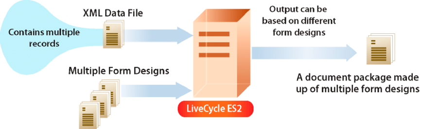

# Criando fluxos de saída de Documento {#creating-document-output-streams}

**Sobre o Serviço de Saída**

O serviço de Saída permite a saída de documentos como PDF (incluindo documentos PDF/A), PostScript, PCL (Printer Control Language) e os seguintes formatos de etiqueta:

* Zebra - ZPL
* Intermec - IPL
* Datamax - DPL
* TecToshiba - TPCL

Usando o serviço de Saída, é possível unir dados de formulário XML a um design de formulário e enviar o documento para uma impressora ou arquivo de rede.

Há duas maneiras de passar um design de formulário (um arquivo XDP) para o serviço de Saída. Você pode passar uma `com.adobe.idp.Document` instância que contenha um design de formulário para o serviço de Saída. Ou você pode passar um valor de URI que especifica o local do design de formulário. Ambas as maneiras são discutidas em *Programação com formulários* AEM.

>[!NOTE]
>
>O serviço de Saída não suporta documentos PDF Acroform que contêm scripts específicos de objetos de aplicativo. Os documentos Acroform PDF que contêm scripts específicos de objetos de aplicativo não são renderizados.

As seções a seguir mostram como passar um design de formulário para o serviço de Saída usando um valor de URI:

* [Criação de Documentos PDF](creating-document-output-streams.md#creating-pdf-documents)
* [Criação de Documentos PDF/A](creating-document-output-streams.md#creating-pdf-a-documents)

As seções a seguir mostram como passar um design de formulário em uma `com.adobe.idp.Document` instância:

* [Transmissão de Documentos localizados no Content Services (obsoleto) para o Serviço de Saída](creating-document-output-streams.md#passing-documents-located-in-content-services-deprecated-to-the-output-service)
* [Criação de Documentos PDF usando fragmentos](creating-document-output-streams.md#creating-pdf-documents-using-fragments)

Uma consideração ao decidir qual técnica usar é se você estiver obtendo o design de formulário de outro serviço AEM Forms e, em seguida, passá-lo em uma `com.adobe.idp.Document` instância. As seções *Transmissão de Documentos para o Serviço* de saída e *Criação de Documentos PDF usando Fragmentos* mostram como obter um design de formulário de outro serviço AEM Forms. A primeira seção recupera o design de formulário do Content Services (obsoleto). A segunda seção recupera o design de formulário do serviço Assembler.

Se você estiver obtendo o design de formulário de um local fixo, como o sistema de arquivos, poderá usar qualquer técnica. Ou seja, você pode especificar o valor de URI para um arquivo XDP ou usar uma `com.adobe.idp.Document` instância.

Para transmitir um valor de URI que especifique o local do design de formulário ao criar um documento PDF, use o `generatePDFOutput` método. Da mesma forma, para passar uma `com.adobe.idp.Document` instância para o serviço de Saída ao criar um documento PDF, use o `generatePDFOutput2` método.

Ao enviar um fluxo de saída para uma impressora de rede, você também pode usar qualquer uma das técnicas. Para enviar um fluxo de saída para uma impressora transmitindo uma `com.adobe.idp.Document` instância que contenha um design de formulário, use o `sendToPrinter2`método. Para enviar um fluxo de saída para uma impressora transmitindo um valor de URI, use o `sendToPrinter`método. A seção *Enviando fluxos de impressão para impressoras* usa o `sendToPrinter` método.

É possível realizar essas tarefas usando o serviço de Saída:

* [Criação de Documentos PDF](creating-document-output-streams.md#creating-pdf-documents)
* [Criação de Documentos PDF/A](creating-document-output-streams.md#creating-pdf-a-documents)
* [Transmissão de Documentos localizados no Content Services (obsoleto) para o Serviço de Saída](creating-document-output-streams.md#passing-documents-located-in-content-services-deprecated-to-the-output-service)
* [Criação de Documentos PDF usando fragmentos](creating-document-output-streams.md#creating-pdf-documents-using-fragments)
* [Imprimindo em Arquivos](creating-document-output-streams.md#printing-to-files)
* [Envio de fluxos de impressão para impressoras](creating-document-output-streams.md#sending-print-streams-to-printers)
* [Criação de vários arquivos de saída](creating-document-output-streams.md#creating-multiple-output-files)
* [Criando Regras de Pesquisa](creating-document-output-streams.md#creating-search-rules)
* [Nivelamento de Documentos PDF](creating-document-output-streams.md#flattening-pdf-documents)

>[!NOTE]
>
>Para obter mais informações sobre o serviço de Saída, consulte Referência de [serviços para formulários](https://www.adobe.com/go/learn_aemforms_services_63)AEM.

## Criação de Documentos PDF {#creating-pdf-documents}

É possível usar o serviço de Saída para criar um documento PDF que se baseia em um design de formulário e nos dados de formulário XML fornecidos. O documento PDF criado pelo serviço de Saída não é um documento PDF interativo; um usuário não pode digitar ou modificar dados do formulário.

Se você quiser criar um documento PDF para armazenamentos de longo prazo, é recomendável criar um documento PDF/A. (Consulte [Criação de Documentos](creating-document-output-streams.md#creating-pdf-a-documents)PDF/A.)

Para criar um formulário PDF interativo que permita ao usuário inserir dados, use o serviço de Formulários. (Consulte [Renderização de formulários](/help/forms/developing/rendering-forms.md#rendering-interactive-pdf-forms)PDF interativos.)

>[!NOTE]
>
>Para obter mais informações sobre o serviço de Saída, consulte Referência de [serviços para formulários](https://www.adobe.com/go/learn_aemforms_services_63)AEM.

### Resumo das etapas {#summary-of-steps}

Para criar um documento PDF, execute as seguintes etapas:

1. Incluir arquivos de projeto.
1. Crie um objeto de cliente de saída.
1. Referência a uma fonte de dados XML.
1. Defina as opções de tempo de execução do PDF.
1. Defina as opções de tempo de execução de renderização.
1. Gere um documento PDF.
1. Recupere os resultados da operação.

**Incluir arquivos de projeto**

Inclua os arquivos necessários no projeto de desenvolvimento. Se você estiver criando um aplicativo cliente usando Java, inclua os arquivos JAR necessários. Se você estiver usando serviços da Web, certifique-se de incluir os arquivos proxy.

Os seguintes arquivos JAR devem ser adicionados ao classpath do seu projeto:

* adobe-livecycle-client.jar
* adobe-usermanager-client.jar
* adobe-output-client.jar
* adobe-utilities.jar (obrigatório se o AEM Forms for implantado em JBoss)
* jbossall-client.jar (Obrigatório se o AEM Forms for implantado em JBoss)

se o AEM Forms for implantado em um servidor de aplicativos J2EE compatível que não seja JBoss, será necessário substituir os arquivos adobe-utilities.jar e jbossall-client.jar por arquivos JAR específicos do servidor de aplicativos J2EE no qual o AEM Forms é implantado.

**Criar um objeto de cliente de saída**

Antes de executar programaticamente uma operação de serviço de Saída, você deve criar um objeto cliente de serviço de Saída. Se você estiver usando a API Java, crie um `OutputClient` objeto. Se você estiver usando a API de serviço da Web de Saída, crie um `OutputServiceService` objeto.

**Referência a uma fonte de dados XML**

Para unir dados ao design de formulário, é necessário referenciar uma fonte de dados XML que contenha dados. Um elemento XML deve existir para cada campo de formulário que você planeja preencher com dados. O nome do elemento XML deve corresponder ao nome do campo. Um elemento XML será ignorado se não corresponder a um campo de formulário ou se o nome do elemento XML não corresponder ao nome do campo. Não é necessário corresponder à ordem na qual os elementos XML são exibidos se todos os elementos XML forem especificados.

Considere o exemplo de formulário de solicitação de empréstimo a seguir.


Para unir dados neste design de formulário, é necessário criar uma fonte de dados XML que corresponda ao formulário. O XML a seguir representa uma fonte de dados XML XDP que corresponde ao formulário de aplicativo hipotecário de exemplo.

```as3
 <?xml version="1.0" encoding="UTF-8" ?>
 - <xfa:datasets xmlns:xfa="https://www.xfa.org/schema/xfa-data/1.0/">
 - <xfa:data>
 - <data>
     - <Layer>
         <closeDate>1/26/2007</closeDate>
         <lastName>Johnson</lastName>
         <firstName>Jerry</firstName>
         <mailingAddress>JJohnson@NoMailServer.com</mailingAddress>
         <city>New York</city>
         <zipCode>00501</zipCode>
         <state>NY</state>
         <dateBirth>26/08/1973</dateBirth>
         <middleInitials>D</middleInitials>
         <socialSecurityNumber>(555) 555-5555</socialSecurityNumber>
         <phoneNumber>5555550000</phoneNumber>
     </Layer>
     - <Mortgage>
         <mortgageAmount>295000.00</mortgageAmount>
         <monthlyMortgagePayment>1724.54</monthlyMortgagePayment>
         <purchasePrice>300000</purchasePrice>
         <downPayment>5000</downPayment>
         <term>25</term>
         <interestRate>5.00</interestRate>
     </Mortgage>
 </data>
 </xfa:data>
 </xfa:datasets>
```

**Definir opções de tempo de execução de PDF**

Defina a opção URI do arquivo ao criar um documento PDF. Essa opção especifica o nome e o local do arquivo PDF gerado pelo serviço de Saída.

>[!NOTE]
>
>Em vez de definir a opção de tempo de execução URI do arquivo, você pode recuperar programaticamente o documento PDF do tipo de dados complexo retornado pelo serviço de Saída. No entanto, ao definir a opção de tempo de execução do URI do arquivo, não é necessário criar uma lógica de aplicativo que recupera programaticamente o documento PDF.

**Definir opções de tempo de execução de renderização**

É possível definir opções de tempo de execução de renderização ao criar um documento PDF. Embora essas opções não sejam obrigatórias (ao contrário das opções de tempo de execução do PDF que são necessárias), é possível executar tarefas, como melhorar o desempenho do serviço de Saída. Por exemplo, é possível armazenar em cache o design de formulário que o serviço de Saída usa para melhorar seu desempenho.

Se você usar um formulário do Acrobat marcado como entrada, não poderá usar o serviço de Saída Java ou a API de serviço da Web para desativar a configuração marcada. Se você tentar definir programaticamente essa opção como `false`, o documento PDF resultante ainda será marcado.

>[!NOTE]
>
>Se você não especificar as opções de tempo de execução de renderização, os valores padrão serão usados. Para obter informações sobre como renderizar opções de tempo de execução, consulte a referência da `RenderOptionsSpec` classe. (Consulte Referência [da API do](https://www.adobe.com/go/learn_aemforms_javadocs_63_en)AEM Forms).

**Gerar um documento PDF**

Depois de referenciar uma fonte de dados XML válida que contenha dados de formulário e definir opções de tempo de execução, é possível chamar o serviço de Saída, o que resulta na geração de um documento PDF.

Ao gerar um documento PDF, você especifica os valores de URI exigidos pelo serviço de Saída para criar um documento PDF. Um design de formulário pode ser armazenado em locais como o sistema de arquivos do servidor ou como parte de um aplicativo AEM Forms. Um design de formulário (ou outros recursos, como um arquivo de imagem) que existe como parte de um aplicativo do Forms pode ser referenciado usando o valor do URI raiz do conteúdo `repository:///`. Por exemplo, considere o seguinte design de formulário chamado *Loan.xdp* localizado em um aplicativo do Forms chamado *Applications/FormsApplication*:


Para acessar o arquivo Loan.xdp mostrado na ilustração anterior, especifique `repository:///Applications/FormsApplication/1.0/FormsFolder/` como o terceiro parâmetro passado para o `OutputClient` método do objeto `generatePDFOutput` . Especifique o nome do formulário (*Loan.xdp*) como o segundo parâmetro passado para o `OutputClient` método do `generatePDFOutput` objeto.

Se o arquivo XDP contiver imagens (ou outros recursos, como fragmentos), coloque os recursos na mesma pasta do aplicativo que o arquivo XDP. O AEM Forms usa o URI raiz do conteúdo como o caminho base para resolver referências a imagens. Por exemplo, se o arquivo Loan.xdp contiver uma imagem, certifique-se de colocar a imagem em `Applications/FormsApplication/1.0/FormsFolder/`.

>[!NOTE]
>
>É possível fazer referência a um URI de aplicativo do Forms ao chamar os métodos `OutputClient` ou os métodos do `generatePDFOutput` objeto `generatePrintedOutput` .

>[!NOTE]
>
>Para ver um start rápido completo que cria um documento PDF referenciando um XDP localizado em um aplicativo Forms, consulte Start [rápido (modo EJB): Criação de um documento PDF com base em um arquivo XDP do aplicativo usando a API](/help/forms/developing/output-service-java-api-quick.md#quick-start-soap-mode-creating-a-pdf-document-based-on-an-application-xdp-file-using-the-java-api)Java.

**Recuperar os resultados da operação**

Depois que o serviço de Saída executa uma operação, ele retorna vários itens de dados, como dados XML de status, que especificam se a operação foi bem-sucedida.

**Consulte também:**

[Criar um documento PDF usando a API Java](creating-document-output-streams.md#create-a-pdf-document-using-the-java-api)

[Criar um documento PDF usando a API de serviço da Web](creating-document-output-streams.md#create-a-pdf-document-using-the-web-service-api)

[Incluir arquivos da biblioteca Java do AEM Forms](/help/forms/developing/invoking-aem-forms-using-java.md#including-aem-forms-java-library-files)

[Configuração das propriedades de conexão](/help/forms/developing/invoking-aem-forms-using-java.md#setting-connection-properties)

[Start rápidos da API do Serviço de Saída](/help/forms/developing/output-service-java-api-quick.md#output-service-java-api-quick-start-soap)

### Criar um documento PDF usando a API Java {#create-a-pdf-document-using-the-java-api}

Crie um documento PDF usando a API de saída (Java):

1. Incluir arquivos de projeto.

   Inclua arquivos JAR do cliente, como adobe-output-client.jar, no caminho da classe do seu projeto Java.

1. Crie um objeto de cliente de saída.

   * Crie um `ServiceClientFactory` objeto que contenha propriedades de conexão.
   * Crie um `OutputClient` objeto usando seu construtor e transmitindo o `ServiceClientFactory` objeto.

1. Referência a uma fonte de dados XML.

   * Crie um `java.io.FileInputStream` objeto que represente a fonte de dados XML usada para preencher o documento PDF usando seu construtor e transmitindo um valor de string que especifica o local do arquivo XML.
   * Crie um `com.adobe.idp.Document` objeto usando seu construtor. Passe o `java.io.FileInputStream` objeto.

1. Defina as opções de tempo de execução do PDF.

   * Crie um `PDFOutputOptionsSpec` objeto usando seu construtor.
   * Defina a opção Arquivo URI chamando o `PDFOutputOptionsSpec` método do `setFileURI` objeto. Passe um valor de string que especifica o local do arquivo PDF gerado pelo serviço de Saída. A opção Arquivo URI é relativa ao servidor de aplicativos J2EE que hospeda o AEM Forms, não ao computador cliente.

1. Defina as opções de tempo de execução de renderização.

   * Crie um `RenderOptionsSpec` objeto usando seu construtor.
   * Armazene o design de formulário em cache para melhorar o desempenho do serviço de Saída, chamando o objeto `RenderOptionsSpec` e transmitindo `setCacheEnabled` `true`.
   >[!NOTE]
   >
   >Não é possível definir a versão do documento PDF usando o método do `RenderOptionsSpec` objeto `setPdfVersion` se o documento de entrada for um formulário Acrobat (um formulário criado no Acrobat) ou um documento XFA assinado ou certificado. O documento PDF de saída retém a versão original do PDF. Da mesma forma, não é possível definir a opção Adobe PDF marcada chamando o método do `RenderOptionsSpec` objeto `setTaggedPDF` se o documento de entrada for um formulário Acrobat ou um documento XFA assinado ou certificado.

   >[!NOTE]
   >
   >Não é possível definir a opção PDF linearizado usando o método do `RenderOptionsSpec` objeto `setLinearizedPDF` se o documento PDF de entrada for certificado ou assinado digitalmente. (Consulte Assinando [digitalmente Documentos](/help/forms/developing/digitally-signing-certifying-documents.md#digitally-signing-pdf-documents)*PDF.)*

1. Gere um documento PDF.

   Crie um documento PDF chamando o método do `OutputClient` objeto `generatePDFOutput` e transmitindo os seguintes valores:

   * Um valor `TransformationFormat` lista discriminada. Para gerar um documento PDF, especifique `TransformationFormat.PDF`.
   * Um valor de string que especifica o nome do design de formulário.
   * Um valor de string que especifica a raiz do conteúdo na qual o design de formulário está localizado.
   * Um `PDFOutputOptionsSpec` objeto que contém opções de tempo de execução de PDF.
   * Um `RenderOptionsSpec` objeto que contém opções de tempo de execução de renderização.
   * O `com.adobe.idp.Document` objeto que contém a fonte de dados XML que contém os dados a serem unidos ao design de formulário.
   O `generatePDFOutput` método retorna um `OutputResult` objeto que contém os resultados da operação.

   >[!NOTE]
   >
   >Ao gerar um documento PDF chamando o `generatePDFOutput` método, lembre-se de que não é possível unir dados a um formulário PDF XFA assinado ou certificado. (Consulte Assinando e certificando Documentos [](/help/forms/developing/digitally-signing-certifying-documents.md#digitally-signing-and-certifying-documents)*digitalmente.)*

   >[!NOTE]
   >
   >O `OutputResult` método do `getRecordLevelMetaDataList` objeto retorna `null`*.*

   >[!NOTE]
   >
   >Também é possível criar um documento PDF chamando o `OutputClient` método do `generatePDFOutput2` objeto. (Consulte [Transmissão de Documentos localizados no Content Services (obsoleto) para o Serviço](creating-document-output-streams.md#passing-documents-located-in-content-services-deprecated-to-the-output-service)*de saída.)*

1. Recupere os resultados da operação.

   * Recupere um `com.adobe.idp.Document` objeto que representa o status da operação `generatePDFOutput` chamando o `OutputResult` método do `getStatusDoc` objeto. Este método retorna dados XML de status que especificam se a operação foi bem-sucedida.
   * Crie um `java.io.File` objeto que contenha os resultados da operação. Verifique se a extensão do nome do arquivo é .xml.
   * Chame o `com.adobe.idp.Document` método do `copyToFile` objeto para copiar o conteúdo do `com.adobe.idp.Document` objeto para o arquivo (certifique-se de usar o `com.adobe.idp.Document` objeto que foi retornado pelo `getStatusDoc` método).
   Embora o serviço de Saída grave o documento PDF no local especificado pelo argumento passado para o `PDFOutputOptionsSpec` método do `setFileURI` objeto, é possível recuperar programaticamente o documento PDF/A chamando o `OutputResult` método do `getGeneratedDoc` objeto.

**Consulte também:**

[Resumo das etapas](creating-document-output-streams.md#summary-of-steps)

[Start rápido (modo EJB): Criação de um documento PDF usando a API Java](/help/forms/developing/output-service-java-api-quick.md#quick-start-soap-mode-creating-a-pdf-document-using-the-java-api)

[Start rápido (modo SOAP): Criação de um documento PDF usando a API Java](/help/forms/developing/output-service-java-api-quick.md#quick-start-soap-mode-creating-a-pdf-document-using-the-java-api)

[Incluir arquivos da biblioteca Java do AEM Forms](/help/forms/developing/invoking-aem-forms-using-java.md#including-aem-forms-java-library-files)

[Configuração das propriedades de conexão](/help/forms/developing/invoking-aem-forms-using-java.md#setting-connection-properties)

### Criar um documento PDF usando a API de serviço da Web {#create-a-pdf-document-using-the-web-service-api}

Crie um documento PDF usando a API de saída (serviço da Web):

1. Incluir arquivos de projeto.

   Crie um projeto do Microsoft .NET que use MTOM. Certifique-se de usar a seguinte definição WSDL: `http://localhost:8080/soap/services/OutputService?WSDL&lc_version=9.0.1`.

   >[!NOTE]
   >
   >Substitua `localhost` pelo endereço IP do servidor que hospeda o AEM Forms.

1. Crie um objeto de cliente de saída.

   * Crie um `OutputServiceClient` objeto usando seu construtor padrão.
   * Crie um `OutputServiceClient.Endpoint.Address` objeto usando o `System.ServiceModel.EndpointAddress` construtor. Passe um valor de string que especifica o WSDL para o serviço AEM Forms (por exemplo, `http://localhost:8080/soap/services/OutputService?blob=mtom`.) Não é necessário usar o `lc_version` atributo. Esse atributo é usado ao criar uma referência de serviço. No entanto, especifique `?blob=mtom` para usar MTOM.
   * Crie um `System.ServiceModel.BasicHttpBinding` objeto obtendo o valor do `OutputServiceClient.Endpoint.Binding` campo. Converta o valor de retorno em `BasicHttpBinding`.
   * Defina o `System.ServiceModel.BasicHttpBinding` campo do `MessageEncoding` objeto como `WSMessageEncoding.Mtom`. Esse valor garante que o MTOM seja usado.
   * Ative a autenticação HTTP básica executando as seguintes tarefas:

      * Atribua o nome de usuário dos formulários AEM ao campo `OutputServiceClient.ClientCredentials.UserName.UserName`.
      * Atribua o valor da senha correspondente ao campo `OutputServiceClient.ClientCredentials.UserName.Password`.
      * Atribua o valor constante `HttpClientCredentialType.Basic` ao campo `BasicHttpBindingSecurity.Transport.ClientCredentialType`.
      * Atribua o valor constante `BasicHttpSecurityMode.TransportCredentialOnly` ao campo `BasicHttpBindingSecurity.Security.Mode`.

1. Referência a uma fonte de dados XML.

   * Crie um `BLOB` objeto usando seu construtor. O `BLOB` objeto é usado para armazenar dados XML que serão unidos ao documento PDF.
   * Crie um `System.IO.FileStream` objeto chamando seu construtor e transmitindo um valor de string que representa o local do arquivo XML que contém os dados do formulário.
   * Crie uma matriz de bytes que armazene o conteúdo do `System.IO.FileStream` objeto. É possível determinar o tamanho da matriz de bytes obtendo a propriedade do `System.IO.FileStream` objeto `Length` .
   * Preencha a matriz de bytes com dados de fluxo chamando o método do `System.IO.FileStream` `Read` objeto e transmitindo a matriz de bytes, a posição inicial e o comprimento do fluxo a ser lido.
   * Preencha o `BLOB` objeto atribuindo seu `MTOM` campo ao conteúdo da matriz de bytes.

1. Definir opções de tempo de execução de PDF

   * Crie um `PDFOutputOptionsSpec` objeto usando seu construtor.
   * Defina a opção URI do arquivo atribuindo um valor de string que especifica o local do arquivo PDF que o serviço de saída gera para o membro de `PDFOutputOptionsSpec` dados do `fileURI` objeto. A opção Arquivo URI é relativa ao servidor de aplicativos J2EE que hospeda o AEM Forms, não ao computador cliente.

1. Defina as opções de tempo de execução de renderização.

   * Crie um `RenderOptionsSpec` objeto usando seu construtor.
   * Armazene o design de formulário em cache para melhorar o desempenho do serviço de Saída atribuindo o valor `true` ao membro de `RenderOptionsSpec` `cacheEnabled` dados do objeto.
   >[!NOTE]
   >
   >Não é possível definir a versão do documento PDF usando o método do `RenderOptionsSpec` objeto `setPdfVersion` se o documento de entrada for um formulário Acrobat (um formulário criado no Acrobat) ou um documento XFA assinado ou certificado. O documento PDF de saída retém a versão original do PDF. Da mesma forma, não é possível definir a opção Adobe PDF marcada chamando o método `RenderOptionsSpec` * do `setTaggedPDF`objeto se o documento de entrada for um formulário Acrobat ou um documento XFA assinado ou certificado.*

   >[!NOTE]
   >
   >Não é possível definir a opção PDF linearizado usando o membro do `RenderOptionsSpec` objeto `linearizedPDF` se o documento PDF de entrada for certificado ou assinado digitalmente. (Consulte Assinando [digitalmente Documentos](/help/forms/developing/digitally-signing-certifying-documents.md#digitally-signing-pdf-documents)*PDF.)*

1. Gere um documento PDF.

   Crie um documento PDF chamando o `OutputServiceService` método do `generatePDFOutput`objeto e transmitindo os seguintes valores:

   * Um valor `TransformationFormat` lista discriminada. Para gerar um documento PDF, especifique `TransformationFormat.PDF`.
   * Um valor de string que especifica o nome do design de formulário.
   * Um valor de string que especifica a raiz do conteúdo na qual o design de formulário está localizado.
   * Um `PDFOutputOptionsSpec` objeto que contém opções de tempo de execução de PDF.
   * Um `RenderOptionsSpec` objeto que contém opções de tempo de execução de renderização.
   * O `BLOB` objeto que contém a fonte de dados XML que contém os dados a serem unidos ao design de formulário.
   * Um `BLOB` objeto preenchido pelo `generatePDFOutput` método. O `generatePDFOutput` método preenche esse objeto com metadados gerados que descrevem o documento. (Esse valor de parâmetro é necessário somente para a invocação do serviço da Web).
   * Um `BLOB` objeto preenchido pelo `generatePDFOutput` método. O `generatePDFOutput` método preenche esse objeto com dados de resultado. (Esse valor de parâmetro é necessário somente para a invocação do serviço da Web).
   * Um `OutputResult` objeto que contém os resultados da operação. (Esse valor de parâmetro é necessário somente para a invocação do serviço da Web).
   >[!NOTE]
   >
   >Ao gerar um documento PDF chamando o `generatePDFOutput` método, lembre-se de que não é possível unir dados a um formulário PDF XFA assinado ou certificado. (Consulte Assinando e certificando Documentos [](/help/forms/developing/digitally-signing-certifying-documents.md#digitally-signing-and-certifying-documents)*digitalmente.)*

   >[!NOTE]
   >
   >Também é possível criar um documento PDF chamando o `OutputClient` método do `generatePDFOutput2` objeto. (Consulte [Transmissão de Documentos localizados no Content Services (obsoleto) para o Serviço](creating-document-output-streams.md#passing-documents-located-in-content-services-deprecated-to-the-output-service)*de saída.)*

1. Recupere os resultados da operação.

   * Crie um `System.IO.FileStream` objeto chamando seu construtor e transmitindo um valor de string que representa um local de arquivo XML que contém dados de resultado. Verifique se a extensão do nome do arquivo é .xml.
   * Crie uma matriz de bytes que armazene o conteúdo de dados do `BLOB` objeto que foi preenchido com dados de resultado pelo `OutputServiceService` método do `generatePDFOutput` objeto (o oitavo parâmetro). Preencha a matriz de bytes obtendo o valor do `BLOB` objeto `MTOM``field`.
   * Crie um `System.IO.BinaryWriter` objeto chamando seu construtor e transmitindo o `System.IO.FileStream` objeto.
   * Grave o conteúdo da matriz de bytes no arquivo XML, chamando o método do `System.IO.BinaryWriter` objeto `Write` e transmitindo a matriz de bytes.
   Consulte também:

   [Resumo das etapas](creating-document-output-streams.md#summary-of-steps)

   [Invocar formulários AEM usando MTOM](/help/forms/developing/invoking-aem-forms-using-web.md#invoking-aem-forms-using-mtom)

   [Invocar o AEM Forms usando SwaRef](/help/forms/developing/invoking-aem-forms-using-web.md#invoking-aem-forms-using-swaref)

   >[!NOTE]
   >
   >O `OutputServiceService` método do `generateOutput` objeto está obsoleto.

## Criação de Documentos PDF/A {#creating-pdf-a-documents}

Você pode usar o serviço Saída para criar um documento PDF/A. Como o PDF/A é um formato de arquivamento para a preservação de longo prazo do conteúdo do documento, todas as fontes são incorporadas e o arquivo é descompactado. Como resultado, um documento PDF/A geralmente é maior do que um documento PDF padrão. Além disso, um documento PDF/A não contém conteúdo de áudio e vídeo. Como outras tarefas de serviço de Saída, você fornece um design de formulário e dados para unir a um design de formulário para criar um documento PDF/A.

A especificação PDF/A-1 consiste em dois níveis de conformidade, a a e b. A principal diferença entre os dois é em relação ao suporte da estrutura lógica (acessibilidade), que não é necessário para o nível de conformidade b. Independentemente do nível de conformidade, o PDF/A-1 determina que todas as fontes sejam incorporadas no documento PDF/A gerado.

Embora o PDF/A seja o padrão para arquivamento de documentos PDF, não é obrigatório que o PDF/A seja usado para arquivamento se um documento PDF padrão atender às necessidades da sua empresa. O objetivo do padrão PDF/A é estabelecer um arquivo PDF que possa ser armazenado por um longo período de tempo, além de atender aos requisitos de preservação do documento. Por exemplo, um URL não pode ser incorporado em um PDF/A porque, com o tempo, o URL pode se tornar inválido.

Sua organização deve avaliar suas próprias necessidades, a duração do tempo que você pretende manter o documento, as considerações de tamanho do arquivo e determinar sua própria estratégia de arquivamento. Você pode determinar programaticamente se um documento PDF é compatível com PDF/A usando o serviço DocConverter. (Consulte Determinando [Programaticamente a conformidade](/help/forms/developing/pdf-a-documents.md#programmatically-determining-pdf-a-compliancy)do PDF/A.)

Um documento PDF/A deve usar a fonte especificada no design de formulário e as fontes não podem ser substituídas. Como resultado, se uma fonte localizada em um documento PDF não estiver disponível no sistema operacional host (SO), ocorrerá uma exceção.

Quando um documento PDF/A é aberto no Acrobat, uma mensagem é exibida confirmando que o documento é um documento PDF/A, como mostra a ilustração a seguir.


>[!NOTE]
>
>O site do AIIM tem uma seção Perguntas frequentes sobre PDF/A que você pode acessar em [https://www.aiim.org/documents/standards/19005-1_FAQ.pdf](https://www.aiim.org/documents/standards/19005-1_FAQ.pdf).

>[!NOTE]
>
>Para obter mais informações sobre o serviço de Saída, consulte Referência de [serviços para formulários](https://www.adobe.com/go/learn_aemforms_services_63)AEM.

### Resumo das etapas {#summary_of_steps-1}

Para criar um documento PDF/A, execute as seguintes etapas:

1. Incluir arquivos de projeto.
1. Crie um objeto de cliente de saída.
1. Referência a uma fonte de dados XML.
1. Defina as opções de tempo de execução do PDF/A.
1. Defina as opções de tempo de execução de renderização.
1. Gere um documento PDF/A.
1. Recupere os resultados da operação.

**Incluir arquivos de projeto**

Inclua os arquivos necessários no projeto de desenvolvimento. Se você estiver criando um aplicativo personalizado usando Java, inclua os arquivos JAR necessários. Se você estiver usando serviços da Web, certifique-se de incluir os arquivos proxy.

Os seguintes arquivos JAR devem ser adicionados ao caminho de classe do seu projeto:

* adobe-livecycle-client.jar
* adobe-usermanager-client.jar
* adobe-output-client.jar
* adobe-utilities.jar (obrigatório se o AEM Forms for implantado em JBoss)
* jbossall-client.jar (Obrigatório se o AEM Forms for implantado em JBoss)

se o AEM Forms for implantado em um servidor de aplicativos J2EE compatível que não seja JBoss, será necessário substituir os arquivos adobe-utilities.jar e jbossall-client.jar por arquivos JAR específicos do servidor de aplicativos J2EE no qual o AEM Forms é implantado.

**Criar um objeto de cliente de saída**

Antes de executar programaticamente uma operação de serviço de Saída, você deve criar um objeto cliente de serviço de Saída. Se você estiver usando a API Java, crie um `OutputClient` objeto. Se você estiver usando a API de serviço da Web de Saída, crie um `OutputServiceService` objeto.

**Referência a uma fonte de dados XML**

Para unir dados ao design de formulário, é necessário referenciar uma fonte de dados XML que contenha dados. Um elemento XML deve existir para cada campo de formulário que você deseja preencher com dados. O nome do elemento XML deve corresponder ao nome do campo. Um elemento XML será ignorado se não corresponder a um campo de formulário ou se o nome do elemento XML não corresponder ao nome do campo. Não é necessário corresponder à ordem na qual os elementos XML são exibidos se todos os elementos XML forem especificados.

**Definir opções de tempo de execução de PDF/A**

É possível definir a opção URI do arquivo ao criar um documento PDF/A. O URI é relativo ao servidor de aplicativos J2EE que hospeda o AEM Forms. Ou seja, se você definir C:\Adobe, o arquivo será gravado na pasta no servidor, não no computador cliente. O URI especifica o nome e o local do arquivo PDF/A gerado pelo serviço de saída.

**Definir opções de tempo de execução de renderização**

É possível definir opções de tempo de execução de renderização ao criar documentos PDF/A. Duas opções relacionadas ao PDF/A que você pode definir são os valores `PDFAConformance` e `PDFARevisionNumber` os valores. O `PDFAConformance` valor se refere ao modo como um documento PDF atende aos requisitos que especificam como os documentos eletrônicos de longo prazo são preservados. Valores válidos para essa opção são `A` e `B`. Para obter informações sobre a conformidade a e b, consulte a especificação ISO PDF/A-1, intitulada Gerenciamento *de Documentos* ISO 19005-1.

O `PDFARevisionNumber` valor se refere ao número de revisão de um documento PDF/A. Para obter informações sobre o número de revisão de um documento PDF/A, consulte a especificação ISO PDF/A-1, intitulada Gerenciamento *de Documentos* ISO 19005-1.

>[!NOTE]
>
>Não é possível definir a opção Adobe PDF marcada para `false` ao criar um documento PDF/A 1A. O PDF/A 1A sempre será um documento PDF marcado. Além disso, não é possível definir a opção Adobe PDF marcada para `true` ao criar um documento PDF/A 1B. O PDF/A 1B sempre será um documento PDF não marcado.

**Gerar um documento PDF/A**

Depois de referenciar uma fonte de dados XML válida que contenha dados de formulário e definir opções de tempo de execução, é possível chamar o serviço de Saída, fazendo com que ele gere um documento PDF/A.

**Recuperar os resultados da operação**

Depois que o serviço de Saída executa uma operação, ele retorna vários itens de dados, como dados XML, que especificam se a operação foi bem-sucedida.

**Consulte também:**

[Criar um documento PDF/A usando a API Java](creating-document-output-streams.md#create-a-pdf-a-document-using-the-java-api)

[Criar um documento PDF/A usando a API de serviço da Web](creating-document-output-streams.md#create-a-pdf-a-document-using-the-web-service-api)

[Incluir arquivos da biblioteca Java do AEM Forms](/help/forms/developing/invoking-aem-forms-using-java.md#including-aem-forms-java-library-files)

[Configuração das propriedades de conexão](/help/forms/developing/invoking-aem-forms-using-java.md#setting-connection-properties)

[Start rápidos da API do Serviço de Saída](/help/forms/developing/output-service-java-api-quick.md#output-service-java-api-quick-start-soap)

### Criar um documento PDF/A usando a API Java {#create-a-pdf-a-document-using-the-java-api}

Crie um documento PDF/A usando a API de saída (Java):

1. Incluir arquivos de projeto.

   Inclua arquivos JAR do cliente, como adobe-output-client.jar, no caminho da classe do seu projeto Java.

1. Crie um objeto de cliente de saída.

   * Crie um `ServiceClientFactory` objeto que contenha propriedades de conexão.
   * Crie um `OutputClient` objeto usando seu construtor e transmitindo o `ServiceClientFactory` objeto.

1. Referência a uma fonte de dados XML.

   * Crie um `java.io.FileInputStream` objeto que represente a fonte de dados XML usada para preencher o documento PDF/A usando seu construtor e transmitindo um valor de string que especifica o local do arquivo XML.
   * Crie um `com.adobe.idp.Document` objeto usando seu construtor e transmitindo o `java.io.FileInputStream` objeto.

1. Defina as opções de tempo de execução do PDF/A.

   * Crie um `PDFOutputOptionsSpec` objeto usando seu construtor.
   * Defina a opção Arquivo URI chamando o `PDFOutputOptionsSpec` método do `setFileURI` objeto. Passe um valor de string que especifica o local do arquivo PDF gerado pelo serviço de Saída. A opção Arquivo URI é relativa ao servidor de aplicativos J2EE que hospeda o AEM Forms, não ao computador cliente.

1. Defina as opções de tempo de execução de renderização.

   * Crie um `RenderOptionsSpec` objeto usando seu construtor.
   * Defina o `PDFAConformance` valor chamando o `RenderOptionsSpec` método do objeto e transmitindo um valor `setPDFAConformance` `PDFAConformance` enum que especifique o nível de conformidade. Por exemplo, para especificar o nível de conformidade A, passe `PDFAConformance.A`.
   * Defina o `PDFARevisionNumber` valor chamando o `RenderOptionsSpec` método do `setPDFARevisionNumber` objeto e transmitindo `PDFARevisionNumber.Revision_1`.
   >[!NOTE]
   >
   >A versão PDF de um documento PDF/A é 1.4, independentemente do valor especificado para o `RenderOptionsSpec` método do `setPdfVersion`*objeto.*

1. Gere um documento PDF/A.

   Crie um documento PDF/A chamando o método do `OutputClient` objeto `generatePDFOutput` e transmitindo os seguintes valores:

   * Um valor `TransformationFormat` lista discriminada. Para gerar um documento PDF/A, especifique `TransformationFormat.PDFA`.
   * Um valor de string que especifica o nome do design de formulário.
   * Um valor de string que especifica a raiz do conteúdo na qual o design de formulário está localizado.
   * Um `PDFOutputOptionsSpec` objeto que contém opções de tempo de execução de PDF.
   * Um `RenderOptionsSpec` objeto que contém opções de tempo de execução de renderização.
   * O `com.adobe.idp.Document` objeto que contém a fonte de dados XML que contém os dados a serem unidos ao design de formulário.
   O `generatePDFOutput` método retorna um `OutputResult` objeto que contém os resultados da operação.

   >[!NOTE]
   >
   >O `OutputResult` método do `getRecordLevelMetaDataList` objeto retorna `null`.

   >[!NOTE]
   >
   >Também é possível criar um documento PDF/A chamando o método `OutputClient` objeto `generatePDFOutput`2. (Consulte [Transmissão de Documentos localizados no Content Services (obsoleto) para o Serviço](creating-document-output-streams.md#passing-documents-located-in-content-services-deprecated-to-the-output-service)de saída.)

1. Recupere os resultados da operação.

   * Crie um `com.adobe.idp.Document` objeto que represente o status do `generatePDFOutput` método chamando o `OutputResult` método do `getStatusDoc` objeto.
   * Crie um `java.io.File` objeto que conterá os resultados da operação. Verifique se a extensão do nome do arquivo é .xml.
   * Chame o `com.adobe.idp.Document` método do `copyToFile` objeto para copiar o conteúdo do `com.adobe.idp.Document` objeto para o arquivo (certifique-se de usar o `com.adobe.idp.Document` objeto que foi retornado pelo `getStatusDoc` método).
   >[!NOTE]
   >
   >Embora o serviço de Saída grave o documento PDF/A no local especificado pelo argumento que é transmitido ao `PDFOutputOptionsSpec` método do `setFileURI` objeto, é possível recuperar programaticamente o documento PDF/A chamando o `OutputResult` `getGeneratedDoc` método do objeto.

**Consulte também:**

[Resumo das etapas](creating-document-output-streams.md#summary-of-steps)

[Start rápido (modo SOAP): Criação de um documento PDF/A usando a API Java](/help/forms/developing/output-service-java-api-quick.md#quick-start-soap-mode-creating-a-pdf-a-document-using-the-java-api)

[Incluir arquivos da biblioteca Java do AEM Forms](/help/forms/developing/invoking-aem-forms-using-java.md#including-aem-forms-java-library-files)

[Definindo propriedades](/help/forms/developing/invoking-aem-forms-using-java.md#setting-connection-properties)de conexão.

### Criar um documento PDF/A usando a API de serviço da Web {#create-a-pdf-a-document-using-the-web-service-api}

Crie um documento PDF/A usando a API de saída (serviço da Web):

1. Incluir arquivos de projeto.

   Crie um projeto do Microsoft .NET que use MTOM. Certifique-se de usar a seguinte definição WSDL: `http://localhost:8080/soap/services/OutputService?WSDL&lc_version=9.0.1`.

   >[!NOTE]
   >
   >Substitua `localhost` pelo endereço IP do servidor que hospeda o AEM Forms.

1. Crie um objeto de cliente de saída.

   * Crie um `OutputServiceClient` objeto usando seu construtor padrão.
   * Crie um `OutputServiceClient.Endpoint.Address` objeto usando o `System.ServiceModel.EndpointAddress` construtor. Passe um valor de string que especifica o WSDL para o serviço AEM Forms (por exemplo, `http://localhost:8080/soap/services/OutputService?blob=mtom`.) Não é necessário usar o `lc_version` atributo. Esse atributo é usado ao criar uma referência de serviço. No entanto, especifique `?blob=mtom` para usar MTOM.
   * Crie um `System.ServiceModel.BasicHttpBinding` objeto obtendo o valor do `OutputServiceClient.Endpoint.Binding` campo. Converta o valor de retorno em `BasicHttpBinding`.
   * Defina o `System.ServiceModel.BasicHttpBinding` campo do `MessageEncoding` objeto como `WSMessageEncoding.Mtom`. Esse valor garante que o MTOM seja usado.
   * Ative a autenticação HTTP básica executando as seguintes tarefas:

      * Atribua o nome de usuário dos formulários AEM ao campo `OutputServiceClient.ClientCredentials.UserName.UserName`.
      * Atribua o valor da senha correspondente ao campo `OutputServiceClient.ClientCredentials.UserName.Password`.
      * Atribua o valor constante `HttpClientCredentialType.Basic` ao campo `BasicHttpBindingSecurity.Transport.ClientCredentialType`.
      * Atribua o valor constante `BasicHttpSecurityMode.TransportCredentialOnly` ao campo `BasicHttpBindingSecurity.Security.Mode`.

1. Referência a uma fonte de dados XML.

   * Crie um `BLOB` objeto usando seu construtor. O `BLOB` objeto é usado para armazenar dados que serão unidos ao documento PDF/A.
   * Crie um `System.IO.FileStream` objeto chamando seu construtor e transmitindo um valor de string que representa o local do arquivo do documento PDF a ser criptografado e o modo no qual o arquivo será aberto.
   * Crie uma matriz de bytes que armazene o conteúdo do `System.IO.FileStream` objeto. É possível determinar o tamanho da matriz de bytes obtendo a propriedade do `System.IO.FileStream` objeto `Length` .
   * Preencha a matriz de bytes com dados de fluxo chamando o método do `System.IO.FileStream` `Read` objeto e transmitindo a matriz de bytes, a posição inicial e o comprimento do fluxo a ser lido.
   * Preencha o `BLOB` objeto atribuindo seu `MTOM` campo ao conteúdo da matriz de bytes.

1. Defina as opções de tempo de execução do PDF/A.

   * Crie um `PDFOutputOptionsSpec` objeto usando seu construtor.
   * Defina a opção URI do arquivo atribuindo um valor de string que especifica o local do arquivo PDF que o serviço de saída gera para o membro de `PDFOutputOptionsSpec` dados do `fileURI` objeto. A opção Arquivo URI é relativa ao servidor de aplicativos J2EE que hospeda o AEM Forms, não ao computador cliente

1. Defina as opções de tempo de execução de renderização.

   * Crie um `RenderOptionsSpec` objeto usando seu construtor.
   * Defina o `PDFAConformance` valor atribuindo um valor `PDFAConformance` enum ao membro de `RenderOptionsSpec` dados do `PDFAConformance` objeto. Por exemplo, para especificar o nível de conformidade A, atribua `PDFAConformance.A` a esse membro de dados.
   * Defina o `PDFARevisionNumber` valor atribuindo um valor `PDFARevisionNumber` enum ao membro de `RenderOptionsSpec` dados do `PDFARevisionNumber` objeto. Atribuir `PDFARevisionNumber.Revision_1` a este membro de dados.
   >[!NOTE]
   >
   >A versão PDF de um documento PDF/A é 1.4, independentemente do valor especificado.

1. Gere um documento PDF/A.

   Crie um documento PDF chamando o `OutputServiceService` método do `generatePDFOutput`objeto e transmitindo os seguintes valores:

   * Um valor de lista discriminada TransformationFormat. Para gerar um documento PDF, especifique `TransformationFormat.PDFA`.
   * Um valor de string que especifica o nome do design de formulário.
   * Um valor de string que especifica a raiz do conteúdo na qual o design de formulário está localizado.
   * Um `PDFOutputOptionsSpec` objeto que contém opções de tempo de execução de PDF.
   * Um `RenderOptionsSpec` objeto que contém opções de tempo de execução de renderização.
   * O `BLOB` objeto que contém a fonte de dados XML que contém os dados a serem unidos ao design de formulário.
   * Um `BLOB` objeto preenchido pelo `generatePDFOutput` método. O `generatePDFOutput` método preenche esse objeto com metadados gerados que descrevem o documento. (Esse valor de parâmetro é necessário somente para invocação de serviço da Web.)
   * Um `BLOB` objeto preenchido pelo `generatePDFOutput` método. O `generatePDFOutput` método preenche esse objeto com dados de resultado. (Esse valor de parâmetro é necessário somente para invocação de serviço da Web.)
   * Um `OutputResult` objeto que contém os resultados da operação. (Esse valor de parâmetro é necessário somente para invocação de serviço da Web.)
   >[!NOTE]
   >
   >Também é possível criar um documento PDF/A chamando o método `OutputClient` objeto `generatePDFOutput`2. (Consulte [Transmissão de Documentos localizados no Content Services (obsoleto) para o Serviço](creating-document-output-streams.md#passing-documents-located-in-content-services-deprecated-to-the-output-service)de saída.)

1. Recupere os resultados da operação.

   * Crie um `System.IO.FileStream` objeto chamando seu construtor e transmitindo um valor de string que representa um local de arquivo XML que contém dados de resultado. Verifique se a extensão do nome do arquivo é .xml.
   * Crie uma matriz de bytes que armazene o conteúdo de dados do `BLOB` objeto que foi preenchido com dados de resultado pelo `OutputServiceService` método do `generatePDFOutput` objeto (o oitavo parâmetro). Preencha a matriz de bytes obtendo o valor do campo do `BLOB` objeto `MTOM` .
   * Crie um `System.IO.BinaryWriter` objeto chamando seu construtor e transmitindo o `System.IO.FileStream` objeto.
   * Grave o conteúdo da matriz de bytes no arquivo XML, chamando o método do `System.IO.BinaryWriter` objeto `Write` e transmitindo a matriz de bytes.

**Consulte também:**

[Resumo das etapas](creating-document-output-streams.md#summary-of-steps)

[Invocar formulários AEM usando MTOM](/help/forms/developing/invoking-aem-forms-using-web.md#invoking-aem-forms-using-mtom)

[Invocar o AEM Forms usando SwaRef](/help/forms/developing/invoking-aem-forms-using-web.md#invoking-aem-forms-using-swaref)

## Transmissão de Documentos localizados no Content Services (obsoleto) para o Serviço de Saída {#passing-documents-located-in-content-services-deprecated-to-the-output-service}

O serviço de Saída renderiza um formulário PDF não interativo que se baseia em um design de formulário que geralmente é salvo como um arquivo XDP e criado no Designer. É possível enviar um `com.adobe.idp.Document` objeto que contenha o design de formulário para o serviço de Saída. O serviço de Saída renderiza o design de formulário localizado no `com.adobe.idp.Document` objeto.

Uma vantagem de passar um `com.adobe.idp.Document` objeto para o serviço de Saída é que outras operações do serviço AEM Forms retornam uma `com.adobe.idp.Document` instância. Ou seja, você pode obter uma `com.adobe.idp.Document` instância de outra operação de serviço e renderizá-la. Por exemplo, suponha que um arquivo XDP seja armazenado em um nó do Content Services (obsoleto) nomeado `/Company Home/Form Designs`, como mostrado na ilustração a seguir.

Você pode recuperar de forma programática o Loan.xdp do Content Services (obsoleto) e passar o arquivo XDP para o serviço de Saída dentro de um `com.adobe.idp.Document` objeto.

>[!NOTE]
>
>Para obter mais informações sobre o serviço de Formulários, consulte Referência de [serviços para formulários](https://www.adobe.com/go/learn_aemforms_services_63)AEM.

### Resumo das etapas {#summary_of_steps-2}

Para passar um documento obtido do Content Services (obsoleto) para o serviço de Saída, execute as seguintes tarefas:

1. Incluir arquivos de projeto.
1. Crie um objeto de API do Output e um objeto da API do Documento Management Client.
1. Recupere o design de formulário do Content Services (obsoleto).
1. Renderize o formulário PDF não interativo.
1. Execute uma ação com o fluxo de dados.

**Incluir arquivos de projeto**

Inclua os arquivos necessários ao seu projeto de desenvolvimento. Se você estiver criando um aplicativo cliente usando Java, inclua os arquivos JAR necessários. Se você estiver usando serviços da Web, inclua os arquivos proxy.

**Criar um objeto de API de cliente de gerenciamento de Documentos e de saída**

Antes de executar programaticamente uma operação de API de serviço de Saída, crie um objeto de API de Cliente de Saída. Além disso, como esse fluxo de trabalho recupera um arquivo XDP do Content Services (obsoleto), crie um objeto da API de Gerenciamento de Documentos.

**Recuperar o design de formulário do Content Services (obsoleto)**

Recupere o arquivo XDP do Content Services (obsoleto) usando o Java ou a API de serviço da Web. O arquivo XDP é retornado em uma `com.adobe.idp.Document` instância (ou em uma `BLOB` instância se você estiver usando serviços da Web). Em seguida, você pode passar a `com.adobe.idp.Document` instância para o serviço de Saída.

**Renderizar o formulário PDF não interativo**

Para renderizar um formulário não interativo, passe a `com.adobe.idp.Document` instância que foi retornada do Content Services (obsoleto) para o serviço de Saída.

>[!NOTE]
>
>Dois novos métodos nomeados `generatePDFOutput2`e g `eneratePrintedOutput2`aceitam um `com.adobe.idp.Document` objeto que contém um design de formulário. Também é possível enviar um formulário `com.adobe.idp.Document`que contenha o design de formulário para o serviço de Saída ao enviar um fluxo de impressão para uma impressora de rede.

**Executar uma ação com o fluxo de dados do formulário**

É possível salvar o formulário não interativo como um arquivo PDF. O formulário pode ser visualizado no Adobe Reader ou Acrobat.

**Consulte também:**

[Enviar documentos para o serviço de saída usando a API Java](creating-document-output-streams.md#pass-documents-to-the-output-service-using-the-java-api)

[Enviar documentos para o Serviço de Saída usando a API de serviço da Web](creating-document-output-streams.md#pass-documents-to-the-output-service-using-the-web-service-api)

[Incluir arquivos da biblioteca Java do AEM Forms](/help/forms/developing/invoking-aem-forms-using-java.md#including-aem-forms-java-library-files)

[Configuração das propriedades de conexão](/help/forms/developing/invoking-aem-forms-using-java.md#setting-connection-properties)

[Start rápidos da API do Serviço de Saída](/help/forms/developing/output-service-java-api-quick.md#output-service-java-api-quick-start-soap)

[Criação de Documentos PDF usando fragmentos](creating-document-output-streams.md#creating-pdf-documents-using-fragments)

### Enviar documentos para o serviço de saída usando a API Java {#pass-documents-to-the-output-service-using-the-java-api}

Passe um documento recuperado dos Serviços de conteúdo (obsoleto) usando o serviço de saída e a API do Content Services (obsoleto) (Java):

1. Incluir arquivos de projeto.

   Inclua arquivos JAR do cliente, como adobe-output-client.jar e adobe-contentservices-client.jar, no caminho de classe do seu projeto Java.

1. Crie um objeto de API do Output e do cliente de gerenciamento de Documentos.

   * Crie um `ServiceClientFactory` objeto que contenha propriedades de conexão. (Consulte [Configuração das propriedades](/help/forms/developing/invoking-aem-forms-using-java.md#setting-connection-properties)de conexão.)
   * Crie um `OutputClient` objeto usando seu construtor e transmitindo o `ServiceClientFactory` objeto.
   * Crie um `DocumentManagementServiceClientImpl` objeto usando seu construtor e transmitindo o `ServiceClientFactory` objeto.

1. Recupere o design de formulário do Content Services (obsoleto).

   Chame o método do `DocumentManagementServiceClientImpl` objeto `retrieveContent` e passe os seguintes valores:

   * Um valor de string que especifica o armazenamento no qual o conteúdo é adicionado. A loja padrão é `SpacesStore`. Esse valor é um parâmetro obrigatório.
   * Um valor de string que especifica o caminho totalmente qualificado do conteúdo a ser recuperado (por exemplo, `/Company Home/Form Designs/Loan.xdp`). Esse valor é um parâmetro obrigatório.
   * Um valor de string que especifica a versão. Esse valor é um parâmetro opcional e você pode passar uma string vazia. Nessa situação, a versão mais recente é recuperada.
   O `retrieveContent` método retorna um `CRCResult` objeto que contém o arquivo XDP. Recupere uma `com.adobe.idp.Document` instância chamando o `CRCResult` método do `getDocument` objeto.

1. Renderize o formulário PDF não interativo.

   Chame o método do `OutputClient` objeto `generatePDFOutput2` e passe os seguintes valores:

   * Um valor `TransformationFormat` lista discriminada. Para gerar um documento PDF, especifique `TransformationFormat.PDF`.
   * Um valor de string que especifica a raiz do conteúdo na qual os recursos adicionais, como imagens, estão localizados.
   * Um `com.adobe.idp.Document` objeto que representa o design de formulário (use a instância retornada pelo `CRCResult` método do `getDocument` objeto).
   * Um `PDFOutputOptionsSpec` objeto que contém opções de tempo de execução de PDF.
   * Um `RenderOptionsSpec` objeto que contém opções de tempo de execução de renderização.
   * O `com.adobe.idp.Document` objeto que contém a fonte de dados XML que contém os dados a serem unidos ao design de formulário.
   O `generatePDFOutput2` método retorna um `OutputResult` objeto que contém os resultados da operação.

1. Execute uma ação com o fluxo de dados do formulário.

   * Recupere um `com.adobe.idp.Document` objeto que representa o formulário não interativo chamando o `OutputResult` método do `getGeneratedDoc` objeto.
   * Crie um `java.io.File` objeto que contenha os resultados da operação. Verifique se a extensão do nome do arquivo é .pdf.
   * Chame o `com.adobe.idp.Document` método do `copyToFile` objeto para copiar o conteúdo do `com.adobe.idp.Document` objeto para o arquivo (certifique-se de usar o `com.adobe.idp.Document` objeto que foi retornado pelo `getGeneratedDoc` método).

**Consulte também:**

[Resumo das etapas](creating-document-output-streams.md#summary-of-steps)

[Start rápido (modo EJB): Transmissão de documentos ao serviço de saída usando a API Java](/help/forms/developing/output-service-java-api-quick.md#quick-start-soap-mode-passing-documents-to-the-output-service-using-the-java-api)

[Start rápido (modo SOAP): Transmissão de documentos ao serviço de saída usando a API Java](/help/forms/developing/output-service-java-api-quick.md#quick-start-soap-mode-passing-documents-to-the-output-service-using-the-java-api)

[Incluir arquivos da biblioteca Java do AEM Forms](/help/forms/developing/invoking-aem-forms-using-java.md#including-aem-forms-java-library-files)

[Configuração das propriedades de conexão](/help/forms/developing/invoking-aem-forms-using-java.md#setting-connection-properties)

### Enviar documentos para o Serviço de Saída usando a API de serviço da Web {#pass-documents-to-the-output-service-using-the-web-service-api}

Transmita um documento recuperado dos Serviços de conteúdo (obsoleto) usando o serviço de saída e a Content Services API (obsoleto) (serviço da Web):

1. Incluir arquivos de projeto.

   Crie um projeto do Microsoft .NET que use MTOM. Como esse aplicativo cliente chama dois serviços AEM Forms, crie duas referências de serviço. Use a seguinte definição WSDL para a referência de serviço associada ao serviço de Saída: `http://localhost:8080/soap/services/OutputService?WSDL&lc_version=9.0.1`.

   Use a seguinte definição WSDL para a referência de serviço associada ao serviço de Gerenciamento de Documentos: `http://localhost:8080/soap/services/DocumentManagementService?WSDL&lc_version=9.0.1`.

   Como o tipo de `BLOB` dados é comum a ambas as referências de serviço, qualifice totalmente o tipo de `BLOB` dados ao usá-lo. No start rápido do serviço da Web correspondente, todas as `BLOB` instâncias são totalmente qualificadas.

   >[!NOTE]
   >
   >Substitua `localhost` pelo endereço IP do servidor que hospeda o AEM Forms.

1. Crie um objeto de API do Output e do cliente de gerenciamento de Documentos.

   * Crie um `OutputServiceClient` objeto usando seu construtor padrão.
   * Crie um `OutputServiceClient.Endpoint.Address` objeto usando o `System.ServiceModel.EndpointAddress` construtor. Passe um valor de string que especifica o WSDL para o serviço de Formulários (por exemplo, `http://localhost:8080/soap/services/OutputService?blob=mtom`). Não é necessário usar o `lc_version` atributo. Este atributo é usado ao criar uma referência de serviço.)
   * Crie um `System.ServiceModel.BasicHttpBinding` objeto obtendo o valor do `OutputServiceClient.Endpoint.Binding` campo. Converta o valor de retorno em `BasicHttpBinding`.
   * Defina o `System.ServiceModel.BasicHttpBinding` campo do `MessageEncoding` objeto como `WSMessageEncoding.Mtom`. Esse valor garante que o MTOM seja usado.
   * Ative a autenticação HTTP básica executando as seguintes tarefas:

      * Atribua o nome de usuário dos formulários AEM ao campo `OutputServiceClient.ClientCredentials.UserName.UserName`.
      * Atribua o valor da senha correspondente ao campo `OutputServiceClient.ClientCredentials.UserName.Password`.
      * Atribua o valor constante `HttpClientCredentialType.Basic` ao campo `BasicHttpBindingSecurity.Transport.ClientCredentialType`.
   * Atribua o valor constante `BasicHttpSecurityMode.TransportCredentialOnly` ao campo `BasicHttpBindingSecurity.Security.Mode`.
   >[!NOTE]
   >
   >Repita essas etapas para o cliente `DocumentManagementServiceClient`de serviço.

1. Recupere o design de formulário do Content Services (obsoleto).

   Recupere o conteúdo chamando o método do `DocumentManagementServiceClient` objeto `retrieveContent` e transmitindo os seguintes valores:

   * Um valor de string que especifica o armazenamento no qual o conteúdo é adicionado. A loja padrão é `SpacesStore`. Esse valor é um parâmetro obrigatório.
   * Um valor de string que especifica o caminho totalmente qualificado do conteúdo a ser recuperado (por exemplo, `/Company Home/Form Designs/Loan.xdp`). Esse valor é um parâmetro obrigatório.
   * Um valor de string que especifica a versão. Esse valor é um parâmetro opcional e você pode passar uma string vazia. Nessa situação, a versão mais recente é recuperada.
   * Um parâmetro de saída de string que armazena o valor do link de navegação.
   * Um parâmetro de `BLOB` saída que armazena o conteúdo. Você pode usar esse parâmetro de saída para recuperar o conteúdo.
   * Um parâmetro `ServiceReference1.MyMapOf_xsd_string_To_xsd_anyType` de saída que armazena atributos de conteúdo.
   * Um parâmetro `CRCResult` de saída. Em vez de usar esse objeto, você pode usar o parâmetro de `BLOB` saída para recuperar o conteúdo.

1. Renderize o formulário PDF não interativo.

   Chame o método do `OutputServiceClient` objeto `generatePDFOutput2` e passe os seguintes valores:

   * Um valor `TransformationFormat` lista discriminada. Para gerar um documento PDF, especifique `TransformationFormat.PDF`.
   * Um valor de string que especifica a raiz do conteúdo na qual os recursos adicionais, como imagens, estão localizados.
   * Um `BLOB` objeto que representa o design de formulário (use a `BLOB` instância retornada pelo Content Services (obsoleto)).
   * Um `PDFOutputOptionsSpec` objeto que contém opções de tempo de execução de PDF.
   * Um `RenderOptionsSpec` objeto que contém opções de tempo de execução de renderização.
   * O `BLOB` objeto que contém a fonte de dados XML que contém os dados a serem unidos ao design de formulário.
   * Um `BLOB` objeto de saída que é preenchido pelo `generatePDFOutput2` método. O `generatePDFOutput2` método preenche esse objeto com metadados gerados que descrevem o documento. (Esse valor de parâmetro é necessário somente para a invocação do serviço da Web).
   * Um `OutputResult` objeto de saída que contém os resultados da operação. (Esse valor de parâmetro é necessário somente para a invocação do serviço da Web).
   O `generatePDFOutput2` método retorna um `BLOB` objeto que contém o formulário PDF não interativo.

1. Execute uma ação com o fluxo de dados do formulário.

   * Crie um `System.IO.FileStream` objeto chamando seu construtor. Passe um valor de string que representa o local do arquivo do documento PDF interativo e o modo no qual o arquivo deve ser aberto.
   * Crie uma matriz de bytes que armazene o conteúdo do `BLOB` objeto recuperado do `generatePDFOutput2` método. Preencha a matriz de bytes obtendo o valor do membro de `BLOB` dados do `MTOM` objeto.
   * Crie um `System.IO.BinaryWriter` objeto chamando seu construtor e transmitindo o `System.IO.FileStream` objeto.
   * Grave o conteúdo da matriz de bytes em um arquivo PDF chamando o método do `System.IO.BinaryWriter` objeto `Write` e transmitindo a matriz de bytes.

**Consulte também:**

[Resumo das etapas](creating-document-output-streams.md#summary-of-steps)

[Invocar formulários AEM usando MTOM](/help/forms/developing/invoking-aem-forms-using-web.md#invoking-aem-forms-using-mtom)

## Transmissão de Documentos localizados no Repositório para o Serviço de Saída {#passing-documents-located-in-the-repository-to-the-output-service}

O serviço de Saída renderiza um formulário PDF não interativo que se baseia em um design de formulário que geralmente é salvo como um arquivo XDP e criado no Designer. É possível enviar um `com.adobe.idp.Document` objeto que contenha o design de formulário para o serviço de Saída. O serviço de Saída renderiza o design de formulário localizado no `com.adobe.idp.Document` objeto.

Uma vantagem de passar um `com.adobe.idp.Document` objeto para o serviço de Saída é que outras operações do serviço AEM Forms retornam uma `com.adobe.idp.Document` instância. Ou seja, você pode obter uma `com.adobe.idp.Document` instância de outra operação de serviço e renderizá-la. Por exemplo, suponha que um arquivo XDP esteja armazenado no repositório do AEM Forms, como mostrado na ilustração a seguir.


A pasta *FormsFolder* é um local definido pelo usuário no repositório AEM Forms (esse local é um exemplo e não existe por padrão). Neste exemplo, um design de formulário chamado Loan.xdp está localizado nesta pasta. Além do design de formulário, outros materiais de suporte como imagens podem ser armazenados nesse local. O caminho para um recurso localizado no repositório do AEM Forms é:

`Applications/Application-name/Application-version/Folder.../Filename`

Você pode recuperar de forma programática o Loan.xdp do repositório do AEM Forms e passá-lo para o serviço de Saída dentro de um `com.adobe.idp.Document` objeto.

Você pode criar um PDF com base em um arquivo XDP localizado no repositório, usando uma das duas maneiras. Você pode passar o local XDP por referência ou pode recuperar o XDP programaticamente do repositório e passá-lo para o serviço de Saída em um arquivo XDP.

[Start rápido (modo EJB): Criar um documento PDF com base em um arquivo XDP do aplicativo usando a API](/help/forms/developing/output-service-java-api-quick.md#quick-start-soap-mode-creating-a-pdf-document-based-on-an-application-xdp-file-using-the-java-api) Java (mostra como passar o local do arquivo XDP por referência).

[Start rápido (modo EJB): Enviar um documento localizado no Repositório de formulários do AEM para o serviço de Saída usando a API](/help/forms/developing/output-service-java-api-quick.md#quick-start-soap-mode-passing-a-document-located-in-the-repository-to-the-output-service-using-the-java-api) Java (mostra como recuperar programaticamente o arquivo XDP do Repositório de formulários do AEM e passá-lo para o serviço de Saída em uma `com.adobe.idp.Document` instância). (Esta seção discute como executar esta tarefa)

>[!NOTE]
>
>Para obter mais informações sobre o serviço de Formulários, consulte Referência de [serviços para formulários](https://www.adobe.com/go/learn_aemforms_services_63)AEM.

### Resumo das etapas {#summary_of_steps-3}

Para passar um documento obtido do repositório do AEM Forms para o serviço de Saída, execute as seguintes tarefas:

1. Incluir arquivos de projeto.
1. Crie um objeto de API do Output e um objeto da API do Documento Management Client.
1. Recupere o design de formulário do repositório do AEM Forms.
1. Renderize o formulário PDF não interativo.
1. Execute uma ação com o fluxo de dados.

**Incluir arquivos de projeto**

Inclua os arquivos necessários ao seu projeto de desenvolvimento. Se você estiver criando um aplicativo cliente usando Java, inclua os arquivos JAR necessários. Se você estiver usando serviços da Web, inclua os arquivos proxy.

**Criar um objeto de API de cliente de gerenciamento de Documentos e de saída**

Antes de executar programaticamente uma operação de API de serviço de Saída, crie um objeto de API de Cliente de Saída. Além disso, como esse fluxo de trabalho recupera um arquivo XDP do Content Services (obsoleto), crie um objeto da API de Gerenciamento de Documentos.

**Recuperar o design de formulário do AEM Forms Repository**

Recupere o arquivo XDP do repositório de formulários do AEM usando a API do repositório. (Consulte [Lendo Recursos](/help/forms/developing/aem-forms-repository.md#reading-resources).)

O arquivo XDP é retornado em uma `com.adobe.idp.Document` instância (ou em uma `BLOB` instância se você estiver usando serviços da Web). Em seguida, é possível passar a `com.adobe.idp.Document` instância para o serviço de Saída.

**Renderizar o formulário PDF não interativo**

Para renderizar um formulário não interativo, passe a `com.adobe.idp.Document` instância que foi retornada usando a API do repositório de formulários do AEM.

>[!NOTE]
>
>Dois novos métodos nomeiam `generatePDFOutput2`e `generatePrintedOutput2`aceitam um `com.adobe.idp.Document`objeto que contém um design de formulário. Também é possível enviar um formulário `com.adobe.idp.Document` que contenha o design de formulário para o serviço de Saída ao enviar um fluxo de impressão para uma impressora de rede.

**Executar uma ação com o fluxo de dados do formulário**

É possível salvar o formulário não interativo como um arquivo PDF. O formulário pode ser visualizado no Adobe Reader ou Acrobat.

**Consulte também:**

[Transmita documentos localizados no Repositório para o Serviço de saída usando a API Java](creating-document-output-streams.md#pass-documents-located-in-the-repository-to-the-output-service-using-the-java-api)

[Incluir arquivos da biblioteca Java do AEM Forms](/help/forms/developing/invoking-aem-forms-using-java.md#including-aem-forms-java-library-files)

[Configuração das propriedades de conexão](/help/forms/developing/invoking-aem-forms-using-java.md#setting-connection-properties)

[Start rápidos da API do Serviço de Saída](/help/forms/developing/output-service-java-api-quick.md#output-service-java-api-quick-start-soap)

ResourceRepositoryClient

### Transmita documentos localizados no Repositório para o Serviço de saída usando a API Java {#pass-documents-located-in-the-repository-to-the-output-service-using-the-java-api}

Passe um documento recuperado do Repositório usando o serviço de Saída e a API do Repositório (Java):

1. Incluir arquivos de projeto.

   Inclua arquivos JAR do cliente, como adobe-output-client.jar e adobe-repository-client.jar, no caminho de classe do seu projeto Java.

1. Crie um objeto de API do Output e do cliente de gerenciamento de Documentos.

   * Crie um `ServiceClientFactory` objeto que contenha propriedades de conexão. (Consulte [Configuração das propriedades](/help/forms/developing/invoking-aem-forms-using-java.md#setting-connection-properties)de conexão.)
   * Crie um `OutputClient` objeto usando seu construtor e transmitindo o `ServiceClientFactory` objeto.
   * Crie um `DocumentManagementServiceClientImpl` objeto usando seu construtor e transmitindo o `ServiceClientFactory` objeto.

1. Recupere o design de formulário do AEM Forms Repository.

   Chame o método do `ResourceRepositoryClient` objeto `readResourceContent` e passe um valor de string que especifique o local do URI para o arquivo XDP. Por exemplo, `/Applications/FormsApplication/1.0/FormsFolder/Loan.xdp`. Este valor é obrigatório. Este método retorna uma `com.adobe.idp.Document` instância que representa o arquivo XDP.

1. Renderize o formulário PDF não interativo.

   Chame o método do `OutputClient` objeto `generatePDFOutput2` e passe os seguintes valores:

   * Um valor `TransformationFormat` lista discriminada. Para gerar um documento PDF, especifique `TransformationFormat.PDF`.
   * Um valor de string que especifica a raiz do conteúdo na qual os recursos adicionais, como imagens, estão localizados. Por exemplo, `repository:///Applications/FormsApplication/1.0/FormsFolder/`.
   * Um `com.adobe.idp.Document` objeto que representa o design de formulário (use a instância retornada pelo `ResourceRepositoryClient` método do `readResourceContent` objeto).
   * Um `PDFOutputOptionsSpec` objeto que contém opções de tempo de execução de PDF.
   * Um `RenderOptionsSpec` objeto que contém opções de tempo de execução de renderização.
   * O `com.adobe.idp.Document` objeto que contém a fonte de dados XML que contém os dados a serem unidos ao design de formulário.
   O `generatePDFOutput2` método retorna um `OutputResult` objeto que contém os resultados da operação.

1. Execute uma ação com o fluxo de dados do formulário.

   * Recupere um `com.adobe.idp.Document` objeto que representa o formulário não interativo chamando o `OutputResult` método do `getGeneratedDoc` objeto.
   * Crie um `java.io.File` objeto que contenha os resultados da operação. Verifique se a extensão do nome do arquivo é .pdf.
   * Chame o `com.adobe.idp.Document` método do `copyToFile` objeto para copiar o conteúdo do `com.adobe.idp.Document` objeto para o arquivo (certifique-se de usar o `com.adobe.idp.Document` objeto que foi retornado pelo `getGeneratedDoc` método).

**Consulte também:**

[Resumo das etapas](creating-document-output-streams.md#summary-of-steps)

[Start rápido (modo EJB): Transmissão de um documento localizado no repositório de formulários do AEM para o serviço de Saída usando a API do Java](/help/forms/developing/output-service-java-api-quick.md#quick-start-soap-mode-passing-a-document-located-in-the-repository-to-the-output-service-using-the-java-api)

[Incluir arquivos da biblioteca Java do AEM Forms](/help/forms/developing/invoking-aem-forms-using-java.md#including-aem-forms-java-library-files)

[Configuração das propriedades de conexão](/help/forms/developing/invoking-aem-forms-using-java.md#setting-connection-properties)

## Criação de Documentos PDF usando fragmentos {#creating-pdf-documents-using-fragments}

Você pode usar os serviços de Saída e Montador para criar um fluxo de saída, como um documento PDF, que seja baseado em fragmentos. O serviço Assembler monta um documento XDP baseado em fragmentos localizados em vários arquivos XDP. O documento XDP montado é transmitido ao serviço de Saída, que cria um documento PDF. Embora esse fluxo de trabalho mostre um documento PDF sendo gerado, o serviço de Saída pode gerar outros tipos de saída, como ZPL, para esse fluxo de trabalho. Um documento PDF é usado apenas para fins de discussão.

A ilustração a seguir mostra este fluxo de trabalho.


Antes de ler *Criar Documentos PDF usando Fragmentos*, é recomendável que você se familiarize com o uso do serviço Assembler para montar vários documentos XDP. (Consulte [Montagem de vários fragmentos](/help/forms/developing/assembling-pdf-documents.md#assembling-multiple-xdp-fragments)XDP.)

>[!NOTE]
>
>Você também pode passar um design de formulário montado pelo serviço Assembler para o serviço de Formulários em vez do serviço de Saída. A principal diferença entre o serviço de Saída e o serviço de Formulários é que o serviço de Formulários gera documentos PDF interativos e o serviço de Saída produz documentos PDF não interativos. Além disso, o serviço Forms não pode gerar fluxos de saída com base em impressora como ZPL.

>[!NOTE]
>
>Para obter mais informações sobre o serviço de Saída, consulte Referência de [serviços para formulários](https://www.adobe.com/go/learn_aemforms_services_63)AEM.

### Resumo das etapas {#summary_of_steps-4}

Para criar um documento PDF com base em fragmentos, execute as seguintes etapas:

1. Incluir arquivos de projeto.
1. Crie um objeto Cliente de Saída e Montador.
1. Use o serviço Assembler para gerar o design de formulário.
1. Use o serviço Saída para gerar o documento PDF.
1. Salve o documento PDF como um arquivo PDF.

**Incluir arquivos de projeto**

Inclua os arquivos necessários no projeto de desenvolvimento. Se você estiver criando um aplicativo cliente usando Java, inclua os arquivos JAR necessários. Se você estiver usando serviços da Web, certifique-se de incluir os arquivos proxy.

**Criar um objeto Cliente de Saída e Montador**

Antes de executar programaticamente uma operação de API de serviço de Saída, crie um objeto de API de Cliente de Saída. Além disso, como esse fluxo de trabalho chama o serviço Assembler para criar o design de formulário, crie um objeto de API do Assembler Client.

**Usar o serviço Assembler para gerar o design de formulário**

Use o serviço Assembler para gerar o design de formulário usando fragmentos. O serviço Assembler retorna uma `com.adobe.idp.Document` instância que contém o design de formulário.

**Use o serviço de Saída para gerar o documento PDF**

Você pode usar o serviço Saída para gerar um documento PDF usando o design de formulário criado pelo serviço Assembler. Passe a `com.adobe.idp.Document` instância que o serviço Assembler retornou ao serviço de Saída.

**Salvar o documento PDF como um arquivo PDF**

Depois que o serviço de Saída gera um documento PDF, é possível salvá-lo como um arquivo PDF.

**Consulte também:**

[Criar um documento PDF com base em fragmentos usando a API Java](creating-document-output-streams.md#create-a-pdf-document-based-on-fragments-using-the-java-api)

[Criar um documento PDF com base em fragmentos usando a API de serviço da Web](creating-document-output-streams.md#create-a-pdf-document-based-on-fragments-using-the-web-service-api)

[Incluir arquivos da biblioteca Java do AEM Forms](/help/forms/developing/invoking-aem-forms-using-java.md#including-aem-forms-java-library-files)

[Configuração das propriedades de conexão](/help/forms/developing/invoking-aem-forms-using-java.md#setting-connection-properties)

[Start rápidos da API do Serviço de Saída](/help/forms/developing/output-service-java-api-quick.md#output-service-java-api-quick-start-soap)

[Montagem de vários fragmentos XDP](/help/forms/developing/assembling-pdf-documents.md#assembling-multiple-xdp-fragments)

[Criação de Documentos PDF](creating-document-output-streams.md#creating-pdf-documents)

### Criar um documento PDF com base em fragmentos usando a API Java {#create-a-pdf-document-based-on-fragments-using-the-java-api}

Crie um documento PDF com base em fragmentos usando a API do Serviço de Saída e a API do Serviço de Montagem (Java):

1. Incluir arquivos de projeto.

   Inclua arquivos JAR do cliente, como adobe-output-client.jar, no caminho da classe do seu projeto Java.

1. Crie um objeto Cliente de Saída e Montador.

   * Crie um `ServiceClientFactory` objeto que contenha propriedades de conexão.
   * Crie um `OutputClient` objeto usando seu construtor e transmitindo o `ServiceClientFactory` objeto.
   * Crie um `AssemblerServiceClient` objeto usando seu construtor e transmitindo o `ServiceClientFactory` objeto.

1. Use o serviço Assembler para gerar o design de formulário.

   Chame o `AssemblerServiceClient` método do `invokeDDX` objeto e passe os seguintes valores obrigatórios:

   * Um `com.adobe.idp.Document` objeto que representa o documento DX a ser usado.
   * Um `java.util.Map` objeto que contém os arquivos XDP de entrada.
   * Um `com.adobe.livecycle.assembler.client.AssemblerOptionSpec` objeto que especifica as opções de tempo de execução, incluindo a fonte padrão e o nível de log do trabalho.
   O `invokeDDX` método retorna um `com.adobe.livecycle.assembler.client.AssemblerResult` objeto que contém o documento XDP montado. Para recuperar o documento XDP montado, execute as seguintes ações:

   * Chame o `AssemblerResult` método do `getDocuments` objeto. Esse método retorna um `java.util.Map` objeto.
   * Iterar pelo `java.util.Map` objeto até encontrar o `com.adobe.idp.Document` objeto resultante.
   * Chame o método do `com.adobe.idp.Document` `copyToFile` objeto para extrair o documento XDP montado.


1. Use o serviço Saída para gerar o documento PDF.

   Chame o método do `OutputClient` objeto `generatePDFOutput2` e passe os seguintes valores:

   * Um valor `TransformationFormat` lista discriminada. Para gerar um documento PDF, especifique `TransformationFormat.PDF`
   * Um valor de string que especifica a raiz do conteúdo na qual os recursos adicionais, como imagens, estão localizados
   * Um `com.adobe.idp.Document` objeto que representa o design de formulário (use a instância retornada pelo serviço Assembler)
   * Um `PDFOutputOptionsSpec` objeto que contém opções de tempo de execução de PDF
   * Um `RenderOptionsSpec` objeto que contém opções de tempo de execução de renderização
   * O `com.adobe.idp.Document` objeto que contém a fonte de dados XML que contém os dados a serem unidos ao design de formulário
   O `generatePDFOutput2` método retorna um `OutputResult` objeto que contém os resultados da operação

1. Salve o documento PDF como um arquivo PDF.

   * Recupere um `com.adobe.idp.Document` objeto que representa o documento PDF chamando o `OutputResult` método do `getGeneratedDoc` objeto.
   * Crie um `java.io.File` objeto que contenha os resultados da operação. Certifique-se de que a extensão do nome de arquivo seja .pdf.
   * Chame o método do `com.adobe.idp.Document` objeto para copiar o conteúdo do `copyToFile` `com.adobe.idp.Document` objeto para o arquivo. (Certifique-se de usar o `com.adobe.idp.Document` objeto retornado pelo `getGeneratedDoc` método.)

**Consulte também:**

[Resumo das etapas](creating-document-output-streams.md#summary-of-steps)

[Start rápido (modo EJB): Criação de um documento PDF com base em fragmentos usando a API Java](/help/forms/developing/output-service-java-api-quick.md#quick-start-soap-mode-creating-a-pdf-document-based-on-fragments-using-the-java-api)

[Start rápido (modo SOAP): Criação de um documento PDF com base em fragmentos usando a API Java](/help/forms/developing/output-service-java-api-quick.md#quick-start-soap-mode-creating-a-pdf-document-based-on-fragments-using-the-java-api)

[Incluir arquivos da biblioteca Java do AEM Forms](/help/forms/developing/invoking-aem-forms-using-java.md#including-aem-forms-java-library-files)

[Definindo propriedades](/help/forms/developing/invoking-aem-forms-using-java.md#setting-connection-properties)de conexão.

### Criar um documento PDF com base em fragmentos usando a API de serviço da Web {#create-a-pdf-document-based-on-fragments-using-the-web-service-api}

Crie um documento PDF com base em fragmentos usando a API de serviço de saída e a API de serviço do Assembler (serviço da Web):

1. Incluir arquivos de projeto.

   Crie um projeto do Microsoft .NET que use MTOM. Use a seguinte definição WSDL para a referência de serviço associada ao serviço de Saída:

   ```as3
    http://localhost:8080/soap/services/OutputService?WSDL&lc_version=9.0.1.
   ```

   Use a seguinte definição WSDL para a referência de serviço associada ao serviço Assembler:

   ```as3
    http://localhost:8080/soap/services/AssemblerService?WSDL&lc_version=9.0.1.
   ```

   Como o tipo de `BLOB` dados é comum a ambas as referências de serviço, qualifice totalmente o tipo de `BLOB` dados ao usá-lo. No start rápido do serviço da Web correspondente, todas as `BLOB` instâncias são totalmente qualificadas.

   >[!NOTE]
   >
   >Substitua `localhost` pelo endereço IP do servidor que hospeda o AEM Forms.

1. Crie um objeto Cliente de Saída e Montador.

   * Crie um `OutputServiceClient` objeto usando seu construtor padrão.
   * Crie um `OutputServiceClient.Endpoint.Address` objeto usando o `System.ServiceModel.EndpointAddress` construtor. Passe um valor de string que especifica o WSDL para o serviço AEM Forms (por exemplo, `http://localhost:8080/soap/services/OutputService?blob=mtom`.) Não é necessário usar o `lc_version` atributo. Esse atributo é usado ao criar uma referência de serviço. No entanto, especifique `?blob=mtom` para usar MTOM.
   * Crie um `System.ServiceModel.BasicHttpBinding` objeto obtendo o valor do `OutputServiceClient.Endpoint.Binding` campo. Converta o valor de retorno em `BasicHttpBinding`.
   * Defina o `System.ServiceModel.BasicHttpBinding` campo do `MessageEncoding` objeto como `WSMessageEncoding.Mtom`. Esse valor garante que o MTOM seja usado.
   * Ative a autenticação HTTP básica executando as seguintes tarefas:

      * Atribua o nome de usuário dos formulários AEM ao `OutputServiceClient.ClientCredentials.UserName.UserName`campo.
      * Atribua o valor da senha correspondente ao `OutputServiceClient.ClientCredentials.UserName.Password`campo.
      * Atribua o valor constante `HttpClientCredentialType.Basic` ao `BasicHttpBindingSecurity.Transport.ClientCredentialType`campo.
   * Atribua o valor `BasicHttpSecurityMode.TransportCredentialOnly` constante ao `BasicHttpBindingSecurity.Security.Mode`campo.
   >[!NOTE]
   >
   >Repita essas etapas para o `AssemblerServiceClient`objeto.

1. Use o serviço Assembler para gerar o design de formulário.

   Chame o método do `AssemblerServiceClient` objeto `invokeDDX` e passe os seguintes valores:

   * Um `BLOB` objeto que representa o documento DDX
   * O `MyMapOf_xsd_string_To_xsd_anyType` objeto que contém os arquivos necessários
   * Um `AssemblerOptionSpec` objeto que especifica opções de tempo de execução
   O `invokeDDX` método retorna um `AssemblerResult` objeto que contém os resultados da tarefa e quaisquer exceções que ocorreram. Para obter o documento XDP recém-criado, execute as seguintes ações:

   * Acesse o `AssemblerResult` campo do `documents` objeto, que é um `Map` objeto que contém os documentos PDF resultantes.
   * Iterar pelo `Map` objeto para recuperar o design de formulário montado. Transmita o membro do storage `value` para um `BLOB`. Transmita essa `BLOB` instância para o serviço de Saída.


1. Use o serviço Saída para gerar o documento PDF.

   Chame o método do `OutputServiceClient` objeto `generatePDFOutput2` e passe os seguintes valores:

   * Um valor `TransformationFormat` lista discriminada. Para gerar um documento PDF, especifique `TransformationFormat.PDF`.
   * Um valor de string que especifica a raiz do conteúdo na qual os recursos adicionais, como imagens, estão localizados.
   * Um `BLOB` objeto que representa o design de formulário (use a instância `BLOB` retornada pelo serviço Assembler).
   * Um `PDFOutputOptionsSpec` objeto que contém opções de tempo de execução de PDF.
   * Um `RenderOptionsSpec` objeto que contém opções de tempo de execução de renderização.
   * O `BLOB` objeto que contém a fonte de dados XML que contém os dados a serem unidos ao design de formulário.
   * Um objeto de saída `BLOB` que o `generatePDFOutput2` método preenche. O `generatePDFOutput2` método preenche esse objeto com metadados gerados que descrevem o documento. (Esse valor de parâmetro é necessário somente para a invocação do serviço da Web).
   * Um `OutputResult` objeto de saída que contém os resultados da operação. (Esse valor de parâmetro é necessário somente para a invocação do serviço da Web).
   O `generatePDFOutput2` método retorna um `BLOB` objeto que contém o formulário PDF não interativo.

1. Salve o documento PDF como um arquivo PDF.

   * Crie um `System.IO.FileStream` objeto chamando seu construtor. Passe um valor de string que representa o local do arquivo do documento PDF interativo e o modo no qual o arquivo deve ser aberto.
   * Crie uma matriz de bytes que armazene o conteúdo do `BLOB` objeto recuperado do `generatePDFOutput2` método. Preencha a matriz de bytes obtendo o valor do membro de `BLOB` dados do `MTOM` objeto.
   * Crie um `System.IO.BinaryWriter` objeto chamando seu construtor e transmitindo o `System.IO.FileStream` objeto.
   * Grave o conteúdo da matriz de bytes em um arquivo PDF chamando o método do `System.IO.BinaryWriter` objeto `Write` e transmitindo a matriz de bytes.

**Consulte também:**

[Resumo das etapas](creating-document-output-streams.md#summary-of-steps)

[Invocar formulários AEM usando MTOM](/help/forms/developing/invoking-aem-forms-using-web.md#invoking-aem-forms-using-mtom)

## Imprimindo em Arquivos {#printing-to-files}

Você pode usar o serviço de Saída para imprimir fluxos como PostScript, Printer Control Language (PCL) ou os seguintes formatos de etiqueta em um arquivo:

* Zebra - ZPL
* Intermec - IPL
* Datamax - DPL
* TecToshiba - TPCL

Usando o serviço de Saída, é possível unir dados XML a um design de formulário e imprimir o formulário em um arquivo. A ilustração a seguir mostra o serviço de Saída criando arquivos de rótulo e laser.

>[!NOTE]
>
>Para obter informações sobre como enviar fluxos de impressão para impressoras, consulte [Enviar fluxos de impressão para impressoras](creating-document-output-streams.md#sending-print-streams-to-printers).

>[!NOTE]
>
>Para obter mais informações sobre o serviço de Saída, consulte Referência de [serviços para formulários](https://www.adobe.com/go/learn_aemforms_services_63)AEM.

### Resumo das etapas {#summary_of_steps-5}

Para imprimir em um arquivo, execute as seguintes etapas:

1. Incluir arquivos de projeto.
1. Crie um objeto de cliente de saída.
1. Referência a uma fonte de dados XML.
1. Defina as opções de tempo de execução de impressão necessárias para imprimir em um arquivo.
1. Imprima o fluxo de impressão para um arquivo.
1. Recupere os resultados da operação.

**Incluir arquivos de projeto**

Inclua os arquivos necessários no projeto de desenvolvimento. Se você estiver criando um aplicativo cliente usando Java, inclua os arquivos JAR necessários. Se você estiver usando serviços da Web, certifique-se de incluir os arquivos proxy.

Os seguintes arquivos JAR devem ser adicionados ao caminho de classe do seu projeto:

* adobe-livecycle-client.jar
* adobe-usermanager-client.jar
* adobe-output-client.jar
* adobe-utilities.jar (necessário se o AEM Forms for implantado em JBoss)
* jbossall-client.jar (obrigatório se o AEM Forms for implantado em JBoss)

se o AEM Forms for implantado em um servidor de aplicativos J2EE compatível que não seja JBoss, será necessário substituir os arquivos adobe-utilities.jar e jbossall-client.jar por arquivos JAR específicos do servidor de aplicativos J2EE no qual o AEM Forms é implantado. (Consulte [Inclusão de arquivos](/help/forms/developing/invoking-aem-forms-using-java.md#including-aem-forms-java-library-files)da biblioteca Java do AEM Forms.)

**Criar um objeto de cliente de saída**

Antes de executar programaticamente uma operação de serviço de Saída, você deve criar um objeto cliente de serviço de Saída. Se você estiver usando a API Java, crie um `OutputClient` objeto. Se você estiver usando a API de serviço da Web de Saída, crie um `OutputServiceService` objeto.

**Referência a uma fonte de dados XML**

Para imprimir um documento que contenha dados, é necessário referenciar uma fonte de dados XML que contenha elementos XML para cada campo de formulário que você deseja preencher com dados. O nome do elemento XML deve corresponder ao nome do campo. Um elemento XML será ignorado se não corresponder a um campo de formulário ou se o nome do elemento XML não corresponder ao nome do campo. Não é necessário corresponder à ordem na qual os elementos XML são exibidos se todos os elementos XML forem especificados.

**Defina as opções de tempo de execução de impressão necessárias para imprimir em um arquivo**

Para imprimir em um arquivo, é necessário definir a opção Tempo de execução URI do arquivo especificando o local e o nome do arquivo para o qual o serviço de Saída será impresso. Por exemplo, para instruir o serviço de Saída a imprimir um arquivo PostScript chamado *MortgageForm.ps* para C:\Adobe, especifique C:\Adobe\MortgageForm.ps.

>[!NOTE]
>
>Há opções opcionais de tempo de execução que você pode definir. Para obter informações sobre todas as opções que podem ser definidas, consulte a referência de `PrintedOutputOptionsSpec` classe em Referência [de API do](https://www.adobe.com/go/learn_aemforms_javadocs_63_en)AEM Forms.

**Imprimir o fluxo de impressão em um arquivo**

Depois de referenciar uma fonte de dados XML válida que contenha dados de formulário e definir opções de tempo de execução de impressão, é possível chamar o serviço de Saída, o que faz com que ele imprima um arquivo.

**Recuperar os resultados da operação**

Depois que o serviço de Saída executa uma operação, ele retorna vários itens de dados, como dados XML, que especificam se a operação foi bem-sucedida.

**Consulte também:**

[Imprimir em arquivos usando a API Java](creating-document-output-streams.md#print-to-files-using-the-java-api)

[Imprimir em arquivos usando a API de serviço da Web](creating-document-output-streams.md#print-to-files-using-the-web-service-api)

[Incluir arquivos da biblioteca Java do AEM Forms](/help/forms/developing/invoking-aem-forms-using-java.md#including-aem-forms-java-library-files)

[Configuração das propriedades de conexão](/help/forms/developing/invoking-aem-forms-using-java.md#setting-connection-properties)

[Start rápidos da API do Serviço de Saída](/help/forms/developing/output-service-java-api-quick.md#output-service-java-api-quick-start-soap)

### Imprimir em arquivos usando a API Java {#print-to-files-using-the-java-api}

Imprima em um arquivo usando a API de saída (Java):

1. Incluir arquivos de projeto.

   Inclua arquivos JAR do cliente, como o adobe-output-client.jar, no caminho da classe do seu projeto Java.

1. Crie um objeto de cliente de saída.

   * Crie um `ServiceClientFactory` objeto que contenha propriedades de conexão.
   * Crie um `OutputClient` objeto usando seu construtor e transmitindo o `ServiceClientFactory` objeto.

1. Referência a uma fonte de dados XML.

   * Crie um `java.io.FileInputStream` objeto que represente a fonte de dados XML usada para preencher o documento usando seu construtor e transmitindo um valor de string que especifica o local do arquivo XML.
   * Crie um `com.adobe.idp.Document` objeto usando seu construtor e transmitindo o `java.io.FileInputStream` objeto.

1. Defina as opções de tempo de execução de impressão necessárias para imprimir em um arquivo.

   * Crie um `PrintedOutputOptionsSpec` objeto usando seu construtor.
   * Especifique o arquivo chamando o `setFileURI` método do objeto PrintedOutputOptionsSpec e transmitindo um valor de string que representa o nome e o local do arquivo. Por exemplo, se você deseja que o serviço de Saída imprima em um arquivo PostScript chamado MortgageForm.ps localizado em C:\Adobe, especifique C:\\Adobe\MortgageForm.ps.
   * Especifique o número de cópias a serem impressas chamando o método do `PrintedOutputOptionsSpec` objeto `setCopies` e transmitindo um valor inteiro que representa o número de cópias.

1. Imprima o fluxo de impressão para um arquivo.

   Imprima em um arquivo, chamando o método do `OutputClient` objeto `generatePrintedOutput` e transmitindo os seguintes valores:

   * Um valor de `PrintFormat` lista discriminada que especifica o formato de fluxo de impressão a ser criado. Por exemplo, para criar um fluxo de impressão PostScript, passe `PrintFormat.PostScript`.
   * Um valor de string que especifica o nome do design de formulário.
   * Um valor de string que especifica a localização de arquivos de materiais de suporte relacionados, como arquivos de imagem.
   * Um valor de string que especifica o local do arquivo XDC a ser usado (você pode passar `null` se tiver especificado o arquivo XDC a ser usado usando o `PrintedOutputOptionsSpec` objeto).
   * O `PrintedOutputOptionsSpec` objeto que contém as opções de tempo de execução necessárias para imprimir em um arquivo.
   * O `com.adobe.idp.Document` objeto que contém a fonte de dados XML que contém os dados do formulário.
   O `generatePrintedOutput` método retorna um `OutputResult` objeto que contém os resultados da operação.

   >[!NOTE]
   >
   >O `OutputResult` método do `getRecordLevelMetaDataList` objeto retorna `null`.

1. Recupere os resultados da operação.

   * Crie um `com.adobe.idp.Document` objeto que represente o status do `generatePrintedOutput` método chamando o `OutputResult` método do objeto `getStatusDoc` (o `OutputResult` objeto foi retornado pelo `generatePrintedOutput` método).
   * Crie um `java.io.File` objeto que conterá os resultados da operação. Verifique se a extensão do arquivo é XML.
   * Chame o `com.adobe.idp.Document` método do `copyToFile` objeto para copiar o conteúdo do `com.adobe.idp.Document` objeto para o arquivo (certifique-se de usar o `com.adobe.idp.Document` objeto que foi retornado pelo `getStatusDoc` método).

**Consulte também:**

[Resumo das etapas](creating-document-output-streams.md#summary-of-steps)

[Start rápido (modo SOAP): Imprimir em um arquivo usando a API Java](/help/forms/developing/output-service-java-api-quick.md#quick-start-soap-mode-printing-to-a-file-using-the-java-api)

[Incluir arquivos da biblioteca Java do AEM Forms](/help/forms/developing/invoking-aem-forms-using-java.md#including-aem-forms-java-library-files)

[Definindo propriedades](/help/forms/developing/invoking-aem-forms-using-java.md#setting-connection-properties)de conexão.

### Imprimir em arquivos usando a API de serviço da Web {#print-to-files-using-the-web-service-api}

Imprima para um arquivo usando a API de saída (serviço da Web):

1. Incluir arquivos de projeto.

   Crie um projeto do Microsoft .NET que use MTOM. Certifique-se de usar a seguinte definição WSDL: `http://localhost:8080/soap/services/OutputService?WSDL&lc_version=9.0.1`.

   >[!NOTE]
   >
   >Substitua `localhost` pelo endereço IP do servidor que hospeda o AEM Forms.

1. Crie um objeto de cliente de saída.

   * Crie um `OutputServiceClient` objeto usando seu construtor padrão.
   * Crie um `OutputServiceClient.Endpoint.Address` objeto usando o `System.ServiceModel.EndpointAddress` construtor. Passe um valor de string que especifica o WSDL para o serviço AEM Forms (por exemplo, `http://localhost:8080/soap/services/OutputService?blob=mtom`.) Não é necessário usar o `lc_version` atributo. Esse atributo é usado ao criar uma referência de serviço. No entanto, especifique `?blob=mtom` para usar MTOM.
   * Crie um `System.ServiceModel.BasicHttpBinding` objeto obtendo o valor do `OutputServiceClient.Endpoint.Binding` campo. Converta o valor de retorno em `BasicHttpBinding`.
   * Defina o `System.ServiceModel.BasicHttpBinding` campo do `MessageEncoding` objeto como `WSMessageEncoding.Mtom`. Esse valor garante que o MTOM seja usado.
   * Ative a autenticação HTTP básica executando as seguintes tarefas:

      * Atribua o nome de usuário dos formulários AEM ao campo `OutputServiceClient.ClientCredentials.UserName.UserName`.
      * Atribua o valor da senha correspondente ao campo `OutputServiceClient.ClientCredentials.UserName.Password`.
      * Atribua o valor constante `HttpClientCredentialType.Basic` ao campo `BasicHttpBindingSecurity.Transport.ClientCredentialType`.
      * Atribua o valor constante `BasicHttpSecurityMode.TransportCredentialOnly` ao campo `BasicHttpBindingSecurity.Security.Mode`.

1. Referência a uma fonte de dados XML.

   * Crie um `BLOB` objeto usando seu construtor. O `BLOB` objeto é usado para armazenar dados de formulário.
   * Crie um `System.IO.FileStream` objeto chamando seu construtor e transmitindo um valor de string que especifica o local do arquivo XML que contém os dados do formulário.
   * Crie uma matriz de bytes que armazene o conteúdo do `System.IO.FileStream` objeto. É possível determinar o tamanho da matriz de bytes obtendo a propriedade do `System.IO.FileStream` objeto `Length` .
   * Preencha a matriz de bytes com dados de fluxo chamando o método do `System.IO.FileStream` `Read` objeto e transmitindo a matriz de bytes, a posição inicial e o comprimento do fluxo a ser lido.
   * Preencha o `BLOB` objeto atribuindo sua `binaryData` propriedade ao conteúdo da matriz de bytes.

1. Defina as opções de tempo de execução de impressão necessárias para imprimir em um arquivo.

   * Crie um `PrintedOutputOptionsSpec` objeto usando seu construtor.
   * Especifique o arquivo atribuindo um valor de string que representa o local e o nome do arquivo ao membro de `PrintedOutputOptionsSpec` dados do `fileURI` objeto. Por exemplo, se você deseja que o serviço de Saída imprima em um arquivo PostScript chamado *MortgageForm.ps* localizado em C:\Adobe, especifique C:\\Adobe\MortgageForm.ps.
   * Especifique o número de cópias a serem impressas atribuindo um valor inteiro que representa o número de cópias aos membros de `PrintedOutputOptionsSpec` dados do `copies` objeto.

1. Imprima o fluxo de impressão para um arquivo.

   Imprima em um arquivo, chamando o método do `OutputServiceService` objeto `generatePrintedOutput` e transmitindo os seguintes valores:

   * Um valor de `PrintFormat` lista discriminada que especifica o formato de fluxo de impressão a ser criado. Por exemplo, para criar um fluxo de impressão PostScript, passe `PrintFormat.PostScript`.
   * Um valor de string que especifica o nome do design de formulário.
   * Um valor de string que especifica a localização de arquivos de materiais de suporte relacionados, como arquivos de imagem.
   * Um valor de string que especifica o local do arquivo XDC a ser usado (você pode passar `null` se tiver especificado o arquivo XDC a ser usado usando o `PrintedOutputOptionsSpec` objeto).
   * O `PrintedOutputOptionsSpec` objeto que contém as opções de tempo de execução de impressão necessárias para imprimir em um arquivo.
   * O `BLOB` objeto que contém a fonte de dados XML que contém os dados do formulário.
   * Um `BLOB` objeto preenchido pelo `generatePDFOutput` método. O `generatePDFOutput` método preenche esse objeto com metadados gerados que descrevem o documento. (Esse valor de parâmetro é necessário somente para invocação de serviço da Web.)
   * Um `BLOB` objeto preenchido pelo `generatePDFOutput` método. O `generatePDFOutput` método preenche esse objeto com dados de resultado. (Esse valor de parâmetro é necessário somente para invocação de serviço da Web.)
   * Um `OutputResult` objeto que contém os resultados da operação. (Esse valor de parâmetro é necessário somente para invocação de serviço da Web.)

1. Recupere os resultados da operação.

   * Crie um `System.IO.FileStream` objeto chamando seu construtor e transmitindo um valor de string que representa um local de arquivo XML que contém dados de resultado. Verifique se a extensão do arquivo é XML.
   * Crie uma matriz de bytes que armazene o conteúdo de dados do `BLOB` objeto que foi preenchido com dados de resultado pelo `OutputServiceService` método do `generatePDFOutput` objeto (o oitavo parâmetro). Preencha a matriz de bytes obtendo o valor do membro de `BLOB` dados do `MTOM` objeto.
   * Crie um `System.IO.BinaryWriter` objeto chamando seu construtor e transmitindo o `System.IO.FileStream` objeto.
   * Grave o conteúdo da matriz de bytes no arquivo XML, chamando o método do `System.IO.BinaryWriter` objeto `Write` e transmitindo a matriz de bytes.

**Consulte também:**

[Resumo das etapas](creating-document-output-streams.md#summary-of-steps)

[Invocar formulários AEM usando MTOM](/help/forms/developing/invoking-aem-forms-using-web.md#invoking-aem-forms-using-mtom)

[Invocar o AEM Forms usando SwaRef](/help/forms/developing/invoking-aem-forms-using-web.md#invoking-aem-forms-using-swaref)

## Envio de fluxos de impressão para impressoras {#sending-print-streams-to-printers}

Você pode usar o serviço de Saída para enviar fluxos de impressão, como PostScript, Printer Control Language (PCL) ou os seguintes formatos de etiqueta para impressoras de rede:

* Zebra - ZPL
* Intermec - IPL
* Datamax - DPL
* TecToshiba - TPCL

Usando o serviço de Saída, é possível unir dados XML a um design de formulário e produzir o formulário como um fluxo de impressão. Por exemplo, você pode criar um fluxo de impressão PostScript e enviá-lo para uma impressora de rede. A ilustração a seguir mostra o serviço de Saída enviando fluxos de impressão para impressoras de rede.

>[!NOTE]
>
>Para demonstrar como enviar um fluxo de impressão para uma impressora de rede, esta seção envia um fluxo de impressão PostScript para uma impressora de rede usando o protocolo de impressora SharedPrinter.

>[!NOTE]
>
>Para obter mais informações sobre o serviço de Saída, consulte Referência de [serviços para formulários](https://www.adobe.com/go/learn_aemforms_services_63)AEM.

### Resumo das etapas {#summary_of_steps-6}

Para enviar um fluxo de impressão para uma impressora de rede, execute as seguintes etapas:

1. Incluir arquivos de projeto.
1. Crie um objeto de cliente de saída.
1. Referência a uma fonte de dados XML.
1. Definir opções de tempo de execução de impressão
1. Recupere uma documento para imprimir.
1. Envie o documento para uma impressora de rede.

**Incluir arquivos de projeto**

Inclua os arquivos necessários no projeto de desenvolvimento. Se você estiver criando um aplicativo cliente usando Java, inclua os arquivos JAR necessários. Se você estiver usando serviços da Web, certifique-se de incluir os arquivos proxy.

Os seguintes arquivos JAR devem ser adicionados ao caminho de classe do seu projeto:

* adobe-livecycle-client.jar
* adobe-usermanager-client.jar
* adobe-output-client.jar
* adobe-utilities.jar (obrigatório se o AEM Forms for implantado em JBoss)
* jbossall-client.jar (Obrigatório se o AEM Forms for implantado em JBoss)

se o AEM Forms for implantado em um servidor de aplicativos J2EE compatível que não seja JBoss, será necessário substituir os arquivos adobe-utilities.jar e jbossall-client.jar por arquivos JAR específicos do servidor de aplicativos J2EE no qual o AEM Forms é implantado.

**Criar um objeto de cliente de saída**

Antes de executar programaticamente uma operação de serviço de Saída, crie um objeto cliente de serviço de Saída. Se você estiver usando a API Java, crie um `OutputClient` objeto. Se você estiver usando a API de serviço da Web de Saída, crie um `OutputServiceClient` objeto.

**Referência a uma fonte de dados XML**

Para imprimir um documento que contenha dados, é necessário referenciar uma fonte de dados XML que contenha elementos XML para cada campo de formulário que você deseja preencher com dados. O nome do elemento XML deve corresponder ao nome do campo. Um elemento XML será ignorado se não corresponder a um campo de formulário ou se o nome do elemento XML não corresponder ao nome do campo. Não é necessário corresponder à ordem na qual os elementos XML são exibidos se todos os elementos XML forem especificados.

**Definir opções de tempo de execução de impressão**

Você pode definir as opções de tempo de execução ao enviar um fluxo de impressão para uma impressora, incluindo as seguintes opções:

* **Cópias**: Especifica o número de cópias a serem enviadas para a impressora. O valor padrão é 1.
* **Agrafo**: Uma opção XCI é definida quando um grampeador é usado. Essa opção pode ser especificada no modelo de configuração pelo elemento de alimentação básica e é usada apenas para impressoras PS e PCL.
* **OutputJog**: Uma opção XCI é definida quando as páginas de saída devem ser executadas (deslocadas fisicamente na bandeja de saída). Essa opção é apenas para impressoras PS e PCL.
* **Gaveta** de saída: Valor XCI usado para permitir que o driver de impressão selecione o compartimento de saída apropriado.

>[!NOTE]
>
>Para obter informações sobre todas as opções de tempo de execução que podem ser definidas, consulte a referência da `PrintedOutputOptionsSpec` classe.

**Recuperar uma documento para imprimir**

Recupere um fluxo de impressão para enviar a uma impressora. Por exemplo, você pode recuperar um arquivo PostScript e enviá-lo para uma impressora.

Você pode optar por enviar um arquivo PDF se a sua impressora oferecer suporte a PDF. Entretanto, um problema com o envio de um documento PDF para uma impressora é que cada fabricante de impressora tem uma implementação diferente do interpretador PDF. Ou seja, alguns fabricantes de impressão usam a interpretação do Adobe PDF, mas depende da impressora. Outras impressoras têm seu próprio intérprete em PDF. Como resultado, os resultados da impressão podem variar.

Outra limitação de enviar um documento PDF para uma impressora é que ele apenas imprime; ele não pode acessar o modo duplex, a seleção da bandeja de papel e o grampeamento, exceto pelas configurações na impressora.

Para recuperar um documento a ser impresso, use o `generatePrintedOutput` método. A tabela a seguir especifica os tipos de conteúdo que são definidos para um determinado fluxo de impressão ao usar o `generatePrintedOutput` método.

<table>
 <thead>
  <tr>
   <th><p>Formato de impressão </p></th>
   <th><p>Descrição</p></th>
  </tr>
 </thead>
 <tbody>
  <tr>
   <td><p>DPL </p></td>
   <td><p>Cria um dpl203.xdc por padrão ou fluxo de saída xdc personalizado.</p></td>
  </tr>
  <tr>
   <td><p>DPL 300 DPI </p></td>
   <td><p>Cria um fluxo de saída DPL 300 DPI.</p></td>
  </tr>
  <tr>
   <td><p>DPL 406 DPI </p></td>
   <td><p>Cria um fluxo de saída DPL 400 DPI.</p></td>
  </tr>
  <tr>
   <td><p>DPL 600 DPI </p></td>
   <td><p>Cria um fluxo de saída DPL 600 DPI.</p></td>
  </tr>
  <tr>
   <td><p>GenericColorPCL </p></td>
   <td><p>Cria um fluxo de saída PCL (5c) de cor genérica.</p></td>
  </tr>
  <tr>
   <td><p>GenericPSLevel3 </p></td>
   <td><p>Cria um fluxo de saída Genérico PostScript Nível 3.</p></td>
  </tr>
  <tr>
   <td><p>IPL </p></td>
   <td><p>Cria um fluxo de saída IPL personalizado.</p></td>
  </tr>
  <tr>
   <td><p>IPL 300 DPI </p></td>
   <td><p>Cria um fluxo de saída IPL 300 DPI.</p></td>
  </tr>
  <tr>
   <td><p>IPL 400 DPI </p></td>
   <td><p>Cria um fluxo de saída IPL 400 DPI.</p></td>
  </tr>
  <tr>
   <td><p>PCL </p></td>
   <td><p>Cria um fluxo de saída PCL monocromático genérico (5e).</p></td>
  </tr>
  <tr>
   <td><p>PostScript </p></td>
   <td><p>Cria um fluxo de saída Genérico PostScript Nível 2.</p></td>
  </tr>
  <tr>
   <td><p>TPCL </p></td>
   <td><p>Cria um fluxo de saída TPCL personalizado.</p></td>
  </tr>
  <tr>
   <td><p>TPCL 305 DPI </p></td>
   <td><p>Cria um fluxo de saída TPCL 305 DPI.</p></td>
  </tr>
  <tr>
   <td><p>TPCL 600 DPI </p></td>
   <td><p>Cria um fluxo de saída TPCL 600 DPI.</p></td>
  </tr>
  <tr>
   <td><p>ZPL </p></td>
   <td><p>Cria um fluxo de saída ZPL 203 DPI.</p></td>
  </tr>
  <tr>
   <td><p>ZPL 300 DPI </p></td>
   <td><p>Cria um fluxo de saída ZPL 300 DPI.</p></td>
  </tr>
 </tbody>
</table>

>[!NOTE]
>
>Também é possível enviar um fluxo de impressão para uma impressora usando o `generatePrintedOutput2` método. No entanto, os start rápidos associados à seção Enviando fluxos de impressão para impressoras usam o `generatePrintedOutput` método.

**Enviar o fluxo de impressão para uma impressora de rede**

Depois de recuperar um documento para impressão, você pode chamar o serviço de Saída, o que faz com que ele envie um fluxo de impressão para uma impressora de rede. Para que o serviço de Saída localize a impressora com êxito, é necessário especificar o servidor de impressão e o nome da impressora. Além disso, você também deve especificar o protocolo de impressão.

>[!NOTE]
>
>Se o PDFG estiver instalado no servidor de formulários e o servidor for executado no Windows Server 2008, não será possível usar a propriedade SharedPrinter. Nessa situação, use um protocolo de impressora diferente.

>[!NOTE]
>
>Se você estiver usando uma impressora de rede e o mecanismo de acesso for SharedPrinter, será necessário especificar o caminho de rede completo da impressora.Envie um fluxo de impressão para uma impressora de rede usando a API Java

Envie um fluxo de impressão para uma impressora de rede usando a API de saída (Java):

1. Incluir arquivos de projeto.

   Inclua arquivos JAR do cliente, como o adobe-output-client.jar, no caminho da classe do seu projeto Java.

1. Criar um objeto de cliente de saída

   * Crie um `ServiceClientFactory` objeto que contenha propriedades de conexão.
   * Crie um `OutputClient` objeto usando seu construtor e transmitindo o `ServiceClientFactory` objeto.

1. Referência a uma fonte de dados XML

   * Crie um `java.io.FileInputStream` objeto que represente a fonte de dados XML usada para preencher o documento usando seu construtor e transmitindo um valor de string que especifica o local do arquivo XML.
   * Crie um `com.adobe.idp.Document` objeto usando seu construtor e transmitindo o `java.io.FileInputStream` objeto.

1. Definir opções de tempo de execução de impressão

   Crie um `PrintedOutputOptionsSpec` objeto que represente opções de tempo de execução de impressão. Por exemplo, você pode especificar o número de cópias a serem impressas chamando o método do `PrintedOutputOptionsSpec` objeto `setCopies` .

   >[!NOTE]
   >
   >Não é possível definir o valor de paginação usando o método do `PrintedOutputOptionsSpec` objeto `setPagination` se você estiver gerando um fluxo de impressão ZPL. Da mesma forma, não é possível definir as seguintes opções para um fluxo de impressão ZPL: OutputJog, PageOffset e Staple. O `setPagination` método não é válido para a geração PostScript. É válido apenas para geração de PCL.

1. Recuperar uma documento para imprimir

   * Recupere um documento para imprimir, chamando o método do `OutputClient` objeto `generatePrintedOutput` e transmitindo os seguintes valores:

      * Um valor de `PrintFormat` lista discriminada que especifica o fluxo de impressão. Por exemplo, para criar um fluxo de impressão PostScript, passe `PrintFormat.PostScript`.
      * Um valor de string que especifica o nome do design de formulário.
      * Um valor de string que especifica a localização dos arquivos de materiais de suporte relacionados, como arquivos de imagem.
      * Um valor de string que especifica o local do arquivo XDC a ser usado.
      * O `PrintedOutputOptionsSpec` objeto que contém opções de tempo de execução necessárias para imprimir em um arquivo.
      * O `com.adobe.idp.Document` objeto que representa a fonte de dados XML que contém os dados do formulário a serem unidos ao design de formulário.
      Esse método retorna um `OutputResult` objeto que contém os resultados da operação.

   * Crie um `com.adobe.idp.Document` objeto para enviar à impressora, chamando o `OutputResult` método do objeto `getGeneratedDoc` . Esse método retorna um `com.adobe.idp.Document` objeto.


1. Enviar o fluxo de impressão para uma impressora de rede

   Envie o fluxo de impressão para uma impressora de rede chamando o `OutputClient` método do objeto `sendToPrinter` e transmitindo os seguintes valores:

   * Um `com.adobe.idp.Document` objeto que representa o fluxo de impressão a ser enviado para a impressora.
   * Um valor de `PrinterProtocol` lista discriminada que especifica o protocolo da impressora a ser usado. Por exemplo, para especificar o protocolo SharedPrinter, passe `PrinterProtocol.SharedPrinter`.
   * Um valor de string que especifica o nome do servidor de impressão. Por exemplo, supondo que o nome do servidor de impressão seja PrintServer1, passe `\\\PrintSever1`.
   * Um valor de string que especifica o nome da impressora. Por exemplo, supondo que o nome da impressora seja Printer1, passe `\\\PrintSever1\Printer1`.
   >[!NOTE]
   >
   >O `sendToPrinter` método foi adicionado à AEM Forms API na versão 8.2.1.

### Enviar um fluxo de impressão para uma impressora usando a API de serviço da Web {#send-a-print-stream-to-a-printer-using-the-web-service-api}

Envie um fluxo de impressão para uma impressora de rede usando a API de saída (serviço da Web):

1. Incluir arquivos de projeto.

   Crie um projeto do Microsoft .NET que use MTOM. Certifique-se de usar a seguinte definição WSDL: `http://localhost:8080/soap/services/OutputService?WSDL&lc_version=9.0.1`.

   >[!NOTE]
   >
   >Substitua `localhost` pelo endereço IP do servidor que hospeda o AEM Forms.

1. Crie um objeto de cliente de saída.

   * Crie um `OutputServiceClient` objeto usando seu construtor padrão.
   * Crie um `OutputServiceClient.Endpoint.Address` objeto usando o `System.ServiceModel.EndpointAddress` construtor. Passe um valor de string que especifica o WSDL para o serviço AEM Forms (por exemplo, `http://localhost:8080/soap/services/OutputService?blob=mtom`.) Não é necessário usar o `lc_version` atributo. Esse atributo é usado ao criar uma referência de serviço. No entanto, especifique `?blob=mtom` para usar MTOM.
   * Crie um `System.ServiceModel.BasicHttpBinding` objeto obtendo o valor do `OutputServiceClient.Endpoint.Binding` campo. Converta o valor de retorno em `BasicHttpBinding`.
   * Defina o `System.ServiceModel.BasicHttpBinding` campo do `MessageEncoding` objeto como `WSMessageEncoding.Mtom`. Esse valor garante que o MTOM seja usado.
   * Ative a autenticação HTTP básica executando as seguintes tarefas:

      * Atribua o nome de usuário dos formulários AEM ao campo `OutputServiceClient.ClientCredentials.UserName.UserName`.
      * Atribua o valor da senha correspondente ao campo `OutputServiceClient.ClientCredentials.UserName.Password`.
      * Atribua o valor constante `HttpClientCredentialType.Basic` ao campo `BasicHttpBindingSecurity.Transport.ClientCredentialType`.
      * Atribua o valor constante `BasicHttpSecurityMode.TransportCredentialOnly` ao campo `BasicHttpBindingSecurity.Security.Mode`.

1. Referência a uma fonte de dados XML.

   * Crie um `BLOB` objeto usando seu construtor. O `BLOB` objeto é usado para armazenar dados de formulário.
   * Crie um `System.IO.FileStream` objeto chamando seu construtor. Passe um valor de string que especifica o local do arquivo XML que contém os dados do formulário.
   * Crie uma matriz de bytes que armazene o conteúdo do `System.IO.FileStream` objeto. Determine o comprimento da matriz de bytes obtendo a propriedade `System.IO.FileStream` do `Length` objeto.
   * Preencha a matriz de bytes com dados de fluxo chamando o método do `System.IO.FileStream` `Read` objeto e transmitindo a matriz de bytes, a posição inicial e o comprimento do fluxo a ser lido.
   * Preencha o `BLOB` objeto atribuindo seu `MTOM` campo ao conteúdo da matriz de bytes.

1. Defina as opções de tempo de execução de impressão.

   Crie um `PrintedOutputOptionsSpec` objeto usando seu construtor. Por exemplo, você pode especificar o número de cópias a serem impressas atribuindo um valor inteiro que representa o número de cópias ao membro de `PrintedOutputOptionsSpec` dados do `copies` objeto.

   >[!NOTE]
   >
   >Não é possível definir o valor de paginação usando o membro de `PrintedOutputOptionsSpec` dados do `pagination` objeto se você estiver gerando um fluxo de impressão ZPL. Da mesma forma, não é possível definir as seguintes opções para um fluxo de impressão ZPL: OutputJog, PageOffset e Staple. O membro `pagination` de dados não é válido para a geração PostScript. É válido apenas para geração de PCL.

1. Recupere uma documento para imprimir.

   * Recupere um documento para imprimir, chamando o método do `OutputServiceService` objeto `generatePrintedOutput` e transmitindo os seguintes valores:

      * Um valor de `PrintFormat` lista discriminada que especifica o fluxo de impressão. Por exemplo, para criar um fluxo de impressão PostScript, passe `PrintFormat.PostScript`.
      * Um valor de string que especifica o nome do design de formulário.
      * Um valor de string que especifica a localização dos arquivos de materiais de suporte relacionados, como arquivos de imagem.
      * Um valor de string que especifica o local do arquivo XDC a ser usado.
      * O `PrintedOutputOptionsSpec` objeto que contém as opções de tempo de execução de impressão usadas ao enviar um fluxo de impressão para uma impressora de rede.
      * O `BLOB` objeto que contém a fonte de dados XML que contém os dados do formulário.
      * Um `BLOB` objeto preenchido pelo `generatePrintedOutput` método. O `generatePrintedOutput` método preenche esse objeto com metadados gerados que descrevem o documento. (Esse valor de parâmetro é necessário somente para invocação de serviço da Web.)
      * Um `BLOB` objeto preenchido pelo `generatePrintedOutput` método. O `generatePrintedOutput` método preenche esse objeto com dados de resultado. (Esse valor de parâmetro é necessário somente para invocação de serviço da Web.)
      * Um `OutputResult` objeto que contém os resultados da operação. (Esse valor de parâmetro é necessário somente para invocação de serviço da Web.)
   * Crie um `BLOB` objeto para enviar à impressora obtendo o valor do `OutputResult` método do objeto `generatedDoc` . Esse método retorna um `BLOB` objeto que contém dados PostScript retornados pelo `generatePrintedOutput` método.


1. Envie o fluxo de impressão para uma impressora de rede.

   Envie o fluxo de impressão para uma impressora de rede chamando o `OutputClient` método do objeto `sendToPrinter` e transmitindo os seguintes valores:

   * Um `BLOB` objeto que representa o fluxo de impressão a ser enviado para a impressora.
   * Um valor de `PrinterProtocol` lista discriminada que especifica o protocolo da impressora a ser usado. Por exemplo, para especificar o protocolo SharedPrinter, passe `PrinterProtocol.SharedPrinter`.
   * Um `bool` valor que especifica se o valor do parâmetro anterior deve ser usado. Passe o valor `true`. (Esse valor de parâmetro é necessário somente para invocação de serviço da Web.)
   * Um valor de string que especifica o nome do servidor de impressão. Por exemplo, supondo que o nome do servidor de impressão seja PrintServer1, passe `\\\PrintSever1`.
   * Um valor de string que especifica o nome da impressora. Por exemplo, supondo que o nome da impressora seja Printer1, passe `\\\PrintSever1\Printer1`.
   >[!NOTE]
   >
   >O `sendToPrinter` método foi adicionado à AEM Forms API na versão 8.2.1.

## Criação de vários arquivos de saída {#creating-multiple-output-files}

O serviço de Saída pode criar documentos separados para cada registro em uma fonte de dados XML ou em um único arquivo que contenha todos os registros (essa funcionalidade é o padrão). Por exemplo, suponha que dez registros estejam localizados em uma fonte de dados XML e você instrua o serviço de Saída a criar documentos PDF separados (ou outros tipos de saída) para cada registro usando a API de serviço de saída. Como resultado, o serviço de Saída gera dez documentos PDF. (Em vez de criar documentos, você pode enviar vários fluxos de impressão para uma impressora.)

A ilustração a seguir também mostra o serviço de Saída processando um arquivo de dados XML que contém vários registros. No entanto, suponha que você instrua o serviço de Saída a criar um único documento PDF que contenha todos os registros de dados. Nessa situação, o serviço de Saída gera um documento que contém todos os registros.

A ilustração a seguir mostra o serviço de Saída processando um arquivo de dados XML que contém vários registros. Suponha que você instrua o serviço de Saída a criar um documento PDF separado para cada registro de dados. Nessa situação, o serviço de Saída gera um documento PDF separado para cada registro de dados.


Os dados XML a seguir mostram um exemplo de um arquivo de dados que contém três registros de dados.

```as3
 <?xml version="1.0" encoding="UTF-8"?>
 <batch>
 <LoanRecord>
     <mortgageAmount>500000</mortgageAmount>
     <lastName>Blue</lastName>
     <firstName>Tony</firstName>
     <SSN>555666777</SSN>
     <PositionTitle>Product Manager</PositionTitle>
     <Address>555 No Where Dr</Address>
     <City>New York</City>
     <StateProv>New York</StateProv>
     <ZipCode>51256</ZipCode>
     <Email>TBlue@NoMailServer.com</Email>
     <PhoneNum>555-7418</PhoneNum>
     <FaxNum>555-9981</FaxNum>
     <Description>Buy a home</Description>
 </LoanRecord>
 <LoanRecord>
     <mortgageAmount>300000</mortgageAmount>
     <lastName>White</lastName>
     <firstName>Sam</firstName>
     <SSN>555666222</SSN>
     <PositionTitle>Program Manager</PositionTitle>
     <Address>557 No Where Dr</Address>
     <City>New York</City>
     <StateProv>New York</StateProv>
     <ZipCode>51256</ZipCode>
     <Email>SWhite@NoMailServer.com</Email>
     <PhoneNum>555-7445</PhoneNum>
     <FaxNum>555-9986</FaxNum>
     <Description>Buy a home</Description>
 </LoanRecord>
 <LoanRecord>
     <mortgageAmount>700000</mortgageAmount>
     <lastName>Green</lastName>
     <firstName>Steve</firstName>
     <SSN>55566688</SSN>
     <PositionTitle>Project Manager</PositionTitle>
     <Address>445 No Where Dr</Address>
     <City>New York</City>
     <StateProv>New York</StateProv>
     <ZipCode>51256</ZipCode>
     <Email>SGreeb@NoMailServer.com</Email>
     <PhoneNum>555-2211</PhoneNum>
     <FaxNum>555-2221</FaxNum>
     <Description>Buy a home</Description>
 </LoanRecord>
 </batch>
```

Observe que o elemento XML que start e encerra cada registro de dados é `LoanRecord`. Esse elemento XML é referenciado pela lógica do aplicativo que gera vários arquivos.

>[!NOTE]
>
>Para obter mais informações sobre o serviço de Saída, consulte Referência de [serviços para formulários](https://www.adobe.com/go/learn_aemforms_services_63)AEM.

### Resumo das etapas {#summary_of_steps-7}

Para criar vários arquivos PDF com base em uma fonte de dados XML, execute as seguintes etapas:

1. Incluir arquivos de projeto.
1. Crie um objeto de cliente de saída.
1. Referência a uma fonte de dados XML.
1. Defina as opções de tempo de execução do PDF.
1. Defina as opções de tempo de execução de renderização.
1. Gere vários arquivos PDF.
1. Recupere os resultados da operação.

**Incluir arquivos de projeto**

Inclua os arquivos necessários no projeto de desenvolvimento. Se você estiver criando um aplicativo cliente usando Java, inclua os arquivos JAR necessários. Se você estiver usando serviços da Web, certifique-se de incluir os arquivos proxy.

Os seguintes arquivos JAR devem ser adicionados ao caminho de classe do seu projeto:

* adobe-livecycle-client.jar
* adobe-usermanager-client.jar
* adobe-output-client.jar
* adobe-utilities.jar (necessário se o AEM Forms for implantado em JBoss)
* jbossall-client.jar (obrigatório se o AEM Forms for implantado em JBoss)

se o AEM Forms for implantado em um servidor de aplicativos J2EE compatível que não seja JBoss, será necessário substituir os arquivos adobe-utilities.jar e jbossall-client.jar por arquivos JAR específicos do servidor de aplicativos J2EE no qual o AEM Forms é implantado.

**Criar um objeto de cliente de saída**

Antes de executar programaticamente uma operação de serviço de Saída, você deve criar um objeto cliente de serviço de Saída. Se você estiver usando a API Java, crie um `OutputClient` objeto. Se você estiver usando a API de serviço da Web de Saída, crie um `OutputServiceService` objeto.

**Referência a uma fonte de dados XML**

Faça referência a uma fonte de dados XML que contenha vários registros. Um elemento XML deve ser usado para separar os registros de dados. Por exemplo, no exemplo da fonte de dados XML que é mostrada anteriormente nesta seção, o elemento XML que separa os registros de dados é nomeado `LoanRecord`.

Um elemento XML deve existir para cada campo de formulário que você deseja preencher com dados. O nome do elemento XML deve corresponder ao nome do campo. Um elemento XML será ignorado se não corresponder a um campo de formulário ou se o nome do elemento XML não corresponder ao nome do campo. Não é necessário corresponder à ordem na qual os elementos XML são exibidos se todos os elementos XML forem especificados.

**Definir opções de tempo de execução de PDF**

É necessário definir as seguintes opções de tempo de execução para que o serviço de Saída crie com êxito vários arquivos com base em uma fonte de dados XML:

* **Muitos arquivos**: Especifica se o serviço de Saída cria um único documento ou vários documentos. Você pode especificar verdadeiro ou falso. Para criar um documento separado para cada registro de dados na fonte de dados XML, especifique true.
* **URI** do arquivo: Especifica o local dos arquivos gerados pelo serviço de Saída. Por exemplo, suponha que você especifique C:\\Adobe\forms\Loan.pdf. Nessa situação, o serviço de Saída cria um arquivo chamado Loan.pdf e coloca o arquivo no diretório C:\\Adobe\forms folder. Quando há vários arquivos, os nomes dos arquivos são Loan0001.pdf, Loan0002.pdf, Loan0003.pdf e assim por diante. Se você especificar um local de arquivo, os arquivos serão colocados no servidor, não no computador cliente.
* **Nome** do registro: Especifica o nome do elemento XML na fonte de dados que separa os registros de dados. Por exemplo, no exemplo da fonte de dados XML que é mostrada anteriormente nesta seção, o elemento XML que separa registros de dados é chamado `LoanRecord`. (Em vez de definir a opção Tempo de execução Nome do registro, você pode definir o Nível do registro atribuindo a ele um valor numérico que indica o nível do elemento que contém registros de dados. Entretanto, é possível definir somente o Nome do Registro ou o Nível do Registro. Não é possível definir ambos os valores.)

**Definir opções de tempo de execução de renderização**

É possível definir opções de tempo de execução de renderização ao criar vários arquivos. Embora essas opções não sejam obrigatórias (ao contrário das opções de tempo de execução de saída, que são obrigatórias), é possível executar tarefas como melhorar o desempenho do serviço de Saída. Por exemplo, é possível armazenar em cache o design de formulário que o serviço de Saída usa para melhorar o desempenho.

Quando o serviço de Saída processa registros em lote, ele lê dados que contêm vários registros de maneira incremental. Ou seja, o serviço de Saída lê os dados na memória e libera os dados conforme o lote de registros é processado. O serviço de Saída carrega dados de maneira incremental quando uma das duas opções de tempo de execução está definida. Se você definir a opção Tempo de execução Nome do Registro, o serviço de Saída lerá os dados de uma maneira incremental. Da mesma forma, se você definir a opção de tempo de execução de Nível de registro como 2 ou superior, o serviço de Saída lerá os dados de uma maneira incremental.

Você pode controlar se o serviço de Saída executa o carregamento incremental usando o método `PDFOutputOptionsSpec` ou o `PrintedOutputOptionSpec` `setLazyLoading` método do objeto. Você pode passar o valor `false` para esse método, que desativa o carregamento incremental.

**Gerar vários arquivos PDF**

Depois de referenciar uma fonte de dados XML válida que contenha vários registros de dados e definir opções de tempo de execução, você pode chamar o serviço de Saída, o que faz com que ele gere vários arquivos. Ao gerar vários registros, o `OutputResult` método do `getGeneratedDoc` objeto retorna `null`.

**Recuperar os resultados da operação**

Depois que o serviço de Saída executa uma operação, ele retorna dados XML que especificam se a operação foi bem-sucedida. O XML a seguir é retornado pelo serviço de Saída. Nessa situação, o serviço de Saída gerou 42 documentos.

```as3
 <?xml version="1.0" encoding="UTF-8"?>
 <printResult>
 <status>0</status>
 <requestId>4ad85f9e2</requestId>
 <context/>
 <messages>
 <message>Printed all 42 records successfully.</message>
 </messages>
 <printSpec>
 <input>
 <validated>true</validated>
 <dataFile recordIdField="" recordLevel="0" recordName="LoanRecord"/>
 <sniffRules lookAhead="300"/>
 <formDesign>Loan.xdp</formDesign>
 <contentRoot>C:\Adobe</contentRoot>
 <metadata-spec record="false"/>
 </input>
 <output>
 <format>PDF</format>
 <fileURI>C:\Adobe\forms\Loan.pdf</fileURI>
 <optionString>cacheenabled=true&padebug=false&linearpdf=false&pdfarevisionnumber=1&pdfaconformance=A&taggedpdf=false&TransactionTimeOut=180</optionString>
 <waitForResponse>true</waitForResponse>
 <outputStream>multiple</outputStream>
 </output>
 </printSpec>
 </printResult>
```

**Consulte também:**

[Incluir arquivos da biblioteca Java do AEM Forms](/help/forms/developing/invoking-aem-forms-using-java.md#including-aem-forms-java-library-files)

[Configuração das propriedades de conexão](/help/forms/developing/invoking-aem-forms-using-java.md#setting-connection-properties)

[Start rápidos da API do Serviço de Saída](/help/forms/developing/output-service-java-api-quick.md#output-service-java-api-quick-start-soap)

### Criar vários arquivos PDF usando a API Java {#create-multiple-pdf-files-using-the-java-api}

Crie vários arquivos PDF usando a API de saída (Java):

1. Incluir arquivos de projeto&quot;

   Inclua arquivos JAR do cliente, como adobe-output-client.jar, no caminho da classe do seu projeto Java. .

1. Criar um objeto de cliente de saída

   * Crie um `ServiceClientFactory` objeto que contenha propriedades de conexão.
   * Crie um `OutputClient` objeto usando seu construtor e transmitindo o `ServiceClientFactory` objeto.

1. Referência a uma fonte de dados XML

   * Crie um `java.io.FileInputStream` objeto que represente a fonte de dados XML que contém vários registros usando seu construtor e transmitindo um valor de string que especifica o local do arquivo XML.
   * Crie um `com.adobe.idp.Document` objeto usando seu construtor e transmitindo o `java.io.FileInputStream` objeto.

1. Definir opções de tempo de execução de PDF

   * Crie um `PDFOutputOptionsSpec` objeto usando seu construtor.
   * Configure a opção Muitos arquivos chamando o `PDFOutputOptionsSpec` método do `setGenerateManyFiles` objeto. Por exemplo, passe o valor `true` para instruir o serviço de Saída a criar um arquivo PDF separado para cada registro na fonte de dados XML. (Se você for aprovado `false`, o serviço de Saída gerará um único documento PDF que contém todos os registros).
   * Defina a opção Arquivo URI chamando o método do `PDFOutputOptionsSpec` `setFileUri` objeto e transmitindo um valor de string que especifica o local dos arquivos gerados pelo serviço de Saída. A opção Arquivo URI é relativa ao servidor de aplicativos J2EE que hospeda o AEM Forms, não ao computador cliente.
   * Defina a opção Nome do registro chamando o `OutputOptionsSpec` método do `setRecordName` objeto e transmitindo um valor de string que especifica o nome do elemento XML na fonte de dados que separa os registros de dados. (Por exemplo, considere a fonte de dados XML mostrada anteriormente nesta seção. O nome do elemento XML que separa os registros de dados é LoanRecord).

1. Definir opções de tempo de execução de renderização

   * Crie um `RenderOptionsSpec` objeto usando seu construtor.
   * Armazene o design de formulário em cache para melhorar o desempenho do serviço de Saída, chamando o `RenderOptionsSpec` objeto `setCacheEnabled` e transmitindo um `Boolean` valor de `true`.

1. Gerar vários arquivos PDF

   Gere vários arquivos PDF invocando o `OutputClient` método do objeto `generatePDFOutput` e transmitindo os seguintes valores:

   * Um valor `TransformationFormat` enum. Para gerar um documento PDF, especifique `TransformationFormat.PDF`.
   * Um valor de string que especifica o nome do design de formulário.
   * Um valor de string que especifica a raiz do conteúdo na qual o design de formulário está localizado.
   * Um `PDFOutputOptionsSpec` objeto que contém opções de tempo de execução de PDF.
   * Um `RenderOptionsSpec` objeto que contém opções de tempo de execução de renderização.
   * O `com.adobe.idp.Document` objeto que contém a fonte de dados XML que contém os dados a serem unidos ao design de formulário.
   O `generatePDFOutput` método retorna um `OutputResult` objeto que contém os resultados da operação.

1. Recuperar os resultados da operação

   * Crie um `java.io.File` objeto que represente um arquivo XML que conterá os resultados do `generatePDFOutput` método. Verifique se a extensão do nome do arquivo é .xml.
   * Chame o `com.adobe.idp.Document` método do `copyToFile` objeto para copiar o conteúdo do `com.adobe.idp.Document` objeto para o arquivo (certifique-se de usar o `com.adobe.idp.Document` objeto que foi retornado pelo `applyUsageRights` método).

**Consulte também:**

[Resumo das etapas](creating-document-output-streams.md#summary-of-steps)

[Start rápido (modo EJB): Criação de vários arquivos PDF usando a API Java](/help/forms/developing/output-service-java-api-quick.md#quick-start-soap-mode-creating-multiple-pdf-files-using-the-java-api)

[Incluir arquivos da biblioteca Java do AEM Forms](/help/forms/developing/invoking-aem-forms-using-java.md#including-aem-forms-java-library-files)

[Configuração das propriedades de conexão](/help/forms/developing/invoking-aem-forms-using-java.md#setting-connection-properties)

### Criar vários arquivos PDF usando a API de serviço da Web {#create-multiple-pdf-files-using-the-web-service-api}

Crie vários arquivos PDF usando a API de saída (serviço da Web):

1. Incluir arquivos de projeto.

   Crie um projeto do Microsoft .NET que use MTOM. Certifique-se de usar a seguinte definição WSDL: `http://localhost:8080/soap/services/OutputService?WSDL&lc_version=9.0.1`.

   >[!NOTE]
   >
   >Substitua `localhost` pelo endereço IP do servidor que hospeda o AEM Forms.

1. Crie um objeto de cliente de saída.

   * Crie um `OutputServiceClient` objeto usando seu construtor padrão.
   * Crie um `OutputServiceClient.Endpoint.Address` objeto usando o `System.ServiceModel.EndpointAddress` construtor. Passe um valor de string que especifica o WSDL para o serviço AEM Forms (por exemplo, `http://localhost:8080/soap/services/OutputService?blob=mtom`.) Não é necessário usar o `lc_version` atributo. Esse atributo é usado ao criar uma referência de serviço. No entanto, especifique `?blob=mtom` para usar MTOM.
   * Crie um `System.ServiceModel.BasicHttpBinding` objeto obtendo o valor do `OutputServiceClient.Endpoint.Binding` campo. Converta o valor de retorno em `BasicHttpBinding`.
   * Defina o `System.ServiceModel.BasicHttpBinding` campo do `MessageEncoding` objeto como `WSMessageEncoding.Mtom`. Esse valor garante que o MTOM seja usado.
   * Ative a autenticação HTTP básica executando as seguintes tarefas:

      * Atribua o nome de usuário dos formulários AEM ao campo `OutputServiceClient.ClientCredentials.UserName.UserName`.
      * Atribua o valor da senha correspondente ao campo `OutputServiceClient.ClientCredentials.UserName.Password`.
      * Atribua o valor constante `HttpClientCredentialType.Basic` ao campo `BasicHttpBindingSecurity.Transport.ClientCredentialType`.
      * Atribua o valor constante `BasicHttpSecurityMode.TransportCredentialOnly` ao campo `BasicHttpBindingSecurity.Security.Mode`.

1. Referência a uma fonte de dados XML.

   * Crie um `BLOB` objeto usando seu construtor. O `BLOB` objeto é usado para armazenar dados de formulário que contêm vários registros.
   * Crie um `System.IO.FileStream` objeto chamando seu construtor. Passe um valor de string que representa o local do arquivo XML que contém vários registros.
   * Crie uma matriz de bytes que armazene o conteúdo do `System.IO.FileStream` objeto. É possível determinar o tamanho da matriz de bytes obtendo a propriedade do `System.IO.FileStream` objeto `Length` .
   * Preencha a matriz de bytes com dados de fluxo chamando o método do `System.IO.FileStream` `Read` objeto e transmitindo a matriz de bytes, a posição inicial e o comprimento do fluxo a ser lido.
   * Preencha o `BLOB` objeto atribuindo seu `MTOM` campo ao conteúdo da matriz de bytes.

1. Defina as opções de tempo de execução do PDF.

   * Crie um `PDFOutputOptionsSpec` objeto usando seu construtor.
   * Defina a opção Muitos arquivos atribuindo um valor booliano ao membro de `OutputOptionsSpec` dados do `generateManyFiles` objeto. Por exemplo, atribua o valor `true` a esse membro de dados para instruir o serviço de Saída a criar um arquivo PDF separado para cada registro na fonte de dados XML. (Se você atribuir `false` a esse membro de dados, o serviço de Saída gera um único PDF que contém todos os registros).
   * Defina a opção URI do arquivo atribuindo um valor de string que especifica o local dos arquivos gerados pelo serviço de Saída para o membro de `OutputOptionsSpec` dados do `fileURI` objeto. A opção Arquivo URI é relativa ao servidor de aplicativos J2EE que hospeda o AEM Forms, não ao computador cliente.
   * Defina a opção de nome de registro atribuindo um valor de string que especifica o nome do elemento XML na fonte de dados que separa os registros de dados para o membro de `OutputOptionsSpec` dados do `recordName` objeto.
   * Defina a opção de cópias atribuindo um valor inteiro que especifica o número de cópias geradas pelo serviço de Saída para o membro de `OutputOptionsSpec` dados do `copies` objeto.

1. Defina as opções de tempo de execução de renderização.

   * Crie um `RenderOptionsSpec` objeto usando seu construtor.
   * Armazene o design de formulário em cache para melhorar o desempenho do serviço de Saída atribuindo o valor `true` ao membro de `RenderOptionsSpec` `cacheEnabled` dados do objeto.

1. Gere vários arquivos PDF.

   Crie vários arquivos PDF invocando o `OutputServiceService` método do `generatePDFOutput`objeto e transmitindo os seguintes valores:

   * Um valor enum TransformationFormat. Para gerar um documento PDF, especifique `TransformationFormat.PDF`.
   * Um valor de string que especifica o nome do design de formulário.
   * Um valor de string que especifica a raiz do conteúdo na qual o design de formulário está localizado.
   * Um `PDFOutputOptionsSpec` objeto que contém opções de tempo de execução de PDF.
   * Um `RenderOptionsSpec` objeto que contém opções de tempo de execução de renderização.
   * O `BLOB` objeto que contém a fonte de dados XML que contém os dados a serem unidos ao design de formulário.
   * Um `BLOB` objeto preenchido pelo `generatePDFOutput` método. O `generatePDFOutput` método preenche esse objeto com metadados gerados que descrevem o documento.
   * Um `BLOB` objeto preenchido pelo `generatePDFOutput` método. O `generatePDFOutput` método preenche esse objeto com dados de resultado.
   * Um `OutputResult` objeto que contém os resultados da operação.

1. Recuperar os resultados da operação

   * Crie um `System.IO.FileStream` objeto chamando seu construtor e transmitindo um valor de string que representa um local de arquivo XML que contém dados de resultado. Verifique se a extensão do nome do arquivo é .xml.
   * Crie uma matriz de bytes que armazene o conteúdo de dados do `BLOB` objeto que foi preenchido com dados de resultado pelo `OutputServiceService` método do `generatePDFOutput` objeto (o oitavo parâmetro). Preencha a matriz de bytes obtendo o valor do membro de `BLOB` dados do `binaryData` objeto.
   * Crie um `System.IO.BinaryWriter` objeto chamando seu construtor e transmitindo o `System.IO.FileStream` objeto.
   * Grave o conteúdo da matriz de bytes no arquivo XML, chamando o método do `System.IO.BinaryWriter` objeto `Write` e transmitindo a matriz de bytes.

**Consulte também:**

[Resumo das etapas](creating-document-output-streams.md#summary-of-steps)

[Invocar formulários AEM usando MTOM](/help/forms/developing/invoking-aem-forms-using-web.md#invoking-aem-forms-using-mtom)

[Invocar o AEM Forms usando SwaRef](/help/forms/developing/invoking-aem-forms-using-web.md#invoking-aem-forms-using-swaref)

## Criando Regras de Pesquisa {#creating-search-rules}

Você pode criar regras de pesquisa que resultam no serviço de Saída examinando dados de entrada e usando designs de formulário diferentes com base no conteúdo de dados para gerar saída. Por exemplo, se a *hipoteca* de texto estiver localizada dentro dos dados de entrada, o serviço de Saída poderá usar um design de formulário chamado Mortgage.xdp. Da mesma forma, se o *automóvel* de texto estiver localizado nos dados de entrada, o serviço de Saída poderá usar um design de formulário salvo como AutomobileLoan.xdp. Embora o serviço de Saída possa gerar tipos de saída diferentes, esta seção presume que o serviço de Saída gera um arquivo PDF. O diagrama a seguir mostra o serviço de Saída que gera um arquivo PDF processando um arquivo de dados XML e usando um dos muitos designs de formulário.

Além disso, o serviço de Saída é capaz de gerar pacotes de documentos, onde vários registros são fornecidos no conjunto de dados e cada registro corresponde a um design de formulário e um único documento é gerado composto de vários designs de formulário.



>[!NOTE]
>
>Para obter mais informações sobre o serviço de Saída, consulte Referência de [serviços para formulários](https://www.adobe.com/go/learn_aemforms_services_63)AEM.

### Resumo das etapas {#summary_of_steps-8}

Para instruir o serviço de Saída a usar regras de pesquisa ao gerar um documento, execute as seguintes etapas:

1. Incluir arquivos de projeto.
1. Crie um objeto de cliente de saída.
1. Referência a uma fonte de dados XML.
1. Defina as regras de pesquisa.
1. Defina as opções de tempo de execução do PDF.
1. Defina as opções de tempo de execução de renderização.
1. Gere um documento PDF.
1. Recupere os resultados da operação.

**Incluir arquivos de projeto**

Inclua os arquivos necessários no projeto de desenvolvimento. Se você estiver criando um aplicativo cliente usando Java, inclua os arquivos JAR necessários. Se você estiver usando serviços da Web, certifique-se de incluir os arquivos proxy.

Os seguintes arquivos JAR devem ser adicionados ao classpath do seu projeto:

* adobe-livecycle-client.jar
* adobe-usermanager-client.jar
* adobe-output-client.jar
* adobe-utilities.jar (obrigatório se o AEM Forms for implantado em JBoss)
* jbossall-client.jar (Obrigatório se o AEM Forms for implantado em JBoss)

se o AEM Forms for implantado em um servidor de aplicativos J2EE compatível que não seja JBoss, será necessário substituir adobe-utilities.jar e jbossall-client.jar por arquivos JAR específicos do servidor de aplicativos J2EE no qual o AEM Forms é implantado.

**Criar um objeto de cliente de saída**

Antes de executar programaticamente uma operação de serviço de Saída, você deve criar um objeto cliente de serviço de Saída.

**Referência a uma fonte de dados XML**

Um elemento XML deve existir para cada campo de formulário que você deseja preencher com dados. O nome do elemento XML deve corresponder ao nome do campo. Um elemento XML será ignorado se não corresponder a um campo de formulário ou se o nome do elemento XML não corresponder ao nome do campo. Não é necessário corresponder à ordem na qual os elementos XML são exibidos, desde que todos os elementos XML sejam especificados.

**Definir regras de pesquisa**

Para definir regras de pesquisa, defina um ou mais padrões de texto que os Serviços de saída pesquisam nos dados de entrada. Para cada padrão de texto definido, especifique um design de formulário correspondente que será usado se o padrão de texto estiver localizado. Se um padrão de texto estiver localizado, o serviço de Saída usará o design de formulário correspondente para gerar a saída. Um exemplo de padrão de texto é a *hipoteca*.

>[!NOTE]
>
>Se os padrões de texto não estiverem localizados, o formulário padrão será usado. Verifique se todos os designs de formulário usados estão localizados na raiz do conteúdo.

**Definir opções de tempo de execução de PDF**

Defina as seguintes opções de tempo de execução de PDF para que o serviço de Saída crie com êxito um documento PDF com base em vários designs de formulário:

* **URI** do arquivo: Especifica o nome e o local do arquivo PDF gerado pelo serviço de Saída.
* **Regras**: Especifica as regras que você definiu.
* **LookAHead**: Especifica o número de bytes a serem usados a partir do início do arquivo de dados de entrada para verificar os padrões de texto definidos. O padrão é 500 bytes.

**Definir opções de tempo de execução de renderização**

É possível definir opções de tempo de execução de renderização ao criar arquivos PDF. Embora essas opções não sejam obrigatórias (ao contrário das opções de tempo de execução do PDF), é possível executar tarefas como melhorar o desempenho do serviço de Saída. Por exemplo, é possível armazenar em cache o design de formulário que o serviço de Saída usa para melhorar o desempenho.

**Gerar um documento PDF**

Depois de referenciar uma fonte de dados XML válida e definir opções de tempo de execução, é possível chamar o serviço de Saída, gerando um documento PDF. Se o serviço de Saída localizar um padrão de texto especificado nos dados de entrada, ele usará o design de formulário correspondente. Se um padrão de texto não for usado, o serviço de Saída usará o design de formulário padrão.

**Recuperar os resultados da operação**

Depois que o serviço de Saída executa uma operação, ele retorna dados XML que especificam se a operação foi bem-sucedida.

**Consulte também:**

[Incluir arquivos da biblioteca Java do AEM Forms](/help/forms/developing/invoking-aem-forms-using-java.md#including-aem-forms-java-library-files)

[Configuração das propriedades de conexão](/help/forms/developing/invoking-aem-forms-using-java.md#setting-connection-properties)

[Start rápidos da API do Serviço de Saída](/help/forms/developing/output-service-java-api-quick.md#output-service-java-api-quick-start-soap)

### Criar regras de pesquisa usando a API Java {#create-search-rules-using-the-java-api}

Crie regras de pesquisa usando a API de saída (Java):

1. Incluir arquivos de projeto.

   Inclua arquivos JAR do cliente, como adobe-output-client.jar, no caminho da classe do seu projeto Java.

1. Crie um objeto de cliente de saída.

   * Crie um `ServiceClientFactory` objeto que contenha propriedades de conexão.
   * Crie um `OutputClient` objeto usando seu construtor e transmitindo o `ServiceClientFactory` objeto.

1. Referência a uma fonte de dados XML.

   * Crie um `java.io.FileInputStream` objeto que represente a fonte de dados XML usada para preencher o documento PDF usando seu construtor e transmitindo um valor de string que especifica o local do arquivo XML.
   * Crie um `com.adobe.idp.Document` objeto usando seu construtor e transmitindo o `java.io.FileInputStream` objeto.

1. Defina as regras de pesquisa.

   * Crie um `Rule` objeto usando seu construtor.
   * Defina um padrão de texto chamando o método do `Rule` objeto `setPattern` e transmitindo um valor de string que especifica um padrão de texto.
   * Defina o design de formulário correspondente chamando o `Rule` método do `setForm` objeto . Passe um valor de string que especifica o nome do design de formulário.
   >[!NOTE]
   >
   >Para cada padrão de texto que você deseja definir, repita as três subetapas anteriores.

   * Crie um `java.util.List` objeto usando um `java.util.ArrayList` construtor.
   * Para cada `Rule` objeto criado, chame o método `java.util.List` do objeto e passe o `add` `Rule` objeto.


1. Defina as opções de tempo de execução do PDF.

   * Crie um `PDFOutputOptionsSpec` objeto usando seu construtor.
   * Especifique o nome e o local do arquivo PDF gerado pelo serviço de Saída chamando o `PDFOutputOptionsSpec` método do `setFileURI` objeto. Passe um valor de string que especifica o local do arquivo PDF. A opção Arquivo URI é relativa ao servidor de aplicativos J2EE que hospeda o AEM Forms, não ao computador cliente.
   * Defina as regras que você definiu chamando o `PDFOutputOptionsSpec` método do `setRules` objeto. Passe o `java.util.List` objeto que contém os `Rule` objetos.
   * Defina o número de bytes a serem verificados para os padrões de texto definidos chamando o método do `PDFOutputOptionsSpec` objeto `setLookAhead` . Passe um valor inteiro que representa os números de bytes.

1. Defina as opções de tempo de execução de renderização.

   * Crie um `RenderOptionsSpec` objeto usando seu construtor.
   * Armazene o design de formulário em cache para melhorar o desempenho do serviço de Saída, chamando o objeto `RenderOptionsSpec` e transmitindo `setCacheEnabled` `true`.

1. Gere um documento PDF.

   Gere um documento PDF baseado em vários designs de formulário, chamando o método do `OutputClient` objeto `generatePDFOutput` e transmitindo os seguintes valores:

   * Um valor `TransformationFormat` lista discriminada. Para gerar um documento PDF, especifique `TransformationFormat.PDF`.
   * Um valor de string que especifica o nome do design de formulário padrão. Ou seja, o design de formulário usado se um padrão de texto não estiver localizado.
   * Um valor de string que especifica a raiz do conteúdo na qual os designs de formulário estão localizados.
   * Um `PDFOutputOptionsSpec` objeto que contém opções de tempo de execução de PDF.
   * Um `RenderOptionsSpec` objeto que contém opções de tempo de execução de renderização.
   * O `com.adobe.idp.Document` objeto que contém os dados de formulário pesquisados pelo serviço de Saída para os padrões de texto definidos.
   O `generatePDFOutput` método retorna um `OutputResult` objeto que contém os resultados da operação.

1. Recupere os resultados da operação.

   * Crie um `com.adobe.idp.Document` objeto que represente o status do `generatePDFOutput` método chamando o `OutputResult` método do `getStatusDoc` objeto.
   * Crie um `java.io.File` objeto que conterá os resultados da operação. Verifique se a extensão do arquivo é .xml.
   * Chame o `com.adobe.idp.Document` método do `copyToFile` objeto para copiar o conteúdo do `com.adobe.idp.Document` objeto para o arquivo (certifique-se de usar o `com.adobe.idp.Document` objeto que foi retornado pelo `getStatusDoc` método).

**Consulte também:**

[Resumo das etapas](creating-document-output-streams.md#summary-of-steps)

[Start rápido (modo EJB): Criação de regras de pesquisa usando a API Java](/help/forms/developing/output-service-java-api-quick.md#quick-start-soap-mode-creating-search-rules-using-the-java-api)

[Start rápido (modo SOAP): Criação de regras de pesquisa usando a API Java](/help/forms/developing/output-service-java-api-quick.md#quick-start-soap-mode-creating-search-rules-using-the-java-api)

[Incluir arquivos da biblioteca Java do AEM Forms](/help/forms/developing/invoking-aem-forms-using-java.md#including-aem-forms-java-library-files)

[Configuração das propriedades de conexão](/help/forms/developing/invoking-aem-forms-using-java.md#setting-connection-properties)

### Criar regras de pesquisa usando a API de serviço da Web {#create-search-rules-using-the-web-service-api}

Crie regras de pesquisa usando a API de saída (serviço da Web):

1. Incluir arquivos de projeto.

   Crie um projeto do Microsoft .NET que use MTOM. Certifique-se de usar a seguinte definição WSDL: `http://localhost:8080/soap/services/OutputService?WSDL&lc_version=9.0.1`.

   >[!NOTE]
   >
   >Substitua `localhost` pelo endereço IP do servidor que hospeda o AEM Forms.

1. Crie um objeto de cliente de saída.

   * Crie um `OutputServiceClient` objeto usando seu construtor padrão.
   * Crie um `OutputServiceClient.Endpoint.Address` objeto usando o `System.ServiceModel.EndpointAddress` construtor. Passe um valor de string que especifica o WSDL para o serviço AEM Forms (por exemplo, `http://localhost:8080/soap/services/OutputService?blob=mtom`.) Não é necessário usar o `lc_version` atributo. Esse atributo é usado ao criar uma referência de serviço. No entanto, especifique `?blob=mtom` para usar MTOM.
   * Crie um `System.ServiceModel.BasicHttpBinding` objeto obtendo o valor do `OutputServiceClient.Endpoint.Binding` campo. Converta o valor de retorno em `BasicHttpBinding`.
   * Defina o `System.ServiceModel.BasicHttpBinding` campo do `MessageEncoding` objeto como `WSMessageEncoding.Mtom`. Esse valor garante que o MTOM seja usado.
   * Ative a autenticação HTTP básica executando as seguintes tarefas:

      * Atribua o nome de usuário dos formulários AEM ao campo `OutputServiceClient.ClientCredentials.UserName.UserName`.
      * Atribua o valor da senha correspondente ao campo `OutputServiceClient.ClientCredentials.UserName.Password`.
      * Atribua o valor constante `HttpClientCredentialType.Basic` ao campo `BasicHttpBindingSecurity.Transport.ClientCredentialType`.
      * Atribua o valor constante `BasicHttpSecurityMode.TransportCredentialOnly` ao campo `BasicHttpBindingSecurity.Security.Mode`.

1. Referência a uma fonte de dados XML.

   * Crie um `BLOB` objeto usando seu construtor. O `BLOB` objeto é usado para armazenar dados que serão unidos ao documento PDF.
   * Crie um `System.IO.FileStream` objeto chamando seu construtor e transmitindo um valor de string que representa o local do arquivo do documento PDF a ser criptografado e o modo no qual o arquivo será aberto.
   * Crie uma matriz de bytes que armazene o conteúdo do `System.IO.FileStream` objeto. É possível determinar o tamanho da matriz de bytes obtendo a propriedade do `System.IO.FileStream` objeto `Length` .
   * Preencha a matriz de bytes com dados de fluxo chamando o método do `System.IO.FileStream` `Read` objeto e transmitindo a matriz de bytes, a posição inicial e o comprimento do fluxo a ser lido.
   * Preencha o `BLOB` objeto atribuindo seu `MTOM` campo ao conteúdo da matriz de bytes.

1. Defina as regras de pesquisa.

   * Crie um `Rule` objeto usando seu construtor.
   * Defina um padrão de texto atribuindo um valor de string que especifica um padrão de texto ao membro de `Rule` dados do `pattern` objeto.
   * Defina o design de formulário correspondente atribuindo um valor de string que especifica o design de formulário ao membro de `Rule` dados do `form` objeto.
   >[!NOTE]
   >
   >Para cada padrão de texto que você deseja definir, repita as três subetapas anteriores.

   * Crie um `MyArrayOf_xsd_anyType` objeto que armazene as regras.
   * Atribua cada `Rule` objeto a um elemento da `MyArrayOf_xsd_anyType` matriz. Chame o `MyArrayOf_xsd_anyType` método do `Add` objeto para cada `Rule` objeto.


1. Definir opções de tempo de execução de PDF

   * Crie um `PDFOutputOptionsSpec` objeto usando seu construtor.
   * Defina a opção URI do arquivo atribuindo um valor de string que especifica o local do arquivo PDF gerado pelo serviço de Saída para o membro de `PDFOutputOptionsSpec` dados do `fileURI` objeto. A opção Arquivo URI é relativa ao servidor de aplicativos J2EE que hospeda o AEM Forms, não ao computador cliente.
   * Defina a opção de cópias atribuindo um valor inteiro que especifica o número de cópias geradas pelo serviço de Saída para o membro de `PDFOutputOptionsSpec` dados do `copies` objeto.
   * Defina as regras que você definiu atribuindo o `MyArrayOf_xsd_anyType` objeto que armazena as regras ao membro de `PDFOutputOptionsSpec` dados do `rules` objeto.
   * Defina o número de bytes a serem verificados para os padrões de texto definidos atribuindo um valor inteiro que representa os números de bytes a serem verificados no método de `PDFOutputOptionsSpec` dados do `lookAhead` objeto.

1. Definir opções de tempo de execução de renderização

   * Crie um `RenderOptionsSpec` objeto usando seu construtor.
   * Armazene o design de formulário em cache para melhorar o desempenho do serviço de Saída atribuindo o valor `true` ao membro de `RenderOptionsSpec` dados do objeto `cacheEnabled` .
   >[!NOTE]
   >
   >Não é possível definir a versão do documento PDF usando o membro do `RenderOptionsSpec` objeto `pdfVersion` se o documento de entrada for um formulário do Acrobat. O documento PDF de saída retém a versão PDF do formulário Acrobat. Da mesma forma, não é possível definir a opção PDF marcado usando o método do `RenderOptionsSpec` objeto `taggedPDF` se o documento de entrada for um formulário Acrobat.

   >[!NOTE]
   >
   >Não é possível definir a opção PDF linearizado usando o membro do `RenderOptionsSpec` objeto `linearizedPDF` se o documento PDF de entrada for certificado ou assinado digitalmente. Para obter informações, consulte Assinando [digitalmente Documentos](/help/forms/developing/digitally-signing-certifying-documents.md#digitally-signing-pdf-documents)PDF.

1. Gerar um documento PDF

   Crie um documento PDF chamando o `OutputServiceService` método do `generatePDFOutput`objeto e transmitindo os seguintes valores:

   * Um valor `TransformationFormat` lista discriminada. Para gerar um documento PDF, especifique `TransformationFormat.PDF`.
   * Um valor de string que especifica o nome do design de formulário.
   * Um valor de string que especifica a raiz do conteúdo na qual o design de formulário está localizado.
   * Um `PDFOutputOptionsSpec` objeto que contém opções de tempo de execução de PDF.
   * Um `RenderOptionsSpec` objeto que contém opções de tempo de execução de renderização.
   * O `BLOB` objeto que contém a fonte de dados XML que contém os dados a serem unidos ao design de formulário.
   * Um `BLOB` objeto preenchido pelo `generatePDFOutput` método. O `generatePDFOutput` método preenche esse objeto com metadados gerados que descrevem o documento. (Esse valor de parâmetro é necessário somente para a invocação do serviço da Web).
   * Um `BLOB` objeto preenchido pelo `generatePDFOutput` método. O `generatePDFOutput` método preenche esse objeto com dados de resultado. (Esse valor de parâmetro é necessário somente para a invocação do serviço da Web).
   * Um `OutputResult` objeto que contém os resultados da operação. (Esse valor de parâmetro é necessário somente para a invocação do serviço da Web).
   >[!NOTE]
   >
   >Ao gerar um documento PDF chamando o `generatePDFOutput` método, lembre-se de que não é possível unir dados a um formulário PDF XFA assinado, certificado ou contendo direitos de uso. Para obter informações sobre direitos de uso, consulte [Aplicar direitos de uso a Documentos](/help/forms/developing/assigning-usage-rights.md#applying-usage-rights-to-pdf-documents)PDF.

1. Recuperar os resultados da operação

   * Crie um `System.IO.FileStream` objeto chamando seu construtor e transmitindo um valor de string que representa um local de arquivo XML que contém dados de resultado. Verifique se a extensão do arquivo é XML.
   * Crie uma matriz de bytes que armazene o conteúdo de dados do `BLOB` objeto que foi preenchido com dados de resultado pelo `OutputServiceService` método do `generatePDFOutput` objeto (o oitavo parâmetro). Preencha a matriz de bytes obtendo o valor do membro de `BLOB` dados do `MTOM` objeto.
   * Crie um `System.IO.BinaryWriter` objeto chamando seu construtor e transmitindo o `System.IO.FileStream` objeto.
   * Grave o conteúdo da matriz de bytes no arquivo XML, chamando o método do `System.IO.BinaryWriter` objeto `Write` e transmitindo a matriz de bytes.

**Consulte também:**

[Resumo das etapas](creating-document-output-streams.md#summary-of-steps)

[Invocar formulários AEM usando MTOM](/help/forms/developing/invoking-aem-forms-using-web.md#invoking-aem-forms-using-mtom)

[Invocar o AEM Forms usando SwaRef](/help/forms/developing/invoking-aem-forms-using-web.md#invoking-aem-forms-using-swaref)

## Nivelamento de Documentos PDF {#flattening-pdf-documents}

Você pode usar o serviço de Saída para transformar um documento PDF interativo em um PDF não interativo. Um documento PDF interativo permite que os usuários digitem ou modifiquem dados que estão nos campos do documento PDF. O processo de transformação de um documento PDF interativo em um documento PDF não interativo é chamado de *nivelamento*. Quando um documento PDF é nivelado, um usuário não pode modificar os dados nos campos do documento. Um motivo para nivelar um documento PDF é garantir que os dados não possam ser modificados.

É possível nivelar os seguintes tipos de documentos PDF:

* documentos PDF XFA interativos
* Acrobat Forms

A tentativa de achatar um PDF que seja um documento PDF não interativo causa uma exceção.

>[!NOTE]
>
>Para obter mais informações sobre o serviço de Saída, consulte Referência de [serviços para formulários](https://www.adobe.com/go/learn_aemforms_services_63)AEM.

### Resumo das etapas {#summary_of_steps-9}

Para nivelar um documento PDF interativo em um documento PDF não interativo, execute as seguintes etapas:

1. Incluir arquivos de projeto.
1. Crie um objeto de cliente de saída.
1. Recupere um documento PDF interativo.
1. Transforme o documento PDF.
1. Salve o documento PDF não interativo como um arquivo PDF.

**Incluir arquivos de projeto**

Inclua os arquivos necessários no projeto de desenvolvimento. Se você estiver criando um aplicativo cliente usando Java, inclua os arquivos JAR necessários. Se você estiver usando serviços da Web, certifique-se de incluir os arquivos proxy.

Os seguintes arquivos JAR devem ser adicionados ao caminho de classe do seu projeto:

* adobe-livecycle-client.jar
* adobe-usermanager-client.jar
* adobe-output-client.jar
* adobe-utilities.jar (necessário se o AEM Forms for implantado em JBoss)
* jbossall-client.jar (obrigatório se o AEM Forms for implantado em JBoss)

se o AEM Forms for implantado em um servidor de aplicativos J2EE compatível que não seja JBoss, será necessário substituir os arquivos adobe-utilities.jar e jbossall-client.jar por arquivos JAR específicos do servidor de aplicativos J2EE no qual o AEM Forms é implantado. Para obter informações sobre a localização de todos os arquivos JAR do AEM Forms, consulte [Inclusão de arquivos](/help/forms/developing/invoking-aem-forms-using-java.md#including-aem-forms-java-library-files)da biblioteca Java do AEM Forms.

**Criar um objeto de cliente de saída**

Antes de executar programaticamente uma operação de serviço de Saída, você deve criar um objeto cliente de serviço de Saída. Se você estiver usando a API Java, crie um `OutputClient` objeto. Se você estiver usando a API de serviço da Web de Saída, crie um `OutputServiceService` objeto.

**Recuperar um documento PDF interativo**

Recupere um documento PDF interativo que você deseja transformar em um documento PDF não interativo. A tentativa de transformar um documento PDF não interativo causa uma exceção.

**Transformar o documento PDF**

Depois de recuperar um documento PDF interativo, é possível transformá-lo em um documento PDF não interativo. O serviço de Saída retorna um documento PDF não interativo.

**Salvar o documento PDF não interativo como um arquivo PDF**

É possível salvar o documento PDF não interativo como um arquivo PDF.

**Consulte também:**

[Nivelar um documento PDF usando a API Java](creating-document-output-streams.md#flatten-a-pdf-document-using-the-java-api)

[Nivelar um documento PDF usando a API de serviço da Web](creating-document-output-streams.md#flatten-a-pdf-document-using-the-web-service-api)

[Incluir arquivos da biblioteca Java do AEM Forms](/help/forms/developing/invoking-aem-forms-using-java.md#including-aem-forms-java-library-files)

[Configuração das propriedades de conexão](/help/forms/developing/invoking-aem-forms-using-java.md#setting-connection-properties)

[Start rápidos da API do Serviço de Saída](/help/forms/developing/output-service-java-api-quick.md#output-service-java-api-quick-start-soap)

### Nivelar um documento PDF usando a API Java {#flatten-a-pdf-document-using-the-java-api}

Nivele um documento PDF interativo em um documento PDF não interativo usando a API de saída (Java):

1. Incluir arquivos de projeto.

   Inclua arquivos JAR do cliente, como adobe-output-client.jar, no caminho da classe do seu projeto Java.

1. Crie um objeto de cliente de saída.

   * Crie um `ServiceClientFactory` objeto que contenha propriedades de conexão.
   * Crie um `OutputClient` objeto usando seu construtor e transmitindo o `ServiceClientFactory` objeto.

1. Recupere um documento PDF interativo.

   * Crie um `java.io.FileInputStream` objeto que represente o documento PDF interativo a ser transformado usando seu construtor e transmitindo um valor de string que especifica o local do arquivo PDF interativo.
   * Crie um `com.adobe.idp.Document` objeto usando seu construtor e transmitindo o `java.io.FileInputStream` objeto.

1. Transforme o documento PDF.

   Transforme o documento PDF interativo em um documento PDF não interativo, chamando o método do `OutputServiceService` objeto `transformPDF` e transmitindo os seguintes valores:

   * O `com.adobe.idp.Document` objeto que contém o documento PDF interativo.
   * Um valor `TransformationFormat` enum. Para gerar um documento PDF não interativo, especifique `TransformationFormat.PDF`.
   * Um valor `PDFARevisionNumber` enum que especifica o número da revisão. Como esse parâmetro se destina a um documento PDF/A, você pode especificar `null`.
   * Um valor de string que representa o número e o ano da emenda, separados por dois pontos. Como esse parâmetro se destina a um documento PDF/A, você pode especificar `null`.
   * Um valor `PDFAConformance` enum que representa o nível de conformidade do PDF/A. Como esse parâmetro se destina a um documento PDF/A, você pode especificar `null`.
   O `transformPDF` método retorna um `com.adobe.idp.Document` objeto que contém um documento PDF não interativo.

1. Salve o documento PDF não interativo como um arquivo PDF.

   * Crie um `java.io.File` objeto e verifique se a extensão do nome do arquivo é .pdf.
   * Chame o `Document` método do `copyToFile` objeto para copiar o conteúdo do `Document` objeto para o arquivo (certifique-se de usar o `Document` objeto que foi retornado pelo `transformPDF` método).

**Consulte também:**

[Resumo das etapas](creating-document-output-streams.md#summary-of-steps)

[Start rápido (modo EJB): Transformando um documento PDF usando a API Java](/help/forms/developing/output-service-java-api-quick.md#quick-start-soap-mode-transforming-a-pdf-document-using-the-java-api)

[Start rápido (modo SOAP): Transformando um documento PDF usando a API Java](/help/forms/developing/output-service-java-api-quick.md#quick-start-soap-mode-transforming-a-pdf-document-using-the-java-api)

[Incluir arquivos da biblioteca Java do AEM Forms](/help/forms/developing/invoking-aem-forms-using-java.md#including-aem-forms-java-library-files)

[Configuração das propriedades de conexão](/help/forms/developing/invoking-aem-forms-using-java.md#setting-connection-properties)

### Nivelar um documento PDF usando a API de serviço da Web {#flatten-a-pdf-document-using-the-web-service-api}

Nivele um documento PDF interativo em um documento PDF não interativo usando a API de saída (serviço da Web):

1. Incluir arquivos de projeto.

   Crie um projeto do Microsoft .NET que use MTOM. Certifique-se de usar a seguinte definição WSDL: `http://localhost:8080/soap/services/OutputService?WSDL&lc_version=9.0.1`.

   >[!NOTE]
   >
   >Substitua `localhost` pelo endereço IP do servidor que hospeda o AEM Forms.

1. Crie um objeto de cliente de saída.

   * Crie um `OutputServiceClient` objeto usando seu construtor padrão.
   * Crie um `OutputServiceClient.Endpoint.Address` objeto usando o `System.ServiceModel.EndpointAddress` construtor. Passe um valor de string que especifica o WSDL para o serviço AEM Forms (por exemplo, `http://localhost:8080/soap/services/OutputService?blob=mtom`.) Não é necessário usar o `lc_version` atributo. Esse atributo é usado ao criar uma referência de serviço. No entanto, especifique `?blob=mtom` para usar MTOM.
   * Crie um `System.ServiceModel.BasicHttpBinding` objeto obtendo o valor do `OutputServiceClient.Endpoint.Binding` campo. Converta o valor de retorno em `BasicHttpBinding`.
   * Defina o `System.ServiceModel.BasicHttpBinding` campo do `MessageEncoding` objeto como `WSMessageEncoding.Mtom`. Esse valor garante que o MTOM seja usado.
   * Ative a autenticação HTTP básica executando as seguintes tarefas:

      * Atribua o nome de usuário dos formulários AEM ao campo `OutputServiceClient.ClientCredentials.UserName.UserName`.
      * Atribua o valor da senha correspondente ao campo `OutputServiceClient.ClientCredentials.UserName.Password`.
      * Atribua o valor constante `HttpClientCredentialType.Basic` ao campo `BasicHttpBindingSecurity.Transport.ClientCredentialType`.
      * Atribua o valor constante `BasicHttpSecurityMode.TransportCredentialOnly` ao campo `BasicHttpBindingSecurity.Security.Mode`.

1. Recupere um documento PDF interativo.

   * Crie um `BLOB` objeto usando seu construtor. O `BLOB` objeto é usado para armazenar o documento PDF interativo.
   * Crie um `System.IO.FileStream` objeto chamando seu construtor e transmitindo um valor de string que representa o local do arquivo do documento PDF interativo.
   * Crie uma matriz de bytes que armazene o conteúdo do `System.IO.FileStream` objeto. É possível determinar o tamanho da matriz de bytes obtendo a propriedade do `System.IO.FileStream` objeto `Length` .
   * Preencha a matriz de bytes com dados de fluxo chamando o método do `System.IO.FileStream` `Read` objeto e transmitindo a matriz de bytes, a posição inicial e o comprimento do fluxo a ser lido.
   * Preencha o `BLOB` objeto atribuindo sua `MTOM` propriedade ao conteúdo da matriz de bytes.

1. Transforme o documento PDF.

   Transforme o documento PDF interativo em um documento PDF não interativo, chamando o método do `OutputClient` objeto `transformPDF` e transmitindo os seguintes valores:

   * Um `BLOB` objeto que contém o documento PDF interativo.
   * Um valor `TransformationFormat` lista discriminada. Para gerar um documento PDF não interativo, especifique `TransformationFormat.PDF`.
   * Um valor `PDFARevisionNumber` enum que especifica o número da revisão.
   * Um valor booliano que especifica se o valor `PDFARevisionNumber` enum é usado. Como esse parâmetro se destina a um documento PDF/A, você pode especificar `false`.
   * Um valor de string que representa o número e o ano da emenda, separados por dois pontos. Como esse parâmetro se destina a um documento PDF/A, você pode especificar `null`.
   * Um valor `PDFAConformance` enum que representa o nível de conformidade do PDF/A.
   * Valor booliano que especifica se o valor `PDFAConformance` enum é usado. Como esse parâmetro se destina a um documento PDF/A, você pode especificar `false`.
   O `transformPDF` método retorna um `BLOB` objeto que contém um documento PDF não interativo.

1. Salve o documento PDF não interativo como um arquivo PDF.

   * Crie um `System.IO.FileStream` objeto chamando seu construtor e transmitindo um valor de string que representa o local do arquivo do documento PDF não interativo.
   * Crie uma matriz de bytes que armazene o conteúdo de dados do `BLOB` objeto retornado pelo `transformPDF` método. Preencha a matriz de bytes obtendo o valor do membro de `BLOB` dados do `MTOM` objeto.
   * Crie um `System.IO.BinaryWriter` objeto chamando seu construtor e transmitindo o `System.IO.FileStream` objeto.
   * Grave o conteúdo da matriz de bytes em um arquivo PDF chamando o método do `System.IO.BinaryWriter` objeto `Write` e transmitindo a matriz de bytes.

**Consulte também:**

[Resumo das etapas](creating-document-output-streams.md#summary-of-steps)

[Invocar formulários AEM usando MTOM](/help/forms/developing/invoking-aem-forms-using-web.md#invoking-aem-forms-using-mtom)

[Invocar o AEM Forms usando SwaRef](/help/forms/developing/invoking-aem-forms-using-web.md#invoking-aem-forms-using-swaref)
