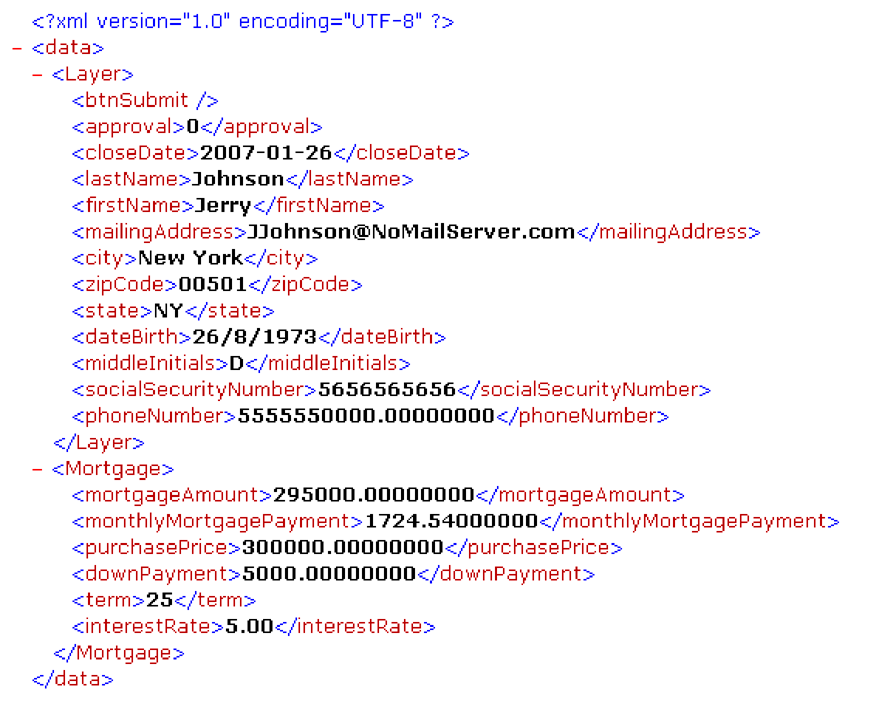

# Manuseio de Forms {#handling-submitted-forms} Enviado

**Exemplos e exemplos neste documento são apenas para o AEM Forms no ambiente JEE.**

Aplicativos baseados na Web que permitem que um usuário preencha formulários interativos exigem que os dados sejam enviados de volta ao servidor. Com o serviço Forms, é possível recuperar os dados inseridos pelo usuário em um formulário interativo. Depois de recuperar os dados, você poderá processá-los para atender aos requisitos de sua empresa. Por exemplo, você pode armazenar os dados em um banco de dados, enviar os dados para outro aplicativo, enviar os dados para outro serviço, mesclar os dados em um design de formulário, exibir os dados em um navegador da Web e assim por diante.

Os dados do formulário são enviados ao serviço da Forms como dados XML ou PDF, que é uma opção definida no Designer. Um formulário enviado como XML permite extrair valores de dados de campo individuais. Ou seja, você pode extrair o valor de cada campo de formulário que o usuário inseriu no formulário. Um formulário enviado como dados PDF é um dado binário, não dados XML. É possível salvar o formulário como um arquivo PDF ou enviá-lo para outro serviço. Para extrair dados de um formulário enviado como XML e, em seguida, usar os dados do formulário para criar um documento PDF, chame outra operação AEM Forms. (Consulte [Criação de documentos PDF com dados XML enviados](/help/forms/developing/creating-pdf-documents-submitted-xml.md))

O diagrama a seguir mostra os dados que estão sendo enviados para um Java Servlet chamado `HandleData` de um formulário interativo exibido em um navegador da Web.

A tabela a seguir explica as etapas no diagrama.

<table>
 <thead>
  <tr>
   <th>
Etapa
</th>
   <th>
Descrição
</th>
  </tr>
 </thead>
 <tbody>
  <tr>
   <td>
1
</td>
   <td>
Um usuário preenche um formulário interativo e clica no botão Enviar do formulário.
</td>
  </tr>
  <tr>
   <td>
2
</td>
   <td>
Os dados são enviados para o <code>HandleData</code> Java Servlet como dados XML.
</td>
  </tr>
  <tr>
   <td>
3
</td>
   <td>
O <code>HandleData</code> Servlet Java contém a lógica do aplicativo para recuperar os dados.
</td>
  </tr>
 </tbody>
</table>

## Tratamento de dados XML enviados {#handling-submitted-xml-data}

Quando os dados do formulário são enviados como XML, é possível recuperar dados XML que representam os dados enviados. Todos os campos de formulário aparecem como nós em um esquema XML. Os valores do nó correspondem aos valores que o usuário preencheu. Considere um formulário de empréstimo em que cada campo no formulário aparece como um nó dentro dos dados XML. O valor de cada nó corresponde ao valor que um usuário preenche. Suponha que um usuário preencha o formulário de empréstimo com os dados mostrados no formulário a seguir.

A ilustração a seguir mostra os dados XML correspondentes recuperados usando a API do cliente de serviço do Forms.

Os campos no formulário de empréstimo. Esses valores podem ser recuperados
usando classes Java XML.

>[!NOTE]
>
>O design de formulário deve ser configurado corretamente no Designer para que os dados sejam enviados como dados XML. Para configurar adequadamente o design de formulário para enviar dados XML, verifique se o botão Enviar localizado no design de formulário está definido para enviar dados XML. Para obter informações sobre como configurar o botão Enviar para enviar dados XML, consulte [AEM Forms Designer](https://www.adobe.com/go/learn_aemforms_designer_63).

## Manuseio de dados PDF enviados {#handling-submitted-pdf-data}

Considere uma aplicação Web que chama o serviço Forms. Depois que o serviço Forms renderiza um formulário PDF interativo em um navegador da Web cliente, o usuário preenche o formulário e o envia como dados em PDF. Quando o serviço Forms recebe os dados do PDF, ele pode enviar os dados do PDF para outro serviço ou salvá-los como um arquivo PDF. O diagrama a seguir mostra o fluxo lógico do aplicativo.

A tabela a seguir descreve as etapas neste diagrama.

<table>
 <thead>
  <tr>
   <th>
Etapa
</th>
   <th>
Descrição
</th>
  </tr>
 </thead>
 <tbody>
  <tr>
   <td>
3
</td>
   <td>
Uma página da Web contém um link que acessa um Servlet Java que chama o serviço Forms.
</td>
  </tr>
  <tr>
   <td>
2
</td>
   <td>
O serviço Forms renderiza um formulário PDF interativo no navegador da Web cliente.
</td>
  </tr>
  <tr>
   <td>
3
</td>
   <td>
O usuário preenche um formulário interativo e clica em um botão Enviar. O formulário é enviado de volta ao serviço Forms como dados PDF. Essa opção está definida no Designer.
</td>
  </tr>
  <tr>
   <td>
4
</td>
   <td>
O serviço Forms salva os dados do PDF como um arquivo PDF. 
</td>
  </tr>
 </tbody>
</table>

## Manipulação de dados UTF-16 de URL enviados {#handling-submitted-url-utf-16-data}

Se os dados do formulário forem enviados como URL UTF-16, o computador cliente exigirá Adobe Reader ou Acrobat 8.1 ou posterior. Além disso, se o design de formulário contiver um botão Enviar com dados codificados por URL (HTTP Post) e a opção de codificação de dados for UTF-16, o design de formulário deverá ser modificado em um editor de texto como o Notepad. Você pode definir a opção de codificação como `UTF-16LE` ou `UTF-16BE` para o botão Enviar. O Designer não fornece essa funcionalidade.

>[!NOTE]
>
>Para obter mais informações sobre o serviço Forms, consulte [Referência de serviços para AEM Forms](https://www.adobe.com/go/learn_aemforms_services_63).

## Resumo das etapas {#summary-of-steps}

Para manipular formulários enviados, execute as seguintes tarefas:

1. Inclua arquivos de projeto.
1. Crie um objeto da API do cliente do Forms.
1. Recupere os dados do formulário.
1. Determine se o envio do formulário contém anexos de arquivo.
1. Processar os dados enviados.

**Incluir arquivos de projeto**

Inclua os arquivos necessários no projeto de desenvolvimento. Se você estiver criando um aplicativo cliente usando Java, inclua os arquivos JAR necessários. Se você estiver usando serviços da Web, certifique-se de incluir os arquivos proxy.

**Criar um objeto de API do cliente do Forms**

Antes de executar programaticamente uma operação de API do cliente de serviço do Forms, é necessário criar um cliente de serviço do Forms. Se estiver usando a API do Java, crie um objeto `FormsServiceClient` . Se estiver usando a API do serviço da Web da Forms, crie um objeto `FormsService` .

**Recuperar dados do formulário**

Para recuperar os dados de formulário enviados, chame o método `FormsServiceClient` do objeto `processFormSubmission`. Ao invocar esse método, é necessário especificar o tipo de conteúdo do formulário enviado. Quando os dados são enviados de um navegador da Web cliente para o serviço da Forms, eles podem ser enviados como dados XML ou PDF. Para recuperar os dados inseridos nos campos do formulário, os dados podem ser enviados como dados XML.

Também é possível recuperar campos de formulário de um formulário enviado como dados PDF, definindo as seguintes opções de tempo de execução:

* Passe o seguinte valor para o método `processFormSubmission` como o parâmetro de tipo de conteúdo: `CONTENT_TYPE=application/pdf`.
* Defina o valor `RenderOptionsSpec` `PDFToXDP` do objeto para `true`
* Defina o valor `RenderOptionsSpec` `ExportDataFormat` do objeto para `XMLData`

Especifique o tipo de conteúdo do formulário enviado quando chamar o método `processFormSubmission`. A lista a seguir especifica os valores de tipo de conteúdo aplicáveis:

* **text/xml**: Representa o tipo de conteúdo a ser usado quando um formulário PDF envia dados de formulário como XML.
* **application/x-www-form-urlencoded**: Representa o tipo de conteúdo a ser usado quando um formulário HTML envia dados como XML.
* **application/pdf**: Representa o tipo de conteúdo a ser usado quando um formulário PDF envia dados como PDF.

>[!NOTE]
>
>Você observará que há três inícios rápidos correspondentes associados à seção Manuseio de Forms Enviado . Os PDF forms de Manuseio enviados como PDF usando o início rápido da API Java demonstram como lidar com dados enviados em PDF. O tipo de conteúdo especificado nesta inicialização rápida é `application/pdf`. Os PDF forms de Manuseio enviados como XML usando o início rápido da API Java demonstram como lidar com dados XML enviados que são enviados de um formulário PDF. O tipo de conteúdo especificado nesta inicialização rápida é `text/xml`. Da mesma forma, o Manuseio de formulários HTML enviados como XML usando o início rápido da API Java demonstra como lidar com dados XML enviados que são enviados de um formulário HTML. O tipo de conteúdo especificado neste início rápido é application/x-www-form-urlencoded.

Você recupera dados de formulários publicados no serviço Forms e determina seu estado de processamento. Ou seja, quando os dados são enviados ao serviço Forms, não significa necessariamente que o serviço Forms terminou de processar os dados e que eles estão prontos para serem processados. Por exemplo, os dados podem ser enviados para o serviço Forms para que um cálculo possa ser executado. Quando o cálculo é concluído, o formulário é renderizado de volta ao usuário com os resultados do cálculo exibidos. Antes de processar os dados enviados, é recomendável determinar se o serviço Forms terminou de processar os dados.

O serviço Forms retorna os seguintes valores para indicar se terminou de processar os dados:

* **0 (Enviar):** os dados enviados estão prontos para serem processados.
* **1 (Calcular):** o serviço Forms executou uma operação de cálculo nos dados e os resultados devem ser renderizados de volta ao usuário.
* **2 (Validar):** os dados de formulário validados do serviço Forms e os resultados devem ser renderizados de volta ao usuário.
* **3 (Próximo):** A página atual foi alterada com resultados que devem ser gravados no aplicativo cliente.
* **4 (Anterior**): A página atual foi alterada com resultados que devem ser gravados no aplicativo cliente.

>[!NOTE]
>
>Os cálculos e validações devem ser renderizados de volta ao usuário. (Consulte [Cálculo dos dados do formulário](/help/forms/developing/calculating-form-data.md#calculating-form-data).

**Determine se o envio do formulário contém anexos de arquivo**

A Forms enviada para o serviço Forms pode conter anexos de arquivo. Por exemplo, usando o painel de anexo integrado do Acrobat, um usuário pode selecionar anexos de arquivo para enviar junto com o formulário. Além disso, um usuário também pode selecionar anexos de arquivo usando uma barra de ferramentas HTML renderizada com um arquivo HTML.

Depois de determinar se um formulário contém anexos de arquivo, é possível processar os dados. Por exemplo, você pode salvar o anexo de arquivo no sistema de arquivos local.

>[!NOTE]
>
>O formulário deve ser enviado como dados PDF para recuperar anexos de arquivo. Se o formulário for enviado como dados XML, os anexos do arquivo não serão enviados.

**Processar os dados enviados**

Dependendo do tipo de conteúdo dos dados enviados, é possível extrair valores de campo de formulário individuais dos dados XML enviados ou salvar os dados PDF enviados como um arquivo PDF (ou enviá-los para outro serviço). Para extrair campos de formulário individuais, converta dados XML enviados em uma fonte de dados XML e recupere valores da fonte de dados XML usando classes `org.w3c.dom`.

**Consulte também:**

[Inclusão de arquivos da biblioteca Java do AEM Forms](/help/forms/developing/invoking-aem-forms-using-java.md#including-aem-forms-java-library-files)

[Configuração das propriedades de conexão](/help/forms/developing/invoking-aem-forms-using-java.md#setting-connection-properties)

[Início rápido da API do Forms Service](/help/forms/developing/forms-service-api-quick-starts.md#forms-service-api-quick-starts)

[Enviar documentos para o serviço do Forms](/help/forms/developing/passing-documents-forms-service.md)

[Criação de aplicativos Web que renderizam o Forms](/help/forms/developing/creating-web-applications-renders-forms.md)

## Gerenciar formulários enviados usando a API Java {#handle-submitted-forms-using-the-java-api}

Manipule um formulário enviado usando a API do Forms (Java):

1. Incluir arquivos de projeto

   Inclua arquivos JAR do cliente, como adobe-forms-client.jar, no caminho de classe do seu projeto Java.

1. Criar um objeto de API do cliente do Forms

   * Crie um objeto `ServiceClientFactory` que contenha propriedades de conexão.
   * Crie um objeto `FormsServiceClient` usando seu construtor e transmitindo o objeto `ServiceClientFactory`.

1. Recuperar dados do formulário

   * Para recuperar dados de formulário que foram publicados em um Servlet Java, crie um objeto `com.adobe.idp.Document` usando seu construtor e chamando o método `javax.servlet.http.HttpServletResponse` do objeto `getInputStream` de dentro do construtor.
   * Crie um objeto `RenderOptionsSpec` usando seu construtor. Defina o valor da localidade chamando o método `RenderOptionsSpec` do objeto `setLocale` e passando um valor de string que especifica o valor da localidade.

   >[!NOTE]
   >
   >Você pode instruir o serviço Forms a criar dados XDP ou XML a partir de conteúdo PDF enviado, chamando o método `RenderOptionsSpec` do objeto `setPDF2XDP` e passando `true` e também chamando `setXMLData` e passando `true`. Em seguida, você pode chamar o método `FormsResult` do objeto `getOutputXML` para recuperar os dados XML que correspondem aos dados XDP/XML. (O objeto `FormsResult` é retornado pelo método `processFormSubmission`, que é explicado na próxima subetapa.)

   * Chame o método `FormsServiceClient` do objeto `processFormSubmission` e passe os seguintes valores:

      * O objeto `com.adobe.idp.Document` que contém os dados do formulário.
      * Um valor de string que especifica variáveis de ambiente, incluindo todos os cabeçalhos HTTP relevantes. Especifique o tipo de conteúdo a ser tratado. Para manipular dados XML, especifique o seguinte valor de string para esse parâmetro: `CONTENT_TYPE=text/xml`. Para lidar com dados de PDF, especifique o seguinte valor de string para esse parâmetro: `CONTENT_TYPE=application/pdf`.
      * Um valor de string que especifica o valor do cabeçalho `HTTP_USER_AGENT`, por exemplo, . `Mozilla/4.0 (compatible; MSIE 6.0; Windows NT 5.1; SV1; .NET CLR 1.1.4322)`. Esse valor de parâmetro é opcional.
      * Um objeto `RenderOptionsSpec` que armazena opções de tempo de execução.

      O método `processFormSubmission` retorna um objeto `FormsResult` contendo os resultados do envio do formulário.

   * Determine se o serviço Forms terminou de processar os dados do formulário chamando o método `FormsResult` do objeto `getAction`. Se esse método retornar o valor `0`, os dados estarão prontos para serem processados.

1. Determine se o envio do formulário contém anexos de arquivo

   * Chame o método `FormsResult` do objeto `getAttachments`. Esse método retorna um objeto `java.util.List` que contém arquivos que foram enviados com o formulário.
   * Itere pelo objeto `java.util.List` para determinar se há anexos de arquivo. Se houver anexos de arquivo, cada elemento é uma instância `com.adobe.idp.Document`. Você pode salvar os anexos do arquivo chamando o método `com.adobe.idp.Document` do objeto e transmitindo um objeto `java.io.File`.`copyToFile`

   >[!NOTE]
   >
   >Essa etapa só é aplicável se o formulário for enviado como PDF.

1. Processar os dados enviados

   * Se o tipo de conteúdo de dados for `application/vnd.adobe.xdp+xml` ou `text/xml`, crie a lógica do aplicativo para recuperar valores de dados XML.

      * Crie um objeto `com.adobe.idp.Document` chamando o método `FormsResult` `getOutputContent` do objeto.
      * Crie um objeto `java.io.InputStream` chamando o construtor `java.io.DataInputStream` e passando o objeto `com.adobe.idp.Document`.
      * Crie um objeto `org.w3c.dom.DocumentBuilderFactory` chamando o método `org.w3c.dom.DocumentBuilderFactory` do objeto estático `newInstance`.
      * Crie um objeto `org.w3c.dom.DocumentBuilder` chamando o método `org.w3c.dom.DocumentBuilderFactory` `newDocumentBuilder` do objeto.
      * Crie um objeto `org.w3c.dom.Document` chamando o método `org.w3c.dom.DocumentBuilder` do objeto `parse` e transmitindo o objeto `java.io.InputStream`.
      * Recupere o valor de cada nó no documento XML. Uma maneira de realizar essa tarefa é criar um método personalizado que aceite dois parâmetros: o objeto `org.w3c.dom.Document` e o nome do nó cujo valor você deseja recuperar. Esse método retorna um valor de string que representa o valor do nó. No exemplo de código que segue esse processo, esse método personalizado é chamado `getNodeText`. O corpo desse método é mostrado.
   * Se o tipo de conteúdo de dados for `application/pdf`, crie a lógica do aplicativo para salvar os dados PDF enviados como um arquivo PDF.

      * Crie um objeto `com.adobe.idp.Document` chamando o método `FormsResult` `getOutputContent` do objeto.
      * Crie um objeto `java.io.File` usando seu construtor público. Certifique-se de especificar PDF como a extensão de nome de arquivo.
      * Preencha o arquivo PDF chamando o método `com.adobe.idp.Document` do objeto `copyToFile` e passando o objeto `java.io.File`.

**Consulte também:**

[Início rápido (modo SOAP): Manuseio de PDF forms enviados como XML usando a API Java](/help/forms/developing/forms-service-api-quick-starts.md#quick-start-soap-mode-handling-pdf-forms-submitted-as-xml-using-the-java-api)

[Início rápido (modo SOAP): Manuseio de formulários HTML enviados como XML usando a API Java](/help/forms/developing/forms-service-api-quick-starts.md#quick-start-soap-mode-handling-html-forms-submitted-as-xml-using-the-java-api)

[Início rápido (modo SOAP): Manuseio de PDF forms enviados como PDF usando a API do Java](/help/forms/developing/forms-service-api-quick-starts.md#quick-start-soap-mode-handling-pdf-forms-submitted-as-pdf-using-the-java-api)

[Inclusão de arquivos da biblioteca Java do AEM Forms](/help/forms/developing/invoking-aem-forms-using-java.md#including-aem-forms-java-library-files)

[Configuração das propriedades de conexão](/help/forms/developing/invoking-aem-forms-using-java.md#setting-connection-properties)

## Gerenciar dados PDF enviados usando a API de serviço da Web {#handle-submitted-pdf-data-using-the-web-service-api}

Gerenciar um formulário enviado usando a API do Forms (serviço da Web):

1. Incluir arquivos de projeto

   * Crie classes proxy Java que consomem o WSDL do serviço Forms.
   * Inclua as classes proxy Java no caminho da classe.

1. Criar um objeto de API do cliente do Forms

   Crie um objeto `FormsService` e defina os valores de autenticação.

1. Recuperar dados do formulário

   * Para recuperar dados de formulário publicados em um Servlet Java, crie um objeto `BLOB` usando seu construtor.
   * Crie um objeto `java.io.InputStream` chamando o método `javax.servlet.http.HttpServletResponse` `getInputStream` do objeto.
   * Crie um objeto `java.io.ByteArrayOutputStream` usando seu construtor e passando o comprimento do objeto `java.io.InputStream`.
   * Copie o conteúdo do objeto `java.io.InputStream` no objeto `java.io.ByteArrayOutputStream`.
   * Crie uma matriz de bytes chamando o método `java.io.ByteArrayOutputStream` do objeto `toByteArray`.
   * Preencha o objeto `BLOB` chamando seu método `setBinaryData` e passando a matriz de bytes como um argumento.
   * Crie um objeto `RenderOptionsSpec` usando seu construtor. Defina o valor da localidade chamando o método `RenderOptionsSpec` do objeto `setLocale` e passando um valor de string que especifica o valor da localidade.
   * Chame o método `FormsService` do objeto `processFormSubmission` e passe os seguintes valores:

      * O objeto `BLOB` que contém os dados do formulário.
      * Um valor de string que especifica variáveis de ambiente, incluindo todos os cabeçalhos HTTP relevantes. Especifique o tipo de conteúdo a ser tratado. Para manipular dados XML, especifique o seguinte valor de string para esse parâmetro: `CONTENT_TYPE=text/xml`. Para lidar com dados de PDF, especifique o seguinte valor de string para esse parâmetro: `CONTENT_TYPE=application/pdf`.
      * Um valor de string que especifica o valor do cabeçalho `HTTP_USER_AGENT`; por exemplo, `Mozilla/4.0 (compatible; MSIE 6.0; Windows NT 5.1; SV1; .NET CLR 1.1.4322)`.
      * Um objeto `RenderOptionsSpec` que armazena opções de tempo de execução.
      * Um objeto vazio `BLOBHolder` que é preenchido pelo método .
      * Um objeto vazio `javax.xml.rpc.holders.StringHolder` que é preenchido pelo método .
      * Um objeto vazio `BLOBHolder` que é preenchido pelo método .
      * Um objeto vazio `BLOBHolder` que é preenchido pelo método .
      * Um objeto vazio `javax.xml.rpc.holders.ShortHolder` que é preenchido pelo método .
      * Um objeto vazio `MyArrayOf_xsd_anyTypeHolder` que é preenchido pelo método . Esse parâmetro é usado para armazenar anexos de arquivo enviados junto com o formulário.
      * Um objeto vazio `FormsResultHolder` que é preenchido pelo método com o formulário enviado.

      O método `processFormSubmission` preenche o parâmetro `FormsResultHolder` com os resultados do envio do formulário.

   * Determine se o serviço Forms terminou de processar os dados do formulário chamando o método `FormsResult` do objeto `getAction`. Se esse método retornar o valor `0`, os dados do formulário estarão prontos para serem processados. Você pode obter um objeto `FormsResult` obtendo o valor do membro de dados `FormsResultHolder` do objeto `value`.

1. Determine se o envio do formulário contém anexos de arquivo

   Obtenha o valor do membro de dados `MyArrayOf_xsd_anyTypeHolder` do objeto `value` (o objeto `MyArrayOf_xsd_anyTypeHolder` foi passado para o método `processFormSubmission`). Esse membro de dados retorna uma matriz de `Objects`. Cada elemento dentro da matriz `Object` é um `Object`que corresponde aos arquivos que foram enviados junto com o formulário. Você pode obter cada elemento dentro da matriz e convertê-lo em um objeto `BLOB`.

1. Processar os dados enviados

   * Se o tipo de conteúdo de dados for `application/vnd.adobe.xdp+xml` ou `text/xml`, crie a lógica do aplicativo para recuperar valores de dados XML.

      * Crie um objeto `BLOB` chamando o método `FormsResult` `getOutputContent` do objeto.
      * Crie uma matriz de bytes chamando o método `BLOB` do objeto `getBinaryData`.
      * Crie um objeto `java.io.InputStream` chamando o construtor `java.io.ByteArrayInputStream` e transmitindo a matriz de bytes.
      * Crie um objeto `org.w3c.dom.DocumentBuilderFactory` chamando o método `org.w3c.dom.DocumentBuilderFactory` do objeto estático `newInstance`.
      * Crie um objeto `org.w3c.dom.DocumentBuilder` chamando o método `org.w3c.dom.DocumentBuilderFactory` `newDocumentBuilder` do objeto.
      * Crie um objeto `org.w3c.dom.Document` chamando o método `org.w3c.dom.DocumentBuilder` do objeto `parse` e transmitindo o objeto `java.io.InputStream`.
      * Recupere o valor de cada nó no documento XML. Uma maneira de realizar essa tarefa é criar um método personalizado que aceite dois parâmetros: o objeto `org.w3c.dom.Document` e o nome do nó cujo valor você deseja recuperar. Esse método retorna um valor de string que representa o valor do nó. No exemplo de código que segue esse processo, esse método personalizado é chamado `getNodeText`. O corpo desse método é mostrado.
   * Se o tipo de conteúdo de dados for `application/pdf`, crie a lógica do aplicativo para salvar os dados PDF enviados como um arquivo PDF.

      * Crie um objeto `BLOB` chamando o método `FormsResult` `getOutputContent` do objeto.
      * Crie uma matriz de bytes chamando o método `BLOB` do objeto `getBinaryData`.
      * Crie um objeto `java.io.File` usando seu construtor público. Certifique-se de especificar PDF como a extensão de nome de arquivo.
      * Crie um objeto `java.io.FileOutputStream` usando seu construtor e transmitindo o objeto `java.io.File`.
      * Preencha o arquivo PDF chamando o método `java.io.FileOutputStream` do objeto `write` e transmitindo a matriz de bytes.

**Consulte também:**

[Chamada de AEM Forms usando codificação Base64](/help/forms/developing/invoking-aem-forms-using-web.md#invoking-aem-forms-using-base64-encoding)