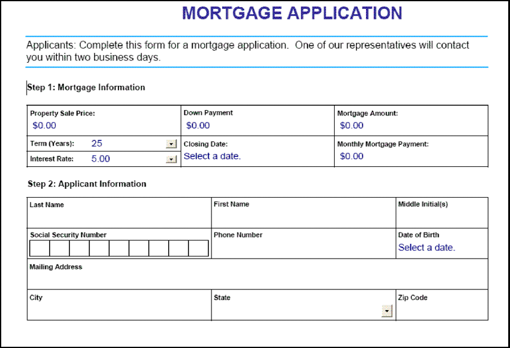
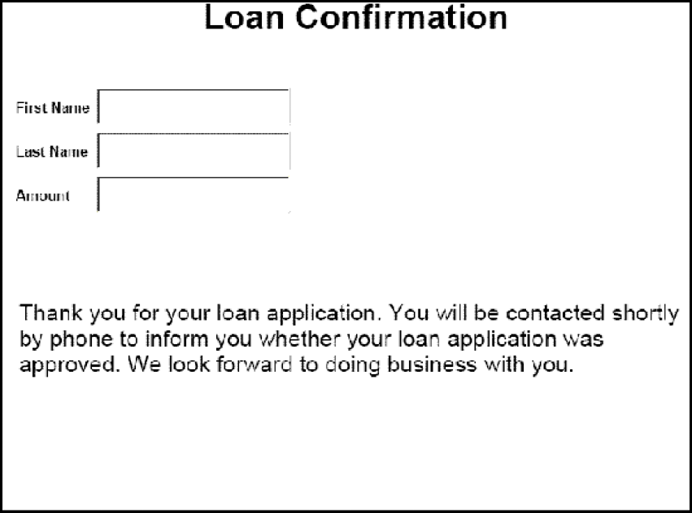

# Renderização de PDF forms interativos {#rendering-interactive-pdf-forms}

O serviço Forms renderiza PDF forms interativos para dispositivos clientes, geralmente navegadores da Web, para coletar informações dos usuários. Depois que um formulário interativo é renderizado, o usuário pode inserir dados nos campos do formulário e clicar em um botão Enviar localizado no formulário para enviar informações de volta ao serviço Forms. O Adobe Reader ou Acrobat deve ser instalado no computador que hospeda o navegador da Web do cliente para que um formulário PDF interativo fique visível.

>[!NOTE]
>
>Antes de renderizar um formulário usando o serviço de Formulários, crie um design de formulário. Normalmente, um design de formulário é criado no Designer e é salvo como um arquivo XDP. Para obter informações sobre como criar um design de formulário, consulte [Designer](https://www.adobe.com/go/learn_aemforms_designer_63)do Forms.

**Amostra de pedido de empréstimo**

Uma amostra de aplicativo de empréstimo é introduzida para demonstrar como o serviço Forms usa formulários interativos para coletar informações dos usuários. Esse aplicativo permite que um usuário preencha um formulário com os dados necessários para proteger um empréstimo e, em seguida, envie os dados para o serviço Forms. O diagrama a seguir mostra o fluxo lógico do aplicativo de empréstimo.


A tabela a seguir descreve as etapas neste diagrama.

<table>
 <thead>
  <tr>
   <th><p>Etapa</p></th>
   <th><p>Descrição</p></th>
  </tr>
 </thead>
 <tbody>
  <tr>
   <td><p>1</p></td>
   <td><p>O Servlet <code>GetLoanForm</code> Java é chamado de uma página HTML. </p></td>
  </tr>
  <tr>
   <td><p>2</p></td>
   <td><p>O <code>GetLoanForm</code> Java Servlet usa a API do cliente de serviço do Forms para renderizar o formulário de empréstimo no navegador da Web do cliente. (Consulte <a href="#render-an-interactive-pdf-form-using-the-java-api">Renderizar um formulário PDF interativo usando a API</a>Java.)</p></td>
  </tr>
  <tr>
   <td><p>3</p></td>
   <td><p>Depois que o usuário preenche o formulário de empréstimo e clica no botão Enviar, os dados são submetidos ao <code>HandleData</code> Java Servlet. (Consulte <i>"Formulário de empréstimo"</i>.)</p></td>
  </tr>
  <tr>
   <td><p>4</p></td>
   <td><p>O <code>HandleData</code> Java Servlet usa a API do cliente do serviço Forms para processar o envio do formulário e recuperar os dados do formulário. Os dados são armazenados em um banco de dados corporativo. (Consulte <a href="/help/forms/developing/handling-submitted-forms.md#handling-submitted-forms">Manuseio De Formulários</a>Enviados.)</p></td>
  </tr>
  <tr>
   <td><p>5</p></td>
   <td><p>Um formulário de confirmação é renderizado de volta ao navegador da Web. Dados como o nome e sobrenome do usuário são unidos ao formulário antes de serem renderizados. (Consulte <a href="/help/forms/developing/prepopulating-forms-flowable-layouts.md">Pré-preenchimento de formulários com layouts</a>flutuantes.)</p></td>
  </tr>
 </tbody>
</table>

**Formulário de empréstimo**

Este formulário de empréstimo interativo é renderizado pelo Java Servlet do aplicativo de empréstimo de amostra. `GetLoanForm`



**Formulário de confirmação**

Este formulário é renderizado pelo Java Servlet do aplicativo de empréstimo de amostra. `HandleData`



O Servlet `HandleData` Java pré-preenche este formulário com o nome e sobrenome do usuário, bem como a quantidade. Depois que o formulário é pré-preenchido, ele é enviado para o navegador da Web do cliente. (Consulte [Pré-preenchimento de formulários com layouts](/help/forms/developing/prepopulating-forms-flowable-layouts.md)flutuantes)

**Servlets Java**

A amostra do aplicativo de empréstimo é um exemplo de um aplicativo de serviço do Forms que existe como um Servlet Java. Um Servlet Java é um programa Java em execução em um servidor de aplicativos J2EE, como o WebSphere, e contém o código da API do cliente do serviço Forms.

O código a seguir mostra a sintaxe de um servlet Java chamado GetLoanForm:

```java
     public class GetLoanForm extends HttpServlet implements Servlet {
         public void doGet(HttpServletRequest req, HttpServletResponse resp
         throws ServletException, IOException {

         }
         public void doPost(HttpServletRequest req, HttpServletResponse resp
         throws ServletException, IOException {

             }
```

Normalmente, você não colocaria o código da API do cliente do serviço Forms em um servlet `doGet` ou `doPost` método Java. É melhor prática de programação colocar esse código em uma classe separada, instanciar a classe do `doPost` método (ou `doGet` método) e chamar os métodos apropriados. No entanto, para a brevidade do código, os exemplos de código nesta seção são reduzidos ao mínimo e os exemplos de código são colocados no `doPost` método.

>[!NOTE]
>
>Para obter mais informações sobre o serviço de Formulários, consulte Referência de [serviços para AEM Forms](https://www.adobe.com/go/learn_aemforms_services_63).

**Resumo das etapas**

Para renderizar um formulário PDF interativo, execute as seguintes tarefas:

1. Incluir arquivos de projeto.
1. Crie um objeto da API do Forms Client.
1. Especifique valores de URI.
1. Anexar arquivos ao formulário (opcional).
1. Renderize um formulário PDF interativo.
1. Grave o fluxo de dados do formulário no navegador da Web do cliente.

**Incluir arquivos de projeto**

Inclua os arquivos necessários no projeto de desenvolvimento. Se você estiver criando um aplicativo cliente usando Java, inclua os arquivos JAR necessários. Se você estiver usando serviços da Web, certifique-se de incluir os arquivos proxy.

**Criar um objeto da API do cliente Forms**

Antes de executar programaticamente uma operação de API do cliente do serviço Forms, é necessário criar um objeto de API do Forms Client. Se você estiver usando a API Java, crie um `FormsServiceClient` objeto. Se você estiver usando a API de serviço da Web do Forms, crie um `FormsService` objeto.

**Especificar valores de URI**

É possível especificar valores de URI exigidos pelo serviço de Formulários para renderizar um formulário. Um design de formulário salvo como parte de um aplicativo do Forms pode ser referenciado usando o valor URI raiz do conteúdo `repository:///`. Por exemplo, considere o seguinte design de formulário chamado *Loan.xdp* localizado em um aplicativo do Forms chamado *FormsApplication*:


Para acessar esse design de formulário, especifique `Applications/FormsApplication/1.0/FormsFolder/Loan.xdp` como o nome do formulário (o primeiro parâmetro passado para o `renderPDFForm` método) e `repository:///` como o valor de URI raiz do conteúdo.

>[!NOTE]
>
>Para obter informações sobre como criar um aplicativo de Formulários usando o Workbench, consulte Ajuda [do](https://www.adobe.com/go/learn_aemforms_workbench_63)Workbench.

O caminho para um recurso localizado em um aplicativo Forms é:

`Applications/Application-name/Application-version/Folder.../Filename`

Os valores a seguir mostram alguns exemplos de valores de URI:

* Applications/AppraisalReport/1.0/Forms/FullForm.xdp
* Applications/AnotherApp/1.1/Assets/picture.jpg
* Applications/SomeApp/2.0/Resources/Data/XSDs/MyData.xsd

Ao renderizar um formulário interativo, é possível definir valores de URI, como o URL do público alvo, para onde os dados do formulário são postados. O URL do público alvo pode ser definido de uma das seguintes maneiras:

* No botão Enviar ao projetar o design de formulário no Designer
* Usando a API do cliente do serviço Forms

Se o URL do público alvo for definido no design de formulário, não o substitua pela API do cliente do serviço Forms. Ou seja, configurar o URL do público alvo usando a API de formulários redefine o URL especificado no design de formulário para aquele especificado usando a API. Se você desejar enviar o formulário PDF para o URL do público alvo especificado no design de formulário, configure o URL do público alvo de forma programática para uma string vazia.

Se você tiver um formulário que contenha um botão Enviar e um botão calcular (com um script correspondente que é executado no servidor), poderá definir programaticamente o URL para o qual o formulário será enviado para executar o script. Use o botão Enviar no design de formulário para especificar o URL para onde os dados do formulário são publicados. (Consulte [Calculando dados](/help/forms/developing/calculating-form-data.md)do formulário.)

>[!NOTE]
>
>Em vez de especificar um valor de URL para fazer referência a um arquivo XDP, você também pode passar uma `com.adobe.idp.Document` instância para o serviço Forms. A `com.adobe.idp.Document` instância contém um design de formulário. (Consulte [Transmissão de Documentos ao serviço](/help/forms/developing/passing-documents-forms-service.md)de formulários.)

**Anexar arquivos ao formulário**

É possível anexar arquivos a um formulário. Ao renderizar um formulário PDF com anexos de arquivo, os usuários podem recuperar os anexos de arquivo no Acrobat usando o painel de anexos de arquivo. É possível anexar tipos de arquivos diferentes a um formulário, como um arquivo de texto, ou a um arquivo binário, como um arquivo JPG.

>[!NOTE]
>
>Anexar anexos de arquivo a um formulário é opcional.

**Renderizar um formulário PDF interativo**

Para renderizar um formulário, use um design de formulário criado no Designer e salvo como um arquivo XDP ou PDF. Além disso, é possível renderizar um formulário criado usando o Acrobat e salvo como um arquivo PDF. Para renderizar um formulário PDF interativo, chame o `FormsServiceClient` método ou o `renderPDFForm` `renderPDFForm2` método do objeto.

O `renderPDFForm` usa um `URLSpec` objeto. A raiz do conteúdo para o arquivo XDP é passada para o serviço Forms usando o método do `URLSpec` objeto `setContentRootURI` . O nome do design de formulário ( `formQuery`) é transmitido como um valor de parâmetro separado. Os dois valores são concatenados para obter a referência absoluta ao design de formulário.

O `renderPDFForm2` método aceita uma `com.adobe.idp.Document` instância que contém o documento XDP ou PDF para renderização.

>[!NOTE]
>
>A opção de tempo de execução do PDF marcado não pode ser definida se o documento de entrada for um documento PDF. Se o arquivo de entrada for um arquivo XDP, a opção PDF marcado pode ser definida.

## Renderizar um formulário PDF interativo usando a API Java {#render-an-interactive-pdf-form-using-the-java-api}

Renderize um formulário PDF interativo usando a API de formulários (Java):

1. Incluir arquivos de projeto

   Inclua arquivos JAR do cliente, como adobe-forms-client.jar, no caminho de classe do seu projeto Java.

1. Criar um objeto da API do cliente Forms

   * Crie um `ServiceClientFactory` objeto que contenha propriedades de conexão.
   * Crie um `FormsServiceClient` objeto usando seu construtor e transmitindo o `ServiceClientFactory` objeto.

1. Especificar valores de URI

   * Crie um `URLSpec` objeto que armazene valores de URI usando seu construtor.
   * Chame o método do `URLSpec` objeto `setApplicationWebRoot` e passe um valor de string que representa a raiz da Web do aplicativo.
   * Chame o método do `URLSpec` objeto `setContentRootURI` e transmita um valor de string que especifica o valor do URI raiz do conteúdo. Verifique se o design de formulário está localizado no URI raiz do conteúdo. Caso contrário, o serviço Forms lança uma exceção. Para fazer referência ao repositório, especifique `repository:///`.
   * Chame o método do `URLSpec` objeto `setTargetURL` e passe um valor de string que especifique o valor do URL do público alvo para onde os dados do formulário são postados. Se você definir o URL do público alvo no design de formulário, poderá passar uma string vazia. Também é possível especificar o URL para o qual um formulário é enviado para executar cálculos.

1. Anexar arquivos ao formulário

   * Crie um `java.util.HashMap` objeto para armazenar anexos de arquivo usando seu construtor.
   * Chame o `java.util.HashMap` método do `put` objeto para cada arquivo a ser anexado ao formulário renderizado. Passe os seguintes valores para este método:

      * Um valor de string que especifica o nome do anexo do arquivo, incluindo a extensão do nome do arquivo.
   * Um `com.adobe.idp.Document` objeto que contém o anexo de arquivo.

   >[!NOTE]
   >
   >Repita essa etapa para que cada arquivo seja anexado ao formulário. Esta etapa é opcional e você pode passar `null` se não quiser enviar anexos de arquivo.

1. Renderizar um formulário PDF interativo

   Chame o método do `FormsServiceClient` objeto `renderPDFForm` e passe os seguintes valores:

   * Um valor de string que especifica o nome do design de formulário, incluindo a extensão do nome do arquivo. Se você fizer referência a um design de formulário que faz parte de um aplicativo do Forms, especifique o caminho completo, como `Applications/FormsApplication/1.0/FormsFolder/Loan.xdp`.
   * Um `com.adobe.idp.Document` objeto que contém dados para mesclar com o formulário. Se você não quiser unir dados, passe um `com.adobe.idp.Document` objeto vazio.
   * Um `PDFFormRenderSpec` objeto que armazena opções de tempo de execução. Esse é um parâmetro opcional e você pode especificar `null` se não deseja especificar opções de tempo de execução.
   * Um `URLSpec` objeto que contém valores de URI exigidos pelo serviço de Formulários.
   * Um `java.util.HashMap` objeto que armazena anexos de arquivo. Esse é um parâmetro opcional e você pode especificar `null` se não deseja anexar arquivos ao formulário.

   O `renderPDFForm` método retorna um `FormsResult` objeto que contém um fluxo de dados de formulário que deve ser gravado no navegador da Web do cliente.

1. Gravar o fluxo de dados do formulário no navegador da Web do cliente

   * Crie um `com.adobe.idp.Document` objeto chamando o `FormsResult` método do objeto `getOutputContent` .
   * Obtenha o tipo de conteúdo do `com.adobe.idp.Document` objeto chamando seu `getContentType` método.
   * Defina o tipo de conteúdo do `javax.servlet.http.HttpServletResponse` objeto chamando seu `setContentType` método e transmitindo o tipo de conteúdo do `com.adobe.idp.Document` objeto.
   * Crie um `javax.servlet.ServletOutputStream` objeto usado para gravar o fluxo de dados do formulário no navegador da Web do cliente, chamando o `javax.servlet.http.HttpServletResponse` `getOutputStream` método do objeto.
   * Crie um `java.io.InputStream` objeto chamando o `com.adobe.idp.Document` método do `getInputStream` objeto.
   * Crie uma matriz de bytes e preencha-a com o fluxo de dados do formulário, invocando o método do `InputStream` objeto `read` e transmitindo a matriz de bytes como um argumento.
   * Chame o método do `javax.servlet.ServletOutputStream` `write` objeto para enviar o fluxo de dados do formulário para o navegador da Web do cliente. Passe a matriz de bytes para o `write` método.

## Renderizar um formulário PDF interativo usando a API de serviço da Web {#render-an-interactive-pdf-form-using-the-web-service-api}

Renderize um formulário PDF interativo usando a API de formulários (serviço da Web):

1. Incluir arquivos de projeto

   * Crie classes proxy Java que consomem o serviço Forms WSDL.
   * Inclua as classes proxy Java no caminho da classe.

1. Criar um objeto da API do cliente Forms

   Crie um `FormsService` objeto e defina valores de autenticação.

1. Especificar valores de URI

   * Crie um `URLSpec` objeto que armazene valores de URI usando seu construtor.
   * Chame o método do `URLSpec` objeto `setApplicationWebRoot` e passe um valor de string que representa a raiz da Web do aplicativo.
   * Chame o método do `URLSpec` objeto `setContentRootURI` e transmita um valor de string que especifica o valor do URI raiz do conteúdo. Verifique se o design de formulário está localizado no URI raiz do conteúdo. Caso contrário, o serviço Forms lança uma exceção. Para fazer referência ao repositório, especifique `repository:///`.
   * Chame o método do `URLSpec` objeto `setTargetURL` e passe um valor de string que especifique o valor do URL do público alvo para onde os dados do formulário são postados. Se você definir o URL do público alvo no design de formulário, poderá passar uma string vazia. Também é possível especificar o URL para o qual um formulário é enviado para executar cálculos.

1. Anexar arquivos ao formulário

   * Crie um `java.util.HashMap` objeto para armazenar anexos de arquivo usando seu construtor.
   * Chame o `java.util.HashMap` método do `put` objeto para cada arquivo a ser anexado ao formulário renderizado. Passe os seguintes valores para este método:

      * Um valor de string que especifica o nome do anexo do arquivo, incluindo a extensão do nome do arquivo
   * Um `BLOB` objeto que contém o anexo de arquivo

   >[!NOTE]
   >
   >Repita essa etapa para que cada arquivo seja anexado ao formulário.

1. Renderizar um formulário PDF interativo

   Chame o método do `FormsService` objeto `renderPDFForm` e passe os seguintes valores:

   * Um valor de string que especifica o nome do design de formulário, incluindo a extensão do nome do arquivo. Se você fizer referência a um design de formulário que faz parte de um aplicativo do Forms, especifique o caminho completo, como `Applications/FormsApplication/1.0/FormsFolder/Loan.xdp`.
   * Um `BLOB` objeto que contém dados para mesclar com o formulário. Se você não deseja unir dados, passe `null`.
   * Um `PDFFormRenderSpec` objeto que armazena opções de tempo de execução. Esse é um parâmetro opcional e você pode especificar `null` se não deseja especificar opções de tempo de execução.
   * Um `URLSpec` objeto que contém valores de URI exigidos pelo serviço de Formulários.
   * Um `java.util.HashMap` objeto que armazena anexos de arquivo. Esse é um parâmetro opcional e você pode especificar `null` se não deseja anexar arquivos ao formulário.
   * Um `com.adobe.idp.services.holders.BLOBHolder` objeto vazio que é preenchido pelo método. Isso é usado para armazenar o formulário PDF renderizado.
   * Um `javax.xml.rpc.holders.LongHolder` objeto vazio que é preenchido pelo método. (Esse argumento armazenará o número de páginas no formulário.)
   * Um `javax.xml.rpc.holders.StringHolder` objeto vazio que é preenchido pelo método. (Esse argumento armazenará o valor de localidade.)
   * Um `com.adobe.idp.services.holders.FormsResultHolder` objeto vazio que conterá os resultados dessa operação.

   O `renderPDFForm` método preenche o `com.adobe.idp.services.holders.FormsResultHolder` objeto passado como o último valor do argumento com um fluxo de dados de formulário que deve ser gravado no navegador da Web do cliente.

1. Gravar o fluxo de dados do formulário no navegador da Web do cliente

   * Crie um `FormResult` objeto obtendo o valor do membro de `com.adobe.idp.services.holders.FormsResultHolder` dados do `value` objeto.
   * Crie um `BLOB` objeto que contenha dados de formulário chamando o `FormsResult` método do `getOutputContent` objeto.
   * Obtenha o tipo de conteúdo do `BLOB` objeto chamando seu `getContentType` método.
   * Defina o tipo de conteúdo do `javax.servlet.http.HttpServletResponse` objeto chamando seu `setContentType` método e transmitindo o tipo de conteúdo do `BLOB` objeto.
   * Crie um `javax.servlet.ServletOutputStream` objeto usado para gravar o fluxo de dados do formulário no navegador da Web do cliente, chamando o `javax.servlet.http.HttpServletResponse` `getOutputStream` método do objeto.
   * Crie uma matriz de bytes e preencha-a chamando o método do `BLOB` objeto `getBinaryData` . Essa tarefa atribui o conteúdo do `FormsResult` objeto à matriz de bytes.
   * Chame o método do `javax.servlet.http.HttpServletResponse` `write` objeto para enviar o fluxo de dados do formulário para o navegador da Web do cliente. Passe a matriz de bytes para o `write` método.

**Gravar o fluxo de dados do formulário no navegador da Web do cliente**

Quando o serviço Forms renderiza um formulário, ele retorna um fluxo de dados do formulário que você deve gravar no navegador da Web do cliente. Quando gravado no navegador da Web do cliente, o formulário fica visível para o usuário.
