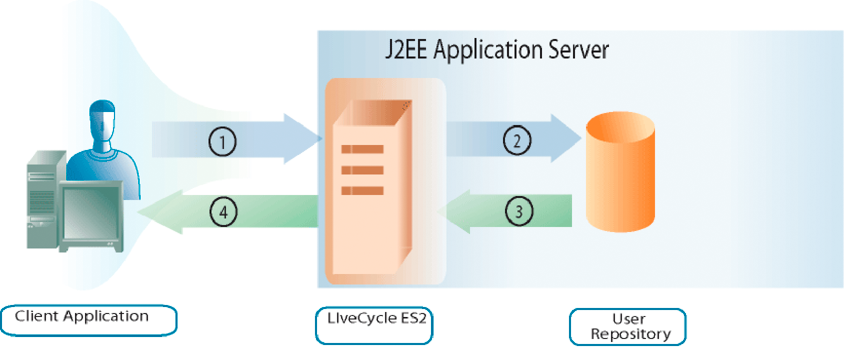

# Gerenciamento de usuários {#managing-users}

**Exemplos e exemplos neste documento são somente para AEM Forms no ambiente JEE.**

**Sobre o Gerenciamento de Usuários**

Você pode usar a API de gerenciamento de usuários para criar aplicativos clientes que podem gerenciar funções, permissões e principais (que podem ser usuários ou grupos) e autenticar usuários. A API de gerenciamento de usuários consiste nas seguintes APIs do AEM Forms:

* API de serviço do Gerenciador de diretórios
* API de serviço do Authentication Manager
* API de serviço do Gerenciador de autorização

O Gerenciamento de usuários permite que você atribua, remova e determine funções e permissões. Ela também permite atribuir, remover e consultar domínios, usuários e grupos. Por fim, você pode usar o Gerenciamento de usuários para autenticar usuários.

Em [Adicionando Usuários](users.md#adding-users), você entenderá como adicionar usuários de forma programática. Esta seção usa a API de Serviço do Gerenciador de Diretórios.

Em [Excluindo usuários](users.md#deleting-users), você entenderá como excluir usuários de forma programática. Esta seção usa a API de Serviço do Gerenciador de Diretórios.

Em [Gerenciando Usuários e Grupos](users.md#managing-users-and-groups), você entenderá a diferença entre um usuário local e um usuário de diretório e verá exemplos de como usar as APIs de serviço Web e Java para gerenciar usuários e grupos de forma programática. Esta seção usa a API de Serviço do Gerenciador de Diretórios.

Em [Gerenciando Funções e Permissões](users.md#managing-roles-and-permissions), você aprenderá sobre as funções e permissões do sistema e o que pode fazer programaticamente para aumentá-las, além de ver exemplos de como usar as APIs do Java e do serviço Web para gerenciar funções e permissões programaticamente. Esta seção usa a API de Serviço do Gerenciador de Diretórios e a API de Serviço do Gerenciador de Autorização.

Em [Usuários de Autenticação](users.md#authenticating-users), você verá exemplos de como usar as APIs de serviço Web e Java para autenticar usuários de forma programática. Esta seção usa a API de Serviço do Gerenciador de Autorização.

**Noções básicas sobre o processo de autenticação**

O Gerenciamento de usuários oferece funcionalidade de autenticação integrada e também a capacidade de conectá-lo ao seu próprio provedor de autenticação. Quando o Gerenciamento de usuários recebe uma solicitação de autenticação (por exemplo, um usuário tenta fazer logon), ele transmite as informações do usuário para o provedor de autenticação para autenticação. O Gerenciamento de usuários recebe os resultados do provedor de autenticação após autenticar o usuário.

O diagrama a seguir mostra a interação entre um usuário final que está tentando fazer logon, o Gerenciamento de usuários e o provedor de autenticação.

A tabela a seguir descreve cada etapa do processo de autenticação.

<table>
 <thead>
  <tr>
   <th>
Etapa
</th>
   <th>
Descrição
</th>
  </tr>
 </thead>
 <tbody>
  <tr>
   <td>
1
</td>
   <td>
Um usuário tenta fazer logon em um serviço que chama o Gerenciamento de usuários. O usuário especifica um nome de usuário e uma senha. 
</td>
  </tr>
  <tr>
   <td>
2
</td>
   <td>
O Gerenciamento de usuários envia o nome de usuário, a senha e as informações de configuração ao provedor de autenticação.
</td>
  </tr>
  <tr>
   <td>
3
</td>
   <td>
O provedor de autenticação se conecta ao repositório do usuário e autentica o usuário.
</td>
  </tr>
  <tr>
   <td>
4
</td>
   <td>
O provedor de autenticação retorna os resultados ao Gerenciamento de usuários.
</td>
  </tr>
  <tr>
   <td>
5
</td>
   <td>
O Gerenciamento de usuários permite que o usuário faça logon ou nega acesso ao produto.
</td>
  </tr>
 </tbody>
</table>

>[!NOTE]
>
>Se o fuso horário do servidor for diferente do fuso horário do cliente, ao consumir o WSDL para o serviço AEM Forms Generate PDF em uma pilha de SOAP nativa usando um cliente .NET em um cluster do WebSphere Application Server, poderá ocorrer o seguinte erro de autenticação do User Management:

`[com.adobe.idp.um.webservices.WSSecurityHandler] errorCode:12803 errorCodeHEX:0x3203 message:WSSecurityHandler: UM authenticate returns exception : An error was discovered processing the <wsse:Security> header. (WSSecurityEngine: Invalid timestamp The security semantics of message have expired).`

**Noções básicas sobre o gerenciamento de diretórios**

O Gerenciamento de usuários é fornecido com um provedor de serviços de diretório (DiretoryManagerService) que oferece suporte a conexões com diretórios LDAP. Se sua organização usar um repositório não LDAP para armazenar registros de usuários, você poderá criar seu próprio provedor de serviços de diretório que funcione com seu repositório.

Os provedores de serviços de diretório recuperam registros de um armazenamento de usuários por solicitação do Gerenciamento de usuários. O Gerenciamento de usuários armazena regularmente em cache registros de usuários e grupos no banco de dados para melhorar o desempenho.

O provedor de serviços de diretório pode ser usado para sincronizar o banco de dados de Gerenciamento de Usuários com o repositório de usuários. Essa etapa garante que todas as informações do diretório de usuário e todos os registros de usuário e grupo estejam atualizados.

Além disso, o DiretoryManagerService oferece a capacidade de criar e gerenciar domínios. Os domínios definem bases de usuários diferentes. O limite de um domínio geralmente é definido de acordo com a forma como sua organização está estruturada ou como sua loja de usuários está configurada. Os domínios de Gerenciamento de Usuários fornecem definições de configuração que os provedores de autenticação e os provedores de serviços de diretório usam.

No XML de configuração exportado pelo Gerenciamento de Usuários, o nó raiz que tem o valor de atributo de `Domains` contém um elemento XML para cada domínio definido para o Gerenciamento de Usuários. Cada um desses elementos contém outros elementos que definem aspectos do domínio associados a provedores de serviços específicos.

**Compreendendo valores de objectSID**

Ao usar o Ative Diretory, é importante entender que um valor `objectSID` não é um atributo exclusivo entre vários domínios. Esse valor armazena o identificador de segurança de um objeto. Em um ambiente de vários domínios (por exemplo, uma árvore de domínios), o valor `objectSID` pode ser diferente.

Um valor `objectSID` será alterado se um objeto for movido de um domínio do Ative Diretory para outro domínio. Alguns objetos têm o mesmo valor `objectSID` em qualquer lugar no domínio. Por exemplo, grupos como BUILTIN\Administradores, BUILTIN\Usuários Avançados e assim por diante, teriam o mesmo valor `objectSID` independentemente dos domínios. Estes `objectSID` valores são bem conhecidos.

## Adição de usuários {#adding-users}

Você pode usar a API do serviço do Gerenciador de diretórios (Java e serviço da Web) para adicionar usuários de forma programática ao AEM Forms. Após adicionar um usuário, você pode usá-lo ao executar uma operação de serviço que exija um usuário. Por exemplo, é possível atribuir uma tarefa ao novo usuário.

### Resumo das etapas {#summary-of-steps}

Para adicionar um usuário, execute as seguintes etapas:

1. Incluir arquivos de projeto.
1. Crie um cliente DiretoryManagerService.
1. Definir informações do usuário.
1. Adicione o usuário ao AEM Forms.
1. Verifique se o usuário foi adicionado.

**Incluir arquivos de projeto**

Inclua os arquivos necessários no projeto de desenvolvimento. Se você estiver criando uma aplicação cliente usando Java, inclua os arquivos JAR necessários. Se você estiver usando serviços da Web, inclua os arquivos proxy.

**Criar um cliente DiretoryManagerService**

Antes de executar programaticamente uma operação de serviço do Gerenciador de Diretórios, crie um cliente da API de Serviço do Gerenciador de Diretórios.

**Definir informações do usuário**

Ao adicionar um novo usuário usando a API de serviço do Diretory Manager, defina informações para esse usuário. Normalmente, ao adicionar um novo usuário, você define os seguintes valores:

* **Nome do domínio**: o domínio ao qual o usuário pertence (por exemplo, `DefaultDom`).
* **Valor do identificador do usuário**: o valor do identificador do usuário (por exemplo, `wblue`).
* **Tipo de entidade**: o tipo de usuário (por exemplo, você pode especificar `USER)`.
* **Nome fornecido**: um nome fornecido para o usuário (por exemplo, `Wendy`).
* **Nome da família**: o nome da família do usuário (por exemplo, `Blue)`.
* **Local**: informações de local do usuário.

**Adicionar o usuário ao AEM Forms**

Após definir as informações do usuário, você pode adicioná-lo ao AEM Forms. Para adicionar um usuário, chame o método `createLocalUser` do objeto `DirectoryManagerServiceClient`.

**Verifique se o usuário foi adicionado**

Você pode verificar se o usuário foi adicionado para garantir que nenhum problema ocorreu. Localize o novo usuário usando o valor do identificador do usuário.

**Consulte também**

[Adicionar usuários usando a API Java](users.md#add-users-using-the-java-api)

[Adicionar usuários usando a API do serviço Web](users.md#add-users-using-the-web-service-api)

[Inclusão de arquivos da biblioteca Java do AEM Forms](/help/forms/developing/invoking-aem-forms-using-java.md#including-aem-forms-java-library-files)

[Definindo propriedades de conexão](/help/forms/developing/invoking-aem-forms-using-java.md#setting-connection-properties)

[Exclusão de usuários](users.md#deleting-users)

### Adicionar usuários usando a API Java {#add-users-using-the-java-api}

Adicione usuários usando a API de serviço do Diretory Manager (Java):

1. Incluir arquivos de projeto.

   Inclua arquivos JAR do cliente, como adobe-usermanager-client.jar, no caminho de classe do projeto Java.

1. Crie um cliente DiretoryManagerServices.

   Crie um objeto `DirectoryManagerServiceClient` usando seu construtor e transmitindo um objeto `ServiceClientFactory` que contenha propriedades de conexão.

1. Definir informações do usuário.

   * Crie um objeto `UserImpl` usando seu construtor.
   * Defina o nome de domínio invocando o método `setDomainName` do objeto `UserImpl`. Transmita um valor de string que especifique o nome do domínio.
   * Defina o tipo de entidade invocando o método `setPrincipalType` do objeto `UserImpl`. Transmita um valor de string que especifique o tipo de usuário. Por exemplo, você pode especificar `USER`.
   * Defina o valor do identificador do usuário invocando o método `setUserid` do objeto `UserImpl`. Transmita um valor de string que especifique o valor do identificador do usuário. Por exemplo, você pode especificar `wblue`.
   * Defina o nome canônico invocando o método `setCanonicalName` do objeto `UserImpl`. Transmita um valor de string que especifique o nome canônico do usuário. Por exemplo, você pode especificar `wblue`.
   * Defina o nome fornecido invocando o método `setGivenName` do objeto `UserImpl`. Transmita um valor de string que especifique o nome do usuário. Por exemplo, você pode especificar `Wendy`.
   * Defina o nome da família invocando o método `setFamilyName` do objeto `UserImpl`. Transmita um valor de string que especifique o nome da família do usuário. Por exemplo, você pode especificar `Blue`.

   >[!NOTE]
   >
   >Invoque um método que pertence ao objeto `UserImpl` para definir outros valores. Por exemplo, você pode definir o valor da localidade chamando o método `setLocale` do objeto `UserImpl`.

1. Adicione o usuário ao AEM Forms.

   Invoque o método `createLocalUser` do objeto `DirectoryManagerServiceClient` e passe os seguintes valores:

   * O objeto `UserImpl` que representa o novo usuário
   * Um valor de string que representa a senha do usuário

   O método `createLocalUser` retorna um valor de cadeia de caracteres que especifica o valor do identificador de usuário local.

1. Verifique se o usuário foi adicionado.

   * Crie um objeto `PrincipalSearchFilter` usando seu construtor.
   * Defina o valor do identificador do usuário invocando o método `setUserId` do objeto `PrincipalSearchFilter`. Transmita um valor de string que represente o valor do identificador do usuário.
   * Invoque o método `findPrincipals` do objeto `DirectoryManagerServiceClient` e passe o objeto `PrincipalSearchFilter`. Este método retorna uma instância `java.util.List`, em que cada elemento é um objeto `User`. Repita através da instância `java.util.List` para localizar o usuário.

**Consulte também**

[Resumo das etapas](users.md#summary-of-steps)

[Início rápido (modo SOAP): Adição de usuários usando a API Java](/help/forms/developing/user-manager-java-api-quick.md#quick-start-soap-mode-adding-users-using-the-java-api)

[Inclusão de arquivos da biblioteca Java do AEM Forms](/help/forms/developing/invoking-aem-forms-using-java.md#including-aem-forms-java-library-files)

[Definindo propriedades de conexão](/help/forms/developing/invoking-aem-forms-using-java.md#setting-connection-properties)

### Adicionar usuários usando a API do serviço Web {#add-users-using-the-web-service-api}

Adicionar usuários usando a API de Serviço do Gerenciador de Diretórios (serviço Web):

1. Incluir arquivos de projeto.

   Crie um projeto Microsoft .NET que use MTOM. Certifique-se de usar a seguinte definição WSDL para a referência de serviço: `http://localhost:8080/soap/services/DirectoryManagerService?WSDL&lc_version=9.0.1`.

   >[!NOTE]
   >
   >Substitua `localhost` pelo endereço IP do servidor que hospeda o AEM Forms.

1. Crie um cliente DiretoryManagerService.

   * Crie um objeto `DirectoryManagerServiceClient` usando seu construtor padrão.
   * Crie um objeto `DirectoryManagerServiceClient.Endpoint.Address` usando o construtor `System.ServiceModel.EndpointAddress`. Transmita um valor de string que especifique o WSDL para o serviço AEM Forms (por exemplo, `http://localhost:8080/soap/services/DirectoryManagerService?blob=mtom`). Você não precisa usar o atributo `lc_version`. Esse atributo é usado quando você cria uma referência de serviço. Certifique-se de especificar `?blob=mtom`.
   * Crie um objeto `System.ServiceModel.BasicHttpBinding` obtendo o valor do campo `DirectoryManagerServiceClient.Endpoint.Binding`. Converter o valor de retorno em `BasicHttpBinding`.
   * Defina o campo `MessageEncoding` do objeto `System.ServiceModel.BasicHttpBinding` como `WSMessageEncoding.Mtom`. Esse valor garante que a MTOM seja usada.
   * Ative a autenticação HTTP básica executando as seguintes tarefas:

      * Atribua o nome de usuário dos formulários AEM ao campo `DirectoryManagerServiceClient.ClientCredentials.UserName.UserName`.
      * Atribua o valor de senha correspondente ao campo `DirectoryManagerServiceClient.ClientCredentials.UserName.Password`.
      * Atribua o valor constante `HttpClientCredentialType.Basic` ao campo `BasicHttpBindingSecurity.Transport.ClientCredentialType`.
      * Atribua o valor constante `BasicHttpSecurityMode.TransportCredentialOnly` ao campo `BasicHttpBindingSecurity.Security.Mode`.

1. Definir informações do usuário.

   * Crie um objeto `UserImpl` usando seu construtor.
   * Defina o nome do domínio atribuindo um valor de cadeia de caracteres ao campo `domainName` do objeto `UserImpl`.
   * Defina o tipo de entidade atribuindo um valor de cadeia de caracteres ao campo `principalType` do objeto `UserImpl`. Por exemplo, você pode especificar `USER`.
   * Defina o valor do identificador do usuário atribuindo um valor de cadeia de caracteres ao campo `userid` do objeto `UserImpl`.
   * Defina o valor do nome canônico atribuindo um valor de cadeia de caracteres ao campo `canonicalName` do objeto `UserImpl`.
   * Defina o valor do nome fornecido atribuindo um valor de cadeia de caracteres ao campo `givenName` do objeto `UserImpl`.
   * Defina o valor do nome de família atribuindo um valor de sequência de caracteres ao campo `familyName` do objeto `UserImpl`.

1. Adicione o usuário ao AEM Forms.

   Invoque o método `createLocalUser` do objeto `DirectoryManagerServiceClient` e passe os seguintes valores:

   * O objeto `UserImpl` que representa o novo usuário
   * Um valor de string que representa a senha do usuário

   O método `createLocalUser` retorna um valor de cadeia de caracteres que especifica o valor do identificador de usuário local.

1. Verifique se o usuário foi adicionado.

   * Crie um objeto `PrincipalSearchFilter` usando seu construtor.
   * Defina o valor do identificador do usuário atribuindo um valor de cadeia de caracteres que represente o valor do identificador do usuário para o campo `userId` do objeto `PrincipalSearchFilter`.
   * Invoque o método `findPrincipals` do objeto `DirectoryManagerServiceClient` e passe o objeto `PrincipalSearchFilter`. Este método retorna um objeto de coleção `MyArrayOfUser`, onde cada elemento é um objeto `User`. Repita através da coleção `MyArrayOfUser` para localizar o usuário.

**Consulte também**

[Resumo das etapas](users.md#summary-of-steps)

[Chamar o AEM Forms usando MTOM](/help/forms/developing/invoking-aem-forms-using-web.md#invoking-aem-forms-using-mtom)

[Chamar o AEM Forms usando SwaRef](/help/forms/developing/invoking-aem-forms-using-web.md#invoking-aem-forms-using-swaref)

## Exclusão de usuários {#deleting-users}

Você pode usar a API do serviço do Gerenciador de diretórios (Java e serviço Web) para excluir usuários da AEM Forms de forma programática. Depois que você excluir um usuário, ele não poderá mais ser usado para executar uma operação de serviço que exija um usuário. Por exemplo, não é possível atribuir uma tarefa a um usuário excluído.

### Resumo das etapas {#summary_of_steps-1}

Para excluir um usuário, execute as seguintes etapas:

1. Incluir arquivos de projeto.
1. Crie um cliente DiretoryManagerService.
1. Especifique o usuário a ser excluído.
1. Exclua o usuário do AEM Forms.

**Incluir arquivos de projeto**

Inclua os arquivos necessários no projeto de desenvolvimento. Se você estiver criando uma aplicação cliente usando Java, inclua os arquivos JAR necessários. Se você estiver usando serviços da Web, inclua os arquivos proxy.

**Criar um cliente DiretoryManagerService**

Antes de executar programaticamente uma operação da API de Serviço do Gerenciador de Diretórios, crie um cliente de serviço do Gerenciador de Diretórios.

**Especificar o usuário a ser excluído**

Você pode especificar um usuário para excluir usando o valor do identificador do usuário.

**Excluir o usuário do AEM Forms**

Para excluir um usuário, chame o método `deleteLocalUser` do objeto `DirectoryManagerServiceClient`.

**Consulte também**

[Excluir usuários usando a API Java](users.md#delete-users-using-the-java-api)

[Excluir usuários usando a API do serviço Web](users.md#delete-users-using-the-web-service-api)

[Inclusão de arquivos da biblioteca Java do AEM Forms](/help/forms/developing/invoking-aem-forms-using-java.md#including-aem-forms-java-library-files)

[Definindo propriedades de conexão](/help/forms/developing/invoking-aem-forms-using-java.md#setting-connection-properties)

[Adição de usuários](users.md#adding-users)

### Excluir usuários usando a API Java {#delete-users-using-the-java-api}

Exclua usuários usando a API de serviço do Gerenciador de diretórios (Java):

1. Incluir arquivos de projeto.

   Inclua arquivos JAR do cliente, como adobe-usermanager-client.jar, no caminho de classe do projeto Java.

1. Crie um cliente DiretoryManagerService.

   Crie um objeto `DirectoryManagerServiceClient` usando seu construtor e transmitindo um objeto `ServiceClientFactory` que contenha propriedades de conexão.

1. Especifique o usuário a ser excluído.

   * Crie um objeto `PrincipalSearchFilter` usando seu construtor.
   * Defina o valor do identificador do usuário invocando o método `setUserId` do objeto `PrincipalSearchFilter`. Transmita um valor de string que represente o valor do identificador do usuário.
   * Invoque o método `findPrincipals` do objeto `DirectoryManagerServiceClient` e passe o objeto `PrincipalSearchFilter`. Este método retorna uma instância `java.util.List`, em que cada elemento é um objeto `User`. Repita através da instância `java.util.List` para localizar o usuário a ser excluído.

1. Exclua o usuário do AEM Forms.

   Invoque o método `deleteLocalUser` do objeto `DirectoryManagerServiceClient` e passe o valor do campo `oid` do objeto `User`. Invoque o método `getOid` do objeto `User`. Use o objeto `User` recuperado da instância `java.util.List`.

**Consulte também**

[Resumo das etapas](users.md#summary-of-steps)

[Início rápido (modo EJB): excluindo usuários usando a API Java](/help/forms/developing/user-manager-java-api-quick.md#quick-start-soap-mode-deleting-users-using-the-java-api)

[Início rápido (modo SOAP): exclusão de usuários usando a API Java](/help/forms/developing/user-manager-java-api-quick.md#quick-start-soap-mode-deleting-users-using-the-java-api)

[Inclusão de arquivos da biblioteca Java do AEM Forms](/help/forms/developing/invoking-aem-forms-using-java.md#including-aem-forms-java-library-files)

[Definindo propriedades de conexão](/help/forms/developing/invoking-aem-forms-using-java.md#setting-connection-properties)

### Excluir usuários usando a API do serviço Web {#delete-users-using-the-web-service-api}

Exclua usuários usando a API de Serviço do Gerenciador de Diretórios (serviço Web):

1. Incluir arquivos de projeto.

   Inclua arquivos JAR do cliente, como adobe-usermanager-client.jar, no caminho de classe do projeto Java.

1. Crie um cliente DiretoryManagerService.

   * Crie um objeto `DirectoryManagerServiceClient` usando seu construtor padrão.
   * Crie um objeto `DirectoryManagerServiceClient.Endpoint.Address` usando o construtor `System.ServiceModel.EndpointAddress`. Transmita um valor de string que especifique o WSDL para o serviço AEM Forms (por exemplo, `http://localhost:8080/soap/services/DirectoryManagerService?blob=mtom`). Você não precisa usar o atributo `lc_version`. Esse atributo é usado quando você cria uma referência de serviço. Certifique-se de especificar `blob=mtom.`
   * Crie um objeto `System.ServiceModel.BasicHttpBinding` obtendo o valor do campo `DirectoryManagerServiceClient.Endpoint.Binding`. Converter o valor de retorno em `BasicHttpBinding`.
   * Defina o campo `MessageEncoding` do objeto `System.ServiceModel.BasicHttpBinding` como `WSMessageEncoding.Mtom`. Esse valor garante que a MTOM seja usada.
   * Ative a autenticação HTTP básica executando as seguintes tarefas:

      * Atribua o nome de usuário dos formulários AEM ao campo `DirectoryManagerServiceClient.ClientCredentials.UserName.UserName`.
      * Atribua o valor de senha correspondente ao campo `DirectoryManagerServiceClient.ClientCredentials.UserName.Password`.
      * Atribua o valor constante `HttpClientCredentialType.Basic` ao campo `BasicHttpBindingSecurity.Transport.ClientCredentialType`.
      * Atribua o valor constante `BasicHttpSecurityMode.TransportCredentialOnly` ao campo `BasicHttpBindingSecurity.Security.Mode`.

1. Especifique o usuário a ser excluído.

   * Crie um objeto `PrincipalSearchFilter` usando seu construtor.
   * Defina o valor do identificador do usuário atribuindo um valor de cadeia de caracteres ao campo `userId` do objeto `PrincipalSearchFilter`.
   * Invoque o método `findPrincipals` do objeto `DirectoryManagerServiceClient` e passe o objeto `PrincipalSearchFilter`. Este método retorna um objeto de coleção `MyArrayOfUser`, onde cada elemento é um objeto `User`. Repita através da coleção `MyArrayOfUser` para localizar o usuário. O objeto `User` recuperado do objeto de coleção `MyArrayOfUser` é usado para excluir o usuário.

1. Exclua o usuário do AEM Forms.

   Exclua o usuário passando o valor do campo `oid` do objeto `User` para o método `deleteLocalUser` do objeto `DirectoryManagerServiceClient`.

**Consulte também**

[Resumo das etapas](users.md#summary-of-steps)

[Chamar o AEM Forms usando MTOM](/help/forms/developing/invoking-aem-forms-using-web.md#invoking-aem-forms-using-mtom)

[Chamar o AEM Forms usando SwaRef](/help/forms/developing/invoking-aem-forms-using-web.md#invoking-aem-forms-using-swaref)

## Criação de grupos {#creating-groups}

Você pode usar a API do serviço do Gerenciador de diretórios (Java e serviço da Web) para criar grupos do AEM Forms de forma programática. Após criar um grupo, você pode usá-lo para executar uma operação de serviço que exija um grupo. Por exemplo, você pode atribuir um usuário ao novo grupo. (Consulte [Gerenciando Usuários e Grupos](users.md#managing-users-and-groups).)

### Resumo das etapas {#summary_of_steps-2}

Para criar um grupo, execute as seguintes etapas:

1. Incluir arquivos de projeto.
1. Crie um cliente DiretoryManagerService.
1. Determine se o grupo não existe.
1. Crie o grupo.
1. Execute uma ação com o grupo.

**Incluir arquivos de projeto**

Inclua os arquivos necessários no projeto de desenvolvimento. Se você estiver criando uma aplicação cliente usando Java, inclua os arquivos JAR necessários.

Os seguintes arquivos JAR devem ser adicionados ao classpath do projeto:

* adobe-livecycle-client.jar
* adobe-usermanager-client.jar
* adobe-utilities.jar (obrigatório se o AEM Forms for implantado no JBoss)
* jbossall-client.jar (obrigatório se o AEM Forms for implantado no JBoss)

Para obter informações sobre a localização desses arquivos JAR, consulte [Incluindo arquivos da biblioteca Java do AEM Forms](/help/forms/developing/invoking-aem-forms-using-java.md#including-aem-forms-java-library-files).

**Criar um cliente DiretoryManagerService**

Antes de executar programaticamente uma operação de serviço do Gerenciador de Diretórios, crie um cliente da API de Serviço do Gerenciador de Diretórios.

**Determinar se o grupo existe**

Ao criar um grupo, certifique-se de que o grupo não exista no mesmo domínio. Ou seja, dois grupos não podem ter o mesmo nome no mesmo domínio. Para executar essa tarefa, faça uma pesquisa e filtre os resultados da pesquisa com base em dois valores. Defina o tipo de entidade de segurança como `com.adobe.idp.um.api.infomodel.Principal.PRINCIPALTYPE_GROUP` para garantir que apenas grupos sejam retornados. Além disso, especifique o nome do domínio.

**Criar o grupo**

Depois de determinar que o grupo não existe no domínio, crie o grupo e especifique os seguintes atributos:

* **CommonName**: o nome do grupo.
* **Domínio**: o domínio no qual o grupo é adicionado.
* **Descrição**: uma descrição do grupo.

**Executar uma ação com o grupo**

Depois de criar um grupo, você pode executar uma ação usando o grupo. Por exemplo, você pode adicionar um usuário ao grupo. Para adicionar um usuário a um grupo, recupere o valor do identificador exclusivo do usuário e do grupo. Passe esses valores para o método `addPrincipalToLocalGroup`.

**Consulte também**

[Criar grupos usando a API Java](users.md#create-groups-using-the-java-api)

[Inclusão de arquivos da biblioteca Java do AEM Forms](/help/forms/developing/invoking-aem-forms-using-java.md#including-aem-forms-java-library-files)

[Definindo propriedades de conexão](/help/forms/developing/invoking-aem-forms-using-java.md#setting-connection-properties)

[Adição de usuários](users.md#adding-users)

[Exclusão de usuários](users.md#deleting-users)

### Criar grupos usando a API Java {#create-groups-using-the-java-api}

Crie um grupo usando a API de serviço do Gerenciador de diretórios (Java):

1. Incluir arquivos de projeto.

   Inclua arquivos JAR do cliente, como adobe-usermanager-client.jar, no caminho de classe do projeto Java.

1. Crie um cliente DiretoryManagerService.

   Crie um objeto `DirectoryManagerServiceClient` usando seu construtor e transmitindo um objeto `ServiceClientFactory` que contenha propriedades de conexão.

1. Determine se o grupo existe.

   * Crie um objeto `PrincipalSearchFilter` usando seu construtor.
   * Defina o tipo de entidade invocando o objeto `setPrincipalType` do objeto `PrincipalSearchFilter`. Passe o valor `com.adobe.idp.um.api.infomodel.Principal.PRINCIPALTYPE_GROUP`.
   * Defina o domínio invocando o objeto `setSpecificDomainName` do objeto `PrincipalSearchFilter`. Transmita um valor de string que especifique o nome do domínio.
   * Para localizar um grupo, chame o método `findPrincipals` do objeto `DirectoryManagerServiceClient` (um principal pode ser um grupo). Transmita o objeto `PrincipalSearchFilter` que especifica o tipo de entidade e o nome de domínio. Este método retorna uma instância `java.util.List` em que cada elemento é uma instância `Group`. Cada instância de grupo está em conformidade com o filtro especificado usando o objeto `PrincipalSearchFilter`.
   * Repita através da instância `java.util.List`. Para cada elemento, recupere o nome do grupo. Certifique-se de que o nome do grupo não seja igual ao novo nome do grupo.

1. Crie o grupo.

   * Se o grupo não existir, chame o método `setCommonName` do objeto `Group` e passe um valor de cadeia de caracteres que especifique o nome do grupo.
   * Invoque o método `setDescription` do objeto `Group` e passe um valor de cadeia de caracteres que especifique a descrição do grupo.
   * Invoque o método `setDomainName` do objeto `Group` e passe um valor de cadeia de caracteres que especifique o nome de domínio.
   * Invoque o método `createLocalGroup` do objeto `DirectoryManagerServiceClient` e passe a instância `Group`.

   O método `createLocalUser` retorna um valor de cadeia de caracteres que especifica o valor do identificador de usuário local.

1. Execute uma ação com o grupo.

   * Crie um objeto `PrincipalSearchFilter` usando seu construtor.
   * Defina o valor do identificador do usuário invocando o método `setUserId` do objeto `PrincipalSearchFilter`. Transmita um valor de string que represente o valor do identificador do usuário.
   * Invoque o método `findPrincipals` do objeto `DirectoryManagerServiceClient` e passe o objeto `PrincipalSearchFilter`. Este método retorna uma instância `java.util.List`, em que cada elemento é um objeto `User`. Repita através da instância `java.util.List` para localizar o usuário.
   * Adicione um usuário ao grupo invocando o método `addPrincipalToLocalGroup` do objeto `DirectoryManagerServiceClient`. Passe o valor de retorno do método `getOid` do objeto `User`. Passe o valor de retorno do método `getOid` dos objetos `Group` (use a instância `Group` que representa o novo grupo).

**Consulte também**

[Resumo das etapas](users.md#summary-of-steps)

[Inclusão de arquivos da biblioteca Java do AEM Forms](/help/forms/developing/invoking-aem-forms-using-java.md#including-aem-forms-java-library-files)

[Definindo propriedades de conexão](/help/forms/developing/invoking-aem-forms-using-java.md#setting-connection-properties)

## Gerenciar usuários e grupos {#managing-users-and-groups}

Este tópico descreve como você pode usar o (Java) para atribuir, remover e consultar domínios, usuários e grupos de forma programática.

>[!NOTE]
>
>Ao configurar um domínio, você deve definir o identificador exclusivo para grupos e usuários. O atributo escolhido não só deve ser exclusivo no ambiente LDAP, como também deve ser imutável e não será alterado no diretório. Este atributo também deve ser de um tipo de dados de cadeia de caracteres simples (a única exceção atualmente permitida para o Ative Diretory 2000/2003 é `"objectsid"`, que é um valor binário). O atributo do Novell eDirectory `"GUID"`, por exemplo, não é um tipo de dados de cadeia simples e, portanto, não funcionará.

* Para o Ative Diretory, use `"objectsid"`.
* Para SunOne, use `"nsuniqueid"`.

>[!NOTE]
>
>Não há suporte para a criação de vários usuários e grupos locais enquanto uma sincronização de diretório LDAP estiver em andamento. A tentativa desse processo pode resultar em erros.

### Resumo das etapas {#summary_of_steps-3}

Para gerenciar usuários e grupos, execute as seguintes etapas:

1. Incluir arquivos de projeto.
1. Crie um cliente DiretoryManagerService.
1. Chame as operações de usuário ou grupo apropriadas.

**Incluir arquivos de projeto**

Inclua os arquivos necessários no projeto de desenvolvimento. Se você estiver criando uma aplicação cliente usando Java, inclua os arquivos JAR necessários. Se você estiver usando serviços da Web, certifique-se de incluir os arquivos proxy.

**Criar um cliente DiretoryManagerService**

Antes de executar programaticamente uma operação de serviço do Gerenciador de Diretórios, você deve criar um cliente de serviço do Gerenciador de Diretórios. Com a API Java, isso é feito criando um objeto `DirectoryManagerServiceClient`. Com a API do serviço Web, isso é realizado criando um objeto `DirectoryManagerServiceService`.

**Invocar as operações de usuário ou grupo apropriadas**

Depois de criar o cliente de serviço, você pode chamar as operações de gerenciamento de usuários ou grupos. O cliente de serviço permite atribuir, remover e consultar domínios, usuários e grupos. Observe que é possível adicionar um diretório principal ou um local principal a um grupo local, mas não é possível adicionar um local principal a um grupo de diretórios.

**Consulte também**

[Gerenciamento de usuários e grupos usando a API Java](users.md#managing-users-and-groups-using-the-java-api)

[Gerenciamento de usuários e grupos usando a API do serviço Web](users.md#managing-users-and-groups-using-the-web-service-api)

[Inclusão de arquivos da biblioteca Java do AEM Forms](/help/forms/developing/invoking-aem-forms-using-java.md#including-aem-forms-java-library-files)

[Definindo propriedades de conexão](/help/forms/developing/invoking-aem-forms-using-java.md#setting-connection-properties)

[Início Rápido da API do Gerenciador de Usuários](/help/forms/developing/user-manager-java-api-quick.md#user-manager-java-api-quick-start-soap)

### Gerenciamento de usuários e grupos usando a API Java {#managing-users-and-groups-using-the-java-api}

Para gerenciar de forma programática usuários, grupos e domínios usando o (Java), execute as seguintes tarefas:

1. Incluir arquivos de projeto.

   Inclua arquivos JAR do cliente, como adobe-usermanager-client.jar, no caminho de classe do projeto Java. Para obter informações sobre o local desses arquivos, consulte [Incluindo arquivos da biblioteca Java do AEM Forms](/help/forms/developing/invoking-aem-forms-using-java.md#including-aem-forms-java-library-files).

1. Crie um cliente DiretoryManagerService.

   Crie um objeto `DirectoryManagerServiceClient` usando seu construtor e transmitindo um objeto `ServiceClientFactory` que contenha propriedades de conexão. Para obter informações, consulte [Definindo propriedades de conexão &#x200B;](/help/forms/developing/invoking-aem-forms-using-java.md#setting-connection-properties)*.*

1. Chame as operações de usuário ou grupo apropriadas.

   Para localizar um usuário ou grupo, chame um dos métodos do objeto `DirectoryManagerServiceClient` para localizar entidades principais (já que uma entidade pode ser um usuário ou grupo). No exemplo abaixo, o método `findPrincipals` é chamado usando um filtro de pesquisa (um objeto `PrincipalSearchFilter`).

   Como o valor de retorno neste caso é um `java.util.List` contendo `Principal` objetos, iterar através do resultado e converter os objetos `Principal` para objetos `User` ou `Group`.

   Usando o objeto resultante `User` ou `Group` (que ambos herdam da interface `Principal`), recupere as informações necessárias nos fluxos de trabalho. Por exemplo, os valores de nome de domínio e nome canônico, em combinação, identificam exclusivamente um principal. Eles são recuperados chamando os métodos `getDomainName` e `getCanonicalName` do objeto `Principal`, respectivamente.

   Para excluir um usuário local, chame o método `deleteLocalUser` do objeto `DirectoryManagerServiceClient` e passe o identificador do usuário.

   Para excluir um grupo local, chame o método `deleteLocalGroup` do objeto `DirectoryManagerServiceClient` e passe o identificador do grupo.

**Consulte também**

[Resumo das etapas](users.md#summary-of-steps)

[Inclusão de arquivos da biblioteca Java do AEM Forms](/help/forms/developing/invoking-aem-forms-using-java.md#including-aem-forms-java-library-files)

[Definindo propriedades de conexão](/help/forms/developing/invoking-aem-forms-using-java.md#setting-connection-properties)

### Gerenciamento de usuários e grupos usando a API do serviço Web {#managing-users-and-groups-using-the-web-service-api}

Para gerenciar de forma programática usuários, grupos e domínios usando a API (serviço da Web) de serviço do Diretory Manager, execute as seguintes tarefas:

1. Incluir arquivos de projeto.

   * Crie um assembly cliente Microsoft .NET que consuma o WSDL do Gerenciador de Diretórios. (Consulte [Invocar o AEM Forms usando a codificação Base64](/help/forms/developing/invoking-aem-forms-using-web.md#invoking-aem-forms-using-base64-encoding).)
   * Referencie o assembly do cliente Microsoft .NET. (Consulte [Criando um assembly de cliente .NET que use codificação Base64](/help/forms/developing/invoking-aem-forms-using-web.md#creating-a-net-client-assembly-that-uses-base64-encoding).)

1. Crie um cliente DiretoryManagerService.

   Crie um objeto `DirectoryManagerServiceService` usando o construtor de sua classe de proxy.

1. Chame as operações de usuário ou grupo apropriadas.

   Para localizar um usuário ou grupo, chame um dos métodos do objeto `DirectoryManagerServiceService` para localizar entidades principais (já que uma entidade pode ser um usuário ou grupo). No exemplo abaixo, o método `findPrincipalsWithFilter` é chamado usando um filtro de pesquisa (um objeto `PrincipalSearchFilter`). Ao usar um objeto `PrincipalSearchFilter`, entidades locais serão retornadas somente se a propriedade `isLocal` estiver definida como `true`. Esse comportamento é diferente do que ocorreria com a API Java.

   >[!NOTE]
   >
   >Se o número máximo de resultados não for especificado no filtro de pesquisa (por meio do campo `PrincipalSearchFilter.resultsMax`), no máximo 1000 resultados serão retornados. Esse comportamento é diferente do que ocorre usando a API do Java, na qual 10 resultados é o máximo padrão. Além disso, os métodos de pesquisa como `findGroupMembers` não produzirão resultados, a menos que o número máximo de resultados seja especificado no filtro de pesquisa (por exemplo, por meio do campo `GroupMembershipSearchFilter.resultsMax`). Isso se aplica a todos os filtros de pesquisa que herdam da classe `GenericSearchFilter`. Para obter mais informações, consulte [Referência da API do AEM Forms](https://www.adobe.com/go/learn_aemforms_javadocs_63_en).

   Como o valor de retorno neste caso é um `object[]` contendo `Principal` objetos, iterar através do resultado e converter os objetos `Principal` para objetos `User` ou `Group`.

   Usando o objeto resultante `User` ou `Group` (que ambos herdam da interface `Principal`), recupere as informações necessárias nos fluxos de trabalho. Por exemplo, os valores de nome de domínio e nome canônico, em combinação, identificam exclusivamente um principal. Eles são recuperados chamando os campos `domainName` e `canonicalName` do objeto `Principal`, respectivamente.

   Para excluir um usuário local, chame o método `deleteLocalUser` do objeto `DirectoryManagerServiceService` e passe o identificador do usuário.

   Para excluir um grupo local, chame o método `deleteLocalGroup` do objeto `DirectoryManagerServiceService` e passe o identificador do grupo.

**Consulte também**

[Resumo das etapas](users.md#summary-of-steps)

[Chamar o AEM Forms usando MTOM](/help/forms/developing/invoking-aem-forms-using-web.md#invoking-aem-forms-using-mtom)

## Gerenciamento de funções e permissões {#managing-roles-and-permissions}

Este tópico descreve como você pode usar a API de serviço do Gerenciador de autorização (Java) para atribuir, remover e determinar funções e permissões de forma programática.

No AEM Forms, uma *função* é um grupo de permissões para acessar um ou mais recursos de nível de sistema. Essas permissões são criadas por meio do Gerenciamento de usuários e são aplicadas pelos componentes de serviço. Por exemplo, um Administrador pode atribuir a função de &quot;Autor de conjunto de políticas&quot; a um grupo de usuários. O Rights Management permitiria então que os usuários desse grupo com essa função criassem conjuntos de políticas por meio do console de administração.

Há dois tipos de funções: *funções padrão* e *funções personalizadas*. As funções padrão (*funções do sistema)* já são residentes na AEM Forms. Pressupõe-se que as funções padrão não possam ser excluídas ou modificadas pelo administrador e, portanto, sejam imutáveis. As funções personalizadas criadas pelo administrador, que pode modificá-las ou excluí-las posteriormente, são mutáveis.

As funções facilitam o gerenciamento de permissões. Quando uma função é atribuída a um principal, um conjunto de permissões é automaticamente atribuído a esse principal, e todas as decisões específicas relacionadas ao acesso para o principal são baseadas nesse conjunto geral de permissões atribuídas.

### Resumo das etapas {#summary_of_steps-4}

Para gerenciar funções e permissões, execute as seguintes etapas:

1. Incluir arquivos de projeto.
1. Crie um cliente AuthorizationManagerService.
1. Chame as operações de função ou permissão apropriadas.

**Incluir arquivos de projeto**

Inclua os arquivos necessários no projeto de desenvolvimento. Se você estiver criando uma aplicação cliente usando Java, inclua os arquivos JAR necessários. Se você estiver usando serviços da Web, certifique-se de incluir os arquivos proxy.

**Criar um cliente AuthorizationManagerService**

Antes de executar programaticamente uma operação AuthorizationManagerService do Gerenciamento de Usuários, você deve criar um cliente AuthorizationManagerService. Com a API Java, isso é feito criando um objeto `AuthorizationManagerServiceClient`.

**Invocar as operações de permissão ou função apropriadas**

Depois de criar o cliente de serviço, você pode chamar as operações de função ou permissão. O cliente de serviço permite atribuir, remover e determinar funções e permissões.

**Consulte também**

[Gerenciamento de funções e permissões usando a API Java](users.md#managing-roles-and-permissions-using-the-java-api)

[Gerenciamento de funções e permissões usando a API do serviço Web](users.md#managing-roles-and-permissions-using-the-web-service-api)

[Inclusão de arquivos da biblioteca Java do AEM Forms](/help/forms/developing/invoking-aem-forms-using-java.md#including-aem-forms-java-library-files)

[Definindo propriedades de conexão](/help/forms/developing/invoking-aem-forms-using-java.md#setting-connection-properties)

[Início Rápido da API do Gerenciador de Usuários](/help/forms/developing/user-manager-java-api-quick.md#user-manager-java-api-quick-start-soap)

### Gerenciamento de funções e permissões usando a API Java {#managing-roles-and-permissions-using-the-java-api}

Para gerenciar funções e permissões usando a API de serviço do Gerenciador de autorização (Java), execute as seguintes tarefas:

1. Incluir arquivos de projeto.

   Inclua arquivos JAR do cliente, como adobe-usermanager-client.jar, no caminho de classe do projeto Java.

1. Crie um cliente AuthorizationManagerService.

   Crie um objeto `AuthorizationManagerServiceClient` usando seu construtor e transmitindo um objeto `ServiceClientFactory` que contenha propriedades de conexão.

1. Chame as operações de função ou permissão apropriadas.

   Para atribuir uma função a uma entidade de segurança, chame o método `assignRole` do objeto `AuthorizationManagerServiceClient` e passe os seguintes valores:

   * Um objeto `java.lang.String` que contém o identificador de função
   * Uma matriz de objetos `java.lang.String` que contém os identificadores de entidade.

   Para remover uma função de uma entidade de segurança, chame o método `unassignRole` do objeto `AuthorizationManagerServiceClient` e passe os seguintes valores:

   * Um objeto `java.lang.String` que contém o identificador de função.
   * Uma matriz de objetos `java.lang.String` que contém os identificadores de entidade.

**Consulte também**

[Resumo das etapas](users.md#summary-of-steps)

[Início rápido (modo SOAP): gerenciamento de funções e permissões usando a API Java](/help/forms/developing/user-manager-java-api-quick.md#quick-start-soap-mode-managing-roles-and-permissions-using-the-java-api)

[Inclusão de arquivos da biblioteca Java do AEM Forms](/help/forms/developing/invoking-aem-forms-using-java.md#including-aem-forms-java-library-files)

[Definindo propriedades de conexão](/help/forms/developing/invoking-aem-forms-using-java.md#setting-connection-properties)

### Gerenciamento de funções e permissões usando a API do serviço Web {#managing-roles-and-permissions-using-the-web-service-api}

Gerencie funções e permissões usando a API de serviço do Gerenciador de autorização (serviço Web):

1. Incluir arquivos de projeto.

   Crie um projeto Microsoft .NET que use MTOM. Certifique-se de usar a seguinte definição WSDL: `http://localhost:8080/soap/services/AuthorizationManagerService?WSDL&lc_version=9.0.1`.

   >[!NOTE]
   >
   >Substitua `localhost` pelo endereço IP do servidor que hospeda o AEM Forms.

1. Crie um cliente AuthorizationManagerService.

   * Crie um objeto `AuthorizationManagerServiceClient` usando seu construtor padrão.
   * Crie um objeto `AuthorizationManagerServiceClient.Endpoint.Address` usando o construtor `System.ServiceModel.EndpointAddress`. Transmita um valor de cadeia de caracteres que especifique o WSDL para o serviço AEM Forms (por exemplo, `http://localhost:8080/soap/services/AuthorizationManagerService?blob=mtom`.) Você não precisa usar o atributo `lc_version`. Esse atributo é usado quando você cria uma referência de serviço.
   * Crie um objeto `System.ServiceModel.BasicHttpBinding` obtendo o valor do campo `AuthorizationManagerServiceClient.Endpoint.Binding`. Converter o valor de retorno em `BasicHttpBinding`.
   * Defina o campo `MessageEncoding` do objeto `System.ServiceModel.BasicHttpBinding` como `WSMessageEncoding.Mtom`. Esse valor garante que a MTOM seja usada.
   * Ative a autenticação HTTP básica executando as seguintes tarefas:

      * Atribua o nome de usuário dos formulários AEM ao campo `AuthorizationManagerServiceClient.ClientCredentials.UserName.UserName`.
      * Atribua o valor de senha correspondente ao campo `AuthorizationManagerServiceClient.ClientCredentials.UserName.Password`.
      * Atribua o valor constante `HttpClientCredentialType.Basic` ao campo `BasicHttpBindingSecurity.Transport.ClientCredentialType`.
      * Atribua o valor constante `BasicHttpSecurityMode.TransportCredentialOnly` ao campo `BasicHttpBindingSecurity.Security.Mode`.

1. Chame as operações de função ou permissão apropriadas.

   Para atribuir uma função a uma entidade de segurança, chame o método `assignRole` do objeto `AuthorizationManagerServiceClient` e passe os seguintes valores:

   * Um objeto `string` que contém o identificador de função
   * Um objeto `MyArrayOf_xsd_string` que contém os identificadores de entidade.

   Para remover uma função de uma entidade de segurança, chame o método `unassignRole` do objeto `AuthorizationManagerServiceService` e passe os seguintes valores:

   * Um objeto `string` que contém o identificador de função.
   * Uma matriz de objetos `string` que contém os identificadores de entidade.

**Consulte também**

[Resumo das etapas](users.md#summary-of-steps)

[Chamar o AEM Forms usando MTOM](/help/forms/developing/invoking-aem-forms-using-web.md#invoking-aem-forms-using-mtom)

## Autenticando usuários {#authenticating-users}

Este tópico descreve como você pode usar a API de serviço do Authentication Manager (Java) para permitir que seus aplicativos clientes autentiquem usuários de forma programática.

A autenticação do usuário pode ser necessária para interagir com um banco de dados empresarial ou outros repositórios corporativos que armazenam dados seguros.

Considere, por exemplo, um cenário em que um usuário digita um nome de usuário e senha em uma página da Web e envia os valores para um servidor de aplicativos J2EE que hospeda o Forms. Um aplicativo personalizado do Forms pode autenticar o usuário com o serviço do Authentication Manager.

Se a autenticação for bem-sucedida, o aplicativo acessará um banco de dados empresarial seguro. Caso contrário, uma mensagem será enviada ao usuário informando que ele não é um usuário autorizado.

O diagrama a seguir mostra o fluxo lógico do aplicativo.

A tabela a seguir descreve as etapas deste diagrama

<table>
 <thead>
  <tr>
   <th>
Etapa
</th>
   <th>
Descrição
</th>
  </tr>
 </thead>
 <tbody>
  <tr>
   <td>
1
</td>
   <td>
O usuário acessa um site e especifica um nome de usuário e senha. Essas informações são enviadas a um servidor de aplicativos J2EE que hospeda o AEM Forms.
</td>
  </tr>
  <tr>
   <td>
2
</td>
   <td>
As credenciais do usuário são autenticadas com o serviço do Authentication Manager. Se as credenciais do usuário forem válidas, o workflow continuará na etapa 3. Caso contrário, uma mensagem será enviada ao usuário informando que ele não é um usuário autorizado.
</td>
  </tr>
  <tr>
   <td>
3
</td>
   <td>
As informações do usuário e um design de formulário são recuperados de um banco de dados corporativo seguro. 
</td>
  </tr>
  <tr>
   <td>
4
</td>
   <td>
As informações do usuário são mescladas com um design de formulário e o formulário é renderizado para o usuário. 
</td>
  </tr>
 </tbody>
</table>

### Resumo das etapas {#summary_of_steps-5}

Para autenticar programaticamente um usuário, execute as seguintes etapas:

1. Incluir arquivos de projeto.
1. Criar um cliente AuthenticationManagerService.
1. Chame a operação de autenticação.
1. Se necessário, recupere o contexto para que o aplicativo cliente possa encaminhá-lo para outro serviço do AEM Forms para autenticação.

**Incluir arquivos de projeto**

Inclua os arquivos necessários no projeto de desenvolvimento. Se você estiver criando uma aplicação cliente usando Java, inclua os arquivos JAR necessários. Se você estiver usando serviços da Web, certifique-se de incluir os arquivos proxy.

**Criar um cliente AuthenticationManagerService**

Antes de autenticar programaticamente um usuário, você deve criar um cliente AuthenticationManagerService. Ao usar a API Java, crie um objeto `AuthenticationManagerServiceClient`.

**Invocar a operação de autenticação**

Depois de criar o cliente de serviço, você pode chamar a operação de autenticação. Esta operação necessitará de informações sobre o usuário, como o nome e a senha do usuário. Se o usuário não se autenticar, uma exceção será lançada.

**Recuperar o contexto de autenticação**

Depois de autenticar o usuário, você pode criar um contexto com base no usuário autenticado. Em seguida, você pode usar o conteúdo para chamar outros serviços da AEM Forms. Por exemplo, você pode usar o contexto para criar um `EncryptionServiceClient` e criptografar um documento PDF com uma senha. Verifique se o usuário autenticado tem a função de nome `Services User` que é necessária para invocar um serviço AEM Forms.

**Consulte também**

[Inclusão de arquivos da biblioteca Java do AEM Forms](/help/forms/developing/invoking-aem-forms-using-java.md#including-aem-forms-java-library-files)

[Definindo propriedades de conexão](/help/forms/developing/invoking-aem-forms-using-java.md#setting-connection-properties)

[Início Rápido da API do Gerenciador de Usuários](/help/forms/developing/user-manager-java-api-quick.md#user-manager-java-api-quick-start-soap)

[Criptografar documentos PDF com senha](/help/forms/developing/encrypting-decrypting-pdf-documents.md#encrypting-pdf-documents-with-a-password)

### Autenticar um usuário usando a API Java {#authenticate-a-user-using-the-java-api}

Autentique um usuário usando a API de serviço do Authentication Manager (Java):

1. Incluir arquivos de projeto.

   Inclua arquivos JAR do cliente, como adobe-usermanager-client.jar, no caminho de classe do projeto Java.

1. Crie um cliente AuthenticationManagerServices.

   Crie um objeto `AuthenticationManagerServiceClient` usando seu construtor e transmitindo um objeto `ServiceClientFactory` que contenha propriedades de conexão.

1. Chame a operação de autenticação.

   Invoque o método `authenticate` do objeto `AuthenticationManagerServiceClient` e passe os seguintes valores:

   * Um objeto `java.lang.String` que contém o nome do usuário.
   * Uma matriz de bytes (um objeto `byte[]`) contendo a senha do usuário. Você pode obter o objeto `byte[]` invocando o método `getBytes` do objeto `java.lang.String`.

   O método authenticate retorna um objeto `AuthResult`, que contém informações sobre o usuário autenticado.

1. Recuperar o contexto de autenticação.

   Invoque o método `getContext` do objeto `ServiceClientFactory`, que retornará um objeto `Context`.

   Em seguida, chame o método `initPrincipal` do objeto `Context` e passe o `AuthResult`.

### Autenticar um usuário usando a API do serviço Web {#authenticate-a-user-using-the-web-service-api}

Autentique um usuário usando a API de serviço do Authentication Manager (serviço da Web):

1. Incluir arquivos de projeto.

   * Crie um assembly de cliente Microsoft .NET que consuma o WSDL do Authentication Manager. (Consulte [Invocar o AEM Forms usando a codificação Base64](/help/forms/developing/invoking-aem-forms-using-web.md#invoking-aem-forms-using-base64-encoding).)
   * Referencie o assembly do cliente Microsoft .NET. (Consulte &quot;Referenciando o assembly do cliente .NET&quot; em [Chamando o AEM Forms usando a codificação Base64](/help/forms/developing/invoking-aem-forms-using-web.md#invoking-aem-forms-using-base64-encoding).)

1. Criar um cliente AuthenticationManagerService.

   Crie um objeto `AuthenticationManagerServiceService` usando o construtor de sua classe de proxy.

1. Chame a operação de autenticação.

   Invoque o método `authenticate` do objeto `AuthenticationManagerServiceClient` e passe os seguintes valores:

   * Um objeto `string` que contém o nome do usuário
   * Uma matriz de bytes (um objeto `byte[]`) contendo a senha do usuário. Você pode obter o objeto `byte[]` convertendo um objeto `string` contendo a senha em uma matriz `byte[]` usando a lógica mostrada no exemplo abaixo.
   * O valor retornado será um objeto `AuthResult`, que pode ser usado para recuperar informações sobre o usuário. No exemplo abaixo, as informações do usuário são recuperadas obtendo-se primeiro o campo `authenticatedUser` do objeto `AuthResult` e, subsequentemente, os campos `canonicalName` e `domainName` do objeto `User` resultante.

**Consulte também**

[Chamar o AEM Forms usando MTOM](/help/forms/developing/invoking-aem-forms-using-web.md#invoking-aem-forms-using-mtom)

[Chamar o AEM Forms usando SwaRef](/help/forms/developing/invoking-aem-forms-using-web.md#invoking-aem-forms-using-swaref)

## Sincronização programática de usuários {#programmatically-synchronizing-users}

Você pode sincronizar usuários de forma programática usando a API de gerenciamento de usuários. Ao sincronizar usuários, você está atualizando o AEM Forms com dados do usuário que estão no repositório do usuário. Por exemplo, suponha que você adicione novos usuários ao repositório de usuários. Após executar uma operação de sincronização, os novos usuários se tornam usuários de formulários AEM. Além disso, os usuários que não estão mais no repositório de usuários são removidos do AEM Forms.

O diagrama a seguir mostra a sincronização do AEM Forms com um repositório de usuário.

A tabela a seguir descreve as etapas deste diagrama

<table>
 <thead>
  <tr>
   <th>
Etapa
</th>
   <th>
Descrição
</th>
  </tr>
 </thead>
 <tbody>
  <tr>
   <td>
1
</td>
   <td>
Um aplicativo cliente solicita que o AEM Forms execute uma operação de sincronização.
</td>
  </tr>
  <tr>
   <td>
2
</td>
   <td>
O AEM Forms executa uma operação de sincronização.
</td>
  </tr>
  <tr>
   <td>
3
</td>
   <td>
As informações do usuário são atualizadas.
</td>
  </tr>
  <tr>
   <td>
4
</td>
   <td>
Um usuário pode exibir as informações atualizadas do usuário. 
</td>
  </tr>
 </tbody>
</table>

### Resumo das etapas {#summary_of_steps-6}

Para sincronizar usuários programaticamente, execute as seguintes etapas:

1. Incluir arquivos de projeto.
1. Crie um cliente UserManagerUtilServiceClient.
1. Especifique o domínio enterprise.
1. Chame a operação de autenticação.
1. Determine se a operação de sincronização foi concluída

**Incluir arquivos de projeto**

Inclua os arquivos necessários no projeto de desenvolvimento. Se você estiver criando uma aplicação cliente usando Java, inclua os arquivos JAR necessários. Se você estiver usando serviços da Web, certifique-se de incluir os arquivos proxy.

**Criar um UserManagerUtilServiceClientclient**

Antes de sincronizar usuários programaticamente, você deve criar um objeto `UserManagerUtilServiceClient`.

**Especificar o domínio da empresa**

Antes de executar uma operação de sincronização usando a API de Gerenciamento de Usuários, especifique o domínio enterprise ao qual os usuários pertencem. Você pode especificar um ou vários domínios enterprise. Antes de executar programaticamente uma operação de sincronização, é necessário configurar um domínio enterprise usando o Console de Administração. (Consulte [ajuda administrativa](https://www.adobe.com/go/learn_aemforms_admin_63).)

**Invocar a operação de sincronização**

Após especificar um ou mais domínios enterprise, você pode executar a operação de sincronização. O tempo necessário para executar essa operação depende do número de registros de usuários que estão no repositório do usuário.

**Determine se a operação de sincronização está concluída**

Após executar programaticamente uma operação de sincronização, você pode determinar se a operação está concluída.

**Consulte também**

[Inclusão de arquivos da biblioteca Java do AEM Forms](/help/forms/developing/invoking-aem-forms-using-java.md#including-aem-forms-java-library-files)

[Definindo propriedades de conexão](/help/forms/developing/invoking-aem-forms-using-java.md#setting-connection-properties)

[Início Rápido da API do Gerenciador de Usuários](/help/forms/developing/user-manager-java-api-quick.md#user-manager-java-api-quick-start-soap)

[Criptografar documentos PDF com senha](/help/forms/developing/encrypting-decrypting-pdf-documents.md#encrypting-pdf-documents-with-a-password)

### Sincronização programática de usuários usando a API Java {#programmatically-synchronizing-users-using-the-java-api}

Sincronizar usuários usando a API de gerenciamento de usuários (Java):

1. Incluir arquivos de projeto.

   Inclua arquivos JAR do cliente, como adobe-usermanager-client.jar e adobe-usermanager-util-client.jar, no caminho de classe do projeto Java.

1. Crie um cliente UserManagerUtilServiceClient.

   Crie um objeto `UserManagerUtilServiceClient` usando seu construtor e transmitindo um objeto `ServiceClientFactory` que contenha propriedades de conexão.

1. Especifique o domínio enterprise.

   * Invoque o método `scheduleSynchronization` do objeto `UserManagerUtilServiceClient` para iniciar a operação de sincronização de usuário.
   * Crie uma instância `java.util.Set` usando um construtor `HashSet`. Certifique-se de especificar `String` como o tipo de dados. Esta instância `Java.util.Set` armazena os nomes de domínio aos quais a operação de sincronização se aplica.
   * Para cada nome de domínio a ser adicionado, chame o método add do objeto `java.util.Set` e passe o nome de domínio.

1. Chame a operação de sincronização.

   Invoque o método `getContext` do objeto `ServiceClientFactory`, que retornará um objeto `Context`.

   Em seguida, chame o método `initPrincipal` do objeto `Context` e passe o `AuthResult`.

**Consulte também**

[Sincronização programática de usuários](users.md#programmatically-synchronizing-users)

[Inclusão de arquivos da biblioteca Java do AEM Forms](/help/forms/developing/invoking-aem-forms-using-java.md#including-aem-forms-java-library-files)

[Definindo propriedades de conexão](/help/forms/developing/invoking-aem-forms-using-java.md#setting-connection-properties)
