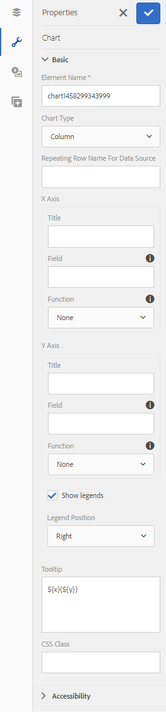
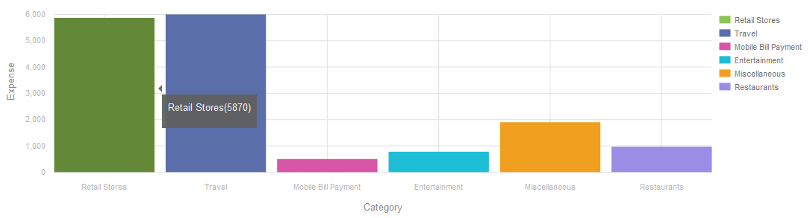

# Gráficos de formulário adaptável {#af-charts}


Um gráfico é uma representação visual de dados. Ele permite condensar grandes quantidades de informações em um formato visual fácil de entender, permitindo que você visualize, interprete e analise melhor dados complexos.
O pacote complementar do AEM Forms fornece um componente de gráfico pronto para uso. Você pode usar em formulários e documentos adaptáveis para representação visual de dados bidimensionais no **painéis repetíveis** e **tabelas**. O componente de Gráfico permite adicionar e configurar os seguintes tipos de gráficos:

1. Pizza
1. Coluna
1. Rosca
1. Barra
1. Linha
1. Linha e ponto
1. Ponto
1. Área

O componente de Gráfico suporta e fornece funções estatísticas incorporadas - soma, média, máximo, mínimo, modo, mediana, intervalo e frequência - para calcular e plotar valores em um gráfico. Além das funções prontas para uso, você pode criar suas próprias funções personalizadas e disponibilizá-las para uso em gráficos.

Agora vamos ver como adicionar e configurar o componente de Gráfico:

## Adicionar gráfico {#add-chart}

Por padrão, o componente Gráfico está disponível na barra lateral do AEM. Você pode arrastar e soltar o componente Gráfico da barra lateral AEM para o formulário ou documento adaptável no modo de criação. Quando você solta o componente, ele cria um espaço reservado para um gráfico.

## Configurar gráfico {#configure-chart}

>[!NOTE]
> 
> Antes de configurar o gráfico, certifique-se de que o painel ou a linha da tabela para a qual você está configurando o gráfico esteja definida como repetível. Você pode especificar contagens mínimas e máximas para o painel ou linha de tabela repetível na guia Configurações de repetição da caixa de diálogo Editar componente.

Para configurar o gráfico, clique no componente Gráfico e clique em  para abrir a caixa de diálogo Editar Gráfico. A caixa de diálogo inclui guias Título e texto, Configuração, Opções avançadas e Estilo, que permitem configurar o gráfico.

### Básico {#basic}

Na guia Básico, é possível configurar as seguintes propriedades:



* **Nome do elemento**: um identificador para o elemento de gráfico na estrutura de conteúdo JCR. Não é visível no gráfico, mas ajuda ao fazer referência ao elemento de outros componentes, scripts e expressões SOM.
* **Tipo de gráfico**: especifica o tipo de gráfico que você deseja gerar. As opções disponíveis são Pizza, Rosca, Barra, Coluna, Linha, Linha e Ponto, Ponto e Área. No exemplo, o tipo de gráfico é Coluna.
* **Repetição de nome de linha ou nome de painel para a fonte de dados**: especifica o nome do elemento da linha de tabela ou do painel repetível de onde os dados serão originados. No exemplo, statementDetails é o nome do elemento da linha repetível na tabela Detalhes da instrução.
* **Eixo X > Título**: especifica o título para o eixo X. No exemplo, o título do eixo X é Categoria.
* **Eixo X > Campo**: especifica o nome do elemento do campo (ou uma célula em uma tabela) a ser plotado no eixo X. No exemplo, categorias são configuradas no eixo X. O nome do elemento da célula da tabela na coluna Category da tabela de exemplo é category.
* **Eixo X > Usar função**: especifica a função estatística a ser usada para calcular os valores no eixo X. No exemplo, a opção selecionada é None. Para obter mais informações sobre funções, consulte Usar funções no gráfico.
* **Eixo Y > Título**: especifica o título para o eixo Y. No exemplo, o título para o eixo Y é Despesa.
* **Eixo Y > Campo**: especifica o nome do elemento do campo (ou da célula em uma tabela) a ser representado no eixo Y. No exemplo, configure a quantidade no eixo Y. O nome do elemento da célula da tabela na coluna Valor da tabela de exemplo é valor.
* **Eixo Y > Usar função**: especifica a função estatística a ser usada para calcular os valores no eixo Y. No exemplo, a quantidade gasta em cada categoria é adicionada e o valor calculado é representado no eixo Y. Portanto, selecione Soma na lista suspensa Usar função. Para obter mais informações sobre funções, consulte Usar funções no gráfico.
* **Posição da legenda**: Especifica a posição da legenda em relação ao gráfico. As opções disponíveis são Direita, Esquerda, Superior e Inferior.
* **Mostrar legenda**: mostrar uma legenda para o gráfico, quando ativado.
* **Dica de ferramenta**: Especifica o formato em que a dica de ferramenta aparece ao passar o mouse em um ponto de dados no gráfico. O valor padrão é **\${x}(\${y})**. Dependendo do tipo de gráfico, quando você aponta o mouse em um ponto, barra ou fatia no gráfico, as variáveis **\${x}** e **\${y}** são dinamicamente substituídos pelos valores correspondentes no eixo X e no eixo Y e exibidos na dica de ferramenta. Como mostrado no exemplo abaixo, a dica de ferramenta é exibida como **Lojas de varejo (5870)** ao apontar com o mouse para a coluna Lojas de Varejo. Para desativar a dica de ferramenta, deixe o campo Dica de ferramenta em branco. Essa opção não é aplicável para gráficos de linha e de área.
* **Configurações específicas do gráfico**: Além das configurações comuns, a seguinte configuração específica para o gráfico está disponível:
* **Raio interno**: disponível para gráficos de rosca para especificar o raio (em pixels) do círculo interno no gráfico.
* **Cor da linha**: disponível para gráficos de Linha, Linha e Ponto e Área para especificar o valor hexadecimal da cor da linha no gráfico.
* **Cor do ponto**: disponível para gráficos de Ponto e Linha e Ponto para especificar o valor hexadecimal da cor dos pontos no gráfico.
* **Cor da área**: disponível para gráficos de Área para especificar o valor hexadecimal da cor da área sob a linha no gráfico.
* **Classe CSS**: especifique o nome de uma classe CSS no campo de classe CSS para aplicar o estilo personalizado ao gráfico.

### Configuração {#configuration}

Na guia Básico, defina o tipo de gráfico, o painel de origem ou a linha da tabela que contém os dados, os valores a serem plotados no eixo X e no eixo Y do gráfico e, opcionalmente, a função estatística para calcular os valores para plotagem no gráfico.

Vamos entender detalhadamente sobre as informações contidas nessa guia, com a ajuda de um exemplo de tabela repetível em um demonstrativo de cartão de crédito. Considere que você deseja gerar um gráfico para descrever e correlacionar a despesa total em diferentes categorias na seção detalhes do demonstrativo de um demonstrativo de cartão de crédito, conforme mostrado abaixo.

Para fazer isso, é necessário plotar categorias no eixo X e, no eixo Y, plotar o dispêndio total em cada categoria.


O demonstrativo de cartão de crédito usado neste exemplo é um documento de formulário adaptável e a seção de detalhes do demonstrativo é uma tabela, que tem a seguinte aparência no modo de criação.


Vamos considerar os seguintes requisitos e condições para gerar o gráfico:

* O gráfico exibe a despesa total em cada categoria na tabela Detalhes do Demonstrativo.
* O tipo de gráfico é Coluna, embora você possa escolher qualquer outro tipo de gráfico, conforme apropriado.
* A linha Tabela na tabela Detalhes da Instrução pode ser repetida. Você pode configurá-lo no campo Configurações de repetição das propriedades da linha da tabela.
* O nome do elemento da linha é Detalhes do Demonstrativo. Você pode configurá-lo nas propriedades da Linha da tabela.
* O nome do elemento da célula da tabela na coluna Category é category. Você pode especificá-lo em linha. Selecione a célula e toque no botão editar.
* O nome do elemento da célula da tabela na coluna Valor é valor. Além disso, a célula da tabela na coluna Valor é uma caixa numérica.
* Com a configuração especificada, o gráfico de Coluna no exemplo será exibido da seguinte maneira: Cada cor representa uma categoria e itens de linha individuais ou valores de uma categoria são somados no gráfico.

  

A legenda e a dica de ferramenta são exibidas da seguinte maneira:



### Estilo {#styling}

No modo Estilo, você pode configurar a largura, em porcentagem da largura total disponível no formulário ou documento, e a altura, em pixels, do gráfico. Outras opções incluem texto, fundo, borda, efeitos e substituições de CSS.

Para alternar para o modo de estilo, na barra de ferramentas da página, **toque>>Estilo**.


## Usar funções no gráfico {#use-functions}

Você pode configurar um gráfico para usar funções estatísticas para calcular valores a partir dos dados de origem para plotar no gráfico. Embora o componente de Gráfico tenha algumas funções integradas, você pode gravar suas próprias funções e disponibilizá-las para uso na configuração do gráfico.

>[!NOTE]
>
> Você pode usar funções para calcular valores para o eixo X ou o eixo Y em um gráfico.

### Funções padrão {#default-functions}

As seguintes funções estão disponíveis por padrão com o componente de Gráfico:

* **Média (Médio)**: retorna a média dos valores no eixo X ou Y para um determinado valor no outro eixo.
* **Sum**: retorna a soma de todos os valores no eixo X ou Y de um determinado valor no outro eixo.
* **Máximo**: retorna o máximo dos valores no eixo X ou Y para um determinado valor no outro eixo.
* **Frequência**: retorna o número de valores no eixo X ou Y para um determinado valor no outro eixo.
* **Intervalo**: retorna a diferença entre o máximo e o mínimo dos valores no eixo X ou Y para um determinado valor no outro eixo.
* **Mediana**: retorna o valor que separa valores mais altos e mais baixos na metade no eixo X ou Y para um determinado valor no outro eixo.
* **Mínimo**: retorna o mínimo dos valores no eixo X ou Y para um determinado valor no outro eixo.
* **Modo**: retorna o valor com mais ocorrências no eixo X ou Y para um determinado valor no outro eixo

### Funções personalizadas {#custom-functions}

Além de usar as funções padrão em gráficos, você pode escrever [funções personalizadas](/help/forms/using/rule-editor.md#custom-functions-in-rule-editor-custom-functions) no JavaScript e disponibilizá-las na lista de funções no componente Gráfico.

Uma função assume uma matriz ou valores e um nome de categoria como entradas e retorna um valor. Por exemplo:

```
Multiply(valueArray, category) {
    var val = 1;
    _.each(valueArray, function(value) {
        val = val * value;
    });
    return val;
}
```

Depois de escrever uma função personalizada, faça o seguinte para disponibilizá-la para uso na configuração do gráfico:

1. Adicione a função personalizada na biblioteca do cliente associada ao formulário ou documento adaptável.
1. No CRXDE Lite, crie um nó nt:unstructured na pasta apps com as seguintes propriedades:
   * Defina guideComponentType como fd/af/reduer. (obrigatório)
   * Defina value com um nome totalmente qualificado da função JavaScript personalizada. (obrigatório)
   * Defina jcr:description para um nome significativo. Aparece no **Usar função** lista suspensa. Por exemplo, **Multiplicar**.
   * Defina qtip para obter uma breve descrição da função. Ela aparece como uma dica de ferramenta ao passar o ponteiro sobre o nome da função na lista suspensa Usar função.
   * Clique em **Salvar tudo** para salvar a configuração.
   * A função agora está disponível para uso no gráfico.


## Atualizar gráfico automaticamente {#auto-refresh-chart}

Um gráfico é atualizado automaticamente quando os usuários executam um dos seguintes procedimentos:
* Adicione ou remova uma ocorrência do painel da fonte de dados ou da linha de tabela.
* Altere qualquer valor plotado no eixo X ou Y no painel da fonte de dados ou na linha da tabela.
* Alterar o tipo de gráfico.

## Usar tipo de gráfico em regras de formulário adaptáveis {#chart-in-rules}

A propriedade chartType especifica o tipo de gráfico. Os valores possíveis são pie, donut, bar, line, linepoint, point e area. É uma propriedade com script, o que significa que você pode usá-la no [regras de formulário adaptáveis](/help/forms/using/rule-editor.md) para manipular configurações de gráfico. Vamos entendê-lo com a ajuda de um exemplo.

Considere que você configurou um gráfico de Coluna. No entanto, você também deseja fornecer aos usuários uma opção para selecionar um tipo de gráfico diferente em uma lista suspensa e redesenhar o gráfico. Você pode fazer isso usando a propriedade chartType em uma regra da seguinte maneira:

1. Arraste e solte um componente de Lista suspensa da barra lateral AEM no formulário adaptável.
1. Selecione o componente e toque em .
1. Especifique um título para a lista suspensa. Por exemplo, selecione o tipo de gráfico.
1. Adicione tipos de gráficos compatíveis na seção Itens para preencher a lista suspensa. Clique em **Concluído**.
   

1. Selecione o componente suspenso e toque em . No editor de regras, escreva uma regra no editor visual de regras como mostrado abaixo.
   

   Neste exemplo, o nome do elemento do componente de gráfico é **myChart**.

   Como alternativa, você pode escrever as seguintes regras no editor de código.

   

   Para obter mais informações sobre como escrever regras, consulte [Editor de regras](/help/forms/using/rule-editor.md)

1. Clique em Concluído para salvar a regra.

Agora é possível selecionar um tipo de gráfico na lista suspensa e clicar em atualizar para redesenhar o gráfico.


