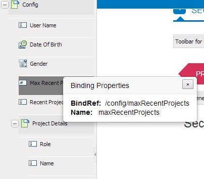

# Criação de formulários adaptáveis usando o Schema XML{#creating-adaptive-forms-using-xml-schema}

## Pré-requisitos {#prerequisites}

A criação de um formulário adaptável usando um schema XML como seu modelo de formulário requer uma compreensão básica dos schemas XML. Além disso, é recomendável ler o seguinte conteúdo antes deste artigo.

* [Criação de um formulário adaptável](../../forms/using/creating-adaptive-form.md)
* [SCHEMA XML](https://www.w3.org/TR/xmlschema-2/)

## Uso de um schema XML como modelo de formulário {#using-an-xml-schema-as-form-model}

A AEM Forms suporta a criação de um formulário adaptável usando um schema XML existente como modelo de formulário. Este schema XML representa a estrutura na qual os dados são produzidos ou consumidos pelo sistema de back-end em sua organização.

Os principais recursos do uso de um schema XML são:

* A estrutura do XSD é exibida como uma árvore na guia Localizador de conteúdo no modo de criação de um formulário adaptável. Você pode arrastar e adicionar elementos da hierarquia XSD ao formulário adaptável.
* É possível pré-preencher o formulário usando XML compatível com o schema associado.
* No envio, os dados inseridos pelo usuário são enviados como XML que se alinha ao schema associado.

Um schema XML consiste em tipos de elementos simples e complexos. Os elementos têm atributos que adicionam regras ao elemento. Quando esses elementos e atributos são arrastados para um formulário adaptável, eles são mapeados automaticamente para o componente de formulário adaptável correspondente.

Esse mapeamento de elementos XML com componentes de formulário adaptáveis é o seguinte:

<table>
 <tbody>
  <tr>
   <th><strong>Elemento ou atributo XML </strong></th>
   <th><strong>Componente de formulário adaptável</strong></th>
  </tr>
  <tr>
   <td><code>xs:string</code></td>
   <td>Caixa de texto</td>
  </tr>
  <tr>
   <td><code>xs:boolean</code></td>
   <td>Caixa de seleção</td>
  </tr>
  <tr>
   <td>
    <ul>
     <li><code>xs:unsignedInt</code></li>
     <li><code>xs:xs:int</code></li>
     <li><code class="code">xs:decimal
        </code></li>
     <li>Todos os tipos de valores numéricos</li>
    </ul> </td>
   <td>Caixa numérica</td>
  </tr>
  <tr>
   <td><code>xs:date</code></td>
   <td>Seletor de data</td>
  </tr>
  <tr>
   <td><code class="code">xs:enumeration
      </code></td>
   <td>Lista suspensa</td>
  </tr>
  <tr>
   <td>Qualquer elemento de tipo complexo</td>
   <td>Painel</td>
  </tr>
 </tbody>
</table>

## Schema XML de exemplo {#sample-xml-schema}

Aqui está um exemplo de um schema XML.

```xml
<?xml version="1.0" encoding="utf-8" ?>
    <xs:schema targetNamespace="https://adobe.com/sample.xsd"
                    xmlns="https://adobe.com/sample.xsd"
                    xmlns:xs="https://www.w3.org/2001/XMLSchema"
                >

        <xs:element name="sample" type="SampleType"/>

        <xs:complexType name="SampleType">
            <xs:sequence>
                <xs:element name="leaderName" type="xs:string" default="Enter Name"/>
                <xs:element name="assignmentStartBirth" type="xs:date"/>
                <xs:element name="gender" type="GenderEnum"/>
                <xs:element name="noOfProjectsAssigned" type="IntType"/>
                <xs:element name="assignmentDetails" type="AssignmentDetails"
                                            minOccurs="0" maxOccurs="10"/>
            </xs:sequence>
        </xs:complexType>

        <xs:complexType name="AssignmentDetails">
            <xs:attribute name="name" type="xs:string" use="required"/>
            <xs:attribute name="durationOfAssignment" type="xs:unsignedInt" use="required"/>
            <xs:attribute name="numberOfMentees" type="xs:unsignedInt" use="required"/>
             <xs:attribute name="descriptionOfAssignment" type="xs:string" use="required"/>
             <xs:attribute name="financeRelatedProject" type="xs:boolean"/>
       </xs:complexType>
  <xs:simpleType name="IntType">
            <xs:restriction base="xs:int">
            </xs:restriction>
        </xs:simpleType>
  <xs:simpleType name="GenderEnum">
            <xs:restriction base="xs:string">
                <xs:enumeration value="Female"/>
                <xs:enumeration value="Male"/>
            </xs:restriction>
        </xs:simpleType>
    </xs:schema>
```

>[!NOTE]
>
>Certifique-se de que seu schema XML tenha apenas um elemento raiz. Não há suporte para um schema XML com mais de um elemento raiz.

## Adicionar propriedades especiais a campos usando o schema XML {#adding-special-properties-to-fields-using-xml-schema}

É possível adicionar os seguintes atributos aos elementos do Schema XML para adicionar propriedades especiais aos campos do formulário adaptável associado.

<table>
 <tbody>
  <tr>
   <th><strong>propriedade schema</strong></th>
   <th><strong>Usar em forma adaptável</strong></th>
   <th><strong>Suportado em </strong></th>
  </tr>
  <tr>
   <td><code>use=required </code></td>
   <td>Marca um campo obrigatório<br /> </td>
   <td>Atributo</td>
  </tr>
  <tr>
   <td><code>default="default value"</code></td>
   <td>Adiciona um valor padrão</td>
   <td>Elemento e atributo</td>
  </tr>
  <tr>
   <td><code>minOccurs="3"</code></td>
   <td><p>Especifica ocorrências mínimas</p> <p>(Para subformulários repetíveis (tipos complexos))</p> </td>
   <td>Elemento (tipo complexo)</td>
  </tr>
  <tr>
   <td><code class="code">maxOccurs="10"
      </code></td>
   <td><p>Especifica o máximo de ocorrências</p> <p>(Para subformulários repetíveis (tipos complexos))</p> </td>
   <td>Elemento (tipo complexo)</td>
  </tr>
 </tbody>
</table>

>[!NOTE]
>
>Ao arrastar um elemento de schema para um formulário adaptável, uma legenda padrão é gerada por:
>
>* Colocar o primeiro caractere do nome do elemento em maiúsculas
>* Inserindo espaço em branco nos limites do Camel Case.

>
>
Por exemplo, se você adicionar o elemento de schema `userFirstName`, a legenda gerada no formulário adaptável será `User First Name`.

## Limitar valores aceitáveis para um componente de formulário adaptável {#limit-acceptable-values-for-an-adaptive-form-component}

É possível adicionar as seguintes restrições aos elementos do schema XML para limitar os valores aceitáveis para um componente de formulário adaptável:

<table>
 <tbody>
  <tr>
   <td><p><strong> propriedade schema</strong></p> </td>
   <td><p><strong>Tipo de dados</strong></p> </td>
   <td><p><strong>Descrição</strong></p> </td>
   <td><p><strong>Componente</strong></p> </td>
  </tr>
  <tr>
   <td><p><code>totalDigits</code></p> </td>
   <td><p>Sequência de caracteres</p> </td>
   <td><p>Especifica o número máximo de dígitos permitidos em um componente. O número de dígitos especificado deve ser maior que zero.</p> </td>
   <td>
    <ul>
     <li>Caixa numérica</li>
     <li>Escalonador Numérico</li>
    </ul> </td>
  </tr>
  <tr>
   <td><p><code>maximum</code></p> </td>
   <td><p>Sequência de caracteres</p> </td>
   <td><p>Especifica o limite superior para valores numéricos e datas. Por padrão, o valor máximo é incluído.</p> </td>
   <td>
    <ul>
     <li>Caixa numérica</li>
     <li>Escalonador Numérico<br /> </li>
     <li>Seletor de datas</li>
    </ul> </td>
  </tr>
  <tr>
   <td><p><code>minimum</code></p> </td>
   <td><p>Sequência de caracteres</p> </td>
   <td><p>Especifica o limite inferior para valores numéricos e datas. Por padrão, o valor mínimo é incluído.</p> </td>
   <td>
    <ul>
     <li>Caixa numérica</li>
     <li>Escalonador Numérico</li>
     <li>Seletor de datas</li>
    </ul> </td>
  </tr>
  <tr>
   <td><p><code>exclusiveMaximum</code></p> </td>
   <td><p>Booleano</p> </td>
   <td><p>Se verdadeiro, o valor numérico ou a data especificada no componente do formulário deve ser menor que o valor numérico ou a data especificada para a propriedade máxima.</p> <p>Se falso, o valor numérico ou a data especificada no componente do formulário deve ser menor ou igual ao valor numérico ou à data especificada para a propriedade máxima.</p> </td>
   <td>
    <ul>
     <li>Caixa numérica</li>
     <li>Escalonador Numérico</li>
     <li>Seletor de datas</li>
    </ul> </td>
  </tr>
  <tr>
   <td><p><code>exclusiveMinimum</code></p> </td>
   <td><p>Booleano</p> </td>
   <td><p>Se verdadeiro, o valor numérico ou a data especificada no componente do formulário deve ser maior que o valor numérico ou a data especificada para a propriedade mínima.</p> <p>Se falso, o valor numérico ou a data especificada no componente do formulário deve ser maior ou igual ao valor numérico ou à data especificada para a propriedade mínima.</p> </td>
   <td>
    <ul>
     <li>Caixa numérica</li>
     <li>Escalonador Numérico</li>
     <li>Seletor de datas</li>
    </ul> </td>
  </tr>
  <tr>
   <td><p><code>minLength</code></p> </td>
   <td><p>Sequência de caracteres</p> </td>
   <td><p>Especifica o número mínimo de caracteres permitidos em um componente. O comprimento mínimo deve ser igual ou superior a zero.</p> </td>
   <td>
    <ul>
     <li>Caixa de texto</li>
    </ul> </td>
  </tr>
  <tr>
   <td><p><code>maxLength</code></p> </td>
   <td><p>Sequência de caracteres</p> </td>
   <td><p>Especifica o número máximo de caracteres permitidos em um componente. O comprimento máximo deve ser maior que zero.</p> </td>
   <td>
    <ul>
     <li>Caixa de texto</li>
    </ul> </td>
  </tr>
  <tr>
   <td><p><code>length</code></p> </td>
   <td><p>Sequência de caracteres</p> </td>
   <td><p>Especifica o número exato de caracteres permitidos em um componente. O comprimento deve ser igual ou maior que zero.</p> </td>
   <td>
    <ul>
     <li>Caixa de texto</li>
    </ul> </td>
  </tr>
  <tr>
   <td><p><code>fractionDigits</code></p> </td>
   <td><p>Sequência de caracteres</p> </td>
   <td><p>Especifica o número máximo de casas decimais permitidas em um componente. fractionDigits deve ser igual ou maior que zero.</p> </td>
   <td>
    <ul>
     <li> Caixa numérica com tipo de dados flutuante ou decimal</li>
    </ul> </td>
  </tr>
  <tr>
   <td><p><code>pattern</code></p> </td>
   <td><p>Sequência de caracteres</p> </td>
   <td><p>Especifica a sequência dos caracteres. Um componente aceita os caracteres se eles estiverem em conformidade com o padrão especificado.</p> <p>A propriedade pattern mapeia para o padrão de validação do componente de formulário adaptável correspondente.</p> </td>
   <td>
    <ul>
     <li>Todos os componentes de formulários adaptáveis que estão mapeados para um schema XSD </li>
    </ul> </td>
  </tr>
 </tbody>
</table>

## Perguntas frequentes {#frequently-asked-questions}

**Como faço para saber qual elemento na árvore está associado a qual elemento XML?**

Ao clicar com o duplo em um elemento no Localizador de conteúdo, um pop-up exibe um nome de campo e uma propriedade chamada `bindRef`. Essa propriedade mapeia o elemento de árvore para o elemento ou atributo no schema.



O campo bindRef</code> mostra a associação entre um elemento de árvore e um elemento ou atributo em um schema.

>[!NOTE]
>
>Os atributos têm um símbolo `@` em seu valor `bindRef`para diferenciá-los dos elementos. Por exemplo, `/config/projectDetails/@duration`.

**Por que não consigo arrastar elementos individuais de um subformulário (estrutura gerada a partir de qualquer tipo complexo) para subformulários repetitivos (os valores minOccours ou maxOccurs são maiores que 1)?**

Em um subformulário repetível, é necessário usar o subformulário completo. Se você quiser apenas campos seletivos, use a estrutura inteira e exclua os não desejados.

**Tenho uma estrutura longa e complexa no Localizador de conteúdo. Como posso encontrar um elemento específico?**

Você tem duas opções:

* Percorrer a estrutura em árvore
* Use a caixa Pesquisar para localizar um elemento

**O que é um bindRef?**

Um `bindRef` é a conexão entre um componente de formulário adaptável e um atributo ou elemento de schema. Determina `XPath` onde o valor capturado deste componente ou campo está disponível no XML de saída. Um `bindRef`também é usado ao pré-preencher um valor de campo a partir do XML pré-preenchido (pré-preenchido).
