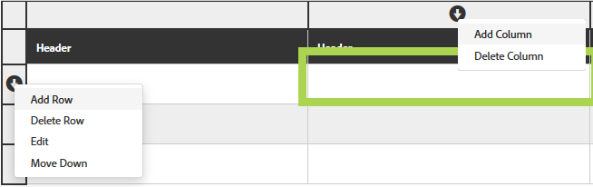

# Tabelas em formulários adaptáveis{#tables-in-adaptive-forms}

O uso de tabelas é uma forma eficiente, simplificada e organizada de apresentar dados complexos. Ajuda os usuários a identificar informações facilmente e a fornecer entradas em uma organização ordenada de linhas e colunas. A maioria dos formulários de serviços financeiros e organizações governamentais exigem grandes tabelas de dados para colocar números e realizar cálculos.

O AEM Forms fornece um componente de Tabela no navegador de componentes na barra lateral que permite criar tabelas em formulários adaptáveis. Alguns dos principais recursos que ele oferece são:

* Layout responsivo em dispositivos móveis
* Linhas e colunas configuráveis
* Adição e exclusão dinâmicas de linhas em tempo de execução
* Combinar ou unir e dividir células
* Acessível pelos leitores de tela
* Layout personalizado usando CSS
* Compatível e mapeado com o componente de tabela XDP
* Suporte para adicionar linhas ou células usando elementos de tipo complexo XSD
* Mesclar dados de um arquivo XML

## Crie uma tabela {#create-a-table}

Para criar uma tabela, arraste e solte o componente Tabela do navegador de componentes no sidekick no formulário adaptável. Por padrão, a tabela contém duas colunas e três linhas, incluindo a linha de cabeçalho.


### Sobre células de cabeçalho e corpo {#about-header-and-body-cells}

As células do cabeçalho são campos de texto. Para alterar o rótulo de um cabeçalho, clique com o botão direito do mouse na célula de cabeçalho e clique em **Editar**. Na caixa de diálogo Editar, atualize o rótulo no campo **Valor** e clique em **OK**.

As células de corpo são caixas de texto, por padrão. Você pode substituir uma célula de corpo por qualquer outro componente de formulários adaptáveis disponível no sidekick, como uma caixa numérica, seletor de datas ou lista suspensa.

Por exemplo, a primeira linha de corpo na tabela a seguir inclui caixa de texto, seletor de datas e componentes de lista suspensa como células.


É possível unir duas ou mais células de corpo selecionando as células que deseja mesclar, clicando com o botão direito do mouse e selecionando **Mesclar**. Além disso, você pode dividir uma célula unida clicando com o botão direito do mouse nela e selecionando **Dividir células**.

### Adicionar, excluir, mover linhas e colunas {#add-delete-move-rows-and-columns}

É possível adicionar e excluir uma linha ou coluna e mover uma linha para cima e para baixo em uma tabela.

Para adicionar ou excluir uma linha ou coluna ou mover uma linha, clique em qualquer célula na linha ou coluna. Um menu suspenso é exibido na parte superior da coluna e à esquerda da linha. O menu na parte superior fornece opções para adicionar ou excluir a coluna, enquanto o menu na esquerda permite que você adicione, exclua ou mova a linha.

* A operação Adicionar adiciona uma linha abaixo ou uma coluna à direita da linha ou coluna selecionada.
* A operação Excluir exclui a linha ou a coluna selecionada.
* A operação Mover para cima e Mover para baixo move a linha selecionada para cima e para baixo.

O menu suspenso da linha também fornece a operação Editar para editar propriedades, configurações e opções de estilo de linhas.



>[!NOTE]
>
>Embora seja possível adicionar qualquer número de linhas em uma tabela, o número máximo de colunas que você pode adicionar é seis. Além disso, não é possível excluir a linha de cabeçalho da tabela.

### Adicionar descrição da tabela {#add-table-description}

Você pode adicionar uma descrição da tabela para explicar como as informações são organizadas que os leitores de tela podem interpretar e ler. Para adicionar a descrição:

1. Selecione a tabela e toque em  para ver suas propriedades na barra lateral.
1. Especifique o resumo na guia Acessibilidade.
1. Clique em **Concluído**.

### Classificar colunas em uma tabela {#sortcolumnstable}

É possível classificar os dados com base em qualquer coluna em uma tabela no formulário adaptável. Os valores na coluna podem ser classificados em ordem crescente ou decrescente.

A classificação pode ser aplicada às colunas da tabela que contêm:

* Texto estático
* Propriedades de objetos do modelo de dados
* Combinação de propriedades de objetos de texto estático e modelo de dados

Para aplicar a classificação nas colunas da tabela, as células da coluna da tabela devem conter qualquer um dos seguintes componentes: Caixa numérica, Stepper numérico, Campo de entrada de data, Seletor de data, Texto ou Caixa de texto.

Para ativar a classificação:

1. Selecione a tabela e toque  (Configurar). Você também pode selecionar a tabela usando o navegador **Conteúdo** no sidekick da Comunicação Interativa.
1. Selecione **Ativar classificação**.
1. Toque em  para salvar as propriedades da tabela. Os ícones de classificação, setas para cima e para baixo, em cabeçalhos de colunas representam que a classificação foi ativada.

   

1. Alterne para o modo de **Pré-visualização** para visualização da saída. A tabela é classificada automaticamente com base na primeira coluna da tabela.
1. Clique no cabeçalho da coluna para classificar os valores com base na coluna.

   Um cabeçalho de coluna com uma seta para cima representa que a tabela é classificada com base nessa coluna. Além disso, os valores na coluna são exibidos na ordem crescente.

   

   Da mesma forma, um cabeçalho de coluna com uma seta para baixo representa que os valores na coluna são exibidos na ordem decrescente.

   Você também pode fazer alterações na tabela no modo de **Pré-visualização** e clicar no cabeçalho da coluna novamente para classificar os valores da coluna.

## Configurar estilo de tabela {#configure}

É possível definir o estilo de uma tabela usando o modo Estilo na barra de ferramentas da página. Execute as seguintes etapas para alternar para o modo de estilo e editar o estilo da tabela

1. Na barra de ferramentas da página, antes da Pré-visualização, toque em  > **Estilo**.

1. Na barra lateral, selecione a tabela e toque no botão editar, botão .
É possível ver as propriedades de estilização na barra lateral.


>[!NOTE]
>
>Você pode alterar o tema de cores para linhas de cabeçalho e corpo alterando os valores das variáveis MENOS. Para obter mais informações, consulte [Temas no AEM Forms](/help/forms/using/themes.md) [](/help/forms/using/creating-custom-adaptive-form-themes.md).

## Adicionar ou excluir uma linha dinamicamente {#add-or-delete-a-row-dynamically}

As tabelas fornecem suporte imediato para adicionar ou excluir linhas dinamicamente no tempo de execução.

1. Selecione uma linha de tabela e toque em .
1. Na guia Configurações de repetição, especifique as contagens mínima e máxima para limitar o número de linhas na tabela.
1. Clique em **Concluído**.

No tempo de execução, você verá **+** e *-* botões para adicionar ou excluir uma linha.


>[!NOTE]
>
>A adição ou exclusão dinâmica de uma linha não é compatível com Cabeçalhos no layout móvel esquerdo das tabelas.

## Expressões em uma tabela {#expressions-in-a-table}

Tabelas em formulários adaptativos permitem que você grave expressões no JavaScript para induzir comportamentos, como mostrar ou ocultar uma tabela ou linha, adicionar todos os números e mostrar o total em uma célula, ativar ou desativar uma célula, validar a entrada do usuário e assim por diante. Essas expressões usam APIs de modelo de script de formulários adaptáveis.

Embora tabelas e linhas suportem apenas expressões de visibilidade para controlar sua visibilidade com base no valor retornado por uma expressão, as células suportam as seguintes expressões:

* **Script de inicialização:** para executar uma ação na inicialização de um campo.
* **Script de confirmação de valor:** para alterar os componentes de um formulário após a alteração do valor de um campo.

>[!NOTE]
>
>Se o script XFA change/exit também for aplicado ao mesmo campo, o script XFA change/exit será executado antes do script Value Commit.

* **Calcular expressões**: para calcular automaticamente o valor de um campo.
* **expressões** de validação: para validar um campo.
* **expressões** de acesso: para ativar/desativar um campo.
* **expressão** de visibilidade: para controlar a visibilidade de um campo e painel.

A expressão de visibilidade de uma tabela ou linha pode ser definida na guia Propriedades do painel da caixa de diálogo correspondente do componente Editar. As expressões de uma célula podem ser definidas na guia Script da caixa de diálogo Editar componente.

Para obter a lista completa de classes de formulários adaptáveis, eventos, objetos e APIs públicas, consulte Referência da API da biblioteca [JavaScript para formulários](https://helpx.adobe.com/aem-forms/6/javascript-api/index.html)adaptáveis.

## Layouts móveis {#mobile-layouts}

Tabelas em formulários adaptáveis oferecem experiência inigualável em dispositivos móveis devido aos layouts fluidos e responsivos. O AEM Forms oferta dois tipos de layouts móveis para tabelas - Cabeçalhos à esquerda e Colaboráveis.

Você pode configurar um layout móvel para uma tabela na guia Estilo da caixa de diálogo Editar componente para uma tabela.

### Headers on left {#headers-on-left}

No layout Cabeçalhos à esquerda, o cabeçalho na tabela é transposto à esquerda com apenas uma célula aparecendo em um cabeçalho. Cada linha neste layout aparece como uma seção distinta. As imagens a seguir comparam uma tabela em um desktop com a tabela em um dispositivo móvel.


visualização de desktop de uma tabela com cabeçalho no layout esquerdo


visualização móvel de uma tabela com cabeçalho no layout esquerdo

### Layout de colunas flexível {#collapsible-columns-layout}

No layout de coluna flexível, as colunas na tabela são recolhidas para mostrar uma ou duas colunas, dependendo do tamanho do dispositivo, enquanto outras colunas são recolhidas. Você pode clicar no ícone recolher/expandir para visualização de outras colunas na tabela.

>[!NOTE]
>
>Embora o layout de coluna flexível seja otimizado para dispositivos móveis, ele também funcionará na área de trabalho, se a largura disponível não for suficiente para mostrar todas as colunas em uma tabela.

As imagens a seguir comparam a aparência de uma tabela em um dispositivo com colunas recolhidas e expandidas.


Colunas recolhidas de uma tabela com apenas duas colunas aparecendo em um dispositivo móvel


Coluna expandida de uma tabela em um dispositivo móvel

## Mesclar dados em uma tabela {#merge-data-in-a-table}

Tabelas em formulários adaptáveis permitem preencher a tabela em tempo de execução usando dados de um arquivo XML. O arquivo XML de dados pode residir no sistema de arquivos local da máquina em que o servidor do AEM Forms está sendo executado ou no repositório do CRX.

Vejamos a seguinte tabela de resumo de transações bancárias que queremos preencher com dados de um arquivo XML.


Neste exemplo, a propriedade Nome do elemento para:

* a linha é **Linha1**
* a célula de corpo na data da Transação é **tableItem1**
* a célula de corpo em Descrição é **tableItem2**
* a célula de corpo em Tipo de transação é **tipo**
* a célula de corpo em Amount in USD é **tableItem3**

O arquivo XML que contém dados no seguinte formato:

```xml
<?xml version="1.0" encoding="UTF-8"?><afData>
  <afUnboundData>
    <data>
 <typeSelect>0</typeSelect>
 <Row1>
      <tableItem1>2015-01-08</tableItem1>
      <tableItem2>Purchase laptop</tableItem2>
      <type>0</type>
      <tableItem3>12000</tableItem3>
 </Row1>
 <Row1>
      <tableItem1>2015-01-05</tableItem1>
      <tableItem2>Transport expense</tableItem2>
      <type>0</type>
      <tableItem3>120</tableItem3>
 </Row1>
 <Row1>
      <tableItem1>2014-01-08</tableItem1>
      <tableItem2>Laser printer</tableItem2>
      <type>0</type>
      <tableItem3>500</tableItem3>
 </Row1>
 <Row1>
      <tableItem1>2014-12-08</tableItem1>
      <tableItem2>Credit card payment</tableItem2>
      <type>0</type>
      <tableItem3>300</tableItem3>
 </Row1>
 <Row1>
      <tableItem1>2015-01-06</tableItem1>
      <tableItem2>Interest earnings</tableItem2>
      <type>1</type>
      <tableItem3>12000</tableItem3>
 </Row1>
 <Row1>
      <tableItem1>2015-01-05</tableItem1>
      <tableItem2>Payment from a client</tableItem2>
      <type>1</type>
      <tableItem3>500</tableItem3>
 </Row1>
 <Row1>
      <tableItem1>2015-01-08</tableItem1>
      <tableItem2>Food expense</tableItem2>
      <type>0</type>
      <tableItem3>120</tableItem3>
 </Row1>
 </data>
  </afUnboundData>
  <afBoundData>
    <data/>
  </afBoundData>
  <afBoundData/>
</afData>
```

No XML de amostra, os dados de uma linha são definidos pelas `<Row1>` tags, que é o nome do elemento da linha na tabela. Na `<Row1>` tag , os dados de cada célula são definidos dentro da tag para seu nome de elemento, como `<tableItem1>`, `<tableItem2>`, `<tableItem3>`e `<type>`.

Para unir esses dados à tabela no tempo de execução, é necessário apontar o formulário adaptável que contém a tabela para o local XML absoluto com wcmmode desativado. Por exemplo, se o formulário adaptável estiver em *https://localhost:4502/myForms/bankTransaction.html* e o arquivo XML de dados estiver salvo em *C:/myTransactions/bankSummary.xml*, você pode visualização a tabela com dados no seguinte URL:

*https://localhost:4502/myForms/bankTransaction.html?dataRef=file:/// C:/myTransactions/bankSummary.xml&amp;wcmmode=disabled*


## Usar componentes XDP e tipos complexos XSD {#use-xdp-components-and-xsd-complex-types}

Se você tiver criado um formulário adaptável com base em um modelo de formulário XFA, os elementos XFA estarão disponíveis na guia Modelo de dados do AEM Content Finder. Você pode arrastar e soltar esses elementos XFA, incluindo tabelas, no formulário adaptável.

O elemento de tabela XFA é mapeado para o componente Tabela e funciona prontamente em formulários adaptáveis. Todas as propriedades e funcionalidades da tabela XDP são preservadas quando movidas para um formulário adaptável, e você pode executar qualquer operação nela da mesma forma que faz com a tabela de formulário adaptável nativa. Por exemplo, se uma linha em uma tabela XDP estiver marcada como repetível, ela será repetida quando solta também em formulários adaptáveis.

Além disso, é possível arrastar e soltar o subformulário XDP para adicionar uma nova linha à tabela. No entanto, observe que soltar um subformulário aninhado não funciona.

>[!NOTE]
>
>Uma tabela XDP sem uma linha de cabeçalho não será mapeada para o componente de tabela de forma adaptável. Em vez disso, ele será mapeado para o componente de painel de formulário adaptável com layout fluido. Além disso, quando você adiciona uma tabela aninhada de um XDP a um formulário adaptável, a tabela externa é convertida em um painel enquanto mantém a tabela interna.

Além disso, você pode arrastar e soltar um grupo de elementos de tipo complexo XSD para criar uma linha de tabela. Uma nova linha é criada logo abaixo da linha na qual você soltou os elementos. As células criadas usando os elementos de tipo complexo XSD mantêm uma referência de vínculo ao XSD. Você também pode substituir uma célula de corpo por um elemento de tipo complexo XSD, soltando o elemento na célula.

>[!NOTE]
>
>O número de elementos em um componente de tabela XDP, um subformulário ou um tipo complexo XSD não pode exceder o número de células em uma linha. Por exemplo, não é possível soltar quatro elementos em uma linha que tenha apenas três células. Isso resultará em um erro.
>
>Se o número de elementos for menor que o número de células em uma linha, a nova linha primeiro adicionará células com base nos elementos e, em seguida, as células padrão serão adicionadas para preencher as células restantes na linha. Por exemplo, se você soltar um grupo de três elementos em uma linha que tem quatro células, as três primeiras células serão baseadas nos elementos que você soltou e a célula restante será a célula padrão da tabela.

## Principais considerações {#key-considerations}

* Se linhas forem movidas para cima e para baixo durante a criação de uma tabela baseada em XSD, alguma perda de dados das linhas da tabela será vista no XML de dados gerado ao enviar o formulário.
* Cada célula de corpo em uma tabela padrão tem um nome de elemento predefinido associado a ela. Se você adicionar outra tabela no formulário adaptável, as células de corpo padrão na nova tabela terão o mesmo nome de elemento que na primeira tabela. Nesse cenário, os dados gerados ao enviar o formulário incluirão dados nas células de corpo padrão de apenas uma das tabelas. Portanto, certifique-se de renomear os nomes de elementos para células de corpo padrão para mantê-las exclusivas entre tabelas e evitar perda de dados.

   Observe que isso se aplica somente às células de corpo padrão. Se você adicionar mais linhas ou colunas a uma tabela, gerará automaticamente nomes de elementos exclusivos para células de corpo não padrão.

