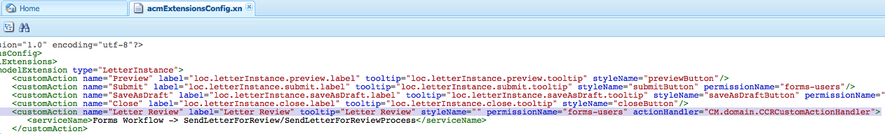
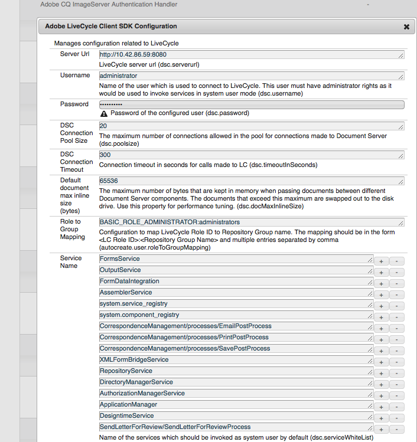

# Adicionar um botão de ação personalizado na interface do usuário Criar correspondência {#add-custom-action-button-in-create-correspondence-ui}

## Visão geral {#overview}

A solução Gerenciamento de correspondência permite adicionar ações personalizadas à interface do usuário Criar correspondência .

O cenário deste documento explica como criar um botão na Interface do usuário Criar correspondência para compartilhar uma carta como um PDF de revisão anexado a um email.

### Pré-requisitos {#prerequisites}

Para concluir esse cenário, você precisa do seguinte:

* Conhecimento do CRX e do JavaScript
* Servidor LiveCycle

## Cenário: Crie o botão na interface do usuário Criar correspondência para enviar uma carta para revisão {#scenario-create-the-button-in-the-create-correspondence-user-interface-to-send-a-letter-for-review}

Adicionar um botão com uma ação (aqui, enviar carta para revisão) à interface do usuário Criar correspondência inclui:

1. Adicionar o botão à interface do usuário Criar correspondência
1. Adição do manuseio de ação de ação ao botão
1. Adicionar o processo do LiveCycle para ativar o controle de ações

### Adicione o botão à interface do usuário Criar correspondência {#add-the-button-to-the-create-correspondence-user-interface}

1. Vá para `https://'[server]:[port]'/[ContextPath]/crx/de` e faça logon como Administrador.
1. Na pasta apps , crie uma pasta chamada `defaultApp` com caminho/estrutura semelhante à pasta defaultApp (localizada na pasta config ). Use as seguintes etapas para criar a pasta:

   1. Clique com o botão direito do mouse na pasta **defaultApp** no seguinte caminho e selecione **Sobrepor nó**:

      /libs/fd/cm/config/defaultApp/

      

   1. Certifique-se de que a caixa de diálogo Sobrepor nó tenha os seguintes valores:

      **Caminho:** /libs/fd/cm/config/defaultApp/

      **Local de sobreposição:** /apps/

      **Corresponder Tipos De Nó:** Marcado

      

   1. Clique em **OK**.
   1. Clique em **Salvar tudo**.

1. Faça uma cópia do arquivo acmExtensionsConfig.xml (existe na ramificação /libs) na ramificação /apps.

   1. Vá para &quot;/libs/fd/cm/config/defaultApp/acmExtensionsConfig.xml&quot;

   1. Clique com o botão direito do mouse no arquivo acmExtensionsConfig.xml e selecione **Copiar**.

      

   1. Clique com o botão direito do mouse na pasta **defaultApp** em &quot;/apps/fd/cm/config/defaultApp/&quot; e selecione **Colar**.
   1. Clique em **Salvar tudo**.

1. Clique duas vezes na cópia de acmExtentionsConfig.xml que você criou recentemente na pasta de aplicativos. O arquivo é aberto para edição.
1. Localize o seguinte código:

   ```xml
   <?xml version="1.0" encoding="utf-8"?>
   <extensionsConfig>
       <modelExtensions>
           <modelExtension type="LetterInstance">
     <customAction name="Preview" label="loc.letterInstance.preview.label" tooltip="loc.letterInstance.preview.tooltip" styleName="previewButton"/>
               <customAction name="Submit" label="loc.letterInstance.submit.label" tooltip="loc.letterInstance.submit.tooltip" styleName="submitButton" permissionName="forms-users"/>
               <customAction name="SaveAsDraft" label="loc.letterInstance.saveAsDraft.label" tooltip="loc.letterInstance.saveAsDraft.tooltip" styleName="submitButton" permissionName="forms-users"/>
               <customAction name="Close" label="loc.letterInstance.close.label" tooltip="loc.letterInstance.close.tooltip" styleName="closeButton"/>
           </modelExtension>
       </modelExtensions>
   </extensionsConfig>
   ```

1. Para enviar uma carta por email, você pode usar o LiveCycle. Adicione uma tag customAction na tag modelExtension em acmExtensionsConfig.xml da seguinte maneira:

   ```xml
    <customAction name="Letter Review" label="Letter Review" tooltip="Letter Review" styleName="" permissionName="forms-users" actionHandler="CM.domain.CCRCustomActionHandler">
         <serviceName>Forms Workflow -> SendLetterForReview/SendLetterForReviewProcess</serviceName>
       </customAction>
   ```

   

   A tag modelExtension tem um conjunto de tags secundárias customAction que configuram a ação, as permissões e a aparência do botão de ação. Veja a seguir a lista de tags de configuração customAction:

   | **Nome** | **Descrição** |
   |---|---|
   | name | O nome alfanumérico da ação a ser executada. O valor dessa tag é obrigatório, deve ser exclusivo (dentro da tag modelExtension) e deve começar com um alfabeto. |
   | label | O rótulo a ser exibido no botão de ação |
   | tooltip | Texto de dica de ferramenta do botão, que é exibido quando o usuário passa o mouse sobre ele. |
   | styleName | Nome do estilo personalizado que é aplicado no botão de ação. |
   | permissionName | A ação correspondente é exibida somente se o usuário tiver a permissão especificada por permissionName. Quando você especifica permissionName como `forms-users`, todos os usuários obtêm acesso a essa opção. |
   | actionHandler | Nome totalmente qualificado da classe ActionHandler chamada quando o usuário clica no botão. |

   Além dos parâmetros acima, pode haver configurações adicionais associadas a um customAction. Essas configurações adicionais são disponibilizadas para o manipulador por meio do objeto CustomAction .

   | **Nome** | **Descrição** |
   |---|---|
   | serviceName | Se uma customAction contiver uma tag filho com o nome serviceName e, em seguida, ao clicar no botão/link relevante, um processo será chamado com o nome representado pela tag serviceName . Certifique-se de que esse processo tenha a mesma assinatura que o PostProcess da carta. Adicione o prefixo &quot;Forms Workflow ->&quot; no nome do serviço. |
   | Parâmetros contendo o prefixo cm_ no nome da tag | Se uma customAction contiver tags filho que começam com o nome cm_, então no processo de publicação (seja o Processo de postagem da carta ou o processo especial representado pela tag serviceName ) esses parâmetros estarão disponíveis no código XML de entrada sob a tag relevante com o prefixo cm_ removido. |
   | actionName | Sempre que um processo de publicação é devido a um clique, o XML enviado contém uma tag especial com nome na tag com o nome da ação do usuário. |

1. Clique em **Salvar tudo**.

#### Crie uma pasta de localidade com o arquivo de propriedades na ramificação /apps {#create-a-locale-folder-with-properties-file-in-the-apps-branch}

O arquivo ACMExtensionsMessages.properties inclui rótulos e mensagens de dica de ferramenta de vários campos na interface do usuário Criar correspondência . Para que as ações/botões personalizados funcionem, faça uma cópia desse arquivo na ramificação /apps.

1. Clique com o botão direito do mouse na pasta **locale** no seguinte caminho e selecione **Sobrepor nó**:

   /libs/fd/cm/config/defaultApp/locale

1. Certifique-se de que a caixa de diálogo Sobrepor nó tenha os seguintes valores:

   **Caminho:** /libs/fd/cm/config/defaultApp/locale

   **Local de sobreposição:** /apps/

   **Corresponder Tipos De Nó:** Marcado

1. Clique em **OK**.
1. Clique em **Salvar tudo**.
1. Clique com o botão direito do mouse no arquivo a seguir e selecione **Copiar**:

   `/libs/fd/cm/config/defaultApp/locale/ACMExtensionsMessages.properties`

1. Clique com o botão direito do mouse na pasta **locale** no seguinte caminho e selecione **Colar**:

   `/apps/fd/cm/config/defaultApp/locale/`

   O arquivo ACMExtensionsMessages.properties é copiado na pasta do local.

1. Para localizar os rótulos da ação/botão personalizado recém-adicionado, crie o arquivo ACMExtensionsMessages.properties para o local relevante em `/apps/fd/cm/config/defaultApp/locale/`.

   Por exemplo, para localizar a ação/botão personalizado criado neste artigo, crie um arquivo chamado ACMExtensionsMessages_fr.properties com a seguinte entrada:

   `loc.letterInstance.letterreview.label=Revue De Lettre`

   Da mesma forma, é possível adicionar mais propriedades, como dica de ferramenta e estilo, neste arquivo.

1. Clique em **Salvar tudo**.

#### Reinicie o pacote de blocos de construção do Adobe Asset Composer {#restart-the-adobe-asset-composer-building-block-bundle}

Depois de fazer cada alteração no lado do servidor, reinicie o pacote Adobe Asset Composer Building Block. Neste cenário, os arquivos acmExtensionsConfig.xml e ACMExtensionsMessages.properties no lado do servidor são editados e, portanto, o pacote Adobe Asset Composer Building Block requer uma reinicialização.

>[!NOTE]
>
>Talvez seja necessário limpar o cache do navegador.

1. Ir para `https://[host]:'port'/system/console/bundles`. Se necessário, faça logon como Administrador.

1. Localize o pacote Adobe Asset Composer Building Block. Reinicie o pacote: clique em Parar e em Iniciar.

   

Depois de reiniciar o pacote Adobe Asset Composer Building Block, o botão personalizado aparece na interface do usuário Criar correspondência. Você pode abrir uma carta na interface do usuário Criar correspondência para visualizar o botão personalizado.

### Adicionar manipulação de ação ao botão {#add-action-handling-to-the-button}

A interface de usuário Criar correspondência por padrão tem a implementação do ActionHandler no arquivo cm.domain.js no seguinte local:

/libs/fd/cm/ccr/gui/components/admin/clientlibs/ccr/js/cm.domain.js

Para manipulação de ação personalizada, crie uma sobreposição do arquivo cm.domain.js na ramificação /apps do CRX.

Lidar com a ação/botão ao clicar em ação/botão inclui lógica para:

* Tornar a ação recém-adicionada visível/invisível: para fazer isso, substitua a função actionVisible() .
* Ativar/desativar a ação recém-adicionada: feito substituindo a função actionEnabled() .
* Manuseio real da ação quando o usuário clica no botão : feito substituindo a implementação da função handleAction() .

1. Ir para `https://'[server]:[port]'/[ContextPath]/crx/de`. Se necessário, faça logon como Administrador.

1. Na pasta apps , crie uma pasta chamada `js` na ramificação /apps do CRX com estrutura semelhante à seguinte pasta:

   `/libs/fd/cm/ccr/gui/components/admin/clientlibs/ccrui/js`

   Use as seguintes etapas para criar a pasta:

   1. Clique com o botão direito do mouse na pasta **js** no seguinte caminho e selecione **Sobrepor nó**:

      `/libs/fd/cm/ccr/gui/components/admin/clientlibs/ccrui/js`

   1. Certifique-se de que a caixa de diálogo Sobrepor nó tenha os seguintes valores:

      **Caminho:** /libs/fd/cm/ccr/gui/components/admin/clientlibs/ccrui/js

      **Local de sobreposição:** /apps/

      **Corresponder Tipos De Nó:** Marcado

   1. Clique em **OK**.
   1. Clique em **Salvar tudo**.

1. Na pasta js , crie um arquivo chamado crcustomization.js com o código para a manipulação de ação do botão usando as seguintes etapas:

   1. Clique com o botão direito do mouse na pasta **js** no seguinte caminho e selecione **Criar > Criar arquivo**:

      `/apps/fd/cm/ccr/gui/components/admin/clientlibs/ccrui/js`

      Nomeie o arquivo como crcustomization.js.

   1. Clique duas vezes no arquivo crcustomization.js para abri-lo no CRX.
   1. No arquivo , cole o seguinte código e clique em **Salvar tudo**:

      ```javascript
      /* for adding and handling custom actions in Extensible Toolbar.
        * One instance of handler will be created for each action.
        * CM.domain.CCRCustomActionHandler is actionHandler class.
        */
      var CCRCustomActionHandler;
          CCRCustomActionHandler = CM.domain.CCRCustomActionHandler = new Class({
              className: 'CCRCustomActionHandler',
              extend: CCRDefaultActionHandler,
              construct : function(action,model){
              }
          });
          /**
           * Called when user user click an action
           * @param extraParams additional arguments that may be passed to handler (For future use)
           */
          CCRCustomActionHandler.prototype.handleAction = function(extraParams){
              if (this.action.name == CCRCustomActionHandler.SEND_FOR_REVIEW) {
                  var sendForReview = function(){
                      var serviceName = this.action.actionConfig["serviceName"];
                      var inputParams = {};
                      inputParams["dataXML"] = this.model.iccData.data;
                      inputParams["letterId"] = this.letterVO.id;
                      inputParams["letterName"] = this.letterVO.name;
                      inputParams["mailId"] = $('#email').val();
                      /*function to invoke the LivecyleService */
                      ServiceDelegate.callJSONService(this,"lc.icc.renderlib.serviceInvoker.json","invokeProcess",[serviceName,inputParams],this.onProcessInvokeComplete,this.onProcessInvokeFail);
                      $('#ccraction').modal("hide");
                  }
                  if($('#ccraction').length == 0){
                      /*For first click adding popup & setting letterName.*/
                      $("body").append(popUp);
                      $("input[id*='letterName']").val(this.letterVO.name);
                      $(document).on('click',"#submitLetter",$.proxy( sendForReview, this ));
                  }
                  $('#ccraction').modal("show");
              }
          };
          /**
           * Should the action be enabled in toolbar
           * @param extraParams additional arguements that may be passed to handler (For future use)
           * @return flag indicating whether the action should be enabled
           */
         CCRCustomActionHandler.prototype.actionEnabled = function(extraParams){
                  /*can be customized as per user requirement*/
                  return true;
          };
          /**
           * Should the action be visible in toolbar
           * @param extraParams additional arguments that may be passed to handler (For future use)
           * @return flag indicating whether the action should be enabled
           */
          CCRCustomActionHandler.prototype.actionVisible = function(extraParams){
              /*Check can be enabled for Non-Preview Mode.*/
              return true;
          };
          /*SuccessHandler*/
          CCRCustomActionHandler.prototype.onProcessInvokeComplete = function(response) {
              ErrorHandler.showSuccess("Letter Sent for Review");
          };
          /*FaultHandler*/
          CCRCustomActionHandler.prototype.onProcessInvokeFail = function(event) {
              ErrorHandler.showError(event.message);
          };
          CCRCustomActionHandler.SEND_FOR_REVIEW  = "Letter Review";
      /*For PopUp*/
          var popUp = '<div class="modal fade" id="ccraction" tabindex="-1" role="dialog" aria-hidden="true">'+
          '<div class="modal-dialog modal-sm">'+
              '<div class="modal-content">' +
                  '<div class="modal-header">'+
                      '<button type="button" class="close" data-dismiss="modal" aria-label="Close"><span aria-hidden="true">&times;</code></button>'+
                      '<h4 class="modal-title"> Send Review </h4>'+
                  '</div>'+
                  '<div class="modal-body">'+
                      '<form>'+
                          '<div class="form-group">'+
                              '<label class="control-label">Email Id</label>'+
                              '<input type="text" class="form-control" id="email">'+
                          '</div>'+
                          '<div class="form-group">'+
                              '<label  class="control-label">Letter Name</label>'+
                              '<input id="letterName" type="text" class="form-control" readonly>'+
                          '</div>'+
                          '<div class="form-group">'+
                              '<input id="letterData" type="text" class="form-control hide" readonly>'+
                          '</div>'+
                      '</form>'+
                  '</div>'+
                  '<div class="modal-footer">'+
                     '<button type="button" class="btn btn-default" data-dismiss="modal"> Cancel </button>'+
                     '<button type="button" class="btn btn-primary" id="submitLetter"> Submit </button>'+
                  '</div>'+
              '</div>'+
          '</div>'+
      '</div>';
      ```

### Adicione o processo de LiveCycle para ativar a ação <span class="acrolinxCursorMarker"></code>manuseio {#add-the-livecycle-process-to-enable-action-span-class-acrolinxcursormarker-span-handling}

Nesse cenário, ative os seguintes componentes, que fazem parte do arquivo components.zip anexado:

* jar do componente DSC (DSCSamplie.jar)
* Enviar carta para o processo de revisão LCA (SendLetterForReview.lca)

Baixe e descompacte o arquivo components.zip para obter arquivos DSCSampliar.jar e SendLetterForReview.lca. Use esses arquivos conforme especificado nos procedimentos a seguir.
[Obter arquivo](assets/components.zip)

#### Configure o servidor do LiveCycle para executar o processo LCA {#configure-the-livecycle-server-to-run-the-lca-process}

>[!NOTE]
>
>Essa etapa é necessária somente se você estiver em uma configuração OSGI e a integração LC for necessária para o tipo de personalização que você está implementando.

O processo LCA é executado no servidor do LiveCycle e requer o endereço do servidor e as credenciais de logon.

1. Vá para `https://'[server]:[port]'/system/console/configMgr` e faça logon como Administrador.
1. Localize Adobe LiveCycle Client SDK Configuration e clique em **Edit** (ícone de edição). O painel Configurações é aberto.

1. Insira os seguintes detalhes e clique em **Save**:

   * **Url** Do Servidor: URL do servidor LC cujo serviço Enviar para revisão o código do manipulador de ação usa.
   * **Nome de usuário**: Nome de usuário administrador do servidor LC
   * **Senha**: Senha do nome de usuário administrador

   

#### Instalar o LiveCycle Archive (LCA) {#install-livecycle-archive-lca}

O processo LiveCycle necessário que habilita o processo de serviço de email.

>[!NOTE]
>
>Para visualizar o que esse processo faz ou para criar um processo semelhante, você precisa do Workbench.

1. Faça logon como Administrador no adminui do LiveCycle® Server em `https:/[lc server]/:[lc port]/adminui`.

1. Navegue até **Início > Serviços > Aplicativos e Serviços > Gerenciamento de Aplicativos**.

1. Se o aplicativo SendLetterForReview já estiver presente, pule as etapas restantes neste procedimento; caso contrário, continue para as próximas etapas.

   

1. Clique em **Importar**.

1. Clique em **Escolher Arquivo** e selecione SendLetterForReview.lca.

   

1. Clique em **Visualizar**.

1. Selecione **Implantar ativos no tempo de execução quando a importação estiver concluída**.

1. Clique em **Importar**.

#### Adicionar ServiceName à lista Serviço de  de Lista de permissões {#adding-servicename-to-the-allowlist-service-list}

Mencione no servidor do Experience Manager os serviços do LiveCycle que você deseja acessar o servidor do Experience Manager.

1. Faça logon como Administrador em `https:/[host]:'port'/system/console/configMgr`.

1. Localize e clique em **Adobe LiveCycle Client SDK Configuration**. O painel Configuração do SDK do cliente do Adobe LiveCycle é exibido.
1. Na lista Nome do serviço, clique no ícone + e adicione um serviceName **SendLetterForReview/SendLetterForReviewProcess**.

1. Clique em **Salvar**.

#### Configurar o serviço de email {#configure-the-email-service}

Nesse cenário, para que o Gerenciamento de correspondência possa enviar um email, configure o serviço de email no servidor do LiveCycle.

1. Faça logon com as credenciais de administrador no adminui do LiveCycle Server em `https:/[lc server]:[lc port]/adminui`.

1. Navegue até **Home > Services > Applications and Services > Service Management**.

1. Localize e clique em **EmailService**.

1. Em **Host SMTP**, configure o serviço de email.

1. Clique em **Salvar**.

#### Configurar o serviço DSC {#configure-the-dsc-service}

Para usar a API de gerenciamento de correspondência, baixe o DSCSamplie.jar (anexado neste documento como parte de components.zip) e faça upload dele para o servidor do LiveCycle. Depois que o arquivo DSCSamplie.jar é carregado no servidor do LiveCycle, o servidor do Experience Manager usa o arquivo DSCSamplie.jar para acessar a API renderLetter.

Para obter mais informações, consulte [Conectando o AEM Forms com o Adobe LiveCycle](/help/forms/using/aem-livecycle-connector.md).

1. Atualize o URL do servidor do Experience Manager em cmsa.properties em DSCSamplie.jar, que está no seguinte local:

   DSCSamplie.jar\com\adobe\livecycle\cmsa.properties

1. Forneça os seguintes parâmetros no arquivo de configuração:

   * **crx.serverUrl**=https:/host:port/[caminho de contexto]/URL [AEM]
   * **crx.username**= nome de usuário do Experience Manager
   * **crx.password** = Experience Manager password
   * **crx.appRoot**=/content/apps/cm

   >[!NOTE]
   >
   >Toda vez que você fizer alterações no lado do servidor, reinicie o LiveCycle Server.

   O arquivo DSCSamplie.jar usa a API renderLetter. Para obter mais informações sobre a API renderLetter, consulte [Interface LetterRenderService](https://www.adobe.io/experience-manager/reference-materials/6-5/forms/javadocs/index.html?com/adobe/icc/ddg/api/LetterRenderService.html).

#### Importar DSC para o LiveCycle {#import-dsc-to-livecyle}

O arquivo DSCSamplie.jar usa a API renderLetter para renderizar a carta como bytes PDF de dados XML que o DSC fornece como entrada. Para obter mais informações sobre o renderLetter e outras APIs, consulte [Serviço de Renderização de Carta](https://www.adobe.io/experience-manager/reference-materials/6-5/forms/javadocs/index.html?com/adobe/icc/ddg/api/LetterRenderService.html).

1. Inicie o Workbench e faça logon.
1. Selecione **Janela > Mostrar Exibições > Componentes**. A exibição Componentes é adicionada ao Workbench ES2.

1. Clique com o botão direito do mouse em **Components** e selecione **Install Component**.

1. Selecione o arquivo **DSCSamplie.jar** no navegador de arquivos e clique em **Abrir**.
1. Clique com o botão direito do mouse **RenderWrapper** e selecione **Iniciar Componente**. Se o componente for iniciado, uma seta verde será exibida ao lado do nome do componente.

## Enviar carta para revisão {#send-letter-for-review}

Depois de configurar a ação e o botão para enviar a carta para revisão:

1. Limpe o cache do navegador.

1. Na interface Criar correspondência, clique em **Revisão de carta** e especifique a ID de email do revisor.

1. Clique em **Enviar**.


O revisor recebe um email do sistema com a carta como anexo PDF.
