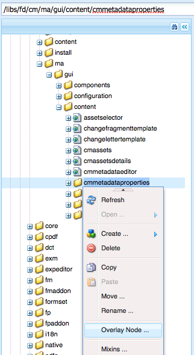
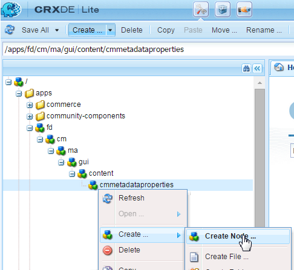

# Adicionar propriedades personalizadas aos ativos de Gerenciamento de correspondência{#add-custom-properties-to-correspondence-management-assets}

## Visão geral {#overview}

Você pode personalizar a interface do usuário do Gerenciamento de correspondência e apresentar aos usuários um conjunto personalizado de propriedades e guias. Essa personalização inclui a adição de campos/propriedades e guias personalizados a tipos/letras de ativos específicos ou a todos os tipos de ativos e letras.

## Adicionar propriedades personalizadas aos ativos de Gerenciamento de correspondência {#adding-custom-properties-to-correspondence-management-assets}

Os seguintes cenários mostram como adicionar propriedades/guias aos ativos e cartas do Gerenciamento de correspondência:

* Adicionar uma propriedade comum a todos os tipos de ativos
* Adicionar uma guia comum a todos os tipos de ativos
* Adicionar propriedades personalizadas a tipos de ativos específicos

Ajustando as propriedades, os caminhos e os valores nesses cenários, é possível adicionar propriedades e guias personalizadas a um conjunto diferente de ativos de acordo com suas necessidades.

### Cenário: Adicionar um campo comum (propriedade) a todos os tipos de ativos {#scenario-adding-a-common-field-property-to-all-the-asset-types}

Este cenário mostra como você pode adicionar uma propriedade personalizada a todos os tipos de ativos (texto, lista, condição e fragmentos de layout) e as letras. Usando esse cenário, você pode adicionar uma propriedade, Local de recipients, a todos os ativos e cartas. A propriedade Location of recipients ajuda a identificar a área geográfica do delivery em que um ativo ou letra é relevante.

>[!NOTE]
>
>Se você já tiver adicionado uma propriedade personalizada, a propriedade começará a aparecer na página de criação do ativo. Para ocultar essa propriedade, consulte Mostrar/Ocultar propriedades personalizadas nas páginas Criação e Propriedades de ativos .


Complete as etapas a seguir para adicionar uma propriedade personalizada a todos os tipos de ativos e letras:

1. Ir para `https://'[server]:[port]'/[ContextPath]/crx/de` e faça logon como Administrador.
1. Na pasta apps , crie uma pasta chamada css com caminho/estrutura semelhante à pasta css (localizada na pasta ccrui) usando as seguintes etapas:

   1. Clique com o botão direito do mouse na pasta de itens no seguinte caminho e selecione **Nó de sobreposição**:

      `/libs/fd/cm/ma/gui/content/cmmetadataproperties/commonproperties/col1/items`

      

   1. Certifique-se de que a caixa de diálogo Sobrepor nó tenha os seguintes valores:

      **Caminho:** /libs/fd/cm/ma/gui/content/cmmetadataproperties/common properties/col1/items

      **Localização:** /apps/

      **Corresponder tipos de nó:** Selecionado

      

   1. Clique em **OK**. A estrutura de pastas é criada na pasta de aplicativos.

   1. Clique em **Salvar tudo**.

1. Na pasta de itens recém-criados, adicione um nó para a propriedade personalizada em todo o ativo (Exemplo: GeoLocation) usando as seguintes etapas:

   1. Clique com o botão direito do mouse na pasta de itens e selecione **Criar** > **Criar nó**.

      

   1. Certifique-se de que a caixa de diálogo Criar nó tenha os seguintes valores e clique em **OK**:

      **Nome:** GeoLocation (ou o nome que deseja dar a essa propriedade)

      **Tipo:** nt:unstructured

      

   1. Clique no novo nó que você criou (aqui GeoLocation). O CRX exibe as propriedades do nó.
   1. Adicione as seguintes propriedades ao nó (aqui GeoLocation):

      | **Nome** | **Tipo** | **Valor** |
      |---|---|---|
      | fieldLabel | Sequência de caracteres | O nome que você deseja dar ao campo/propriedade. (Aqui: Localização dos recipients) |
      | name | Sequência de caracteres | `./extendedproperties/GeoLocation` (Mantenha o valor igual ao nome do campo que você criou no nó itens) |
      | renderReadOnly | Booleano | verdadeiro |
      | sling:resourceType | Sequência de caracteres | `granite/ui/components/coral/foundation/form/textfield` |

   1. Clique em **Salvar tudo**.

1. Para exibir sua personalização, passe o mouse sobre um ativo (texto, lista, condição ou fragmento de layout) ou letra, clique em **Propriedades da exibição** e clique em **Editar**. O novo campo (Localização dos recipients) aparece na guia Basic nas propriedades do ativo/carta.

   >[!NOTE]
   >
   >Talvez seja necessário limpar o cache do navegador antes que a personalização apareça na interface do usuário.

   

   >[!NOTE]
   >
   >As propriedades comuns de todos os ativos adicionados aparecem na guia básica das propriedades do ativo. Por padrão, as propriedades comuns adicionadas para todos os ativos são exibidas na página de propriedades, bem como na página de criação do ativo. Para ocultar as propriedades comuns, é necessário <!--link to show / hide properties]-->.

### Cenário: Adicione o menu suspenso personalizado e valores a uma propriedade/campo personalizado {#scenario-add-custom-drop-down-and-values-to-a-custom-property-field}

Este cenário mostra como você pode adicionar uma propriedade personalizada a todos os tipos de ativos e adicionar valores suspensos a ela.

1. Clique com o botão direito do mouse na pasta de itens no seguinte caminho e selecione **Nó de sobreposição**:

   `/libs/fd/cm/ma/gui/content/cmmetadataproperties/commonproperties/col1/items`

1. No nó de sobreposição recém-criado (/apps/fd/cm/ma/gui/content/cmmetadataproperties/common properties/col1/items), crie um nó para cada uma das propriedades (campos) para as quais você precisa criar uma lista suspensa (aqui `geographicallocation`) do tipo nt:unstructured.
1. Adicione as seguintes propriedades ao nó (aqui geograficamente, alocação) e clique em **Salvar tudo**:

   <table>
   <tbody>
   <tr>
      <td><strong>Nome</strong></td>
      <td><strong>Tipo</strong></td>
      <td><strong>Valor</strong></td>
   </tr>
   <tr>
      <td>fieldLabel</td>
      <td>Sequência de caracteres</td>
      <td>O nome que você deseja dar ao campo/propriedade. (Aqui: geaphicallocate)</td>
   </tr>
   <tr>
      <td>name</td>
      <td>Sequência de caracteres</td>
      <td>./extendedproperties/geaphicallocate (Mantenha o valor igual ao nome do campo que você criou no nó itens)</td>
   </tr>
   <tr>
      <td>renderReadOnly</td>
      <td>Booleano</td>
      <td>verdadeiro</td>
   </tr>
   <tr>
      <td>sling:resourceType</td>
      <td>Sequência de caracteres</td>
      <td>granite/ui/components/coral/foundation/form/select<br /> </td>
   </tr>
   </tbody>
   </table>

1. Em nó de propriedade (aqui geographicallocate), adicione um novo nó com nome `items`. No nó items , adicione um nó cada para os valores no menu suspenso . Como uma boa prática, adicione o primeiro nó como em branco para servir como o valor padrão da lista suspensa e uma opção para o usuário especificar nenhum valor para o campo. Para adicionar várias opções/valores suspensos, repita as seguintes etapas:

   1. Clique com o botão direito do mouse no nó da propriedade (aqui geograficamente, alocação) e selecione **Criar** > **Criar nó**.
   1. Insira o nome do campo como `item1,` manter tipo como nt:unstructured e clicar **OK**.
   1. Adicione as seguintes propriedades ao nó recém-criado (aqui item1) e clique em **Salvar tudo**:

      <table>
         <tbody>
         <tr>
          <td><strong>Nome</strong></td>
          <td><strong>Tipo</strong></td>
          <td><strong>Valor</strong></td>
         </tr>
         <tr>
          <td>text</td>
          <td>Sequência de caracteres</td>
          <td>Esse é o valor da opção suspensa que está visível para o usuário. Mantenha em branco para o valor em branco (padrão) ou insira o valor, como <strong>Internacional</strong> ou <strong>Dentro dos EUA</strong>.<br /> </td>
         </tr>
         <tr>
          <td>valor</td>
          <td>Sequência de caracteres</td>
          <td>Valor armazenado no CRXDE para o texto. Insira qualquer palavra-chave exclusiva. <br /> </td>
         </tr>
         </tbody>
   </table>

   

O menu suspenso personalizado aparece como o seguinte nas propriedades do ativo:


### Cenário: Guia Comum para todos os tipos de ativos {#scenario-common-tab-for-all-asset-types}

Este cenário mostra como adicionar uma guia personalizada, Recipients, a todos os tipos de ativos (texto, lista, condição e fragmentos de layout) e as letras. A guia Recipients é onde você pode planejar colocar todas as suas propriedades personalizadas relevantes aos recipients.


Usando o procedimento a seguir, é possível adicionar uma guia com um campo a todos os ativos:

1. Ir para `https://'[server]:[port]'/[ContextPath]/crx/de` e faça logon como Administrador.
1. Na pasta apps , crie uma pasta chamada cmmetadataproperties com caminho/estrutura semelhante à pasta cmmetadataproperties (localizada na pasta de conteúdo) usando as seguintes etapas:

   1. Clique com o botão direito do mouse na pasta cmmetadataproperties no seguinte caminho e selecione **Nó de sobreposição**:

      `/libs/fd/cm/ma/gui/content/cmmetadataproperties`

      

   1. Certifique-se de que a caixa de diálogo Sobrepor nó tenha os seguintes valores:

      **Caminho:** /libs/fd/cm/ma/gui/content/cmmetadataproperties

      **Localização:** /apps/

      **Corresponder tipos de nó:** Selecionado

   1. Clique em **OK**. A estrutura de pastas é criada na pasta de aplicativos.

      

      Clique em **Salvar tudo**.

1. Na pasta cmmetadataproperties , adicione um nó para criar uma guia personalizada para todos os ativos (Exemplo: commontab) utilizando as seguintes etapas:

   1. Clique com o botão direito do mouse na pasta cmmetadataproperties e selecione **Criar** > **Criar nó**.

      

   1. Certifique-se de que a caixa de diálogo Criar nó tenha os seguintes valores e clique em **OK**:

      **Nome:** commontab (ou o nome que deseja dar a esta propriedade)

      **Tipo:** nt:unstructured

   1. Clique no novo nó que você criou (aqui commontab). O CRX exibe as propriedades do nó.
   1. Adicione as seguintes propriedades ao nó (aqui commontab):

      <table>
         <tbody>
         <tr>
          <td><strong>Nome</strong></td>
          <td><strong>Tipo</strong></td>
          <td><strong>Valor</strong></td>
         </tr>
         <tr>
          <td>jcr:title</td>
          <td>Sequência de caracteres</td>
          <td>O nome que você deseja dar à coluna. (Aqui: Recipients)</td>
         </tr>
         <tr>
          <td>sling:resourceType</td>
          <td>Sequência de caracteres</td>
          <td>granite/ui/components/coral/foundation/container<br /> </td>
   </tr>
         </tbody>
       </table>

   1. Clique em **Salvar tudo**.

1. Para o nó da guia criado na última etapa (aqui commontab), crie um nó chamado item usando a seguinte etapa:

   1. Clique com o botão direito do mouse no nó relevante (aqui commontab) e selecione **Criar** > **Criar nó**.
   1. Certifique-se de que a caixa de diálogo Criar nó tenha os seguintes valores e clique em **OK**:

      **Nome:** items

      **Tipo:** nt:unstructured

   1. Clique em **Salvar tudo:**

1. No nó itens criado na etapa anterior (em commontab), adicione um nó para criar uma coluna (aqui Coluna1) na guia personalizada (commontab) usando as seguintes etapas (para adicionar mais colunas, repita essa etapa):

   1. Clique com o botão direito do mouse no nó items e selecione **Criar** > **Criar nó**.
   1. Certifique-se de que a caixa de diálogo Criar nó tenha os seguintes valores e clique em **OK**:

      **Nome:** Coluna1 (Ou o nome que deseja dar ao nó - esse nome não aparece na Interface do usuário.)

      **Tipo:** nt:unstructured

   1. Adicione a seguinte propriedade ao nó (Aqui, Coluna1) e clique em **Salvar tudo**:

      <table>
         <tbody>
         <tr>
           <td><strong>Nome</strong></td>
           <td><strong>Tipo</strong></td>
           <td><strong>Valor</strong></td>
         </tr>
         <tr>
           <td>sling:resourceType</td>
           <td>Sequência de caracteres</td>
           <td>granite/ui/components/coral/foundation/container<br /> </td>
         </tr>
         </tbody>
       </table>

1. No nó criado na etapa anterior (aqui, Coluna1), adicione um nó chamado itens usando as seguintes etapas:

   1. Clique com o botão direito do mouse no nó (aqui, Coluna1) e selecione **Criar** > **Criar nó**.
   1. Certifique-se de que a caixa de diálogo Criar nó tenha os seguintes valores e clique em **OK**:

      **Nome:** items

      **Tipo:** nt:unstructured

   1. Clique em **Salvar tudo**.

1. Para criar um campo na guia personalizada (aqui, Recipients), adicione um nó (aqui GeographicLocation). Essa propriedade corresponde à coluna criada. Use as etapas a seguir para criar o campo (para criar mais campos/nós, repita essas etapas).:

   1. Clique com o botão direito do mouse no nó items e selecione **Criar** > **Criar nó**.
   1. Certifique-se de que a caixa de diálogo Criar nó tenha os seguintes valores e clique em **OK**:

      **Nome:** GeográficoLocation (ou outro nome para a propriedade field)

      **Tipo:** nt:unstructured

   1. Adicione as seguintes propriedades ao nó de campo (aqui, GeografiasLocation) e clique em **Salvar tudo**.

      | **Nome** | **Tipo** | **Valor** |
      |---|---|---|
      | fieldLabel | Sequência de caracteres | Localização dos recipients (ou o nome que deseja dar ao campo). |
      | name | Sequência de caracteres | ./extendedproperties/GeographicLocation |
      | renderReadOnly | Booleano | verdadeiro |
      | sling:resourceType | Sequência de caracteres | `/libs/granite/ui/components/coral/foundation/form/textfield` |

1. Para adicionar essa guia para Cartas, crie uma pasta de sobreposição com caminho/estrutura semelhante à seguinte pasta de itens no seguinte caminho:

   `/libs/fd/cm/ma/gui/content/cmmetadataproperties/properties/letter/items/tabs/items`

   Para criar sobreposição para cartas ou um ativo diferente, use o seguinte caminho ao substituir [assettype] com texto, condição, lista, dicionário de dados ou fragmento:

   `/libs/fd/cm/ma/gui/content/cmmetadataproperties/properties/[assettype]/items/tabs/items`

   1. Clique com o botão direito do mouse na pasta de itens no seguinte caminho e selecione **Nó de sobreposição**:

      `/libs/fd/cm/ma/gui/content/cmmetadataproperties/properties/letter/items/tabs/items`

   1. Certifique-se de que a caixa de diálogo Sobrepor nó tenha os seguintes valores:

      **Caminho:** `/libs/fd/cm/ma/gui/content/cmmetadataproperties/properties/letter/items/tabs/items`

      **Localização:** /apps/

      **Corresponder tipos de nó:** Selecionado

   1. Clique em **OK**. A pasta é criada. Clique em **Salvar tudo**.

1. Na pasta de itens recém-criados, adicione um nó para a guia personalizada no ativo (aqui mytab - esse nome não aparece na Interface do usuário) usando as seguintes etapas:

   1. Clique com o botão direito do mouse na pasta de itens e selecione **Criar** > **Criar nó**.
   1. Certifique-se de que a caixa de diálogo Criar nó tenha os seguintes valores e clique em **OK**:

      **Nome:** mytab (ou o nome que deseja dar a essa propriedade)

      **Tipo:** nt:unstructured

   1. Clique no novo nó que você criou (aqui, mytab). O CRX exibe as propriedades do nó.
   1. Adicione as duas propriedades a seguir ao nó (aqui, guia custom:

      <table>
         <tbody>
         <tr>
           <td><strong>Nome</strong></td>
           <td><strong>Tipo</strong></td>
           <td><strong>Valor</strong></td>
         </tr>
         <tr>
           <td>path<br /> </td>
           <td>Sequência de caracteres</td>
           <td>fd/cm/ma/gui/content/cmmetadataproperties/commontab<br /> </td>
         </tr>
         <tr>
           <td>sling:resourceType</td>
           <td>Sequência de caracteres</td>
           <td>granite/ui/components/coral/foundation/include<br /> </td>
         </tr>
         </tbody>
       </table>

   1. Clique em **Salvar tudo**.

1. Para visualizar sua personalização, passe o mouse sobre o ativo relevante (aqui uma carta), clique em Exibir propriedades e clique em **Editar**. A nova guia (Recipients) e o campo (Location of Recipients) aparecem na interface do usuário.

   >[!NOTE]
   >
   >Talvez seja necessário limpar o cache do navegador antes que a personalização apareça na interface do usuário.

   

### Cenário: Adicionar propriedades personalizadas para tipos de ativos específicos {#scenario-adding-custom-properties-for-specific-asset-types}

Este cenário mostra como você pode adicionar uma propriedade a um tipo de ativo específico, como um campo para todos os ativos de texto. Com esse processo, você pode adicionar propriedades a um dos seguintes:

* Texto
* Condição
* Lista
* Fragmento do layout
* Dicionários de dados
* Carta

Por exemplo, somente para os ativos de texto, é necessário adicionar uma propriedade, Location of recipients, para identificar a área geográfica à qual um ativo é relevante.  

Para adicionar uma propriedade a um tipo de ativo, conclua as seguintes etapas:

1. Ir para `https://'[server]:[port]'/[ContextPath]/crx/de` e faça logon como Administrador.
1. Para criar uma guia em um tipo de ativo (como Texto), crie a seguinte estrutura de pastas na pasta de aplicativos:

   `/libs/fd/cm/ma/gui/content/cmmetadataproperties/properties/[AssetType]/items/tabs/items`

   [AssetType] = texto, condição, lista, letra, dicionário de dados ou fragmento

   Veja a seguir as etapas para criar essa estrutura de pastas:

   1. Clique com o botão direito do mouse na pasta de itens no seguinte caminho e selecione **Nó de sobreposição**:

      `/libs/fd/cm/ma/gui/content/cmmetadataproperties/properties/[AssetType]/items/tabs/items`

      Por exemplo, se você quiser criar uma propriedade para ativos de texto, selecione a seguinte pasta:

      `/libs/fd/cm/ma/gui/content/cmmetadataproperties/properties/text/items/tabs/items`

      

   1. Certifique-se de que a caixa de diálogo Sobrepor nó tenha os seguintes valores:

      **Caminho:** /libs/fd/cm/ma/gui/content/cmmetadataproperties/properties/[AssetType]/itens/guias/itens

      **Localização:** /apps/

      **Corresponder tipos de nó:** Selecionado

   1. Clique em **OK**. A estrutura de pastas é criada na pasta de aplicativos.

      Clique em **Salvar tudo**.

1. Na pasta de itens recém-criados, adicione um nó para a guia personalizada no ativo (Exemplo: customtab) usando as seguintes etapas:

   1. Clique com o botão direito do mouse na pasta de itens e selecione **Criar** > **Criar nó**.
   1. Certifique-se de que a caixa de diálogo Criar nó tenha os seguintes valores e clique em **OK**:

      **Nome:** customtab (ou o nome que você deseja dar a essa propriedade)

      **Tipo:** nt:unstructured

   1. Clique no novo nó que você criou (aqui, guia personalizar). O CRX exibe as propriedades do nó.
   1. Adicione as duas propriedades a seguir ao nó (aqui, guia custom:

      | **Nome** | **Tipo** | **Valor** |
      |---|---|---|
      | sling:resourceType | Sequência de caracteres | granite/ui/components/coral/foundation/container |
      | jcr:title | Sequência de caracteres | O nome do campo na Interface do usuário (aqui, guia Minha) |

   1. Clique em **Salvar tudo**.

1. No nó criado na etapa anterior (aqui, guia custom), adicione um nó chamado itens usando as seguintes etapas:

   1. Clique com o botão direito do mouse no nó (aqui, guia personalizada) e selecione **Criar** > **Criar nó**.
   1. Certifique-se de que a caixa de diálogo Criar nó tenha os seguintes valores e clique em **OK**:

      **Nome:** items

      **Tipo:** nt:unstructured

   1. Clique em **Salvar tudo**.

1. No nó itens criado na etapa anterior (em customtab), adicione um nó para criar uma coluna (aqui Column1) na guia personalizada usando as seguintes etapas (para adicionar mais colunas, repita esta etapa):

   1. Clique com o botão direito do mouse no nó items e selecione **Criar** > **Criar nó**.
   1. Certifique-se de que a caixa de diálogo Criar nó tenha os seguintes valores e clique em **OK**:

      **Nome:** Coluna1 (ou o nome que deseja dar ao nó)

      **Tipo:** nt:unstructured

   1. Adicione a seguinte propriedade ao nó (Aqui, Coluna1) e clique em **Salvar tudo**.

      <table>
         <tbody>
         <tr>
           <td><strong>Nome</strong></td>
           <td><strong>Tipo</strong></td>
           <td><strong>Valor</strong></td>
         </tr>
         <tr>
           <td>sling:resourceType</td>
           <td>Sequência de caracteres</td>
           <td>granite/ui/components/coral/foundation/container<br /> </td>
         </tr>
         </tbody>
       </table>

1. Para cada coluna criada (conforme especificado na etapa anterior - aqui, Coluna1), crie um nó chamado item usando as seguintes etapas:

   1. Clique com o botão direito do mouse no nó de coluna relevante (aqui, Coluna1) e selecione **Criar** > **Criar nó**.
   1. Certifique-se de que a caixa de diálogo Criar nó tenha os seguintes valores e clique em **OK**:

      **Nome:** items

      **Tipo:** nt:unstructured

   1. Clique em **Salvar tudo:**

1. Para cada uma das colunas criadas, crie um nó no nó items para criar um campo na nova guia na Interface do usuário. Repita essa etapa para criar mais campos na coluna :

   1. Clique com o botão direito do mouse no nó relevante (aqui, itens em Coluna1) e selecione **Criar** > **Criar nó**.
   1. Certifique-se de que a caixa de diálogo Criar nó tenha os seguintes valores e clique em **OK**:

      **Nome:** Um nome de sua escolha (aqui GeoLocation)

      **Tipo:** nt:unstructured

   1. Adicione as seguintes propriedades ao nó e clique em **Salvar tudo**.

      | **Nome** | **Tipo** | **Valor** |
      |---|---|---|
      | fieldLabel | Sequência de caracteres | Localização dos recipients (ou o nome que deseja dar ao campo). |
      | name | Sequência de caracteres | `./extendedproperties/GeoLocation` |
      | renderReadOnly | Booleano | verdadeiro |
      | sling:resourceType | Sequência de caracteres | granite/ui/components/coral/foundation/form/textfield |

1. Para visualizar sua personalização, passe o mouse sobre o ativo relevante (aqui um texto), clique em Exibir propriedades e clique em **Editar**. A nova guia e o campo (Localização dos destinatários) aparecem na interface do usuário.

   >[!NOTE]
   >
   >Talvez seja necessário limpar o cache do navegador antes que a personalização apareça na interface do usuário.

   

### Exibir propriedades personalizadas na página Criação de ativos {#display-custom-properties-on-the-asset-creation-page}

Por padrão, as propriedades personalizadas adicionadas às novas guias ficam visíveis apenas na página de propriedades e não na página de criação de ativos, pois a página de criação de ativos não tem layout de guia. Para exibir as propriedades personalizadas na página de criação do ativo junto com outras propriedades, é necessário fazer o seguinte:

1. Clique com o botão direito do mouse na pasta de itens no seguinte caminho e selecione **Nó de sobreposição**:

   `/libs/fd/cm/ma/gui/content/createasset/createletter/jcr:content/body/items/form/items/letterWizard/items/properties/items/properties/items/letterproperties/items`

1. Certifique-se de que a caixa de diálogo Sobrepor nó tenha os seguintes valores, por letra. Para outros tipos de ativos, o caminho é fornecido na tabela a seguir:

   **Caminho:** /libs/fd/cm/ma/gui/content/createasset/createletter/jcr:content/body/items/form/items/letterWizard/items/properties/items/items/letterproperties/items

   **Localização:** /apps/

   **Corresponder tipos de nó:** Selecionado

   Dependendo do tipo de ativo, o seguinte precisa ser o caminho:

   | **Tipo de ativo/documento** | **Caminho a ser adicionado** |
   |---|---|
   | Texto | /libs/fd/cm/ma/gui/content/createasset/createtext/jcr:content/body/items/form/items/textwizard/items/editproperties/items/tabs/items/tab1/items |
   | Lista | /libs/fd/cm/ma/gui/content/createasset/createlist/jcr:content/body/items/form/items/listwizard/items/editproperties/items/items/tabs/items/tab1/items |
   | Condição | /libs/fd/cm/ma/gui/content/createasset/creatcondition/jcr:content/body/items/form/items/conditionwizard/items/editproperties/items/items/tabs/items/tab1/items |
   | Fragmento | /libs/fd/cm/ma/gui/content/createasset/createfragment/jcr:content/body/items/form/items/fragmentwizard/items/properties/items/tabs2/items/tab1/items |
   | Carta | /libs/fd/cm/ma/gui/content/createasset/createletter/jcr:content/body/items/form/items/letterWizard/items/properties/items/items/letterproperties/items |

1. Clique em **OK**. A estrutura de pastas é criada na pasta de aplicativos.

1. No nó de itens de sobreposição criado, crie um nó com o nome col4 (ou qualquer outro nome) e clique em **Salvar tudo**.

   Por exemplo, a seguir está o nó de sobreposição criado para letras.

   `/apps/fd/cm/ma/gui/content/createasset/createletter/jcr:content/body/items/form/items/letterWizard/items/properties/items/properties/items/letterproperties/items`

1. Adicione as seguintes propriedades ao nó recém-criado (aqui col4) e clique em **Salvar tudo**:

<table>
 <tbody>
  <tr>
   <td><strong>Nome</strong></td>
   <td><strong>Tipo</strong></td>
   <td><strong>Valor</strong></td>
  </tr>
  <tr>
   <td>path</td>
   <td>Sequência de caracteres</td>
   <td><p>Esse caminho é o ponteiro para a coluna criada em:</p>
    <ul>
     <li>Para obter uma guia comum para todos os tipos de ativos: /apps/fd/cm/ma/gui/content/cmmetadataproperties/commontab/items/col1</li>
     <li>Para propriedades diferentes para tipos de ativos diferentes: /apps/fd/cm/ma/gui/content/cmmetadataproperties/properties/items/tabs/items/customtab/items/col1</li>
    </ul> </td>
  </tr>
  <tr>
   <td>sling:resourceType</td>
   <td>Sequência de caracteres</td>
   <td> granite/ui/components/coral/foundation/include<br /> </td>
  </tr>
 </tbody>
</table>


Propriedade personalizada, Idioma, que aparece na interface do usuário para criar uma carta

## Personalize a exibição de lista para mostrar propriedades personalizadas {#customize-the-list-view-to-show-custom-properties}

Após adicionar uma propriedade personalizada aos ativos de Gerenciamento de correspondência, é necessário fazer mais alterações no CRX/DE para garantir que a propriedade personalizada seja exibida na interface do usuário do Gerenciamento de correspondência.

Complete as etapas a seguir para exibir a propriedade personalizada na interface do usuário da lista de ativos do Gerenciamento de correspondência:

1. Ir para `https://'[server]:[port]'/[ContextPath]/crx/de` e faça logon como Administrador.
1. Crie a seguinte estrutura de pastas na pasta de aplicativos:

   `/libs/fd/cm/ma/gui/content/cmassets/jcr:content/views/lists/columns`

   Veja a seguir as etapas para criar essa estrutura de pastas:

   1. Clique com o botão direito do mouse na pasta de colunas no seguinte caminho e selecione **Nó de sobreposição**:

      `/libs/fd/cm/ma/gui/content/cmassets/jcr:content/views/lists/columns`

   1. Certifique-se de que a caixa de diálogo Sobrepor nó tenha os seguintes valores:

      **Caminho:** /libs/fd/cm/ma/gui/content/cmassets/jcr:content/views/lists/columns

      **Localização:** /apps/

      **Corresponder tipos de nó:** Selecionado

   1. Clique em **OK**. A estrutura de pastas é criada na pasta de aplicativos.

      Clique em **Salvar tudo**.

1. Para cada uma das propriedades criadas, crie um nó sob o nó columns para criar uma coluna na Interface do usuário. Repita esta etapa para criar mais colunas na interface do usuário:

   1. Clique com o botão direito do mouse no nó relevante (colunas) e selecione **Criar** > **Criar nó**.
   1. Certifique-se de que a caixa de diálogo Criar nó tenha os seguintes valores e clique em **OK**:

      **Nome:** Um nome de sua escolha (aqui, Localização Geográfica)

      **Tipo:** nt:unstructured

   1. Adicione as seguintes propriedades ao nó e clique em **Salvar tudo**.

      <table>
         <tbody>
         <tr>
           <td><strong>Nome</strong></td>
           <td><strong>Tipo</strong></td>
           <td><strong>Valor</strong></td>
         </tr>
         <tr>
           <td>jcr:primaryType</td>
           <td>Nome</td>
           <td><p>nt:unstructured</p> </td>
         </tr>
         <tr>
           <td>jcr:title</td>
           <td>Sequência de caracteres</td>
           <td><p>Localização geográfica</p> <p>Esse valor aparece como o cabeçalho da coluna na interface do usuário. </p> </td>
         </tr>
         <tr>
           <td>classificável</td>
           <td>Booleano</td>
           <td><p>verdadeiro</p> <p>Um valor true significa que o usuário pode classificar os valores nessa coluna. </p> </td>
         </tr>
         </tbody>
       </table>

1. Crie a seguinte estrutura de pastas na pasta de aplicativos:

   `/libs/fd/cm/ma/gui/components/admin/childpagerenderer/childlistpage`

   Veja a seguir as etapas para criar essa estrutura de pastas:

   1. Clique com o botão direito do mouse na pasta de colunas no seguinte caminho e selecione **Nó de sobreposição**:

      `/libs/fd/cm/ma/gui/components/admin/childpagerenderer/childlistpage`

   1. Certifique-se de que a caixa de diálogo Sobrepor nó tenha os seguintes valores:

      **Caminho:** /libs/fd/cm/ma/gui/components/admin/children pagerenderer/children listpage

      **Localização:** /apps/

      **Corresponder tipos de nó:** Selecionado

   1. Clique em **OK**. A estrutura de pastas é criada na pasta de aplicativos.

      Clique em **Salvar tudo**.

1. Copie o arquivo children listpage.jsp do seguinte local:

   /libs/fd/cm/ma/gui/components/admin/childpagerenderer/childlistpage/childlistpage.jsp

   Cole o arquivo no seguinte local:

   /apps//fd/cm/ma/gui/components/admin/children pagerenderer/children listpage/.

1. Abra o arquivo children listpage.jsp (/apps/fd/cm/ma/gui/components/admin/childpagerenderer/childlistpage/childlistpage.jsp) e faça as seguintes alterações:

   1. Adicione o seguinte à linha 19 do arquivo (após a declaração de direitos autorais).

      ```jsp
      <%@page import="java.util.Map"%>
      ```

   1. Adicione o seguinte código de uma função que obtém valor para cada propriedade personalizada ao final do arquivo:

      ```jsp
      <%!
          private String getCustomPropertyValue(Map<String, Object> extendedProperties, String propertyName) {
      
              String propertyValue = "";
              if (extendedProperties.containsKey(propertyName)) {
                  propertyValue = (String) extendedProperties.get(propertyName);
              }
      
              return propertyValue;
          }
      %>
      ```

   1. Adicione o seguinte antes de iniciar o &lt;tr> tag (&lt;tr attrs.build=&quot;&quot;>>):

      ```jsp
      <%
          String GeoLocation = "";
          if (asset != null) {
                  Map<String, Object> extendedProperties = asset.getExtendedProperties();
                  if (extendedProperties != null) {
                      GeoLocation = getCustomPropertyValue(extendedProperties,"GeoLocation");
                  }
          }
      %>
      ```

      No código, GeoLocation é o valor definido na propriedade name ao criar o nó/campo personalizado. Ao criar um nó/campo personalizado, você especificou o nome da propriedade com ./extendedproperties/ prefixo: ./extendedproperties/GeoLocation. No código, o prefixo não é necessário.

   1. Para exibir a nova propriedade na interface do usuário, adicione uma tag TD como a seguir antes de fechar a trilha (&lt;/tr>):

      ```jsp
      <td is="coral-td" value="<%= xssAPI.encodeForHTMLAttr(geographicalLocation) %>"><%= xssAPI.encodeForHTML(geographicalLocation) %></td>
      ```

      Para adicionar mais colunas, repita as etapas 6.3 e 6.4.

   1. Clique em **Salvar tudo**.

1. Para exibir sua personalização, abra a exibição em lista de fragmentos de documento ou letras em que você adicionou a propriedade personalizada.

   A coluna da interface do usuário e a propriedade adicionada neste procedimento são exibidas para todos os tipos de ativos. No entanto, os valores nessas propriedades podem ser inseridos e exibidos somente para os tipos de ativos para os quais você adicionou originalmente a propriedade personalizada.

   Por exemplo, usando o Cenário: Ao adicionar propriedades personalizadas para tipos de ativos específicos, você adiciona uma propriedade personalizada a ativos de texto, é possível inserir propriedades personalizadas somente a ativos de texto. No entanto, se você exibir essa propriedade personalizada na interface do usuário, a coluna será exibida para todos os tipos de ativos.

   

1. (Opcional) Por padrão, a nova coluna aparece como a última coluna na interface do usuário do . Para fazer com que a coluna apareça em uma posição específica, adicione a seguinte propriedade ao nó da coluna:

<table>
 <tbody>
  <tr>
   <td><strong>Nome</strong></td>
   <td><strong>Tipo</strong></td>
   <td><strong>Valor</strong></td>
  </tr>
  <tr>
   <td>sling:orderBefore</td>
   <td>Sequência de caracteres</td>
   <td><p>O nome do nó da coluna no caminho "/libs/fd/cm/ma/gui/content/cmassets/jcr:content/views/list/columns" antes do qual a coluna personalizada precisa aparecer na interface do usuário.</p> <p>Aqui, se você quiser que a coluna Localização geográfica apareça antes (à esquerda da) da coluna Versão , adicione o nó da propriedade sling:orderBefore to GeoLocation no caminho ""/apps/fd/cm/ma/gui/content/cmassets/jcr:content/views/list/columns/GeoLocation" e defina o valor da propriedade como version.</p> </td>
  </tr>
 </tbody>
</table>

Ao adicionar a propriedade sling:orderBefore para especificar o local da coluna, você também precisa atualizar a ordem do valor correspondente &lt;td> a tag especificada na etapa 6.4 deste procedimento. Por exemplo, nesse caso, é necessário garantir que a variável &lt;td> A tag da Localização Geográfica é colocada antes de &lt;td> tag da coluna Version :

```xml
<td is="coral-td" value="<%= xssAPI.encodeForHTMLAttr(geographicalLocation) %>"><%= xssAPI.encodeForHTML(geographicalLocation) %></td>
<td is="coral-td" value="<%= xssAPI.encodeForHTMLAttr(version) %>"><%= xssAPI.encodeForHTML(version) %></td>
```

## Habilitar pesquisa para propriedades personalizadas {#enable-search-for-custom-properties}

Por padrão, a pesquisa de texto completo não inclui propriedades personalizadas que você adiciona à interface do usuário usando o CRX/DE.

Para incluir as propriedades personalizadas na pesquisa, é necessário permitir a indexação de propriedades personalizadas.

Para permitir a indexação de propriedades personalizadas, conclua as seguintes etapas:

1. Ir para `https://'[server]:[port]'/[ContextPath]/crx/de` e faça logon como Administrador.
1. Ir para `/oak:index/cmLucene`e adicione um nó chamado **agregações** sob ele.

   1. Clique com o botão direito do mouse na pasta cmLucene e selecione **Criar** > **Criar nó**.
   1. Certifique-se de que a caixa de diálogo Criar nó tenha os seguintes valores e clique em **OK**:

      **Nome:** agregações

      **Tipo:** nt:unstructured

   1. Clique em **Salvar tudo**.

1. Na pasta agregações recém-criada, adicione um nó cm:resource. E em cm:resource, adicione um nó chamado include0.

   1. Clique com o botão direito do mouse na pasta agregações e selecione **Criar** > **Criar nó**. Certifique-se de que a caixa de diálogo Criar nó tenha os seguintes valores e clique em **OK**:

      **Nome:** cm:resource

      **Tipo:** nt:unstructured

   1. Clique com o botão direito do mouse na pasta cm:resource e selecione **Criar** > **Criar nó**. Certifique-se de que a caixa de diálogo Criar nó tenha os seguintes valores e clique em **OK**:

      **Nome:** incluir0

      **Tipo:** nt:unstructured

   1. Clique no novo nó que você criou (aqui inclua0). O CRX exibe as propriedades do nó.
   1. Adicione a seguinte propriedade ao nó (aqui inclua0):

      <table>
         <tbody>
         <tr>
           <td><strong>Nome</strong></td>
           <td><strong>Tipo</strong></td>
           <td><strong>Valor</strong></td>
         </tr>
         <tr>
           <td>path</td>
           <td>Sequência de caracteres</td>
           <td>extendedProperties<br /> </td>
         </tr>
         </tbody>
       </table>

   1. Clique em **Salvar tudo**.

1. Vá para as propriedades no seguinte local e adicione um local de nó sob ele: `/oak:index/cmLucene/indexRules/cm:resource/properties`

   Repita essa etapa para cada uma das propriedades personalizadas que deseja adicionar à pesquisa.

   1. Clique com o botão direito do mouse na pasta de propriedades e selecione **Criar** > **Criar nó**.
   1. Certifique-se de que a caixa de diálogo Criar nó tenha os seguintes valores e clique em **OK**:

      **Nome:** local (ou o nome da propriedade personalizada que deseja adicionar à pesquisa)

      **Tipo:** nt:unstructured

   1. Clique no novo nó que você criou (aqui, local). O CRX exibe as propriedades do nó.
   1. Adicione as seguintes propriedades ao nó (aqui, local):

      | **Nome** | **Tipo** | **Valor** |
      |---|---|---|
      | analisado | Sequência de caracteres | verdadeiro |
      | name | Sequência de caracteres | extendedProperties/location (ou o nome da propriedade que deseja adicionar à pesquisa) |
      | propertyIndex | Booleano | verdadeiro |
      | useInSuggest | Booleano | verdadeiro |

   1. Clique em **Salvar tudo**.

1. Agora é possível usar valores de propriedade personalizados na pesquisa de texto completo para localizar ativos relevantes.

>[!NOTE]
>
>Se você ainda não conseguir pesquisar, pode ser por causa de um problema de indexação. Para reindexação, vá para o seguinte nó e altere o valor da propriedade &quot;re-index&quot; para true:
>
>/oak:index/cmLucene&quot; e alterar o valor da propriedade

## Alterar exibição padrão da página de pesquisa {#change-default-view-of-the-search-page}

1. Ir para `https://'[server]:[port]'/[ContextPath]/crx/de` e faça logon como Administrador.
1. Na pasta apps , crie uma pasta denominada list com caminho/estrutura semelhante à pasta de lista localizada em /libs/granite/ui/content/shell/omnisearch/searchresults/singleresults/views:

   1. Clique com o botão direito do mouse na pasta de itens no seguinte caminho e selecione **Nó de sobreposição**:

      `/libs/granite/ui/content/shell/omnisearch/searchresults/singleresults/views/list`

   1. Certifique-se de que a caixa de diálogo Sobrepor nó tenha os seguintes valores:

      **Caminho:** /libs/granite/ui/content/shell/omnisearch/searchresults/singleresults/views/list

      **Localização:** /apps/

      **Corresponder tipos de nó:** Selecionado

   1. Clique em **OK**. A estrutura de pastas é criada na pasta de aplicativos.

   1. Clique em **Salvar tudo**.

1. No nó recém-criado, adicione a seguinte propriedade e clique em **Salvar tudo**:

   <table>
   <tbody>
   <tr>
      <td><strong>Nome</strong></td>
      <td><strong>Tipo</strong></td>
      <td><strong>Valor</strong></td>
   </tr>
   <tr>
      <td>sling:orderBefore<br /> </td>
      <td>Sequência de caracteres</td>
      <td>cartão</td>
   </tr>
   </tbody>
   </table>

1. A personalização mostra os resultados da pesquisa na Visualização de lista de todos os consoles, incluindo Forms e Documentos, Ativos e Sites.

## Alterar a exibição padrão da página de ativos {#change-default-view-of-the-assets-page}

>[!NOTE]
>
>Essas etapas alteram a visualização padrão de todos os consoles, como Forms e Documentos, Ativos e Sites.

1. Ir para `https://'[server]:[port]'/[ContextPath]/crx/de` e faça logon como Administrador.
1. Na pasta apps , crie uma pasta denominada list com caminho/estrutura semelhante à pasta de lista localizada em:

   /libs/fd/cm/ma/gui/content/cmassets/jcr:content/views/

   1. Clique com o botão direito do mouse na pasta de itens no seguinte caminho e selecione **Nó de sobreposição**:

      `/libs/fd/cm/ma/gui/content/cmassets/jcr:content/views/list`

   1. Certifique-se de que a caixa de diálogo Sobrepor nó tenha os seguintes valores:

      **Caminho:** /libs/fd/cm/ma/gui/content/cmassets/jcr:content/views/list

      **Localização:** /apps/

      **Corresponder tipos de nó:** Selecionado

   1. Clique em **OK**. A estrutura de pastas é criada na pasta de aplicativos.

   1. Clique em **Salvar tudo**.

1. No nó recém-criado, adicione a seguinte propriedade e clique em **Salvar tudo**:

   <table>
   <tbody>
   <tr>
      <td><strong>Nome</strong></td>
      <td><strong>Tipo</strong></td>
      <td><strong>Valor</strong></td>
   </tr>
   <tr>
      <td>sling:orderBefore<br /> </td>
      <td>Sequência de caracteres</td>
      <td>cartão</td>
   </tr>
   </tbody>
   </table>

1. Limpe os cookies do navegador ou use o modo incógnito do seu navegador para visualizar os ativos. A página de ativos, por padrão, aparece no layout do cartão.

## Mostrar/ocultar propriedades personalizadas nas páginas Criação de ativos e Propriedades {#show-hide-custom-properties-on-asset-creation-and-properties-pages}

Para mostrar ou ocultar as propriedades personalizadas, conclua as seguintes etapas:

1. No nó de propriedade personalizada, como geographicallocate, crie um novo nó com o nome &quot;granite:rendercondition&quot; do tipo &quot;nt:unstructured&quot;.
1. Adicione a seguinte propriedade ao nó e clique em **Salvar tudo**:

   <table>
   <tbody>
   <tr>
      <td><strong>Nome</strong></td>
      <td><strong>Tipo</strong></td>
      <td><strong>Valor</strong></td>
   </tr>
   <tr>
      <td>sling:resourceType<br /> </td>
      <td>Sequência de caracteres</td>
      <td>fd/cm/ma/gui/components/admin/assetsproperties/custompropertyconfig<br /> </td>
   </tr>
   </tbody>
   </table>

1. Para ocultar essa propriedade na página de criação do ativo, adicione a seguinte propriedade a ela e clique em **Salvar tudo**:

   <table>
   <tbody>
   <tr>
      <td><strong>Nome</strong></td>
      <td><strong>Tipo</strong></td>
      <td><strong>Valor</strong></td>
   </tr>
   <tr>
      <td>hideOnCreate<br /> </td>
      <td>Booleano</td>
      <td>verdadeiro<br /> </td>
   </tr>
   </tbody>
   </table>

1. Para ocultar a propriedade personalizada na página de propriedades dos ativos, adicione a seguinte propriedade a ela e clique em **Salvar tudo**:

   <table>
   <tbody>
   <tr>
      <td><strong>Nome</strong></td>
      <td><strong>Tipo</strong></td>
      <td><strong>Valor</strong></td>
   </tr>
   <tr>
      <td>hideOnEdit<br /> </td>
      <td>Booleano</td>
      <td>verdadeiro<br /> </td>
   </tr>
   </tbody>
   </table>

   Para exibir os valores novamente, redefina os valores de propriedade para `false` ou exclua as entradas de propriedade.
