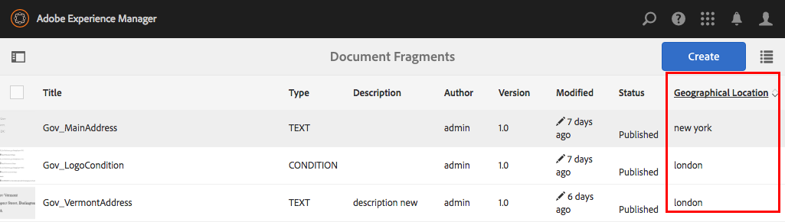

# Adicionar propriedades personalizadas aos ativos do Gerenciamento de correspondência{#add-custom-properties-to-correspondence-management-assets}

## Visão geral {#overview}

É possível personalizar a interface do usuário do Gerenciamento de correspondências e apresentar aos usuários um conjunto personalizado de propriedades e guias. Essa personalização inclui a adição de campos/propriedades personalizados e guias a tipos/cartas de ativos específicos para todos os tipos e cartas de ativos.

## Adicionar propriedades personalizadas aos ativos do Gerenciamento de correspondência {#adding-custom-properties-to-correspondence-management-assets}

Os cenários a seguir mostram como você pode adicionar propriedades/guias aos ativos e cartas do Gerenciamento de correspondências:

* Adicionar uma propriedade comum a todos os tipos de ativos
* Adicionar uma guia comum a todos os tipos de ativos
* Adição de propriedades personalizadas a tipos de ativos específicos

Ao ajustar as propriedades, os caminhos e os valores nesses cenários, é possível adicionar propriedades e guias personalizadas a um conjunto diferente de ativos de acordo com suas necessidades.

### Cenário: adição de um campo comum (propriedade) a todos os tipos de ativos {#scenario-adding-a-common-field-property-to-all-the-asset-types}

Esse cenário mostra como adicionar uma propriedade personalizada a todos os tipos de ativos (texto, lista, condição e fragmentos de layout) e letras. Usando esse cenário, você pode adicionar uma propriedade, Location of recipients, a todos os ativos e cartas. A propriedade Location of recipients ajuda a identificar a área geográfica de entrega para a qual um ativo ou carta é relevante.

>[!NOTE]
>
>Se você já tiver adicionado uma propriedade personalizada, a propriedade começará a aparecer na página de criação do ativo. Para ocultar essa propriedade, consulte as páginas Mostrar/Ocultar propriedades personalizadas na criação de ativos e propriedades.


Conclua as etapas a seguir para adicionar uma propriedade personalizada a todos os tipos de ativos e cartas:

1. Vá para `https://'[server]:[port]'/[ContextPath]/crx/de` e faça logon como Administrador.
1. Na pasta apps, crie uma pasta chamada css com caminho/estrutura semelhante à pasta css (na pasta ccrui) usando as seguintes etapas:

   1. Clique com o botão direito do mouse na pasta de itens no seguinte caminho e selecione **Sobrepor Nó**:

      `/libs/fd/cm/ma/gui/content/cmmetadataproperties/commonproperties/col1/items`

      

   1. Certifique-se de que a caixa de diálogo Sobrepor nó tenha os seguintes valores:

      **Caminho:** /libs/fd/cm/ma/gui/content/cmmetadataproperties/commonproperties/col1/items

      **Local:** /apps/

      **Corresponder Tipos De Nó:** Selecionados

      

   1. Clique em **OK**. A estrutura de pastas é criada na pasta de aplicativos.

   1. Clique em **Salvar tudo**.

1. Na pasta de itens recém-criados, adicione um nó para a propriedade personalizada em todo o ativo (Exemplo: Geolocalização) usando as seguintes etapas:

   1. Clique com o botão direito na pasta de itens e selecione **Criar** > **Criar Nó**.

      

   1. Certifique-se de que a caixa de diálogo Criar Nó tenha os seguintes valores e clique em **OK**:

      **Nome:** Geolocalização (ou o nome que você deseja dar a esta propriedade)

      **Tipo:** nt:não estruturado

      

   1. Clique no novo nó criado (aqui Geolocalização). O CRX exibe as propriedades do nó.
   1. Adicione as seguintes propriedades ao nó (aqui GeoLocation):

      | **Nome** | **Tipo** | **Valor** |
      |---|---|---|
      | fieldLabel | String | O nome que você deseja dar ao campo/propriedade. (Aqui: Local dos destinatários) |
      | name | String | `./extendedproperties/GeoLocation` (Mantenha o valor igual ao nome do campo criado no nó de itens) |
      | renderReadOnly | Booleano | verdadeiro |
      | sling:resourceType | String | `granite/ui/components/coral/foundation/form/textfield` |

   1. Clique em **Salvar tudo**.

1. Para exibir sua personalização, passe o mouse sobre um ativo (texto, lista, condição ou fragmento de layout) ou uma carta, clique em **Exibir Propriedades** e em **Editar**. O novo campo (Local dos destinatários) aparece na guia Básico nas propriedades do ativo/carta.

   >[!NOTE]
   >
   >Talvez seja necessário limpar o cache do navegador antes que a personalização apareça na interface do usuário.

   

   >[!NOTE]
   >
   >As propriedades comuns de todos os ativos adicionados aparecem na guia básico das propriedades dos ativos. Por padrão, as propriedades comuns adicionadas para todos os ativos aparecem nas páginas de propriedades e criação de ativos. Para ocultar as propriedades comuns, é necessário <!--link to show / hide properties]-->.

### Cenário: adicionar listas suspensas e valores personalizados a uma propriedade/campo personalizado {#scenario-add-custom-drop-down-and-values-to-a-custom-property-field}

Esse cenário mostra como adicionar uma propriedade personalizada a todos os tipos de ativos e adicionar valores suspensos a ela.

1. Clique com o botão direito do mouse na pasta de itens no seguinte caminho e selecione **Sobrepor Nó**:

   `/libs/fd/cm/ma/gui/content/cmmetadataproperties/commonproperties/col1/items`

1. No nó de sobreposição recém-criado (/apps/fd/cm/ma/gui/content/cmmetadataproperties/commonproperties/col1/items)
Crie um nó para cada uma das propriedades (campos) para as quais você precisa criar uma lista suspensa (aqui `geographicallocation`) do tipo nt:unstructured.
1. Adicione as seguintes propriedades ao nó (aqui geograficamente alocação) e clique em **Salvar tudo**:

   <table>
   <tbody>
   <tr>
      <td><strong>Nome</strong></td>
      <td><strong>Tipo</strong></td>
      <td><strong>Valor</strong></td>
   </tr>
   <tr>
      <td>fieldLabel</td>
      <td>String</td>
      <td>O nome que você deseja dar ao campo/propriedade. (Aqui: alocação geográfica)</td>
   </tr>
   <tr>
      <td>name</td>
      <td>String</td>
      <td>./extendedproperties/geographicallocation (Mantenha o valor igual ao nome do campo que você criou no nó itens)</td>
   </tr>
   <tr>
      <td>renderReadOnly</td>
      <td>Booleano</td>
      <td>verdadeiro</td>
   </tr>
   <tr>
      <td>sling:resourceType</td>
      <td>String</td>
      <td>granite/ui/components/coral/foundation/form/select<br /> </td>
   </tr>
   </tbody>
   </table>

1. No nó de propriedade (aqui geographicallocation), adicione um novo nó com o nome `items`. No nó items, adicione um nó para cada um dos valores no menu suspenso. Como prática recomendada, adicione o primeiro nó como em branco para servir como o valor padrão do menu suspenso e uma opção para o usuário não especificar nenhum valor para o campo. Para adicionar várias opções/valores suspensos, repita as seguintes etapas:

   1. Clique com o botão direito do mouse no nó da propriedade (aqui geograficamente alocação) e selecione **Criar** > **Criar Nó**.
   1. Insira o nome do campo, pois `item1,` retém o tipo como nt:unstructured, e clique em **OK**.
   1. Adicione as seguintes propriedades ao nó recém-criado (aqui item1) e clique em **Salvar tudo**:

      <table>
         <tbody>
         <tr>
          <td><strong>Nome</strong></td>
          <td><strong>Tipo</strong></td>
          <td><strong>Valor</strong></td>
         </tr>
         <tr>
          <td>text</td>
          <td>String</td>
          <td>Esse é o valor da opção suspensa que está visível para o usuário. Deixe em branco para o valor em branco (padrão) ou insira o valor, como <strong>Internacional</strong> ou <strong>Dentro dos EUA</strong>.<br /> </td>
         </tr>
         <tr>
          <td>valor</td>
          <td>String</td>
          <td>Valor armazenado no CRXDE para o texto. Insira qualquer palavra-chave exclusiva. <br /> </td>
         </tr>
         </tbody>
   </table>

   

O menu suspenso personalizado é exibido da seguinte maneira nas propriedades do ativo:


### Cenário: guia comum para todos os tipos de ativos {#scenario-common-tab-for-all-asset-types}

Esse cenário mostra como adicionar uma guia personalizada, Recipients, a todos os tipos de ativos (texto, lista, condição e fragmentos de layout) e cartas. A guia Recipients é onde você pode planejar colocar todas as suas propriedades personalizadas relevantes para os recipients.


Usando o procedimento a seguir, é possível adicionar uma guia com um campo a todos os ativos:

1. Vá para `https://'[server]:[port]'/[ContextPath]/crx/de` e faça logon como Administrador.
1. Na pasta de aplicativos, crie uma pasta chamada cmmetadataproperties com caminho/estrutura semelhante à pasta cmmetadataproperties (na pasta de conteúdo) usando as seguintes etapas:

   1. Clique com o botão direito do mouse na pasta cmmetadataproperties no seguinte caminho e selecione **Sobrepor Nó**:

      `/libs/fd/cm/ma/gui/content/cmmetadataproperties`

      

   1. Certifique-se de que a caixa de diálogo Sobrepor nó tenha os seguintes valores:

      **Caminho:** /libs/fd/cm/ma/gui/content/cmmetadataproperties

      **Local:** /apps/

      **Corresponder Tipos De Nó:** Selecionados

   1. Clique em **OK**. A estrutura de pastas é criada na pasta de aplicativos.

      

      Clique em **Salvar tudo**.

1. Na pasta cmmetadataproperties, adicione um nó para criar uma guia personalizada para todos os ativos (Exemplo: commontab) usando as seguintes etapas:

   1. Clique com o botão direito na pasta cmmetadataproperties e selecione **Criar** > **Criar Nó**.

      

   1. Certifique-se de que a caixa de diálogo Criar Nó tenha os seguintes valores e clique em **OK**:

      **Guia comum de Nome:** (ou o nome que você deseja dar a esta propriedade)

      **Tipo:** nt:não estruturado

   1. Clique no novo nó criado (aqui, a guia comum). O CRX exibe as propriedades do nó.
   1. Adicione as seguintes propriedades ao nó (aqui commontab):

      <table>
         <tbody>
         <tr>
          <td><strong>Nome</strong></td>
          <td><strong>Tipo</strong></td>
          <td><strong>Valor</strong></td>
         </tr>
         <tr>
          <td>jcr:title</td>
          <td>String</td>
          <td>O nome que você deseja dar à coluna. (Aqui: Recipients)</td>
         </tr>
         <tr>
          <td>sling:resourceType</td>
          <td>String</td>
          <td>granite/ui/components/coral/foundation/container<br /> </td>
   </tr>
         </tbody>
       </table>

   1. Clique em **Salvar tudo**.

1. Para o nó de guia criado na última etapa (aqui, commontab), crie um nó chamado item usando a seguinte etapa:

   1. Clique com o botão direito do mouse no nó relevante (aqui commontab) e selecione **Criar** > **Criar Nó**.
   1. Certifique-se de que a caixa de diálogo Criar Nó tenha os seguintes valores e clique em **OK**:

      **Nome:** itens

      **Tipo:** nt:não estruturado

   1. Clique em **Salvar tudo:**

1. No nó itens criado na etapa anterior (em commontab), adicione um nó para criar uma coluna (aqui Column1) na guia personalizada (commontab) usando as seguintes etapas (para adicionar mais colunas, repita esta etapa):

   1. Clique com o botão direito do mouse no nó de itens e selecione **Criar** > **Criar Nó**.
   1. Certifique-se de que a caixa de diálogo Criar Nó tenha os seguintes valores e clique em **OK**:

      **Nome:** Coluna1 (Ou o nome que você deseja dar ao nó; esse nome não aparece na Interface do Usuário.)

      **Tipo:** nt:não estruturado

   1. Adicione a seguinte propriedade ao nó (Aqui Coluna1) e clique em **Salvar tudo**:

      <table>
         <tbody>
         <tr>
           <td><strong>Nome</strong></td>
           <td><strong>Tipo</strong></td>
           <td><strong>Valor</strong></td>
         </tr>
         <tr>
           <td>sling:resourceType</td>
           <td>String</td>
           <td>granite/ui/components/coral/foundation/container<br /> </td>
         </tr>
         </tbody>
       </table>

1. No nó criado na etapa anterior (aqui Column1), adicione um nó chamado itens usando as seguintes etapas:

   1. Clique com o botão direito do mouse no nó (aqui Column1) e selecione **Criar** > **Criar Nó**.
   1. Certifique-se de que a caixa de diálogo Criar Nó tenha os seguintes valores e clique em **OK**:

      **Nome:** itens

      **Tipo:** nt:não estruturado

   1. Clique em **Salvar tudo**.

1. Para criar um campo na guia personalizada (aqui Recipients), adicione um nó (aqui GeographicLocation). Essa propriedade corresponde à coluna criada. Use as etapas a seguir para criar o campo (para criar mais campos/nós, repita essas etapas.):

   1. Clique com o botão direito do mouse no nó de itens e selecione **Criar** > **Criar Nó**.
   1. Certifique-se de que a caixa de diálogo Criar Nó tenha os seguintes valores e clique em **OK**:

      **Nome:** GeographicalLocation (ou outro nome para a propriedade do campo)

      **Tipo:** nt:não estruturado

   1. Adicione as seguintes propriedades ao nó de campo (aqui GeographicLocation) e clique em **Salvar tudo**.

      | **Nome** | **Tipo** | **Valor** |
      |---|---|---|
      | fieldLabel | String | Local dos destinatários (ou o nome que deseja dar ao campo.) |
      | name | String | ./extendedproperties/GeographicLocation |
      | renderReadOnly | Booleano | verdadeiro |
      | sling:resourceType | String | `/libs/granite/ui/components/coral/foundation/form/textfield` |

1. Para adicionar essa guia para Letras, crie uma pasta de sobreposição com caminho/estrutura semelhante à seguinte pasta de itens no seguinte caminho:

   `/libs/fd/cm/ma/gui/content/cmmetadataproperties/properties/letter/items/tabs/items`

   Para criar uma sobreposição para uma correspondência ou um ativo diferente, use o seguinte caminho substituindo [assettype] por texto, condição, lista, datadictionary ou fragmento:

   `/libs/fd/cm/ma/gui/content/cmmetadataproperties/properties/[assettype]/items/tabs/items`

   1. Clique com o botão direito do mouse na pasta de itens no seguinte caminho e selecione **Sobrepor Nó**:

      `/libs/fd/cm/ma/gui/content/cmmetadataproperties/properties/letter/items/tabs/items`

   1. Certifique-se de que a caixa de diálogo Sobrepor nó tenha os seguintes valores:

      **Caminho:** `/libs/fd/cm/ma/gui/content/cmmetadataproperties/properties/letter/items/tabs/items`

      **Local:** /apps/

      **Corresponder Tipos De Nó:** Selecionados

   1. Clique em **OK**. A pasta é criada. Clique em **Salvar tudo**.

1. Na pasta de itens recém-criados, adicione um nó para a guia personalizada no ativo (aqui, mytab - esse nome não é exibido na interface do usuário) usando as seguintes etapas:

   1. Clique com o botão direito na pasta de itens e selecione **Criar** > **Criar Nó**.
   1. Certifique-se de que a caixa de diálogo Criar Nó tenha os seguintes valores e clique em **OK**:

      **Nome:** mytab (ou o nome que você deseja dar a esta propriedade)

      **Tipo:** nt:não estruturado

   1. Clique no novo nó criado (aqui mytab). O CRX exibe as propriedades do nó.
   1. Adicione as duas propriedades a seguir ao nó (aqui customtab):

      <table>
         <tbody>
         <tr>
           <td><strong>Nome</strong></td>
           <td><strong>Tipo</strong></td>
           <td><strong>Valor</strong></td>
         </tr>
         <tr>
           <td>caminho<br /> </td>
           <td>String</td>
           <td>fd/cm/ma/gui/content/cmmetadataproperties/commontab<br /> </td>
         </tr>
         <tr>
           <td>sling:resourceType</td>
           <td>String</td>
           <td>granite/ui/components/coral/foundation/include<br /> </td>
         </tr>
         </tbody>
       </table>

   1. Clique em **Salvar tudo**.

1. Para exibir sua personalização, passe o mouse sobre o ativo relevante (aqui, uma carta), clique em Propriedades da Exibição e em **Editar**. A nova guia (Recipients) e o campo (Local dos Recipients) aparecem na interface do usuário.

   >[!NOTE]
   >
   >Talvez seja necessário limpar o cache do navegador antes que a personalização apareça na interface do usuário.

   

### Cenário: adição de propriedades personalizadas para tipos de ativos específicos {#scenario-adding-custom-properties-for-specific-asset-types}

Esse cenário mostra como adicionar uma propriedade a um tipo de ativo específico, como um campo, a todos os ativos de texto. Usando esse processo, você pode adicionar propriedades a um dos seguintes itens:

* Texto
* Condição
* Lista
* Fragmento do layout
* Dicionários de dados
* Carta

Por exemplo, somente aos ativos de texto, é necessário adicionar uma propriedade, Local dos destinatários, para identificar a área geográfica à qual um ativo é relevante.  

Para adicionar uma propriedade a um tipo de ativo, conclua as seguintes etapas:

1. Vá para `https://'[server]:[port]'/[ContextPath]/crx/de` e faça logon como Administrador.
1. Para criar uma guia em um tipo de ativo (como Texto), crie a seguinte estrutura de pastas na pasta de aplicativos:

   `/libs/fd/cm/ma/gui/content/cmmetadataproperties/properties/[AssetType]/items/tabs/items`

   [AssetType] = texto, condição, lista, letra, dicionário de dados ou fragmento

   Veja a seguir as etapas para criar essa estrutura de pastas:

   1. Clique com o botão direito do mouse na pasta de itens no seguinte caminho e selecione **Sobrepor Nó**:

      `/libs/fd/cm/ma/gui/content/cmmetadataproperties/properties/[AssetType]/items/tabs/items`

      Por exemplo, se você deseja criar uma propriedade para ativos de texto, selecione a seguinte pasta:

      `/libs/fd/cm/ma/gui/content/cmmetadataproperties/properties/text/items/tabs/items`

      

   1. Certifique-se de que a caixa de diálogo Sobrepor nó tenha os seguintes valores:

      **Caminho:** /libs/fd/cm/ma/gui/content/cmmetadataproperties/properties/[AssetType]/items/tabs/items

      **Local:** /apps/

      **Corresponder Tipos De Nó:** Selecionados

   1. Clique em **OK**. A estrutura de pastas é criada na pasta de aplicativos.

      Clique em **Salvar tudo**.

1. Na pasta de itens recém-criados, adicione um nó para a guia personalizada no ativo (Exemplo: guia personalizada) usando as seguintes etapas:

   1. Clique com o botão direito na pasta de itens e selecione **Criar** > **Criar Nó**.
   1. Certifique-se de que a caixa de diálogo Criar Nó tenha os seguintes valores e clique em **OK**:

      **Nome:** customtab (ou o nome que você deseja dar a esta propriedade)

      **Tipo:** nt:não estruturado

   1. Clique no novo nó criado (aqui, guia personalizada). O CRX exibe as propriedades do nó.
   1. Adicione as duas propriedades a seguir ao nó (aqui customtab):

      | **Nome** | **Tipo** | **Valor** |
      |---|---|---|
      | sling:resourceType | String | granite/ui/components/coral/foundation/container |
      | jcr:title | String | O nome do campo na interface do usuário (aqui, Minha guia) |

   1. Clique em **Salvar tudo**.

1. No nó criado na etapa anterior (aqui customtab), adicione um nó chamado itens usando as seguintes etapas:

   1. Clique com o botão direito do mouse no nó (aqui customtab) e selecione **Criar** > **Criar Nó**.
   1. Certifique-se de que a caixa de diálogo Criar Nó tenha os seguintes valores e clique em **OK**:

      **Nome:** itens

      **Tipo:** nt:não estruturado

   1. Clique em **Salvar tudo**.

1. No nó itens criado na etapa anterior (em customtab), adicione um nó para criar uma coluna (aqui Column1) na guia personalizada usando as seguintes etapas (para adicionar mais colunas, repita esta etapa):

   1. Clique com o botão direito do mouse no nó de itens e selecione **Criar** > **Criar Nó**.
   1. Certifique-se de que a caixa de diálogo Criar Nó tenha os seguintes valores e clique em **OK**:

      **Nome:** Coluna1 (ou o nome que você deseja dar ao nó)

      **Tipo:** nt:não estruturado

   1. Adicione a seguinte propriedade ao nó (Aqui, Column1) e clique em **Salvar tudo**.

      <table>
         <tbody>
         <tr>
           <td><strong>Nome</strong></td>
           <td><strong>Tipo</strong></td>
           <td><strong>Valor</strong></td>
         </tr>
         <tr>
           <td>sling:resourceType</td>
           <td>String</td>
           <td>granite/ui/components/coral/foundation/container<br /> </td>
         </tr>
         </tbody>
       </table>

1. Para cada coluna criada (conforme especificado na etapa anterior - aqui Column1), crie um nó chamado item usando as seguintes etapas:

   1. Clique com o botão direito do mouse no nó de coluna relevante (aqui Column1) e selecione **Criar** > **Criar Nó**.
   1. Certifique-se de que a caixa de diálogo Criar Nó tenha os seguintes valores e clique em **OK**:

      **Nome:** itens

      **Tipo:** nt:não estruturado

   1. Clique em **Salvar tudo:**

1. Para cada uma das colunas criadas, crie um nó sob o nó items para criar um campo na nova guia na Interface do usuário. Repita esta etapa para criar mais campos na coluna:

   1. Clique com o botão direito do mouse no nó relevante (aqui itens sob Column1) e selecione **Criar** > **Criar Nó**.
   1. Certifique-se de que a caixa de diálogo Criar Nó tenha os seguintes valores e clique em **OK**:

      **Nome:** Um nome de sua escolha (aqui Geolocalização)

      **Tipo:** nt:não estruturado

   1. Adicione as seguintes propriedades ao nó e clique em **Salvar tudo**.

      | **Nome** | **Tipo** | **Valor** |
      |---|---|---|
      | fieldLabel | String | Local dos destinatários (ou o nome que deseja dar ao campo.) |
      | name | String | `./extendedproperties/GeoLocation` |
      | renderReadOnly | Booleano | verdadeiro |
      | sling:resourceType | String | granite/ui/components/coral/foundation/form/textfield |

1. Para exibir sua personalização, passe o mouse sobre o ativo relevante (aqui um texto), clique em Propriedades da Exibição e em **Editar**. A nova guia e o campo (Local dos destinatários) são exibidos na interface.

   >[!NOTE]
   >
   >Talvez seja necessário limpar o cache do navegador antes que a personalização apareça na interface do usuário.

   

### Exibir propriedades personalizadas na página Criação de ativos {#display-custom-properties-on-the-asset-creation-page}

Por padrão, as propriedades personalizadas adicionadas às novas guias ficam visíveis somente na página de propriedades e não na página de criação de ativos, pois a página de criação de ativos não tem o layout de guias. Para exibir as propriedades personalizadas na página de criação do ativo junto com outras propriedades, é necessário fazer o seguinte:

1. Clique com o botão direito do mouse na pasta de itens no seguinte caminho e selecione **Sobrepor Nó**:

   `/libs/fd/cm/ma/gui/content/createasset/createletter/jcr:content/body/items/form/items/letterWizard/items/properties/items/properties/items/letterproperties/items`

1. Certifique-se de que a caixa de diálogo Sobrepor nó tenha os seguintes valores para letra. Para outros tipos de ativos, o caminho é fornecido na tabela a seguir:

   **Caminho:** /libs/fd/cm/ma/gui/content/createasset/createletter/jcr:content/body/items/form/items/letterWizard/items/properties/items/items/letterproperties/items

   **Local:** /apps/

   **Corresponder Tipos De Nó:** Selecionados

   Dependendo do tipo de ativo, o caminho precisa ser o seguinte:

   | **Tipo de ativo/documento** | **Caminho a ser adicionado** |
   |---|---|
   | Texto | /libs/fd/cm/ma/gui/content/createasset/createtext/jcr:content/body/items/form/items/textwizard/items/editproperties/items/items/tabs/items/tab1/items |
   | Lista | /libs/fd/cm/ma/gui/content/createasset/createlist/jcr:content/body/items/form/items/listwizard/items/editproperties/items/items/tabs/items/tab1/items |
   | Condição | /libs/fd/cm/ma/gui/content/createasset/createcondition/jcr:content/body/items/form/items/conditionwizard/items/editproperties/items/items/tabs/items/tab1/items |
   | Fragmento | /libs/fd/cm/ma/gui/content/createasset/createfragment/jcr:content/body/items/form/items/fragmentwizard/items/properties/items/items/tabs2/items/tab1/items |
   | Carta | /libs/fd/cm/ma/gui/content/createasset/createletter/jcr:content/body/items/form/items/letterWizard/items/properties/items/items/letterproperties/items/items |

1. Clique em **OK**. A estrutura de pastas é criada na pasta de aplicativos.

1. No nó de itens de sobreposição que você criou, crie um nó do nome col4 (ou qualquer outro nome) e clique em **Salvar tudo**.

   Por exemplo, o nó de sobreposição criado para correspondências é o seguinte.

   `/apps/fd/cm/ma/gui/content/createasset/createletter/jcr:content/body/items/form/items/letterWizard/items/properties/items/properties/items/letterproperties/items`

1. Adicione as seguintes propriedades ao nó recém-criado (aqui col4) e clique em **Salvar tudo**:

<table>
 <tbody>
  <tr>
   <td><strong>Nome</strong></td>
   <td><strong>Tipo</strong></td>
   <td><strong>Valor</strong></td>
  </tr>
  <tr>
   <td>caminho</td>
   <td>String</td>
   <td><p>Esse caminho é o ponteiro para a coluna criada em:</p>
    <ul>
     <li>Para obter a guia comum para todos os tipos de ativos: /apps/fd/cm/ma/gui/content/cmmetadataproperties/commontab/items/col1</li>
     <li>Para propriedades diferentes para tipos de ativos diferentes: /apps/fd/cm/ma/gui/content/cmmetadataproperties/properties/items/tabs/items/customtab/items/col1</li>
    </ul> </td>
  </tr>
  <tr>
   <td>sling:resourceType</td>
   <td>String</td>
   <td> granite/ui/components/coral/foundation/include<br /> </td>
  </tr>
 </tbody>
</table>


Propriedade personalizada, Idioma, que aparece na interface do usuário para criar uma correspondência

## Personalizar o modo de exibição de lista para mostrar propriedades personalizadas {#customize-the-list-view-to-show-custom-properties}

Depois de adicionar uma propriedade personalizada aos ativos do Gerenciamento de correspondências, é necessário fazer mais alterações no CRX/DE para garantir que a propriedade personalizada seja exibida na interface do Gerenciamento de correspondências.

Conclua as seguintes etapas para exibir a propriedade personalizada na interface do usuário da lista de ativos do Gerenciamento de correspondência:

1. Vá para `https://'[server]:[port]'/[ContextPath]/crx/de` e faça logon como Administrador.
1. Crie a seguinte estrutura de pastas na pasta de aplicativos:

   `/libs/fd/cm/ma/gui/content/cmassets/jcr:content/views/lists/columns`

   Veja a seguir as etapas para criar essa estrutura de pastas:

   1. Clique com o botão direito do mouse na pasta de colunas no seguinte caminho e selecione **Sobrepor Nó**:

      `/libs/fd/cm/ma/gui/content/cmassets/jcr:content/views/lists/columns`

   1. Certifique-se de que a caixa de diálogo Sobrepor nó tenha os seguintes valores:

      **Caminho:** /libs/fd/cm/ma/gui/content/cmassets/jcr:content/views/lists/columns

      **Local:** /apps/

      **Corresponder Tipos De Nó:** Selecionados

   1. Clique em **OK**. A estrutura de pastas é criada na pasta de aplicativos.

      Clique em **Salvar tudo**.

1. Para cada uma das propriedades criadas, crie um nó sob o nó de colunas para criar uma coluna na interface do usuário. Repita esta etapa para criar mais colunas na interface do usuário:

   1. Clique com o botão direito do mouse no nó relevante (colunas) e selecione **Criar** > **Criar Nó**.
   1. Certifique-se de que a caixa de diálogo Criar Nó tenha os seguintes valores e clique em **OK**:

      **Nome:** Um nome de sua escolha (aqui GeographicalLocation)

      **Tipo:** nt:não estruturado

   1. Adicione as seguintes propriedades ao nó e clique em **Salvar tudo**.

      <table>
         <tbody>
         <tr>
           <td><strong>Nome</strong></td>
           <td><strong>Tipo</strong></td>
           <td><strong>Valor</strong></td>
         </tr>
         <tr>
           <td>jcr:primaryType</td>
           <td>Nome</td>
           <td><p>nt:unstructured</p> </td>
         </tr>
         <tr>
           <td>jcr:title</td>
           <td>String</td>
           <td><p>Localização geográfica</p> <p>Esse valor aparece como o cabeçalho da coluna na interface do usuário do. </p> </td>
         </tr>
         <tr>
           <td>classificável</td>
           <td>Booleano</td>
           <td><p>verdadeiro</p> <p>Um valor true significa que o usuário pode classificar os valores nesta coluna. </p> </td>
         </tr>
         </tbody>
       </table>

1. Crie a seguinte estrutura de pastas na pasta de aplicativos:

   `/libs/fd/cm/ma/gui/components/admin/childpagerenderer/childlistpage`

   Veja a seguir as etapas para criar essa estrutura de pastas:

   1. Clique com o botão direito do mouse na pasta de colunas no seguinte caminho e selecione **Sobrepor Nó**:

      `/libs/fd/cm/ma/gui/components/admin/childpagerenderer/childlistpage`

   1. Certifique-se de que a caixa de diálogo Sobrepor nó tenha os seguintes valores:

      **Caminho:** /libs/fd/cm/ma/gui/components/admin/childpagerenderer/childlistpage

      **Local:** /apps/

      **Corresponder Tipos De Nó:** Selecionados

   1. Clique em **OK**. A estrutura de pastas é criada na pasta de aplicativos.

      Clique em **Salvar tudo**.

1. Copie o arquivo childlistpage.jsp do seguinte local:

   /libs/fd/cm/ma/gui/components/admin/childpagerenderer/childlistpage/childlistpage.jsp

   Cole o arquivo no seguinte local:

   /apps//fd/cm/ma/gui/components/admin/childpagerenderer/childlistpage/.

1. Abra o arquivo childlistpage.jsp (/apps/fd/cm/ma/gui/components/admin/childpagerenderer/childlistpage/childlistpage.jsp) e faça as seguintes alterações:

   1. Adicione o seguinte à linha 19 do arquivo (após a declaração de copyright).

      ```jsp
      <%@page import="java.util.Map"%>
      ```

   1. Adicione o seguinte código de uma função que obtém valor para cada propriedade personalizada ao final do arquivo:

      ```jsp
      <%!
          private String getCustomPropertyValue(Map<String, Object> extendedProperties, String propertyName) {
      
              String propertyValue = "";
              if (extendedProperties.containsKey(propertyName)) {
                  propertyValue = (String) extendedProperties.get(propertyName);
              }
      
              return propertyValue;
          }
      %>
      ```

   1. Adicione o seguinte antes de iniciar a tag &lt;tr> (&lt;tr &lt;%= attrs.build() %>):

      ```jsp
      <%
          String GeoLocation = "";
          if (asset != null) {
                  Map<String, Object> extendedProperties = asset.getExtendedProperties();
                  if (extendedProperties != null) {
                      GeoLocation = getCustomPropertyValue(extendedProperties,"GeoLocation");
                  }
          }
      %>
      ```

      No código, GeoLocation é o valor definido na propriedade name ao criar o nó/campo personalizado. Ao criar um nó/campo personalizado, você especificou o nome da propriedade com ./extendedproperties/ prefixo: ./extendedproperties/GeoLocation. No código, o prefixo não é necessário.

   1. Para exibir a nova propriedade na interface do usuário, adicione uma tag TD como a seguir antes de fechar a tag tr (&lt;/tr>):

      ```jsp
      <td is="coral-td" value="<%= xssAPI.encodeForHTMLAttr(geographicalLocation) %>"><%= xssAPI.encodeForHTML(geographicalLocation) %></td>
      ```

      Para adicionar mais colunas, repita as etapas 6.3 e 6.4.

   1. Clique em **Salvar tudo**.

1. Para exibir sua personalização, abra a exibição de lista de fragmentos de documento ou cartas nas quais você adicionou a propriedade personalizada.

   A coluna da interface do usuário e a propriedade adicionada neste procedimento são exibidas para todos os tipos de ativos. No entanto, os valores nessas propriedades podem ser inseridos e exibidos somente para os tipos de ativos para os quais você adicionou originalmente a propriedade personalizada.

   Por exemplo, usando o Cenário: ao adicionar propriedades personalizadas para tipos de ativos específicos, você adiciona uma propriedade personalizada a ativos de texto; é possível inserir propriedades personalizadas somente a ativos de texto. No entanto, se você exibir essa propriedade personalizada na interface do usuário, a coluna será exibida para todos os tipos de ativos.

   

1. (Opcional) Por padrão, a nova coluna aparece como a última coluna na interface do usuário. Para fazer com que a coluna apareça em uma posição específica, adicione a seguinte propriedade ao nó da coluna:

<table>
 <tbody>
  <tr>
   <td><strong>Nome</strong></td>
   <td><strong>Tipo</strong></td>
   <td><strong>Valor</strong></td>
  </tr>
  <tr>
   <td>sling:orderBefore</td>
   <td>String</td>
   <td><p>O nome do nó de coluna no caminho "/libs/fd/cm/ma/gui/content/cmassets/jcr:content/views/list/columns" antes do qual a coluna personalizada precisa aparecer na interface do usuário.</p> <p>Aqui, se você quiser que a coluna Localização geográfica apareça antes (à esquerda) da coluna Versão, adicione a propriedade sling:orderBefore ao nó GeoLocation no caminho ""/apps/fd/cm/ma/gui/content/cmassets/jcr:content/views/list/columns/GeoLocation" e defina o valor da propriedade para version.</p> </td>
  </tr>
 </tbody>
</table>

Ao adicionar a propriedade sling:orderBefore para especificar o local da coluna, também é necessário atualizar a ordem da tag &lt;td> correspondente especificada na etapa 6.4 deste procedimento. Por exemplo, nesse caso, você precisa garantir que a tag &lt;td> da Localização geográfica seja colocada antes da tag &lt;td> da coluna Version:

```xml
<td is="coral-td" value="<%= xssAPI.encodeForHTMLAttr(geographicalLocation) %>"><%= xssAPI.encodeForHTML(geographicalLocation) %></td>
<td is="coral-td" value="<%= xssAPI.encodeForHTMLAttr(version) %>"><%= xssAPI.encodeForHTML(version) %></td>
```

## Habilitar pesquisa para propriedades personalizadas {#enable-search-for-custom-properties}

Por padrão, a pesquisa de texto completo não inclui propriedades personalizadas que você adiciona à interface do usuário usando o CRX/DE.

Para incluir as propriedades personalizadas na pesquisa, é necessário permitir a indexação de propriedades personalizadas.

Para permitir a indexação de propriedades personalizadas, conclua as seguintes etapas:

1. Vá para `https://'[server]:[port]'/[ContextPath]/crx/de` e faça logon como Administrador.
1. Vá para `/oak:index/cmLucene`e adicione um nó chamado **agregações** sob ele.

   1. Clique com o botão direito do mouse na pasta cmLucene e selecione **Criar** > **Criar nó**.
   1. Certifique-se de que a caixa de diálogo Criar Nó tenha os seguintes valores e clique em **OK**:

      **Nome:** agregações

      **Tipo:** nt:não estruturado

   1. Clique em **Salvar tudo**.

1. Na pasta de agregações recém-criada, adicione um nó cm:resource. E, em cm:resource, adicione um nó chamado include0.

   1. Clique com o botão direito do mouse na pasta de agregações e selecione **Criar** > **Criar Nó**. Certifique-se de que a caixa de diálogo Criar Nó tenha os seguintes valores e clique em **OK**:

      **Nome:** cm:recurso

      **Tipo:** nt:não estruturado

   1. Clique com o botão direito do mouse na pasta cm:resource e selecione **Criar** > **Criar nó**. Certifique-se de que a caixa de diálogo Criar Nó tenha os seguintes valores e clique em **OK**:

      **Nome:** include0

      **Tipo:** nt:não estruturado

   1. Clique no novo nó criado (aqui inclui0). O CRX exibe as propriedades do nó.
   1. Adicione a seguinte propriedade ao nó (aqui inclui0):

      <table>
         <tbody>
         <tr>
           <td><strong>Nome</strong></td>
           <td><strong>Tipo</strong></td>
           <td><strong>Valor</strong></td>
         </tr>
         <tr>
           <td>caminho</td>
           <td>String</td>
           <td>extendedProperties<br /> </td>
         </tr>
         </tbody>
       </table>

   1. Clique em **Salvar tudo**.

1. Ir para propriedades no seguinte local e adicionar um local de nó sob ele: `/oak:index/cmLucene/indexRules/cm:resource/properties`

   Repita essa etapa para cada uma das propriedades personalizadas que deseja adicionar à pesquisa.

   1. Clique com o botão direito do mouse na pasta de propriedades e selecione **Criar** > **Criar Nó**.
   1. Certifique-se de que a caixa de diálogo Criar Nó tenha os seguintes valores e clique em **OK**:

      **Nome:** local (ou o nome da propriedade personalizada que você deseja adicionar à pesquisa)

      **Tipo:** nt:não estruturado

   1. Clique no novo nó criado (local aqui). O CRX exibe as propriedades do nó.
   1. Adicione as seguintes propriedades ao nó (local aqui):

      | **Nome** | **Tipo** | **Valor** |
      |---|---|---|
      | analisado | String | verdadeiro |
      | name | String | extendedProperties/local (ou o nome da propriedade que você deseja adicionar à pesquisa) |
      | propertyIndex | Booleano | verdadeiro |
      | useInSuggest | Booleano | verdadeiro |

   1. Clique em **Salvar tudo**.

1. Agora é possível usar os valores de propriedade personalizada na pesquisa de texto completo para localizar ativos relevantes.

>[!NOTE]
>
>Se ainda não for possível pesquisar, talvez seja devido a um problema de indexação. Para reindexar, vá para o nó a seguir e altere o valor da propriedade &quot;re-index&quot; para true:
>
>/oak:index/cmLucene&quot; e alterar o valor da propriedade

## Alterar exibição padrão da página de pesquisa {#change-default-view-of-the-search-page}

1. Vá para `https://'[server]:[port]'/[ContextPath]/crx/de` e faça logon como Administrador.
1. Na pasta de aplicativos, crie uma pasta chamada lista com caminho/estrutura semelhante à pasta da lista em /libs/granite/ui/content/shell/omnisearch/searchresults/singleresults/views:

   1. Clique com o botão direito do mouse na pasta de itens no seguinte caminho e selecione **Sobrepor Nó**:

      `/libs/granite/ui/content/shell/omnisearch/searchresults/singleresults/views/list`

   1. Certifique-se de que a caixa de diálogo Sobrepor nó tenha os seguintes valores:

      **Caminho:** /libs/granite/ui/content/shell/omnisearch/searchresults/singleresults/views/list

      **Local:** /apps/

      **Corresponder Tipos De Nó:** Selecionados

   1. Clique em **OK**. A estrutura de pastas é criada na pasta de aplicativos.

   1. Clique em **Salvar tudo**.

1. Na lista do nó recém-criado, adicione a seguinte propriedade e clique em **Salvar tudo**:

   <table>
   <tbody>
   <tr>
      <td><strong>Nome</strong></td>
      <td><strong>Tipo</strong></td>
      <td><strong>Valor</strong></td>
   </tr>
   <tr>
      <td>sling:orderBefore<br /> </td>
      <td>String</td>
      <td>cartão</td>
   </tr>
   </tbody>
   </table>

1. A personalização mostra os resultados da pesquisa na exibição de Lista para todos os consoles, incluindo Forms e Documentos, Assets e Sites.

## Alterar exibição padrão da página de ativos {#change-default-view-of-the-assets-page}

>[!NOTE]
>
>Essas etapas alteram a exibição padrão de todos os consoles, como Forms e Documentos, Assets e Sites.

1. Vá para `https://'[server]:[port]'/[ContextPath]/crx/de` e faça logon como Administrador.
1. Na pasta de aplicativos, crie uma pasta chamada lista com caminho/estrutura semelhante à pasta da lista em:

   /libs/fd/cm/ma/gui/content/cmassets/jcr:content/views/

   1. Clique com o botão direito do mouse na pasta de itens no seguinte caminho e selecione **Sobrepor Nó**:

      `/libs/fd/cm/ma/gui/content/cmassets/jcr:content/views/list`

   1. Certifique-se de que a caixa de diálogo Sobrepor nó tenha os seguintes valores:

      **Caminho:** /libs/fd/cm/ma/gui/content/cmassets/jcr:content/views/list

      **Local:** /apps/

      **Corresponder Tipos De Nó:** Selecionados

   1. Clique em **OK**. A estrutura de pastas é criada na pasta de aplicativos.

   1. Clique em **Salvar tudo**.

1. Na lista do nó recém-criado, adicione a seguinte propriedade e clique em **Salvar tudo**:

   <table>
   <tbody>
   <tr>
      <td><strong>Nome</strong></td>
      <td><strong>Tipo</strong></td>
      <td><strong>Valor</strong></td>
   </tr>
   <tr>
      <td>sling:orderBefore<br /> </td>
      <td>String</td>
      <td>cartão</td>
   </tr>
   </tbody>
   </table>

1. Limpe os cookies do navegador ou use o modo incógnito do navegador para exibir os ativos. A página de ativos, por padrão, é exibida no layout de cartão.

## Mostrar/ocultar propriedades personalizadas nas páginas Criação e Propriedades de ativos {#show-hide-custom-properties-on-asset-creation-and-properties-pages}

Para mostrar ou ocultar as propriedades personalizadas, conclua as seguintes etapas:

1. No nó de propriedade personalizada, como geographicallocation, crie um nó com o nome &quot;granite:rendercondition&quot; do tipo &quot;nt:unstructured&quot;.
1. Adicione a seguinte propriedade ao nó e clique em **Salvar tudo**:

   <table>
   <tbody>
   <tr>
      <td><strong>Nome</strong></td>
      <td><strong>Tipo</strong></td>
      <td><strong>Valor</strong></td>
   </tr>
   <tr>
      <td>sling:resourceType<br /> </td>
      <td>String</td>
      <td>fd/cm/ma/gui/components/admin/assetsproperties/custompropertyconfig<br /> </td>
   </tr>
   </tbody>
   </table>

1. Para ocultar esta propriedade na página de criação do ativo, adicione a seguinte propriedade a ela e clique em **Salvar tudo**:

   <table>
   <tbody>
   <tr>
      <td><strong>Nome</strong></td>
      <td><strong>Tipo</strong></td>
      <td><strong>Valor</strong></td>
   </tr>
   <tr>
      <td>hideOnCreate<br /> </td>
      <td>Booleano</td>
      <td>verdadeiro<br /> </td>
   </tr>
   </tbody>
   </table>

1. Para ocultar a propriedade personalizada na página de propriedades dos ativos, adicione a seguinte propriedade a ela e clique em **Salvar tudo**:

   <table>
   <tbody>
   <tr>
      <td><strong>Nome</strong></td>
      <td><strong>Tipo</strong></td>
      <td><strong>Valor</strong></td>
   </tr>
   <tr>
      <td>hideOnEdit<br /> </td>
      <td>Booleano</td>
      <td>verdadeiro<br /> </td>
   </tr>
   </tbody>
   </table>

   Para exibir os valores novamente, redefina os valores de propriedade como `false` ou exclua as entradas de propriedade.
