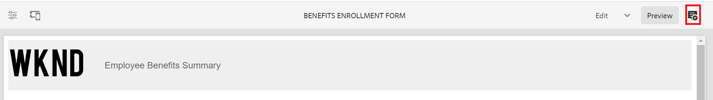

# Controle de versão, revisão e comentário em um Formulário adaptável

<!--

 This feature is under the early adopter program. If you’re interested in joining our early access program for this feature, send an email from your official address to aem-forms-ea@adobe.com to request access 

-->

Os Componentes principais do formulário adaptável permitem que os autores do formulário adicionem versões, comentários e anotações aos formulários. Esses recursos simplificam o desenvolvimento de formulários permitindo que os usuários criem e gerenciem várias versões, colaborem por meio de comentários e adicionem notas a seções de formulário específicas, aprimorando a experiência de criação de formulários.

## Pré-requisitos {#prerequisite-versioning}

Para usar os recursos de controle de versão, comentário e anotação em um Formulário adaptável, verifique se os [Componentes principais do formulário adaptável](https://experienceleague.adobe.com/en/docs/experience-manager-65/content/forms/adaptive-forms-core-components/enable-adaptive-forms-core-components) estão habilitados no ambiente Forms do AEM 6.5.

## Versão do formulário adaptável {#adaptive-form-versioning}

O controle de versão do formulário adaptável ajuda a adicionar versões a um formulário. Os autores de formulários podem criar facilmente várias versões de um formulário e, finalmente, usar aquela que é adequada aos objetivos de negócios. Além disso, os usuários do formulário também podem reverter o formulário para as versões anteriores. Também facilita que os autores comparem duas versões de um formulário, visualizando-as, permitindo que analisem melhor os formulários a partir das perspectivas da interface do usuário. Vamos analisar detalhadamente cada funcionalidade de controle de versão de formulário adaptável:

### Criar uma versão de formulário {#create-a-form-version}

Para criar uma versão de um formulário, siga as etapas fornecidas abaixo:

1. No seu ambiente do AEM Forms, navegue até o **[!UICONTROL Formulário]**>**[!UICONTROL Forms e Documentos]** e selecione seu **Formulário**.
1. Na lista suspensa de seleção no painel esquerdo, selecione **[!UICONTROL Versões]**.
   
1. Clique nos **três pontos** localizados no painel inferior à esquerda, e clique em **[!UICONTROL Salvar como Versão]**.
1. Forneça um rótulo para a versão do formulário. Você também pode adicionar informações sobre o formulário por meio de um comentário.
   

### Atualizar uma versão de formulário {#update-a-form-version}

Depois de editar e atualizar o formulário, você adiciona uma nova versão ao formulário. Siga as etapas fornecidas na última seção para nomear uma nova versão do formulário como mostrado na imagem:

### Reverter uma versão de formulário {#revert-a-form-version}

Para reverter uma versão de formulário para a anterior, selecione uma versão de formulário, clique em **[!UICONTROL Reverter para esta Versão]**.

### Comparar versões de formulários {#compare-form-versions}

Os autores de formulário podem comparar duas versões diferentes de um formulário para fins de visualização. Para comparar versões, selecione qualquer versão de formulário e clique em **[!UICONTROL Comparar com atual]**. Ela mostra duas versões de formulário diferentes no modo de visualização.

## Adicionar comentários {#add-comments}

Uma revisão é um mecanismo que permite que um ou mais revisores comentem formulários. Qualquer usuário do formulário pode comentar em um formulário ou revisar um formulário por meio de comentários. Para comentar em um formulário, selecione um **[!UICONTROL Formulário]** e adicione um **[!UICONTROL Comentário]** ao formulário.

>[!NOTE]
> Quando você usa comentários em componentes principais do formulário adaptável, como discutido acima, a funcionalidade de formulário, [adicionar revisores a formulários](/help/forms/using/create-reviews-forms.md), está desabilitada.

## Adicionar anotações {#adaptive-form-annotations}

Em muitos casos, os usuários do grupo de formulários são solicitados a adicionar anotações em um formulário para fins de revisão, como em uma guia específica ou em componentes de um formulário. Nesses casos, os autores podem usar anotações.
Para adicionar anotações a um formulário, execute as seguintes etapas:

1. Abra um formulário no modo **[!UICONTROL Editar]**.

1. Clique no **ícone de adição** localizado no painel superior direito, conforme fornecido na imagem.
   

1. Agora clique no **ícone adicionar** localizado no painel superior esquerdo, conforme fornecido na imagem, para adicionar a anotação.
   

1. Agora é possível adicionar comentários, desenhar rascunhos com várias cores para formar componentes.

1. Para ver todas as anotações adicionadas a um formulário, selecione o formulário e veja que as anotações foram adicionadas no painel esquerdo, como mostrado na imagem.

   

## Consulte também:

* [Comparar componentes principais adaptáveis do Forms](/help/forms/using/compare-forms-core-components.md)
