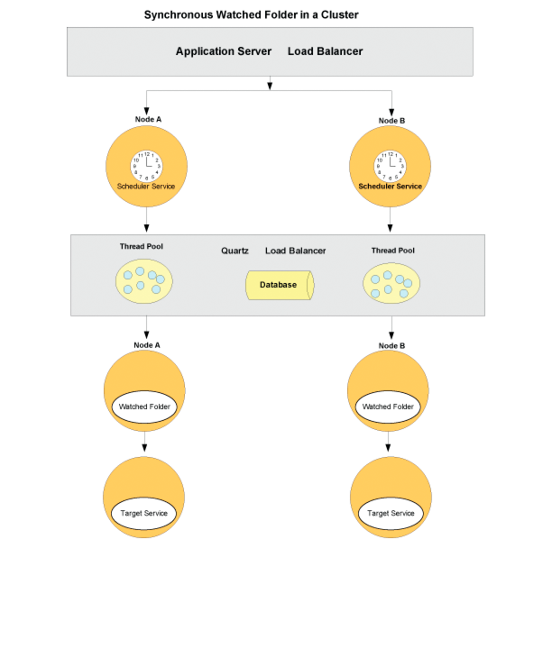

# Configuração de pontos finais de pastas monitorados {#configuring-watched-folder-endpoints}

Um administrador pode configurar uma pasta de rede, conhecida como pasta ** assistida, de modo que quando um usuário coloca um arquivo (como um arquivo PDF) na pasta assistida, uma operação de serviço configurada é invocada e manipula o arquivo. Depois que o serviço executa a operação especificada, ele salva o arquivo modificado em uma pasta de saída especificada.

## Configuração do serviço de Pasta assistida {#configuring-the-watched-folder-service}

Antes de configurar um terminal de pasta monitorada, configure o serviço de Pasta monitorada. Os parâmetros de configuração do serviço de Pasta assistida têm dois objetivos:

* Para configurar atributos comuns a todos os pontos de extremidade de pasta monitorados
* Para fornecer valores padrão para todos os pontos finais da pasta monitorada

Depois de configurar o serviço de Pasta assistida, adicione um terminal de Pasta assistida para o serviço de público alvo. Ao adicionar o ponto de extremidade, você define valores, como o nome do serviço e o nome da operação para chamar quando os arquivos ou pastas são colocados na pasta de entrada do serviço de Pasta monitorada configurado. Para obter detalhes sobre como configurar o serviço de Pasta assistida, consulte Configurações [do serviço de Pasta](/help/forms/using/admin-help/configure-service-settings.md#watched-folder-service-settings)assistida.

## Creating a watched folder {#creating-a-watched-folder}

Você pode criar uma pasta assistida das duas maneiras a seguir:

* Ao definir as configurações de um ponto de extremidade de pasta monitorada, digite o caminho completo para o diretório pai na caixa Caminho e anexe o nome da pasta monitorada a ser criada, como mostrado neste exemplo:
   `  C:\MyPDFs\MyWatchedFolder`Como a pasta MyWatchedFolder ainda não existe, os formulários AEM tentam criá-la nesse local.

* Crie uma pasta no sistema de arquivos antes de configurar um ponto de extremidade de pasta monitorada e digite o caminho completo na caixa Caminho.

Em um ambiente clusterizado, a pasta que será usada como pasta assistida deve estar acessível, gravável e compartilhada no sistema de arquivos ou na rede. Nesse cenário, cada instância do servidor de aplicativos do cluster deve ter acesso à mesma pasta compartilhada.

No Windows, se o servidor de aplicativos estiver sendo executado como um serviço, ele deverá ser iniciado com o acesso apropriado à pasta compartilhada de uma das seguintes maneiras:

* Configure o **parâmetro** Logon como do serviço do servidor de aplicativos para start como um usuário específico com acesso apropriado à pasta monitorada compartilhada.
* Configure o Start de serviço do servidor de aplicativos como opção Sistema local para permitir que o serviço interaja com a área de trabalho. Essa opção requer que a pasta monitorada compartilhada seja acessível e gravável para todos.

## Encadear pastas monitoradas {#chaining-together-watched-folders}

As pastas monitoradas podem ser encadeadas juntas para que o documento de resultado de uma pasta assistida seja o documento de entrada da próxima pasta assistida. Cada pasta assistida pode chamar um serviço diferente. Ao configurar pastas monitoradas dessa maneira, vários serviços podem ser chamados. Por exemplo, uma pasta assistida poderia converter arquivos PDF em Adobe PostScript® e uma segunda pasta assistida poderia converter os arquivos PostScript em formato PDF/A. Para fazer isso, basta definir a pasta de *resultados* da pasta assistida definida pelo primeiro terminal para apontar para a pasta de *entrada* da pasta assistida definida pelo segundo terminal.

A saída da primeira conversão iria para \path\result. A entrada para a segunda conversão seria \path\result, e a saída da segunda conversão seria enviada para \path\result\result (ou para o diretório definido na caixa Pasta de resultados para a segunda conversão).

## Como os usuários interagem com pastas monitoradas {#how-users-interact-with-watched-folders}

Para um terminal de pasta monitorada, os usuários podem invocar copiando ou arrastando arquivos ou pastas de entrada de suas áreas de trabalho para uma pasta assistida. Os arquivos serão processados na ordem em que chegarem.

Para pontos de extremidade de pasta monitorados, se o trabalho exigir apenas um arquivo de entrada, o usuário poderá copiar esse arquivo na raiz da pasta monitorada.

Se o trabalho contiver mais de um arquivo de entrada, o usuário deverá criar uma pasta fora da hierarquia de pastas monitoradas que contenha todos os arquivos necessários. Essa nova pasta deve incluir os arquivos de entrada (e, opcionalmente, um arquivo DX, se exigido pelo processo). Depois que a pasta de trabalho é construída, o usuário a copia para a pasta de entrada da pasta assistida.

>[!NOTE]
>
>Verifique se o servidor de aplicativos excluiu o acesso aos arquivos na pasta assistida. Se os formulários do AEM não puderem excluir os arquivos da pasta de entrada depois que eles forem verificados, o processo associado será chamado indefinidamente.

## Saída de pasta assistida {#watched-folder-output}

Quando a entrada é uma pasta e a saída consiste em vários arquivos, os formulários AEM criam uma pasta de saída com o mesmo nome da pasta de entrada e copiam os arquivos de saída para essa pasta. Quando a saída consiste em um mapa de documentos contendo um par de valores chave, como a saída de um processo de Saída, a chave será usada como o nome do arquivo de saída.

Os nomes de arquivo de saída que resultam de um processo de ponto de extremidade não podem conter caracteres diferentes de letras, números e pontos (.) antes da extensão do arquivo. Os formulários do AEM convertem outros caracteres em seus valores hexadecimais.

Os aplicativos clientes coletam os documentos de resultado da pasta monitorada. Os erros de processo são registrados na pasta de falha da pasta assistida.

## Como a pasta assistida funciona {#how-watched-folder-works}

O módulo Pasta assistida contém estes serviços:

* Serviço de Pasta assistida
* provider.file_scan_service
* provider.file_write_results_service

Além dos serviços listados acima, a Pasta monitorada também depende de outros serviços, incluindo o serviço de Scheduler para agendar os trabalhos e o serviço Gerenciador de trabalhos para suportar a invocação assíncrona dos serviços de público alvo.

### Como a Pasta assistida processa uma solicitação de invocação {#how-watched-folder-processes-an-invocation-request}

O serviço de Pasta assistida lida com a criação, atualização e exclusão dos pontos finais. Depois que o administrador cria os pontos de extremidade, eles são programados para serem acionados pelo serviço de Scheduler com base no intervalo de repetição especificado ou na expressão cron.

Este diagrama ilustra como a Pasta assistida processa uma solicitação de invocação.

O processo de chamar um serviço usando pastas monitoradas é o seguinte:

1. Um aplicativo cliente coloca arquivos ou pastas na pasta de entrada da pasta monitorada.
1. Quando o intervalo de verificação de tarefa ocorre, o serviço de Scheduler chama o provider.file_scan_service para processar os arquivos ou pastas na pasta de entrada.
1. O provider.file_scan_service executa estas tarefas:

   * Verifica a pasta de entrada em busca de arquivos ou pastas que correspondam ao padrão de arquivo include e exclui arquivos ou pastas para o padrão de arquivo excluído especificado. Os arquivos ou pastas mais antigos são selecionados primeiro. Arquivos e pastas mais antigos que o tempo de espera também são coletados. Em uma varredura, o número de arquivos ou pastas processados se baseia no tamanho do lote. Para obter informações sobre padrões de arquivo, consulte [Sobre padrões](configuring-watched-folder-endpoints.md#about-file-patterns)de arquivo. Para obter informações sobre como configurar o tamanho do lote, consulte Configurações [do serviço de Pastas](/help/forms/using/admin-help/configure-service-settings.md#watched-folder-service-settings)Monitoradas.
   * Seleciona os arquivos ou pastas para processamento. Se os arquivos ou pastas não forem completamente baixados, eles serão coletados na próxima verificação. Para garantir que as pastas sejam completamente baixadas, os administradores devem criar uma pasta com um nome usando o padrão de arquivo excluído. Depois que a pasta tiver todos os arquivos, ele deverá ser renomeado para o padrão especificado no padrão de arquivo include. Essa etapa garante que a pasta tenha todos os arquivos necessários para chamar o serviço. Para obter mais informações sobre como garantir que as pastas sejam completamente baixadas, consulte [Dicas e truques para pastas](configuring-watched-folder-endpoints.md#tips-and-tricks-for-watched-folders)monitoradas.
   * Move os arquivos ou pastas para a pasta stage depois de selecioná-los para processamento.
   * Converte os arquivos ou pastas na pasta stage para a entrada apropriada com base nos mapeamentos de parâmetro de entrada do ponto final. Para obter exemplos de mapeamentos de parâmetros de entrada, consulte [Dicas e truques para pastas](configuring-watched-folder-endpoints.md#tips-and-tricks-for-watched-folders)monitoradas.

1. O serviço de público alvo configurado para o terminal é chamado de forma síncrona ou assíncrona. O serviço de público alvo é chamado usando o nome de usuário e a senha configurados para o terminal.

   * A invocação síncrona chama o serviço de público alvo direta e imediatamente para manipular a resposta.
   * Para invocação assíncrona, o serviço de público alvo é chamado pelo serviço Gerenciador de tarefas, que coloca a solicitação em uma fila. O Serviço do Gerenciador de Tarefas, por sua vez, chama o provider.file_write_results_service para manipular os resultados.

1. O provider.file_write_results_service lida com a resposta ou falha da chamada de serviço de público alvo. Quando bem-sucedida, a saída é salva na pasta de resultados com base na configuração do ponto de extremidade. O provider.file_write_results_service também preserva a origem se o terminal estiver configurado para preservar os resultados após a conclusão com êxito.

   Quando a invocação do serviço de público alvo resulta em uma falha, o provider.file_write_results_service registra o motivo da falha em um arquivo failure.log e coloca esse arquivo na pasta de falha. A pasta de falha é criada com base nos parâmetros de configuração especificados para o ponto de extremidade. Quando o administrador define a opção Preservar na falha para a configuração do ponto de extremidade, o provider.file_write_results_service também copia os arquivos de origem para a pasta de falha. Para obter informações sobre como recuperar arquivos da pasta de falha, consulte Pontos de [falha e recuperação](configuring-watched-folder-endpoints.md#failure-points-and-recovery).

## Configurações de ponto de extremidade de pasta monitorada {#watched-folder-endpoint-settings}

Use as seguintes configurações para configurar um ponto de extremidade de pasta monitorada.

**Nome:** (Obrigatório) Identifica o terminal. Não inclua um caractere &lt; porque ele truncará o nome exibido no Workspace. Se você estiver inserindo um URL como o nome do ponto de extremidade, verifique se ele está em conformidade com as regras de sintaxe especificadas em RFC1738.

**Descrição:** Uma descrição do terminal. Não inclua um caractere &lt; porque ele truncará a descrição exibida no Workspace.

**Caminho:** (Obrigatório) Especifica o local da pasta monitorada. Em um ambiente clusterizado, essa configuração deve apontar para uma pasta de rede compartilhada acessível de todos os computadores do cluster.

**Assíncrono:** Identifica o tipo de invocação como assíncrono ou síncrono. O valor padrão é assíncrono. Recomenda-se assíncrono para processos de longa duração, enquanto que síncrono é recomendado para processos transitórios ou de curta duração.

**Expressão do cron:** Digite uma expressão cron se a pasta monitorada precisar ser agendada usando uma expressão cron. Quando essa configuração é configurada, o Intervalo de repetição é ignorado.

**Intervalo de repetição:** O intervalo em segundos para verificar a entrada da pasta assistida. A menos que a configuração de aceleração esteja ativada, o intervalo de repetição deve ser maior que o tempo para processar um trabalho médio; caso contrário, o sistema poderá ficar sobrecarregado. O valor padrão é 5. Consulte a descrição do Tamanho do lote para obter mais informações.

**Contagem de repetição:** Número de vezes que a pasta assistida verifica a pasta ou o diretório. Um valor de -1 indica uma varredura indefinida. O valor padrão é -1.

**Acelerador:** Quando essa opção é selecionada, ela limita o número de trabalhos de pasta monitorados que os formulários AEM processam a qualquer momento. O número máximo de trabalhos é determinado pelo valor Tamanho do Lote. (Consulte Sobre limitação.)

**Nome do usuário:** (Obrigatório) O nome de usuário usado ao chamar um serviço de público alvo da pasta assistida. O valor padrão é SuperAdmin.

**Nome do domínio:** (Obrigatório) O domínio do usuário. O valor padrão é DefaultDom.

**Tamanho do lote:** O número de arquivos ou pastas a serem coletados por varredura. Utilização para evitar sobrecargas no sistema; a verificação de muitos arquivos ao mesmo tempo pode causar uma falha. O valor padrão é 2.

As configurações Repetir intervalo e Tamanho do lote determinam quantos arquivos a Pasta assistida seleciona em cada verificação. A Pasta assistida usa um pool de threads do Quartz para verificar a pasta de entrada. O pool de threads é compartilhado com outros serviços. Se o intervalo de verificação for pequeno, os threads verificarão a pasta de entrada com frequência. Se os arquivos forem descartados com frequência na pasta assistida, mantenha o intervalo de verificação pequeno. Se os arquivos forem descartados com pouca frequência, use um intervalo de verificação maior para que os outros serviços possam usar os threads.

Se houver um grande volume de arquivos sendo descartados, torne o tamanho do lote grande. Por exemplo, se o serviço chamado pelo ponto de extremidade da pasta assistida puder processar 700 arquivos por minuto, e os usuários soltarem arquivos na pasta de entrada à mesma taxa, então, definir o Tamanho do lote como 350 e o Intervalo de repetição como 30 segundos ajudará no desempenho da Pasta assistida sem incorrer no custo de digitalização da pasta assistida com muita frequência.

Quando os arquivos são descartados na pasta assistida, ele lista os arquivos na entrada, o que pode reduzir o desempenho se a varredura estiver ocorrendo a cada segundo. O aumento do intervalo de varredura pode melhorar o desempenho. Se o volume de arquivos que está sendo descartado for pequeno, ajuste o Tamanho do lote e o Intervalo de repetição de acordo. Por exemplo, se 10 arquivos forem descartados a cada segundo, tente definir o Intervalo de repetição como 1 segundo e o Tamanho do lote como 10.

**Tempo de espera:** O tempo, em milissegundos, para aguardar antes de digitalizar uma pasta ou um arquivo após sua criação. Por exemplo, se o tempo de espera for de 3.600.000 milissegundos (uma hora) e o arquivo tiver sido criado há um minuto, esse arquivo será coletado depois de 59 minutos ou mais. O valor padrão é 0.

Essa configuração é útil para garantir que um arquivo ou pasta seja completamente copiado para a pasta de entrada. Por exemplo, se você tiver um arquivo grande para processar e o arquivo levar dez minutos para ser baixado, defina o tempo de espera como 10&amp;ast;60 &amp;ast;1000 milissegundos. Isso evita que a pasta assistida verifique o arquivo se ele não tiver dez minutos.

**Excluir padrão de arquivo:** Um ponto-e-vírgula **;** lista delimitada de padrões que uma pasta assistida usa para determinar quais arquivos e pastas serão examinados e coletados. Nenhum arquivo ou pasta com esse padrão será verificado para processamento.

Essa configuração é útil quando a entrada é uma pasta com vários arquivos. O conteúdo da pasta pode ser copiado em uma pasta com um nome que será selecionado pela pasta assistida. Isso evita que a pasta assistida pegue uma pasta para processamento antes que ela seja completamente copiada para a pasta de entrada.

Você pode usar padrões de arquivo para excluir:

* Arquivos com extensões de nome de arquivo específicas; por exemplo, &amp;ast;.dat, &amp;ast;.xml, &amp;ast;.pdf.
* Arquivos com nomes específicos; por exemplo, dados.&amp;ast; excluiria arquivos e pastas chamados *data1*, *data2* e assim por diante.
* Arquivos com expressões compostas no nome e na extensão, como nestes exemplos:

   * Dados[0-9][0-9][0-9].[dD][aA]&#39;port&#39;
   * &amp;ast;.[dD][Aa]&#39;port&#39;
   * &amp;ast;.[Xx][Mm][Ll]

Para obter mais informações sobre padrões de arquivo, consulte [Sobre padrões](configuring-watched-folder-endpoints.md#about-file-patterns)de arquivo.

**Incluir padrão de arquivo:** (Obrigatório) Um ponto-e-vírgula **;** lista delimitada de padrões que a pasta assistida usa para determinar quais pastas e arquivos devem ser examinados e coletados. Por exemplo, se Incluir padrão de arquivo for input&amp;ast;, todos os arquivos e pastas que correspondem input&amp;ast; são apanhados. Isso inclui arquivos e pastas chamados input1, input2 e assim por diante.

O valor padrão é &amp;ast; e indica todos os arquivos e pastas.

Você pode usar padrões de arquivo para incluir:

* Arquivos com extensões de nome de arquivo específicas; por exemplo, &amp;ast;.dat, &amp;ast;.xml, &amp;ast;.pdf.
* Arquivos com nomes específicos; por exemplo, dados.&amp;ast; incluiria arquivos e pastas chamados *data1*, *data2* e assim por diante.
* Arquivos com expressões compostas no nome e na extensão, como nestes exemplos:

   * Dados[0-9][0-9][0-9].[dD][aA]&#39;port&#39;
   * &amp;ast;.[dD][Aa]&#39;port&#39;
   * &amp;ast;.[Xx][Mm][Ll]

Para obter mais informações sobre padrões de arquivo, consulte [Sobre padrões](configuring-watched-folder-endpoints.md#about-file-patterns)de arquivo.

**Pasta de resultados:** A pasta onde os resultados salvos são armazenados. Se os resultados não forem exibidos nessa pasta, verifique a pasta de falha. Os arquivos somente leitura não são processados e serão salvos na pasta de falha. Esse valor pode ser um caminho absoluto ou relativo com os seguintes padrões de arquivo:

* %F = prefixo de nome de arquivo
* %E = extensão de nome de arquivo
* %Y = ano (completo)
* %y = ano (últimos dois dígitos)
* %M = mês
* %D = dia do mês
* %d = dia do ano
* %H = hora (relógio de 24 horas)
* %h = hora (relógio de 12 horas)
* %m = minuto
* %s = segundo
* %l = milissegundos
* %R = número aleatório (entre 0 e 9)
* %P = id de processo ou tarefa

Por exemplo, se forem 20 horas em 17 de julho de 2009 e você especificar `C:/Test/WF0/failure/%Y/%M/%D/%H/`, a pasta de resultados será `C:/Test/WF0/failure/2009/07/17/20`.

Se o caminho não for absoluto, mas relativo, a pasta será criada dentro da pasta assistida. O valor padrão é result/%Y/%M/%D/, que é a pasta Result dentro da pasta monitorada. Para obter mais informações sobre padrões de arquivo, consulte [Sobre padrões](configuring-watched-folder-endpoints.md#about-file-patterns)de arquivo.

***Observação **: Quanto menor for o tamanho das pastas de resultados, melhor será o desempenho da Pasta assistida. Por exemplo, se a carga estimada para a pasta assistida for de 1.000 arquivos a cada hora, experimente um padrão como`result/%Y%M%D%H`para que uma nova subpasta seja criada a cada hora. Se a carga for menor (por exemplo, 1000 arquivos por dia), você poderá usar um padrão como`result/%Y%M%D`.*

**Preservar pasta:** O local onde os arquivos são armazenados após a verificação e coleta bem-sucedidas. O caminho pode ser absoluto, relativo ou nulo. Você pode usar padrões de arquivo, conforme descrito para a Pasta de resultados. O valor padrão é preserve/%Y/%M/%D/.

**Pasta de falha:** A pasta onde os arquivos de falha são salvos. Esse local é sempre relativo à pasta assistida. Você pode usar padrões de arquivo, conforme descrito para a Pasta de resultados.

Os arquivos somente leitura não são processados e serão salvos na pasta de falha.

O valor padrão é falha/%Y/%M/%D/.

**Preservar na falha:** Preservar arquivos de entrada em caso de falha ao executar a operação em um serviço. O valor padrão é true.

**Substituir nomes de arquivos de Duplicado:** Quando definido como Verdadeiro, os arquivos na pasta de resultados e na pasta de preservação são substituídos. Quando definido como Falso, arquivos e pastas com um sufixo de índice numérico são usados para o nome. O valor padrão é Falso.

**Duração da Expurgação:** (Obrigatório) Os arquivos e pastas na pasta de resultados são removidos quando são mais antigos que esse valor. Esse valor é medido em dias. Essa configuração é útil para garantir que a pasta de resultados não fique cheia.

Um valor de -1 dias indica que a pasta de resultados nunca será excluída. O valor padrão é -1.

**Nome da Operação:** (Obrigatório) Uma lista de operações que podem ser atribuídas ao ponto final da pasta monitorada.

**Mapeamentos de parâmetros de entrada:** Usado para configurar a entrada necessária para processar o serviço e a operação. As configurações disponíveis dependem do serviço que está usando o ponto de extremidade da pasta monitorada. Estes são os dois tipos de entradas:

**Literal:** A pasta assistida usa o valor digitado no campo conforme é exibido. Todos os tipos básicos de Java são suportados. Por exemplo, se uma API usar uma entrada como String, long, int e Boolean, a string será convertida no tipo correto e o serviço será chamado.

**Variável:** O valor inserido é um padrão de arquivo que a pasta assistida usa para escolher a entrada. Por exemplo, no caso do serviço de senha de criptografia, onde o documento de entrada deve ser um arquivo PDF, o usuário pode usar &amp;ast;.pdf como padrão de arquivo. A pasta assistida coletará todos os arquivos na pasta assistida que correspondem a esse padrão e chamará o serviço para cada arquivo. Quando uma variável é usada, todos os arquivos de entrada são convertidos em documentos. Somente as APIs que usam o Documento como tipo de entrada são suportadas.

**Mapeamentos de parâmetros de saída:** Usado para configurar os resultados do serviço e da operação. As configurações disponíveis dependem do serviço que está usando o ponto de extremidade da pasta monitorada.

A saída da Pasta assistida pode ser um único documento, uma lista de documentos ou um mapa de documentos. Esses documentos de saída são salvos na pasta de resultados, usando o padrão especificado no Mapeamento do parâmetro de saída.

**Observação**: A *especificação de nomes que resultam em nomes de arquivo de saída exclusivos melhora o desempenho. Por exemplo, considere o caso em que o serviço retorna um documento de saída e o Mapeamento de parâmetro de saída o mapeia para`%F.%E`(o nome do arquivo e a extensão do arquivo de entrada). Nesse caso, se os usuários soltarem arquivos com o mesmo nome a cada minuto e a pasta resultante estiver configurada para`result/%Y/%M/%D`, e a configuração Substituir nome de arquivo do Duplicado estiver desativada, a Pasta assistida tentará resolver os nomes dos arquivos do duplicado. O processo de resolução de nomes de arquivos de duplicado pode afetar o desempenho. Nessa situação, alterar o Mapeamento do parâmetro de saída para adicionar horas, minutos, segundos e milissegundos`%F_%h_%m_%s_%l`ao nome ou garantir que os arquivos descartados tenham nomes exclusivos pode melhorar o desempenho.*

## Sobre padrões de arquivos {#about-file-patterns}

Os administradores podem especificar o tipo de arquivo que pode chamar um serviço. Vários padrões de arquivo podem ser estabelecidos para cada pasta assistida. Um padrão de arquivo pode ser uma das seguintes propriedades de arquivo:

* Arquivos com extensões de nome de arquivo específicas; por exemplo, &amp;ast;.dat, &amp;ast;.xml, &amp;ast;.pdf,;
* Arquivos com nomes específicos; por exemplo, dados.&amp;ast;
* Arquivos com expressões compostas no nome e na extensão, como nestes exemplos:

   * Dados[0-9][0-9][0-9].[dD][aA]&#39;port&#39;
   * &amp;ast;.[dD][Aa]&#39;port&#39;
   * &amp;ast;.[Xx][Mm][Ll]

O administrador pode definir o padrão de arquivo da pasta de saída para armazenar os resultados. Para as pastas de saída (resultado, preservação e falha), o administrador pode especificar qualquer um destes padrões de arquivo:

* %Y = ano (completo)
* %y = ano (últimos dois dígitos)
* %M = mês,
* %D = dia do mês,
* %d = dia do ano,
* %h = hora,
* %m = minuto,
* %s = segundo,
* %R = número aleatório entre 0 e 9
* %J = Nome do trabalho

Por exemplo, o caminho para a pasta de resultados pode ser `C:\Adobe\Adobe_Experience_Manager_forms\BarcodedForms\%y\%m\%d`.

Mapeamentos de parâmetros de saída também podem especificar padrões adicionais, como estes:

* %F = Nome do Arquivo de Origem
* %E = Extensão do Nome de Arquivo de Origem

Se o padrão de mapeamento do parâmetro de saída terminar com &quot;File.separator&quot; (que é o separador de caminho), uma pasta será criada e o conteúdo será copiado para essa pasta. Se o padrão não terminar com &quot;File.separator&quot;, o conteúdo (arquivo ou pasta de resultado) será criado com esse nome. Para obter mais informações sobre mapeamentos de parâmetros de saída, consulte [Dicas e truques para pastas](configuring-watched-folder-endpoints.md#tips-and-tricks-for-watched-folders)monitoradas.

## Sobre limitação {#about-throttling}

Quando a limitação está ativada para um ponto de extremidade de pasta monitorada, ela limita o número de trabalhos de pasta monitorados que podem ser processados a qualquer momento. O número máximo de trabalhos é determinado pelo valor Tamanho do lote, também configurável no ponto final da Pasta assistida. Os documentos recebidos no diretório de entrada da pasta monitorada não serão pesquisados quando o limite de limitação for atingido. Os documentos também permanecerão no diretório de entrada até que outros trabalhos de pasta monitorada sejam concluídos e que outra tentativa de pesquisa seja feita. No caso de processamento síncrono, todas as ordens de produção processadas em uma única pesquisa serão contadas em direção ao limite de limitação, mesmo que as ordens de produção sejam processadas consecutivamente em um único thread.

>[!NOTE]
>
>A limitação não é dimensionada com um cluster. Quando a limitação estiver ativada, o cluster como um todo não processará mais do que o número de trabalhos especificados no Tamanho do Lote em um determinado momento. Esse limite é todo o cluster e não específico para cada nó no cluster. Por exemplo, com um Tamanho em lote de 2, o limite de limitação poderia ser atingido com um único nó processando duas tarefas, e nenhum outro nó sondaria o diretório de entrada até que uma das tarefas fosse concluída.

### Como a limitação funciona {#how-throttling-works}

A Pasta assistida verifica a pasta de entrada em cada Intervalo de repetição, seleciona o número de arquivos especificados no Tamanho do lote e chama o serviço de público alvo para cada um desses arquivos. Por exemplo, se o Tamanho do lote for quatro, em cada verificação, a Pasta assistida selecionará quatro arquivos, criará quatro solicitações de invocação e chamará o serviço de público alvo. Antes de essas solicitações serem concluídas, se a Pasta assistida for invocada, ela start quatro trabalhos novamente, independentemente de as quatro tarefas anteriores serem concluídas.

A limitação impede que a Pasta assistida chame novas tarefas quando as tarefas anteriores não estiverem concluídas. A Pasta assistida detectará trabalhos em andamento e processará novos trabalhos com base no tamanho do lote menos trabalhos em andamento. Por exemplo, na segunda invocação, se o número de trabalhos concluídos for apenas três e uma tarefa ainda estiver em andamento, a Pasta monitorada chamará apenas mais três trabalhos.

* A Pasta assistida depende do número de arquivos presentes na pasta stage para descobrir quantas tarefas estão em andamento. Se os arquivos permanecerem não processados na pasta stage, a Pasta assistida não chamará mais trabalhos. Por exemplo, se o tamanho do lote for quatro e três trabalhos estiverem parados, a Pasta assistida chamará apenas um trabalho em invocações subsequentes. Há vários cenários que podem fazer com que os arquivos permaneçam não processados na pasta stage. Quando os trabalhos estão parados, o administrador pode encerrar o processo na página de administração do fluxo de trabalho dos formulários para que a Pasta monitorada mova os arquivos para fora da pasta do palco.
* Se o servidor de formulários ficar inativo antes que a Pasta assistida possa chamar os trabalhos, o administrador poderá mover os arquivos para fora da pasta do palco. Para obter informações, consulte Pontos de [falha e recuperação](configuring-watched-folder-endpoints.md#failure-points-and-recovery).
* Se o servidor de formulários estiver em execução, mas a Pasta monitorada não estiver em execução quando o serviço Gerenciador de trabalhos retornar, o que ocorre quando os serviços não são start na sequência ordenada, o administrador pode mover os arquivos para fora da pasta de estágio. Para obter informações, consulte Pontos de [falha e recuperação](configuring-watched-folder-endpoints.md#failure-points-and-recovery).

## Desempenho e escalabilidade {#performance-and-scalability}

A Pasta assistida pode enviar 100 pastas no total em um único nó. O desempenho da Pasta assistida depende do desempenho do servidor de formulários. Para invocação assíncrona, o desempenho é mais dependente da carga do sistema e das tarefas que estão na fila do Gerenciador de tarefas.

O desempenho da Pasta assistida pode ser melhorado com a adição de nós ao cluster. As tarefas de Pastas monitoradas são distribuídas pelos nós de cluster em virtude do scheduler Quartz e, no caso de solicitações assíncronas, pelo serviço Gerenciador de tarefas. Todos os trabalhos são mantidos no banco de dados.

A Pasta assistida depende do serviço de Scheduler para agendar, desprogramar e reprogramar as ordens de produção. Outros serviços, como o serviço Gerenciamento de Eventos, o serviço Gerenciador de usuários e o serviço Provedor de email, estão disponíveis e compartilham o pool de threads do serviço de Scheduleres. Isso pode afetar o desempenho da Pasta assistida. O ajuste do pool de threads do serviço de Scheduler será necessário quando todos os start de serviços o utilizarem.

## Pastas vigiadas em um cluster {#watched-folders-in-a-cluster}

Em um cluster, a Pasta assistida depende do scheduler Quartz e do serviço Gerenciador de tarefas para balanceamento de carga e failover. Para obter mais informações sobre o comportamento de cluster do Quartz, consulte Documentação [do](https://www.quartz-scheduler.org/documentation)Quartz.

A Pasta assistida executa estas três tarefas principais em cada pesquisa:

* Verificar a pasta
* Chamar o serviço de público alvo
* Tratar os resultados

O comportamento de balanceamento de carga e failover muda dependendo se a pasta assistida está configurada para invocação síncrona ou assíncrona.

### Pasta assistida síncrona em um cluster {#synchronous-watched-folder-in-a-cluster}

Para invocações síncronas, o balanceador de carga do Quartz decide qual nó receberá o evento de pesquisa. O nó que obtém o evento de pesquisa executará todas as tarefas: verifique a pasta, chame o serviço de público alvo e manipule os resultados.

Para invocações síncronas, quando um nó falha, o scheduler Quartz envia novos eventos de sondagem para outros nós. Os convites iniciados no nó com falha serão perdidos. Para obter mais informações sobre como recuperar os arquivos associados à tarefa com falha, consulte Pontos de [falha e recuperação](configuring-watched-folder-endpoints.md#failure-points-and-recovery).

### Pasta assistida assíncrona em um cluster {#asynchronous-watched-folder-in-a-cluster}

Para invocações assíncronas, o balanceador de carga do Quartz decide qual nó receberá o evento de pesquisa. O nó que recebe o evento de pesquisa verificará a pasta de entrada e chamará o serviço de público alvo colocando a solicitação na fila do serviço Gerenciador de tarefas. O balanceador de carga do serviço Gerenciador de tarefas, por sua vez, é responsável por decidir qual nó processará a solicitação de invocação. É possível que, mesmo que o nó A tenha criado a solicitação de invocação, o nó B acabe processando a solicitação. Ou o nó que iniciou a solicitação de invocação também pode terminar processando a solicitação.

Para invocações assíncronas, quando um nó falha, o scheduler Quartz envia novos eventos de pesquisa para outros nós. As solicitações de chamada que foram criadas no nó com falha estarão na fila de serviços do Gerenciador de tarefas e serão enviadas para outros nós para processamento. Os arquivos para os quais as solicitações de invocação não são criadas permanecerão na pasta stage. Para obter mais informações sobre como recuperar os arquivos associados à tarefa com falha, consulte Pontos de [falha e recuperação](configuring-watched-folder-endpoints.md#failure-points-and-recovery).

## Pontos de falha e recuperação {#failure-points-and-recovery}

Em cada evento de pesquisa, a Pasta assistida bloqueia a pasta de entrada, move os arquivos que correspondem ao padrão de arquivo de inclusão para a pasta de palco e, em seguida, desbloqueia a pasta de entrada. O bloqueio é necessário para que dois processos não captem o mesmo conjunto de arquivos e os processem duas vezes. As chances de isso acontecer aumentam com um pequeno intervalo de repetição e um grande tamanho de lote. Depois que os arquivos são movidos para a pasta stage, a pasta de entrada é desbloqueada para que outros threads possam digitalizar a pasta. Esta etapa ajuda a fornecer alta throughput, pois outros processos podem digitalizar enquanto um segmento está processando os arquivos.

Depois que os arquivos são movidos para a pasta stage, as solicitações de invocação são criadas para cada arquivo e o serviço de público alvo é chamado. Pode haver casos em que a Pasta assistida não possa recuperar os arquivos na pasta stage:

* Se o servidor falhar antes que a Pasta assistida possa criar a solicitação de invocação, os arquivos na pasta stage permanecerão na pasta stage e não serão recuperados.
* Se a Pasta assistida tiver criado com êxito a solicitação de invocação para cada um dos arquivos na pasta stage e o servidor falhar, há dois comportamentos com base no tipo de invocação:

**Síncrono:** Se a Pasta assistida estiver configurada para chamar o serviço de forma síncrona, todos os arquivos na pasta stage permanecerão não processados na pasta stage.

**Assíncrono:** Nesse caso, a Pasta monitorada depende do serviço Gerenciador de tarefas. Se o Serviço do Gerenciador de tarefas retornar a Pasta monitorada, os arquivos na pasta stage serão movidos para a pasta preserve ou failure com base nos resultados da invocação. Se o serviço Gerenciador de trabalhos não retornar a chamada de Pasta assistida, os arquivos permanecerão não processados na pasta stage. Essa situação ocorre quando a Pasta monitorada não está sendo executada quando o Gerenciador de tarefas chama novamente.

### Recuperando arquivos de origem não processados na pasta stage {#recovering-unprocessed-source-files-in-the-stage-folder}

Quando a Pasta assistida não puder processar os arquivos de origem na pasta stage, você poderá recuperar os arquivos não processados.

1. Reinicie o servidor ou nó do aplicativo.
1. (Opcional) Impedir a pasta assistida de processar novos arquivos de entrada. Se você ignorar esta etapa, será muito mais difícil determinar quais arquivos são não processados na pasta stage. Para impedir que a Pasta assistida processe novos arquivos de entrada, execute uma das seguintes tarefas:

   * Em Aplicativos e serviços, altere o parâmetro Incluir padrão de arquivo para o ponto final da pasta assistida para algo que não corresponderá a nenhum dos novos arquivos de entrada (por exemplo, insira `NOMATCH`).
   * Suspenda o processo que está criando novos arquivos de entrada.
   Aguarde até que os formulários do AEM recuperem e processem todos os arquivos. A maioria dos arquivos deve ser recuperada e todos os novos arquivos de entrada processados corretamente. O tempo que você espera que a Pasta assistida recupere e processe os arquivos dependerá da duração da operação a ser chamada e do número de arquivos a serem recuperados.

1. Determine quais arquivos não podem ser processados. Se você esperou um tempo adequado e concluiu a etapa anterior, e ainda houver arquivos não processados restantes na pasta stage, vá para a próxima etapa.

   >[!NOTE]
   >
   >Você pode verificar a data e a hora dos arquivos no diretório stage. Dependendo do número de arquivos e do tempo de processamento normal, você pode determinar quais arquivos são antigos o suficiente para serem considerados presos.

1. Copie os arquivos não processados do diretório stage para o diretório de entrada.
1. Se você impediu a Pasta monitorada de processar novos arquivos de entrada na etapa 2, altere a opção Incluir padrão de arquivo para seu valor anterior ou reative o processo que você desativou.

## Considerações de segurança para pastas monitoradas {#security-considerations-for-watched-folders}

Cada pasta assistida é configurada com um nome de usuário e senha. Essas credenciais são usadas ao chamar os serviços. A Pasta monitorada depende do fato de a pasta compartilhada estar protegida pelo sistema de arquivos de segurança subjacente, para que somente o proprietário da pasta assistida possa acessar a pasta compartilhada.

## Dicas e truques para pastas monitoradas {#tips-and-tricks-for-watched-folders}

Estas são algumas dicas e truques ao configurar o endpoint da Pasta assistida:

* Se você tiver uma pasta assistida no Windows que esteja processando arquivos de imagem, especifique os valores para a opção Incluir padrão de arquivo ou Excluir padrão de arquivo para impedir que o arquivo Thumbs.db gerado automaticamente pelo Windows seja pesquisado pela pasta assistida.
* Se uma expressão cron for especificada, o intervalo de repetição será ignorado. O uso da expressão cron é baseado no sistema de programação de trabalhos de código aberto do Quartz, versão 1.4.0.
* O tamanho do lote é o número de arquivos ou pastas que serão coletados em cada verificação da pasta assistida. Se o tamanho do lote for definido como dois e dez arquivos ou pastas forem descartados na pasta de entrada da pasta assistida, somente dois serão coletados em cada verificação. Na próxima verificação, que ocorrerá após o tempo especificado no intervalo de repetição, os próximos dois arquivos serão coletados.
* Para padrões de arquivos, os administradores podem especificar expressões regulares com suporte adicional para padrões curingas para especificar padrões de arquivos. A Pasta assistida modifica a expressão regular para suportar padrões curingas, como &amp;ast;.&amp;ast; ou &amp;ast;.pdf. Esses padrões curingas não são suportados pelas expressões regulares.
* A Pasta assistida verifica a pasta de entrada em busca da entrada e não sabe se o arquivo ou pasta de origem é completamente copiado para a pasta de entrada antes que ela seja start no processamento do arquivo ou pasta. Para garantir que o arquivo ou pasta de origem seja completamente copiado para a pasta de entrada da pasta assistida antes que o arquivo ou pasta seja selecionado, faça as seguintes tarefas:

   * Use o Tempo de espera, que é o tempo em milissegundos que a Pasta assistida aguarda do último tempo modificado. Use esse recurso se tiver arquivos grandes para processar. Por exemplo, se um arquivo levar 10 minutos para ser baixado, especifique o tempo de espera como 10&amp;ast;60 &amp;ast;1000 milissegundos. Isso impedirá que a Pasta monitorada pegue o arquivo se ele não for tão antigo quanto 10 minutos.
   * Use o padrão de arquivo excluído e inclua o padrão de arquivo. Por exemplo, se o padrão de arquivo excluído for `ex*` e o padrão de arquivo include for `in*`, a Pasta monitorada coletará os arquivos que tiverem o start &quot;in&quot; e não coletará os arquivos que tiverem o start &quot;ex&quot;. Para copiar arquivos ou pastas grandes, primeiro renomeie o arquivo ou pasta para que o nome seja start com &quot;ex&quot;. Depois que o arquivo ou pasta com o nome &quot;ex&quot; for completamente copiado para a pasta assistida, renomeie-o para &quot;in&amp;ast;&quot;.

* Use a duração da limpeza para manter a pasta de resultados limpa. A Pasta assistida limpa todos os arquivos que são mais antigos que a duração mencionada na duração da limpeza. A duração é em dias.
* Ao adicionar um ponto final de Pasta assistida, depois de selecionar o nome da operação, o mapeamento do parâmetro de entrada é preenchido. Para cada entrada da operação, um campo de mapeamento de parâmetro de entrada é gerado. Estes são exemplos de mapeamentos de parâmetros de entrada:

   * Para `com.adobe.idp.Document` entrada: Se a operação de serviço tiver uma entrada do tipo `Document`, o administrador poderá especificar o tipo de mapeamento como `Variable`. A Pasta monitorada coletará a entrada da pasta de entrada da pasta assistida com base no padrão de arquivo especificado para o parâmetro de entrada. Se o administrador especificar `*.pdf` como parâmetro, cada arquivo que tiver uma extensão de .pdf será selecionado, convertido em `com.adobe.idp.Document`e o serviço chamado.
   * Para `java.util.Map` entrada: Se a operação de serviço tiver uma entrada do tipo `Map`, o administrador poderá especificar o tipo de mapeamento como `Variable` e inserir um valor de mapeamento com um padrão como `*.pdf`. Por exemplo, um serviço precisa de um mapa de dois `com.adobe.idp.Document` objetos que representam dois arquivos na pasta de entrada, como 1.pdf e 2.pdf. A Pasta assistida criará um mapa com a chave como o nome do arquivo e o valor como `com.adobe.idp.Document`.
   * Para `java.util.List` entrada: Se a operação de serviço tiver uma entrada do tipo Lista, o administrador poderá especificar o tipo de mapeamento como `Variable` e inserir um valor de mapeamento com um padrão como `*.pdf`. Quando os arquivos PDF são descartados na pasta de entrada, a Pasta monitorada criará uma lista dos `com.adobe.idp.Document` objetos que representam esses arquivos e chamará o serviço de público alvo.
   * A favor `java.lang.String`: O administrador tem duas opções. Primeiro, o administrador pode especificar o tipo de mapeamento como `Literal` e inserir um valor de mapeamento como uma sequência de caracteres, como a Pasta `hello.` assistida chamará o serviço com a sequência de caracteres `hello`. Em segundo lugar, o administrador pode especificar o tipo de mapeamento como um `Variable` e inserir um valor de mapeamento com um padrão como `*.txt`. No último caso, os arquivos com a extensão .txt serão lidos como um documento coagido como uma sequência para chamar o serviço.
   * Tipo primitivo Java: O administrador pode especificar o tipo de mapeamento como `Literal` e fornecer o valor. A Pasta assistida chamará o serviço com o valor especificado.

* A pasta assistida deve funcionar com documentos. Os resultados suportados são `com.adobe.idp.Document`, `org.w3c.Document`, `org.w3c.Node`assim como uma lista e um mapa desses tipos. Qualquer outro tipo resultará em uma saída de falha na pasta de falha.
* Se os resultados não estiverem na pasta de resultados, verifique a pasta de falha para ver se ocorreu uma falha.
* A Pasta assistida funciona melhor se usada no modo assíncrono. Nesse modo, a Pasta assistida coloca a solicitação de invocação na fila e retorna as chamadas. A fila é então processada de forma assíncrona. Quando a opção Assíncrono não está definida, a Pasta assistida chama o serviço de público alvo de forma síncrona e o Mecanismo de processo aguarda até que o serviço seja executado com a solicitação e os resultados sejam produzidos. Se o serviço de público alvo levar muito tempo para processar a solicitação, a Pasta assistida pode receber erros de tempo limite.
* A criação de pastas monitoradas para operações de importação e exportação não permite abstração de extensão de nome de arquivo. Ao chamar o serviço de Integração de dados de formulário usando pastas monitoradas, o tipo de extensão de nome de arquivo para o arquivo de saída pode não corresponder ao formato de saída pretendido para o tipo de objeto de documento. Por exemplo, se o arquivo de entrada para uma pasta assistida que chama a operação de exportação for um formulário XFA que contém dados, a saída deverá ser um arquivo de dados XDP. Para obter um arquivo de saída com a extensão de nome de arquivo correta, você pode especificá-lo no mapeamento de parâmetro de saída. Neste exemplo, você pode usar %F.xdp para o mapeamento do parâmetro de saída.
* A Pasta assistida pode processar os arquivos de entrada antes de serem completamente copiados para a pasta. O bloqueio de arquivos não é obrigatório no UNIX, como acontece no Windows. Por esse motivo, quando um arquivo é copiado para uma pasta assistida, a Pasta monitorada pode mover o arquivo para o palco sem aguardar a conclusão da cópia do arquivo. Esse comportamento faz com que apenas uma parte do arquivo de entrada seja processada. Atualmente, existem duas soluções alternativas:

   * Solução 1

      1. Especifique um padrão para Excluir padrão de arquivo, como temp&amp;ast;.ps.
      1. Copie os arquivos que começam com temp (por exemplo, temp1.ps) para a pasta assistida.
      1. Depois que o arquivo tiver sido copiado completamente para a pasta monitorada, renomeie o arquivo para corresponder ao padrão especificado para Incluir padrão de arquivo. A Pasta assistida move o arquivo concluído para o estágio.
   * Solução 2

      Se você sabe o tempo máximo que levará para copiar os arquivos em uma pasta assistida, especifique o tempo em segundos para o Tempo de espera. A Pasta assistida aguarda o tempo especificado antes de mover o arquivo para o palco.

      Este não é um problema para arquivos no Windows porque o Windows bloqueia um arquivo quando um thread está gravando. No entanto, esse é um problema para pastas no Windows. Para pastas, você deve seguir as etapas em Solução 1.

* Se o atributo de ponto de extremidade Preservar nome da pasta para a Pasta monitorada estiver definido como um caminho de diretório nulo, o diretório de preparo não será limpo como deveria ser. O diretório ainda contém o arquivo processado e a pasta temporária.

## Recomendações específicas de serviço para pastas monitoradas {#service-specific-recommendations-for-watched-folders}

Para todos os serviços, você deve ajustar o tamanho do lote e o intervalo de repetição da pasta assistida para que a taxa na qual a Pasta assistida seleciona novos arquivos e pastas para processamento não exceda a taxa de trabalhos que podem ser processados pelo servidor de formulários do AEM. Os parâmetros reais a serem usados podem variar dependendo de quantas pastas monitoradas estão configuradas, quais serviços estão usando pastas monitoradas e a intensidade das tarefas no processador.

### Gerar recomendações do serviço PDF {#generate-pdf-service-recommendations}

* O serviço Gerar PDF pode converter somente um arquivo por vez para estes tipos de arquivos: Microsoft Word, Microsoft Excel, Microsoft PowerPoint, Microsoft Project, AutoCAD, Adobe Photoshop®, Adobe FrameMaker® e Adobe PageMaker®. Estes são empregos de longa duração. portanto, mantenha o tamanho do lote com uma configuração baixa. Além disso, aumente o intervalo de repetição se houver mais nós no cluster.
* Para os tipos de arquivos PostScript (PS), Encapsulated PostScript (EPS) e de imagem, o serviço Gerar PDF pode processar vários arquivos em paralelo. Você deve ajustar cuidadosamente o tamanho do pool do bean de sessão (que governa o número de conversões que serão feitas em paralelo), dependendo da capacidade do servidor e do número de nós no cluster. Em seguida, aumente o tamanho do lote para um número igual ao tamanho do pool do bean de sessão para os tipos de arquivos que você está tentando converter. A frequência das sondagens deve ser determinada pelo número de nós no cluster; no entanto, como o serviço Gerar PDF processa esses tipos de trabalhos rapidamente, é possível configurar o intervalo de repetição para um valor baixo, como 5 ou 10.
* Embora o serviço Gerar PDF possa converter somente um arquivo OpenOffice por vez, a conversão é muito rápida. A lógica acima para conversões de PS, EPS e imagem também se aplica às conversões do OpenOffice.
* Para permitir uma distribuição de carga uniforme no cluster, mantenha o tamanho do lote baixo e aumente o intervalo de repetição.

### recomendações de serviço de formulários em código barras {#barcoded-forms-service-recommendations}

* Para obter melhor desempenho ao processar formulários com códigos de barras (pequenos arquivos), digite `10` para Tamanho do lote e `2` para Intervalo de repetição.
* Quando muitos arquivos são colocados na pasta de entrada, podem ocorrer erros com arquivos ocultos chamados *thumbs.db* . Portanto, é recomendável definir o Padrão de inclusão de arquivo para os arquivos incluídos com o mesmo valor especificado para a Variável de entrada (por exemplo, `*.tiff`). Isso impede que a Pasta assistida processe os arquivos do DB.
* O valor Tamanho do lote `5` e o Intervalo de repetição de `2` é normalmente suficiente, pois o serviço de Formulários com códigos de barras geralmente demora cerca de 0,5 segundos para processar um código de barras.
* A Pasta assistida não espera que o Mecanismo de processo conclua o trabalho antes de selecionar novos arquivos ou pastas. Ele continua digitalizando a pasta assistida e chamando o serviço de público alvo. Esse comportamento pode sobrecarregar o mecanismo, causando problemas de recursos e tempos limite. Certifique-se de usar o intervalo de repetição e o tamanho do lote para limitar a entrada da Pasta assistida. Você pode aumentar o intervalo de repetição e reduzir o tamanho do lote se houver mais pastas monitoradas ou ativar a limitação no ponto final. Para obter informações sobre controle de fluxo, consulte [Sobre controle de fluxo](configuring-watched-folder-endpoints.md#about-throttling).
* A Pasta assistida representa o usuário especificado no nome de usuário e no nome de domínio. A Pasta assistida chama o serviço como esse usuário se for chamado diretamente ou se o processo tiver duração curta. Para um processo de longa duração, o processo é chamado com o contexto Sistema. Os administradores podem definir políticas do sistema operacional para a Pasta assistida para determinar a qual usuário permitir ou negar acesso.
* Use padrões de arquivo para organizar resultados, falhas e preservar pastas. (Consulte [Sobre padrões](configuring-watched-folder-endpoints.md#about-file-patterns)de arquivo.)

* A Pasta assistida depende do scheduler do Quartz para verificar as pastas monitoradas. O scheduler Quartz tem um pool de threads para digitalizá-los. Se o intervalo de repetição para a pasta assistida for muito baixo (&lt; 5 segundos) e o tamanho do lote for alto (> 2), uma condição de corrida pode ocorrer. Quando essa condição ocorre, um arquivo é coletado por dois threads do Quartz:

   * Um dos processos localiza o arquivo com êxito e chama o serviço de público alvo com o arquivo.
   * O segundo thread vê o arquivo, mas falha quando tenta descobrir se ele é válido (arquivo de leitura ou gravação), o que causa falhas falsas que indicam que o arquivo não pode ser processado porque é somente leitura. Isso acontece somente com um intervalo de repetição baixo e um tamanho de lote alto.

