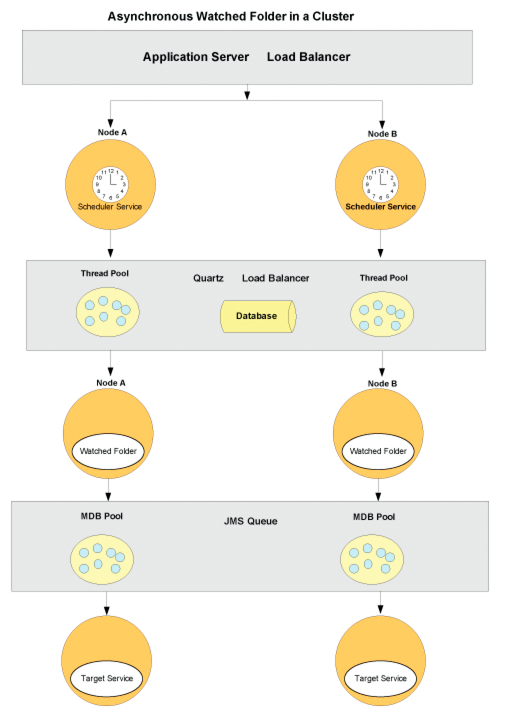

# Configuração de endpoints de pasta observados {#configuring-watched-folder-endpoints}

Um administrador pode configurar uma pasta de rede, conhecida como *pasta assistida*, para que quando um usuário coloque um arquivo (como um PDF file) na pasta assistida, uma operação de serviço configurada seja invocada e manipule o arquivo. Depois que o serviço executa a operação especificada, ele salva o arquivo modificado em uma pasta de saída especificada.

## Configuração do serviço de pasta assistida {#configuring-the-watched-folder-service}

Antes de configurar um ponto de extremidade de pasta monitorada, configure o serviço de Pasta assistida. Os parâmetros de configuração do serviço de Pasta assistida têm dois objetivos:

* Para configurar atributos comuns a todos os endpoints de pasta monitorados
* Para fornecer valores padrão para todos os pontos de extremidade da pasta monitorada

Após configurar o serviço de Pasta assistida, adicione um endpoint de Pasta assistida para o serviço de destino. Ao adicionar o ponto de extremidade, você define valores, como o nome do serviço e o nome da operação para chamar quando os arquivos ou pastas forem colocados na pasta de entrada do serviço de Pasta Assistida configurado. Para obter detalhes sobre como configurar o serviço de Pasta assistida, consulte [Configurações do serviço de pastas assistidas](/help/forms/using/admin-help/configure-service-settings.md#watched-folder-service-settings).

## Criação de uma pasta assistida {#creating-a-watched-folder}

Você pode criar uma pasta assistida das duas maneiras a seguir:

* Ao definir as configurações de um endpoint de pasta assistida, digite o caminho completo para o diretório pai na caixa Caminho e anexe o nome da pasta assistida a ser criada, como mostrado neste exemplo:
   `  C:\MyPDFs\MyWatchedFolder`Como a pasta MyWatchedFolder ainda não existe, AEM formulários tenta criá-la nesse local.

* Crie uma pasta no sistema de arquivos antes de configurar um endpoint de pasta monitorada e digite o caminho completo na caixa Caminho .

Em um ambiente em cluster, a pasta que será usada como uma pasta assistida deve ser acessível, gravável e compartilhada no sistema de arquivos ou na rede. Neste cenário, cada instância do servidor de aplicativos do cluster deve ter acesso à mesma pasta compartilhada.

No Windows, se o servidor de aplicativos estiver sendo executado como um serviço, ele deverá ser iniciado com o acesso apropriado à pasta compartilhada de uma das seguintes maneiras:

* Configurar o logon do serviço do servidor de aplicativos como **parâmetro** para iniciar como um usuário específico com acesso apropriado à pasta monitorada compartilhada.
* Configure a opção Iniciar como Sistema Local do serviço do servidor de aplicativos para Permitir que o Serviço Interaja com o desktop. Essa opção requer que a pasta monitorada compartilhada seja acessível e gravável para todos.

## Encadear pastas vigiadas {#chaining-together-watched-folders}

As pastas vigiadas podem ser encadeadas para que um documento de resultado de uma pasta assistida seja o documento de entrada da próxima pasta assistida. Cada pasta assistida pode invocar um serviço diferente. Ao configurar as pastas monitoradas dessa maneira, vários serviços podem ser chamados. Por exemplo, uma pasta assistida poderia converter arquivos PDF para o Adobe PostScript® e uma segunda pasta assistida poderia converter os arquivos PostScript para o formato PDF/A. Para fazer isso, basta definir a variável *resultado* pasta da pasta assistida definida pelo seu primeiro ponto de extremidade para apontar para a *input* pasta da pasta monitorada definida pelo seu segundo endpoint.

A saída da primeira conversão seria para \path\result. A entrada para a segunda conversão seria \path\result, e a saída da segunda conversão seria para \path\result\result (ou o diretório que você definiu na caixa Pasta de resultados para a segunda conversão).

## Como os usuários interagem com pastas monitoradas {#how-users-interact-with-watched-folders}

Para um endpoint de pasta monitorada, os usuários podem chamar copiando ou arrastando arquivos de entrada ou pastas de suas áreas de trabalho para uma pasta monitorada. Os arquivos serão processados na ordem em que chegarem.

Para endpoints de pasta monitorados, se o trabalho exigir apenas um arquivo de entrada, o usuário poderá copiar esse arquivo para a raiz da pasta monitorada.

Se o trabalho contiver mais de um arquivo de entrada, o usuário deverá criar uma pasta fora da hierarquia de pastas assistida que contenha todos os arquivos necessários. Essa nova pasta deve incluir os arquivos de entrada (e, opcionalmente, um arquivo DDX, se exigido pelo processo). Depois que a pasta de trabalho for construída, o usuário a copiará na pasta de entrada da pasta assistida.

>[!NOTE]
>
>Certifique-se de que o servidor de aplicativos excluiu o acesso aos arquivos na pasta monitorada. Se AEM formulários não puderem excluir os arquivos da pasta de entrada após serem digitalizados, o processo associado será chamado indefinidamente.

## Saída de pasta assistida {#watched-folder-output}

Quando a entrada é uma pasta e a saída consiste em vários arquivos, AEM forms cria uma pasta de saída com o mesmo nome da pasta de entrada e copia os arquivos de saída para essa pasta. Quando a saída consiste em um mapa de documento contendo um par de valor-chave, como a saída de um processo de saída, a chave será usada como o nome do arquivo de saída.

Os nomes de arquivo de saída que resultam de um processo de ponto de extremidade não podem conter caracteres diferentes de letras, números e um ponto (.) antes da extensão do arquivo . AEM formulários converte outros caracteres em seus valores hexadecimais.

Os aplicativos cliente selecionam os documentos de resultado da pasta observada. Os erros de processo são registrados na pasta de falha de pasta monitorada.

## Como a pasta assistida funciona {#how-watched-folder-works}

O módulo Pasta assistida contém estes serviços:

* Serviço de pastas assistidas
* provider.file_scan_service
* provider.file_write_results_service

Além dos serviços listados acima, a Pasta assistida também depende de outros serviços, incluindo o serviço Scheduler para agendar trabalhos e o serviço Gerenciador de trabalhos para suportar a invocação assíncrona de serviços de destino.

### Como a pasta assistida processa uma solicitação de invocação {#how-watched-folder-processes-an-invocation-request}

O serviço de Pasta assistida lida com a criação, atualização e exclusão dos pontos finais. Depois que o administrador cria os endpoints, eles são agendados para serem acionados pelo serviço Scheduler com base no intervalo de repetição especificado ou na expressão cron.

Este diagrama ilustra como a Pasta assistida processa uma solicitação de invocação.

O processo de invocar um serviço usando pastas assistidas é o seguinte:

1. Um aplicativo cliente coloca arquivos ou pastas na pasta de entrada de pasta monitorada.
1. Quando o intervalo de verificação de trabalhos ocorre, o serviço Scheduler chama o provider.file_scan_service para processar os arquivos ou pastas na pasta de entrada.
1. O provider.file_scan_service executa estas tarefas:

   * Verifica a pasta de entrada em busca de arquivos ou pastas que correspondam ao padrão de arquivo de inclusão e exclui arquivos ou pastas para o padrão de arquivo de exclusão especificado. Os arquivos ou pastas mais antigos são selecionados primeiro. Arquivos e pastas que são anteriores ao tempo de espera também são selecionados. Em uma varredura, o número de arquivos ou pastas que são processados é baseado no tamanho do lote. Para obter informações sobre padrões de arquivo, consulte [Sobre padrões de arquivo](configuring-watched-folder-endpoints.md#about-file-patterns). Para obter informações sobre como configurar o tamanho do lote, consulte [Configurações do serviço de pastas assistidas](/help/forms/using/admin-help/configure-service-settings.md#watched-folder-service-settings).
   * Seleciona os arquivos ou pastas para processamento. Se os arquivos ou pastas não forem baixados completamente, eles serão coletados na próxima verificação. Para garantir que as pastas sejam baixadas completamente, os administradores devem criar uma pasta com um nome usando o padrão de arquivo de exclusão. Depois que a pasta tiver todos os arquivos, ela deverá ser renomeada para o padrão especificado no padrão de arquivo de inclusão. Essa etapa garante que a pasta tenha todos os arquivos necessários para chamar o serviço. Para obter mais informações sobre como garantir que as pastas sejam baixadas completamente, consulte [Dicas e truques para pastas assistidas](configuring-watched-folder-endpoints.md#tips-and-tricks-for-watched-folders).
   * Move os arquivos ou pastas para a pasta de preparo após selecioná-los para processamento.
   * Converte os arquivos ou pastas na pasta do palco na entrada apropriada com base nos mapeamentos de parâmetro de entrada do ponto de extremidade. Para obter exemplos de mapeamentos de parâmetros de entrada, consulte [Dicas e truques para pastas assistidas](configuring-watched-folder-endpoints.md#tips-and-tricks-for-watched-folders).

1. O serviço de destino configurado para o endpoint é chamado de forma síncrona ou assíncrona. O serviço de destino é chamado usando o nome de usuário e a senha configurados para o endpoint.

   * A invocação síncrona chama o serviço de destino direta e imediatamente lida com a resposta.
   * Para invocação assíncrona, o serviço de destino é chamado por meio do serviço Gerenciador de trabalhos, que coloca a solicitação em uma fila. O Serviço do Gerenciador de Tarefas, por sua vez, chama o provider.file_write_results_service para manipular os resultados.

1. O provider.file_write_results_service manipula a resposta ou a falha da chamada de serviço de destino. Quando bem-sucedido, a saída é salva na pasta de resultados com base na configuração do ponto de extremidade. O provider.file_write_results_service também preserva a fonte se o endpoint estiver configurado para preservar os resultados após a conclusão com êxito.

   Quando a invocação do serviço de destino resulta em uma falha, o provider.file_write_results_service registra o motivo da falha em um arquivo failure.log e coloca esse arquivo na pasta de falha. A pasta de falha é criada com base nos parâmetros de configuração especificados para o endpoint. Quando o administrador define a opção Preservar em falha para a configuração do ponto de extremidade, o provider.file_write_results_service também copia os arquivos de origem para a pasta de falha. Para obter informações sobre como recuperar arquivos da pasta de falha, consulte [Pontos de falha e recuperação](configuring-watched-folder-endpoints.md#failure-points-and-recovery).

## Configurações de ponto de extremidade de pasta assistida {#watched-folder-endpoint-settings}

Use as seguintes configurações para configurar um ponto de extremidade de pasta monitorada.

**Nome:** (Obrigatório) Identifica o ponto de extremidade. Não inclua um caractere &lt; porque ele truncará o nome exibido no Workspace. Se estiver inserindo um URL como o nome do ponto de extremidade, verifique se ele está em conformidade com as regras de sintaxe especificadas na RFC1738.

**Descrição:** Uma descrição do ponto de extremidade. Não inclua um caractere &lt; porque ele truncará a descrição exibida no Workspace.

**Caminho:** (Obrigatório) Especifica o local da pasta monitorada. Em um ambiente em cluster, essa configuração deve apontar para uma pasta de rede compartilhada acessível de cada computador no cluster.

**Assíncrono:** Identifica o tipo de invocação como assíncrona ou síncrona. O valor padrão é assíncrono. Recomenda-se o assíncrono para processos de longa duração, enquanto o síncrono é recomendado para processos transitórios ou de curta duração.

**Expressão Cron:** Insira uma expressão cron se a pasta assistida tiver de ser agendada usando uma expressão cron. Quando essa configuração é configurada, o Intervalo de repetição é ignorado.

**Intervalo de repetição:** O intervalo em segundos para verificar a entrada da pasta observada. A menos que a configuração de aceleração esteja ativada, o intervalo de repetição deve ser maior que o tempo para processar um trabalho médio; caso contrário, o sistema poderá ficar sobrecarregado. O valor padrão é 5. Consulte a descrição do Tamanho do Lote para obter mais informações.

**Contagem de repetição:** Número de vezes que a pasta assistida verifica a pasta ou o diretório. Um valor de -1 indica varredura indefinida. O valor padrão é -1.

**Acelerador:** Quando essa opção é selecionada, ela limita o número de trabalhos de pasta monitorados que AEM formulários processados em um determinado momento. O número máximo de tarefas é determinado pelo valor Tamanho do Lote. (Consulte Sobre limitação.)

**Nome de usuário:** (Obrigatório) O nome de usuário que é usado ao chamar um serviço de destino da pasta assistida. O valor padrão é SuperAdmin.

**Nome do domínio:** (Obrigatório) O domínio do usuário. O valor padrão é DefaultDom.

**Tamanho do lote:** O número de arquivos ou pastas a serem selecionados por varredura. Utilização para evitar sobrecarga no sistema; a varredura de muitos arquivos de uma vez pode causar uma falha. O valor padrão é 2.

As configurações Repetir intervalo e Tamanho do lote determinam quantos arquivos a Pasta assistida recebe em cada verificação. A Pasta assistida usa um conjunto de encadeamentos do Quartz para digitalizar a pasta de entrada. O conjunto de threads é compartilhado com outros serviços. Se o intervalo de varredura for pequeno, os threads verificarão a pasta de entrada com frequência. Se os arquivos forem soltos com frequência na pasta monitorada, mantenha o intervalo de verificação pequeno. Se os arquivos forem descartados com pouca frequência, use um intervalo de varredura maior para que os outros serviços possam usar os threads.

Se houver um grande volume de arquivos sendo descartados, torne o tamanho do lote grande. Por exemplo, se o serviço chamado pelo endpoint da pasta assistida puder processar 700 arquivos por minuto e os usuários soltarem arquivos na pasta de entrada na mesma taxa, em seguida, definir o Tamanho do lote como 350 e o Intervalo de repetição como 30 segundos ajudará no desempenho da Pasta assistida sem incorrer no custo de varredura da pasta assistida com muita frequência.

Quando os arquivos são soltos na pasta assistida, ela lista os arquivos na entrada, o que pode reduzir o desempenho se a varredura estiver acontecendo a cada segundo. Aumentar o intervalo de varredura pode melhorar o desempenho. Se o volume de arquivos que está sendo descartado for pequeno, ajuste o Tamanho do lote e o Intervalo de repetição apropriadamente. Por exemplo, se 10 arquivos forem descartados a cada segundo, tente definir o Intervalo de repetição como 1 segundo e o Tamanho do lote como 10.

**Tempo de espera:** O tempo, em milissegundos, para aguardar antes de digitalizar uma pasta ou arquivo depois que ele for criado. Por exemplo, se o tempo de espera for de 3.600.000 milissegundos (uma hora) e o arquivo tiver sido criado um minuto atrás, esse arquivo será selecionado após 59 ou mais minutos terem passado. O valor padrão é 0.

Essa configuração é útil para garantir que um arquivo ou pasta seja copiado completamente para a pasta de entrada. Por exemplo, se você tiver um arquivo grande para processar e o arquivo levar dez minutos para ser baixado, defina o tempo de espera como 10&amp;ast;60 &amp;ast;1000 milissegundos. Isso impede que a pasta assistida verifique o arquivo se ele não tiver dez minutos.

**Excluir padrão de arquivo:** Um ponto e vírgula **;** lista delimitada de padrões que uma pasta assistida usa para determinar quais arquivos e pastas digitalizar e coletar. Qualquer arquivo ou pasta com esse padrão não será verificado para processamento.

Essa configuração é útil quando a entrada é uma pasta com vários arquivos. O conteúdo da pasta pode ser copiado para uma pasta com um nome que será selecionado pela pasta assistida. Isso impede que a pasta assistida escolha uma pasta para processamento antes que ela seja completamente copiada na pasta de entrada.

Você pode usar padrões de arquivo para excluir:

* Arquivos com extensões de nome de arquivo específicas; por exemplo, &amp;ast;.dat, &amp;ast;.xml, &amp;ast;.pdf.
* Arquivos com nomes específicos; por exemplo, dados .&amp;ast; excluiria arquivos e pastas nomeados *data1*, *data2* e assim por diante.
* Arquivos com expressões compostas no nome e na extensão, como nestes exemplos:

   * Dados[0-9][0-9][0-9].[dD][aA]&quot;port&quot;
   * &amp;ast;.[dD][Aa]&quot;port&quot;
   * &amp;ast;.[Xx][Mm][Ll]

Para obter mais informações sobre padrões de arquivo, consulte [Sobre padrões de arquivo](configuring-watched-folder-endpoints.md#about-file-patterns).

**Incluir padrão de arquivo:** (Obrigatório) Ponto e vírgula **;** lista delimitada de padrões que a pasta assistida usa para determinar quais pastas e arquivos digitalizar e coletar. Por exemplo, se o Padrão Incluir Arquivo for input&amp;ast;, todos os arquivos e pastas que correspondam a input&amp;ast; são selecionadas. Isso inclui arquivos e pastas chamados input1, input2 e assim por diante.

O valor padrão é &amp;ast; e indica todos os arquivos e pastas.

Você pode usar padrões de arquivo para incluir:

* Arquivos com extensões de nome de arquivo específicas; por exemplo, &amp;ast;.dat, &amp;ast;.xml, &amp;ast;.pdf.
* Arquivos com nomes específicos; por exemplo, dados .&amp;ast; incluiria arquivos e pastas nomeados *data1*, *data2* e assim por diante.
* Arquivos com expressões compostas no nome e na extensão, como nestes exemplos:

   * Dados[0-9][0-9][0-9].[dD][aA]&quot;port&quot;
   * &amp;ast;.[dD][Aa]&quot;port&quot;
   * &amp;ast;.[Xx][Mm][Ll]

Para obter mais informações sobre padrões de arquivo, consulte [Sobre padrões de arquivo](configuring-watched-folder-endpoints.md#about-file-patterns).

**Pasta de resultados:** A pasta onde os resultados salvos são armazenados. Se os resultados não forem exibidos nessa pasta, verifique a pasta de falha. Os arquivos somente leitura não são processados e serão salvos na pasta de falha. Esse valor pode ser um caminho absoluto ou relativo com os seguintes padrões de arquivo:

* %F = prefixo do nome do arquivo
* %E = extensão de nome de arquivo
* %Y = ano (completo)
* %y = ano (últimos dois dígitos)
* %M = mês
* %D = dia do mês
* %d = dia do ano
* %H = hora (relógio de 24 horas)
* %h = hora (relógio de 12 horas)
* %m = minuto
* %s = segundo
* %l = milissegundos
* %R = número aleatório (entre 0 e 9)
* %P = id de processo ou tarefa

Por exemplo, se forem 20 horas em 17 de julho de 2009 e você especificar `C:/Test/WF0/failure/%Y/%M/%D/%H/`, a pasta de resultados é `C:/Test/WF0/failure/2009/07/17/20`.

Se o caminho não for absoluto, mas relativo, a pasta será criada dentro da pasta assistida. O valor padrão é result/%Y/%M/%D/, que é a pasta Result dentro da pasta monitorada. Para obter mais informações sobre padrões de arquivo, consulte [Sobre padrões de arquivo](configuring-watched-folder-endpoints.md#about-file-patterns).

>[!NOTE]
>
>Quanto menor for o tamanho das pastas de resultados, melhor será o desempenho da Pasta assistida. Por exemplo, se a carga estimada da pasta assistida for de 1000 arquivos a cada hora, tente um padrão como `result/%Y%M%D%H` para que uma nova subpasta seja criada a cada hora. Se a carga for menor (por exemplo, 1000 arquivos por dia), você poderá usar um padrão como `result/%Y%M%D`.

**Pasta Preservar:** O local onde os arquivos são armazenados após a varredura e coleta bem-sucedidas. O caminho pode ser absoluto, relativo ou nulo. Você pode usar padrões de arquivo, conforme descrito para Pasta de resultados. O valor padrão é preserve/%Y/%M/%D/.

**Pasta de falhas:** A pasta onde os arquivos de falha são salvos. Esse local é sempre relativo à pasta assistida. Você pode usar padrões de arquivo, conforme descrito para Pasta de resultados.

Os arquivos somente leitura não são processados e serão salvos na pasta de falha.

O valor padrão é falha/%Y/%M/%D/.

**Preservar Em Falha:** Preservar arquivos de entrada em caso de falha na execução da operação em um serviço. O valor padrão é true.

**Substituir nomes de arquivo duplicados:** Quando definido como Verdadeiro, os arquivos na pasta de resultados e na pasta de preservação são substituídos. Quando definido como Falso, os arquivos e pastas com um sufixo de índice numérico são usados para o nome. O valor padrão é Falso.

**Duração da limpeza:** (Obrigatório) Os arquivos e pastas na pasta de resultados são removidos quando são mais antigos que esse valor. Esse valor é medido em dias. Essa configuração é útil para garantir que a pasta de resultados não fique cheia.

Um valor de -1 dias indica que nunca excluir a pasta de resultados. O valor padrão é -1.

**Nome da Operação:** (Obrigatório) Uma lista de operações que podem ser atribuídas ao endpoint da pasta monitorada.

**Mapeamentos do parâmetro de entrada:** Usado para configurar a entrada necessária para processar o serviço e a operação. As configurações disponíveis dependem do serviço que está usando o ponto de extremidade de pasta monitorada. Estes são os dois tipos de entradas:

**Literal:** A pasta assistida usa o valor inserido no campo, conforme ele é exibido. Todos os tipos básicos de Java são suportados. Por exemplo, se uma API usar entrada, como String, long, int e Boolean, a cadeia de caracteres será convertida para o tipo adequado e o serviço será chamado.

**Variável:** O valor inserido é um padrão de arquivo que a pasta assistida usa para escolher a entrada. Por exemplo, no caso do serviço de senha de criptografia, onde o documento de entrada deve ser um arquivo PDF, o usuário pode usar &amp;ast;.pdf como padrão de arquivo. A pasta assistida selecionará todos os arquivos na pasta assistida que correspondem a esse padrão e chamará o serviço para cada arquivo. Quando uma variável é usada, todos os arquivos de entrada são convertidos em documentos. Somente as APIs que usam Documento como tipo de entrada são compatíveis.

**Mapeamentos de parâmetros de saída:** Usado para configurar os resultados do serviço e da operação. As configurações disponíveis dependem do serviço que está usando o ponto de extremidade de pasta monitorada.

A saída da Pasta assistida pode ser um único documento, uma lista de documentos ou um mapa de documentos. Esses documentos de saída são salvos na pasta de resultados, usando o padrão especificado no Mapeamento de parâmetros de saída.

>[!NOTE]
>
>A especificação de nomes que resultam em nomes de arquivo de saída exclusivos melhora o desempenho. Por exemplo, considere o caso em que o serviço retorna um documento de saída e o Mapeamento do parâmetro de saída o mapeia para `%F.%E` (o nome do arquivo e a extensão do arquivo de entrada). Nesse caso, se os usuários soltarem arquivos com o mesmo nome a cada minuto e a pasta de resultados estiver configurada para `result/%Y/%M/%D`e a configuração Substituir nome de arquivo duplicado estiver desativada, a Pasta assistida tentará resolver os nomes de arquivo duplicados. O processo de resolução de nomes de arquivos duplicados pode afetar o desempenho. Nessa situação, alterando o Mapeamento do Parâmetro de Saída para `%F_%h_%m_%s_%l` para adicionar horas, minutos, segundos e milissegundos ao nome, ou garantir que os arquivos descartados tenham nomes exclusivos pode melhorar o desempenho.

## Sobre padrões de arquivo {#about-file-patterns}

Os administradores podem especificar o tipo de arquivo que pode chamar um serviço. Vários padrões de arquivo podem ser estabelecidos para cada pasta assistida. Um padrão de arquivo pode ser uma das seguintes propriedades de arquivo:

* Arquivos com extensões de nome de arquivo específicas; por exemplo, &amp;ast;.dat, &amp;ast;.xml, &amp;ast;.pdf,;
* Arquivos com nomes específicos; por exemplo, dados .&amp;ast;
* Arquivos com expressões compostas no nome e na extensão, como nestes exemplos:

   * Dados[0-9][0-9][0-9].[dD][aA]&quot;port&quot;
   * &amp;ast;.[dD][Aa]&quot;port&quot;
   * &amp;ast;.[Xx][Mm][Ll]

O administrador pode definir o padrão de arquivo da pasta de saída na qual armazenar os resultados. Para as pastas de saída (resultado, preservação e falha), o administrador pode especificar qualquer um desses padrões de arquivo:

* %Y = ano (completo)
* %y = ano (últimos dois dígitos)
* %M = mês,
* %D = dia do mês,
* %d = dia do ano,
* %h = hora,
* %m = minuto,
* %s = segundo,
* %R = número aleatório entre 0 e 9
* %J = Nome do trabalho

Por exemplo, o caminho para a pasta de resultados pode ser `C:\Adobe\Adobe_Experience_Manager_forms\BarcodedForms\%y\%m\%d`.

Os mapeamentos de parâmetros de saída também podem especificar padrões adicionais, como estes:

* %F = Nome do Arquivo de Origem
* %E = Extensão de Nome de Arquivo de Origem

Se o padrão de mapeamento do parâmetro de saída terminar com &quot;File.separator&quot; (que é o separador de caminho), uma pasta será criada e o conteúdo será copiado para essa pasta. Se o padrão não terminar com &quot;File.separator&quot;, o conteúdo (arquivo de resultado ou pasta) será criado com esse nome. Para obter mais informações sobre mapeamentos de parâmetros de saída, consulte [Dicas e truques para pastas assistidas](configuring-watched-folder-endpoints.md#tips-and-tricks-for-watched-folders).

## Sobre limitação {#about-throttling}

Quando a limitação está ativada para um ponto de extremidade de pasta monitorada, ela limita o número de trabalhos de pasta monitorados que podem ser processados em um determinado momento. O número máximo de tarefas é determinado pelo valor Tamanho do Lote, também configurável no endpoint Pasta Assistida. Os documentos de entrada no diretório de entrada da pasta monitorada não serão sondados quando o limite de controle for atingido. Os documentos também permanecerão no diretório de entrada até que outros trabalhos de pasta monitorada sejam concluídos e que outra tentativa de pesquisa seja feita. No caso de processamento síncrono, todas as tarefas processadas em uma única pesquisa serão contadas para o limite de limitação, mesmo que as tarefas sejam processadas consecutivamente em um único thread.

>[!NOTE]
>
>A limitação não é dimensionada com um cluster. Quando a limitação estiver ativada, o cluster como um todo não processará mais do que o número de tarefas especificado no Tamanho do Lote em um determinado momento. Esse limite é de todo o cluster e não é específico para cada nó no cluster. Por exemplo, com um Tamanho de Lote de 2, o limite de limitação poderia ser atingido com um único nó processando duas tarefas, e nenhum outro nó sondaria o diretório de entrada até que uma das tarefas fosse concluída.

### Como funciona o controle {#how-throttling-works}

A Pasta assistida verifica a pasta de entrada em cada Intervalo de repetição, seleciona o número de arquivos especificados no Tamanho do lote e chama o serviço de destino para cada um desses arquivos. Por exemplo, se o Tamanho do Lote for quatro, em cada varredura, a Pasta Assistida selecionará quatro arquivos, criará quatro solicitações de invocação e chamará o serviço de destino. Antes que essas solicitações sejam concluídas, se a Pasta assistida for invocada, ela reiniciará quatro trabalhos, independentemente de as quatro tarefas anteriores serem concluídas.

A limitação impede que a pasta assistida chame novos trabalhos quando os trabalhos anteriores não estiverem concluídos. A Pasta assistida detectará trabalhos em andamento e processará novos trabalhos com base no tamanho do lote menos os trabalhos em andamento. Por exemplo, na segunda invocação , se o número de trabalhos concluídos for apenas três e uma tarefa ainda estiver em andamento, a Pasta assistida chamará apenas mais três trabalhos.

* A Pasta assistida depende do número de arquivos presentes na pasta de estágio para descobrir quantas tarefas estão em andamento. Se os arquivos permanecerem não processados na pasta de preparo, a Pasta assistida não chamará mais tarefas. Por exemplo, se o tamanho do lote for quatro e três trabalhos estiverem paralisados, a Pasta assistida chamará apenas um trabalho em invocações subsequentes. Há vários cenários que podem fazer com que os arquivos permaneçam não processados na pasta de preparo. Quando as tarefas são paralisadas, o administrador pode encerrar o processo na página de administração do fluxo de trabalho de formulários para que a Pasta assistida mova os arquivos para fora da pasta de palco.
* Se o servidor de formulários ficar inativo antes que a Pasta assistida possa chamar as tarefas, o administrador poderá mover os arquivos para fora da pasta de preparo. Para obter mais informações, consulte [Pontos de falha e recuperação](configuring-watched-folder-endpoints.md#failure-points-and-recovery).
* Se o servidor de formulários estiver em execução, mas a Pasta assistida não estiver em execução quando o serviço Gerenciador de trabalhos retornar, o que ocorre quando os serviços não iniciam na sequência ordenada, o administrador pode mover os arquivos para fora da pasta de palco. Para obter mais informações, consulte [Pontos de falha e recuperação](configuring-watched-folder-endpoints.md#failure-points-and-recovery).

## Desempenho e escalabilidade {#performance-and-scalability}

A Pasta assistida pode fornecer 100 pastas no total em um único nó. O desempenho da Pasta assistida depende do desempenho do servidor de formulários. Para invocação assíncrona, o desempenho depende mais da carga do sistema e das tarefas que estão na fila do Gerenciador de trabalhos.

O desempenho da Pasta assistida pode ser aprimorado adicionando nós ao cluster. Os trabalhos de Pasta assistida são distribuídos pelos nós do cluster em virtude do agendador do Quartz e, no caso de solicitações assíncronas, pelo serviço do Gerenciador de trabalhos. Todas as tarefas são mantidas no banco de dados.

A Pasta assistida depende do serviço Scheduler para agendar, desagendar e reagendar as tarefas. Outros serviços, como o serviço Gerenciamento de eventos, o serviço Gerenciador de usuários e o serviço Provedor de email, estão disponíveis e compartilham o conjunto de encadeamentos do serviço Scheduler. Isso pode afetar o desempenho da Pasta assistida. O ajuste do pool de threads do serviço Scheduler será necessário quando todos os serviços começarem a usá-lo.

## Pastas vigiadas em um cluster {#watched-folders-in-a-cluster}

Em um cluster, a Pasta assistida depende do agendador do Quartz e do serviço Gerenciador de trabalhos para balanceamento de carga e failover. Para obter mais informações sobre o comportamento do cluster Quartz, consulte [Documentação do Quartz](https://www.quartz-scheduler.org/documentation).

A Pasta assistida executa essas três tarefas principais em cada pesquisa:

* Verificar a pasta
* Chamar o serviço de target
* Manipule os resultados

O comportamento de balanceamento de carga e failover muda dependendo se a pasta assistida está configurada para invocação síncrona ou assíncrona.

### Pasta assistida síncrona em um cluster {#synchronous-watched-folder-in-a-cluster}

Para invocações síncronas, o balanceador de carga do Quartz decide qual nó receberá o evento de pesquisa. O nó que obtém o evento de pesquisa executará todas as tarefas: verifique a pasta, chame o serviço de destino e manipule os resultados.

Para invocações síncronas, quando um nó falha, o agendador do Quartz envia novos eventos de sondagem para outros nós. As chamadas iniciadas no nó com falha serão perdidas. Para obter mais informações sobre como recuperar os arquivos associados ao trabalho com falha, consulte [Pontos de falha e recuperação](configuring-watched-folder-endpoints.md#failure-points-and-recovery).

### Pasta assistida assíncrona em um cluster {#asynchronous-watched-folder-in-a-cluster}

Para invocações assíncronas, o balanceador de carga do Quartz decide qual nó receberá o evento de pesquisa. O nó que obtém o evento de pesquisa verificará a pasta de entrada e chamará o serviço de destino colocando a solicitação na fila do serviço do Gerenciador de trabalhos. O balanceador de carga do serviço Gerenciador de trabalhos, por sua vez, é responsável por decidir qual nó processará a solicitação de invocação. É possível que, mesmo que o nó A tenha criado a solicitação de invocação, o nó B acabe processando a solicitação. Ou o nó que iniciou a solicitação de invocação também pode acabar processando a solicitação.

Para invocações assíncronas, quando um nó falha, o agendador do Quartz envia novos eventos de pesquisa para outros nós. As solicitações de invocação que foram criadas no nó com falha estarão na fila de serviços do Gerenciador de Tarefas e serão enviadas para outros nós para processamento. Os arquivos para os quais as solicitações de invocação não são criadas permanecerão na pasta de preparo. Para obter mais informações sobre como recuperar os arquivos associados ao trabalho com falha, consulte [Pontos de falha e recuperação](configuring-watched-folder-endpoints.md#failure-points-and-recovery).

## Pontos de falha e recuperação {#failure-points-and-recovery}

Em cada evento de pesquisa, a Pasta assistida bloqueia a pasta de entrada, move os arquivos que correspondem ao padrão de arquivo de inclusão para a pasta do palco e, em seguida, desbloqueia a pasta de entrada. O bloqueio é necessário para que dois threads não captem o mesmo conjunto de arquivos e os processem duas vezes. As chances de isso acontecer aumentam com um pequeno intervalo de repetição e um lote grande. Depois que os arquivos são movidos para a pasta de preparo, a pasta de entrada é desbloqueada para que outros threads possam digitalizar a pasta. Esta etapa ajuda a fornecer alta taxa de transferência, pois outros threads podem digitalizar enquanto um thread está processando os arquivos.

Depois que os arquivos são movidos para a pasta do estágio, as solicitações de invocação são criadas para cada arquivo e o serviço de destino é chamado. Pode haver casos em que a Pasta assistida não possa recuperar os arquivos na pasta de estágio:

* Se o servidor ficar inativo antes que a Pasta assistida possa criar a solicitação de invocação, os arquivos na pasta de estágio permanecerão na pasta de estágio e não serão recuperados.
* Se a Pasta assistida tiver criado com êxito a solicitação de invocação para cada um dos arquivos na pasta de estágio e o servidor falhar, há dois comportamentos com base no tipo de invocação:

**Síncrono:** Se a Pasta assistida estiver configurada para invocar o serviço de forma síncrona, todos os arquivos na pasta de preparo permanecerão não processados na pasta de preparo.

**Assíncrono:** Nesse caso, a Pasta assistida depende do serviço Gerenciador de trabalhos . Se o Serviço do Gerenciador de Tarefas retornar a Pasta Assistida, os arquivos na pasta do estágio serão movidos para a pasta de preservação ou falha com base nos resultados da invocação. Se o serviço Gerenciador de trabalhos não retornar a chamada de Pasta assistida, os arquivos permanecerão não processados na pasta de preparo. Essa situação acontece quando a Pasta assistida não está em execução quando o Gerenciador de trabalhos retorna a chamada.

### Recuperando arquivos de origem não processados na pasta de preparo {#recovering-unprocessed-source-files-in-the-stage-folder}

Quando a Pasta assistida não puder processar os arquivos de origem na pasta de estágio, você poderá recuperar os arquivos não processados.

1. Reinicie o servidor ou nó de aplicativos.
1. (Opcional) Interrompa a pasta assistida de processar novos arquivos de entrada. Se ignorar esta etapa, será muito mais difícil determinar quais arquivos não serão processados na pasta de preparo. Para impedir que a Pasta assistida processe novos arquivos de entrada, execute uma das seguintes tarefas:

   * Em Aplicativos e Serviços, altere o parâmetro Incluir Padrão de Arquivo para o endpoint da pasta assistida para algo que não corresponderá a nenhum dos novos arquivos de entrada (por exemplo, insira `NOMATCH`).
   * Suspenda o processo que está criando novos arquivos de entrada.
   Aguarde até que AEM formulários recupere e processe todos os arquivos. A maioria dos arquivos deve ser recuperada e todos os novos arquivos de entrada processados corretamente. O tempo que você espera que a Pasta assistida recupere e processe os arquivos dependerá da duração da operação a ser chamada e do número de arquivos a serem recuperados.

1. Determine quais arquivos não podem ser processados. Se você esperou um tempo adequado e concluiu a etapa anterior e ainda houver arquivos não processados na pasta do palco, vá para a próxima etapa.

   >[!NOTE]
   >
   >Você pode verificar a data e a hora dos arquivos no diretório stage. Dependendo do número de arquivos e do tempo normal de processamento, você pode determinar quais arquivos são antigos o suficiente para serem considerados presos.

1. Copie os arquivos não processados do diretório stage para o diretório de entrada.
1. Se você tiver impedido a Pasta assistida de processar novos arquivos de entrada na etapa 2, altere o Padrão de inclusão de arquivo para seu valor anterior ou reative o processo que você desativou.

## Considerações de segurança para pastas monitoradas {#security-considerations-for-watched-folders}

Cada pasta assistida é configurada com um nome de usuário e senha. Essas credenciais são usadas ao invocar os serviços. A Pasta assistida depende do fato de a pasta compartilhada estar protegida com o sistema de arquivos de segurança subjacente, de modo que somente o proprietário da pasta assistida possa acessar a pasta compartilhada.

## Dicas e truques para pastas assistidas {#tips-and-tricks-for-watched-folders}

Estas são algumas dicas e truques ao configurar o endpoint de Pasta assistida:

* Se você tiver uma pasta monitorada no Windows que esteja processando arquivos de imagem, especifique valores para a opção Incluir padrão de arquivo ou Excluir padrão de arquivo para impedir que o arquivo Thumbs.db gerado automaticamente do Windows seja sondado pela pasta assistida.
* Se uma expressão cron for especificada, o intervalo de repetição será ignorado. O uso da expressão cron é baseado no sistema de programação de trabalhos de código aberto do Quartz, versão 1.4.0.
* O tamanho do lote é o número de arquivos ou pastas que serão selecionados em cada varredura da pasta assistida. Se o tamanho do lote for definido como dois e dez arquivos ou pastas forem soltos na pasta de entrada de pasta monitorada, somente dois serão coletados em cada verificação. Na próxima verificação, que ocorrerá após o tempo especificado no intervalo de repetição, os próximos dois arquivos serão coletados.
* Para padrões de arquivos, os administradores podem especificar expressões regulares com suporte adicional a padrões curinga para especificar padrões de arquivos. Pasta assistida modifica a expressão regular para suportar padrões curingas como &amp;ast;.&amp;ast; ou &amp;ast;.pdf. Esses padrões curingas não são compatíveis com as expressões regulares.
* A Pasta assistida verifica a pasta de entrada em busca da entrada e não sabe se o arquivo ou pasta de origem é completamente copiado para a pasta de entrada antes de iniciar o processamento do arquivo ou pasta. Para garantir que o arquivo ou pasta de origem seja completamente copiado para a pasta de entrada da pasta assistida antes que o arquivo ou pasta seja selecionado, execute estas tarefas:

   * Use o Tempo de espera, que é o tempo em milissegundos que a pasta assistida aguarda do último tempo modificado. Use esse recurso se tiver arquivos grandes para processar. Por exemplo, se um arquivo levar 10 minutos para ser baixado, especifique o tempo de espera como 10&amp;ast;60 &amp;ast;1000 milissegundos. Isso impedirá que a Pasta assistida pegue o arquivo se ele não for tão antigo quanto 10 minutos.
   * Use o padrão de arquivo de exclusão e inclua o padrão de arquivo. Por exemplo, se o padrão de arquivo de exclusão for `ex*` e o padrão incluir arquivo é `in*`, a Pasta assistida selecionará os arquivos que começam com &quot;in&quot; e não selecionarão os arquivos que começam com &quot;ex&quot;. Para copiar arquivos ou pastas grandes, primeiro renomeie o arquivo ou a pasta para que o nome comece com &quot;ex&quot;. Depois que o arquivo ou pasta chamado &quot;ex&quot; for completamente copiado para a pasta assistida, renomeie-o para &quot;in&amp;ast;&quot;.

* Use a duração da limpeza para manter a pasta de resultados limpa. A Pasta assistida limpa todos os arquivos mais antigos que a duração mencionada na duração da limpeza. A duração é em dias.
* Ao adicionar um endpoint de Pasta assistida, depois de selecionar o nome da operação, o mapeamento do parâmetro de entrada é preenchido. Para cada entrada da operação, um campo de mapeamento de parâmetro de entrada é gerado. Estes são exemplos de mapeamentos de parâmetros de entrada:

   * Para `com.adobe.idp.Document` entrada: Se a operação de serviço tiver uma entrada do tipo `Document`, o administrador pode especificar o tipo de mapeamento como `Variable`. A Pasta assistida selecionará a entrada da pasta de entrada da pasta assistida com base no padrão de arquivo especificado para o parâmetro de entrada. Se o administrador especificar `*.pdf` como parâmetro, cada arquivo que tem uma extensão de .pdf será selecionado, convertido em `com.adobe.idp.Document`e o serviço chamado.
   * Para `java.util.Map` entrada: Se a operação de serviço tiver uma entrada do tipo `Map`, o administrador pode especificar o tipo de mapeamento como `Variable` e insira um valor de mapeamento com um padrão como `*.pdf`. Por exemplo, um serviço precisa de um mapa de dois `com.adobe.idp.Document` objetos que representam dois arquivos na pasta de entrada, como 1.pdf e 2.pdf. A Pasta assistida criará um mapa com a chave como o nome do arquivo e o valor como `com.adobe.idp.Document`.
   * Para `java.util.List` entrada: Se a operação de serviço tiver uma entrada do tipo List, o administrador poderá especificar o tipo de mapeamento como `Variable` e insira um valor de mapeamento com um padrão como `*.pdf`. Quando os arquivos PDF forem soltos na pasta de entrada, a Pasta assistida criará uma lista de `com.adobe.idp.Document` objetos que representam esses arquivos e chamam o serviço de destino.
   * Para `java.lang.String`: O administrador tem duas opções. Primeiro, o administrador pode especificar o tipo de mapeamento como `Literal` e insira um valor de mapeamento como uma string, como `hello.` A Pasta assistida chamará o serviço com a cadeia de caracteres `hello`. Segundo, o administrador pode especificar o tipo de mapeamento como um `Variable` e insira um valor de mapeamento com um padrão como `*.txt`. No último caso, os arquivos com a extensão .txt serão lidos como um documento executado como uma string para chamar o serviço.
   * Tipo primitivo Java: O administrador pode especificar o tipo de mapeamento como `Literal` e forneça o valor. A Pasta assistida chamará o serviço com o valor especificado.

* A Pasta assistida deve funcionar com documentos. As saídas compatíveis são `com.adobe.idp.Document`, `org.w3c.Document`, `org.w3c.Node`, bem como uma lista e um mapa desses tipos. Qualquer outro tipo resultará em uma saída de falha na pasta de falha.
* Se os resultados não estiverem na pasta de resultados, verifique a pasta de falha para ver se ocorreu uma falha.
* A Pasta assistida funciona melhor se usada no modo assíncrono. Nesse modo, a Pasta assistida coloca a solicitação de invocação na fila e retorna as chamadas. A fila é então processada de forma assíncrona. Quando a opção Assíncrona não está definida, a Pasta assistida chama o serviço de destino de forma síncrona e o Mecanismo de processo aguarda até que o serviço seja feito com a solicitação e os resultados sejam produzidos. Se o serviço de destino demorar muito para processar a solicitação, a Pasta assistida pode receber erros de tempo limite.
* A criação de pastas controladas para operações de importação e exportação não permite abstração da extensão do nome do arquivo. Ao chamar o serviço de Integração de dados de formulário usando pastas assistidas, o tipo de extensão do nome de arquivo para o arquivo de saída pode não corresponder ao formato de saída pretendido para o tipo de objeto de documento. Por exemplo, se o arquivo de entrada para uma pasta assistida que chama a operação de exportação for um formulário XFA que contém dados, a saída deverá ser um arquivo de dados XDP. Para obter um arquivo de saída com a extensão de nome de arquivo correta, você pode especificá-lo no mapeamento de parâmetro de saída. Neste exemplo, você pode usar %F.xdp para o mapeamento do parâmetro de saída.
* A Pasta assistida pode processar arquivos de entrada antes de serem copiados completamente para a pasta. O bloqueio de arquivos não é obrigatório no UNIX, pois está no Windows. Por isso, quando um arquivo é copiado em uma pasta assistida, a Pasta assistida pode mover o arquivo para o palco sem esperar a conclusão da cópia do arquivo. Esse comportamento faz com que apenas uma parte do arquivo de entrada seja processada. Atualmente, existem duas soluções alternativas:

   * Solução 1

      1. Especifique um padrão para Excluir padrão de arquivo, como temp&amp;ast;.ps.
      1. Copie os arquivos que começam com temp (por exemplo, temp1.ps) para a pasta assistida.
      1. Depois que o arquivo tiver sido completamente copiado para a pasta monitorada, renomeie o arquivo para corresponder ao padrão especificado para Incluir padrão de arquivo. A Pasta assistida move o arquivo concluído para o estágio.
   * Solução 2

      Se você sabe o tempo máximo que levará para copiar seus arquivos para uma pasta assistida, especifique o tempo em segundos para o Tempo de Espera. A Pasta assistida aguarda o tempo especificado antes de mover o arquivo para o palco.

      Isso não é um problema para arquivos no Windows porque o Windows bloqueia um arquivo quando um thread está gravando. No entanto, isso é um problema para pastas no Windows. Para pastas, você deve seguir as etapas na Solução alternativa 1.

* Se o atributo de ponto de extremidade Preservar Nome da Pasta para Pasta Assistida estiver definido como um caminho de diretório nulo, o diretório de preparo não será limpo como deveria ser. O diretório ainda contém o arquivo processado e a pasta temporária.

## Recomendações específicas do serviço para pastas assistidas {#service-specific-recommendations-for-watched-folders}

Para todos os serviços, você deve ajustar o tamanho do lote e o intervalo de repetição da pasta assistida de modo que a taxa na qual a Pasta assistida seleciona novos arquivos e pastas para processamento não exceda a taxa de trabalhos que podem ser processados pelo servidor de formulários AEM. Os parâmetros reais para usar podem variar dependendo de quantas pastas vigiadas estiverem configuradas, quais serviços estão usando pastas vigiadas e a intensidade das tarefas no processador.

### Gerar recomendações do serviço PDF {#generate-pdf-service-recommendations}

* O serviço Gerar PDF pode converter apenas um arquivo de cada vez para esses tipos de arquivo: Microsoft Word, Microsoft Excel, Microsoft PowerPoint, Projeto Microsoft, AutoCAD, Adobe Photoshop®, Adobe FrameMaker® e Adobe PageMaker®. Estes são empregos de longa duração; portanto, mantenha o tamanho do lote com uma configuração baixa. Também aumente o intervalo de repetição se houver mais nós no cluster.
* Para os tipos de arquivo PostScript (PS), Encapsulated PostScript (EPS) e de imagem, o serviço Gerar PDF pode processar vários arquivos simultaneamente. Você deve ajustar cuidadosamente o tamanho do pool de bean de sessão (que governa o número de conversões que serão feitas em paralelo) dependendo da capacidade do seu servidor e do número de nós no cluster. Em seguida, aumente o tamanho do lote para um número igual ao tamanho do pool de bean de sessão para os tipos de arquivo que você está tentando converter. A frequência de sondagem deve ser determinada pelo número de nós no cluster; no entanto, como o serviço Gerar PDF processa esses tipos de trabalhos rapidamente, você pode configurar o intervalo de repetição para um valor baixo, como 5 ou 10.
* Embora o serviço Gerar PDF possa converter apenas um arquivo OpenOffice de cada vez, a conversão é bem rápida. A lógica acima para conversões de PS, EPS e imagem também se aplica às conversões do OpenOffice.
* Para permitir uma distribuição de carga uniforme no cluster, mantenha o tamanho do lote baixo e aumente o intervalo de repetição.

### recomendações do serviço de formulários com códigos de barras {#barcoded-forms-service-recommendations}

* Para obter o melhor desempenho ao processar formulários com códigos de barras (arquivos pequenos), insira `10` para Tamanho do Lote e `2` para Intervalo de repetição.
* Quando muitos arquivos são colocados na pasta de entrada, erros com arquivos ocultos chamados *thumbs.db* pode ocorrer. Portanto, é recomendável definir o Padrão Incluir Arquivo para os arquivos de inclusão com o mesmo valor especificado para a Variável de entrada (por exemplo, `*.tiff`). Isso impede que a Pasta assistida processe os arquivos do banco de dados.
* Um valor de Tamanho de Lote de `5` e Repetir Intervalo de `2` normalmente é suficiente, pois o serviço Forms com códigos de barras geralmente leva cerca de 0,5 segundos para processar um código de barras.
* A Pasta assistida não espera que o Mecanismo de processo conclua o trabalho antes que ele escolha novos arquivos ou pastas. Ele continua digitalizando a pasta assistida e chamando o serviço de destino. Esse comportamento pode sobrecarregar o mecanismo, causando problemas de recursos e tempos limite. Certifique-se de usar o intervalo de repetição e o tamanho do lote para acelerar a entrada da Pasta assistida. Você pode aumentar o intervalo de repetição e reduzir o tamanho do lote se existirem mais pastas vigiadas ou ativar a limitação no ponto final. Para obter informações sobre limitação, consulte [Sobre limitação](configuring-watched-folder-endpoints.md#about-throttling).
* Pasta assistida representa o usuário especificado no nome de usuário e no nome de domínio. A Pasta assistida chama o serviço como esse usuário se for chamado diretamente ou se o processo tiver duração curta. Para um processo de longa duração, o processo é chamado com o contexto Sistema. Os administradores podem definir políticas do sistema operacional para Pasta assistida para determinar a qual usuário permitir ou negar acesso.
* Use padrões de arquivo para organizar resultados, falhas e preservar pastas. (Consulte [Sobre padrões de arquivo](configuring-watched-folder-endpoints.md#about-file-patterns).)

* A Pasta assistida depende do agendador do Quartz para verificar as pastas vigiadas. O programador do Quartz tem um conjunto de threads para digitalizá-los. Se o intervalo de repetição para a pasta assistida for muito baixo (&lt; 5 segundos) e o tamanho do lote for alto (> 2), poderá ocorrer uma condição de corrida. Quando essa condição ocorre, um arquivo é selecionado por dois threads do Quartz:

   * Um dos threads encontra o arquivo com êxito e chama o serviço de destino com o arquivo .
   * O segundo thread vê o arquivo, mas falha ao tentar descobrir se o arquivo é válido (arquivo de leitura ou gravação), o que causa falhas falsas que indicam que o arquivo não pode ser processado porque é somente leitura. Isto acontece apenas com um intervalo de repetição baixo e um tamanho de lote elevado.
