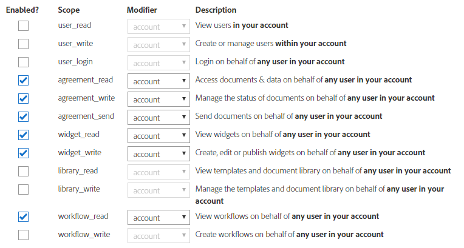

# Integrar o Adobe Sign ao AEM Forms{#integrate-adobe-sign-with-aem-forms}

O Adobe Sign permite workflows de assinatura eletrônica para formulários adaptáveis. As assinaturas eletrônicas melhoram os workflows para processar documentos para áreas legais, de vendas, de folha de pagamento, de gerenciamento de recursos humanos e muitas outras áreas.

Em um cenário típico de formulários adaptáveis e do Adobe Sign, um usuário preenche um formulário adaptável para **solicitar um serviço**. Por exemplo, um aplicativo de cartão de crédito e um formulário de benefícios para o cidadão. Quando um usuário preenche, envia e assina o formulário de aplicativo, ele é enviado ao provedor de serviço para que seja tomada uma ação adicional. O Provedor de serviço revisa o aplicativo e usa o Adobe Sign para marcar o aplicativo aprovado. Para ativar workflows semelhantes de assinatura eletrônica, é possível integrar o Adobe Sign aos formulários do AEM.

Para usar o Adobe Sign com formulários AEM, configure o Adobe Sign nos serviços da AEM Cloud:

## Pré-requisitos {#prerequisites}

Você precisa dos seguintes itens para integrar o Adobe Sign ao AEM Forms:

* Uma conta de desenvolvedor ativa do [Adobe Sign.](https://acrobat.adobe.com/us/en/why-adobe/developer-form.html)
* Um servidor AEM Forms habilitado [para](/help/sites-administering/ssl-by-default.md) SSL.
* Um aplicativo Adobe Sign API.
* Credenciais (ID do cliente e segredo do cliente) do aplicativo Adobe Sign API.

## Configurar o Adobe Sign com o AEM Forms {#configure-adobe-sign-with-aem-forms}

Depois que os pré-requisitos estiverem implementados, execute as seguintes etapas para configurar o Adobe Sign com o AEM Forms na instância Autor:

1. Na instância do autor do AEM Forms, navegue até **Ferramentas**  > **Geral** > Navegador **** de configuração.
1. Na página Navegador **[!UICONTROL de]** configuração, toque em **[!UICONTROL Criar]**.
1. Na caixa de diálogo **[!UICONTROL Criar configuração]** , especifique um **[!UICONTROL Título]** para a configuração, ative Configurações **[!UICONTROL da]** nuvem e toque em **[!UICONTROL Criar]**. Ele cria um container de configuração para serviços em nuvem.
1. Navegue até **Ferramentas** > Serviços  da **Cloud >** Adobe Sign **** e selecione o container de configuração criado na etapa acima.

   >[!NOTE]
   >
   >Certifique-se de que o URL da página de configuração dos serviços em nuvem seja start com **HTTPS**. Caso contrário, [ative o SSL](/help/sites-administering/ssl-by-default.md) para o servidor de formulários AEM.

1. Na página de configuração, toque em **[!UICONTROL Criar]** para criar a configuração do Adobe Sign no AEM Forms.
1. Na guia **[!UICONTROL Geral]** da página **[!UICONTROL Criar configuração]** do Adobe Sign, especifique um **Nome** para a configuração e toque em **Avançar**. Como opção, você pode especificar um título e navegar para selecionar uma miniatura para a configuração.

   Copie o URL na janela atual do navegador. É necessário configurar o aplicativo Adobe Sign com o AEM Forms.

1. Defina as configurações OAuth para o aplicativo Adobe Sign:

   1. Abra uma janela do navegador e faça logon na conta de desenvolvedor do Adobe Sign.
   1. Selecione o aplicativo configurado para o AEM Forms e toque em Configurar OAuth para o aplicativo.
   1. Na caixa **Redirecionar URL** , adicione o URL HTTPS copiado na etapa anterior e clique em **Salvar**.
   1. Ative as seguintes configurações OAuth para o aplicativo Adobe Sign e clique em **Salvar**.
   * aggrement_read
   * aggrement_write
   * aggrement_send
   * widget_write
   * workflow_read
   Para obter informações detalhadas sobre como configurar as configurações OAuth para um aplicativo Adobe Sign e obter as chaves, consulte [Configurar as configurações de Auth para a documentação do desenvolvedor do aplicativo](https://www.adobe.io/apis/documentcloud/sign/docs.html#!adobeio/adobeio-documentation/master/sign/gstarted/configure_oauth.md) .

   

1. Retorne à página **Criar configuração** do Adobe Sign. Na guia **[!UICONTROL Configurações]** , o campo URL **** OAuth menciona o seguinte URL padrão:

   https://secure.na1.echosign.com/public/oauth

   em que:

   **na1** refere-se ao compartilhamento de banco de dados padrão.

   Você pode modificar o valor do compartilhamento de banco de dados. Reinicie o servidor para poder usar o novo valor para o compartilhamento do banco de dados.

1. Especifique a ID **do** cliente (também chamada de ID da aplicação) e o segredo do **cliente**. Selecione a opção **Ativar o Adobe Sign para anexos também** para anexar arquivos anexados a um formulário adaptável ao documento do Adobe Sign enviado para assinatura.

   Tap **[!UICONTROL Connect to Adobe Sign]**. Quando solicitado a fornecer credenciais, forneça o nome de usuário e a senha da conta usada ao criar o aplicativo Adobe Sign.

   Toque em **[!UICONTROL Criar]** para criar a configuração do Adobe Sign.

1. Abra o console da Web do AEM. O URL é `https://'[server]:[port]'/system/console/configMgr`
1. Abra o Serviço de configuração comum do **Forms.**
1. No campo **Permitir** , **selecione** Todos os usuários - Todos os usuários, anônimos ou conectados, podem pré-visualização anexos, verificar e assinar formulários e clique em **Salvar.** A instância do autor está configurada para usar o Adobe Sign.
1. Na instância [Publicar](/help/sites-deploying/deploy.md) , faça logon e abra o seguinte URL:

   `https://<server-name>:<port>/libs/granite/configurations/content/view.html/conf`

1. Repita as etapas de 1 a 12 para configurar o Adobe Sign com o AEM Forms. Use o mesmo título para a configuração (conforme especificado na etapa 3) e o mesmo nome (conforme especificado na etapa 6) para replicar as configurações definidas na instância Autor.

   Agora, o Adobe Sign é integrado ao AEM Forms e está pronto para uso em formulários adaptáveis. Para [usar o serviço Adobe Sign em um formulário](../../forms/using/working-with-adobe-sign.md#configure-adobe-sign-for-an-adaptive-form)adaptável, especifique o container de configuração criado acima nas propriedades do formulário adaptável.

## Configurar o scheduler do Adobe Sign para sincronizar o status de assinatura {#configure-adobe-sign-scheduler-to-sync-the-signing-status}

Um formulário adaptativo habilitado para o Adobe Sign é enviado somente depois que todos os signatários concluírem o processo de assinatura. Por padrão, os serviços de Scheduler do Adobe Sign estão programados para verificar (pesquisar) a resposta do assinante após cada 24 horas. Você pode alterar o intervalo padrão do seu ambiente. Execute as seguintes etapas para alterar o intervalo padrão:

1. Faça logon no servidor do AEM Forms com credenciais de administrador e navegue até **Ferramentas** > **Operações** > Console **da** Web.

   Você também pode abrir o seguinte URL em uma janela do navegador:
   `https://[localhost]:'port'/system/console/configMgr`

1. Localize e abra a opção **Adobe Sign Configuration Service** . Especifique uma expressão [de](https://en.wikipedia.org/wiki/Cron#CRON_expression) cron no campo Expressão **Scheduler** Atualização de status e clique em **Salvar**. Por exemplo, para executar o serviço de configuração diariamente às 00:00, especifique `0 0 0 1/1 * ? *` o campo Expressão **Scheduler Atualização de** status.

O intervalo padrão para sincronizar o status do Adobe Sign agora é alterado.

## Artigos relacionados {#related-articles}

* [Usar o Adobe Sign em um formulário adaptável](../../forms/using/working-with-adobe-sign.md)
* [Usar o Adobe Sign com formulários AEM (Vídeo)](https://helpx.adobe.com/experience-manager/kt/forms/using/adobe-sign-integration-feature-video.html)
* [Integrar o Adobe Sign ao AEM Forms](../../forms/using/adobe-sign-integration-adaptive-forms.md)

