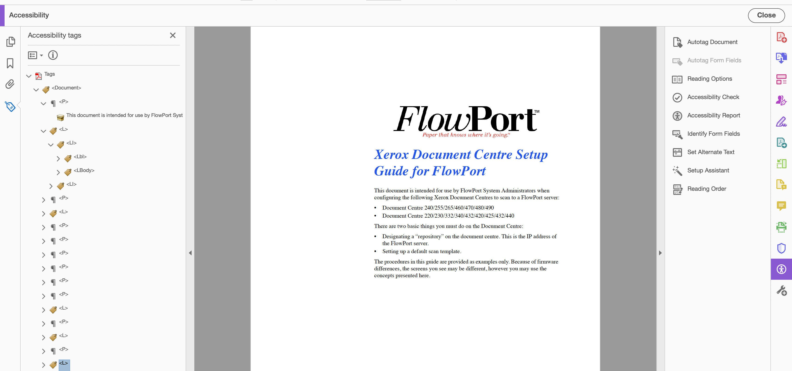

# Using AEM Document Services Programmatically  {#using-aem-document-services-programmatically}

Amostras e exemplos neste documento ajudam você a entender e usar os Serviços de documento AEM em uma AEM Forms em um ambiente OSGi. Para obter amostras e exemplos para AEM Forms no ambiente JEE, consulte

* [Início Rápido da API Java do Serviço de Assinatura](https://experienceleague.adobe.com/docs/experience-manager-65/forms/developer-reference/programming-aem-forms-jee/java-api-quick-start-code-examples/signature-service-java-api-quick.html?lang=pt-BR&#programming-aem-forms-jee)

* [Início Rápido da API Java do Serviço de Criptografia](https://experienceleague.adobe.com/docs/experience-manager-65/forms/developer-reference/programming-aem-forms-jee/java-api-quick-start-code-examples/encryption-service-java-api-quick.html?lang=pt-BR&#developer-reference)

* [Início Rápido da API Java de Serviço de extensões da Acrobat Reader](https://experienceleague.adobe.com/docs/experience-manager-65/forms/developer-reference/programming-aem-forms-jee/java-api-quick-start-code-examples/acrobat-reader-dc-extensions-service.html?lang=pt-BR&#developer-reference)

## Pré-requisitos {#prerequisite}

* [&#128279;](/help/forms/using/install-configure-document-services.md)

* Baixe e configure o [AEM Forms Client SDK](https://helpx.adobe.com/br/aem-forms/kb/aem-forms-releases.html) com o projeto AEM maven. As classes de cliente necessárias para compilar Projetos Maven usando Serviços de documento AEM estão disponíveis no [AEM Forms Client SDK](https://helpx.adobe.com/br/aem-forms/kb/aem-forms-releases.html)

* Saiba [como criar seu projeto AEM usando o Maven](/help/sites-developing/ht-projects-maven.md)

## Serviço DocAssurance {#docassurance-service}

O serviço DocAssurance inclui os seguintes serviços:

* Serviço de assinatura
* Serviço de criptografia
* Serviço de extensão do Reader

Você pode executar as seguintes operações usando o serviço DocAssurance:

* [Adicionar assinatura invisível](/help/forms/using/aem-document-services-programmatically.md#p-adding-an-invisible-signature-field-p)

* [Adicionar campo de assinatura](/help/forms/using/aem-document-services-programmatically.md#p-adding-a-signature-field-nbsp-p)
* [Aplicar carimbo data e hora do documento](/help/forms/using/aem-document-services-programmatically.md#apply-document-timestamp)

* [Obter assinatura](/help/forms/using/aem-document-services-programmatically.md#p-getting-signature-p)
* [Obter Lista de Campos de Assinatura](/help/forms/using/aem-document-services-programmatically.md#p-getting-signature-field-list-nbsp-p)
* [Modificar campos de assinatura](/help/forms/using/aem-document-services-programmatically.md#p-modifying-signature-fields-nbsp-p)

* [Documento seguro](/help/forms/using/aem-document-services-programmatically.md#p-securing-documents-p)

* [Obter Direitos de Uso de Credencial](/help/forms/using/aem-document-services-programmatically.md#p-getting-credential-usage-rights-p)

* [Obter direitos de uso de documento](/help/forms/using/aem-document-services-programmatically.md#p-getting-document-usage-rights-p)

* [Remover direitos de uso](/help/forms/using/aem-document-services-programmatically.md#p-removing-usage-rights-p)
* [Verificar assinaturas digitais](/help/forms/using/aem-document-services-programmatically.md#p-verifying-digital-signatures-p)
* [Verificar várias assinaturas digitais](/help/forms/using/aem-document-services-programmatically.md#p-verifying-multiple-digital-signatures-p)
* [Remover assinaturas digitais](/help/forms/using/aem-document-services-programmatically.md#p-removing-digital-signatures-p)

* [Obter campo de assinatura de certificação](/help/forms/using/aem-document-services-programmatically.md#p-getting-certifying-signature-field-p)
* [Obter Tipo de Criptografia PDF](/help/forms/using/aem-document-services-programmatically.md#p-getting-pdf-encryption-type-p)
* [Remover Criptografia de Senha](/help/forms/using/aem-document-services-programmatically.md#p-removing-password-encryption-from-pdf-p)

* [Remover Criptografia de Certificado](/help/forms/using/aem-document-services-programmatically.md#p-removing-certificate-encryption-p)

>[!NOTE]
>
>Todos esses serviços usam o objeto Documento como parâmetro de entrada para o qual o Javadoc pode ser encontrado na URL [https://helpx.adobe.com/br/experience-manager/6-3/forms/javadocs/index.html](https://helpx.adobe.com/br/experience-manager/6-3/forms/javadocs/index.html)

### Adicionar um campo de assinatura invisível {#adding-an-invisible-signature-field}

As assinaturas digitais aparecem em campos de assinatura, que são campos de formulário que contêm uma representação gráfica da assinatura. Os campos de assinatura podem ser visíveis ou invisíveis. Os assinantes podem usar um campo de assinatura pré-existente ou um campo de assinatura pode ser adicionado programaticamente. Em ambos os casos, o campo de assinatura deve existir antes que um documento PDF possa ser assinado. Você pode adicionar programaticamente um campo de assinatura usando a API Java do serviço de assinatura ou a API do serviço Web de assinatura. Você pode adicionar mais de um campo de assinatura a um documento PDF. No entanto, cada nome de campo de assinatura deve ser exclusivo.

**Sintaxe**: `addInvisibleSignatureField(Document inDoc, String signatureFieldName, FieldMDPOptionSpec fieldMDPOptionsSpec, PDFSeedValueOptionSpec seedValueOptionsSpec, UnlockOptions unlockOptions)`

**Parâmetros de entrada**

<table>
 <tbody>
  <tr>
   <th>Parâmetros</th>
   <th>Descrição</th>
  </tr>
  <tr>
   <td><code>inDoc</code></td>
   <td>Objeto de documento contendo PDF.<br /> </td>
  </tr>
  <tr>
   <td><code>signatureFieldName</code><br /> </td>
   <td>O nome do campo de assinatura. Este parâmetro é obrigatório e não pode ter um valor nulo.<br /> </td>
  </tr>
  <tr>
   <td><code>fieldMDPOptionsSpec</code></td>
   <td>Um objeto <code>FieldMDPOptionSpec</code> que especifica os campos de documento de PDF que são bloqueados após a assinatura do campo de assinatura. Este parâmetro é opcional e pode aceitar um valor nulo.</td>
  </tr>
  <tr>
   <td><code>seedValueOptionsSpec</code></td>
   <td>Um objeto <code>SeedValueOptions</code> que especifica os vários valores de semente para o campo. T Este parâmetro é opcional e pode aceitar um valor nulo.<span class="acrolinxCursorMarker"></span></td>
  </tr>
  <tr>
   <td><code>unlockOptions</code></td>
   <td>Inclui os parâmetros necessários para desbloquear um arquivo criptografado. Este parâmetro é necessário somente para arquivos criptografados.</td>
  </tr>
 </tbody>
</table>

Esta é uma amostra de código Java que adiciona um campo de assinatura invisível a um documento PDF.

```java
/*************************************************************************
 *
 * ADOBE CONFIDENTIAL
 * ___________________
 *
 * Copyright 2014 Adobe Systems Incorporated
 * All Rights Reserved.
 *
 * NOTICE:  All information contained herein is, and remains
 * the property of Adobe Systems Incorporated and its suppliers,
 * if any.  The intellectual and technical concepts contained
 * herein are proprietary to Adobe Systems Incorporated and its
 * suppliers and are protected by trade secret or copyright law.
 * Dissemination of this information or reproduction of this material
 * is strictly forbidden unless prior written permission is obtained
 * from Adobe Systems Incorporated.
 **************************************************************************/
package com.adobe.docassurance.samples;

import java.io.File;
import java.io.IOException;

import org.apache.felix.scr.annotations.Component;
import org.apache.felix.scr.annotations.Reference;
import org.apache.felix.scr.annotations.Service;

import com.adobe.aemfd.docmanager.Document;
import com.adobe.fd.docassurance.client.api.DocAssuranceException;
import com.adobe.fd.docassurance.client.api.DocAssuranceService;
import com.adobe.fd.signatures.client.types.PositionRectangle;
import com.adobe.fd.signatures.client.types.exceptions.DuplicateSignatureFieldException;
import com.adobe.fd.signatures.client.types.exceptions.InvalidArgumentException;
import com.adobe.fd.signatures.client.types.exceptions.PDFOperationException;
import com.adobe.fd.signatures.client.types.exceptions.PermissionsException;
import com.adobe.fd.signatures.client.types.exceptions.SignaturesBaseException;
import com.adobe.fd.signatures.pdf.inputs.UnlockOptions;

/**
 * Digital signatures appear in signature fields, which are form fields that contain a graphic representation of the signature.
 * Signature fields can be visible or invisible. Signers can use a pre existing signature field, or a signature field can be
 * programmatically added. In either case, the signature field must exist before a PDF document can be signed.
 * You can programmatically add a signature field by using the Signature service Java API or Signature web service API.
 * You can add more than one signature field to a PDF document; however, each signature field name must be unique.
 *
 * The following Java code example adds an invisible signature field named SignatureField1 to a PDF document.
 */

@Component
@Service(value=AddInvisibleSignatureField.class)
public class AddInvisibleSignatureField {

 @Reference
 private DocAssuranceService docAssuranceService;

 /**
  *
  * @param inputFile - path to an pdf document stored at disk
  * @param outputFile - path where the output file has to be saved
  * @throws SignaturesBaseException
  * @throws DuplicateSignatureFieldException
  * @throws PermissionsException
  * @throws PDFOperationException
  * @throws InvalidArgumentException
  * @throws DocAssuranceException
  *
  */
 public void addInvisibleSignatureField(String inputFile, String outputFile) throws InvalidArgumentException, PDFOperationException, PermissionsException, DuplicateSignatureFieldException, SignaturesBaseException, DocAssuranceException {

  File inFile = new File(inputFile);
  Document inDoc = new Document(inFile);

  File outFile = new File(outputFile);
  Document outDoc = null;

        //Specify the name of the signature field
        String fieldName = "SignatureField1";

        //Create a  PositionRectangle object that specifies
        //the signature fields location
        PositionRectangle post = new  PositionRectangle(193,47,133,12);

        //Specify the page number that will contain the signature field
        java.lang.Integer pageNum = new java.lang.Integer(1);

        //Add a signature field to the PDF document
        try {
   outDoc = docAssuranceService.addInvisibleSignatureField(
       inDoc,
       fieldName,
       null,
       null,
       null);
  } catch (Exception e1) {
   // TODO Auto-generated catch block
   e1.printStackTrace();
  } // for an encrypted PDF input, pass unlock options

        //save the outDoc
        try {
   outDoc.copyToFile(outFile);
  } catch (IOException e) {
   // TODO Auto-generated catch block
   e.printStackTrace();
  }
 }

 /**
  *
  * UnlockOptions to be passed to addSignatureField() API to add a signature field in an encrypted pdf document.
  */
 private UnlockOptions getUnlockOptions(){
        UnlockOptions unlockOptions = new UnlockOptions();
        //sets the Open Password for password encrypted PDF
        unlockOptions.setPassword("OpenPassword");

        //for Certificate Encrypted Document, set the alias of the credential uploaded in the user's key store
        //and corresponding resource resolver

        return unlockOptions;

    }
}
```

Você também pode usar a especificação [CAdES](https://en.wikipedia.org/wiki/CAdES_%28computing%29)para assinar documentos. Use o código de exemplo a seguir para configurar o formato de assinatura para [CAdES.](https://en.wikipedia.org/wiki/CAdES_%28computing%29)

```java
SigningFormat signingFormat = SigningFormat.CAdES;
sigAppearence.setSigningFormat(signingFormat);
signOptions.setSigAppearence(sigAppearence);
```

### Adição de um campo de assinatura  {#adding-a-signature-field-nbsp}

Você pode adicionar programaticamente um campo de assinatura usando a API Java do serviço de assinatura ou a API do serviço Web de assinatura. É possível adicionar vários campos de assinatura a um documento PDF. No entanto, cada nome de campo de assinatura deve ser exclusivo.

**Sintaxe**:

```java
public Document addSignatureField(Document inDoc,
 String signatureFieldName,
 Integer pageNo,
 PositionRectangle positionRectangle,
 FieldMDPOptionSpec fieldMDPOptionsSpec,
 PDFSeedValueOptionSpec seedValueOptionsSpec, UnlockOptions unlockOptions)
```

**Parâmetros de entrada**

<table>
 <tbody>
  <tr>
   <th>Parâmetros</th>
   <th>Descrição</th>
  </tr>
  <tr>
   <td><code>inDoc</code></td>
   <td>Document object containing PDF</td>
  </tr>
  <tr>
   <td><code>signatureFieldName</code></td>
   <td>Nome do campo de assinatura. This parameter is mandatory and cannot accept a null value.</td>
  </tr>
  <tr>
   <td><code>pageNumber</code></td>
   <td>O número da página na qual o campo de assinatura é adicionado. Os valores válidos são 1 para o número de páginas contidas no documento. Este parâmetro é obrigatório e não pode aceitar um valor nulo.<br /> </td>
  </tr>
  <tr>
   <td><code>positionRectangle</code></td>
   <td><code>PositionRectangle object</code> Este parâmetro é obrigatório e não pode aceitar um valor nulo. Se o retângulo especificado não estiver pelo menos parcialmente na caixa de corte da página especificada, um <code>InvalidArgumentException</code> será lançado. Além disso, nem a altura nem a largura do retângulo especificado podem ser 0 ou negativas. As coordenadas X (inferior esquerdo) ou Y (inferior esquerdo) podem ser 0 ou maiores, mas não negativas, e são relativas à caixa de corte da página.</td>
  </tr>
  <tr>
   <td><code>fieldMDPOptionsSpec</code></td>
   <td><code>FieldMDPOptionSpec</code> This is an optional parameter and can be null.</td>
  </tr>
  <tr>
   <td><code>seedValueOptionsSpec</code></td>
   <td>Um objeto <code>SeedValueOptions</code> que especifica os vários valores de semente para o campo. Este é um parâmetro opcional e pode ser nulo.</td>
  </tr>
  <tr>
   <td><code>unlockOptions</code></td>
   <td>Inclui os parâmetros necessários para desbloquear um arquivo criptografado. Esse parâmetro é necessário somente para os arquivos criptografados.</td>
  </tr>
 </tbody>
</table>

Este é um exemplo de código Java que adiciona um campo de assinatura a um documento PDF.

```java
/*************************************************************************
 *
-------------------------------------------------------------
*ADOBE SYSTEMS INCORPORATED
*Copyright 2014 Adobe Systems Incorporated
*All Rights Reserved.

*NOTICE:  Adobe permits you to use, modify, and distribute this file in accordance with the
*terms of the Adobe license agreement accompanying it.  If you have received this file from a
*source other than Adobe, then your use, modification, or distribution of it requires the prior
*written permission of Adobe.
-------------------------------------------------------------------------------------------------

 **************************************************************************/
package com.adobe.docassurance.samples;

import java.io.File;
import java.io.IOException;

import org.apache.felix.scr.annotations.Component;
import org.apache.felix.scr.annotations.Reference;
import org.apache.felix.scr.annotations.Service;

import com.adobe.aemfd.docmanager.Document;
import com.adobe.fd.docassurance.client.api.DocAssuranceException;
import com.adobe.fd.docassurance.client.api.DocAssuranceService;
import com.adobe.fd.signatures.client.types.PositionRectangle;
import com.adobe.fd.signatures.client.types.exceptions.DuplicateSignatureFieldException;
import com.adobe.fd.signatures.client.types.exceptions.InvalidArgumentException;
import com.adobe.fd.signatures.client.types.exceptions.PDFOperationException;
import com.adobe.fd.signatures.client.types.exceptions.PermissionsException;
import com.adobe.fd.signatures.client.types.exceptions.SignaturesBaseException;
import com.adobe.fd.signatures.pdf.inputs.UnlockOptions;

/**
 * Digital signatures appear in signature fields, which are form fields that contain a graphic representation of the signature.
 * Signature fields can be visible or invisible. Signers can use a pre existing signature field, or a signature field can be
 * programmatically added. In either case, the signature field must exist before a PDF document can be signed.
 * You can programmatically add a signature field by using the Signature service Java API or Signature web service API.
 * You can add more than one signature field to a PDF document; however, each signature field name must be unique.
 *
 * The following Java code example adds a signature field named SignatureField1 to a PDF document.
 */

@Component
@Service(value=AddSignatureField.class)
public class AddSignatureField {

 @Reference
 private DocAssuranceService docAssuranceService;

 /**
  *
  * @param inputFile - path to an pdf document stored at disk
  * @param outputFile - path where the output file has to be saved
  * @throws SignaturesBaseException
  * @throws DuplicateSignatureFieldException
  * @throws PermissionsException
  * @throws PDFOperationException
  * @throws InvalidArgumentException
  * @throws DocAssuranceException
  *
  */
 public void addSignatureField(String inputFile, String outputFile) throws InvalidArgumentException, PDFOperationException, PermissionsException, DuplicateSignatureFieldException, SignaturesBaseException, DocAssuranceException {

  File inFile = new File(inputFile);
  Document inDoc = new Document(inFile);

  File outFile = new File(outputFile);
  Document outDoc = null;

        //Specify the name of the signature field
        String fieldName = "SignatureField1";

        //Create a  PositionRectangle object that specifies
        //the signature fields location
        PositionRectangle post = new  PositionRectangle(193,47,133,12);

        //Specify the page number that will contain the signature field
        java.lang.Integer pageNum = new java.lang.Integer(1);

        //Add a signature field to the PDF document
        try {
   outDoc = docAssuranceService.addSignatureField(
       inDoc,
       fieldName,
       pageNum,
       post,
       null,
       null,
       null);
  } catch (Exception e1) {
   // TODO Auto-generated catch block
   e1.printStackTrace();
  } // for an encrypted PDF input, pass unlock options

        //save the outDoc
        try {
   outDoc.copyToFile(outFile);
  } catch (IOException e) {
   // TODO Auto-generated catch block
   e.printStackTrace();
  }
 }

 /**
  *
  * UnlockOptions to be passed to addSignatureField() API to add a signature field in an encrypted pdf document.
  */
 private UnlockOptions getUnlockOptions(){
        UnlockOptions unlockOptions = new UnlockOptions();
        //sets the Open Password for password encrypted PDF
        unlockOptions.setPassword("OpenPassword");

        //for Certificate Encrypted Document, set the alias of the credential uploaded in the user's key store
        //and corresponding resource resolver

        return unlockOptions;

    }
}
```

### Aplicar carimbo data e hora do documento {#apply-document-timestamp}

Você pode programaticamente carimbar um documento de acordo com as especificações do [PAdES 4](https://en.wikipedia.org/wiki/PAdES). Você também pode usar a especificação [CAdES](https://en.wikipedia.org/wiki/CAdES_%28computing%29) para documentos relacionados a transações.

**Sintaxe**: `applyDocumentTimeStamp(Document doc, VerificationTime verificationTime, ValidationPreferences dssPrefs, ResourceResolver resourceResolver, UnlockOptions unlockOptions)`

**Parâmetros de entrada**

<table>
 <tbody>
  <tr>
   <th>Parâmetros</th>
   <th>Descrição</th>
  </tr>
  <tr>
   <td><code>doc</code><br /> </td>
   <td>Objeto de documento contendo PDF.<br /> </td>
  </tr>
  <tr>
   <td><code>VerificationTime</code></td>
   <td>A hora em que a assinatura deve ser validada<br /> </td>
  </tr>
  <tr>
   <td><code>ValidationPreferences</code> </td>
   <td>Preferências para controlar configurações de validação.</td>
  </tr>
  <tr>
   <td><code>ResourceResolver</code></td>
   <td>Resolvedor de recursos para o armazenamento de confiança granite.</td>
  </tr>
  <tr>
   <td><code>UnlockOptions</code></td>
   <td>Inclui os parâmetros necessários para desbloquear um arquivo criptografado. Isso é necessário somente se o arquivo estiver criptografado.</td>
  </tr>
 </tbody>
</table>

As amostras de código a seguir adicionam um carimbo de data/hora a um documento de acordo com [PAdES 4](https://en.wikipedia.org/wiki/PAdES).

```java
package com.adobe.signatures.test;

import java.io.File;

import javax.jcr.Session;

import org.apache.felix.scr.annotations.Component;
import org.apache.felix.scr.annotations.Service;
import org.apache.sling.api.resource.ResourceResolver;
import org.apache.sling.jcr.api.SlingRepository;
import org.apache.sling.jcr.resource.JcrResourceResolverFactory;

import com.adobe.aemfd.docmanager.Document;
import com.adobe.fd.docassurance.client.api.DocAssuranceService;
import com.adobe.fd.signatures.client.types.VerificationTime;
import com.adobe.fd.signatures.pdf.inputs.ValidationPreferences;
import com.adobe.fd.signatures.pdf.inputs.ValidationPreferencesImpl;
import com.adobe.fd.signatures.pki.client.types.common.RevocationCheckStyle;
import com.adobe.fd.signatures.pki.client.types.prefs.CRLPreferences;
import com.adobe.fd.signatures.pki.client.types.prefs.CRLPreferencesImpl;
import com.adobe.fd.signatures.pki.client.types.prefs.OCSPPreferencesImpl;
import com.adobe.fd.signatures.pki.client.types.prefs.PKIPreferences;
import com.adobe.fd.signatures.pki.client.types.prefs.PKIPreferencesImpl;
import com.adobe.fd.signatures.pki.client.types.prefs.PathValidationPreferences;
import com.adobe.fd.signatures.pki.client.types.prefs.PathValidationPreferencesImpl;
import com.adobe.fd.signatures.pki.client.types.prefs.TSPPreferences;
import com.adobe.fd.signatures.pki.client.types.prefs.TSPPreferencesImpl;

 @Component
 @Service(value=Test.class)
 public class Test {

     @Reference
     private DocAssuranceService docAssuranceService;

     @Reference
     private SlingRepository slingRepository;

     @Reference
     private JcrResourceResolverFactory jcrResourceResolverFactory ;

     /**
      *
      * @param inputFile - path to the pdf document stored at disk
      * @param outputFile - path to the pdf document where the output needs to be stored
      * @throws Exception
      */
     public void TimeStamp(String inputFile, String outputFile) throws Exception{

         File inFile = new File(inputFile);
         Document inDoc = new Document(inFile);

         File outFile = new File(outputFile);
         Document outDoc = null;

         Session adminSession = null;
         ResourceResolver resourceResolver = null;
         try {

              /** resourceResolver with admin privileges to be passed to SignatureServiceAPI and Reader Extensions
              the resource resolver for signature options has to be corresponding to the user who has the signing certificate in his granite key store
              the resource resolver for signature options has to be corresponding to the user who has the credential for reader extension in his granite key store
              here we are using the same resource resolver
              */
              adminSession = slingRepository.loginAdministrative(null);
              resourceResolver = jcrResourceResolverFactory.getResourceResolver(adminSession);

              VerificationTime verificationTime = getVerificationTimeForPades();
              ValidationPreferences dssPrefs = getValidationPreferences();

              //retrieve specifications for each of the services, you may pass null if you do not want to use that service
              //for encrypted document pass Unlock Options - see the method getUnlockOptions() below
               outDoc = docAssuranceService.applyDocumentTimeStamp(inDoc, verificationTime, dssPrefs, resourceResolver, null);
         }
         finally{
             /**
              * always close the PDFDocument object after your processing is done.
              */
             if(inDoc != null){
                 inDoc.close();
             }
             if(adminSession != null && adminSession.isLive()){
                 if(resourceResolver != null){
                     resourceResolver.close();
                 }
                 adminSession.logout();
             }
         }

         outDoc.copyToFile(outFile);

     }

  public  VerificationTime getVerificationTimeForPades(){

         return VerificationTime.SECURE_TIME_ELSE_CURRENT_TIME;

     }

 /**
       * sets ValidationPreferences
       */
      private static ValidationPreferences getValidationPreferences(){

         ValidationPreferencesImpl prefs = new ValidationPreferencesImpl();
         prefs.setPKIPreferences(getPKIPreferences());

         //set the unlock options for processing an encrypted pdf document, do not set if the input doc is unprotected

         return prefs;

     }

   /**
       * sets PKIPreferences
       */
     private static PKIPreferences getPKIPreferences(){
         PKIPreferences pkiPref = new PKIPreferencesImpl();
         pkiPref.setCRLPreferences(getCRLPreferences());
         pkiPref.setPathPreferences(getPathValidationPreferences());
         pkiPref.setOCSPPreferences(getOCSPPref());
         pkiPref.setTSPPreferences(getTspPref());
         return pkiPref;
     }

   /**
      * sets CRL Preferences
      */
     private static CRLPreferences getCRLPreferences(){

         CRLPreferencesImpl crlPrefs = new CRLPreferencesImpl();
         crlPrefs.setRevocationCheck(RevocationCheckStyle.BestEffort);
         crlPrefs.setGoOnline(true);
         return crlPrefs;
     }

     /**
      *
      * sets PathValidationPreferences
      */
     private static PathValidationPreferences getPathValidationPreferences(){
         PathValidationPreferencesImpl pathPref = new PathValidationPreferencesImpl();
         pathPref.setDoValidation(true);
         return pathPref;

     }

   public static TSPPreferences getTspPref(){
   TSPPreferencesImpl tspPrefs=new TSPPreferencesImpl();
   char pass[]=new char[9];

   tspPrefs.setTspServerURL("TSPPrefs_ServerURL");
   tspPrefs.setUsername("TSPPrefs_Username");
   tspPrefs.setPassword(pass);
   tspPrefs.setSize(10240);
   return tspPrefs;
   }

     private static OCSPPreferencesImpl getOCSPPref(){
         OCSPPreferencesImpl ocsp = new OCSPPreferencesImpl();
         ocsp.setRevocationCheck(RevocationCheckStyle.BestEffort);
         return ocsp;
     }

}
```

### Obtendo assinatura {#getting-signature}

Você pode recuperar os nomes de todos os campos de assinatura que estão em um documento PDF que você deseja assinar ou certificar. Se você não tiver certeza dos nomes dos campos de assinatura em um documento PDF ou para verificar os nomes, recupere os nomes de forma programática. O serviço de Assinatura retorna o nome totalmente qualificado do campo de assinatura, como `form1[0].grantApplication[0].page1[0].SignatureField1[0]`.

**Sintaxe**: `getSignature(Document doc, String signatureFieldName, UnlockOptions unlockOptions)`

**Parâmetros de entrada**

<table>
 <tbody>
  <tr>
   <th>Parâmetros</th>
   <th>Descrição</th>
  </tr>
  <tr>
   <td><code>doc</code><br /> </td>
   <td>Objeto de documento contendo PDF.<br /> </td>
  </tr>
  <tr>
   <td><code>signatureFieldName</code></td>
   <td>O nome do campo de assinatura que contém uma assinatura. Especifique o nome totalmente qualificado do campo de assinatura. Ao usar um documento PDF baseado em um formulário XFA, o nome parcial do campo de assinatura pode ser usado. Por exemplo, <code>form1[0].#subform[1].SignatureField3[3]</code> pode ser especificado como <code>SignatureField3[3]</code>.</td>
  </tr>
  <tr>
   <td><code>UnlockOptions</code></td>
   <td>Inclui os parâmetros necessários para desbloquear um arquivo criptografado. Isso é necessário somente se o arquivo estiver criptografado.</td>
  </tr>
 </tbody>
</table>

O exemplo de código Java a seguir recupera as informações de assinatura para o campo de assinatura fornecido em um documento PDF.

```java
/*************************************************************************
 *
 * ADOBE CONFIDENTIAL
 * ___________________
 *
 * Copyright 2014 Adobe Systems Incorporated
 * All Rights Reserved.
 *
 * NOTICE:  All information contained herein is, and remains
 * the property of Adobe Systems Incorporated and its suppliers,
 * if any.  The intellectual and technical concepts contained
 * herein are proprietary to Adobe Systems Incorporated and its
 * suppliers and are protected by trade secret or copyright law.
 * Dissemination of this information or reproduction of this material
 * is strictly forbidden unless prior written permission is obtained
 * from Adobe Systems Incorporated.
 **************************************************************************/
package com.adobe.docassurance.samples;

import java.io.File;
import java.util.Iterator;
import java.util.List;

import org.apache.felix.scr.annotations.Component;
import org.apache.felix.scr.annotations.Reference;
import org.apache.felix.scr.annotations.Service;

import com.adobe.aemfd.docmanager.Document;
import com.adobe.fd.docassurance.client.api.DocAssuranceService;
import com.adobe.fd.signatures.client.types.PDFSignatureField;
import com.adobe.fd.signatures.client.types.exceptions.DuplicateSignatureFieldException;
import com.adobe.fd.signatures.client.types.exceptions.InvalidArgumentException;
import com.adobe.fd.signatures.client.types.exceptions.PDFOperationException;
import com.adobe.fd.signatures.client.types.exceptions.PermissionsException;
import com.adobe.fd.signatures.client.types.exceptions.SignaturesBaseException;
import com.adobe.fd.signatures.pdf.inputs.UnlockOptions;
import com.adobe.fd.signatures.client.types.PDFSignature;

/**
 * You can retrieve the names of all signature fields that are in a PDF document that you want to sign or certify.
 * If you are unsure of the signature field names that are in a PDF document or you want to verify the names, you can
 * programmatically retrieve them. The Signature service returns the fully qualified name of the signature field, such as
 * form1[0].grantApplication[0].page1[0].SignatureField1[0].
 *
 * The following Java code example retrieves the Signature Info for the given signature field in a PDF document.
 */

@Component
@Service(value=GetSignature.class)
public class GetSignature {

 @Reference
 private DocAssuranceService docAssuranceService;

 /**
  *
  * @param inputFile - path to the pdf document stored at disk
  * @throws SignaturesBaseException
  * @throws DuplicateSignatureFieldException
  * @throws PermissionsException
  * @throws PDFOperationException
  * @throws InvalidArgumentException
  *
  */
 public void GetSignature(String inputFile) throws Exception {

  File inFile = new File(inputFile);
  Document inDoc = new Document(inFile);

  //Retrieve signature data for a given signature field.
  //for encrypted document pass Unlock Options - see the method getUnlockOptions() below
        PDFSignature pdfSignature = docAssuranceService.getSignature(inDoc,"fieldName",null);

   }

  /**
     * sets Unlock Options for encrypted PDF
     */
    private UnlockOptions getUnlockOptions(){
        UnlockOptions unlockOptions = new UnlockOptions();
        //sets the Open Password for password encrypted PDF
        unlockOptions.setPassword("OpenPassword");

        //for Certificate Encrypted Document, set the alias of the credential uploaded in the user's key store
        //and corresponding resource resolver

        return unlockOptions;

    }
}
```

### Obtendo lista de campos de assinatura  {#getting-signature-field-list-nbsp}

Você pode recuperar os nomes de todos os campos de assinatura que estão em um documento PDF que você deseja assinar ou certificar. Se não tiver certeza dos nomes dos campos de assinatura em um documento PDF, você poderá recuperá-los e verificá-los de forma programática. O serviço de Assinatura retorna o nome totalmente qualificado do campo de assinatura, como `form1[0].grantApplication[0].page1[0].SignatureField1[0]`.

**Sintaxe**: `public List <PDFSignatureField> getSignatureFieldList (Document inDoc, UnlockOptions unlockOptions)`

**Parâmetros de entrada**

| Parâmetros | Descrição |
|---|---|
| `inDoc` | Objeto de documento que contém PDF |
| `unlockOptions` | Inclui os parâmetros necessários para desbloquear um arquivo criptografado. Isso é necessário somente se o arquivo estiver criptografado. |

O exemplo de código Java a seguir recupera os nomes dos campos de assinatura em um documento PDF.

```java
/*************************************************************************
 *
 *
-------------------------------------------------------------
*ADOBE SYSTEMS INCORPORATED
*Copyright 2014 Adobe Systems Incorporated
*All Rights Reserved.

*NOTICE:  Adobe permits you to use, modify, and distribute this file in accordance with the
*terms of the Adobe license agreement accompanying it.  If you have received this file from a
*source other than Adobe, then your use, modification, or distribution of it requires the prior
*written permission of Adobe.
-------------------------------------------------------------------------------------------------
**************************************************************************/
package com.adobe.docassurance.samples;

import java.io.File;
import java.util.Iterator;
import java.util.List;

import org.apache.felix.scr.annotations.Component;
import org.apache.felix.scr.annotations.Reference;
import org.apache.felix.scr.annotations.Service;

import com.adobe.aemfd.docmanager.Document;
import com.adobe.fd.docassurance.client.api.DocAssuranceService;
import com.adobe.fd.signatures.client.types.PDFSignatureField;
import com.adobe.fd.signatures.client.types.exceptions.DuplicateSignatureFieldException;
import com.adobe.fd.signatures.client.types.exceptions.InvalidArgumentException;
import com.adobe.fd.signatures.client.types.exceptions.PDFOperationException;
import com.adobe.fd.signatures.client.types.exceptions.PermissionsException;
import com.adobe.fd.signatures.client.types.exceptions.SignaturesBaseException;
import com.adobe.fd.signatures.pdf.inputs.UnlockOptions;

/**
 * You can retrieve the names of all signature fields that are in a PDF document that you want to sign or certify.
 * If you are unsure of the signature field names that are in a PDF document or you want to verify the names, you can
 * programmatically retrieve them. The Signature service returns the fully qualified name of the signature field, such as
 * form1[0].grantApplication[0].page1[0].SignatureField1[0].
 *
 * The following Java code example retrieves the names of signature fields in a PDF document.
 */

@Component
@Service(value=GetSignatureFields.class)
public class GetSignatureFields {

 @Reference
 private DocAssuranceService docAssuranceService;

 /**
  *
  * @param inputFile - path to the pdf document stored at disk
  * @throws SignaturesBaseException
  * @throws DuplicateSignatureFieldException
  * @throws PermissionsException
  * @throws PDFOperationException
  * @throws InvalidArgumentException
  *
  */
 public void getSignatureFields(String inputFile) throws Exception {

  File inFile = new File(inputFile);
  Document inDoc = new Document(inFile);

  //Retrieve the name of the document's signature fields
  //for encrypted document pass Unlock Options - see the method getUnlockOptions() below
        List fieldNames = docAssuranceService.getSignatureFieldList(inDoc,null);

        //Obtain the name of each signature field by iterating through the
        //List object
        Iterator iter = fieldNames.iterator();
        int i = 0 ;
        String fieldName="";
        while (iter.hasNext()) {
            PDFSignatureField signatureField = (PDFSignatureField)iter.next();
            fieldName = signatureField.getName();
            System.out.println("The name of the signature field is " +fieldName);
            i++;
        }
   }

  /**
     * sets Unlock Options for encrypted PDF
     */
    private UnlockOptions getUnlockOptions(){
        UnlockOptions unlockOptions = new UnlockOptions();
        //sets the Open Password for password encrypted PDF
        unlockOptions.setPassword("OpenPassword");

        //for Certificate Encrypted Document, set the alias of the credential uploaded in the user's key store
        //and corresponding resource resolver

        return unlockOptions;

    }
}
```

### Modificação de campos de assinatura  {#modifying-signature-fields-nbsp}

Você pode modificar campos de assinatura que estão em um documento PDF. A modificação de um campo de assinatura envolve a manipulação de seus valores de dicionário de bloqueio de campo de assinatura ou valores de dicionário de valor de seed.

Um dicionário de bloqueio de campo especifica uma lista de campos que são bloqueados quando o campo de assinatura é assinado. Um campo bloqueado impede que os usuários editem o campo. Um dicionário de valor de seed contém informações de restrição que são usadas no momento em que a assinatura é aplicada. Por exemplo, você pode alterar permissões que controlam as ações que podem ocorrer sem invalidar uma assinatura.

Ao modificar um campo de assinatura existente, você pode editar o documento PDF para refletir as necessidades comerciais em constante mudança. Por exemplo, um novo requisito comercial exige o bloqueio de todos os campos do documento depois que ele for assinado.

**Sintaxe**: `public Document modifySignatureField(Document inDoc, String signatureFieldName, PDFSignatureFieldProperties pdfSignatureFieldProperties, UnlockOptions unlockOptions)`

**Parâmetros de entrada**

<table>
 <tbody>
  <tr>
   <th>Parâmetros</th>
   <th>Descrição</th>
  </tr>
  <tr>
   <td><code>inDoc</code></td>
   <td>Objeto de documento que contém PDF</td>
  </tr>
  <tr>
   <td><code>signatureFieldName</code></td>
   <td>O nome do campo de assinatura. Este parâmetro é obrigatório e não pode aceitar um valor nulo.<br /> </td>
  </tr>
  <tr>
   <td><code>pdfSignatureFieldProperties</code></td>
   <td>Objeto que especifica informações sobre os valores <code>PDFSeedValueOptionSpec</code> e <code>FieldMDPOptionSpec</code> do campo de assinatura.</td>
  </tr>
  <tr>
   <td><code>unlockOptions</code></td>
   <td>Inclui os parâmetros necessários para desbloquear um arquivo criptografado. Isso é necessário somente se o arquivo estiver criptografado.</td>
  </tr>
 </tbody>
</table>

A amostra de código Java a seguir modifica um campo de assinatura bloqueando todos os campos no formulário quando uma assinatura é aplicada ao campo de assinatura.

```java
/*************************************************************************
 *

-------------------------------------------------------------
*ADOBE SYSTEMS INCORPORATED
*Copyright 2014 Adobe Systems Incorporated
*All Rights Reserved.

*NOTICE:  Adobe permits you to use, modify, and distribute this file in accordance with the
*terms of the Adobe license agreement accompanying it.  If you have received this file from a
*source other than Adobe, then your use, modification, or distribution of it requires the prior
*written permission of Adobe.
-------------------------------------------------------------------------------------------------

 **************************************************************************/
package com.adobe.docassurance.samples;

import java.io.File;

import org.apache.felix.scr.annotations.Component;
import org.apache.felix.scr.annotations.Reference;
import org.apache.felix.scr.annotations.Service;

import com.adobe.aemfd.docmanager.Document;
import com.adobe.fd.docassurance.client.api.DocAssuranceException;
import com.adobe.fd.docassurance.client.api.DocAssuranceService;
import com.adobe.fd.signatures.client.types.FieldMDPAction;
import com.adobe.fd.signatures.client.types.FieldMDPOptionSpec;
import com.adobe.fd.signatures.client.types.MDPPermissions;
import com.adobe.fd.signatures.client.types.PDFSeedValueOptionSpec;
import com.adobe.fd.signatures.client.types.PDFSignatureFieldProperties;
import com.adobe.fd.signatures.client.types.PositionRectangle;
import com.adobe.fd.signatures.client.types.exceptions.DuplicateSignatureFieldException;
import com.adobe.fd.signatures.client.types.exceptions.InvalidArgumentException;
import com.adobe.fd.signatures.client.types.exceptions.MissingSignatureFieldException;
import com.adobe.fd.signatures.client.types.exceptions.PDFOperationException;
import com.adobe.fd.signatures.client.types.exceptions.PermissionsException;
import com.adobe.fd.signatures.client.types.exceptions.SignatureFieldSignedException;
import com.adobe.fd.signatures.client.types.exceptions.SignaturesBaseException;
import com.adobe.fd.signatures.client.types.exceptions.SignaturesOtherException;
import com.adobe.fd.signatures.pdf.inputs.UnlockOptions;

/**
 * You can modify signature fields that are in a PDF document by using the Java API and web service API. Modifying a signature field involves
 * manipulating its signature field lock dictionary values or seed value dictionary values.
 * A field lock dictionary specifies a list of fields that are locked when the signature field is signed. A locked field prevents users from making
 * changes to the field. A seed value dictionary contains constraining information that is used at the time the signature is applied.
 * For example, you can change permissions that control the actions that can occur without invalidating a signature.
 * By modifying an existing signature field, you can change the PDF document to reflect changing business requirements. For example,
 * a new business requirement may require locking all document fields after the document is signed.
 * This section explains how to modify a signature field by amending both field lock dictionary and seed value dictionary values.
 * Changes made to the signature field lock dictionary result in all fields in the PDF document being locked when a signature field is signed.
 * Changes made to the seed value dictionary prohibit specific types of changes to the document.
 *
 * The following Java code example modifies a signature field named SignatureField1 by locking all fields in the form when a signature is applied to the signature field and ensuring that no changes are allowed.
 * After the Signature service returns the PDF document that contains the modified signature field
 */

@Component
@Service(value=ModifySignatureField.class)
public class ModifySignatureField {

 @Reference
 private DocAssuranceService docAssuranceService;

 /**
  *
  * @param inputFile - path to the pdf document stored at disk
  * @param outFile - path where the output file has to be saved
  *
  *
  */
 public void modifySignatureField(String inputFile, String outFile) throws Exception {

  File inFile = new File(inputFile);
  Document inDoc = new Document(inFile);

  //Specify the name of the signature field
        String fieldName = "SignatureField1";

        //Create a PDFSignatureFieldProperties
        PDFSignatureFieldProperties fieldProperties = new PDFSignatureFieldProperties();

         //Create a PDFSeedValueOptionSpec object that stores
         //seed value dictionary information.
         PDFSeedValueOptionSpec seedOptionsSpec = new PDFSeedValueOptionSpec();

         //Disallow changes to the PDF document. Any change to the document invalidates
         //the signature
         seedOptionsSpec.setMdpValue(MDPPermissions.NoChanges);

         //Create a FieldMDPOptionSpec object that stores
         //signature field lock dictionary information.
         FieldMDPOptionSpec fieldMDPOptionsSpec = new FieldMDPOptionSpec();

         //Lock all fields in the PDF document
         fieldMDPOptionsSpec.setAction(FieldMDPAction.ALL);

         //Set dictionary information
         fieldProperties.setSeedValue(seedOptionsSpec);
         fieldProperties.setFieldMDP(fieldMDPOptionsSpec);

         //Modify the signature field
         //for encrypted document pass Unlock Options - see the method getUnlockOptions() below
         Document modSignatureField =  docAssuranceService.modifySignatureField(inDoc,fieldName,fieldProperties,null);

        //save the modSignatureField
         modSignatureField.copyToFile(new File(outFile));
 }

  /**
     * sets Unlock Options for encrypted PDF
     */
    private UnlockOptions getUnlockOptions(){
        UnlockOptions unlockOptions = new UnlockOptions();
        //sets the Open Password for password encrypted PDF
        unlockOptions.setPassword("OpenPassword");

        //for Certificate Encrypted Document, set the alias of the credential uploaded in the user's key store
        //and corresponding resource resolver

        return unlockOptions;

    }
}
```

### Certificar documentos do PDF  {#certifying-pdf-documents-nbsp}

Você pode proteger um documento PDF certificando-o com um tipo específico de assinatura chamado assinatura certificada. Uma assinatura certificada distingue-se de uma assinatura digital das seguintes formas:

* It must be the first signature applied to the PDF document. Em outras palavras, quando a assinatura certificada é aplicada, outros campos de assinatura no documento devem ser não assinados. Apenas uma assinatura certificada é permitida em um documento PDF. Para assinar e certificar um documento PDF, certifique-o antes de assiná-lo. Após certificar um documento PDF, é possível assinar digitalmente campos de assinatura adicionais.
* O autor ou o originador do documento pode especificar que o documento pode ser modificado de determinadas maneiras sem invalidar a assinatura certificada. Por exemplo, o documento pode permitir o preenchimento de formulários ou comentários. Se o autor especificar que uma determinada modificação não é permitida, o Acrobat restringirá os usuários de modificar o documento dessa maneira. Se tais modificações forem feitas, a assinatura certificada é inválida. Além disso, o Acrobat emite um aviso quando um usuário abre o documento. (Com assinaturas não certificadas, as modificações não são impedidas e as operações normais de edição não invalidam a assinatura original.)
* No momento da assinatura, o documento é digitalizado em busca de tipos específicos de conteúdo que possam tornar o conteúdo de um documento ambíguo ou enganoso. Por exemplo, uma anotação pode obscurecer algum texto em uma página que é importante para entender o que está sendo certificado. Pode ser fornecida uma explicação (atestado legal) sobre esse conteúdo.

**Sintaxe**:

```java
secureDocument(Document inDoc, EncryptionOptions encryptionOptions,
 SignatureOptions signatureOptions, ReaderExtensionOptions readerExtensionOptions, UnlockOptions unlockOptions)
```

**Parâmetros de entrada**

<table>
 <tbody>
  <tr>
   <th>Parâmetros</th>
   <th>Descrição</th>
  </tr>
  <tr>
   <td><code>inDoc</code><br /> </td>
   <td>Documento PDF de entrada de documento<br /> </td>
  </tr>
  <tr>
   <td><code>encryptionOptions</code><br /> </td>
   <td>Inclui os argumentos necessários para Criptografar um documento PDF<br /> </td>
  </tr>
  <tr>
   <td><code>signatureOptions</code></td>
   <td>Inclui as opções necessárias para Assinar/Certificar um documento PDF</td>
  </tr>
  <tr>
   <td><code>readerExtensionOptions</code></td>
   <td>Inclui as opções necessárias para estender um documento do Reader PDF</td>
  </tr>
  <tr>
   <td><code>unlockOptions</code></td>
   <td>Inclui os parâmetros necessários para desbloquear um arquivo criptografado. Isso só será necessário se o arquivo estiver criptografado.<br /> </td>
  </tr>
 </tbody>
</table>

A amostra de código a seguir certifica um documento PDF que é baseado em um arquivo PDF.

```java
/*************************************************************************

-------------------------------------------------------------
*ADOBE SYSTEMS INCORPORATED
*Copyright 2014 Adobe Systems Incorporated
*All Rights Reserved.

*NOTICE:  Adobe permits you to use, modify, and distribute this file in accordance with the
*terms of the Adobe license agreement accompanying it.  If you have received this file from a
*source other than Adobe, then your use, modification, or distribution of it requires the prior
*written permission of Adobe.
-------------------------------------------------------------------------------------------------

 **************************************************************************/
package com.adobe.docassurance.samples;

import java.io.File;
import java.io.IOException;

import javax.jcr.RepositoryException;
import javax.jcr.Session;

import org.apache.felix.scr.annotations.Component;
import org.apache.felix.scr.annotations.Reference;
import org.apache.felix.scr.annotations.Service;
import org.apache.sling.api.resource.ResourceResolver;
import org.apache.sling.jcr.api.SlingRepository;
import org.apache.sling.jcr.resource.JcrResourceResolverFactory;

import com.adobe.aemfd.docmanager.Document;
import com.adobe.fd.docassurance.client.api.DocAssuranceException;
import com.adobe.fd.docassurance.client.api.DocAssuranceService;
import com.adobe.fd.docassurance.client.api.DocAssuranceServiceOperationTypes;
import com.adobe.fd.docassurance.client.api.SignatureOptions;
import com.adobe.fd.signatures.client.types.MDPPermissions;
import com.adobe.fd.signatures.client.types.exceptions.InvalidArgumentException;
import com.adobe.fd.signatures.pdf.inputs.CredentialContext;
import com.adobe.fd.signatures.pdf.inputs.DSSPreferences;
import com.adobe.fd.signatures.pdf.inputs.DSSPreferencesImpl;
import com.adobe.fd.signatures.pdf.inputs.PDFSignatureAppearenceOptions;
import com.adobe.fd.signatures.pdf.inputs.PDFSignatureAppearenceOptions.PDFSignatureAppearanceType;
import com.adobe.fd.signatures.pdf.inputs.PDFSignatureAppearenceOptions.TextDirection;
import com.adobe.fd.signatures.pdf.inputs.UnlockOptions;
import com.adobe.fd.signatures.pki.client.types.common.HashAlgorithm;
import com.adobe.fd.signatures.pki.client.types.common.RevocationCheckStyle;
import com.adobe.fd.signatures.pki.client.types.prefs.CRLPreferences;
import com.adobe.fd.signatures.pki.client.types.prefs.CRLPreferencesImpl;
import com.adobe.fd.signatures.pki.client.types.prefs.GeneralPreferencesImpl;
import com.adobe.fd.signatures.pki.client.types.prefs.PKIPreferences;
import com.adobe.fd.signatures.pki.client.types.prefs.PKIPreferencesImpl;
import com.adobe.fd.signatures.pki.client.types.prefs.PathValidationPreferences;
import com.adobe.fd.signatures.pki.client.types.prefs.PathValidationPreferencesImpl;

/**
 * You can secure a PDF document by certifying it with a particular type of signature called a certified signature.
 * A certified signature is distinguished from a digital signature in these ways:
 *
 * It must be the first signature applied to the PDF document; that is, at the time the certified signature is applied, any other signature fields in the document must be unsigned.
 * Only one certified signature is permitted in a PDF document. If you want to sign and certify a PDF document, you must certify it before signing it.
 * After you certify a PDF document, you can digitally sign additional signature fields.
 *
 * The author or originator of the document can specify that the document can be modified in certain ways without invalidating the certified signature. For example,
 * the document may permit filling in forms or commenting. If the author specifies that a certain modification is not permitted, Acrobat restricts users from modifying the document
 * in that way. If such modifications are made, such as by using another application, the certified signature is invalid and Acrobat issues a warning when a user opens the document.
 * (With non-certified signatures, modifications are not prevented, and normal editing operations do not invalidate the original signature.)
 *
 * At the time of signing, the document is scanned for specific types of content that could make the contents of a document ambiguous or misleading. For example, an annotation could
 * obscure some text on a page that is important for understanding what is being certified. An explanation (legal attestation) can be provided about such content.
 * You can programmatically certify PDF documents by using the Signature service Java API or the Signature web service API. When certifying a PDF document, you must reference a security
 * credential that exists in the Credential service.
 *
 * Note: When certifying and signing the same PDF document, if the certify signature is not trusted, a yellow triangle appears next to the first sign signature when you open the PDF document in Acrobat or Adobe Reader.
 * The certifying signature must be trusted to avoid this situation.
 *
 * The following Java code example certifies a PDF document that is based on a PDF file.
 *
 * PreRequisites - Digital certificate for certifying the document has to be uploaded on AEM Key Store.
 *
 */

@Component
@Service(value=Certify.class)
public class Certify {

 @Reference
 private DocAssuranceService docAssuranceService;

 @Reference
    private SlingRepository slingRepository;

 @Reference
    private JcrResourceResolverFactory jcrResourceResolverFactory ;

 /**
  *
  * @param inputFile - path to the pdf document stored at JCR node
  * @param outputFile - path to the pdf document where the output needs to be stored
  * @throws IOException
  * @throws RepositoryException
  * @throws InvalidArgumentException
  * @throws DocAssuranceException
  */
 public void certify(String inputFile, String outputFile) throws IOException, RepositoryException, InvalidArgumentException, DocAssuranceException{

  File inFile = new File(inputFile);
  Document inDoc = new Document(inFile);

  File outFile = new File(outputFile);
  Document outDoc = null;

  Session adminSession = null;
        ResourceResolver resourceResolver = null;
        try {

          /** resourceResolver to be passed to SignatureServiceAPI and Reader Extensions
          the resource resolver for signature options has to be corresponding to the user who has the signing certificate in his granite key store
          the resource resolver for signature options has to be corresponding to the user who has the credential for reader extension in his granite key store
          here we are using the same resource resolver
          */
          adminSession = slingRepository.loginAdministrative(null);
             resourceResolver = jcrResourceResolverFactory.getResourceResolver(adminSession);

             //retrieve specifications for each of the services, you may pass null if you do not want to use that service
             //we are not extending the reader in this case, so passing null
             //for encrypted document pass Unlock Options - see the method getUnlockOptions() below
    try {
    outDoc = docAssuranceService.secureDocument(inDoc, null, getCertificationOptions(resourceResolver), null,null);
   } catch (Exception e) {
    // TODO Auto-generated catch block
    e.printStackTrace();
   }

        }
        finally{
            /**
             * always close the PDFDocument object after your processing is done.
             */
            if(inDoc != null){
                inDoc.close();
            }
            if(adminSession != null && adminSession.isLive()){
                if(resourceResolver != null){
                    resourceResolver.close();
                }
                adminSession.logout();
            }
        }

        outDoc.copyToFile(outFile);

 }

 /**
  *
  * @param rr resource resolver corresponding to the user with the access to signing credential for the
  * given alias "allcertificatesanypolicytest11ee_new" in this case
  * @return SignatureOptions
  */
 private SignatureOptions getCertificationOptions(ResourceResolver rr){

  //create an instance of SignatureOptions
  SignatureOptions signatureOptions = SignatureOptions.getInstance();

  //set the operation you want to perform - SIGN/CERTIFY
  signatureOptions.setOperationType(DocAssuranceServiceOperationTypes.CERTIFY);

  //signature field to certify, pass null if invisible signature field
  String fieldName = "Signature1" ;

  //alias of the private credential uploaded on the Key Store
        String alias = "allcertificatesanypolicytest11ee_new";

        //Hash Algo to be used to compute digest the PDF document
        HashAlgorithm algo = HashAlgorithm.SHA256;

        //Reason for signing/certifying
        String reason = "Reason";

        //location of the signer
        String location = "Location";

        //contact info of the signer
        String contactInfo = "Contact Info";

        //DocMDP Permissions associated with certification
        MDPPermissions mdpPermissions = MDPPermissions.valueOf("FormChanges");

        //Create a PDFSignatureAppearanceOptions object
        //and show date information
        PDFSignatureAppearenceOptions appOptions = new PDFSignatureAppearenceOptions(
                PDFSignatureAppearanceType.NAME, null, 1.0d, null, true, true,
                true, true, false, true, true, TextDirection.AUTO);
        signatureOptions.setLockCertifyingField(true);
        signatureOptions.setSignatureFieldName(fieldName);
        signatureOptions.setAlgo(algo);
        signatureOptions.setContactInfo(contactInfo);
        signatureOptions.setLocation(location);
        signatureOptions.setSigAppearence(appOptions);
        signatureOptions.setReason(reason);
        signatureOptions.setDssPref(getDSSPreferences(rr));
        signatureOptions.setCredential(new CredentialContext(alias, rr));
        signatureOptions.setMdpPermissions(mdpPermissions);
  return signatureOptions;
 }

 private DSSPreferences getDSSPreferences(ResourceResolver rr){
  //sets the DSS Preferences
        DSSPreferencesImpl prefs = DSSPreferencesImpl.getInstance();
        prefs.setPKIPreferences(getPKIPreferences());
        GeneralPreferencesImpl gp = (GeneralPreferencesImpl) prefs.getPKIPreferences().getGeneralPreferences();
        gp.setDisableCache(true);
        return prefs;
    }

    private PKIPreferences getPKIPreferences(){
     //sets the PKI Preferences
        PKIPreferences pkiPref = new PKIPreferencesImpl();
        pkiPref.setCRLPreferences(getCRLPreferences());
        pkiPref.setPathPreferences(getPathValidationPreferences());
        return pkiPref;
    }

    private CRLPreferences getCRLPreferences(){
        //specifies the CRL Preferences
        CRLPreferencesImpl crlPrefs = new CRLPreferencesImpl();
        crlPrefs.setRevocationCheck(RevocationCheckStyle.CheckIfAvailable);
        crlPrefs.setGoOnline(true);
        return crlPrefs;
    }

    private PathValidationPreferences getPathValidationPreferences(){
     //sets the path validation preferences
        PathValidationPreferencesImpl pathPref = new PathValidationPreferencesImpl();
        pathPref.setDoValidation(false);
        return pathPref;

    }

    /**
     * sets Unlock Options for encrypted PDF
     */
    private UnlockOptions getUnlockOptions(){
        UnlockOptions unlockOptions = new UnlockOptions();
        //sets the Open Password for password encrypted PDF
        unlockOptions.setPassword("OpenPassword");

        //for Certificate Encrypted Document, set the alias of the credential uploaded in the user's key store
        //and corresponding resource resolver

        return unlockOptions;

    }

}
```

### Protegendo documentos {#securing-documents}

O secureDocument permite criptografar, assinar/certificar e estender um Documento PDF individualmente ou em qualquer combinação em uma ordem específica. Para acessar qualquer uma dessas funcionalidades, passe o argumento correspondente. Se for nulo, presume-se que o processamento específico não é necessário.

**Criptografando documentos PDF com senha**

Quando você criptografa um documento PDF com uma senha, um usuário deve especificar a senha para abrir o documento PDF no Adobe Reader ou Acrobat. Além disso, antes que outra operação dos Serviços de documento da AEM Forms use o documento, um documento PDF criptografado por senha deve ser desbloqueado.

**Criptografando documentos PDF com certificados**

A criptografia baseada em certificado permite criptografar um documento para recipients específicos usando tecnologia de chave pública.

Vários destinatários podem receber diferentes permissões para o documento. Muitos aspectos da criptografia são viabilizados pela tecnologia de chave pública.

Um algoritmo é usado para gerar dois números grandes, conhecidos como chaves que têm as seguintes propriedades:

* Uma chave é usada para criptografar um conjunto de dados. Posteriormente, somente a outra chave poderá ser usada para descriptografar os dados.
* É impossível distinguir uma chave da outra.
* Uma das chaves atua como a chave privada de um usuário. É importante que somente o usuário tenha acesso a essa chave.
* A outra chave é a chave pública do usuário, que pode ser compartilhada com outras pessoas.

Um certificado de chave pública contém a chave pública de um usuário e informações de identificação. O formato X.509 é usado para armazenar certificados. Normalmente, os certificados são emitidos e assinados digitalmente por uma autoridade de certificação (CA), que é uma entidade reconhecida que fornece uma medida de confiança na validade do certificado. Os certificados têm uma data de expiração, após a qual não são mais válidos.

Além disso, as listas de certificados revogados (CRLs) fornecem informações sobre os certificados revogados antes da data de expiração. As CRLs são publicadas periodicamente pelas autoridades de certificação. O status de revogação de um certificado também pode ser recuperado por meio do Protocolo de Status de Certificados Online (OCSP) na rede.

>[!NOTE]
>
>Antes de criptografar um documento PDF com um certificado, você deve garantir que adicione o certificado ao AEM Trust Store.

**Aplicando direitos de uso a documentos do PDF**

Você pode aplicar direitos de uso a documentos do PDF usando a API de cliente Java de extensões do Reader e o serviço da Web. Os direitos de uso pertencem à funcionalidade que está disponível por padrão no Acrobat, mas não no Adobe Reader, como a capacidade de adicionar comentários a um formulário ou preencher campos de formulário e salvar o formulário. os documentos PDF que têm direitos de uso aplicados a eles são chamados de documentos habilitados por direitos. Um usuário que abre um documento com direitos ativados no Adobe Reader pode executar operações ativadas para esse documento específico.

Antes de estender um documento PDF com um certificado do Reader, você deve garantir que adiciona o certificado ao AEM Keystore.

**Assinando documentos PDF digitalmente**

As assinaturas digitais podem ser aplicadas a documentos PDF para fornecer um nível de segurança. As assinaturas digitais, como as assinaturas manuscritas, fornecem um meio pelo qual os signatários se identificam e fazem declarações sobre um documento.

A tecnologia usada para assinar documentos digitalmente ajuda a garantir que tanto o signatário quanto os recipients estejam claros sobre o que foi assinado e confiantes de que o documento não foi alterado desde que foi assinado.

Os documentos PDF são assinados por meio de tecnologia de chave pública. Um signatário tem duas chaves: uma chave pública e uma chave privada. A chave privada é armazenada na credencial de um usuário que deve estar disponível no momento da assinatura.

A chave pública é armazenada no certificado do usuário que deve estar disponível para os recipients validarem a assinatura. Informações sobre certificados revogados são encontradas nas listas de certificados revogados (CRLs) e respostas do Protocolo de Status de Certificados Online (OCSP) distribuídas pelas Autoridades de Certificação (CAs). A hora da assinatura pode ser obtida de uma fonte confiável conhecida como Autoridade de carimbo de data e hora.

>[!NOTE]
>
>Antes de assinar digitalmente um documento PDF, você deve garantir que adiciona a credencial no AEM Keystore. A credencial é a chave privada usada para assinatura.

>[!NOTE]
>
>*[&#128279;](https://en.wikipedia.org/wiki/CAdES_%28computing%29)*

**Documentos de PDF de Certificação**

Você pode proteger um documento PDF certificando-o com um tipo específico de assinatura chamado assinatura certificada. Uma assinatura certificada distingue-se de uma assinatura digital das seguintes formas:

Deve ser a primeira assinatura aplicada ao documento PDF; ou seja, no momento em que a assinatura certificada é aplicada, todos os outros campos de assinatura no documento devem ser não assinados.

Apenas uma assinatura certificada é permitida em um documento PDF. Se você quiser assinar e certificar um documento PDF, deverá certificá-lo antes de assiná-lo.

Após certificar um documento PDF, é possível assinar digitalmente campos de assinatura adicionais.

O autor ou o originador do documento pode especificar que o documento pode ser modificado de determinadas maneiras sem invalidar a assinatura certificada.

Por exemplo, o documento pode permitir o preenchimento de formulários ou comentários. Se o autor especificar que uma determinada modificação não é permitida,

O Acrobat impede que os usuários modifiquem o documento dessa maneira. Se essas modificações forem feitas, como ao usar outro aplicativo, a assinatura certificada será inválida e o Acrobat emitirá um aviso quando um usuário abrir o documento. (Com assinaturas não certificadas, as modificações não são impedidas e as operações normais de edição não invalidam a assinatura original.)

No momento da assinatura, o documento é digitalizado em busca de tipos específicos de conteúdo que possam tornar o conteúdo de um documento ambíguo ou enganoso.

Por exemplo, uma anotação pode obscurecer algum texto em uma página que é importante para entender o que está sendo certificado. Pode ser fornecida uma explicação (atestado legal) sobre esse conteúdo.

>[!NOTE]
>
>Antes de assinar digitalmente um documento PDF, você deve garantir que adiciona a credencial no AEM Keystore. A credencial é a chave privada usada para assinatura.

**Sintaxe**:

```java
secureDocument(Document inDoc,
 EncryptionOptions encryptionOptions,
 SignatureOptions signatureOptions,
 ReaderExtensionOptions readerExtensionOptions,
 UnlockOptions unlockOptions)
```

**Parâmetros de entrada**

<table>
 <tbody>
  <tr>
   <th>Parâmetros</th>
   <th>Descrição</th>
  </tr>
  <tr>
   <td><code>inDoc</code><br /> </td>
   <td>PDF de entrada de documento Documento<br /> </td>
  </tr>
  <tr>
   <td><code>encryptionOptions</code><br /> </td>
   <td>Inclui os argumentos necessários para Criptografar um PDF Doc<br /> </td>
  </tr>
  <tr>
   <td><code>signatureOptions</code></td>
   <td>Inclui as opções necessárias para Assinar/Certificar um PDF Doc</td>
  </tr>
  <tr>
   <td><code>readerExtensionOptions</code></td>
   <td>Reader Inclui as opções necessárias para estender um PDF Doc</td>
  </tr>
  <tr>
   <td><code>unlockOptions</code></td>
   <td>Inclui os parâmetros necessários para desbloquear um arquivo criptografado. Isso só será necessário se o arquivo estiver criptografado.<br /> </td>
  </tr>
 </tbody>
</table>

**Amostra 1**: esta amostra é usada para executar a criptografia de senha, certificando um campo de assinatura e Reader Estendendo o documento PDF.

```java
/*************************************************************************
 *
 * ADOBE CONFIDENTIAL
 * ___________________
 *
 * Copyright 2014 Adobe Systems Incorporated
 * All Rights Reserved.
 *
 * NOTICE:  All information contained herein is, and remains
 * the property of Adobe Systems Incorporated and its suppliers,
 * if any.  The intellectual and technical concepts contained
 * herein are proprietary to Adobe Systems Incorporated and its
 * suppliers and are protected by trade secret or copyright law.
 * Dissemination of this information or reproduction of this material
 * is strictly forbidden unless prior written permission is obtained
 * from Adobe Systems Incorporated.
 **************************************************************************/
package com.adobe.docassurance.samples;

import java.io.File;
import java.util.ArrayList;
import java.util.List;

import javax.jcr.Session;

import org.apache.felix.scr.annotations.Component;
import org.apache.felix.scr.annotations.Reference;
import org.apache.felix.scr.annotations.Service;
import org.apache.sling.api.resource.ResourceResolver;
import org.apache.sling.jcr.api.SlingRepository;
import org.apache.sling.jcr.resource.JcrResourceResolverFactory;

import com.adobe.aemfd.docmanager.Document;
import com.adobe.fd.docassurance.client.api.DocAssuranceService;
import com.adobe.fd.docassurance.client.api.DocAssuranceServiceOperationTypes;
import com.adobe.fd.docassurance.client.api.EncryptionOptions;
import com.adobe.fd.docassurance.client.api.ReaderExtensionOptions;
import com.adobe.fd.docassurance.client.api.SignatureOptions;
import com.adobe.fd.encryption.client.PasswordEncryptionCompatability;
import com.adobe.fd.encryption.client.PasswordEncryptionOption;
import com.adobe.fd.encryption.client.PasswordEncryptionOptionSpec;
import com.adobe.fd.encryption.client.PasswordEncryptionPermission;
import com.adobe.fd.readerextensions.client.ReaderExtensionsOptionSpec;
import com.adobe.fd.readerextensions.client.UsageRights;
import com.adobe.fd.signatures.client.types.MDPPermissions;
import com.adobe.fd.signatures.pdf.inputs.CredentialContext;
import com.adobe.fd.signatures.pdf.inputs.DSSPreferences;
import com.adobe.fd.signatures.pdf.inputs.DSSPreferencesImpl;
import com.adobe.fd.signatures.pdf.inputs.PDFSignatureAppearenceOptions;
import com.adobe.fd.signatures.pdf.inputs.PDFSignatureAppearenceOptions.PDFSignatureAppearanceType;
import com.adobe.fd.signatures.pdf.inputs.PDFSignatureAppearenceOptions.TextDirection;
import com.adobe.fd.signatures.pdf.inputs.UnlockOptions;
import com.adobe.fd.signatures.pki.client.types.common.HashAlgorithm;
import com.adobe.fd.signatures.pki.client.types.common.RevocationCheckStyle;
import com.adobe.fd.signatures.pki.client.types.prefs.CRLPreferences;
import com.adobe.fd.signatures.pki.client.types.prefs.CRLPreferencesImpl;
import com.adobe.fd.signatures.pki.client.types.prefs.GeneralPreferencesImpl;
import com.adobe.fd.signatures.pki.client.types.prefs.PKIPreferences;
import com.adobe.fd.signatures.pki.client.types.prefs.PKIPreferencesImpl;
import com.adobe.fd.signatures.pki.client.types.prefs.PathValidationPreferences;
import com.adobe.fd.signatures.pki.client.types.prefs.PathValidationPreferencesImpl;

/**
 *
 * This class provides a sample code to use {@code DocAssuranceService} to carry out
 * password encryption, certifying a signature field and reader extending the pdf document.
 *
 * PreRequisites - Digital certificate for signing the document has to be uploaded on Granite Key Store
 * Digital certificate for reader extending the document has to be uploaded on Granite Key Store
 */

@Component
@Service(value=PassEncryptCertifyExtend.class)
public class PassEncryptCertifyExtend {

 @Reference
 private DocAssuranceService docAssuranceService;

 @Reference
    private SlingRepository slingRepository;

 @Reference
    private JcrResourceResolverFactory jcrResourceResolverFactory ;

 /**
  *
  * @param inputFile - path to the pdf document stored at disk
  * @param outputFile - path to the pdf document where the output needs to be stored
  * @throws Exception
  */
 public void SecureDocument(String inputFile, String outputFile) throws Exception{

  File inFile = new File(inputFile);
  Document inDoc = new Document(inFile);

  File outFile = new File(outputFile);
  Document outDoc = null;

  Session adminSession = null;
        ResourceResolver resourceResolver = null;
        try {

          /** resourceResolver with admin privileges to be passed to SignatureServiceAPI and Reader Extensions
          the resource resolver for signature options has to be corresponding to the user who has the signing certificate in his granite key store
          the resource resolver for signature options has to be corresponding to the user who has the credential for reader extension in his granite key store
          here we are using the same resource resolver
          */
          adminSession = slingRepository.loginAdministrative(null);
             resourceResolver = jcrResourceResolverFactory.getResourceResolver(adminSession);

             //retrieve specifications for each of the services, you may pass null if you do not want to use that service
             //for encrypted document pass Unlock Options - see the method getUnlockOptions() below
    outDoc = docAssuranceService.secureDocument(inDoc, getPassEncryptionOptions(), getCertificationOptions(resourceResolver), getReaderExtensionOptions(resourceResolver),null);
        }
        finally{
            /**
             * always close the PDFDocument object after your processing is done.
             */
            if(inDoc != null){
                inDoc.close();
            }
            if(adminSession != null && adminSession.isLive()){
                if(resourceResolver != null){
                    resourceResolver.close();
                }
                adminSession.logout();
            }
        }

        outDoc.copyToFile(outFile);

 }

  /**
     * sets Unlock Options for encrypted PDF
     */
    private UnlockOptions getUnlockOptions(){
        UnlockOptions unlockOptions = new UnlockOptions();
        //sets the Open Password for password encrypted PDF
        unlockOptions.setPassword("OpenPassword");

        //for Certificate Encrypted Document, set the alias of the credential uploaded in the user's key store
        //and corresponding resource resolver

        return unlockOptions;

    }

 /**
  * @return EncryptionOptions for password encrypting the document.
  *
  */
 private EncryptionOptions getPassEncryptionOptions(){

  //Create an instance of EncryptionOptions
  EncryptionOptions encryptionOptions = EncryptionOptions.getInstance();

  //Create a PasswordEncryptionOptionSpec object that stores encryption run-time values
        PasswordEncryptionOptionSpec passSpec = new PasswordEncryptionOptionSpec();

        //Specify the PDF document resource to encrypt
        passSpec.setEncryptOption(PasswordEncryptionOption.ALL);

        //Specify the permission associated with the password
        //These permissions enable data to be extracted from a password
        //protected PDF form
        List<PasswordEncryptionPermission> encrypPermissions = new ArrayList<PasswordEncryptionPermission>();
        encrypPermissions.add(PasswordEncryptionPermission.PASSWORD_EDIT_ADD);
        encrypPermissions.add(PasswordEncryptionPermission.PASSWORD_EDIT_MODIFY);
        passSpec.setPermissionsRequested(encrypPermissions);

        //Specify the Acrobat version
        passSpec.setCompatability(PasswordEncryptionCompatability.ACRO_7);

        //Specify the password values
        passSpec.setDocumentOpenPassword("OpenPassword");
        passSpec.setPermissionPassword("PermissionPassword");

        //Set the encryption type to Password Encryption
  encryptionOptions.setEncryptionType(DocAssuranceServiceOperationTypes.ENCRYPT_WITH_PASSWORD);
        encryptionOptions.setPasswordEncryptionOptionSpec(passSpec);

     return encryptionOptions;
 }

 /**
  *
  * @param resourceResolver corresponding to the user with the access to Reader Extension credential
  * for the given alias -"production" in this case
  * @return
  */
 private ReaderExtensionOptions getReaderExtensionOptions(ResourceResolver resourceResolver){

  //Create an instance of ReaderExtensionOptions
  ReaderExtensionOptions reOptions = ReaderExtensionOptions.getInstance();

  //Create instance for UsageRights to be enabled in the reader
  UsageRights uRights = new UsageRights();
  //enabling comments in the PDF Reader
  uRights.setEnabledComments(true);
  //setting ReaderExtensionsOptionSpec in the reOptions
  reOptions.setReOptions(new ReaderExtensionsOptionSpec(uRights, "Enable commenting in PDF"));
  //alias of the credential to be used for extending the PDF Reader
  reOptions.setCredentialAlias("production");
  //corresponding to the user with the access to Reader Extension credential
  reOptions.setResourceResolver(resourceResolver);

  return reOptions;
 }

 /**
  *
  * @param rr resource resolver corresponding to the user with the access to signing credential for the
  * given alias "allcertificatesanypolicytest11ee_new" in this case
  * @return SignatureOptions
  */
 private SignatureOptions getCertificationOptions(ResourceResolver rr){

  //create an instance of SignatureOptions
  SignatureOptions signatureOptions = SignatureOptions.getInstance();

  //set the operation you want to perform - SIGN/CERTIFY
  signatureOptions.setOperationType(DocAssuranceServiceOperationTypes.CERTIFY);

  //signature field to certify, pass null if invisible signature field
  String fieldName = "Signature1" ;

  //alias of the private credential uploaded on the Key Store
        String alias = "allcertificatesanypolicytest11ee_new";

        //Hash Algo to be used to compute digest the PDF document
        HashAlgorithm algo = HashAlgorithm.SHA384;

        //Reason for signing/certifying
        String reason = "Test Reason";

        //location of the signer
        String location = "Test Location";

        //contact info of the signer
        String contactInfo = "Test Contact";

        //DocMDP Permissions associated with certification
        MDPPermissions mdpPermissions = MDPPermissions.valueOf("FormChanges");

        //Create a PDFSignatureAppearanceOptions object
        //and show date information
        PDFSignatureAppearenceOptions appOptions = new PDFSignatureAppearenceOptions(
                PDFSignatureAppearanceType.NAME, null, 1.0d, null, true, true,
                true, true, true, true, true, TextDirection.AUTO);

        signatureOptions.setSignatureFieldName(fieldName);
        signatureOptions.setAlgo(algo);
        signatureOptions.setContactInfo(contactInfo);
        signatureOptions.setLocation(location);
        signatureOptions.setSigAppearence(appOptions);
        signatureOptions.setReason(reason);
        signatureOptions.setDssPref(getDSSPreferences(rr));
        signatureOptions.setCredential(new CredentialContext(alias, rr));
        signatureOptions.setMdpPermissions(mdpPermissions);
  return signatureOptions;
 }

 private DSSPreferences getDSSPreferences(ResourceResolver rr){
  //sets the DSS Preferences
        DSSPreferencesImpl prefs = DSSPreferencesImpl.getInstance();
        prefs.setPKIPreferences(getPKIPreferences());
        GeneralPreferencesImpl gp = (GeneralPreferencesImpl) prefs.getPKIPreferences().getGeneralPreferences();
        gp.setDisableCache(true);
        return prefs;
    }

    private PKIPreferences getPKIPreferences(){
     //sets the PKI Preferences
        PKIPreferences pkiPref = new PKIPreferencesImpl();
        pkiPref.setCRLPreferences(getCRLPreferences());
        pkiPref.setPathPreferences(getPathValidationPreferences());
        return pkiPref;
    }

    private CRLPreferences getCRLPreferences(){
        //specifies the CRL Preferences
        CRLPreferencesImpl crlPrefs = new CRLPreferencesImpl();
        crlPrefs.setRevocationCheck(RevocationCheckStyle.CheckIfAvailable);
        crlPrefs.setGoOnline(true);
        return crlPrefs;
    }

    private PathValidationPreferences getPathValidationPreferences(){
     //sets the path validation preferences
        PathValidationPreferencesImpl pathPref = new PathValidationPreferencesImpl();
        pathPref.setDoValidation(false);
        return pathPref;

    }

}
```

**Amostra 2**: esta amostra é usada para executar a criptografia PKI, assinando um campo de assinatura e Reader Estendendo o documento PDF.

```java
/*************************************************************************
 *
 * ADOBE CONFIDENTIAL
 * ___________________
 *
 * Copyright 2014 Adobe Systems Incorporated
 * All Rights Reserved.
 *
 * NOTICE:  All information contained herein is, and remains
 * the property of Adobe Systems Incorporated and its suppliers,
 * if any.  The intellectual and technical concepts contained
 * herein are proprietary to Adobe Systems Incorporated and its
 * suppliers and are protected by trade secret or copyright law.
 * Dissemination of this information or reproduction of this material
 * is strictly forbidden unless prior written permission is obtained
 * from Adobe Systems Incorporated.
 **************************************************************************/
package com.adobe.docassurance.samples;

import java.io.ByteArrayInputStream;
import java.io.File;
import java.io.IOException;
import java.io.InputStream;
import java.util.ArrayList;
import java.util.List;

import javax.jcr.Binary;
import javax.jcr.Node;
import javax.jcr.RepositoryException;
import javax.jcr.Session;

import org.apache.felix.scr.annotations.Component;
import org.apache.felix.scr.annotations.Reference;
import org.apache.felix.scr.annotations.Service;
import org.apache.sling.api.resource.ResourceResolver;
import org.apache.sling.jcr.api.SlingRepository;
import org.apache.sling.jcr.resource.JcrResourceResolverFactory;

import com.adobe.aemfd.docmanager.Document;
import com.adobe.fd.docassurance.client.api.DocAssuranceException;
import com.adobe.fd.docassurance.client.api.DocAssuranceService;
import com.adobe.fd.docassurance.client.api.DocAssuranceServiceOperationTypes;
import com.adobe.fd.docassurance.client.api.EncryptionOptions;
import com.adobe.fd.docassurance.client.api.ReaderExtensionOptions;
import com.adobe.fd.docassurance.client.api.SignatureOptions;
import com.adobe.fd.encryption.client.CertificateEncryptionCompatibility;
import com.adobe.fd.encryption.client.CertificateEncryptionIdentity;
import com.adobe.fd.encryption.client.CertificateEncryptionOption;
import com.adobe.fd.encryption.client.CertificateEncryptionOptionSpec;
import com.adobe.fd.encryption.client.CertificateEncryptionPermissions;
import com.adobe.fd.encryption.client.Recipient;
import com.adobe.fd.readerextensions.client.ReaderExtensionsOptionSpec;
import com.adobe.fd.readerextensions.client.UsageRights;
import com.adobe.fd.signatures.client.types.exceptions.InvalidArgumentException;
import com.adobe.fd.signatures.pdf.inputs.CredentialContext;
import com.adobe.fd.signatures.pdf.inputs.DSSPreferences;
import com.adobe.fd.signatures.pdf.inputs.DSSPreferencesImpl;
import com.adobe.fd.signatures.pdf.inputs.PDFSignatureAppearenceOptions;
import com.adobe.fd.signatures.pdf.inputs.UnlockOptions;
import com.adobe.fd.signatures.pdf.inputs.PDFSignatureAppearenceOptions.PDFSignatureAppearanceType;
import com.adobe.fd.signatures.pdf.inputs.PDFSignatureAppearenceOptions.TextDirection;
import com.adobe.fd.signatures.pki.client.types.common.HashAlgorithm;
import com.adobe.fd.signatures.pki.client.types.common.RevocationCheckStyle;
import com.adobe.fd.signatures.pki.client.types.prefs.CRLPreferences;
import com.adobe.fd.signatures.pki.client.types.prefs.CRLPreferencesImpl;
import com.adobe.fd.signatures.pki.client.types.prefs.GeneralPreferencesImpl;
import com.adobe.fd.signatures.pki.client.types.prefs.PKIPreferences;
import com.adobe.fd.signatures.pki.client.types.prefs.PKIPreferencesImpl;
import com.adobe.fd.signatures.pki.client.types.prefs.PathValidationPreferences;
import com.adobe.fd.signatures.pki.client.types.prefs.PathValidationPreferencesImpl;

/**
 *
 * This class provides a sample code to use {@code DocAssuranceService} to carry out
 * certificate encryption, signing a signature field and reader extending the pdf document.
 *
 * PreRequisites - Digital certificate for encrypting the document has to be uploaded on Granite Trust Store
       Digital certificate for signing the document has to be uploaded on Granite Key Store
 * Digital certificate for reader extending the document has to be uploaded on Granite Key Store
 */

@Component
@Service(value=PassEncryptSignExtend.class)
public class PassEncryptSignExtend {

 @Reference
 private DocAssuranceService docAssuranceService;

 @Reference
    private SlingRepository slingRepository;

 @Reference
    private JcrResourceResolverFactory jcrResourceResolverFactory ;

 /**
  *
  * @param inputFile - path to the pdf document stored at disk
  * @param outputFile - path to the pdf document where the output needs to be stored
  * @throws Exception
  */
 public void CertEncryptSignReaderExtend(String inputFile, String outputFile) throws Exception{

  File inFile = new File(inputFile);
  Document inDoc = new Document(inFile);

  File outFile = new File(outputFile);
  Document outDoc = null;

  Session adminSession = null;
        ResourceResolver resourceResolver = null;
        try {

          /** resourceResolver with admin privileges to be passed to SignatureServiceAPI and Reader Extensions
          the resource resolver for signature options has to be corresponding to the user who has the signing certificate in his granite key store
          the resource resolver for signature options has to be corresponding to the user who has the credential for reader extension in his granite key store
          here we are using the same resource resolver
          */
          adminSession = slingRepository.loginAdministrative(null);
             resourceResolver = jcrResourceResolverFactory.getResourceResolver(adminSession);

             //retrieve specifications for each of the services, you may pass null if you do not want to use that service
             //for encrypted document pass Unlock Options - see the method getUnlockOptions() below
    outDoc = docAssuranceService.secureDocument(inDoc, getCertEncryptionOptions(), getSignatureOptions(resourceResolver), getReaderExtensionOptions(resourceResolver),null);
        }
        finally{
            /**
             * always close the PDFDocument object after your processing is done.
             */
            if(inDoc != null){
                inDoc.close();
            }
            if(adminSession != null && adminSession.isLive()){
                if(resourceResolver != null){
                    resourceResolver.close();
                }
                adminSession.logout();
            }
        }

        outDoc.copyToFile(outFile);

 }

  /**
     * sets Unlock Options for encrypted PDF
     */
    private UnlockOptions getUnlockOptions(){
        UnlockOptions unlockOptions = new UnlockOptions();
        //sets the Open Password for password encrypted PDF
        unlockOptions.setPassword("OpenPassword");

        //for Certificate Encrypted Document, set the alias of the credential uploaded in the user's key store
        //and corresponding resource resolver

        return unlockOptions;

    }

 /**
  * @return EncryptionOptions for password encrypting the document.
  *
  */
 private EncryptionOptions getCertEncryptionOptions(){

  //Create an instance of EncryptionOptions
  EncryptionOptions encryptionOptions = EncryptionOptions.getInstance();

        //Set the encryption type to Certificate Encryption
  encryptionOptions.setEncryptionType(DocAssuranceServiceOperationTypes.ENCRYPT_WITH_CERTIFCATE);

  //Set the List that stores PKI information
  List<CertificateEncryptionIdentity> pkiIdentities = new ArrayList<CertificateEncryptionIdentity>();

  //Set the Permission List
  List<CertificateEncryptionPermissions> permList = new ArrayList<CertificateEncryptionPermissions>();
  permList.add(CertificateEncryptionPermissions.PKI_ALL_PERM) ;

  //Create a Recipient object to store certificate information
  Recipient recipient = new Recipient();

  //Specify the alias of the public certificate present in the trust store that is used to encrypt the document
  recipient.setX509Cert("alias");
  /*
   * An alternative to add a certificate is by providing the alias
   * of the certificate stored in AEM trust store.
   * recipient.setAlias(alias);
   */

  //Create an EncryptionIdentity object
  CertificateEncryptionIdentity encryptionId = new CertificateEncryptionIdentity();
  encryptionId.setPerms(permList);
  encryptionId.setRecipient(recipient);

  //Add the EncryptionIdentity to the list
  pkiIdentities.add(encryptionId);

  //Set encryption run-time options
  CertificateEncryptionOptionSpec certOptionsSpec = new CertificateEncryptionOptionSpec();
  certOptionsSpec.setOption(CertificateEncryptionOption.ALL);
  certOptionsSpec.setCompat(CertificateEncryptionCompatibility.ACRO_9);

  //Set the certificate encryption option
  encryptionOptions.setCertOptionSpec(certOptionsSpec)

  //Set the PKI Identities in encryption Options
        encryptionOptions.setPkiIdentities(pkiIdentities);

     return encryptionOptions;
 }

 /**
  *
  * @param resourceResolver corresponding to the user with the access to Reader Extension credential
  * for the given alias -"production" in this case
  * @return
  */
 private ReaderExtensionOptions getReaderExtensionOptions(ResourceResolver resourceResolver){

  //Create an instance of ReaderExtensionOptions
  ReaderExtensionOptions reOptions = ReaderExtensionOptions.getInstance();

  //Create instance for UsageRights to be enabled in the reader
  UsageRights uRights = new UsageRights();
  //enabling comments in the PDF Reader
  uRights.setEnabledComments(true);
  //setting ReaderExtensionsOptionSpec in the reOptions
  reOptions.setReOptions(new ReaderExtensionsOptionSpec(uRights, "Enable commenting in PDF"));
  //alias of the credential to be used for extending the PDF Reader
  reOptions.setCredentialAlias("production");
  //corresponding to the user with the access to Reader Extension credential
  reOptions.setResourceResolver(resourceResolver);

  return reOptions;
 }

 /**
  *
  * @param rr resource resolver corresponding to the user with the access to signing credential for the
  * given alias "allcertificatesanypolicytest11ee_new" in this case
  * @return SignatureOptions
  */
 private SignatureOptions getSignatureOptions(ResourceResolver rr){

  //create an instance of SignatureOptions
  SignatureOptions signatureOptions = SignatureOptions.getInstance();

  //set the operation you want to perform - SIGN/CERTIFY
  signatureOptions.setOperationType(DocAssuranceServiceOperationTypes.SIGN);

  //field to sign
  String fieldName = "Signature1" ;

  //alias of the private credential uploaded on the Key Store
        String alias = "allcertificatesanypolicytest11ee_new";

        //Hash Algo to be used to compute digest the PDF document
        HashAlgorithm algo = HashAlgorithm.SHA384;

        //Reason for signing/certifying
        String reason = "Test Reason";

        //location of the signer
        String location = "Test Location";

        //contact info of the signer
        String contactInfo = "Test Contact";

        //Create a PDFSignatureAppearanceOptions object
        //and show date information
        PDFSignatureAppearenceOptions appOptions = new PDFSignatureAppearenceOptions(
                PDFSignatureAppearanceType.NAME, null, 1.0d, null, true, true,
                true, true, true, true, true, TextDirection.AUTO);

        signatureOptions.setSignatureFieldName(fieldName);
        signatureOptions.setAlgo(algo);
        signatureOptions.setContactInfo(contactInfo);
        signatureOptions.setLocation(location);
        signatureOptions.setSigAppearence(appOptions);
        signatureOptions.setReason(reason);
        signatureOptions.setDssPref(getDSSPreferences(rr));
        signatureOptions.setCredential(new CredentialContext(alias, rr));
  return signatureOptions;
 }

 private DSSPreferences getDSSPreferences(ResourceResolver rr){
  //sets the DSS Preferences
        DSSPreferencesImpl prefs = DSSPreferencesImpl.getInstance();
        prefs.setPKIPreferences(getPKIPreferences());
        GeneralPreferencesImpl gp = (GeneralPreferencesImpl) prefs.getPKIPreferences().getGeneralPreferences();
        gp.setDisableCache(true);
        return prefs;
    }

    private PKIPreferences getPKIPreferences(){
     //sets the PKI Preferences
        PKIPreferences pkiPref = new PKIPreferencesImpl();
        pkiPref.setCRLPreferences(getCRLPreferences());
        pkiPref.setPathPreferences(getPathValidationPreferences());
        return pkiPref;
    }

    private CRLPreferences getCRLPreferences(){
        //specifies the CRL Preferences
        CRLPreferencesImpl crlPrefs = new CRLPreferencesImpl();
        crlPrefs.setRevocationCheck(RevocationCheckStyle.CheckIfAvailable);
        crlPrefs.setGoOnline(true);
        return crlPrefs;
    }

    private PathValidationPreferences getPathValidationPreferences(){
     //sets the path validation preferences
        PathValidationPreferencesImpl pathPref = new PathValidationPreferencesImpl();
        pathPref.setDoValidation(false);
        return pathPref;

    }

}
```

Se a seguinte mensagem de erro for exibida enquanto o leitor estiver estendendo um documento PDF:

```javascript
org.apache.sling.engine.impl.SlingRequestProcessorImpl service: Uncaught Throwable java.lang.ThreadDeath: null at com.adobe.internal.pdftoolkit.services.javascript.GibsonContextFactory.observeInstructionCount(GibsonContextFactory.java:138)
```

Isso significa que o serviço de Extensão de Reader não pode executar os JavaScripts usados no documento dentro do intervalo de tempo limite definido.

Gerencie o intervalo de tempo limite definido para os JavaScripts no documento PDF usando:

```javascript
ReaderExtensionsOptionSpec optionSpec = new ReaderExtensionsOptionSpec(usageRights, message);
optionSpec.setJsScriptExecutionTimeoutInterval(100);
```

onde 100 se refere ao intervalo de tempo limite definido para execução de JavaScripts (em segundos). Defina um valor apropriado para o intervalo de tempo limite.

### Obter direitos de uso de credencial {#getting-credential-usage-rights}

Para obter informações de direitos de uso da credencial especificada pelo `credentialAlias` especificado, chame esta API de dentro da API `SecureDocument`.

**Sintaxe**: `getCredentialUsageRights(String credentialAlias, ResourceResolver resourceResolver)`

**Parâmetros de entrada**

<table>
 <tbody>
  <tr>
   <th>Parâmetros</th>
   <th>Descrição</th>
  </tr>
  <tr>
   <td><code>credentialAlias</code><br /> </td>
   <td>O <code>credentialAlias</code> que especifica a credencial.<br /> </td>
  </tr>
  <tr>
   <td><code>credentialPassword</code><br /> </td>
   <td>A senha da credencial, se ela estiver criptografada, será necessário usar nulo se a credencial não estiver criptografada.<br /> </td>
  </tr>
 </tbody>
</table>

O exemplo a seguir busca informações de direitos de uso para a credencial especificada.

```java
/*************************************************************************
 *
 * ADOBE CONFIDENTIAL
 * __________________
 *
 * Copyright 2014 Adobe Systems Incorporated
 * All Rights Reserved.
 *
 * NOTICE:  All information contained herein is, and remains
 * the property of Adobe Systems Incorporated and its suppliers,
 * if any.  The intellectual and technical concepts contained
 * herein are proprietary to Adobe Systems Incorporated and its
 * suppliers and may be covered by U.S. and Foreign Patents,
 * patents in process, and are protected by trade secret or copyright law.
 * Dissemination of this information or reproduction of this material
 * is strictly forbidden unless prior written permission is obtained
 * from Adobe Systems Incorporated.
 **************************************************************************/
package com.adobe.fd.readerextensions.samples;

import java.io.File;

import org.apache.felix.scr.annotations.Component;
import org.apache.felix.scr.annotations.Reference;
import org.apache.felix.scr.annotations.Service;
import org.apache.sling.api.resource.ResourceResolverFactory;

import com.adobe.aemfd.docmanager.Document;
import com.adobe.fd.docassurance.client.api.DocAssuranceService;
import com.adobe.fd.docassurance.client.api.ReaderExtensionOptions;
import com.adobe.fd.readerextensions.client.GetUsageRightsResult;
import com.adobe.fd.readerextensions.client.ReaderExtensionsOptionSpec;
import com.adobe.fd.readerextensions.client.UsageRights;
import com.adobe.fd.signatures.pdf.inputs.UnlockOptions;

/**
 *
 */
@Component(metatype = true, immediate = true, label = "ReaderExtensionsSampleService")
@Service(value = ReaderExtensionsSampleService.class)
public class ReaderExtensionsSampleService {

 @Reference(referenceInterface=DocAssuranceService.class)
 private DocAssuranceService docAssuranceService;

 @Reference(referenceInterface=ResourceResolverFactory.class)
 private ResourceResolverFactory resourceResolverFactory;
public void getCredentialUsageRights() {
  try {

   GetUsageRightsResult usageRightsResult = docAssuranceService.getCredentialUsageRights("production",
     resourceResolverFactory.getAdministrativeResourceResolver(null));

   System.out.println("Credential usage Rights are as follows");
   System.out.println(usageRightsResult.toString());

  } catch (Exception e) {
   e.printStackTrace();
  }
 }
}
```

### Obter direitos de uso de documento {#getting-document-usage-rights}

Para buscar informações de direitos de uso para um determinado documento, chame esta API de dentro da API `docAssuranceService`.

**Sintaxe**: `getDocumentUsageRights(Document inDocument, UnlockOptions unlockOptions)`

**Parâmetros de entrada**

<table>
 <tbody>
  <tr>
   <th>Parâmetros</th>
   <th>Descrição</th>
  </tr>
  <tr>
   <td><code>inDocument</code><br /> </td>
   <td>O documento do qual buscar informações de direitos de uso<br /> </td>
  </tr>
 </tbody>
</table>

O código de exemplo a seguir retorna as informações de direitos de uso de um documento.

```java
/*************************************************************************
 *
 * ADOBE CONFIDENTIAL
 * __________________
 *
 * Copyright 2014 Adobe Systems Incorporated
 * All Rights Reserved.
 *
 * NOTICE:  All information contained herein is, and remains
 * the property of Adobe Systems Incorporated and its suppliers,
 * if any.  The intellectual and technical concepts contained
 * herein are proprietary to Adobe Systems Incorporated and its
 * suppliers and may be covered by U.S. and Foreign Patents,
 * patents in process, and are protected by trade secret or copyright law.
 * Dissemination of this information or reproduction of this material
 * is strictly forbidden unless prior written permission is obtained
 * from Adobe Systems Incorporated.
 **************************************************************************/
package com.adobe.fd.readerextensions.samples;

import java.io.File;
import java.util.HashMap;
import java.util.Map;

import javax.jcr.SimpleCredentials;

import org.apache.felix.scr.annotations.Component;
import org.apache.felix.scr.annotations.Reference;
import org.apache.felix.scr.annotations.Service;
import org.apache.sling.api.resource.LoginException;
import org.apache.sling.api.resource.ResourceResolver;
import org.apache.sling.api.resource.ResourceResolverFactory;
import org.apache.sling.jcr.resource.JcrResourceConstants;

import com.adobe.aemfd.docmanager.Document;
import com.adobe.fd.docassurance.client.api.DocAssuranceService;
import com.adobe.fd.docassurance.client.api.ReaderExtensionOptions;
import com.adobe.fd.readerextensions.client.GetUsageRightsResult;
import com.adobe.fd.readerextensions.client.ReaderExtensionsOptionSpec;
import com.adobe.fd.readerextensions.client.UsageRights;
import com.adobe.fd.signatures.pdf.inputs.UnlockOptions;

@Component(metatype = true, immediate = true, label = "ReaderExtensionsSampleService")
@Service(value = ReaderExtensionsSampleService.class)
public class ReaderExtensionsSampleService {

 @Reference(referenceInterface=DocAssuranceService.class)
 private DocAssuranceService docAssuranceService;

 @Reference(referenceInterface=ResourceResolverFactory.class)
private ResourceResolverFactory resourceResolverFactory;

public void getDocumentUsageRights() {
  Document inputDocument = null;
  try {
   //Name of the input file on which usage rights is to be applied.
   String inputFileName = "C:/RETest/input/GetUsageRightsInfo/02_fromAcrobat7.0.8_Acro700_UB8_BS_signed_commenting.pdf";

   //Document to be input to Doc Assurance Service
   inputDocument = new Document(new File(inputFileName));

   //Unlock options to unlock the document if some kind of security is set on it.
   //Currently set to null because input document has no security.
   UnlockOptions unlockOptions = null;

   GetUsageRightsResult usageRightsResult = docAssuranceService.getDocumentUsageRights(inputDocument, unlockOptions);

   System.out.println("Document usage Rights are as follows");
   System.out.println(usageRightsResult.toString());

  } catch (Exception e) {
   e.printStackTrace();
  } finally {
//   if (inputDocument != null) {
//    inputDocument.dispose(); //dispose off the document.
//   }
  }
}

/**
  * Resource resolver of the user in whose keystore Reader Extensions Certificate is installed.
  * @param resourceResolverFactory
  * @return
  * @throws LoginException
  */
 public ResourceResolver getResourceResolver() throws LoginException{
  Map<String,Object> authInfo = new HashMap<String,Object>();
  //Username and password of the user in whose keystore Reader Extensions Certificate is installed
  SimpleCredentials credentials = new SimpleCredentials("username"/*UserName*/, "password"/*Password*/.toCharArray());
  authInfo.put(JcrResourceConstants.AUTHENTICATION_INFO_CREDENTIALS,credentials);
  return resourceResolverFactory.getResourceResolver(authInfo);
}

}
```

### Remoção de direitos de uso {#removing-usage-rights}

Você pode remover os direitos de uso de um documento chamando a API `removeUsageRights` de dentro da API `docAssuranceService`.

**Parâmetros de entrada**

<table>
 <tbody>
  <tr>
   <th>Parâmetros</th>
   <th>Descrição</th>
  </tr>
  <tr>
   <td><code>inDocument</code><br /> </td>
   <td>O documento do qual remover os direitos de uso.<br /> </td>
  </tr>
  <tr>
   <td><code>unlockOptions</code><br /> </td>
   <td>Inclui os parâmetros necessários para desbloquear um arquivo criptografado. Isso é necessário somente se o arquivo estiver criptografado.<br /> </td>
  </tr>
 </tbody>
</table>

O exemplo a seguir remove os direitos de uso de um determinado documento.

```java
/*************************************************************************
 *
 * ADOBE CONFIDENTIAL
 * __________________
 *
 * Copyright 2014 Adobe Systems Incorporated
 * All Rights Reserved.
 *
 * NOTICE:  All information contained herein is, and remains
 * the property of Adobe Systems Incorporated and its suppliers,
 * if any.  The intellectual and technical concepts contained
 * herein are proprietary to Adobe Systems Incorporated and its
 * suppliers and may be covered by U.S. and Foreign Patents,
 * patents in process, and are protected by trade secret or copyright law.
 * Dissemination of this information or reproduction of this material
 * is strictly forbidden unless prior written permission is obtained
 * from Adobe Systems Incorporated.
 **************************************************************************/
package com.adobe.fd.readerextensions.samples;

import java.io.File;
import java.util.HashMap;
import java.util.Map;

import javax.jcr.SimpleCredentials;

import org.apache.felix.scr.annotations.Component;
import org.apache.felix.scr.annotations.Reference;
import org.apache.felix.scr.annotations.Service;
import org.apache.sling.api.resource.LoginException;
import org.apache.sling.api.resource.ResourceResolver;
import org.apache.sling.api.resource.ResourceResolverFactory;
import org.apache.sling.jcr.resource.JcrResourceConstants;

import com.adobe.aemfd.docmanager.Document;
import com.adobe.fd.docassurance.client.api.DocAssuranceService;
import com.adobe.fd.docassurance.client.api.ReaderExtensionOptions;
import com.adobe.fd.readerextensions.client.GetUsageRightsResult;
import com.adobe.fd.readerextensions.client.ReaderExtensionsOptionSpec;
import com.adobe.fd.readerextensions.client.UsageRights;
import com.adobe.fd.signatures.pdf.inputs.UnlockOptions;

@Component(metatype = true, immediate = true, label = "ReaderExtensionsSampleService")
@Service(value = ReaderExtensionsSampleService.class)
public class ReaderExtensionsSampleService {

 @Reference(referenceInterface=DocAssuranceService.class)
 private DocAssuranceService docAssuranceService;

 @Reference(referenceInterface=ResourceResolverFactory.class)
private ResourceResolverFactory resourceResolverFactory;

public void removeDocumentUsageRights() {
  Document inputDocument = null;
  Document outDocument = null;
  try {
   //Name of the input file on which usage rights is to be applied.
   String inputFileName = "C:/RETest/input/RemoveUsageRights/01_Ubiquitized_50-267_PDF1.5_UB2_Rights.pdf";

   //Name of the output file where result will be saved.
   String outputFileName = "C:/RETest/output/samples/removeUsageRightsOutput.pdf";

   //Document to be input to Doc Assurance Service
   inputDocument = new Document(new File(inputFileName));

   //Unlock options to unlock the document if some kind of security is set on it.
   //Currently set to null because input document has no security.
   UnlockOptions unlockOptions = null;

   //Specify null encryption options and signatures options.
   //If requirement is also to encrypt and sign the document then, corresponding options can also be specified.
   outDocument = docAssuranceService.removeUsageRights(inputDocument, unlockOptions);

   File outputdir = new File("C:/RETest/output/samples");
   outputdir.mkdirs();

   outDocument.copyToFile(new File(outputFileName));
  } catch (Exception e) {
   e.printStackTrace();
  }
}

/**
  * Resource resolver of the user in whose keystore Reader Extensions Certificate is installed.
  * @param resourceResolverFactory
  * @return
  * @throws LoginException
  */
 public ResourceResolver getResourceResolver() throws LoginException{
  Map<String,Object> authInfo = new HashMap<String,Object>();
  //Username and password of the user in whose keystore Reader Extensions Certificate is installed
  SimpleCredentials credentials = new SimpleCredentials("username"/*UserName*/, "password"/*Password*/.toCharArray());
  authInfo.put(JcrResourceConstants.AUTHENTICATION_INFO_CREDENTIALS,credentials);
  return resourceResolverFactory.getResourceResolver(authInfo);
}

}
```

#### Verificação de assinaturas digitais {#verifying-digital-signatures}

As assinaturas digitais podem ser verificadas para garantir que um documento PDF assinado não foi modificado e que a assinatura digital é válida. Ao verificar uma assinatura digital, você pode verificar o status da assinatura e suas propriedades, como a identidade do assinante. Antes de confiar em uma assinatura digital, é recomendável verificá-la. Ao verificar uma assinatura digital, consulte um documento PDF que contenha uma assinatura digital.

**Sintaxe**: `verify( inDoc, signatureFieldName, revocationCheckStyle, verificationTime, dssPrefs, ResourceResolver resourceResolver)`

**Parâmetros de entrada**

<table>
 <tbody>
  <tr>
   <th>Parâmetros</th>
   <th>Descrição</th>
  </tr>
  <tr>
   <td><code>inDoc</code><br /> </td>
   <td>Objeto de documento contendo PDF<br /> </td>
  </tr>
  <tr>
   <td><code class="code">signatureField
      Name</code><br /> </td>
   <td>O nome do campo de assinatura a ser validado. nome totalmente qualificado ou nome parcial pode ser dado<br /> </td>
  </tr>
  <tr>
   <td><code>revocationCheckStyle</code></td>
   <td>A opção para controlar a verificação de revogação dos certificados encontrados durante a validação</td>
  </tr>
  <tr>
   <td><code>verificationTime</code></td>
   <td>A hora em que a assinatura deve ser validada</td>
  </tr>
  <tr>
   <td><code>dssPrefs</code></td>
   <td>Preferências para controlar várias configurações de validação. Para um documento criptografado, defina as opções de desbloqueio usando <code>setUnlockOptions()</code></td>
  </tr>
  <tr>
   <td><code>resourceResolver</code></td>
   <td>Resolvedor de recursos para o armazenamento de confiança granite</td>
  </tr>
 </tbody>
</table>

Este exemplo de código usa `DocAssuranceService` para verificar um campo de assinatura em um documento PDF criptografado.

```java
/*************************************************************************
 *
-------------------------------------------------------------
*ADOBE SYSTEMS INCORPORATED
*Copyright 2014 Adobe Systems Incorporated
*All Rights Reserved.

*NOTICE:  Adobe permits you to use, modify, and distribute this file in accordance with the
*terms of the Adobe license agreement accompanying it.  If you have received this file from a
*source other than Adobe, then your use, modification, or distribution of it requires the prior
*written permission of Adobe.
-------------------------------------------------------------------------------------------------

 **************************************************************************/
package com.adobe.docassurance.samples;

import java.io.File;
import java.io.IOException;

import javax.jcr.RepositoryException;
import javax.jcr.Session;

import org.apache.felix.scr.annotations.Component;
import org.apache.felix.scr.annotations.Reference;
import org.apache.felix.scr.annotations.Service;
import org.apache.sling.api.resource.ResourceResolver;
import org.apache.sling.jcr.api.SlingRepository;
import org.apache.sling.jcr.resource.JcrResourceResolverFactory;

import com.adobe.aemfd.docmanager.Document;
import com.adobe.fd.docassurance.client.api.DocAssuranceException;
import com.adobe.fd.docassurance.client.api.DocAssuranceService;
import com.adobe.fd.signatures.client.types.IdentityInformation;
import com.adobe.fd.signatures.client.types.IdentityStatus;
import com.adobe.fd.signatures.client.types.PDFSignatureType;
import com.adobe.fd.signatures.client.types.PDFSignatureVerificationInfo;
import com.adobe.fd.signatures.client.types.SignatureProperties;
import com.adobe.fd.signatures.client.types.SignatureStatus;
import com.adobe.fd.signatures.client.types.SignatureType;
import com.adobe.fd.signatures.client.types.VerificationTime;
import com.adobe.fd.signatures.client.types.exceptions.InvalidArgumentException;
import com.adobe.fd.signatures.pdf.inputs.UnlockOptions;
import com.adobe.fd.signatures.pdf.inputs.ValidationPreferences;
import com.adobe.fd.signatures.pdf.inputs.ValidationPreferencesImpl;
import com.adobe.fd.signatures.pki.client.types.common.RevocationCheckStyle;
import com.adobe.fd.signatures.pki.client.types.prefs.CRLPreferences;
import com.adobe.fd.signatures.pki.client.types.prefs.CRLPreferencesImpl;
import com.adobe.fd.signatures.pki.client.types.prefs.OCSPPreferencesImpl;
import com.adobe.fd.signatures.pki.client.types.prefs.PKIPreferences;
import com.adobe.fd.signatures.pki.client.types.prefs.PKIPreferencesImpl;
import com.adobe.fd.signatures.pki.client.types.prefs.PathValidationPreferences;
import com.adobe.fd.signatures.pki.client.types.prefs.PathValidationPreferencesImpl;
import com.adobe.fd.signatures.pki.client.types.prefs.TSPPreferences;
import com.adobe.fd.signatures.pki.client.types.prefs.TSPPreferencesImpl;

/**
 *
 * This class provides a sample code to use {@code DocAssuranceService} to carry out
 * verification of a signature field in an already Encrypted PDF Document
 *
 * Digital signatures can be verified to ensure that a signed PDF document was not modified and that the digital signature is valid.
 * When verifying a digital signature, you can check the signature's status and the signature's properties, such as the signer's identity.
 * Before trusting a digital signature, it is recommended that you verify it. When verifying a digital signature, reference a PDF document
 * that contains a digital signature.
 *
 * For unprotected document, you are not required to set UnlockOptions in ValidationPreferences
 * PreRequisites - The certificate chain upto the Root Certificate should be uploaded on CQ trust Store
 */

@Component
@Service(value=VerifyFieldEncryptedPDF.class)
public class VerifyFieldEncryptedPDF {

 @Reference
 private DocAssuranceService docAssuranceService;

 @Reference
    private SlingRepository slingRepository;

 @Reference
    private JcrResourceResolverFactory jcrResourceResolverFactory ;

 /**
  *
  * @param inputFile - path to an encrypted pdf document stored at JCR node
  * @throws IOException
  * @throws RepositoryException
  * @throws InvalidArgumentException
  * @throws DocAssuranceException
  */
 public void verifyFieldEncryptedPDF(String inputFile,String fieldName) throws IOException, RepositoryException, InvalidArgumentException, DocAssuranceException{

  File inFile = new File(inputFile);
  Document inDoc = new Document(inFile);

  Session adminSession = null;
        ResourceResolver resourceResolver = null;
        try {

         //the resource resolver has to be corresponding to the user who has access to CQ Trust Store
          adminSession = slingRepository.loginAdministrative(null);
             resourceResolver = jcrResourceResolverFactory.getResourceResolver(adminSession);

           //Specify the name of the signature field

             RevocationCheckStyle revocationCheckStyle = RevocationCheckStyle.AlwaysCheck;
             VerificationTime verificationTime = VerificationTime.CURRENT_TIME;
             ValidationPreferences dssPrefs = getValidationPreferences();

             //Verify the digital signature
             PDFSignatureVerificationInfo  signInfo = docAssuranceService.verify(
                 inDoc,
                 fieldName,
                 revocationCheckStyle,
                 verificationTime,
                 dssPrefs,
                 resourceResolver);

             //Get the Signature Status
             SignatureStatus sigStatus = signInfo.getStatus();
             String myStatus="";

             //Determine the status of the signature
             if (sigStatus == SignatureStatus.DynamicFormSignatureUnknown)
                 myStatus = "The signatures in the dynamic PDF form are unknown";
             else if (sigStatus == SignatureStatus.DocumentSignatureUnknown)
                 myStatus = "The signatures in the PDF document are unknown";
             else if (sigStatus == SignatureStatus.CertifiedDynamicFormSignatureTamper)
                 myStatus = "The signatures in a certified PDF form are valid";
             else if (sigStatus == SignatureStatus.SignedDynamicFormSignatureTamper)
                 myStatus = "The signatures in a signed dynamic PDF form are valid";
             else if (sigStatus == SignatureStatus.CertifiedDocumentSignatureTamper)
                 myStatus = "The signatures in a certified PDF document are valid";
             else if (sigStatus == SignatureStatus.SignedDocumentSignatureTamper)
                 myStatus = "The signatures in a signed PDF document are valid";
             else if (sigStatus == SignatureStatus.SignatureFormatError)
                 myStatus = "The format of a signature in a signed document is invalid";
             else if (sigStatus == SignatureStatus.DynamicFormSigNoChanges)
                 myStatus = "No changes were made to the signed dynamic PDF form";
             else if (sigStatus == SignatureStatus.DocumentSigNoChanges)
                 myStatus = "No changes were made to the signed PDF document";
             else if (sigStatus == SignatureStatus.DynamicFormCertificationSigNoChanges)
                 myStatus = "No changes were made to the certified dynamic PDF form";
             else if (sigStatus == SignatureStatus.DocumentCertificationSigNoChanges)
                 myStatus = "No changes were made to the certified PDF document";
             else if (sigStatus == SignatureStatus.DocSigWithChanges)
                 myStatus = "There were changes to a signed PDF document";
            else if (sigStatus == SignatureStatus.CertificationSigWithChanges)
                 myStatus = "There were changes made to the PDF document.";

             //Get the signature type
             SignatureType sigType = signInfo.getSignatureType();
             String myType = "";

             if (sigType.getType() == PDFSignatureType.AUTHORSIG)
                    myType="Certification";
             else if(sigType.getType() == PDFSignatureType.RECIPIENTSIG)
                    myType="Recipient";

             //Get the identity of the signer
             IdentityInformation signerId = signInfo.getSigner();
             String signerMsg = "";

            if (signerId.getStatus() == IdentityStatus.UNKNOWN)
                signerMsg = "Identity Unknown";
            else if (signerId.getStatus() == IdentityStatus.TRUSTED)
                signerMsg = "Identity Trusted";
            else if (signerId.getStatus() == IdentityStatus.NOTTRUSTED)
                signerMsg = "Identity Not Trusted";

            //Get the Signature properties returned by the Signature service
            SignatureProperties sigProps = signInfo.getSignatureProps();
            String signerName =  sigProps.getSignerName();

           System.out.println("The status of the signature is: "+myStatus +". The signer identity is "+signerMsg +". The signature type is "+myType +". The name of the signer is "+signerName+".");
           }
           catch (Exception ee)
           {
               ee.printStackTrace();
           }
         finally{
             /**
              * always close the PDFDocument object after your processing is done.
              */
             if(inDoc != null){
                 inDoc.close();
             }
             if(adminSession != null && adminSession.isLive()){
                 if(resourceResolver != null){
                     resourceResolver.close();
                 }
                 adminSession.logout();
             }
         }

 }

 /**
   * sets ValidationPreferences
   */
  private static ValidationPreferences getValidationPreferences(){

        ValidationPreferencesImpl prefs = new ValidationPreferencesImpl();
        prefs.setPKIPreferences(getPKIPreferences());

        //set the unlock options for processing an encrypted pdf document, do not set if the input doc is unprotected
        prefs.setUnlockOptions(getUnlockOptions());
        return prefs;

    }

  /**
   * sets PKIPreferences
   */
    private static PKIPreferences getPKIPreferences(){
        PKIPreferences pkiPref = new PKIPreferencesImpl();
        pkiPref.setCRLPreferences(getCRLPreferences());
        pkiPref.setPathPreferences(getPathValidationPreferences());
        pkiPref.setOCSPPreferences(getOCSPPref());
        pkiPref.setTSPPreferences(getTspPref());
        return pkiPref;
    }

    private static TSPPreferences getTspPref(){
     TSPPreferencesImpl tsp = new TSPPreferencesImpl();
     tsp.setRevocationCheck(RevocationCheckStyle.BestEffort);
     return tsp;
    }
    private static OCSPPreferencesImpl getOCSPPref(){
     OCSPPreferencesImpl ocsp = new OCSPPreferencesImpl();
     ocsp.setRevocationCheck(RevocationCheckStyle.BestEffort);
     return ocsp;
    }
    /**
     * sets CRL Preferences
     */
    private static CRLPreferences getCRLPreferences(){

        CRLPreferencesImpl crlPrefs = new CRLPreferencesImpl();
        crlPrefs.setRevocationCheck(RevocationCheckStyle.BestEffort);
        crlPrefs.setGoOnline(true);
        return crlPrefs;
    }

    /**
     *
     * sets PathValidationPreferences
     */
    private static PathValidationPreferences getPathValidationPreferences(){
        PathValidationPreferencesImpl pathPref = new PathValidationPreferencesImpl();
        pathPref.setDoValidation(true);
        return pathPref;

    }

    /**
     * sets Unlock Options for encrypted PDF
     */
    private static UnlockOptions getUnlockOptions(){
        UnlockOptions unlockOptions = new UnlockOptions();
        //sets the Open Password for password encrypted PDF
        unlockOptions.setPassword("OpenPassword");

        //for Certificate Encrypted Document, set the alias of the credential uploaded in the user's key store
        //and corresponding resource resolver

        return unlockOptions;

    }

}
```

### Verificação de várias assinaturas digitais {#verifying-multiple-digital-signatures}

O AEM permite verificar assinaturas digitais em documentos PDF. Um documento PDF pode conter várias assinaturas digitais se estiver sujeito a um processo comercial que exija assinaturas de vários signatários. Por exemplo, uma transação financeira requer assinaturas do gerente de empréstimo e do gerente. Você pode usar a API do serviço de assinatura para verificar todas as assinaturas no documento PDF. Ao verificar várias assinaturas digitais, você pode verificar o status e as propriedades de cada assinatura. Antes de confiar em uma assinatura digital, o Adobe recomenda verificá-la.

**Sintaxe**: `verifyDocument(Document doc, RevocationCheckStyle revocationCheckStyle, VerificationTime verificationTime, ValidationPreferences prefStore, ResourceResolver resourceResolver)`

**Parâmetros de entrada**

<table>
 <tbody>
  <tr>
   <th>Parâmetros</th>
   <th>Descrição</th>
  </tr>
  <tr>
   <td><code>inDoc</code><br /> </td>
   <td>Objeto de documento contendo PDF<br /> </td>
  </tr>
  <tr>
   <td><code>revocationCheckStyle</code></td>
   <td>A opção para controlar a verificação de revogação dos certificados encontrados durante a validação</td>
  </tr>
  <tr>
   <td><code>verificationTime</code></td>
   <td>A hora em que a assinatura deve ser validada</td>
  </tr>
  <tr>
   <td><code>dssPrefs</code></td>
   <td>Preferências para controlar várias configurações de validação. Para um documento criptografado, defina as opções de desbloqueio usando <code>setUnlockOptions()</code></td>
  </tr>
  <tr>
   <td><code>resourceResolver</code></td>
   <td>Resolvedor de recursos para o armazenamento de confiança granite</td>
  </tr>
 </tbody>
</table>

O código de exemplo a seguir usa DocAssuranceService para verificar os campos de assinatura em um documento PDF já criptografado.

```java
/*************************************************************************
 *
  *
-------------------------------------------------------------
*ADOBE SYSTEMS INCORPORATED
*Copyright 2014 Adobe Systems Incorporated
*All Rights Reserved.

*NOTICE:  Adobe permits you to use, modify, and distribute this file in accordance with the
*terms of the Adobe license agreement accompanying it.  If you have received this file from a
*source other than Adobe, then your use, modification, or distribution of it requires the prior
*written permission of Adobe.
-------------------------------------------------------------------------------------------------

 **************************************************************************/
package com.adobe.docassurance.samples;

import java.io.File;
import java.io.IOException;
import java.util.Iterator;
import java.util.List;

import javax.jcr.RepositoryException;
import javax.jcr.Session;

import org.apache.felix.scr.annotations.Component;
import org.apache.felix.scr.annotations.Reference;
import org.apache.felix.scr.annotations.Service;
import org.apache.sling.api.resource.ResourceResolver;
import org.apache.sling.jcr.api.SlingRepository;
import org.apache.sling.jcr.resource.JcrResourceResolverFactory;

import com.adobe.aemfd.docmanager.Document;
import com.adobe.fd.docassurance.client.api.DocAssuranceException;
import com.adobe.fd.docassurance.client.api.DocAssuranceService;
import com.adobe.fd.signatures.client.types.PDFDocumentVerificationInfo;
import com.adobe.fd.signatures.client.types.PDFSignatureType;
import com.adobe.fd.signatures.client.types.PDFSignatureVerificationInfo;
import com.adobe.fd.signatures.client.types.SignatureProperties;
import com.adobe.fd.signatures.client.types.SignatureStatus;
import com.adobe.fd.signatures.client.types.SignatureType;
import com.adobe.fd.signatures.client.types.VerificationTime;
import com.adobe.fd.signatures.client.types.exceptions.InvalidArgumentException;
import com.adobe.fd.signatures.pdf.inputs.UnlockOptions;
import com.adobe.fd.signatures.pdf.inputs.ValidationPreferences;
import com.adobe.fd.signatures.pdf.inputs.ValidationPreferencesImpl;
import com.adobe.fd.signatures.pki.client.types.common.RevocationCheckStyle;
import com.adobe.fd.signatures.pki.client.types.prefs.CRLPreferences;
import com.adobe.fd.signatures.pki.client.types.prefs.CRLPreferencesImpl;
import com.adobe.fd.signatures.pki.client.types.prefs.PKIPreferences;
import com.adobe.fd.signatures.pki.client.types.prefs.PKIPreferencesImpl;
import com.adobe.fd.signatures.pki.client.types.prefs.PathValidationPreferences;
import com.adobe.fd.signatures.pki.client.types.prefs.PathValidationPreferencesImpl;

/**
 *
 * This class provides a sample code to use {@code DocAssuranceService} to carry out
 * verification of all the signature fields in an already Encrypted PDF Document
 *
 * Assume that a PDF document contains multiple digital signatures as a result of a business process that requires signatures from multiple
 * signers. For example, consider a financial transaction that requires both a loan officer's and a manager's signature. You can use the
 * Signature service Java API or web service API to verify all signatures within the PDF document. When verifying multiple digital signatures,
 * you can check the status and properties of each signature. Before you trust a digital signature, it is recommended that you verify it. It
 * is recommended that you are familiar with verifying a single digital signature.
 *
 * For unprotected document, you are not required to set UnlockOptions in ValidationPreferences
 * PreRequisites - The certificate chain upto the Root Certificate should be uploaded on CQ trust Store
 */

@Component
@Service(value=VerifyEncryptedPDFDoc.class)
public class VerifyEncryptedPDFDoc {

 @Reference
 private DocAssuranceService docAssuranceService;

 @Reference
    private SlingRepository slingRepository;

 @Reference
    private JcrResourceResolverFactory jcrResourceResolverFactory ;

 /**
  *
  * @param inputFile - path to an encrypted pdf document stored at JCR node
  * @throws IOException
  * @throws RepositoryException
  * @throws InvalidArgumentException
  * @throws DocAssuranceException
  */
 public void verifyEncryptedPDFDoc(String inputFile) throws IOException, RepositoryException, InvalidArgumentException, DocAssuranceException{

  File inFile = new File(inputFile);
  Document inDoc = new Document(inFile);

  Session adminSession = null;
        ResourceResolver resourceResolver = null;
        try {

          //the resource resolver has to be corresponding to the user who has access to CQ Trust Store
          adminSession = slingRepository.loginAdministrative(null);
             resourceResolver = jcrResourceResolverFactory.getResourceResolver(adminSession);

             RevocationCheckStyle revocationCheckStyle = RevocationCheckStyle.CheckIfAvailable;
             VerificationTime verificationTime = VerificationTime.CURRENT_TIME;
             ValidationPreferences dssPrefs = getValidationPreferences();

             //Verify the digital signature
             PDFDocumentVerificationInfo  docInfo = docAssuranceService.verifyDocument(
                 inDoc,
                 revocationCheckStyle,
                 verificationTime,
                 dssPrefs,
                 resourceResolver);

             //Get a list of all signatures that are in the PDF document
             List allSignatures = docInfo.getVerificationInfos();

           //Create an Iterator object and iterate through
           //the List object
           Iterator<PDFSignatureVerificationInfo> iter = allSignatures.iterator();

           while (iter.hasNext()) {
                  PDFSignatureVerificationInfo signInfo = (PDFSignatureVerificationInfo)iter.next();

                  //Get the Signature Status
                     SignatureStatus sigStatus = signInfo.getStatus();
                     String myStatus="";

                   //Determine the status of the signature
                     if (sigStatus == SignatureStatus.DynamicFormSignatureUnknown)
                         myStatus = "The signatures in the dynamic PDF form are unknown";
                     else if (sigStatus == SignatureStatus.DocumentSignatureUnknown)
                         myStatus = "The signatures in the PDF document are unknown";
                     else if (sigStatus == SignatureStatus.CertifiedDynamicFormSignatureTamper)
                         myStatus = "The signatures in a certified PDF form are valid";
                     else if (sigStatus == SignatureStatus.SignedDynamicFormSignatureTamper)
                         myStatus = "The signatures in a signed dynamic PDF form are valid";
                     else if (sigStatus == SignatureStatus.CertifiedDocumentSignatureTamper)
                         myStatus = "The signatures in a certified PDF document are valid";
                     else if (sigStatus == SignatureStatus.SignedDocumentSignatureTamper)
                         myStatus = "The signatures in a signed PDF document are valid";
                     else if (sigStatus == SignatureStatus.SignatureFormatError)
                         myStatus = "The format of a signature in a signed document is invalid";
                     else if (sigStatus == SignatureStatus.DynamicFormSigNoChanges)
                         myStatus = "No changes were made to the signed dynamic PDF form";
                     else if (sigStatus == SignatureStatus.DocumentSigNoChanges)
                         myStatus = "No changes were made to the signed PDF document";
                     else if (sigStatus == SignatureStatus.DynamicFormCertificationSigNoChanges)
                         myStatus = "No changes were made to the certified dynamic PDF form";
                     else if (sigStatus == SignatureStatus.DocumentCertificationSigNoChanges)
                         myStatus = "No changes were made to the certified PDF document";
                     else if (sigStatus == SignatureStatus.DocSigWithChanges)
                         myStatus = "There were changes to a signed PDF document";
                    else if (sigStatus == SignatureStatus.CertificationSigWithChanges)
                         myStatus = "There were changes made to the PDF document.";

                     //Get the signature type
                    SignatureType sigType = signInfo.getSignatureType();
                    String myType = "";

                    if (sigType.getType() == PDFSignatureType.AUTHORSIG)
                        myType="Certification";
                    else if(sigType.getType() == PDFSignatureType.RECIPIENTSIG)
                        myType="Recipient";

                    //Get the Signature properties returned by the Signature service
                    SignatureProperties sigProps = signInfo.getSignatureProps();
                    String signerName =  sigProps.getSignerName();

                   System.out.println("The status of the signature is: "+myStatus +". The signature type is "+myType +". The name of the signer is "+signerName+".");
               }
           }
           catch (Exception ee)
           {
               ee.printStackTrace();
           }
         finally{
             /**
              * always close the PDFDocument object after your processing is done.
              */
             if(inDoc != null){
                 inDoc.close();
             }
             if(adminSession != null && adminSession.isLive()){
                 if(resourceResolver != null){
                     resourceResolver.close();
                 }
                 adminSession.logout();
             }
         }

 }

 /**
   * sets ValidationPreferences
   */
  private static ValidationPreferences getValidationPreferences(){

        ValidationPreferencesImpl prefs = new ValidationPreferencesImpl();
        prefs.setPKIPreferences(getPKIPreferences());

        //set the unlock options for processing an encrypted pdf document, do not set if the document is unprotected
        prefs.setUnlockOptions(getUnlockOptions());
        return prefs;

    }

  /**
   * sets PKIPreferences
   */
    private static PKIPreferences getPKIPreferences(){
        PKIPreferences pkiPref = new PKIPreferencesImpl();
        pkiPref.setCRLPreferences(getCRLPreferences());
        pkiPref.setPathPreferences(getPathValidationPreferences());
        return pkiPref;
    }

    /**
     * sets CRL Preferences
     */
    private static CRLPreferences getCRLPreferences(){

        CRLPreferencesImpl crlPrefs = new CRLPreferencesImpl();
        crlPrefs.setRevocationCheck(RevocationCheckStyle.CheckIfAvailable);
        crlPrefs.setGoOnline(true);
        return crlPrefs;
    }

    /**
     *
     * sets PathValidationPreferences
     */
    private static PathValidationPreferences getPathValidationPreferences(){
        PathValidationPreferencesImpl pathPref = new PathValidationPreferencesImpl();
        pathPref.setDoValidation(false);
        return pathPref;

    }

    /**
     * sets Unlock Options for encrypted PDF
     */
    private static UnlockOptions getUnlockOptions(){
        UnlockOptions unlockOptions = new UnlockOptions();
        //sets the Open Password for password encrypted PDF
        unlockOptions.setPassword("OpenPassword");

        //for Certificate Encrypted Document, set the alias of the credential uploaded in the user's key store
        //and corresponding resource resolver

        return unlockOptions;

    }

}
```

### Remoção de assinaturas digitais {#removing-digital-signatures}

Você pode aplicar uma nova assinatura digital a um campo de assinatura somente após remover a assinatura digital anterior. Não é possível substituir uma assinatura digital. Se você tentar aplicar uma assinatura digital a um campo de assinatura que já contém uma assinatura, ocorrerá uma exceção.

**Sintaxe**: `clearSignatureField(Document inDoc, String signatureFieldName, UnlockOptions unlockOptions)`

**Parâmetros de entrada**

<table>
 <tbody>
  <tr>
   <th>Parâmetros</th>
   <th>Descrição</th>
  </tr>
  <tr>
   <td><code>inDoc</code><br /> </td>
   <td>Objeto de documento contendo PDF<br /> </td>
  </tr>
  <tr>
   <td><code>signatureFieldName</code></td>
   <td>O nome do campo de assinatura<br /> </td>
  </tr>
  <tr>
   <td><code>unlockOptions</code><br /> </td>
   <td>Inclui os parâmetros necessários para desbloquear um arquivo criptografado. Isso só será necessário se o arquivo estiver criptografado<br /> </td>
  </tr>
 </tbody>
</table>

A amostra de código Java a seguir remove uma assinatura digital de um campo de assinatura.

```java
/*************************************************************************
 *
  *
-------------------------------------------------------------
*ADOBE SYSTEMS INCORPORATED
*Copyright 2014 Adobe Systems Incorporated
*All Rights Reserved.

*NOTICE:  Adobe permits you to use, modify, and distribute this file in accordance with the
*terms of the Adobe license agreement accompanying it.  If you have received this file
*from a source other than Adobe, then your use, modification, or distribution of it requires
*the prior written permission of Adobe.
-------------------------------------------------------------------------------------------------

 **************************************************************************/
package com.adobe.docassurance.samples;

import java.io.File;
import java.io.IOException;

import javax.jcr.RepositoryException;

import org.apache.felix.scr.annotations.Component;
import org.apache.felix.scr.annotations.Reference;
import org.apache.felix.scr.annotations.Service;

import com.adobe.aemfd.docmanager.Document;
import com.adobe.fd.docassurance.client.api.DocAssuranceException;
import com.adobe.fd.docassurance.client.api.DocAssuranceService;
import com.adobe.fd.signatures.client.types.exceptions.InvalidArgumentException;
import com.adobe.fd.signatures.client.types.exceptions.PDFOperationException;
import com.adobe.fd.signatures.client.types.exceptions.PermissionsException;
import com.adobe.fd.signatures.client.types.exceptions.SignaturesOtherException;
import com.adobe.fd.signatures.pdf.inputs.UnlockOptions;

/**
 * Digital signatures must be removed from a signature field before a newer digital signature can be applied.
 * A digital signature cannot be overwritten.
 * If you attempt to apply a digital signature to a signature field that contains a signature, an exception occurs
 *
 *The following Java code example removes a digital signature from a signature field named SignatureField1.
 *The name of the PDF file that contain the signature field is LoanSigned.pdf
 */

@Component
@Service(value=ClearSignatureField.class)
public class ClearSignatureField {

 @Reference
 private DocAssuranceService docAssuranceService;
 /**
  *
  * @param inputFile - path to an encrypted pdf document stored at disk
  * @param outFile - path where the output file has to be saved
  * @throws Exception
  */
 public void clearSignatureField(String inputFile, String outFile) throws Exception{

  File inFile = new File(inputFile);
  Document inDoc = new Document(inFile);

        //Specify the name of the signature field
        String fieldName = "SignatureField1";

        //Clear the signature field
        //for encrypted document pass Unlock Options - see the method getUnlockOptions() below
        Document outPDF = docAssuranceService.clearSignatureField(inDoc,fieldName,null);

        //save the outPDF
        outPDF.copyToFile(new File(outFile));
 }

  /**
     * sets Unlock Options for encrypted PDF
     */
    private UnlockOptions getUnlockOptions(){
        UnlockOptions unlockOptions = new UnlockOptions();
        //sets the Open Password for password encrypted PDF
        unlockOptions.setPassword("OpenPassword");

        //for Certificate Encrypted Document, set the alias of the credential uploaded in the user's key store
        //and corresponding resource resolver

        return unlockOptions;

    }
}
```

### Obtendo campo de assinatura de certificação {#getting-certifying-signature-field}

Você pode recuperar os nomes de todos os campos de assinatura que estão em um documento PDF que você deseja assinar ou certificar. Se não tiver certeza dos nomes dos campos de assinatura que estão em um documento PDF ou se quiser verificar os nomes, você poderá recuperá-los programaticamente. O serviço de Assinatura retorna o nome totalmente qualificado do campo de assinatura, como `form1[0].grantApplication[0].page1[0].SignatureField1[0]`.

**Sintaxe**: `getCertifyingSignatureField(Document inDoc, UnlockOptions unlockOptions)`

**Parâmetros de entrada**

<table>
 <tbody>
  <tr>
   <th>Parâmetros</th>
   <th>Descrição</th>
  </tr>
  <tr>
   <td><code>inDoc</code><br /> </td>
   <td>Objeto de documento contendo PDF.<br /> </td>
  </tr>
  <tr>
   <td><code>UnlockOptions</code></td>
   <td>UnlockOptions inclui os parâmetros necessários para desbloquear um arquivo criptografado. Isso é necessário somente se o arquivo estiver criptografado.</td>
  </tr>
 </tbody>
</table>

O exemplo de código Java a seguir recupera o campo de assinatura usado para certificar o documento.

```java
/*************************************************************************
 *
 * ADOBE CONFIDENTIAL
 * ___________________
 *
 * Copyright 2014 Adobe Systems Incorporated
 * All Rights Reserved.
 *
 * NOTICE:  All information contained herein is, and remains
 * the property of Adobe Systems Incorporated and its suppliers,
 * if any.  The intellectual and technical concepts contained
 * herein are proprietary to Adobe Systems Incorporated and its
 * suppliers and are protected by trade secret or copyright law.
 * Dissemination of this information or reproduction of this material
 * is strictly forbidden unless prior written permission is obtained
 * from Adobe Systems Incorporated.
 **************************************************************************/
package com.adobe.docassurance.samples;

import java.io.File;
import java.util.Iterator;
import java.util.List;

import org.apache.felix.scr.annotations.Component;
import org.apache.felix.scr.annotations.Reference;
import org.apache.felix.scr.annotations.Service;

import com.adobe.aemfd.docmanager.Document;
import com.adobe.fd.docassurance.client.api.DocAssuranceService;
import com.adobe.fd.signatures.client.types.PDFSignatureField;
import com.adobe.fd.signatures.client.types.exceptions.DuplicateSignatureFieldException;
import com.adobe.fd.signatures.client.types.exceptions.InvalidArgumentException;
import com.adobe.fd.signatures.client.types.exceptions.PDFOperationException;
import com.adobe.fd.signatures.client.types.exceptions.PermissionsException;
import com.adobe.fd.signatures.client.types.exceptions.SignaturesBaseException;
import com.adobe.fd.signatures.pdf.inputs.UnlockOptions;

/**
 * You can retrieve the names of all signature fields that are in a PDF document that you want to sign or certify.
 * If you are unsure of the signature field names that are in a PDF document or you want to verify the names, you can
 * programmatically retrieve them. The Signature service returns the fully qualified name of the signature field, such as
 * form1[0].grantApplication[0].page1[0].SignatureField1[0].
 *
 * The following Java code example retrieves the ignature field that was used to certify the document.
 */

@Component
@Service(value=GetCertifyingSignatureField.class)
public class GetCertifyingSignatureField {

 @Reference
 private DocAssuranceService docAssuranceService;

 /**
  *
  * @param inputFile - path to the pdf document stored at disk
  * @throws SignaturesBaseException
  * @throws DuplicateSignatureFieldException
  * @throws PermissionsException
  * @throws PDFOperationException
  * @throws InvalidArgumentException
  *
  */
 public void getCertifyingSignatureField(String inputFile) throws Exception {

  File inFile = new File(inputFile);
  Document inDoc = new Document(inFile);

  //Retrieve signature data for a given signature field.
  //for encrypted document pass Unlock Options - see the method getUnlockOptions() below
        PDFSignatureField pdfSignature = docAssuranceService.getCertifyingSignatureField(inDoc,null);

   }

  /**
     * sets Unlock Options for encrypted PDF
     */
    private UnlockOptions getUnlockOptions(){
        UnlockOptions unlockOptions = new UnlockOptions();
        //sets the Open Password for password encrypted PDF
        unlockOptions.setPassword("OpenPassword");

        //for Certificate Encrypted Document, set the alias of the credential uploaded in the user's key store
        //and corresponding resource resolver

        return unlockOptions;

    }
}
```

### Obtendo tipo de criptografia de PDF {#getting-pdf-encryption-type}

Você pode recuperar os nomes de todos os campos de assinatura que estão em um documento PDF que você deseja assinar ou certificar. Se não tiver certeza dos nomes dos campos de assinatura que estão em um documento PDF ou se quiser verificar os nomes, você poderá recuperá-los programaticamente. O serviço de Assinatura retorna o nome totalmente qualificado do campo de assinatura, como `asform1[0].grantApplication[0].page1[0].SignatureField1[0]`.

**Sintaxe**: `void getPDFEncryption(Document inDoc)`

**Parâmetros de entrada**

<table>
 <tbody>
  <tr>
   <th>Parâmetros</th>
   <th>Descrição</th>
  </tr>
  <tr>
   <td><code>inDoc</code><br /> </td>
   <td>Um documento fornecido como entrada. Ele pode ou não estar criptografado.<br /> </td>
  </tr>
 </tbody>
</table>

O exemplo de código Java a seguir recupera as informações de assinatura para o campo de assinatura fornecido em um documento PDF.

```java
/*************************************************************************
 *
 * ADOBE CONFIDENTIAL
 * ___________________
 *
 * Copyright 2014 Adobe Systems Incorporated
 * All Rights Reserved.
 *
 * NOTICE:  All information contained herein is, and remains
 * the property of Adobe Systems Incorporated and its suppliers,
 * if any.  The intellectual and technical concepts contained
 * herein are proprietary to Adobe Systems Incorporated and its
 * suppliers and are protected by trade secret or copyright law.
 * Dissemination of this information or reproduction of this material
 * is strictly forbidden unless prior written permission is obtained
 * from Adobe Systems Incorporated.
 **************************************************************************/
package com.adobe.docassurance.samples;

import java.io.File;
import java.util.Iterator;
import java.util.List;

import org.apache.felix.scr.annotations.Component;
import org.apache.felix.scr.annotations.Reference;
import org.apache.felix.scr.annotations.Service;

import com.adobe.aemfd.docmanager.Document;
import com.adobe.fd.docassurance.client.api.DocAssuranceService;
import com.adobe.fd.signatures.client.types.PDFSignatureField;
import com.adobe.fd.signatures.client.types.exceptions.DuplicateSignatureFieldException;
import com.adobe.fd.signatures.client.types.exceptions.InvalidArgumentException;
import com.adobe.fd.signatures.client.types.exceptions.PDFOperationException;
import com.adobe.fd.signatures.client.types.exceptions.PermissionsException;
import com.adobe.fd.signatures.client.types.exceptions.SignaturesBaseException;
import com.adobe.fd.signatures.pdf.inputs.UnlockOptions;
import com.adobe.fd.encryption.client.EncryptionTypeResult;

/**
 * You can retrieve the names of all signature fields that are in a PDF document that you want to sign or certify.
 * If you are unsure of the signature field names that are in a PDF document or you want to verify the names, you can
 * programmatically retrieve them. The Signature service returns the fully qualified name of the signature field, such as
 * form1[0].grantApplication[0].page1[0].SignatureField1[0].
 *
 * The following Java code example retrieves the Signature Info for the given signature field in a PDF document.
 */

@Component
@Service(value=GetPDFEncryption.class)
public class GetPDFEncryption {

 @Reference
 private DocAssuranceService docAssuranceService;

 /**
  *
  * @param inputFile - path to the pdf document stored at disk
  * @throws SignaturesBaseException
  * @throws DuplicateSignatureFieldException
  * @throws PermissionsException
  * @throws PDFOperationException
  * @throws InvalidArgumentException
  *
  */
 public void getPDFEncryption(String inputFile) throws Exception {

  File inFile = new File(inputFile);
  Document inDoc = new Document(inFile);

  //Retrieve signature data for a given signature field.
  //for encrypted document pass Unlock Options - see the method getUnlockOptions() below
        EncryptionTypeResult encryptionTypeResult = docAssuranceService.getPDFEncryption(inDoc);

   }

  /**
     * sets Unlock Options for encrypted PDF
     */
    private UnlockOptions getUnlockOptions(){
        UnlockOptions unlockOptions = new UnlockOptions();
        //sets the Open Password for password encrypted PDF
        unlockOptions.setPassword("OpenPassword");

        //for Certificate Encrypted Document, set the alias of the credential uploaded in the user's key store
        //and corresponding resource resolver

        return unlockOptions;

    }
}
```

### Removendo criptografia de senha do PDF {#removing-password-encryption-from-pdf}

Remova a criptografia baseada em senha de um documento PDF para permitir que os usuários abram o documento PDF no Adobe Reader ou Acrobat sem precisar especificar uma senha. Após remover a criptografia baseada em senha de um documento PDF, o documento não é mais seguro.

**Sintaxe**: `Document removePDFPasswordSecurity (Document inDoc,String password)`

**Parâmetros de entrada**

<table>
 <tbody>
  <tr>
   <th>Parâmetros</th>
   <th>Descrição</th>
  </tr>
  <tr>
   <td><code>inDoc</code><br /> </td>
   <td>Documento fornecido como entrada. Deve ser protegido por senha.<br /> </td>
  </tr>
  <tr>
   <td><code>password</code><br /> </td>
   <td>Uma senha de permissão ou de abertura de documento a ser usada para remover a segurança do documento.<br /> </td>
  </tr>
 </tbody>
</table>

A amostra de código a seguir remove a criptografia baseada em senha de um documento PDF.

```java
    package com.adobe.docassurance.samples;

    import java.io.File;
    import java.io.FileNotFoundException;
    import org.apache.felix.scr.annotations.Component;
    import org.apache.felix.scr.annotations.Reference;
    import org.apache.felix.scr.annotations.Service;
    import org.apache.sling.jcr.api.SlingRepository;

    import com.adobe.aemfd.docmanager.Document;
    import com.adobe.fd.docassurance.client.api.DocAssuranceService;

    /**
    * The following Java code example removes password-based encryption from a PDF document.
    * The master password value used to remove password-based encryption is PermissionPassword
    *
    */
    @Component(enabled=true,immediate=true)
    @Service(value=RemovePasswordEncryption.class)
    public class RemovePasswordEncryption {

    // Create reference for DocAssuranceService
    @Reference
    private DocAssuranceService docAssuranceService;

    @Reference
        private SlingRepository slingRepository;

    /**
    * The below sample code demonstrates removing password encryption from a PDF using AEM EncryptionService.
    *
    * @param inFilePath  path of the input PDF File
    * Path Example for Files stored at hardDisk = "C:/temp/test.pdf"
    *
    * @param outFilePath path where the output PDF File needs to be saved
    * Path Example for Files stored at hardDisk = "C:/temp/test_out.pdf"
    * @throws Exception
    */
    public void removePasswordEncryption(String inputFile, String outputFile) throws Exception {

    File inFile = new File(inputFile);
    Document inDoc = new Document(inFile);

    File outFile = new File(outputFile);
    Document outDoc = null;

        try{

        String password = "PermissionPassword"; //master password with which the pdf was encrypted
                    //in case if the pdf is encrypted only with user password, specify the
                    //user password
        //Remove password-based encryption from the PDF document
        outDoc = docAssuranceService.removePDFPasswordSecurity(inDoc,password);

        }finally{
                    /**
                    * always close the PDFDocument object after your processing is done.
                    */
                    if(inDoc != null){
                        inDoc.close();
                    }

            }

            outDoc.copyToFile(outFile);

    }

    }
```

### Removendo criptografia de certificado {#removing-certificate-encryption}

Você pode remover a criptografia baseada em certificado de um documento PDF para que os usuários possam abrir o documento PDF no Adobe Reader ou Acrobat. Para remover a criptografia de um documento PDF que está criptografado com um certificado, consulte uma chave privada. Após remover a criptografia de um documento PDF, ele não é mais seguro.

**Sintaxe**: `removePDFCertificateSecurity(Document inDoc, String alias, ResourceResolver resourceResolver)`

**Parâmetros de entrada**

<table>
 <tbody>
  <tr>
   <th>Parâmetros</th>
   <th>Descrição</th>
  </tr>
  <tr>
   <td><code>inDoc</code><br /> </td>
   <td>Um objeto Document que representa o documento PDF criptografado por certificado.<br /> </td>
  </tr>
  <tr>
   <td><code>alias</code><br /> </td>
   <td>O alias que corresponde à chave no Granite Trust Store que é usado para remover a criptografia baseada em certificado do documento PDF.<br /> </td>
  </tr>
  <tr>
   <td><code>ResourceResolver</code></td>
   <td>ResourceResolver para acessar o armazenamento de chaves do usuário específico para buscar a Credencial.</td>
  </tr>
 </tbody>
</table>

A amostra de código Java a seguir remove a criptografia baseada em certificado de um documento PDF.

```java
    package com.adobe.docassurance.samples;

    import java.io.File;

    import javax.jcr.Session;

    import org.apache.felix.scr.annotations.Component;
    import org.apache.felix.scr.annotations.Reference;
    import org.apache.felix.scr.annotations.Service;
    import org.apache.sling.api.resource.ResourceResolver;
    import org.apache.sling.jcr.api.SlingRepository;
    import org.apache.sling.jcr.resource.JcrResourceResolverFactory;

    import com.adobe.aemfd.docmanager.Document;
    import com.adobe.fd.docassurance.client.api.DocAssuranceService;

    /**
    * The following Java code example removes certificate-based encryption from a PDF document
    *
    */
    @Component(enabled=true,immediate=true)
    @Service(value=RemovePKIEncryption.class)
    public class RemovePKIEncryption {

    // Create reference for docAssuranceServiceInterface
    @Reference
    private DocAssuranceService docAssuranceService;

    @Reference
        private SlingRepository slingRepository;

    @Reference
        private JcrResourceResolverFactory jcrResourceResolverFactory ;

    /**
    * The below sample code demonstrates encrypting PDF with Password using AEM docAssuranceService.
    *
    * @param inFilePath  path of the input PDF File
    * Path Example for Files stored at hardDisk = "C:/temp/test.pdf"
    *
    * @param outFilePath path where the output PDF File needs to be saved
    * Path Example for Files stored at hardDisk = "C:/temp/test_Encrypted.pdf"
    *
    * @throws Exception
    */
    public void removePKIEncryption(String inputFile, String outputFile) throws Exception {

    File inFile = new File(inputFile);
    Document inDoc = new Document(inFile);

    File outFile = new File(outputFile);
    Document outDoc = null;

            Session adminSession = null;
            ResourceResolver resourceResolver = null;
            try{
        adminSession = slingRepository.loginAdministrative(null);
        resourceResolver = jcrResourceResolverFactory.getResourceResolver(adminSession);

        //Remove certificate-based encryption from the PDF document
        /**
        * Here the alias("encryption") of the private credential stored in the keystore of the
        * user has been provided with the user's resource resolver
        */
        outDoc = docAssuranceService.removePDFCertificateSecurity(inDoc, "encryption",resourceResolver);

            }catch(Exception e){

            // TODO Auto-generated catch block
            }finally{
                /**
                * always close the PDFDocument object after your processing is done.
                */
                if(inDoc != null){
                    inDoc.close();
                }
                if(adminSession != null && adminSession.isLive()){
                    if(resourceResolver != null){
                        resourceResolver.close();
                    }
                    adminSession.logout();
                }
            }

            outDoc.copyToFile(outFile);
    }

    }
```

## Serviço de saída {#output-service}

O serviço de Saída fornece APIs para renderizar um arquivo XDP nos formatos .pdf, .pcl, .zpl e .ps. O serviço oferece suporte às seguintes APIs:

* **[generatePDFOutput](/help/forms/using/aem-document-services-programmatically.md#p-generatepdfoutput-p):** gera um documento PDF mesclando um design de formulário com dados armazenados em um local de rede, sistema de arquivos local ou local HTTP como valores literais.

* **[generatePDFOutput](/help/forms/using/aem-document-services-programmatically.md#p-generatepdfoutput-p):** gera um documento PDF mesclando um design de formulário com dados armazenados em um aplicativo.
* **[generatePDFOutputBatch](/help/forms/using/aem-document-services-programmatically.md#p-generatepdfoutputbatch-p):** Mescla um design de formulário com dados para criar um documento PDF. Opcionalmente, gera um arquivo de metadados para cada registro ou salva a saída em um arquivo PDF.
* **[generatePrintedOutput](/help/forms/using/aem-document-services-programmatically.md#p-generateprintedoutput-p):** gera uma saída PCL, PostScript ou ZPL de um design de formulário e arquivo de dados armazenados em um local de rede, sistema de arquivos local ou local HTTP como valores literais.

* **[generatePrintedOutput](/help/forms/using/aem-document-services-programmatically.md#p-generateprintedoutput-p):** gera uma saída PCL, PostScript e ZPL de um design de formulário e arquivo de dados armazenados em um aplicativo.

### generatePDFOutput {#generatepdfoutput}

A API generatePDFOutput gera um documento PDF ao mesclar um design de formulário com dados. Opcionalmente, gera um arquivo de metadados para cada registro ou salva a saída em um arquivo PDF. Use a API generatePDFOutput para os designs de formulário ou dados armazenados em um local de rede, sistema de arquivos local ou local HTTP como valores literais. Se o design do formulário e os dados XML estiverem armazenados em um aplicativo, use a API [generatePDFOutput](/help/forms/using/aem-document-services-programmatically.md#p-generatepdfoutput-p).

**Sintaxe:** `Document generatePDFOutput(String uriOrFileName, Document data, PDFOutputOptions options);`

#### Parâmetros de entrada {#input-parameters}

<table>
 <tbody>
  <tr>
   <th>Parâmetros</th>
   <th>Descrição</th>
  </tr>
  <tr>
   <td>uriOrFileName</td>
   <td>Especifica o caminho e o nome do arquivo de entrada. O arquivo pode ser do tipo PDF ou XDP. Se apenas o nome do arquivo for especificado, o arquivo será lido em relação ao contentRoot especificado nas opções.</td>
  </tr>
  <tr>
   <td>dados</td>
   <td>Um arquivo XML que contém os dados mesclados com o documento PDF.<br /> </td>
  </tr>
  <tr>
   <td>opções</td>
   <td>Especifica valores de variáveis contentRoot, locale, AcrobatVersion, linearizedPDF e taggedPDF. O parâmetro options aceita objetos do tipo PDFOutputOptions. <br /> </td>
  </tr>
 </tbody>
</table>

A amostra de código Java a seguir gera um documento PDF ao mesclar um design de formulário com os dados armazenados em um arquivo XML.

```java
    @Reference private OutputService outputService;

    private File generatePDFOutput(String contentRoot,File inputXML,String templateStr,String acrobatVersion,String tagged,String linearized, String locale) {

    String outputFolder="C:/Output";

    Document doc=null;

    try {

            PDFOutputOptions option = new PDFOutputOptions();         option.setContentRoot(contentRoot);         if(acrobatVersion.equalsIgnoreCase("Acrobat_10"))

            {

                option.setAcrobatVersion(com.adobe.fd.output.api.AcrobatVersion.Acrobat_10);

            } else if(acrobatVersion.equalsIgnoreCase("Acrobat_10_1")) {

                option.setAcrobatVersion(com.adobe.fd.output.api.AcrobatVersion.Acrobat_10_1);

            } else if(acrobatVersion.equalsIgnoreCase("Acrobat_11")) {             option.setAcrobatVersion(com.adobe.fd.output.api.AcrobatVersion.Acrobat_11);

            }

            if (tagged.equalsIgnoreCase("true") ) {

                option.setTaggedPDF(true );

            }

            if (linearized.equalsIgnoreCase("true") ) {

                option.setTaggedPDF(true );

            }

            if(locale!=null)

            {

                option.setLocale(locale);

            }

            InputStream in = new FileInputStream(inputXML);

            doc = outputService.generatePDFOutput(templateStr,new Document(in),option);         File toSave = new File(outputFolder+"Output.pdf");

            doc.copyToFile(toSave);

            return toSave;

        } catch (OutputServiceException e) {

            e.printStackTrace();

        }catch (FileNotFoundException e) {

            e.printStackTrace();

        } catch (IOException e) {

            e.printStackTrace();

        }finally{

                    doc.dispose();

        }

        return null;

    }
```

### generatePDFOutput {#generatepdfoutput-1}

A API generatePDFOutput gera um documento PDF ao mesclar um design de formulário com dados. Opcionalmente, gere um arquivo de metadados para cada registro ou salve a saída em um arquivo PDF. Use a API generatePrintedOutput para os designs de formulário ou dados armazenados em um aplicativo. Se o design do formulário e os dados XML forem armazenados em um local de rede, localmente ou em um local HTTP como valores literais, use a API [generatePDFOutput](/help/forms/using/aem-document-services-programmatically.md#p-generatepdfoutput-p).

**Sintaxe:** `Document generatePDFOutput(Document inputdocument, Document data, PDFOutputOptions options)`

#### Parâmetro de entrada {#input-parameter}

<table>
 <tbody>
  <tr>
   <th>Parâmetros</th>
   <th>Descrição</th>
  </tr>
  <tr>
   <td>Documento de entrada<br /> </td>
   <td>Especifica o caminho e o nome do arquivo de entrada. O arquivo pode ser do tipo PDF ou XDP. Se apenas o nome do arquivo for especificado, o arquivo será lido em relação ao contentRoot especificado nas opções. <br /> </td>
  </tr>
  <tr>
   <td>dados</td>
   <td>Um arquivo XML que contém os dados mesclados com o documento PDF.<br /> </td>
  </tr>
  <tr>
   <td>opções</td>
   <td>Especifica valores de variáveis contentRoot, locale, AcrobatVersion, linearizedPDF e taggedPDF. O parâmetro options aceita objetos do tipo PDFOutputOptions.</td>
  </tr>
 </tbody>
</table>

A amostra de código Java a seguir gera um documento PDF ao mesclar um design de formulário com os dados armazenados em um arquivo XML.

```java
    @Reference private OutputService outputService;

    private File generatePDFOutput2(String contentRoot, File inputXML, File templateStr, String acrobatVersion, String tagged, String linearized, String locale) {

    String outputFolder="C:/Output";

    Document doc=null;

        try {

                PDFOutputOptions option = new PDFOutputOptions();             option.setContentRoot(contentRoot);
                if(locale!=null)

                {

                    option.setLocale(locale);

                }

                if(acrobatVersion.equalsIgnoreCase("Acrobat_10"))

                {

                    option.setAcrobatVersion(com.adobe.fd.output.api.AcrobatVersion.Acrobat_10);

                } else if(acrobatVersion.equalsIgnoreCase("Acrobat_10_1")) {                 option.setAcrobatVersion(com.adobe.fd.output.api.AcrobatVersion.Acrobat_10_1);

                } else if(acrobatVersion.equalsIgnoreCase("Acrobat_11")) {                 option.setAcrobatVersion(com.adobe.fd.output.api.AcrobatVersion.Acrobat_11);

                }

                if (tagged.equalsIgnoreCase("true") ) {

                    option.setTaggedPDF(true );

                }

                if (linearized.equalsIgnoreCase("true") ) {

                    option.setTaggedPDF(true );

                }

                InputStream inputXMLStream = new FileInputStream(inputXML);

                InputStream templateStream = new FileInputStream(templateStr);;

                doc = outputService.generatePDFOutput(new Document(templateStream),new             Document(inputXMLStream),option);

                        File toSave = new File(outputFolder,"Output.pdf");

                        doc.copyToFile(toSave);

                        return toSave;

                    } catch (OutputServiceException e) {

                            e.printStackTrace();

                }catch (FileNotFoundException e) {

                            e.printStackTrace();

                } catch (IOException e) {

                            e.printStackTrace();

                }finally{

                                doc.dispose();

                }

                    return null;

    }
```

### generatePDFOutputBatch {#generatepdfoutputbatch}

Mescla um design de formulário com dados para criar um documento PDF. Opcionalmente, gera um arquivo de metadados para cada registro ou salva a saída em um arquivo PDF. Use a API generatePDFOutputBatch para designs de formulário ou dados armazenados em um local de rede, sistema de arquivos local ou local HTTP como valores literais.

**Sintaxe:** `BatchResult generatePDFOutputBatch(Map templates, Map data, PDFOutputOptions options, BatchOptions batchOptions);`

#### Parâmetros de entrada {#input-parameters-1}

<table>
 <tbody>
  <tr>
   <th>Parâmetro</th>
   <th>Descrição</th>
  </tr>
  <tr>
   <td>modelos<br /> </td>
   <td>Especifica o Mapa de chave e o nome de arquivo do modelo.<br /> </td>
  </tr>
  <tr>
   <td>dados</td>
   <td>Especifica o Mapa de chave e o documento de dados. Se a chave não for nula, o documento de dados será renderizado com o modelo para a chave correspondente especificada no Mapa de modelos. </td>
  </tr>
  <tr>
   <td>opções</td>
   <td>Especifica valores de variáveis contentRoot, locale, AcrobatVersion, linearizedPDF e taggedPDF. O parâmetro options aceita objetos do tipo PDFOutputOptions.</td>
  </tr>
  <tr>
   <td>batchOptions</td>
   <td>Especifica o valor da variável <code>generateManyFiles</code>. Defina o sinalizador generateManyFiles para gerar vários arquivos. O parâmetro options aceita objetos do tipo BatchOptions.</td>
  </tr>
 </tbody>
</table>

A amostra de código Java a seguir gera documentos PDF ao mesclar designs de formulário com dados armazenados em um arquivo XML.

```java
private ArrayList generatePDFBatch(String contentRoot,String multipleFiles) {

String outputFolder="C:/Output";

    try {

        PDFOutputOptions option = new PDFOutputOptions();         option.setContentRoot(contentRoot);

        Map templates = new LinkedHashMap();

        Map data = new LinkedHashMap();

        String template1 = "PurchaseOrder.xdp"; String template2 = "CardApp.xdp";         templates.put(template1.substring(0, template1.indexOf(".xdp")),template1);         templates.put(template1.substring(0, template2.indexOf(".xdp")),template2);

        File inputXML1 = new File("c:/InputFolder/PurchaseOrder.xml");

        File inputXML2 = new File("c:/InputFolder/CardApp.xml");

        InputStream in1 = new FileInputStream(inputXML1);

        InputStream in2 = new FileInputStream(inputXML2);

        data.put(template1.substring(0, template1.indexOf(".xdp")),new         Document((in1))); data.put(template1.substring(0,         template1.indexOf(".xdp")),new Document((in2))); BatchOptions bo = new         BatchOptions(); BatchResult ret=null;         if(multipleFiles.equalsIgnoreCase("true"))

        {

            bo.setGenerateManyFiles(true);

            ret = outputService.generatePDFOutputBatch(templates, data, option, bo);

        } else {

            ret = outputService.generatePDFOutputBatch(templates, data, option, new             BatchOptions());

        }

        ArrayList outputs = new ArrayList();

        int counter=0;

        if(ret.getMetaDataDoc() !=null ){

        File toSave = new File(outputFolder+"Output.xml");

        ret.getMetaDataDoc().copyToFile(toSave);

        outputs.add(toSave);

        List<Document> list = ret.getGeneratedDocs();

        for(Document doc:list){

        File toSave = new File(outputFolder,"Output"+"_"+counter+".pdf");         doc.copyToFile(toSave);                    outputs.add(toSave);

        counter++;

        doc.dispose();

        }

        return outputs;

       } catch (OutputServiceException e) {

            e.printStackTrace();

       }catch (FileNotFoundException e) {

            e.printStackTrace();

       }catch (IOException e) {

            e.printStackTrace();

       }

       return null;

}
```

### generatePrintedOutput {#generateprintedoutput}

Gera uma saída PCL, PostScript e ZPL de um design de formulário e arquivo de dados. O arquivo de dados é mesclado com o design do formulário e formatado para impressão. Você pode enviar a saída diretamente para uma impressora ou salvar como um arquivo. Use a API generatePrintedOutput para os designs de formulário ou dados armazenados em um aplicativo.

**Sintaxe:** `Document generatePrintedOutput(String uriOrFileName, Document data, PrintedOutputOptions);`

#### Parâmetros de entrada {#input-parameters-2}

<table>
 <tbody>
  <tr>
   <th>Parâmetro</th>
   <th>Descrição</th>
  </tr>
  <tr>
   <td>uriOrFileName<br /> </td>
   <td>Especifica o caminho e o nome do arquivo de entrada. Se apenas o nome do arquivo for especificado, o arquivo será lido em relação ao contentRoot especificado nas opções. O arquivo pode ser do tipo PDF ou XDP.<br /> </td>
  </tr>
  <tr>
   <td>dados</td>
   <td>Um arquivo XML que contém dados mesclados com documentos PDF.<br /> </td>
  </tr>
  <tr>
   <td>opções</td>
   <td>Especifica valores de variáveis contentRoot, locale, AcrobatVersion, linearizedPDF e taggedPDF. O parâmetro options aceita objetos do tipo PrintedOutputOptions.<br /> </td>
  </tr>
 </tbody>
</table>

A amostra de código Java a seguir gera uma saída PCL, PostScript e ZPL de um design de formulário e dados. O tipo de saída depende do valor passado para o parâmetro `printConfig`.

```java
@Reference private OutputService outputService;

private File generatePrintedOutput(String contentRoot,File inputXML,String templateStr,String printConfig) {

String outputFolder="C:/Output";

Document doc=null;

    try {

            PrintedOutputOptions options = new PrintedOutputOptions();                           options.setContentRoot(contentRoot);

            if(printConfig.equalsIgnoreCase("ps"))

            {

                options.setPrintConfig(PrintConfig.PS_PLAIN);

            }else if(printConfig.equalsIgnoreCase("pcl")) {

                            options.setPrintConfig(PrintConfig.HP_PCL_5e);

                     }else if(printConfig.equalsIgnoreCase("zpl")) {                                                                       options.setPrintConfig(PrintConfig.ZPL300);

            }

            InputStream in = new FileInputStream(inputXML);

            doc = outputService.generatePrintedOutput(templateStr,new             Document(in),options);

            in.close();

            File toSave = new File(outputFolder,"Output"+"."+printConfig);             doc.copyToFile(toSave);

            return  toSave;

        } catch (OutputServiceException e) {

             e.printStackTrace();

        }catch (FileNotFoundException e) {

             e.printStackTrace();

        }catch (IOException e) {

             e.printStackTrace();

        }finally{

             doc.dispose();

        }

        return null;

}
```

### generatePrintedOutput {#generateprintedoutput-1}

Gera uma saída PCL, PostScript e ZPL considerando um design de formulário e um arquivo de dados. O arquivo de dados é mesclado com o design do formulário e formatado para impressão. A saída pode ser enviada diretamente para uma impressora ou salva como arquivo. Use a API generatePrintedOutput para os designs de formulário ou dados armazenados em um aplicativo.

**Sintaxe:** `Document generatePrintedOutput(Document inputdocument, Document data, PrintedOutputOptions);`

#### Parâmetros de entrada {#input-parameters-3}

<table>
 <tbody>
  <tr>
   <th>Parâmetro</th>
   <th>Descrição</th>
  </tr>
  <tr>
   <td>Documento de entrada<br /> </td>
   <td>Especifica o caminho e o nome do arquivo de entrada. Se apenas o nome do arquivo for especificado, o arquivo será lido em relação ao contentRoot especificado nas opções. O arquivo pode ser do tipo XDP. </td>
  </tr>
  <tr>
   <td>dados</td>
   <td>Um arquivo XML que contém dados mesclados com documentos PDF.<br /> </td>
  </tr>
  <tr>
   <td>opções</td>
   <td>Esse objeto é usado para definir os valores de contentRoot, locale, printConfig, copies e paginationOverride. O parâmetro options aceita objetos do tipo PrintedOutputOptions.<br /> </td>
  </tr>
 </tbody>
</table>

A amostra de código Java a seguir gera uma saída PCL, PostScript e ZPL de um design de formulário e dados. O tipo de saída depende do valor passado para o parâmetro `printConfig`.

```java
@Reference private OutputService outputService;

private File generatePrintedOutput2(File  inputXML,File templateStr,String printConfig) {

String outputFolder="C:/Output";

Document doc=null;

       try {

            PrintedOutputOptions options = new PrintedOutputOptions();             if(printConfig.equalsIgnoreCase("ps"))

            {

                options.setPrintConfig(PrintConfig.PS_PLAIN);

            }else if(printConfig.equalsIgnoreCase("pcl")) {                                   options.setPrintConfig(PrintConfig.HP_PCL_5e);

            }else if(printConfig.equalsIgnoreCase("zpl")) {                                                                       options.setPrintConfig(PrintConfig.ZPL300);

                             }

            InputStream inputXMlStream = new FileInputStream(inputXML);

            InputStream templateStream = new FileInputStream(templateStr); doc =             outputService.generatePrintedOutput(new Document(templateStream),new             Document(inputXMlStream),options);

            File toSave = new File(outputFolder,"Output"+"."+printConfig);             doc.copyToFile(toSave);

            return toSave;

            } catch (OutputServiceException e) {

                e.printStackTrace();

            }catch (FileNotFoundException e) {

                e.printStackTrace();

            } catch (IOException e) {

                e.printStackTrace();

            }finally{

                doc.dispose();

            }

            return null;

}
```

### generatePrintedOutputBatch {#generateprintedoutputbatch}

Gera um documento dos formatos PS, PCL e ZPL ao mesclar um design de formulário com os dados. Opcionalmente, gere um arquivo de metadados para cada registro ou salve a saída em um arquivo PDF. Use a API generatePrintedOutputBatch para designs de formulário ou dados armazenados em um local de rede, sistema de arquivos local ou local HTTP como valores literais.

**Sintaxe`:`** `BatchResult generatePrintedOutputBatch(Map templates, Map data, PrintedOutputOptions options, BatchOptions batchOptions);`

#### Parâmetros de entrada {#input-parameters-4}

<table>
 <tbody>
  <tr>
   <th>Parâmetro</th>
   <th>Descrição</th>
  </tr>
  <tr>
   <td>modelos<br /> </td>
   <td>Especifica o mapa de chave e nome de arquivo de modelo.<br /> </td>
  </tr>
  <tr>
   <td>dados</td>
   <td>Especifica o mapa da chave e o documento de dados. Se a chave não for nula, o documento de dados será renderizado com o modelo para a chave correspondente no Mapa de modelos.<br /> </td>
  </tr>
  <tr>
   <td>opções</td>
   <td>Especifica o objeto do tipo PrintedOutputOptions. Este objeto é usado para definir os valores de contentRoot, locale, printConfig, copies, paginationOverride.<br /> </td>
  </tr>
  <tr>
   <td>batchOptions</td>
   <td>Especifica o valor da variável generateManyFiles. Defina o sinalizador generateManyFiles para gerar vários arquivos. O parâmetro options aceita objetos do tipo BatchOptions.<br /> </td>
  </tr>
 </tbody>
</table>

A amostra de código Java a seguir gera saída PCL, PostScript e ZPL em lote a partir de vários modelos de design de formulário e arquivos de dados. O tipo de saída depende do valor passado para o parâmetro `printConfig`.

```java
@Reference private OutputService outputService;

private ArrayList generatePrintedOutputBatch(String contentRoot,String multipleFiles,String printConfig) {

String outputFolder="C:/Output";

        try {

                PrintedOutputOptions option = new PrintedOutputOptions();                 option.setContentRoot(contentRoot);

                Map templates = new LinkedHashMap();

                Map data = new LinkedHashMap();

                String template1 = "PurchaseOrder.xdp";

                String template2 = "CardApp.xdp";

                templates.put(template1.substring(0,                 template1.indexOf(".xdp")),template1);                 templates.put(template1.substring(0,                 template2.indexOf(".xdp")),template2);

                File inputXML1 = new                                   File("c:/InputFolder/PurchaseOrder.xml");

                File inputXML2 = new File("c:/InputFolder/CardApp.xml");

                InputStream in1 = new FileInputStream(inputXML1);

                InputStream in2 = new FileInputStream(inputXML2);                  data.put(template1.substring(0,                     template1.indexOf(".xdp")),new Document((in1)));

                 data.put(template2.substring(0,                     template2.indexOf(".xdp")),new Document((in2)));

                 if(printConfig.equalsIgnoreCase("ps"))

                 {

                    option.setPrintConfig(PrintConfig.PS_PLAIN);

                 } else if(printConfig.equalsIgnoreCase("pcl"))

                 {

                    option.setPrintConfig(PrintConfig.HP_PCL_5e);

                 } else if(printConfig.equalsIgnoreCase("zpl")){

                                         option.setPrintConfig(PrintConfig.ZPL300);

                 }

                 option.setContentRoot(contentRoot);

                 BatchOptions bo = new BatchOptions();

                 BatchResult ret =                             outputService.generatePrintedOutputBatch(temp                                    lates, data, option, new                                                     BatchOptions());

                 ArrayList outputs = new ArrayList();

                 int counter=0;

                 if(ret.getMetaDataDoc() !=null ){

                 File toSave = new File(outputFolder,"Output"+".xml");                    ret.getMetaDataDoc().copyToFile(toSave);

                 outputs.add(toSave);

                 List<Document> list = ret.getGeneratedDocs();

                 for(Document doc:list){

                 File toSave = new                                                               File(outputFolder,"Output"+"_"+counter+".                                        "+printConfig);                                    doc.copyToFile(toSave);

                 outputs.add(toSave);

                 counter++;

                 doc.dispose();

                 }

                 return outputs;

          }

            catch (OutputServiceException e) {

                e.printStackTrace();

          }catch (FileNotFoundException e) {

                e.printStackTrace();

          } catch (IOException e) {

                e.printStackTrace();

          }

            return null;

  }
```

## Serviço do Forms {#forms-service}

O serviço Forms fornece APIs para importar e exportar dados de e para um formulário PDF interativo. Um formulário PDF interativo é um documento PDF que contém um ou mais campos usados para exibir e coletar informações dos usuários. O serviço oferece suporte às seguintes APIs:

* **[exportData](/help/forms/using/aem-document-services-programmatically.md#p-exportdata-p):** exporta dados de um formulário PDF.
* **[importData](/help/forms/using/aem-document-services-programmatically.md#p-importdata-p):** importa dados em um Formulário PDF interativo.

### exportData {#exportdata}

Exporta dados de formulário de um formulário PDF interativo nos formatos XML e XDP.

**Sintaxe:** `Document exportData(Document xdpOrPdf, DataFormat dataFormat)`

#### Parâmetros de entrada {#input-parameters-5}

<table>
 <tbody>
  <tr>
   <th>Parâmetro</th>
   <th>Descrição</th>
  </tr>
  <tr>
   <td>xdpOrPdf<br /> </td>
   <td>Especifica um objeto de documento contendo um arquivo XDP ou PDF. </td>
  </tr>
  <tr>
   <td>dataFormat<br /> </td>
   <td>Especificado o formato em que os dados são exportados. Aceita variável do tipo enum(XDP, XmlData, Auto).<br /> </td>
  </tr>
 </tbody>
</table>

A amostra de código Java a seguir exporta dados de formulário de um formulário PDF interativo nos formatos XML e XDP.

#### Amostra {#sample}

```java
@Reference private FormsService formsService;
private File exportData(String  dataFormat, File  inDoc) {

String outputFolder="C:/Output";

InputStream in; Document doc=null;

try {

        in = new FileInputStream(inDoc);

        if(dataFormat.equalsIgnoreCase("xml"))

        {

          doc=formsService.exportData(new Document(in),                                       DataFormat.XmlData);

        }

        else if(dataFormat.equalsIgnoreCase("xdp")) {

        doc =formsService.exportData(new Document(in),                       DataFormat.XDP);

        }

        File toSave = new File(outputFolder,"Output"+"."+dataFormat);

        doc.copyToFile(toSave);

        return toSave;

    } catch (FormsServiceException e) {

       e.printStackTrace();

    }catch (FileNotFoundException e) {

       e.printStackTrace();

    } catch (IOException e) {

       e.printStackTrace();

    }finally{

        doc.dispose();

    }

    return null;

 }
```

### importData {#importdata}

Importa dados de formulário em um formulário PDF interativo.

**Sintaxe:** `Document importData(Document PDF, Document data)`

#### Parâmetros de entrada {#input-parameters-6}

<table>
 <tbody>
  <tr>
   <th>Parâmetro</th>
   <th>Descrição</th>
  </tr>
  <tr>
   <td>PDF<br /> </td>
   <td>Especifica um objeto de documento contendo arquivos PDF. </td>
  </tr>
  <tr>
   <td>Dados<br /> </td>
   <td>Um arquivo XML que contém dados em formato XML.</td>
  </tr>
 </tbody>
</table>

A amostra de código Java a seguir importa dados de formulário em um formulário PDF interativo.

#### Amostra {#sample-1}

```java
@Reference private FormsService formsService

private File importData(File inDoc, File inXML)

{

 String outputFolder="C:/Output";

 Document doc=null;

 try {

        InputStream in = new FileInputStream(inDoc);

        InputStream in2 = new FileInputStream(inXML);

        doc=formsService.importData(new Document(in), new Document(in2));

        File toSave = new File(outputFolder,"Output.pdf");

        doc.copyToFile(toSave);

    } catch (FormsServiceException e) {

         e.printStackTrace();

    }catch (FileNotFoundException e) {

         e.printStackTrace();

    } catch (IOException e) {

         e.printStackTrace();

    }finally{

        doc.dispose();

    }

    return null;

}
```

## Serviço PDF Generator {#pdfgeneratorservice}

O serviço PDF Generator fornece APIs para converter formatos de arquivo nativos em PDF. Ele também converte o PDF para outros formatos de arquivo e otimiza o tamanho dos documentos PDF.

### GeneratePDFService {#generatepdfservice}

O GeneratePDFService fornece APIs para converter vários formatos de arquivo, como .doc, .docx, .ppt, .pptx, .xls, .xlsx, .odp, .odt, .ods, .swf (obsoleto), .jpg, .bmp, .tif, .png, .html e muitos outros formatos de arquivo para PDF. Ele também fornece APIs para exportar PDF para vários formatos de arquivo e otimizar PDF. O serviço oferece suporte às seguintes APIs:

* **createPDF**: converte um tipo de arquivo suportado para um documento PDF. É compatível com formatos de arquivo como Microsoft Word, Microsoft PowerPoint, Microsoft Excel e Microsoft Project. Além desses aplicativos, qualquer tipo de aplicativo de geração de PDF genérico de terceiros também pode ser conectado à API.
* **exportPDF**: converte um documento PDF em um tipo de arquivo suportado. O método aceita um PDF como entrada e exporta o conteúdo do PDF no formato de tipo de arquivo especificado. Você pode exportar um documento PDF em Encapsulated PostScript( eps), HTML 3.2( htm, html), HTML 4.01 com CSS 1.0( htm, html), JPEG( jpg, jpeg, jpe), JPEG2000( jpf, jpx, jp2, j2k, j2c, jpc), Documento do Microsoft Word( doc, docx) Pasta de trabalho do Microsoft Excel( xlsx), Apresentação do Microsoft PowerPoint( pptx), PNG( png), PostScript( ps) , Rich Text Format( rtf), Text(Accessible)( txt), Text(Plain)( txt) TIFF( tif, tiff), XML 1.0( xml), PDF/A-1a(sRGB), PDF/A-1b, PDF/A-2a(sRGB), PDF/A-2b(sRGB), PDF/A-3a(sRGB), PDF/A-3b(sRGB). Você também pode especificar [perfis de comprovação personalizados](https://helpx.adobe.com/br/acrobat/using/preflight-profiles-acrobat-pro.html) para as saídas de PDF.

* **otimizePDF**: otimiza o documento de PDF e também converte um documento de PDF de um tipo para outro. O método aceita um documento PDF como entrada.
* **htmlToPdf2**: converte uma página de HTML em um documento PDF. Ele aceita o URL da página de HTML como entrada.

>[!NOTE]
>
>A API HTMLtoPDF está obsoleta para o servidor do AEM Forms em execução no sistema operacional AIX.

#### API PDF Generator disponível no Microsoft Windows e Linux {#pdf-generator-api-available-on-microsoft-windows-and-linux}

<table>
 <tbody>
  <tr>
   <td><strong>API</strong></td>
   <td><p><strong>Microsoft Windows </strong></p> </td>
   <td><strong>Linux </strong></td>
  </tr>
  <tr>
   <td>createPDF</td>
   <td><strong>✓</strong></td>
   <td><strong>✓</strong></td>
  </tr>
  <tr>
   <td>htmlToPDF</td>
   <td><strong>✓</strong></td>
   <td><strong>✓</strong></td>
  </tr>
   <td>otimizarPDF</td>
   <td><strong>✓</strong></td>
   <td>✖</td>
  </tr>
  <tr>
   <td>exportPDF</td>
   <td><strong>✓</strong></td>
   <td>✖</td>
  </tr>
  <tr>
   <td>PDF de OCR (PDF pesquisável)</td>
   <td><strong>✓</strong></td>
   <td>✖</td>
  </tr>
 </tbody>
</table>

#### createPDF {#createpdf}

A API createPDF converte um tipo de arquivo compatível em um documento PDF. É compatível com vários formatos de arquivo, como Microsoft Word, Microsoft PowerPoint, Microsoft Excel e Microsoft Project. Além desses aplicativos, qualquer tipo de aplicativo de geração de PDF genérico de terceiros também pode ser conectado à API.

Para a conversão, somente alguns parâmetros são obrigatórios. Um documento de entrada é um parâmetro obrigatório. Posteriormente, você poderá aplicar as permissões de segurança, as Configurações de saída de PDF e as informações de metadados ao documento de PDF de saída.

O serviço createPDF retorna um java.util.Map com resultados. As chaves do mapa são:

* ConvertedDoc: contém o documento PDF recém-criado.
* LogDoc: contém o arquivo de log.

O serviço createPDF gera as seguintes exceções:

* ExceçãoConversão
* InvalidParameterException
* FormatoDeArquivoExceçãoNãoSuportada

**Sintaxe:** `Map createPDF(Document inputDoc, String inputFilename, String fileTypeSettings, String pdfSettings, String securitySettings, Document settingsDoc, Document xmpDoc) throws InvalidParameterException, ConversionException, FileFormatNotSupportedException;`

#### Parâmetros de entrada {#input-parameters-7}

<table>
 <tbody>
  <tr>
   <th>Parâmetro</th>
   <th>Descrição</th>
  </tr>
  <tr>
   <td>inputDoc<br /> </td>
   <td>Especifica um objeto de documento. O objeto do documento contém o arquivo de entrada. Crie um objeto com.adobe.aemfd.docmanager.Document sobre o documento de entrada. É um parâmetro obrigatório.</td>
  </tr>
  <tr>
   <td>inputFileName<br /> </td>
   <td>O nome do arquivo de entrada junto com a extensão. É um parâmetro obrigatório.<br /> </td>
  </tr>
  <tr>
   <td>fileTypeSettings</td>
   <td>É um parâmetro opcional.</td>
  </tr>
  <tr>
   <td>pdfSettings</td>
   <td><p>Saída de PDF para o documento convertido. Você pode aplicar somente as seguintes configurações:</p>
    <ul>
     <li>Impressão_de_Alta_Qualidade<br /> </li>
     <li>PDFA1b_2005_RGB<br /> </li>
     <li>PDFA1b_2005_CMYK<br /> </li>
     <li>PDFX1a_2001<br /> </li>
     <li>PDFX3_2002<br /> </li>
     <li>Qualidade_Imprensa<br /> </li>
     <li>Menor_Tamanho_De_Arquivo</li>
    </ul> <p>É um parâmetro opcional.<br /> </p> </td>
  </tr>
  <tr>
   <td>securitySettings</td>
   <td><p>Configurações de segurança do documento convertido. Você pode aplicar as seguintes configurações:</p>
    <ul>
     <li>Sem segurança</li>
     <li>Segurança de Senha<br /> </li>
     <li>Segurança de certificado<br /> </li>
     <li>Servidor de políticas Adobe</li>
    </ul> <p>É um parâmetro opcional.</p> </td>
  </tr>
  <tr>
   <td>settingsDoc</td>
   <td>O arquivo contém as configurações aplicadas durante a geração do documento PDF (como, Otimizando o documento PDF para Exibição na Web) e as configurações aplicadas após a criação do documento PDF (como, Exibição inicial e Segurança). É um parâmetro opcional.<br /> </td>
  </tr>
  <tr>
   <td>xmpDoc </td>
   <td>O arquivo contém informações de metadados aplicadas ao Documento PDF gerado. Este parâmetro é opcional.<br /> </td>
  </tr>
 </tbody>
</table>

O código Java a seguir converte um documento do tipo de arquivo compatível em um documento PDF.

```java
@Reference GeneratePDFService generatePdfService;
File createPDF(File inputFile, String inputFilename, String fileTypeSettings, String pdfSettings, String securitySettings, File settingsFile, File xmpFile) throws Exception
{
 Transaction tx = OSGiUtils.getTransactionManager().getTransaction();
 // Begin transaction
 if (tx == null)
 OSGiUtils.getTransactionManager().begin();
 String outputFolder="C:/Output"
 Document convertedDoc = null;
 Document inDoc = null;
 Document settingsDoc = null;
 Document xmpDoc = null;
 try
 {
  inDoc = new Document(inputFile);
  if(inputFilename == null || inputFilename.trim().equals("")) {
   throw new Exception("Input file name cannot be null");
  }
  if(inputFileExtension.lastIndexOf('.') == -1) {
   throw new Exception("Input file should have an extension");
  }
  if(settingsFile != null && settingsFile.exists() && settingsFile.isFile())
  settingsDoc = new Document(settingsFile);
  if(xmpFile != null && xmpFile.exists() && xmpFile.isFile())
  xmpDoc = new Document(xmpFile);
  Map result = generatePdfService.createPDF(inDoc, inputFilename, fileTypeSettings, pdfSettings, securitySettings, settingsDoc, xmpDoc);
  convertedDoc = (Document)result.get("ConvertedDoc");
  OSGiUtils.getTransactionManager().commit();
  File outputFile = new File(outputFolder,"Output.pdf");
  doc.copyToFile(outputFile);
  return outputFile;
 }
 catch (Exception e)
 {
  if (OSGiUtils.getTransactionManager().getTransaction() != null)
  OSGiUtils.getTransactionManager().rollback();
  throw e;
 }
 finally {
  if (convertedDoc != null) {
   convertedDoc.dispose();
   convertedDoc = null;
  }
  if (inDoc != null) {
   inDoc.dispose();
   inDoc = null;
  }
  if (settingsDoc != null) {
   settingsDoc.dispose();
   settingsDoc = null;
  }
  if (xmpDoc != null) {
   xmpDoc.dispose();
   xmpDoc = null;
  }
 }
}
```

#### exportPDF {#exportpdf}

Converte um documento PDF em um tipo de arquivo compatível. O método aceita um PDF como entrada e exporta o conteúdo do PDF no formato de tipo de arquivo especificado.

O serviço createPDF retorna um java.util.Map com resultados. As chaves do mapa são:

* ConvertedDoc: contém o documento de saída.

O serviço createPDF gera as seguintes exceções:

* ExceçãoConversão
* InvalidParameterException
* FormatoDeArquivoExceçãoNãoSuportada

**Sintaxe:**

```java
Map exportPDF(Document inputDoc, String inputFileName, String formatType, Document settingsDoc) throws ConversionException, InvalidParameterException, FileFormatNotSupportedException;
```

#### Parâmetros de entrada {#input-parameters-8}

<table>
 <tbody>
  <tr>
   <th>Parâmetro</th>
   <th>Descrição</th>
  </tr>
  <tr>
   <td>inputDoc<br /> </td>
   <td>Especifica o documento a ser convertido. </td>
  </tr>
  <tr>
   <td>inputFileName<br /> </td>
   <td>O nome do arquivo junto com a extensão.<br /> </td>
  </tr>
  <tr>
   <td>formatType</td>
   <td>O formato do arquivo de saída para a API exportPDF.<br /> </td>
  </tr>
  <tr>
   <td>settingsDoc </td>
   <td>O arquivo contém as configurações a serem aplicadas durante a geração do documento de saída. Geralmente, é um arquivo XML.</td>
  </tr>
 </tbody>
</table>

A amostra de código Java a seguir converte um documento PDF em um tipo de arquivo especificado.

```java
(tx == null)
OSGiUtils.getTransactionManager().begin();
String outputFolder="C:/Output"
Document convertedDoc = null;
Document inDoc = null;
Document settingsDoc = null;
try
{
 inDoc = new Document(inputFile);
 if(inputFileName == null || inputFileName.trim().equals("")) {
  throw new Exception("Input file name cannot be null");
 }
 if(inputFileExtension.lastIndexOf('.') == -1) {
  throw new Exception("Input file should have an extension");
 }
 if(settingsFile != null && settingsFile.exists() && settingsFile.isFile())
 settingsDoc = new Document(settingsFile);
 Map result = generatePdfService.exportPDF(inDoc, inputFileName, formatType, settingsDoc);
 convertedDoc = (Document)result.get("ConvertedDoc");
 OSGiUtils.getTransactionManager().commit();
 File outputFile = new File(outputFolder,"OutputFile");
 doc.copyToFile(outputFile);
 return outputFile;
}
catch (Exception e)
{
 if (OSGiUtils.getTransactionManager().getTransaction() != null)
 OSGiUtils.getTransactionManager().rollback();
 throw e;
}
finally {
 if (convertedDoc != null) {
  convertedDoc.dispose();
  convertedDoc = null;
 }
 if (inDoc != null) {
  inDoc.dispose();
  inDoc = null;
 }
 if (settingsDoc != null) {
  settingsDoc.dispose();
  settingsDoc = null;
 }
}
}
```

#### otimizarPDF {#optimizepdf}

A API OtimizePDF otimiza os arquivos PDF reduzindo seu tamanho. O resultado dessa conversão são arquivos PDF que podem ser menores que suas versões originais. Essa operação também converte documentos de PDF para a versão de PDF especificada nos parâmetros de otimização. Ele retorna o objeto OtimizePDFResult que contém o PDF otimizado.

O serviço createPDF gera as seguintes exceções:

* ExceçãoConversão
* InvalidParameterException
* FormatoDeArquivoExceçãoNãoSuportada

**Sintaxe:**

```java
OptimizePDFResult optimizePDF(Document inputDoc, String fileTypeSettings, Document settingsDoc) throws ConversionException, InvalidParameterException, FileFormatNotSupportedException;
```

#### Parâmetros de entrada {#input-parameters-9}

<table>
 <tbody>
  <tr>
   <th>Parâmetro</th>
   <th>Descrição</th>
  </tr>
  <tr>
   <td>inputDoc<br /> </td>
   <td>Especifica o documento de entrada. É um parâmetro obrigatório.</td>
  </tr>
  <tr>
   <td>fileTypeSettings<br /> </td>
   <td>É um parâmetro opcional.<br /> </td>
  </tr>
  <tr>
   <td>settingsDoc </td>
   <td>O arquivo contém as configurações aplicadas durante a geração do documento PDF (como, Otimizando o documento PDF para Exibição na Web) e as configurações aplicadas após a criação do documento PDF (como, Exibição inicial e Segurança). É um parâmetro opcional.<br /> </td>
  </tr>
 </tbody>
</table>

A amostra de código Java a seguir otimiza o arquivo PDF de entrada ao reduzir seu tamanho.

```java
@Reference GeneratePDFService generatePdfService;
File optimizePDF(File inputFile, String fileTypeSettings, File settingsFile) throws Exception
{
 Transaction tx = OSGiUtils.getTransactionManager().getTransaction();
 // Begin transaction
 if (tx == null)
 OSGiUtils.getTransactionManager().begin();
 String outputFolder="C:/Output"
 Document convertedDoc = null;
 Document inDoc = null;
 Document settingsDoc = null;
 try
 {
  inDoc = new Document(inputFile);
  if(settingsFile != null && settingsFile.exists() && settingsFile.isFile())
  settingsDoc = new Document(settingsFile);
  OptimizePDFResult result = generatePdfService.optimizePDF(inDoc, fileTypeSettings, settingsDoc);
  convertedDoc = result.getConvertedDocument();
  OSGiUtils.getTransactionManager().commit();
  File outputFile = new File(outputFolder,"Output.pdf");
  doc.copyToFile(outputFile);
  return outputFile;
 }
 catch (Exception e)
 {
  if (OSGiUtils.getTransactionManager().getTransaction() != null)
  OSGiUtils.getTransactionManager().rollback();
  throw e;
 }
 finally {
  if (convertedDoc != null) {
   convertedDoc.dispose();
   convertedDoc = null;
  }
  if (inDoc != null) {
   inDoc.dispose();
   inDoc = null;
  }
  if (settingsDoc != null) {
   settingsDoc.dispose();
   settingsDoc = null;
  }
 }
}
```

#### htmlToPdf2 {#htmltopdf}

Converte uma página de HTML em um documento PDF. Ele aceita o URL da página de HTML como entrada.

O serviço htmlToPdf2 retorna um objeto HtmlToPdfResult. Você pode obter o PDF convertido via result.getConvertedDocument().

O serviço htmlToPdf2 gera as seguintes exceções:

* ExceçãoConversão
* InvalidParameterException
* FormatoDeArquivoExceçãoNãoSuportada

**Sintaxe:**

```java
HtmlToPdfResult htmlToPdf2(String inputUrl, String fileTypeSettingsName, String securitySettingsName, Document settingsDoc, Document xmpDoc) throws ConversionException, InvalidParameterException, FileFormatNotSupportedException;
```

#### Parâmetros de entrada {#input-parameters-10}

<table>
 <tbody>
  <tr>
   <th>Parâmetro</th>
   <th>Descrição</th>
  </tr>
  <tr>
   <td>inputDoc<br /> </td>
   <td>Especifica o documento de entrada. É um parâmetro obrigatório.</td>
  </tr>
  <tr>
   <td>fileTypeSettings<br /> </td>
   <td>É um parâmetro opcional.<br /> </td>
  </tr>
  <tr>
   <td>settingsDoc </td>
   <td>O arquivo contém as configurações aplicadas durante a geração do documento PDF (como, Otimizando o documento PDF para Exibição na Web) e as configurações aplicadas após a criação do documento PDF (como, Exibição inicial e Segurança). É um parâmetro opcional.<br /> </td>
  </tr>
 </tbody>
</table>

A amostra de código Java a seguir converte uma página de HTML em um documento PDF.

```java
Reference GeneratePDFService generatePdfService;
File htmlToPdf(String inputUrl, String fileTypeSettingsName, String securitySettingsName, File settingsFile, File xmpFile) throws Exception
{
 Transaction tx = OSGiUtils.getTransactionManager().getTransaction();
 // Begin transaction
 if (tx == null)
 OSGiUtils.getTransactionManager().begin();
 String outputFolder="C:/Output"
 Document convertedDoc = null;
 Document settingsDoc = null;
 Document xmpDoc = null;
 try
 {
  if(settingsFile != null && settingsFile.exists() && settingsFile.isFile())
  settingsDoc = new Document(settingsFile);
  if(xmpFile != null && xmpFile.exists() && xmpFile.isFile())
  xmpDoc = new Document(xmpFile);
  HtmlToPdfResult result = generatePdfService.htmlToPdf2(inputURL, fileTypeSettingsName, securitySettingsName, settingsDoc, xmpDoc);;
  convertedDoc = result.getConvertedDocument();
  OSGiUtils.getTransactionManager().commit();
  File outputFile = new File(outputFolder,"Output.pdf");
  doc.copyToFile(outputFile);
  return outputFile;
 }
 catch (Exception e)
 {
  if (OSGiUtils.getTransactionManager().getTransaction() != null)
  OSGiUtils.getTransactionManager().rollback();
  throw e;
 }
 finally {
  if (convertedDoc != null) {
   convertedDoc.dispose();
   convertedDoc = null;
  }
  if (xmpDoc != null) {
   xmpDoc.dispose();
   xmpDoc = null;
  }
  if (settingsDoc != null) {
   settingsDoc.dispose();
   settingsDoc = null;
  }
 }
}
```

### DistillerService {#distillerservice}

O serviço Distiller converte PostScript, Encapsulated PostScript (EPS) e arquivos de texto da impressora (PRN) em arquivos PDF. O serviço Distiller é frequentemente usado para converter grandes volumes de documentos impressos em documentos eletrônicos, como faturas e demonstrativos. A conversão de documentos em PDF também permite que as empresas enviem aos seus clientes uma versão em papel e uma versão eletrônica de um documento. The supported file formats are .ps, .eps, and .prn. O serviço oferece suporte à seguinte API:

O serviço createPDF retorna um java.util.Map com resultados. As chaves do mapa são:

* ConvertedDoc : contém o documento PDF recém-criado.
* LogDoc : contém o arquivo de log.

O serviço createPDF gera as seguintes exceções:

* ExceçãoConversão
* InvalidParameterException
* FormatoDeArquivoExceçãoNãoSuportada

#### createPDF {#createpdf-1}

Converte os formatos compatíveis em documentos PDF. O método aceita arquivos com formatos .ps, .eps e .prn como entrada. Você pode aplicar permissões de segurança específicas, configurações de saída e informações de metadados ao documento de PDF de saída.

**Sintaxe:**

```java
Map createPDF(Document inputDoc, String inputFileName, String pdfSettings, String securitySettings, Document settingsDoc, Document xmpDoc) throws ConversionException, InvalidParameterException, FileFormatNotSupportedException;
```

#### Parâmetros de entrada {#input-parameters-11}

<table>
 <tbody>
  <tr>
   <th>Parâmetro</th>
   <th>Descrição</th>
  </tr>
  <tr>
   <td>inputDoc<br /> </td>
   <td>Especifica o documento de entrada. É um parâmetro obrigatório.</td>
  </tr>
  <tr>
   <td>inputFileName</td>
   <td>Especifica o nome completo do arquivo de entrada junto com a extensão do arquivo. É um parâmetro obrigatório.</td>
  </tr>
  <tr>
   <td>pdfSettings</td>
   <td><p>Configurações de saída de PDF para o documento convertido. Você pode aplicar somente as seguintes configurações:</p>
    <ul>
     <li>Impressão_de_Alta_Qualidade<br /> </li>
     <li>PDFA1b_2005_RGB<br /> </li>
     <li>PDFA1b_2005_CMYK<br /> </li>
     <li>PDFX1a_2001<br /> </li>
     <li>PDFX3_2002<br /> </li>
     <li>Qualidade_Imprensa<br /> </li>
     <li>Menor_Tamanho_De_Arquivo</li>
    </ul> <p>É um parâmetro opcional.</p> </td>
  </tr>
  <tr>
   <td>securitySettings</td>
   <td><p>Configurações de segurança do documento convertido. Você pode aplicar as seguintes configurações:</p>
    <ul>
     <li>Sem segurança</li>
     <li>Segurança de Senha<br /> </li>
     <li>Segurança de certificado<br /> </li>
     <li>Servidor de políticas Adobe</li>
    </ul> <p>É um parâmetro opcional.</p> </td>
  </tr>
  <tr>
   <td>settingsDoc </td>
   <td>O arquivo contém as configurações aplicadas durante a geração do documento PDF (como, Otimizando o documento PDF para Exibição na Web) e as configurações aplicadas após a criação do documento PDF (como, Exibição inicial e Segurança). É um parâmetro opcional.<br /> </td>
  </tr>
  <tr>
   <td>xmpDoc </td>
   <td>O arquivo contém informações de metadados para o documento de PDF gerado. É um parâmetro opcional.</td>
  </tr>
 </tbody>
</table>

A amostra de código Java a seguir converte arquivos de entrada do tipo PostScript (PS), Encapsulated PostScript (EPS) e arquivos de texto da impressora (PRN) em arquivos PDF.

```java
@Reference DistillerService distillerService;
File createPDF(File inputFile, String inputFilename, String pdfSettings, String securitySettings, File settingsFile, File xmpFile) throws Exception
{
 Transaction tx = OSGiUtils.getTransactionManager().getTransaction();
 // Begin transaction
 if (tx == null)
 OSGiUtils.getTransactionManager().begin();
 String outputFolder="C:/Output"
 Document convertedDoc = null;
 Document inDoc = null;
 Document settingsDoc = null;
 Document xmpDoc = null;
 try
 {
  inDoc = new Document(inputFile);
  if(inputFilename == null || inputFilename.trim().equals("")) {
   throw new Exception("Input file name cannot be null");
  }
  if(inputFileExtension.lastIndexOf('.') == -1) {
   throw new Exception("Input file should have an extension");
  }
  if(settingsFile != null && settingsFile.exists() && settingsFile.isFile())
  settingsDoc = new Document(settingsFile);
  if(xmpFile != null && xmpFile.exists() && xmpFile.isFile())
  xmpDoc = new Document(xmpFile);
  Map result = distillerService.createPDF(inDoc, inputFilename, pdfSettings, securitySettings, settingsDoc, xmpDoc);
  convertedDoc = (Document)result.get("ConvertedDoc");
  OSGiUtils.getTransactionManager().commit();
  File outputFile = new File(outputFolder,"Output.pdf");
  doc.copyToFile(outputFile);
  return outputFile;
 }
 catch (Exception e)
 {
  if (OSGiUtils.getTransactionManager().getTransaction() != null)
  OSGiUtils.getTransactionManager().rollback();
  throw e;
 }
 finally {
  if (convertedDoc != null) {
   convertedDoc.dispose();
   convertedDoc = null;
  }
  if (inDoc != null) {
   inDoc.dispose();
   inDoc = null;
  }
  if (settingsDoc != null) {
   settingsDoc.dispose();
   settingsDoc = null;
  }
  if (xmpDoc != null) {
   xmpDoc.dispose();
   xmpDoc = null;
  }
 }
}
```

### Serviços do Utilitário Doc {#doc-utility-services}

<!-- Document utilities with synchronous APIs help you <!--convert documents from PDF to XDP file format, Clone a PDF, Retrieve PDF properties (Redact), Multiclone PDF, Sanitise PDF for retrieving uninteneded hidden information, and tag PDF documents with lists and paragraphs. Details of each APIs are given below: -->

#### Documentos PDF de marcação automática {#auto-tag-api}

A API PDF de marcação automática melhora a acessibilidade do PDF, adicionando tags aos documentos, garantindo a conformidade com os padrões de acessibilidade. Isso não só melhora a experiência do usuário, como também mantém a precisão e a consistência entre os documentos. A API de marcação automática oferece suporte à marcação dos seguintes elementos:

* Blocos de texto (parágrafos)
* Listas com marcadores em um operador
* Sumário (TOC)



A amostra de código Java a seguir demonstra como converter um arquivo PDF em um documento PDF com tags.

**Sintaxe**: `Document tag(final Document inDoc)`

**Parâmetros de entrada**

<table>
 <tbody>
  <tr>
   <th>Parâmetros</th>
   <th>Descrição</th>
  </tr>
  <tr>
   <td><code>inDoc</code></td>
   <td>Um documento fornecido como entrada a ser marcado. É um parâmetro obrigatório.<br /> </td>
  </tr>
 </tbody>
</table>

```java
@Reference
private PDFUtilityService pdfutilityService;
private static final File outputFolder = new File("C:/Output/");
void tag(File inputFile) throws Exception
{
    Document inDoc = null;
    try
    {
        inDoc = new Document(inputFile);
        if(inputFile.getName().trim().isEmpty()) {
            throw new Exception("Input file name cannot be null");
        }
        String inputFileExtension = "";
        int dotIndex = inputFile.getName().lastIndexOf('.');
        if (dotIndex > 0 && dotIndex < inputFile.getName().length() - 1) {
            inputFileExtension = inputFile.getName().substring(dotIndex + 1);
        }
        if(inputFileExtension.isEmpty()) {
            throw new Exception("Input file should have an extension");
        }
        Document taggedDoc;
        taggedDoc = pdfutilityService.tag(inDoc);
        File outputFile = new File(outputFolder,"Output.pdf");
        taggedDoc.copyToFile(outputFile);
        taggedDoc.close();
    } 
    finally {
        if (inDoc != null) {
            inDoc.dispose();
            inDoc = null;
        }
    }
}
```


