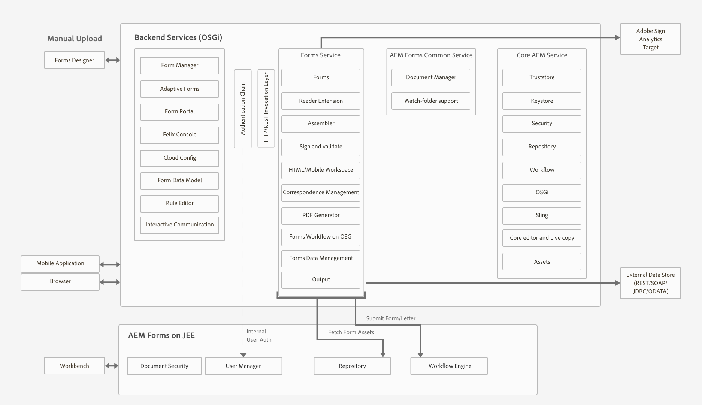

# Topologias de arquitetura e implantação do AEM Forms {#architecture-and-deployment-topologies-for-aem-forms}

## Arquitetura {#architecture}

O AEM Forms é um aplicativo implantado no AEM como um pacote AEM. O pacote é conhecido como pacote complementar AEM Forms. O pacote complementar de formulários AEM contém serviços (provedores de API), que são implantados no contêiner do AEM OSGi, e servlets ou JSPs (que fornecem funcionalidade de front-end e REST API) gerenciados pela estrutura do AEM Sling. O diagrama a seguir descreve essa configuração:

A arquitetura do AEM Forms inclui os seguintes componentes:

* **** Principais serviços do AEM: Serviços básicos que o AEM fornece a um aplicativo implantado. Esses serviços incluem um repositório de conteúdo compatível com JCR, um contêiner de serviço OSGI, um mecanismo de fluxo de trabalho, uma loja confiável, uma loja de chaves e assim por diante. Esses serviços estão disponíveis para o aplicativo AEM Forms, mas não são fornecidos por pacotes AEM Forms. Esses serviços são parte integrante da pilha geral do AEM e vários componentes do AEM Forms usam esses serviços.
* **** Serviços de formulários: Forneça funcionalidades relacionadas a formulários, como criar, montar, distribuir e arquivar documentos PDF, adicionar assinaturas digitais para limitar o acesso a documentos e decodificar formulários com códigos de barras. Esses serviços estão disponíveis ao público para consumo pelo código personalizado co-implantado no AEM.
* **** Camada da Web: JSPs ou servlets, construídos sobre serviços comuns e de formulários, que oferecem as seguintes funcionalidades:

   * **Front-end** de criação: Uma interface de usuário de criação e gerenciamento de formulários para criação e gerenciamento de formulários.
   * **Entrega e envio de formulário frontende**: Uma interface voltada para o usuário final para ser usada pelos usuários finais do AEM Forms (por exemplo, cidadãos acessando um site governamental). Isso fornece execuções de formulário (formulário de exibição em um navegador da Web) e funcionalidades de envio.
   * **REST APIs**: Os JSPs e servlets exportam um subconjunto de serviços de formulários para consumo remoto por clientes baseados em HTTP, como o SDK móvel de formulários.

**** Formulários AEM no OSGi: Um AEM Forms em um ambiente OSGi é um AEM Author padrão ou AEM Publish com o pacote AEM Forms implantado nele. Você pode executar o AEM Forms no OSGi em um ambiente de servidor [único, farm e configurações](/help/sites-deploying/recommended-deploys.md)agrupadas. A configuração de cluster está disponível somente para instâncias de autor de AEM.

**** AEM Forms em JEE: O AEM Forms no JEE é um servidor AEM Forms em execução na pilha JEE. Ele tem pacotes complementares AEM Author com AEM Forms e recursos AEM Forms JEE adicionais co-implantados em uma única pilha JEE em execução em um servidor de aplicativos. Você pode executar o AEM Forms em JEE em configurações de servidor único e clusterizadas. O AEM Forms em JEE é necessário somente para executar segurança de documentos, gerenciamento de processos e para clientes do LiveCycle que atualizam para o AEM Forms. Veja alguns cenários adicionais para usar o AEM Forms no JEE:

* **** Suporte a espaço de trabalho HTML (para clientes que usam espaço de trabalho HTML): O AEM Forms no JEE permite logon único com instâncias de processamento, serve determinados ativos renderizados em instâncias de processamento e lida com o envio de formulários renderizados na área de trabalho HTML.
* **Processamento** avançado de dados de formulários/comunicações interativas: O AEM Forms no JEE pode ser utilizado para processar adicionalmente dados de formulários/comunicações interativas (e salvar os resultados em um armazenamento de dados adequado) em casos de uso complexos, onde são necessários recursos avançados de gerenciamento de processos.

O AEM Forms no JEE também inclui os seguintes serviços de suporte aos componentes do AEM:

* **** Gerenciamento integrado de usuários: Permite que os usuários do AEM Forms no JEE sejam reconhecidos como formulários AEM em usuários do OSGi e ajuda a ativar o SSO para usuários do OSGi e JEE. Isso é necessário para cenários em que o logon único entre formulários AEM no OSGi e AEM Forms no JEE é necessário (por exemplo, área de trabalho HTML).
* **** Hospedagem de ativos: O AEM Forms no JEE pode servir ativos (por exemplo, formulários HTML5) renderizados no AEM Forms no OSGi.

A interface de usuário de criação do AEM Forms não oferece suporte à criação de documentos de registro (DOR), formulários PDF e formulários HTML5. Esses ativos são projetados usando o aplicativo Designer independente do Forms e carregados individualmente no AEM Forms Manager. Como alternativa, para o AEM Forms no JEE, os formulários podem ser projetados como ativos de aplicativo (no AEM Forms Workbench) e implantados no AEM Forms no servidor JEE.

O AEM Forms no OSGi e o AEM Forms no JEE têm recursos de fluxo de trabalho. Você pode criar e implantar rapidamente fluxos de trabalho básicos para várias tarefas nos formulários AEM no OSGi, sem precisar instalar o recurso de gerenciamento de processos completo do AEM Forms no JEE. Há alguma diferença nos [recursos do fluxo de trabalho centrado em formulários no AEM Forms no OSGi e na capacidade de gerenciamento de processos do AEM Forms no JEE](/help/forms/using/capabilities-osgi-jee-workflows.md). O desenvolvimento e o gerenciamento de fluxos de trabalho centrados em formulários no AEM Forms no OSGi usam os recursos familiares de Fluxo de trabalho do AEM e Caixa de entrada do AEM.

## Terminologias {#terminologies}

A imagem a seguir exibe várias configurações do servidor de formulários AEM e seus componentes usados em uma implantação típica do AEM Forms:

**** Autor: Uma instância do autor é um servidor AEM Forms em execução no modo de execução do autor padrão. Pode ser AEM Forms em JEE ou AEM Forms em ambiente OSGi. Destina-se a usuários internos, formulários e designers de comunicação interativos e desenvolvedores. Ele permite as seguintes funcionalidades:

* **** Criação e gerenciamento de formulários e comunicações interativas: Designers e desenvolvedores podem criar e editar formulários adaptativos e comunicações interativas, fazer upload de outros tipos de formulários criados externamente, por exemplo, formulários criados no Adobe Forms Designer, e gerenciar esses ativos usando o console do Forms Manager.
* **** Publicação de forma e comunicação interativa: Os ativos hospedados em uma instância do autor podem ser publicados em uma instância de publicação para executar operações de tempo de execução. A publicação de ativos usa os recursos de replicação do AEM. A Adobe recomenda que um agente de replicação seja configurado em todas as instâncias do autor para encaminhar manualmente os formulários publicados para as instâncias de processamento, e que outro agente de replicação seja configurado em instâncias de processamento com o acionador *On Receive (Ao receber* ) habilitado para replicar automaticamente os formulários recebidos para publicar instâncias.

**** Publicar: Uma instância de publicação é um servidor AEM Forms em execução no modo de execução de Publicação padrão. As instâncias de publicação destinam-se a usuários finais de aplicativos baseados em formulários, por exemplo, usuários que acessam um site público e enviam formulários. Ele permite as seguintes funcionalidades:

* Renderização e envio de formulários para usuários finais.
* Transporte de dados brutos de formulários enviados para instâncias de processamento para posterior processamento e armazenamento no sistema de registro final. A implementação padrão fornecida no AEM Forms realiza isso usando os recursos de replicação reversa do AEM. Uma implementação alternativa também está disponível para enviar os dados do formulário diretamente para os servidores de processamento em vez de salvá-los localmente primeiro (sendo este último um pré-requisito para a replicação reversa ser ativado). Os clientes que têm preocupações com o armazenamento de dados potencialmente confidenciais em instâncias de publicação podem entrar nessa implementação alternativa, já que as instâncias de processamento normalmente estão em uma zona mais segura.
* Renderização e envio de comunicações e cartas interativas: Uma comunicação interativa e uma carta são renderizadas nas instâncias de publicação e os dados correspondentes são enviados às instâncias de processamento para armazenamento e pós-processamento. Os dados podem ser salvos localmente em uma instância de publicação e replicados de forma reversa para uma instância de processamento (a opção padrão) posteriormente ou enviados diretamente para a instância de processamento sem salvar na instância de publicação. A última implementação é útil para clientes com consciência de segurança.

**** Processando: Uma instância dos formulários AEM em execução no modo de execução Autor sem usuários atribuídos ao grupo do gerenciador de formulários. Você pode implantar AEM Forms em JEE ou AEM Forms no OSGi como uma instância de processamento. Os usuários não são atribuídos para garantir que as atividades de criação e gerenciamento de formulários não sejam executadas na instância Processamento e ocorram somente na instância Autor. Uma instância de processamento ativa as seguintes funcionalidades:

* **** Processamento de dados brutos de formulário que chegam de uma instância de Publicação: Isso é feito principalmente em uma instância de processamento por meio de fluxos de trabalho do AEM que são acionados quando os dados chegam. Os fluxos de trabalho podem usar a etapa do Modelo de dados de formulário fornecida prontamente para arquivar os dados ou o documento em um armazenamento de dados adequado.
* **Armazenamento seguro de dados** de formulários: O processamento fornece um repositório por trás do firewall para dados de formulários brutos que são isolados dos usuários. Nem os designers de formulário na instância Autor nem os usuários finais na instância Publicar podem acessar esse repositório.

   >[!NOTE]
   >
   > A Adobe recomenda usar um armazenamento de dados de terceiros para salvar os dados processados finais em vez de usar o repositório AEM.

* **** Armazenamento e pós-processamento de dados de correspondência que chegam de uma instância de Publicação: Os fluxos de trabalho do AEM executam o pós-processamento opcional das definições de letras correspondentes. Esses fluxos de trabalho podem salvar os dados processados finais em armazenamentos de dados externos adequados.

* **Hospedagem** HTML Workspace: Uma instância de processamento hospeda o front-end para o HTML Workspace. A área de trabalho HTML fornece a interface para atribuição de tarefa/grupo associada para processos de revisão e aprovação.

Uma instância de Processamento está configurada para ser executada no modo de execução Autor porque:

* Ela permite a replicação reversa de dados de formulário brutos de uma instância de Publicação. O manipulador de armazenamento de dados padrão requer o recurso de replicação reversa.
* Os fluxos de trabalho do AEM, que são o principal meio de processamento de dados brutos de formulário que chegam de uma instância de publicação, são recomendados para execução em um sistema do estilo autor.

## Amostra de topologias físicas para o AEM Forms no JEE {#sample-physical-topologies-for-aem-forms-on-jee}

Os formulários AEM em topologias JEE recomendados abaixo são principalmente para clientes que atualizam do LiveCycle ou de uma versão anterior do AEM Forms em JEE. A Adobe recomenda usar o AEM Forms no OSGi para instalações recentes. Uma nova instalação do AEM Forms no JEE é recomendada apenas para o uso de recursos do Document Security e do Process Management.

### Topologia para usar serviços de documento ou recursos de segurança de documento {#topology-for-using-document-services-or-document-security-capabilities}

Os clientes do AEM Forms que planejam usar somente serviços de documento ou recursos de segurança de documento podem ter uma topologia semelhante à exibida abaixo. Essa topologia recomenda usar uma única instância do AEM Forms. Você também pode criar um cluster ou farm de servidores AEM Forms, se necessário. Essa topologia é recomendada quando a maioria dos usuários acessa programaticamente os recursos do servidor do AEM Forms e a intervenção por meio da interface do usuário é mínima. A topologia é útil em operações de processamento em lote de serviços de documento. Por exemplo, usar o serviço de saída para criar centenas de documentos PDF não editáveis diariamente.

Embora o AEM Forms permita configurar e executar todas as funcionalidades de um único servidor, ainda assim, você deve fazer planejamento de capacidade, balanceamento de carga e configurar servidores dedicados para recursos específicos em um ambiente de produção. Por exemplo, para um ambiente que usa o serviço Gerador de PDF para converter milhares de páginas por dia e adicionar assinaturas digitais para limitar o acesso a documentos, configure servidores AEM Forms separados para o serviço Gerador de PDF e recursos de assinatura digital. Ele ajuda a proporcionar um desempenho ótimo e dimensionar os servidores independentemente uns dos outros.

### Topologia para usar o gerenciamento de processos do AEM Forms {#topology-for-using-aem-forms-process-management}

Os clientes do AEM Forms que planejam usar os recursos de gerenciamento de processos do AEM Forms, por exemplo, o HTML Workspace pode ter uma topologia semelhante à exibida abaixo. O AEM Forms no servidor JEE pode estar em uma única configuração de servidor ou cluster.

Se você estiver atualizando do LiveCycle ES4, essa topologia será espelhada cuidadosamente com o que você já tem no LiveCycle, exceto pela adição do autor do AEM incorporado ao AEM Forms no JEE. Além disso, não há alteração nos requisitos de cluster para clientes que executam uma atualização. Se você estiver usando o AEM Forms em um ambiente clusterizado, poderá continuar com o mesmo no AEM 6.5 Forms. Para uma nova instalação do AEM Forms of JEE para usar HTML Workspace, executar a instância do autor de AEM incorporada ao ambiente JEE é um requisito adicional.

O armazenamento de dados de formulário é um armazenamento de dados de terceiros usado para armazenar dados processados finais de formulários e comunicações interativas. Este é um elemento opcional na topologia. Você também pode optar por configurar uma instância de processamento e usar seu repositório como o sistema final de registro, se necessário.

A topologia é recomendada para os clientes que planejam usar o AEM Forms no servidor JEE para recursos de gerenciamento de processos (HTML Workspace) sem usar nenhum recurso de pós-processamento, formulários adaptáveis, formulários HTML5 e recursos de comunicação interativa.

### Topologia para usar formulários adaptáveis, formulários HTML5, recursos de comunicação interativa {#topology-for-using-adaptive-forms-html-forms-interactive-communication-capabilities}

Os clientes do AEM Forms que planejam usar os recursos de captura de dados do AEM Forms, por exemplo, formulários adaptáveis, HTML5 Forms e PDF Forms, podem ter uma topologia semelhante à exibida abaixo. Essa topologia também é recomendada para o uso de recursos de comunicação interativa do AEM Forms.

É possível fazer as seguintes alterações/personalizações na topologia sugerida acima:

* O uso do HTML Workspace e do aplicativo AEM Forms requer uma instância de autor ou processamento do AEM. Você pode usar a instância do autor de AEM integrada ao AEM Forms no servidor JEE em vez de configurar um servidor de autor de AEM externo adicional.
* Uma instância de AEM Author ou Processing é necessária somente para fluxos de trabalho centrados no Forms em OSGi, formulários adaptáveis, portal de formulários e comunicação interativa.
* a interface do usuário do agente de comunicação interativa geralmente é executada dentro da organização. Portanto, você pode manter um servidor de publicação para a interface do agente na rede privada.
* Formulários AEM em uma instância OSGi integrada ao AEM Forms no servidor JEE também podem executar fluxos de trabalho centrados no Forms em OSGi e Pastas monitoradas.

## Amostra de topologias físicas para usar o AEM Forms no OSGi {#sample-physical-topologies-for-using-aem-forms-on-osgi}

### Topologia para captura de dados, comunicação interativa, fluxo de trabalho centrado em forma nos recursos do OSGi {#topology-for-data-capture-interactive-communication-form-centric-workflow-on-osgi-capabilities}

Os clientes do AEM Forms que planejam usar os recursos de captura de dados do AEM Forms, por exemplo, formulários adaptáveis, HTML5 Forms e PDF Forms, podem ter uma topologia semelhante à exibida abaixo. Essa topologia também é recomendada para o uso de comunicações interativas e fluxos de trabalho centrados em formulários no recurso OSGi, por exemplo, para o uso de aplicativos AEM Inbox e AEM Forms para fluxos de trabalho de processos comerciais.

### Topologia para usar os recursos de pasta assistida para processamento em lote offline {#topology-for-using-watched-folder-capabilities-for-offline-batch-processing}

Os clientes do AEM Forms que planejam usar Pastas monitoradas para processamento em lote podem ter uma topologia semelhante à exibida abaixo. A topologia exibe um ambiente clusterizado, mas você decide usar uma única instância ou um farm de servidores AEM Forms dependendo da carga. A fonte de dados de terceiros é seu próprio sistema de registro. Funciona como uma fonte de entrada para Pastas monitoradas. A topologia também exibe a saída na forma de um arquivo impresso. Você também pode armazenar o conteúdo de saída em um sistema de arquivos, enviar por email e usar outros métodos personalizados para consumir a saída.

### Topologia para usar recursos de serviços de documento para processamento offline baseado em API {#topology-for-using-document-services-capabilities-for-offline-api-based-processing}

Os clientes do AEM Forms que planejam usar somente o recurso de serviços de documento podem ter uma topologia semelhante à exibida abaixo. Essa topologia recomenda usar um cluster de AEM Forms em servidores OSGi. Essa topologia é recomendada quando a maioria dos usuários acessa de forma programática (usando APIs) do servidor do AEM Forms e a intervenção por meio da interface do usuário é mínima. A topologia é bastante útil em vários cenários de cliente de software. Por exemplo, vários clientes usando o serviço Gerador de PDF para criar documentos PDF sob demanda.

Embora o AEM Forms permita configurar e executar todas as funcionalidades de um único servidor, você deve fazer planejamento de capacidade, balanceamento de carga e configurar servidores dedicados para recursos específicos em um ambiente de produção. Por exemplo, para um ambiente que usa o serviço Gerador de PDF para converter milhares de páginas por dia e vários formulários adaptáveis para capturar dados, configure servidores AEM Forms separados para o serviço Gerador de PDF e recursos de formulários adaptáveis. Ele ajuda a proporcionar um desempenho ótimo e dimensionar os servidores independentemente uns dos outros.

