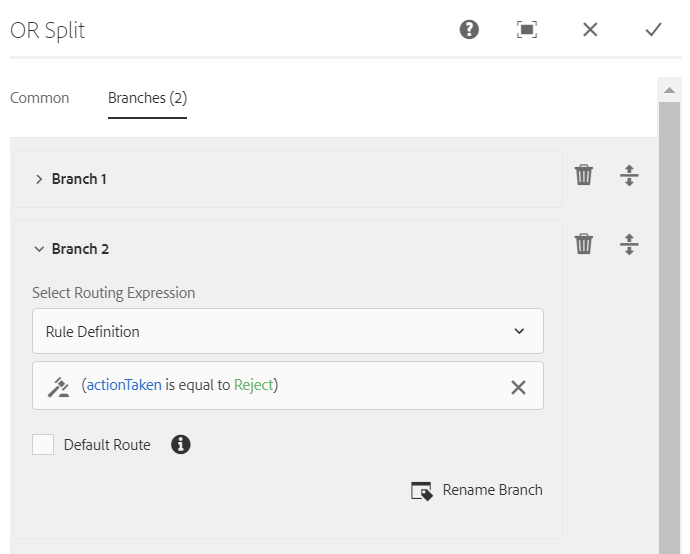

# Fluxo de trabalho centrado em formulários no OSGi{#forms-centric-workflow-on-osgi}

As empresas coletam dados de centenas e milhares de formulários, vários sistemas back-end e fontes de dados on-line ou off-line. Eles também têm um conjunto dinâmico de usuários para tomar decisões sobre os dados, o que envolve processos iterativos de revisão e aprovação.

Juntamente com workflows de revisão e aprovação de audiências internas e externas, grandes organizações e empresas têm tarefas repetitivas. Por exemplo, converter um documento PDF em outro formato. Quando feitas manualmente, essas tarefas demoram muito tempo e recursos. As empresas também têm requisitos legais para assinar digitalmente um documento e arquivar dados de formulário para uso posterior em formatos predefinidos.

## Introdução ao fluxo de trabalho centrado no Forms no OSGi {#introduction-to-forms-centric-workflow-on-osgi}

Você pode usar Workflows AEM para criar rapidamente workflows baseados em formulários adaptáveis. Esses workflows podem ser usados para revisão e aprovações, fluxos de processos de negócios, para serviços de documentos de start, integração com o fluxo de trabalho de assinatura do Adobe Sign e operações similares. Por exemplo, o processamento de aplicativos de cartão de crédito, os funcionários deixam workflows de aprovação, salvando um formulário como um documento PDF. Além disso, esses workflows podem ser usados dentro de uma organização ou através de um firewall de rede.

Com o fluxo de trabalho centrado no Forms no OSGi, você pode criar e implantar rapidamente workflows para várias tarefas na pilha OSGi, sem precisar instalar o recurso completo de Gerenciamento de processos na pilha JEE. O desenvolvimento e o gerenciamento de workflows usam os recursos familiares de Fluxo de trabalho do AEM e Caixa de entrada do AEM. Os Workflows são a base para automatizar os processos de negócios reais que abrangem vários sistemas de software, redes, departamentos e até mesmo organizações.

Depois de configurados, esses workflows podem ser acionados manualmente para concluir um processo definido ou executados de forma programática quando os usuários enviam um formulário ou uma carta de gerenciamento [de](/help/forms/using/cm-overview.md) correspondência. Com esses recursos aprimorados do AEM Workflow, o AEM Forms oferta dois recursos distintos, mas semelhantes. Como parte de sua estratégia de implantação, você precisa decidir qual funciona para você. Veja uma [comparação](../../forms/using/capabilities-osgi-jee-workflows.md) dos Workflows AEM centrados em formulários no OSGi e no Process Management no JEE. Além disso, para a topologia de implantação, consulte [Arquitetura e topologias de implantação para o AEM Forms](/help/forms/using/aem-forms-architecture-deployment.md).

O fluxo de trabalho centrado em formulários no OSGi estende a Caixa de entrada [do](/help/sites-authoring/inbox.md) AEM e fornece componentes adicionais (etapas) para o editor de fluxo de trabalho do AEM adicionar suporte para workflows centrados em formulários do AEM. A Caixa de entrada estendida do AEM tem funcionalidades semelhantes ao [AEM Forms Workspace](../../forms/using/introduction-html-workspace.md). Juntamente com o gerenciamento de workflows centrados em humanos (Aprovação, Revisão e assim por diante), você pode usar workflows AEM para automatizar operações relacionadas aos serviços [de](/help/sites-developing/workflows-step-ref.md)documentos (por exemplo, Gerar PDF) e documentos de assinatura eletrônica (Adobe Sign).

Todas as etapas do fluxo de trabalho do AEM Forms oferecem suporte ao uso de variáveis. As variáveis permitem que as etapas do fluxo de trabalho mantenham e passem os metadados pelas etapas no tempo de execução. Você pode criar diferentes tipos de variáveis para armazenar diferentes tipos de dados. Você também pode criar coleções de variáveis (array) para armazenar várias instâncias de dados relacionados com o mesmo tipo. Geralmente, você usa uma variável ou uma coleção de variáveis quando precisa tomar uma decisão com base no valor que ela contém ou armazenar informações necessárias posteriormente em um processo. Para obter mais informações sobre como usar variáveis nesses componentes de fluxo de trabalho centrados no Forms (etapas), consulte Fluxo de trabalho centrado no [Forms em OSGi - Referência](../../forms/using/aem-forms-workflow-step-reference.md)de etapas. Para obter informações sobre como criar e gerenciar variáveis, consulte [Variáveis em workflows](../../forms/using/variable-in-aem-workflows.md)AEM.

O diagrama a seguir descreve o procedimento completo para criar, executar e monitorar um fluxo de trabalho centrado no Forms no OSGi.

## Antes de você iniciar {#before-you-start}

* Um fluxo de trabalho é uma representação de um processo de negócios do mundo real. Mantenha o seu processo de negócios real e a lista dos participantes do processo de negócios prontos. Além disso, mantenha o material promocional (formulários adaptáveis, Documentos PDF e muito mais) pronto antes que o start crie um fluxo de trabalho.
* Um fluxo de trabalho pode ter vários estágios. Esses estágios são exibidos na Caixa de entrada do AEM e o relatório de progresso do fluxo de trabalho da ajuda. Divida seu processo de negócios em estágios lógicos.
* Você pode configurar a etapa de atribuição de tarefa de Workflows AEM para enviar notificações por email aos usuários ou destinatários. Portanto, [ative as notificações](#configure-email-service)por email.
* Um fluxo de trabalho também pode usar o Adobe sign para assinaturas digitais. Se você planeja usar o Adobe Sign em um fluxo de trabalho, [configure o Adobe Sign para o AEM Forms](../../forms/using/adobe-sign-integration-adaptive-forms.md) antes de usá-lo em um fluxo de trabalho.

## Create a workflow model {#create-a-workflow-model}

Um modelo de fluxo de trabalho consiste em lógica e fluxo de um processo de negócios. É feita de uma série de etapas. Essas etapas são componentes do AEM. Você pode estender as etapas do fluxo de trabalho com parâmetros e scripts para fornecer mais funcionalidade e controle, conforme necessário. O AEM Forms fornece algumas etapas além das etapas do AEM disponíveis na caixa. Para obter uma lista detalhada das etapas do AEM e do AEM Forms, consulte Referência [de etapas do fluxo de trabalho do](/help/sites-developing/workflows-step-ref.md) AEM e fluxo de trabalho centrado no [Forms em OSGi - Referência](../../forms/using/aem-forms-workflow.md)de etapas.

O AEM fornece uma interface de usuário intuitiva para criar um modelo de fluxo de trabalho usando as etapas de fluxo de trabalho fornecidas. Para obter instruções passo a passo para criar um modelo de fluxo de trabalho, consulte [Criação de modelos](/help/sites-developing/workflows-models.md)de fluxo de trabalho. O exemplo a seguir fornece instruções passo a passo para criar um modelo de fluxo de trabalho para um fluxo de trabalho de aprovação e revisão:

>[!NOTE]
>
>Você deve ser um membro do grupo editor de fluxo de trabalho para criar ou editar um modelo de fluxo de trabalho.

### Criar um modelo para um fluxo de trabalho de aprovação e revisão {#create-a-model-for-an-approval-and-review-workflow}

O fluxo de trabalho de aprovação e revisão é para as tarefas que exigem intervenção humana para tomar decisões. O exemplo a seguir cria um modelo de fluxo de trabalho para um aplicativo de empréstimo hipotecário a ser preenchido por um agente bancário de escritório. Depois que o aplicativo for preenchido, ele será enviado para aprovação. Posteriormente, o aplicativo aprovado será enviado ao candidato para assinaturas eletrônicas usando o Adobe Sign.

O exemplo está disponível como um pacote anexado abaixo. Importe e instale o exemplo usando o gerenciador de pacotes. Você também pode executar as seguintes etapas para criar manualmente o modelo de fluxo de trabalho para o aplicativo:

O exemplo cria um modelo de fluxo de trabalho e um aplicativo de hipoteca para ser preenchido por um agente bancário de front-office. Uma vez preenchido, o pedido é enviado para aprovação. Posteriormente, o aplicativo aprovado será enviado ao cliente para assinaturas eletrônicas usando o Adobe Sign. É possível importar e instalar o exemplo usando o gerenciador de pacotes.

[Obter arquivo](assets/example-mortgage-loan-application.zip)

1. Abra o console Modelos de fluxo de trabalho. O URL padrão é https://&#39;[server]:[port]&#39;/libs/cq/workflow/admin/console/content/models.html/etc/workflow/models
1. Select **Create**, then **Create Model**. A caixa de diálogo Adicionar modelo de fluxo de trabalho é exibida.
1. Insira o **Título** e o **Nome** (opcional). Por exemplo, um aplicativo de hipoteca. Toque em **Concluído**.
1. Selecione o modelo de fluxo de trabalho recém-criado e toque em **Editar**. Agora, você pode adicionar etapas de fluxo de trabalho para criar lógica de negócios. Quando você cria um modelo de fluxo de trabalho pela primeira vez, ele contém:

   * As etapas: Start de fluxo e Fim de fluxo. Essas etapas representam o início e o fim do fluxo de trabalho. Essas etapas são obrigatórias e não podem ser editadas ou removidas.
   * Um exemplo de etapa Participante chamado Etapa 1. Esta etapa está configurada para atribuir um item de trabalho ao usuário administrador. Remova esta etapa.

1. Habilitar notificações por email. Você pode configurar o fluxo de trabalho centrado no Forms no OSGi para enviar notificações por email aos usuários ou destinatários. Execute as seguintes configurações para ativar notificações por email:

   1. Vá para o gerenciador de configuração do AEM em https://&#39;[server]:[port]&#39;/system/console/configMgr.
   1. Abra a configuração do **[!UICONTROL Day CQ Mail Service]** . Especifique um valor para o nome **[!UICONTROL do host do servidor]** SMTP, **[!UICONTROL a porta do servidor]** SMTP e os campos de endereço **** &quot;De&quot;. Clique em **[!UICONTROL Salvar]**.
   1. Abra a configuração do **[!UICONTROL Externalizador]** de links do Day CQ. No campo **[!UICONTROL Domínios]** , especifique o nome do host/endereço IP real e o número da porta para instâncias locais, de autor e de publicação. Clique em **[!UICONTROL Salvar]**.

1. Criar estágios de fluxo de trabalho. Um fluxo de trabalho pode ter vários estágios. Esses estágios são exibidos na Caixa de entrada do AEM e no andamento do relatório do fluxo de trabalho.

   Para definir um estágio, toque no ícone  para abrir as propriedades do modelo de fluxo de trabalho, abra a guia **Estágios** , adicione estágios para o modelo de fluxo de trabalho e toque em **Salvar e fechar**. Para o exemplo de aplicativo de hipoteca, crie estágios: solicitação de empréstimo, status de solicitação de empréstimo, a ser assinado pelos documentos e documento de empréstimo assinado.

1. Arraste e solte o navegador das etapas **Atribuir Tarefa** para o modelo de fluxo de trabalho. Faça dele o primeiro passo do modelo.

   O componente de atribuição de tarefa atribui a tarefa, criada pelo fluxo de trabalho, a um usuário ou grupo. Juntamente com a atribuição da tarefa, é possível usar o componente para especificar um formulário adaptável ou um PDF não interativo para a tarefa. O formulário adaptável é necessário para aceitar a entrada de usuários e um PDF não interativo ou um formulário adaptável somente leitura é usado apenas para workflows de revisão.

   Você também pode usar a etapa para controlar o comportamento da tarefa. Por exemplo, criar um documento de registro automático, atribuir a tarefa a um usuário ou grupo específico, o caminho dos dados enviados, o caminho dos dados a serem pré-preenchidos e as ações padrão. Para obter informações detalhadas sobre as opções da etapa de atribuição de tarefa, consulte Fluxo de trabalho centrado em [formulários no documento OSGi - Step Reference](../../forms/using/aem-forms-workflow.md) .

   

   Para o exemplo do aplicativo de hipoteca, configure a etapa de atribuição de tarefa para usar um formulário adaptável somente leitura e exibir o Documento PDF quando a tarefa estiver concluída. Além disso, selecione para o grupo de usuários autorizado a aprovar a solicitação de empréstimo. Na guia **Ações** , desative a opção **Enviar** . Crie uma variável **actionTaken** do tipo de dados String e especifique a variável como Variável **** de Rota. Por exemplo, actionTaken. Além disso, adicione as rotas Aprovar e Rejeitar. As rotas são exibidas como ações separadas (botões) na Caixa de entrada do AEM. O fluxo de trabalho seleciona uma ramificação com base na ação (botão) que um usuário toca.

   É possível importar o pacote de exemplo, disponível para download no início da seção, para o conjunto completo de valores de todos os campos da etapa de atribuição de tarefa configurados como, por exemplo, aplicativo de hipoteca.

1. Arraste e solte o componente OU Dividir do navegador de etapas para o modelo de fluxo de trabalho. A Divisão OR cria uma divisão no fluxo de trabalho, após a qual apenas uma ramificação está ativa. Esta etapa permite que você introduza caminhos de processamento condicional no seu fluxo de trabalho. Você adiciona etapas de fluxo de trabalho a cada ramificação, conforme necessário.

   É possível definir a expressão de roteamento para uma ramificação usando uma definição de regra, um script ECMA ou um script externo.

   Use o editor de expressões para criar expressões de roteamentos para a Ramificação 1 e a Ramificação 2. Essas expressões do roteamento ajudam a escolher uma ramificação com base na ação do usuário na Caixa de entrada do AEM.

   **expressão do Roteamento para a Ramificação 1**

   Quando um usuário toca em **Aprovar** na Caixa de entrada do AEM, a Ramificação 1 é ativada.

   

   **expressão do Roteamento da Ramificação 2**

   Quando um usuário toca em **Rejeitar** na Caixa de entrada do AEM, a Ramificação 2 é ativada.

   

   Para obter informações sobre como criar expressões de roteamentos usando variáveis, consulte [Variáveis em workflows](../../forms/using/variable-in-aem-workflows.md)de formulários AEM.

1. Adicione outras etapas do fluxo de trabalho para criar a lógica comercial.

   Para o exemplo de hipoteca, adicione um documento de registro gerado, duas etapas de tarefa atribuídas e uma etapa de documento de sinal à Ramificação 1 do modelo, conforme exibido na imagem abaixo. Uma etapa de atribuição de tarefa é exibir e enviar **para serem documentos de empréstimo assinados ao candidato** e outro componente de atribuição de tarefa é **para exibir documentos** assinados. Além disso, adicione um componente de tarefa à ramificação 2. Ela é ativada quando um usuário toca em Rejeitar na Caixa de entrada do AEM.

   Para obter o conjunto completo de valores de todos os campos das etapas de atribuição de tarefa, documento da etapa de registro e etapa de assinatura de documento configuradas como, por exemplo, aplicativo de hipoteca, importe o pacote de exemplo, disponível para download no início desta seção.

   O modelo de fluxo de trabalho está pronto. Você pode iniciar o fluxo de trabalho por meio de vários métodos. Para obter detalhes, consulte [Iniciar um fluxo de trabalho centrado em formulários no OSGi](#launch).

   

## Criar um aplicativo de fluxo de trabalho centrado em formulários {#create-a-forms-centric-workflow-application}

O aplicativo é o formulário adaptável associado ao fluxo de trabalho. Quando um aplicativo é enviado por meio da Caixa de entrada, ele inicia o fluxo de trabalho associado. Para disponibilizar um fluxo de trabalho do Forms como um aplicativo na Caixa de entrada do AEM e no aplicativo AEM Forms, faça o seguinte para criar um aplicativo de fluxo de trabalho:

>[!NOTE]
>
>Você deve ser um membro do grupo de administradores de fd para poder criar e gerenciar aplicativos de fluxo de trabalho.

1. Na instância do autor do AEM, vá para  > **[!UICONTROL Forms]**> **[!UICONTROL Manage Workflow Application]** (Ferramentas > Formulários > Gerenciar aplicativo de fluxo de trabalho) e toque em **[!UICONTROL Create (Criar]**).
1. Na janela Criar aplicativo de fluxo de trabalho, forneça entradas para os seguintes campos e toque em **Criar**. Um novo aplicativo é criado e está listado na tela Aplicativos de fluxo de trabalho.

<table>
 <tbody>
  <tr>
   <td>Texto</td>
   <td>Descrição</td>
  </tr>
  <tr>
   <td>Título</td>
   <td>O título está visível na Caixa de entrada do AEM e ajuda os usuários a escolher um aplicativo. Mantenha-o descritivo. Por exemplo, Salvar Aplicativo de Abertura de Conta.  </td>
  </tr>
  <tr>
   <td>Nome </td>
   <td>Especifique o nome do aplicativo. Todos os caracteres, exceto alfabetos, números, hífens e sublinhados, são substituídos por hífens. </td>
  </tr>
  <tr>
   <td>Descrição</td>
   <td>A descrição está visível na Caixa de entrada do AEM. Forneça informações detalhadas sobre o aplicativo nos campos de descrição. Por exemplo, Finalidade do aplicativo.  </td>
  </tr>
  <tr>
   <td>Formulário adaptativo</td>
   <td>
Especifique o caminho de um formulário adaptável. Quando um usuário start um aplicativo, o formulário adaptativo especificado é exibido.
 
<strong>Observação</strong>: Os aplicativos de fluxo de trabalho não são compatíveis com formulários e documentos PDF que têm mais de uma página ou exigem rolagem no iPad da Apple. Quando um aplicativo é aberto no Apple iPad e o formulário adaptável ou o documento PDF é maior que uma página, os campos de formulário e o conteúdo da segunda página são perdidos.
 </td>
  </tr>
  <tr>
   <td>Grupo de acesso</td>
   <td>
Selecione um grupo. O aplicativo está visível na Caixa de entrada do AEM somente para os membros do grupo selecionado. A opção de grupo de acesso disponibiliza para seleção todos os grupos do grupo de usuários do fluxo de trabalho. 
   </td>
  </tr>
  <tr>
   <td>Preencher Serviço</td>
   <td>Selecione um serviço <a href="../../forms/using/prepopulate-adaptive-form-fields.md#aem-forms-custom-prefill-service" target="_blank">de</a> preenchimento prévio para o formulário adaptável.  </td>
  </tr>
  <tr>
   <td>Modelo de fluxo de trabalho</td>
   <td>Selecione um modelo <a href="../../forms/using/aem-forms-workflow.md#create-a-workflow-model">de</a> fluxo de trabalho para o aplicativo. Um modelo de fluxo de trabalho consiste em lógica e fluxo do processo de negócios. </td>
  </tr>
  <tr>
   <td>Caminho do arquivo de dados</td>
   <td>Especifique o caminho do arquivo de dados no repositório crx. O caminho é relativo à carga adaptável do formulário e contém o nome do arquivo de dados. Sempre inclua o nome completo do arquivo, incluindo a extensão, se aplicável. Por exemplo, [payload]/data.xml. </td>
  </tr>
  <tr>
   <td>Caminho do anexo</td>
   <td>Especifique o caminho da pasta de anexos no repositório crx. O caminho do anexo é relativo ao local da carga. Por exemplo, [payload]/data.xml. </td>
  </tr>
  <tr>
   <td>Caminho do documento de registro</td>
   <td>Especifique o caminho do Documento do arquivo de registro no repositório crx. O caminho é relativo ao local de carga do formulário adaptável. Sempre inclua o nome completo do arquivo, incluindo a extensão, se aplicável. Por exemplo, [payload]/DOR/creditcard.pdf.</td>
  </tr>
 </tbody>
</table>

## Iniciar um fluxo de trabalho centrado em formulários no OSGi {#launch}

Você pode iniciar ou acionar um fluxo de trabalho centrado no Forms:

* [Enviar um aplicativo da Caixa de entrada do AEM](#inbox)
* [Enviar um aplicativo do aplicativo AEM Forms](#afa)

* [Enviar um formulário adaptável](#af)
* [Uso da pasta assistida](#watched)

* [Enviar uma comunicação interativa ou uma carta](#letter)

### Enviar um aplicativo da Caixa de entrada do AEM {#inbox}

O aplicativo de fluxo de trabalho criado está disponível como um aplicativo na Caixa de entrada. Os usuários que forem membros do grupo de usuários do fluxo de trabalho podem preencher e enviar o aplicativo que aciona o fluxo de trabalho associado. Para obter informações sobre como usar a Caixa de entrada do AEM para enviar aplicativos e gerenciar o tarefa, consulte [Gerenciar aplicativos de formulários e tarefas na Caixa de entrada](../../forms/using/manage-applications-inbox.md)do AEM.

### Enviar um aplicativo do aplicativo AEM Forms {#afa}

O aplicativo AEM Forms sincroniza com um servidor AEM Forms e permite fazer alterações nos dados do formulário, tarefas, aplicativos de fluxo de trabalho e informações salvas (rascunhos/modelos) na sua conta. Para obter mais informações, consulte Aplicativo  AEM Forms e artigos relacionados.

### Enviar um formulário adaptável {#af}

Você pode configurar as ações de envio de um formulário adaptável para start de um fluxo de trabalho ao enviar o formulário adaptável. Formulários adaptáveis fornecem a ação **Invocar um fluxo de trabalho** do AEM para enviar um fluxo de trabalho ao start após o envio de um formulário adaptável. Para obter informações detalhadas sobre a ação de envio, consulte [Configuração da ação](../../forms/using/configuring-submit-actions.md)Enviar. Para enviar um formulário adaptável pelo aplicativo AEM Forms, ative Sincronizar com o aplicativo AEM Forms nas propriedades do formulário adaptável.

Você pode configurar um formulário adaptável para sincronizar, enviar e acionar um fluxo de trabalho do aplicativo AEM Forms. Para obter detalhes, consulte [trabalhar com um formulário](/help/forms/using/working-with-form.md).

### Uso de uma pasta assistida {#watched}

Um administrador (um membro do grupo de administradores de fd) pode configurar uma pasta de rede para executar um fluxo de trabalho pré-configurado quando um usuário coloca um arquivo (como um arquivo PDF) na pasta. Depois que o fluxo de trabalho for concluído, ele poderá salvar o arquivo de resultado em uma pasta de saída especificada. Essa pasta é conhecida como Pasta [assistida](../../forms/using/watched-folder-in-aem-forms.md). Execute o seguinte procedimento para configurar uma pasta assistida para iniciar um fluxo de trabalho:

1. Na instância do autor de AEM, vá para  **>**[!UICONTROL Forms]**> Configure Watched Folder (Ferramentas-1> Formulários > Configurar pasta assistida).** Uma lista de pastas monitoradas já configuradas é exibida.
1. Toque em **[!UICONTROL Novo]**. Uma lista de campos é exibida. Especifique um valor para os seguintes campos para configurar uma Pasta assistida para um fluxo de trabalho:

<table>
 <tbody>
  <tr>
   <td>Texto</td>
   <td>Descrição</td>
  </tr>
  <tr>
   <td>Nome</code></td>
   <td>Especifique o nome da Pasta assistida. Este campo suporta apenas alfanuméricos.</td>
  </tr>
  <tr>
   <td>Caminho</code></td>
   <td>Especifique o local físico da Pasta assistida. Em um ambiente clusterizado, use uma pasta de rede compartilhada que esteja acessível a partir do nó de cluster do AEM.</td>
  </tr>
  <tr>
   <td>Processar arquivos usando</code></td>
   <td>Selecione a opção </code>Fluxo de trabalho. </code></td>
  </tr>
  <tr>
   <td>Modelo de fluxo de trabalho</code></td>
   <td>Select a workflow model.  </td>
  </tr>
  <tr>
   <td>Padrão do arquivo de saída</code></td>
   <td>Especifique a estrutura de diretório para arquivos de saída e diretórios. Você também pode especificar um <a href="/help/forms/using/admin-help/configuring-watched-folder-endpoints.md" target="_blank">padrão para arquivos de saída e diretórios</a>.</td>
  </tr>
 </tbody>
</table>

1. Toque em **Avançado**. Especifique um valor para o campo a seguir e toque em **Criar**. A Pasta assistida está configurada para iniciar um fluxo de trabalho. Agora, sempre que um arquivo é colocado no diretório de entrada da Pasta assistida, o fluxo de trabalho especificado é acionado.

   | Texto | Descrição |
   |---|---|
   | Filtro do mapeador de carga útil | Quando você cria uma pasta assistida, ela cria uma estrutura de pastas no repositório crx. A estrutura de pastas pode servir como carga para o fluxo de trabalho. Você pode gravar um script para mapear um fluxo de trabalho do AEM para aceitar entradas da estrutura de pastas assistida. Uma implementação pronta para uso está disponível e listada no Filtro do Mapeador de Carga. Se você não tiver uma implementação personalizada, selecione a implementação padrão. |

   A guia Avançado contém mais campos. A maioria desses campos contém um valor padrão. Para saber mais sobre todos os campos, consulte o artigo [Criar ou configurar uma pasta](/help/forms/using/admin-help/configuring-watched-folder-endpoints.md) assistida.

### Enviar uma comunicação interativa ou uma carta {#letter}

Você pode associar e executar um fluxo de trabalho centrado no Forms no OSGi mediante o envio de uma comunicação interativa ou de uma carta. Os workflows de gerenciamento de correspondência são usados para o pós-processamento de comunicações e cartas interativas. Por exemplo, enviar emails, imprimir, enviar fax ou arquivar letras finais. Para obter etapas detalhadas, consulte [Pós-processamento de comunicações e cartas](../../forms/using/submit-letter-topostprocess.md)interativas.

## Configurações adicionais {#additional-configurations}

### Configurar serviço de email {#configure-email-service}

Você pode usar as etapas Atribuir Tarefa e Enviar e-mail de Workflows do AEM para enviar um e-mail. Execute as seguintes etapas para especificar os servidores de e-mail e outras configurações necessárias para enviar e-mail:

1. Vá para o gerenciador de configuração do AEM em https://&#39;[server]:[port]&#39;/system/console/configMgr.
1. Abra a configuração do **[!UICONTROL Day CQ Mail Service]** . Especifique um valor para o nome **[!UICONTROL do host do servidor]** SMTP, **[!UICONTROL a porta do servidor]** SMTP e os campos de endereço **** &quot;De&quot;. Clique em **[!UICONTROL Salvar]**.
1. Abra a configuração do **[!UICONTROL Externalizador]** de links do Day CQ. No campo **[!UICONTROL Domínios]** , especifique o nome do host/endereço IP real e o número da porta para instâncias locais, de autor e de publicação. Clique em **[!UICONTROL Salvar]**.

### Expurgar instâncias de fluxo de trabalho {#purge-workflow-instances}

Minimizar o número de instâncias do fluxo de trabalho aumenta o desempenho do motor de workflow, para que você possa expurgar regularmente as instâncias do fluxo de trabalho concluídas ou em execução do repositório. Para obter informações detalhadas, consulte Expurgação [Regular de Instâncias](/help/sites-administering/workflows-administering.md#regular-purging-of-workflow-instances)de Fluxo de Trabalho.
