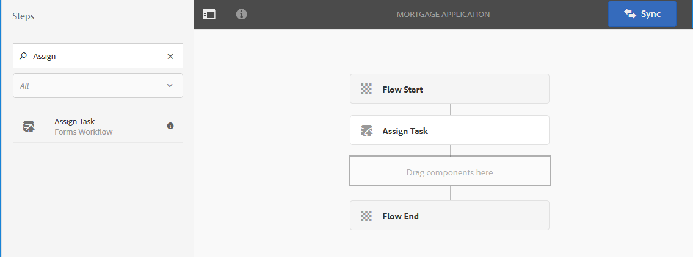

# Fluxo de trabalho centrado no Forms no OSGi{#forms-centric-workflow-on-osgi}


As empresas coletam dados de centenas e milhares de formulários, vários sistemas de back-end e fontes de dados online ou offline. Eles também têm um conjunto dinâmico de usuários para tomar decisões sobre os dados, o que envolve processos iterativos de revisão e aprovação.

Juntamente com os fluxos de trabalho de revisão e aprovação para públicos internos e externos, grandes organizações e empresas têm tarefas repetitivas. Por exemplo, converter um documento PDF em outro formato. Quando realizadas manualmente, essas tarefas consomem muito tempo e recursos. As empresas também têm requisitos legais para assinar digitalmente um documento e arquivar dados de formulário para uso posterior em formatos predefinidos.

## Introdução ao fluxo de trabalho centrado no Forms no OSGi {#introduction-to-forms-centric-workflow-on-osgi}

Você pode usar fluxos de trabalho do AEM para criar rapidamente fluxos de trabalho baseados em formulários adaptáveis. Esses workflows podem ser usados para revisão e aprovações, fluxos de processo comercial, para iniciar serviços de documento, integrar ao fluxo de trabalho de assinatura do Adobe Sign e operações semelhantes. Por exemplo, processamento de aplicativo de cartão de crédito, saída de funcionários de fluxos de trabalho de aprovação, salvamento de um formulário como um documento PDF. Além disso, esses workflows podem ser usados em uma organização ou através do firewall de rede.

Com um fluxo de trabalho centrado na Forms no OSGi, você pode criar e implantar rapidamente fluxos de trabalho para várias tarefas na pilha do OSGi, sem precisar instalar o recurso completo de Gerenciamento de processos na pilha do JEE. O desenvolvimento e o gerenciamento de workflows usam os familiares recursos da Caixa de entrada AEM Workflow e AEM. Os fluxos de trabalho formam a base da automatização de processos de negócios reais que abrangem vários sistemas de software, redes, departamentos e até mesmo organizações.

Após configurados, esses workflows podem ser acionados manualmente para concluir um processo definido ou ser executados programaticamente quando os usuários enviarem um formulário ou [gerenciamento de correspondência](/help/forms/using/cm-overview.md) carta. Com esses recursos aprimorados do fluxo de trabalho do AEM, a AEM Forms oferece dois recursos distintos, mas semelhantes. Como parte de sua estratégia de implantação, você precisa decidir qual delas funciona para você. Consulte uma [comparação](capabilities-osgi-jee-workflows.md) dos fluxos de trabalho de AEM centrados no Forms no OSGi e no Gerenciamento de processos no JEE. Além disso, para a topologia de implantação, consulte [Arquitetura e topologias de implantação do AEM Forms](/help/forms/using/aem-forms-architecture-deployment.md).

O fluxo de trabalho centrado no Forms no OSGi estende [Caixa de entrada AEM](/help/sites-authoring/inbox.md) e fornece componentes extras (etapas) para o editor de fluxo de trabalho AEM para adicionar suporte a fluxos de trabalho centrados no AEM Forms. A Caixa de entrada AEM estendida tem funcionalidades semelhantes a [Espaço de trabalho AEM Forms](introduction-html-workspace.md). Além do gerenciamento de workflows centrados em pessoas (Aprovação, Revisão etc.), é possível usar workflows do AEM para automatizar [serviços de documento](/help/sites-developing/workflows-step-ref.md)operações relacionadas ao (por exemplo, Gerar PDF) e documentos de assinatura eletrônica (Adobe Sign).

Todas as etapas do fluxo de trabalho do AEM Forms oferecem suporte ao uso de variáveis. As variáveis permitem que as etapas do fluxo de trabalho retenham e transmitam metadados pelas etapas no tempo de execução. É possível criar diferentes tipos de variáveis para armazenar diferentes tipos de dados. Você também pode criar coleções de variáveis (matriz) para armazenar várias instâncias de dados relacionados do mesmo tipo. Normalmente, você usa uma variável ou uma coleção de variáveis quando precisa tomar uma decisão com base no valor que ela contém ou armazenar informações necessárias posteriormente em um processo. Para obter mais informações sobre como usar variáveis nesses componentes de fluxo de trabalho centrados no Forms (etapas), consulte [Fluxo de trabalho centrado na Forms no OSGi - Referência da etapa](../../forms/using/aem-forms-workflow-step-reference.md). Para obter informações sobre como criar e gerenciar variáveis, consulte [Variáveis em fluxos de trabalho de AEM](../../forms/using/variable-in-aem-workflows.md).

O diagrama a seguir representa um procedimento completo para criar, executar e monitorar um fluxo de trabalho centrado no Forms no OSGi.


## Antes de começar {#before-you-start}

* Um fluxo de trabalho é uma representação de um processo de negócios real. Mantenha o processo de negócios real e a lista dos participantes do processo de negócios prontos. Além disso, mantenha o material de apoio (formulários adaptáveis, documentos PDF e muito mais) pronto antes de começar a criar um fluxo de trabalho.
* Um fluxo de trabalho pode ter vários estágios. Esses estágios são exibidos na Caixa de entrada do AEM e ajudam a relatar o progresso do fluxo de trabalho. Divida o processo de negócios em estágios lógicos.
* Você pode configurar a etapa atribuir tarefa de fluxos de trabalho AEM para enviar notificações por email aos usuários ou atribuídos. Então, [ativar notificações por email](#configure-email-service).
* Um workflow também pode usar o sinal de Adobe para assinaturas digitais. Se você planeja usar o Adobe Sign em um workflow, a variável [configurar o Adobe Sign para AEM Forms](../../forms/using/adobe-sign-integration-adaptive-forms.md) antes de usá-lo em um workflow.

## Criar um modelo de fluxo de trabalho {#create-a-workflow-model}

Um modelo de fluxo de trabalho consiste na lógica e no fluxo de um processo de negócios. Ele é composto por uma série de etapas. Essas etapas são componentes do AEM. É possível estender as etapas do fluxo de trabalho com parâmetros e scripts para fornecer mais funcionalidade e controle, conforme necessário. O AEM Forms fornece algumas etapas além das etapas AEM disponíveis prontas para uso. Para obter uma lista detalhada das etapas do AEM e do AEM Forms, consulte [Referência da etapa do fluxo de trabalho do AEM](/help/sites-developing/workflows-step-ref.md) e [Fluxo de trabalho centrado na Forms no OSGi - Referência da etapa](../../forms/using/aem-forms-workflow.md).

O AEM fornece uma interface de usuário intuitiva para criar um modelo de fluxo de trabalho usando as etapas de fluxo de trabalho fornecidas. Para obter instruções detalhadas sobre como criar um modelo de fluxo de trabalho, consulte [Criação de modelos de fluxo de trabalho](/help/sites-developing/workflows-models.md). O exemplo a seguir fornece instruções passo a passo para criar um modelo de fluxo de trabalho para um fluxo de trabalho de aprovação e revisão:

>[!NOTE]
>
>Você deve ser membro do grupo do editor de fluxo de trabalho para criar ou editar um modelo de fluxo de trabalho.

### Criar um modelo para um fluxo de trabalho de aprovação e revisão {#create-a-model-for-an-approval-and-review-workflow}

O fluxo de trabalho de aprovação e revisão é para tarefas que exigem intervenção humana para tomar decisões. O exemplo a seguir cria um modelo de fluxo de trabalho para um pedido de empréstimo hipotecário a ser preenchido por um agente bancário de front-office. Depois que o aplicativo é preenchido, ele é enviado para aprovação. Posteriormente, o aplicativo aprovado é enviado ao solicitante para assinatura eletrônica usando o Adobe Sign.

O exemplo está disponível como um pacote anexado abaixo. Importe e instale o exemplo usando o gerenciador de pacotes. Você também pode executar as seguintes etapas para criar manualmente o modelo de fluxo de trabalho para o aplicativo:

O exemplo cria um modelo de fluxo de trabalho para uma solicitação de hipoteca a ser preenchida por um agente bancário de front-office. Uma vez preenchido, o aplicativo é enviado para aprovação. Posteriormente, o aplicativo aprovado é enviado ao cliente para assinaturas eletrônicas usando o Adobe Sign. Você pode importar e instalar o exemplo usando o gerenciador de pacotes.

[Obter arquivo](assets/example-mortgage-loan-application.zip)

1. Abra o console Modelos de fluxo de trabalho. O URL padrão é `https://[server]:[port]/libs/cq/workflow/admin/console/content/models.html/etc/workflow/models`
1. Selecionar **Criar**, depois **Criar modelo**. A caixa de diálogo Adicionar modelo de fluxo de trabalho é exibida.
1. Insira o **Título** e **Nome** (opcional). Por exemplo, uma solicitação de hipoteca. Selecionar **Concluído**.
1. Selecione o modelo de workflow recém-criado e **Editar**. Agora é possível adicionar etapas do fluxo de trabalho para criar uma lógica de negócios. Ao criar um modelo de fluxo de trabalho pela primeira vez, ele contém:

   * As etapas: Início do fluxo e Fim do fluxo. Essas etapas representam o início e o fim do workflow. Essas etapas são obrigatórias e não podem ser editadas ou removidas.
   * Um exemplo de etapa do participante chamada Etapa 1. Esta etapa é configurada para atribuir um item de trabalho ao usuário administrador. Remova esta etapa.

1. Ativar notificações por email. Você pode configurar um fluxo de trabalho centrado no Forms no OSGi para enviar notificações por email aos usuários ou atribuídos. Execute as seguintes configurações para ativar notificações por email:

   1. Vá para o gerenciador de configuração do AEM em `https://[server]:[port]/system/console/configMgr`.
   1. Abra o **[!UICONTROL Serviço de email Day CQ]** configuração. Especifique um valor para o **[!UICONTROL Nome do host do servidor SMTP]**, **[!UICONTROL Porta do servidor SMTP,]** e **[!UICONTROL Endereço &quot;De&quot;]** campos. Clique em **[!UICONTROL Salvar]**.
   1. Abra o **[!UICONTROL Day CQ Link Externalizer]** configuração. No **[!UICONTROL Domínios]** especifique o nome do host/endereço IP real e o número da porta para as instâncias locais, de criação e de publicação. Clique em **[!UICONTROL Salvar]**.

1. Criar estágios de fluxo de trabalho. Um fluxo de trabalho pode ter vários estágios. Esses estágios são exibidos na Caixa de entrada do AEM e relatam o progresso do fluxo de trabalho.

   Para definir um estágio, selecione a variável  ícone para abrir as propriedades do modelo de fluxo de trabalho, abra o **Estágios** , adicione estágios para o modelo de fluxo de trabalho e selecione **Salvar e fechar**. Para o exemplo de aplicativo de hipoteca, crie estágios: solicitação de empréstimo, status da solicitação de empréstimo, documentos a serem assinados e documento de empréstimo assinado.

1. Arraste e solte a variável **Atribuir tarefa** avança o navegador para o modelo de fluxo de trabalho. Faça dela a primeira etapa do modelo.

   O componente Atribuir tarefa atribui a tarefa, criada por fluxo de trabalho, a um usuário ou grupo. Junto com a atribuição da tarefa, você pode usar o componente para especificar um formulário adaptável ou um PDF não interativo para a tarefa. O formulário adaptável é necessário para aceitar entradas de usuários e PDF não interativos ou um formulário adaptável somente leitura é usado para workflows somente revisão.

   Você também pode usar a etapa para controlar o comportamento da tarefa. Por exemplo, criar um documento de registro automático, atribuir a tarefa a um usuário ou grupo específico, o caminho dos dados enviados, o caminho dos dados a serem pré-preenchidos e as ações padrão. Para obter informações detalhadas sobre as opções da etapa atribuir tarefa, consulte [Fluxo de trabalho centrado na Forms no OSGi - Referência da etapa](../../forms/using/aem-forms-workflow.md) documento.

   

   Para o exemplo de aplicativo de hipoteca, configure a etapa atribuir tarefa para usar um formulário adaptável somente leitura e exibir o Documento de PDF quando a tarefa for concluída. Além disso, selecione para o grupo de usuários que tem permissão para aprovar a solicitação de empréstimo. No **Ações** desative a guia **Enviar** opção. Criar um **actionTaken** do tipo de dados String e especifique a variável como a variável **Variável de rota**. Por exemplo, actionTaken. Além disso, adicione as rotas Approve e Reject. As rotas são exibidas como ações separadas (botões) na Caixa de entrada do AEM. O fluxo de trabalho seleciona uma ramificação com base na ação (botão) tocada pelo usuário.

   É possível importar o pacote de exemplo, disponível para download no início da seção, para o conjunto completo de valores de todos os campos da etapa atribuir tarefa configurada, por exemplo, aplicativo de hipoteca.

1. Arraste e solte o componente de Divisão OR do navegador de etapas para o modelo de fluxo de trabalho. A divisão OR cria uma divisão no fluxo de trabalho, depois da qual apenas uma ramificação fica ativa. Essa etapa permite introduzir caminhos de processamento condicional no fluxo de trabalho. Adicione etapas do fluxo de trabalho a cada ramificação, conforme necessário.

   Você pode definir a expressão de roteamento para uma ramificação usando uma definição de regra, um script ECMA ou um script externo.

   Use o editor de expressão para criar expressões de roteamento para Ramificação 1 e Ramificação 2. Essas expressões de roteamento ajudam a escolher uma ramificação com base na ação do usuário na Caixa de entrada AEM.

   **Expressão de roteamento para Ramificação 1**

   Quando um usuário toca **Aprovar** na Caixa de entrada do AEM, a Ramificação 1 é ativada.

   

   **Expressão de roteamento para Ramificação 2**

   Quando um usuário toca **Rejeitar** na Caixa de entrada do AEM, a Ramificação 2 é ativada.

   

   Para obter informações sobre como criar expressões de roteamento usando variáveis, consulte [Variáveis em workflows do AEM Forms](../../forms/using/variable-in-aem-workflows.md).

1. Adicione outras etapas do fluxo de trabalho para criar a lógica de negócios.

   Para o exemplo de hipoteca, adicione um gerar documento de registro, duas etapas atribuir tarefa e uma etapa assinar documento à Ramificação 1 do modelo, conforme exibido na imagem abaixo. Uma etapa de atribuição de tarefa é exibir e enviar **Documentos de empréstimo a assinar ao requerente** e outro componente da tarefa atribuída é **para exibir documentos assinados**. Além disso, adicione um componente Atribuir tarefa à ramificação 2. Ela é ativada quando um usuário toca em Rejeitar na Caixa de entrada do AEM.

   Para o conjunto completo de valores de todos os campos das etapas atribuir tarefa, etapa documento de registro e etapa assinar documento configuradas, por exemplo, aplicativo de hipoteca, importar o pacote de exemplo, disponível para download no início desta seção.

   O modelo de fluxo de trabalho está pronto. É possível iniciar o workflow por meio de vários métodos. Para obter detalhes, consulte [Inicie um fluxo de trabalho centrado no Forms no OSGi](#launch).

   

## Criar um aplicativo de fluxo de trabalho centrado no Forms {#create-a-forms-centric-workflow-application}

O aplicativo é o formulário adaptável associado ao fluxo de trabalho. Quando um aplicativo é enviado por meio da Caixa de entrada, ele inicia o fluxo de trabalho associado. Para disponibilizar um fluxo de trabalho do Forms como um aplicativo na Caixa de entrada AEM e no aplicativo AEM Forms, faça o seguinte para criar um aplicativo de fluxo de trabalho:

>[!NOTE]
>
>Você deve ser membro do grupo fd-administrator para criar e gerenciar aplicativos de workflow.

1. Na instância do autor do AEM, acesse  > **[!UICONTROL Forms]** > **[!UICONTROL Gerenciar aplicativo de fluxo de trabalho]** e toques **[!UICONTROL Criar]**.
1. Na janela Criar aplicativo de fluxo de trabalho, forneça entradas para os seguintes campos e toque em **Criar**. Um novo aplicativo é criado e listado na tela Workflow Applications.

<table>
 <tbody>
  <tr>
   <td>Texto</td>
   <td>Descrição</td>
  </tr>
  <tr>
   <td>Título</td>
   <td>O título é visível na Caixa de entrada AEM e ajuda os usuários a escolher um aplicativo. Mantenha-o descritivo. Por exemplo, Aplicativo de Abertura de Conta de Poupança.<br /> </td>
  </tr>
  <tr>
   <td>Nome </td>
   <td>Especifique o nome do aplicativo. Todos os caracteres diferentes das letras, números, hifens e sublinhados são substituídos por hifens. </td>
  </tr>
  <tr>
   <td>Descrição</td>
   <td>A descrição está visível na Caixa de entrada do AEM. Forneça informações detalhadas sobre o aplicativo nos campos de descrição. Por exemplo, Finalidade do aplicativo.<br /> </td>
  </tr>
  <tr>
   <td>Formulário adaptável</td>
   <td><p>Especifique o caminho de um formulário adaptável. Quando um usuário inicia um aplicativo, o formulário adaptável especificado é exibido.</p> <p><strong>Nota</strong>: os aplicativos de fluxo de trabalho não são compatíveis com formulários e documentos PDF que são maiores que uma página ou exigem rolagem no Apple iPad. Quando um aplicativo é aberto no Apple iPad e o formulário adaptável ou o documento PDF é maior do que uma página, os campos de formulário e o conteúdo da segunda página são perdidos.</p> </td>
  </tr>
  <tr>
   <td>Grupo de acesso</td>
   <td><p>Selecione um grupo. O aplicativo está visível na Caixa de entrada AEM somente para os membros do grupo selecionado. A opção access group disponibiliza todos os grupos do grupo workflow-users para seleção. </p> <br /> </td>
  </tr>
  <tr>
   <td>Preencher Serviço</td>
   <td>Selecione um <a href="../../forms/using/prepopulate-adaptive-form-fields.md#aem-forms-custom-prefill-service" target="_blank">serviço de preenchimento prévio</a> para o formulário adaptável.<br /> </td>
  </tr>
  <tr>
   <td>Modelo de fluxo de trabalho</td>
   <td>Selecione um <a href="../../forms/using/aem-forms-workflow.md#create-a-workflow-model">modelo de fluxo de trabalho</a> para o aplicativo. Um modelo de fluxo de trabalho consiste na lógica e no fluxo do processo de negócios. </td>
  </tr>
  <tr>
   <td>Caminho do arquivo de dados</td>
   <td>Especifique o caminho do arquivo de dados no repositório crx. O caminho é relativo à carga do formulário adaptável e contém o nome do arquivo de dados. Sempre inclua o nome completo do arquivo, incluindo a extensão, se aplicável. Por exemplo, [payload]/data.xml. </td>
  </tr>
  <tr>
   <td>Caminho do anexo</td>
   <td>Especifique o caminho da pasta de anexos no repositório crx. O caminho do anexo é relativo ao local da carga útil. Por exemplo, [payload]/data.xml. </td>
  </tr>
  <tr>
   <td>Caminho do documento de registro</td>
   <td>Especifique o caminho do arquivo do documento de registro no repositório crx. O caminho é relativo ao local da carga útil do formulário adaptável. Sempre inclua o nome completo do arquivo, incluindo a extensão, se aplicável. Por exemplo, [payload]/DOR/creditcard.pdf.</td>
  </tr>
 </tbody>
</table>

## Inicie um fluxo de trabalho centrado no Forms no OSGi {#launch}

É possível iniciar ou acionar um fluxo de trabalho centrado no Forms ao:

* [Envio de um aplicativo da Caixa de entrada AEM](#inbox)
* [Envio de um aplicativo do aplicativo AEM Forms](#afa)

* [Envio de um formulário adaptável](#af)
* [Usar pasta monitorada](#watched)

* [Enviar uma comunicação interativa ou uma carta](#letter)

### Envio de um aplicativo da Caixa de entrada AEM {#inbox}

O aplicativo de workflow que você criou está disponível como um aplicativo na Caixa de entrada. Os usuários que são membros do grupo de usuários do fluxo de trabalho podem preencher e enviar o aplicativo que aciona o fluxo de trabalho associado. Para obter informações sobre como usar a Caixa de entrada AEM para enviar aplicativos e gerenciar tarefas, consulte [Gerenciar aplicativos e tarefas do Forms na Caixa de entrada AEM](../../forms/using/manage-applications-inbox.md).

### Envio de um aplicativo do aplicativo AEM Forms {#afa}

O aplicativo AEM Forms é sincronizado com um servidor do AEM Forms e permite alterar os dados do formulário, as tarefas, os aplicativos de fluxo de trabalho e as informações salvas (rascunhos/modelos) na sua conta. Para obter mais informações, consulte [aplicativo AEM Forms](/help/forms/using/aem-forms-app.md) e artigos relacionados.

### Envio de um formulário adaptável {#af}

É possível configurar as ações de envio de um formulário adaptável para iniciar um fluxo de trabalho no envio do formulário adaptável. Formulários adaptáveis fornecem o **Chamar um fluxo de trabalho de AEM** a ação enviar para iniciar um fluxo de trabalho no envio de um formulário adaptável. Para obter informações detalhadas sobre a ação de envio, consulte [Configuração da ação Enviar](../../forms/using/configuring-submit-actions.md). Para enviar um formulário adaptável por meio do aplicativo AEM Forms, habilite Sincronizar com o aplicativo AEM Forms nas propriedades do formulário adaptável.

É possível configurar um formulário adaptável para sincronizar, enviar e acionar um fluxo de trabalho do aplicativo AEM Forms. Para obter detalhes, consulte [trabalhar com um formulário](/help/forms/using/working-with-form.md).

### Uso de uma pasta monitorada {#watched}

Um administrador (um membro do grupo de administradores de fd) pode configurar uma pasta de rede para executar um fluxo de trabalho pré-configurado quando um usuário coloca um arquivo (como um arquivo de PDF) na pasta. Após a conclusão do workflow, ele pode salvar o arquivo de resultado em uma pasta de saída especificada. Essa pasta é conhecida como [Pasta monitorada](../../forms/using/watched-folder-in-aem-forms.md). Execute o seguinte procedimento para configurar uma pasta monitorada para iniciar um workflow:

1. Na instância do autor do AEM, acesse  > **[!UICONTROL Forms]** > **[!UICONTROL Configurar a pasta monitorada]**. Uma lista de pastas monitoradas já configuradas é exibida.
1. Selecionar **[!UICONTROL Novo]**. Uma lista de campos é exibida. Especifique um valor para os seguintes campos a fim de configurar uma Pasta monitorada para um fluxo de trabalho:

<table>
 <tbody>
  <tr>
   <td>Texto</td>
   <td>Descrição</td>
  </tr>
  <tr>
   <td><span class="uicontrol">Nome</code></td>
   <td>Especifique o nome da Pasta monitorada. Este campo aceita somente caracteres alfanuméricos.</td>
  </tr>
  <tr>
   <td><span class="uicontrol">Caminho</code></td>
   <td>Especifique o local físico da Pasta monitorada. Em um ambiente em cluster, use uma pasta de rede compartilhada que seja acessível a partir do nó de cluster AEM.</td>
  </tr>
  <tr>
   <td><span class="uicontrol">Processar arquivos usando</code></td>
   <td>Selecione o <span class="uicontrol">Fluxo de trabalho </code>opção. </td>
  </tr>
  <tr>
   <td><span class="uicontrol">Modelo de fluxo de trabalho</code></td>
   <td>Selecione um modelo de fluxo de trabalho.<br /> </td>
  </tr>
  <tr>
   <td><span class="uicontrol">Padrão do arquivo de saída</code></td>
   <td>Especifique a estrutura de diretório para os arquivos e diretórios de saída. Você também pode especificar um <a href="/help/forms/using/admin-help/configuring-watched-folder-endpoints.md" target="_blank">padrão para arquivos e diretórios de saída</a>.</td>
  </tr>
 </tbody>
</table>

1. Selecionar **Avançado**. Especifique um valor para o seguinte campo e toque em **Criar**. A Pasta monitorada está configurada para iniciar um fluxo de trabalho. Agora, sempre que um arquivo for colocado no diretório de entrada da Pasta monitorada, o fluxo de trabalho especificado será acionado.

   | Texto | Descrição |
   |---|---|
   | Filtro do mapeador de carga útil | Quando você cria uma pasta monitorada, ela cria uma estrutura de pastas no repositório crx. A estrutura de pastas pode servir como uma carga para o fluxo de trabalho. Você pode escrever um script para mapear um fluxo de trabalho AEM para aceitar entradas da estrutura de pastas monitoradas. Uma implementação pronta para uso está disponível e listada no Filtro do mapeador de carga útil. Se você não tiver uma implementação personalizada, selecione a implementação padrão. |

   A guia Advanced contém mais campos. A maioria desses campos contém um valor padrão. Para conhecer todos os campos, consulte [Criar ou configurar uma pasta monitorada](/help/forms/using/admin-help/configuring-watched-folder-endpoints.md) artigo.

### Enviar uma comunicação interativa ou uma carta {#letter}

Você pode associar e executar um fluxo de trabalho centrado no Forms no OSGi no envio de uma comunicação interativa ou de uma carta. No gerenciamento de correspondências, os fluxos de trabalho são usados para comunicações e cartas interativas de pós-processamento. Por exemplo, envio por email, impressão, fax ou arquivamento de cartas finais. Para obter etapas detalhadas, consulte [Pós-processamento de comunicações e cartas interativas](../../forms/using/submit-letter-topostprocess.md).

## Configurações adicionais {#additional-configurations}

### Configurar serviço de email {#configure-email-service}

Você pode usar as etapas Atribuir tarefa e Enviar email dos fluxos de trabalho do AEM para enviar um email. Execute as seguintes etapas para especificar servidores de e-mail e outras configurações necessárias para enviar e-mails:

1. Vá para o gerenciador de configuração do AEM em `https://[server]:[port]/system/console/configMgr`.
1. Abra o **[!UICONTROL Serviço de email Day CQ]** configuração. Especifique um valor para o **[!UICONTROL Nome do host do servidor SMTP]**, **[!UICONTROL Porta do servidor SMTP,]** e **[!UICONTROL Endereço &quot;De&quot;]** campos. Clique em **[!UICONTROL Salvar]**.
1. Abra o **[!UICONTROL Day CQ Link Externalizer]** configuração. No **[!UICONTROL Domínios]** especifique o nome do host/endereço IP real e o número da porta para as instâncias locais, de criação e de publicação. Clique em **[!UICONTROL Salvar]**.

### Limpar instâncias de fluxo de trabalho {#purge-workflow-instances}

Minimizar o número de instâncias de fluxo de trabalho aumenta o desempenho do mecanismo de fluxo de trabalho, para que você possa remover regularmente do repositório as instâncias de fluxo de trabalho concluídas ou em execução. Para obter informações detalhadas, consulte [Limpeza regular de instâncias de fluxo de trabalho](/help/sites-administering/workflows-administering.md#regular) remoção de instâncias de fluxo de trabalho.

## Parametrizar dados sigilosos para variáveis de fluxo de trabalho e armazená-los em armazenamentos de dados externos {#externalize-wf-variables}

Quaisquer dados enviados de formulários adaptáveis para o [!DNL Experience Manager] Os workflows podem ter PII (Informações de identificação pessoal) ou SPD (Dados pessoais confidenciais) dos usuários finais da sua empresa. No entanto, não é obrigatório ter seus dados armazenados no [!DNL Adobe Experience Manager] [Repositório JCR](https://experienceleague.adobe.com/docs/experience-manager-learn/cloud-service/underlying-technology/introduction-jcr.html). Você pode externalizar o armazenamento de dados do usuário final para seu armazenamento de dados gerenciado (por exemplo, armazenamento Azure Blob) parametrizando as informações em [variáveis de fluxo de trabalho](/help/forms/using/variable-in-aem-workflows.md).

Em um [!DNL Adobe Experience Manager] No fluxo de trabalho do Forms, os dados são processados e transmitidos por uma série de etapas do fluxo de trabalho por meio de variáveis de fluxo de trabalho. Essas variáveis são propriedades nomeadas ou pares de valores chave que são armazenados no nó de metadados das instâncias de fluxo de trabalho; por exemplo, `/var/workflow/instances/<serverid>/<datebucket>/<uniquenameof model>_<id>/data/metaData`. Essas variáveis de fluxo de trabalho podem ser externalizadas em um repositório separado que não seja o JCR e processadas pelo [!DNL Adobe Experience Manager] fluxos de trabalho. [!DNL Adobe Experience Manager] fornece API `[!UICONTROL UserMetaDataPersistenceProvider]` para armazenar as variáveis de workflow no armazenamento externo gerenciado. Para saber mais sobre o Uso de variáveis de fluxo de trabalho para armazenamentos de dados de propriedade do cliente no [!DNL Adobe Experience Manager], consulte [Administrar variáveis de fluxo de trabalho para armazenamentos de dados externos](/help/sites-administering/workflows-administering.md#using-workflow-variables-customer-datastore).
[!DNL Adobe] fornece o seguinte [amostra](https://github.com/adobe/workflow-variable-externalizer) para armazenar variáveis do mapa de metadados de fluxo de trabalho para o armazenamento de blobs do Azure, usando a API [UserMetaDataPersistenceProvider](https://github.com/adobe/workflow-variable-externalizer/blob/master/README.md). Nas linhas semelhantes, você pode usar a amostra como um guia para usar [UserMetaDataPersistenceProvider] API para externalizar as variáveis de workflow em qualquer outro armazenamento de dados externo a [!DNL Adobe Experience Manager] e gerenciar o mesmo.

>[!NOTE]
>
>Ao armazenar as variáveis de workflow em um armazenamento de dados externo, consulte os ponteiros no [diretrizes para armazenamento de dados externo de workflows](#guidelines-workflows-external-data-storage).

### Instalar a implementação da amostra da API do workflow

Para armazenar variáveis de fluxo de trabalho no armazenamento gerenciado de blobs do Azure:
1. Instale o [amostra](https://github.com/adobe/workflow-variable-externalizer) API de fluxo de trabalho [UserMetaDataPersistenceProvider](https://github.com/adobe/workflow-variable-externalizer/blob/master/README.md) do seguinte modo:

   1. Execute no diretório raiz do projeto o `mvn clean install` com o Maven 3.

   1. Para implantar o pacote e o pacote de conteúdo para o autor, execute `mvn clean install -PautoInstallPackage`.

   1. Para implantar somente o pacote para o autor, execute `mvn clean install -PautoInstallBundle`.

1. Inicialize as seguintes propriedades no arquivo de configuração OSGi do externalizador no `ui.config` pacote de conteúdo:

   ```JQL
      accountKey=""
      accountName=""
      endpointSuffix=""
      containerName=""
      protocol=""
   ```

Estas são as finalidades (e exemplos) dessas propriedades:

* **accountKey** é a chave secreta para autorizar o acesso.

* **accountName** é a conta do azure na qual os dados devem ser armazenados.

* **endpointSuffix**, por exemplo, `core.windows.net`.

* **containerName** é o container na conta em que os dados precisam ser armazenados. A amostra presume que o contêiner existe.

* **protocolo**, por exemplo, `https` ou `http`.

1. Configurar o modelo de fluxo de trabalho no [!DNL Adobe Experience Manager]. Para saber como configurar o modelo de workflow para um armazenamento externo, consulte [Configurar o modelo de fluxo de trabalho](#configure-aem-wf-model).

### Configurar modelo de fluxo de trabalho no [!DNL Adobe Experience Manager] para armazenamento de dados externo {#configure-aem-wf-model}

Para configurar um modelo de fluxo de trabalho do AEM para um armazenamento de dados externo:

1. Navegue até **[!UICONTROL Ferramentas]** > **[!UICONTROL Fluxo de trabalho]** > **[!UICONTROL Modelos]**.

1. Selecione um nome de modelo e selecione **[!UICONTROL Editar]**.

1. Selecione o ícone Informações da página e selecione **[!UICONTROL Abrir propriedades]**.

1. Selecionar **[!UICONTROL Externalizar o armazenamento de dados do fluxo de trabalho]**.

1. Selecionar **[!UICONTROL Salvar e fechar]** para salvar as propriedades.

### Diretrizes para fluxos de trabalho do AEM para armazenamento de dados externo {#guidelines-workflows-external-data-storage}

Estas são as diretrizes ao usar o [!DNL Adobe Experience Manager] fluxos de trabalho e armazenamento de dados em armazenamentos de dados externos (por exemplo, servidor de armazenamento do Microsoft Azure):

* Use variáveis para armazenar dados enquanto define arquivos de dados de entrada e saída e anexos em etapas de modelo de fluxo de trabalho. Não selecionar **[!UICONTROL Relativo à carga útil]** e **[!UICONTROL Disponível em um caminho absoluto]** opções. A variável **[!UICONTROL Relativo à carga útil]** e **[!UICONTROL Disponível em um caminho absoluto]** opções não são exibidas automaticamente depois que você [configurar um [!DNL Adobe Experience Manager] modelo de fluxo de trabalho para armazenamento de dados externo](#configure-aem-wf-model).

* Use variáveis para armazenar arquivos de dados e anexos ao enviar um formulário adaptável a um fluxo de trabalho do AEM. Não selecionar **[!UICONTROL Relativo à carga útil]** opção ao enviar um formulário adaptável a um [!DNL Adobe Experience Manager] fluxo de trabalho. A variável **[!UICONTROL Relativo à carga útil]** não é exibida automaticamente depois que você [configurar um [!DNL Adobe Experience Manager] modelo de fluxo de trabalho para armazenamento de dados externo](#configure-aem-wf-model).

* Não usar um personalizado [!DNL Adobe Experience Manager] etapa de fluxo de trabalho em um modelo de fluxo de trabalho para armazenar dados na [!UICONTROL CRX DE] repositório.

* Quando você [configurar um [!DNL Adobe Experience Manager] modelo de fluxo de trabalho para armazenamento de dados externo](#configure-aem-wf-model), não crie colunas personalizadas para [!DNL Adobe Experience Manager] [!UICONTROL Caixa de entrada] já que os valores das colunas personalizadas não serão buscados se o item de trabalho na [!DNL Adobe Experience Manager] [!UICONTROL Caixa de entrada] pertence a um fluxo de trabalho marcado para armazenamento externo.
