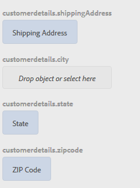

# Tutorial: Aplicar regras a campos de formulário adaptáveis {#tutorial-apply-rules-to-adaptive-form-fields}


Este tutorial é uma etapa da série [Criar seu primeiro formulário](/help/forms/using/create-your-first-adaptive-form.md) adaptável. A Adobe recomenda seguir a série em sequência cronológica para entender, executar e demonstrar o caso de uso do tutorial completo.

## Sobre o tutorial {#about-the-tutorial}

Você pode usar regras para adicionar interatividade, lógica comercial e validações inteligentes a um formulário adaptável. Formulários adaptáveis têm um editor de regras incorporado. O editor de regras fornece uma funcionalidade de arrastar e soltar, semelhante aos tours guiados. O método arrastar e soltar é o método mais rápido e fácil de criar regras. O editor de regras também fornece uma janela de código para usuários interessados em testar suas habilidades de codificação ou levar as regras para o próximo nível.

Você pode saber mais sobre o editor de regras no editor de regras do [Adaptive Forms](/help/forms/using/rule-editor.md).

Ao final do tutorial, você aprenderá a criar regras para:

* Chame um serviço de Modelo de dados de formulário para recuperar dados do banco de dados
* Chame um serviço de Modelo de dados de formulário para adicionar dados ao banco de dados
* Executar uma verificação de validações e exibir mensagens de erro

As imagens GIF interativas ao final de cada seção do tutorial ajudam você a aprender e validar a funcionalidade do formulário que está criando, dinamicamente.

## Etapa 1: Recuperar um registro de cliente do banco de dados {#retrieve-customer-record}

Você criou um modelo de dados de formulário seguindo o artigo [Criar modelo](/help/forms/using/create-form-data-model.md) de dados de formulário. Agora, você pode usar o editor de regras para chamar os serviços de Modelo de dados de formulários para recuperar e adicionar informações ao banco de dados.

A cada cliente é atribuído um número exclusivo de ID do cliente, que ajuda a identificar os dados relevantes do cliente em um banco de dados. O procedimento abaixo usa a ID do cliente para recuperar informações do banco de dados:

1. Abra o formulário adaptável para edição.

   [http://localhost:4502/editor.html/content/forms/af/change-billing-shipping-address.html](http://localhost:4502/editor.html/content/forms/af/change-billing-shipping-address.html)

1. Toque no campo ID **[!UICONTROL do]** cliente e toque no ícone **[!UICONTROL Editar regras]** . A janela Editor de regras é aberta.
1. Toque no ícone **[!UICONTROL + Criar]** para adicionar uma regra. Ele abre o Editor visual.

   No Editor visual, a instrução **[!UICONTROL WHEN]** é selecionada por padrão. Além disso, o objeto de formulário (neste caso, ID **[!UICONTROL do]** cliente) de onde você iniciou o editor de regras é especificado na declaração **[!UICONTROL WHEN]** .

1. Toque no menu suspenso **[!UICONTROL Selecionar estado]** e selecione **[!UICONTROL está alterada]**.

   

1. Na instrução **[!UICONTROL THEN]** , selecione **[!UICONTROL Chamar serviço]** no menu suspenso **[!UICONTROL Selecionar ação]** .
1. Selecione o serviço **[!UICONTROL Recuperar Endereço]** de Entrega no menu suspenso **[!UICONTROL Selecionar]** .
1. Arraste e solte o campo ID **[!UICONTROL do]** cliente da guia Objetos de formulário para o objeto **[!UICONTROL Soltar ou selecione aqui]** no campo **[!UICONTROL ENTRADA]** .

   

1. Arraste e solte o campo ID do **[!UICONTROL cliente, Nome, Endereço de entrega, Estado e CEP]** da guia Objetos de formulário para o objeto **[!UICONTROL Soltar ou selecione aqui]** no campo **[!UICONTROL SAÍDA]** .

   

   Toque em **[!UICONTROL Concluído]** para salvar a regra. Na janela do editor de regras, toque em **[!UICONTROL Fechar]**.

1. Pré-visualização o formulário adaptável. Insira uma ID no campo ID **[!UICONTROL do]** cliente. O formulário agora pode recuperar detalhes do cliente do banco de dados.

   

## Etapa 2: Adicionar o endereço do cliente atualizado ao banco de dados {#updated-customer-address}

Depois que os detalhes do cliente forem recuperados do banco de dados, você poderá atualizar o endereço de entrega, o estado e o CEP. O procedimento abaixo chama um serviço de Modelo de dados de formulário para atualizar as informações do cliente para o banco de dados:

1. Selecione o campo **[!UICONTROL Enviar]** e toque no ícone **[!UICONTROL Editar regras]** . A janela Editor de regras é aberta.
1. Selecione a regra **[!UICONTROL Enviar - Clique]** e toque no ícone **[!UICONTROL Editar]** . As opções para editar a regra Enviar são exibidas.

   

   Na opção QUANDO, as opções **[!UICONTROL Enviar]** e **[!UICONTROL for clicado]** já estão selecionadas.

   

1. Na opção **[!UICONTROL ENTÃO]** , toque na opção **[!UICONTROL + Adicionar declaração]** . Selecione **[!UICONTROL Chamar serviço]** no menu suspenso **[!UICONTROL Selecionar ação]** .
1. Selecione o serviço **[!UICONTROL Atualizar endereço]** de entrega no menu suspenso **[!UICONTROL Selecionar]** .

   

1. 

   Arraste e solte o campo Endereço de **[!UICONTROL entrega, Estado e CEP]** da guia Objetos de formulário para a propriedade tablename correspondente .property (por exemplo, customerdetails .ShippingAddress) do objeto **[!UICONTROL Drop ou selecione aqui]** o campo na caixa **[!UICONTROL INPUT]** . Todos os campos com prefixo tablename (por exemplo, detalhes do cliente neste caso de uso) servem como dados de entrada para o serviço de atualização. Todo o conteúdo fornecido nesses campos é atualizado na fonte de dados.

   >[!NOTE]
   >
   >Não arraste e solte os campos **[!UICONTROL Nome]** e ID **[!UICONTROL do]** cliente para a propriedade tablename.property correspondente (por exemplo, customerdetails.name). Isso ajuda a evitar a atualização do nome e da ID do cliente por engano.

1. Arraste e solte o campo ID **[!UICONTROL do]** cliente da guia Objetos de formulário para o campo id na caixa **[!UICONTROL ENTRADA]** . Os campos sem um nome de tablet prefixo (por exemplo, detalhes do cliente neste caso de uso) servem como parâmetro de pesquisa para o serviço de atualização. O campo **[!UICONTROL id]** nesse caso de uso identifica exclusivamente um registro na tabela de detalhes do cliente.
1. Toque em **[!UICONTROL Concluído]** para salvar a regra. Na janela do editor de regras, toque em **[!UICONTROL Fechar]**.
1. Pré-visualização o formulário adaptável. Recupere os detalhes de um cliente, atualize o endereço de envio e envie o formulário. Quando você recupera os detalhes do mesmo cliente novamente, o endereço de entrega atualizado é exibido.

## Etapa 3: (seção Bônus) Use o editor de código para executar validações e exibir mensagens de erro {#step-bonus-section-use-the-code-editor-to-run-validations-and-display-error-messages}

É necessário executar a validação no formulário para garantir que os dados inseridos no formulário estejam corretos e que uma mensagem de erro seja exibida no caso de dados incorretos. Por exemplo, se uma ID de cliente não existente for inserida no formulário, uma mensagem de erro deverá ser exibida.

Os formulários adaptáveis fornecem vários componentes com validações incorporadas, por exemplo, e-mail e campos numéricos que podem ser usados para casos de uso comuns. Use o editor de regras para casos de uso avançado, por exemplo, para exibir uma mensagem de erro quando o banco de dados retornar zero (0) registros (nenhum registro).

O procedimento a seguir mostra como criar uma regra para exibir uma mensagem de erro se a ID do cliente inserida no formulário não existir no banco de dados. A regra também traz o foco para o campo ID do cliente e o redefine. A regra usa [a API dataIntegrationUtils do serviço](/help/forms/using/invoke-form-data-model-services.md) de modelo de dados de formulário para verificar se a ID do cliente existe no banco de dados.

1. Toque no campo ID **[!UICONTROL do]** cliente e toque no `Edit Rules` ícone. A janela Editor de regras é aberta.
1. Toque no ícone **[!UICONTROL + Criar]** para adicionar uma regra. Ele abre o Editor visual.

   No Editor visual, a instrução **[!UICONTROL WHEN]** é selecionada por padrão. Além disso, o objeto de formulário (neste caso, ID **[!UICONTROL do]** cliente) de onde você iniciou o editor de regras é especificado na declaração **[!UICONTROL WHEN]** .

1. Toque no menu suspenso **[!UICONTROL Selecionar estado]** e selecione **[!UICONTROL está alterada]**.

   

   Na instrução **[!UICONTROL THEN]** , selecione **[!UICONTROL Chamar serviço]** no menu suspenso **[!UICONTROL Selecionar ação]** .

1. Mude do Editor **** visual para o Editor **** de código. O controle do switch está no lado direito da janela. O Editor de código é aberto, exibindo código semelhante ao seguinte:

   

1. Substitua a seção da variável de entrada pelo seguinte código:

   ```javascript
   var inputs = {
       "id" : this
   };
   ```

1. Substitua a seção guidelib.dataIntegrationUtils.executeOperation (operationInfo, entradas, saídas) pelo seguinte código:

   ```javascript
   guidelib.dataIntegrationUtils.executeOperation(operationInfo, inputs, outputs, function (result) {
     if (result) {
         result = JSON.parse(result);
       customer_Name.value = result.name;
       customer_Shipping_Address = result.shippingAddress;
     } else {
       if(window.confirm("Invalid Customer ID. Provide a valid customer ID")) {
             customer_Name.value = " ";
            guideBridge.setFocus(customer_ID);
       }
     }
   });
   ```

1. Pré-visualização o formulário adaptável. Insira uma ID de cliente incorreta. Uma mensagem de erro é exibida.

   

