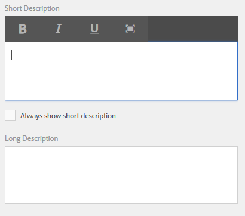

# Criação de ajuda no contexto para campos de formulário{#authoring-in-context-help-for-form-fields}

## Introdução {#introduction}

Há situações em que os usuários finais que preenchem um formulário não têm certeza de como preencher os detalhes em um campo de formulário específico. Para resolver esses problemas, os formulários adaptáveis fornecem suporte para adicionar texto ou ajuda rich in-context a um campo de formulário. Ajuda a melhorar a experiência de preenchimento do formulário e evita qualquer ambiguidade para os usuários finais.

Este artigo discute como os autores de formulários podem adicionar ajuda no contexto durante a criação do Adaptive Forms.

## Adicionar ajuda no contexto {#add-in-context-help}

Você pode especificar a ajuda no contexto usando as seguintes opções na seção Conteúdo da Ajuda da guia propriedades na barra lateral.

* [Descrição curta](../../forms/using/authoring-in-field-help.md#p-short-description-p)
* [Descrição longa](../../forms/using/authoring-in-field-help.md#p-long-description-p)

>[!NOTE]
>
>Descrição longa substitui a Descrição curta. Se você especificou ambos, somente Descrição longa será exibida.

### Descrição curta {#short-description}

O campo Short description é destinado a fornecer dicas rápidas e curtas sobre o preenchimento de um campo de formulário. O texto especificado no campo Short description é exibido como uma dica de ferramenta ao passar o mouse sobre o campo.

>[!NOTE]
>
>Selecionar **Sempre mostrar descrição curta** para exibir permanentemente o texto de ajuda abaixo do campo.

### Descrição longa {#long-description}

Você pode usar o campo Long description para especificar texto longo ou incorporar conteúdo de mídia avançada, incluindo vídeos, como ajuda de contexto. Por exemplo, a imagem a seguir mostra como você pode incorporar um vídeo como ajuda de contexto.

Adicionar descrição longa exibe uma **?** ícone ao lado do campo . Clicar no ícone exibe o conteúdo adicionado na seção de descrição longa.

### Ajuda no nível do painel {#panel-level-help}

Além da ajuda em contexto para campos de formulário, você pode especificar a ajuda em um nível de painel na guia Conteúdo da Ajuda da caixa de diálogo Editar painel.

A adição de ajuda para o painel exibe uma **?** ícone ao lado da descrição do painel. Clicar no ícone exibe o conteúdo adicionado na seção Conteúdo da Ajuda da caixa de diálogo de edição do painel.

