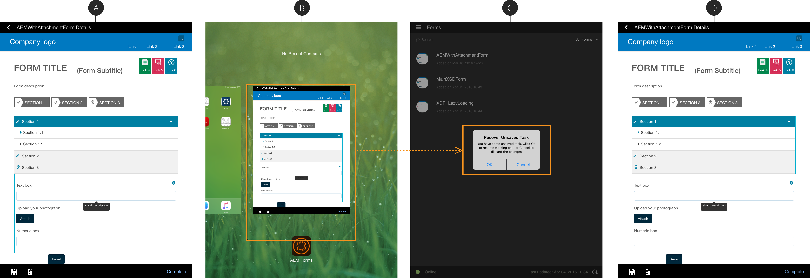

# Uso do salvamento automático em aplicativos AEM Forms{#using-autosave-in-aem-forms-app}

Quando um usuário digita dados no aplicativo Adobe Experience Manager Forms, o recurso de gravação automática os salva em intervalos regulares. O recurso de salvar automaticamente no aplicativo AEM Forms ajuda a evitar perda de dados se o aplicativo for fechado acidentalmente.

Seu aplicativo pode fechar acidentalmente:

* Se o seu dispositivo desligar devido a bateria fraca
* Se o usuário matar o aplicativo
* Se ocorrer uma falha inesperada

Você pode especificar os intervalos após os quais o aplicativo salva os dados digitados.

>[!NOTE]
>
>Selecione a frequência de salvamento automático criteriosamente. Operações frequentes de salvamento automático podem ter um impacto notável no desempenho do dispositivo.

Execute as seguintes etapas para usar o recurso de gravação automática no aplicativo AEM Forms:

1. Faça logon no aplicativo e navegue até **Configurações > Geral**.
1. Na tela Geral, use a opção **Frequência de salvamento automático** para selecionar os intervalos nos quais você deseja que o aplicativo salve os dados digitados.
   

1. Ao reiniciar o aplicativo e fazer logon com o mesmo usuário, você será solicitado a restaurar a tarefa com a caixa de diálogo Recuperar Tarefa não salva. Clique em **OK** na caixa de diálogo Recuperar Tarefa não salva para retomar o trabalho com a tarefa salva. Você pode clicar em **Cancelar** para excluir os dados salvos correspondentes ao último salvamento automático e start acionado trabalhando com uma nova tarefa.

   Quando você clica em **OK**, a tarefa é restaurada com os dados correspondentes ao salvamento automático mais recente acionado antes que o aplicativo falhe. Inclui os dados do formulário e todos os anexos associados à tarefa.
   **recuperadaA.** Um formulário de trabalho em andamento  **B.** App fechado com força  **C.** App reiniciado com a caixa de diálogo Recuperar Tarefa não salva  **D.** Formulário restaurado com dados originais

