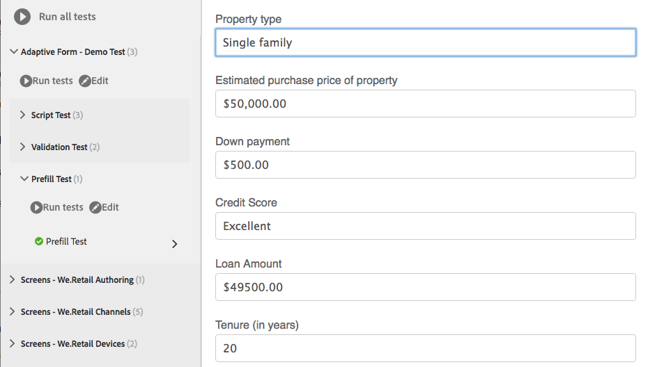

# Automatizar o teste de formulários adaptáveis{#automate-testing-of-adaptive-forms}

## Visão geral {#overview}

Os formulários adaptáveis são parte integrante das interações do cliente. É importante testar seus formulários adaptáveis com todas as alterações feitas neles, por exemplo, ao rolar um novo pacote de correções ou alterar uma regra no formulário. Entretanto, o teste funcional de formulários adaptáveis e cada campo neles pode ser entediante.

O Calvin permite automatizar o teste de seus formulários adaptáveis no navegador da Web. Calvin utiliza a interface do usuário do [Hobbes](/help/sites-developing/hobbes.md) para executar os testes e fornece as seguintes ferramentas:

* Uma API JavaScript para criar testes.
* Uma interface de usuário para executar testes.

Usando o Calvin, você pode criar casos de teste no CRXDE e executar testes da interface diretamente no navegador da Web para testar detalhadamente os seguintes aspectos dos formulários adaptáveis:

<table>
 <tbody>
  <tr>
   <td><strong>Aspecto do formulário adaptável para testar</strong></td>
   <td><strong>Descrição</strong></td>
  </tr>
  <tr>
   <td>Experiência de preenchimento prévio de um formulário adaptável</td>
   <td>
    <ul>
     <li>O formulário está sendo pré-preenchido como esperado com base no tipo de modelo de dados?</li>
     <li>Os valores padrão dos objetos de formulário estão sendo preenchidos como esperado?</li>
    </ul> </td>
  </tr>
  <tr>
   <td>Enviar experiência de um formulário adaptável</td>
   <td>
    <ul>
     <li>Os dados corretos estão sendo gerados no envio?</li>
     <li>O formulário está sendo revalidado no servidor durante o envio?</li>
     <li>A ação de envio está configurada para o formulário sendo executado?</li>
    </ul> </td>
  </tr>
  <tr>
   <td><p>Regras de expressão</p> <p> </p> </td>
   <td>
    <ul>
     <li>As expressões estão associadas a objetos de formulário, como calculate, visível, executam scripts depois de sair de um campo, sendo executadas após executar as operações relevantes da interface do usuário?<br /> </li>
    </ul> </td>
  </tr>
  <tr>
   <td>Validações</td>
   <td>
    <ul>
     <li>As validações de campo são executadas conforme esperado após executar as operações?</li>
    </ul> </td>
  </tr>
  <tr>
   <td><p>Carregamento lento</p> <p> </p> </td>
   <td>
    <ul>
     <li>Ao clicar em guias (ou em qualquer item de navegação de um painel), o HTML está sendo buscado no servidor de acordo com a configuração de carregamento lento?</li>
    </ul></td>
  </tr>
  <tr>
   <td><p>Interação da interface do usuário</p> </td>
   <td>
    <ul>
     <li><a href="https://helpx.adobe.com/aem-forms/6-3/calvin-sdk-javascript-api/calvin.html#toc2__anchor" target="_blank">Teste da interação da interface do usuário com objetos de formulário adaptável</a></li>
    </ul> </td>
  </tr>
 </tbody>
</table>

### Pré-requisitos {#prerequisites}

Antes de usar este artigo para criar seus casos de teste, você precisa saber o seguinte:

* Criar conjuntos de testes e executar casos de teste usando [Hobbes](https://docs.adobe.com/docs/en/aem/6-3/develop/components/hobbes.html)
* [APIs JavaScript do Hobbes](https://docs.adobe.com/docs/en/aem/6-2/develop/ref/test-api/index.html)
* [APIs do JavaScript do Calvin](https://helpx.adobe.com/aem-forms/6-3/calvin-sdk-javascript-api/calvin.html)

## Exemplo: Crie um conjunto de testes para um formulário adaptável usando Hobbes como estrutura de teste {#example-create-a-test-suite-for-an-adaptive-form-using-hobbes-as-testing-framework}

O exemplo a seguir mostra a criação de um conjunto de testes para testar vários formulários adaptáveis. É necessário criar um caso de teste separado para cada formulário que deve ser testado. Ao seguir etapas semelhantes às seguintes e modificar o código JavaScript na etapa 11, você pode criar seu próprio conjunto de testes para testar seus formulários adaptáveis.

1. Vá para o CRXDE Lite no navegador da Web: `https://'[server]:[port]'/crx/de`.
1. Clique com o botão direito do mouse na subpasta /etc/clientlibs e clique em **Create** > **Create Node**. Insira um nome (aqui afTestRegistration), especifique o tipo de nó como cq:ClientLibraryFolder e clique em **OK.**

   A pasta clientlibs contém o aspecto de registro do seu aplicativo (JS e Init). É recomendável registrar todos os objetos dos conjuntos de teste Hobbes específicos a um formulário na pasta clientlibs.

1. Especifique os seguintes valores de propriedade no nó recém-criado (aqui afTestRegistration) e clique em **Salvar Tudo**. Essas propriedades ajudam o Hobbes a reconhecer a pasta como um teste. Para reutilizar essa biblioteca do cliente como uma dependência em outras bibliotecas do cliente, nomeie-a como granite.testing.calvin.tests.

<table>
 <tbody>
  <tr>
   <td>Propriedade</td>
   <td>Tipo</td>
   <td>Valor</td>
  </tr>
  <tr>
   <td><p>categorias</p> </td>
   <td><p>Sequência de caracteres[]</p> </td>
   <td><p>granite.testing.hobbes.tests, granite.testing.calvin.tests</p> </td>
  </tr>
  <tr>
   <td><p>dependências</p> </td>
   <td><p>Sequência de caracteres[]</p> </td>
   <td><p>granite.testing.hobbes.testrunner, granite.testing.calvin, apps.testframework.all</p> </td>
  </tr>
 </tbody>
</table>

>[!NOTE]
>
>A clientlib granite.testing.calvin.af contém todas as APIs de formulários adaptáveis. Essas APIs fazem parte do namespace calvin.


1. Clique com o botão direito do mouse no nó de teste (aqui **afTestRegistration)** e depois clique em **Create** > **Create File**. Nomeie o arquivo js.txt e clique em **OK**.
1. No arquivo js.txt, adicione o seguinte texto:

   ```javascript
   #base=.
   js.txt
   ```

1. Clique em **Salvar tudo** e feche o arquivo js.txt.
1. Clique com o botão direito do mouse no nó de teste (aqui **afTestRegistration)** e clique em **Create** > **Create File**. Nomeie o arquivo init.js e clique em **OK**.
1. Copie o seguinte código para o arquivo init.js e clique em **Salvar tudo**:

   ```javascript
   (function(window, hobs) {
       'use strict';
       window.testsuites = window.testsuites || {};
     // Registering the test form suite to the sytem
     // If there are other forms, all registration should be done here
       window.testsuites.testForm = new hobs.TestSuite("Adaptive Form - Demo Test", {
           path: '/etc/clientlibs/afTestRegistration/init.js',
           register: true
       });
    // window.testsuites.testForm1 = new hobs.TestSuite("testForm1");
   }(window, window.hobs));
   ```

   O código acima cria um conjunto de testes chamado **Adaptive Form - Demo Test**. Para criar um conjunto de teste com um nome diferente, altere o nome de acordo.

1. Clique em **Criar** > **Criar nó** para criar um nó na pasta clientlib para cada formulário que você deseja testar. Este exemplo usa um nó chamado **testForm** para testar um formulário adaptável chamado **testForm**. Especifique as seguintes propriedades e clique em **OK**:

   * Nome: testForm (nome do formulário)
   * Tipo: cq:ClientLibraryFolder

1. Adicione as seguintes propriedades ao nó recém-criado (aqui testForm) para testar um formulário adaptável:

   | **Propriedade** | **Tipo** | **Valor** |
   |---|---|---|
   | categorias | Sequência de caracteres[] | granite.testing.hobbes.tests, granite.testing.hobbes.tests.testForm |
   | dependências | Sequência de caracteres[] | granite.testing.calvin.tests |

   >[!NOTE]
   >
   >Este exemplo usa uma dependência na biblioteca cliente granite.testing.calvin.tests para obter um melhor gerenciamento. Este exemplo também adiciona uma categoria de biblioteca do cliente, &quot;granite.testing.hobbes.tests.testForm&quot; para reutilizar esta biblioteca do cliente, se necessário.

   

1. Clique com o botão direito do mouse na pasta que você criou para o formulário de teste (aqui testForm) e selecione **Create** > **Create File**. Nomeie o arquivo scriptingTest.js e adicione o seguinte código ao arquivo e clique em **Salvar tudo.**

   Para usar o código a seguir para testar outro formulário adaptável, altere o caminho e o nome do formulário em **navigateTo** (linhas 11, 36 e 62) e os respectivos casos de teste. Para obter mais informações sobre APIs para testar diferentes aspectos de formulários e objetos de formulário, consulte [APIs Calvin](https://helpx.adobe.com/aem-forms/6-3/calvin-sdk-javascript-api/calvin.html).

   ```javascript
   (function(window, hobs) {
       'use strict';
   
    var ts = new hobs.TestSuite("Script Test", {
           path: '/etc/clientlibs/testForm/scriptingTest.js',
     register: false
    })
   
       .addTestCase(new hobs.TestCase("Checking execution of calculate script")
           // navigate to the testForm which is to be tested
           .navigateTo("/content/forms/af/testForm.html?wcmmode=disabled")
           // check if adaptive form is loaded
           .asserts.isTrue(function () {
               return calvin.isFormLoaded()
           })
           .execSyncFct(function () {
               // create a spy before checking for the expression
               calvin.spyOnExpression("panel1.textbox1");
               // setValue would trigger enter, set the value and exit from the field
               calvin.setValueInDOM("panel1.textbox", "5");
           })
           // if the calculate expression was setting "textbox1" value to "5", let's also check that
           .asserts.isTrue(function () {
               return calvin.isExpressionExecuted("panel1.textbox1", "Calculate");
           })
           .execSyncFct(function () {
               calvin.destroySpyOnExpression("panel1.textbox1");
           })
           .asserts.isTrue(function () {
               return calvin.model("panel1.textbox1").value == "5"
           })
       )
   
       .addTestCase(new hobs.TestCase("Calculate script Test")
           // navigate to the testForm which is to be tested
           .navigateTo("/content/forms/af/cal/demoform.html?wcmmode=disabled&dataRef=crx:///content/forms/af/cal/prefill.xml")
           // check if adaptive form is loaded
           .asserts.isTrue(function () {
               return calvin.isFormLoaded()
           })
   
           .execSyncFct(function () {
               // create a spy before checking for the expression
               calvin.spyOnExpression("panel2.panel1488218690733.downPayment");
               // setValue would trigger enter, set the value and exit from the field
               calvin.setValueInDOM("panel2.panel1488218690733.priceProperty", "1000000");
           })
           .asserts.isTrue(function () {
               return calvin.isExpressionExecuted("panel2.panel1488218690733.downPayment", "Calculate");
           })
           .execSyncFct(function () {
               calvin.destroySpyOnExpression("panel2.panel1488218690733.downPayment");
           })
           .asserts.isTrue(function () {
               // if the calculate expression was setting "downPayment" value to "10000", let's also check that
      return calvin.model("panel2.panel1488218690733.downPayment").value == 10000
           })
       )
   
       .addTestCase(new hobs.TestCase("Checking execution of Value commit script")
           // navigate to the testForm which is to be tested
           .navigateTo("/content/forms/af/cal/demoform.html?wcmmode=disabled&dataRef=crx:///content/forms/af/cal/prefill.xml")
           // check if adaptive form is loaded
           .asserts.isTrue(function () {
               return calvin.isFormLoaded()
           })
   
           .execSyncFct(function () {
               // create a spy before checking for the expression
               calvin.spyOnExpression("panel2.panel1488218690733.priceProperty");
               // setValue would trigger enter, set the value and exit from the field
               calvin.setValueInDOM("panel2.panel1488218690733.priceProperty", "100");
           })
           .asserts.isTrue(function () {
               return calvin.isExpressionExecuted("panel2.panel1488218690733.priceProperty", "Value Commit");
           })
           .execSyncFct(function () {
               calvin.destroySpyOnExpression("panel2.panel1488218690733.priceProperty");
           })
           .asserts.isTrue(function () {
            // if the value commit expression was setting "textbox1488215618594" value to "0", let's also check that
               return calvin.model("panel2.panel1488218690733.textbox1488215618594").value == 0
           })
       );
   
    // register the test suite with testForm
     window.testsuites.testForm.add(ts);
   
    }(window, window.hobs));
   ```

   O caso de teste é criado. Continue a executar o caso de teste para testar formulários adaptáveis por meio de Hobbes. Para obter etapas para executar os casos de teste, consulte [Executando testes em Testar sua interface do usuário usando testes automatizados](/help/sites-developing/hobbes.md).

Você também pode instalar o pacote no arquivo anexado SampleTestPackage.zip para obter os mesmos resultados das etapas explicadas em Exemplo: Crie um conjunto de testes para um formulário adaptável usando Hobbes como estrutura de teste.

[Obter arquivo](assets/sampletestpackage.zip)

## Testes da interface de usuário com testes automatizados {#testing-your-ui-using-automated-tests}

### Executando um único Test Suite {#running-a-single-test-suite}

Conjuntos de testes podem ser executados individualmente. Quando você executa um Test Suite, a página é alterada à medida que os Casos de teste e suas Ações são executados e os resultados são exibidos após a conclusão do teste. Os ícones indicam os resultados.

Um ícone de marca de verificação indica um teste aprovado: 

Um ícone &quot;X&quot; indica um teste com falha: 

Para executar um Test Suite:

1. No painel Testes, clique ou toque no nome do caso de teste que deseja executar para expandir os detalhes das ações.

   

1. Clique ou toque no botão Executar testes . 

   

1. O espaço reservado é substituído pelo conteúdo da página, conforme o teste é executado.

   

1. Revise os resultados do caso de teste tocando ou clicando na descrição para abrir o painel Resultado. Tocar ou clicar no nome do Caso de teste no painel Resultado mostra todos os detalhes.

   

As etapas para testar seus formulários adaptáveis de AEM são semelhantes às etapas para testar sua interface AEM. Para obter mais informações sobre como testar seus formulários adaptáveis, consulte os seguintes tópicos em [Testar sua interface do usuário](https://helpx.adobe.com//experience-manager/6-3/help/sites-developing/hobbes.html):

* Visualização de conjuntos de testes
* Execução de vários testes

## Glossário {#glossary}

<table>
 <tbody>
  <tr>
   <td><strong>Termo</strong></td>
   <td><strong>Descrição</strong></td>
  </tr>
  <tr>
   <td><p>Conjunto de testes</p> </td>
   <td><p>Um conjunto de testes é uma coleção de casos de teste relacionados.</p> </td>
  </tr>
  <tr>
   <td><p>Caso de teste</p> </td>
   <td><p>Um caso de teste representa uma tarefa que um usuário executa usando sua interface do usuário. Adicione casos de teste ao seu conjunto de teste para testar as atividades que os usuários executam.</p> </td>
  </tr>
  <tr>
   <td><p>Ações</p> </td>
   <td><p>As ações são métodos que executam um gesto na interface do usuário, como clicar em um botão ou preencher uma caixa de entrada com um valor.</p> <p>Os métodos das classes hobs.actions.Asserts, hobs.actions.Core e hobs.utils.af são ações que você pode usar em seus testes. Todas as ações são executadas de forma síncrona.</p> </td>
  </tr>
  <tr>
   <td><p>Ambiente de criação ou publicação</p> </td>
   <td><p>Em geral, os formulários podem ser testados no ambiente de criação ou publicação. No caso de um ambiente de publicação, por padrão, o acesso para executar o teste é restrito. Isso ocorre porque todas as bibliotecas de clientes relacionadas ao runner de teste estão dentro do /libs na estrutura do JCR.</p> </td>
  </tr>
 </tbody>
</table>

