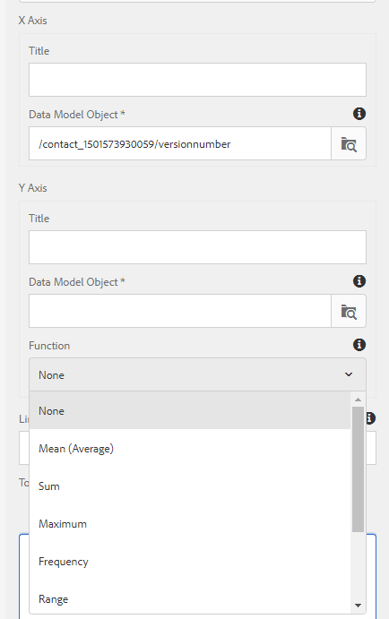
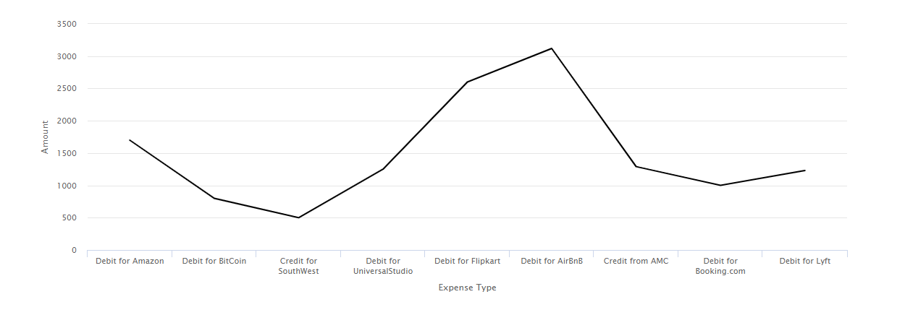

# Uso de gráficos em Comunicações Interativas{#using-charts-in-interactive-communications}

Um gráfico ou um gráfico é uma representação visual dos dados. Ele condensa grandes quantidades de informações em um formato visual fácil de entender, permitindo que os recipient da Comunicação interativa visualizem, interpretem e analisem melhor dados complexos.

Ao criar uma comunicação interativa, você pode adicionar gráficos para representar visualmente dados bidimensionais do modelo de dados de formulário do Interative Communication. O componente Gráfico permite adicionar e configurar os seguintes tipos de gráficos: Pizza, Coluna, Rosca, Barra, Linha, Linha e Ponto, Ponto, Área e Quadrante.

## Adicionar e configurar um gráfico em uma comunicação interativa {#add-and-configure-chart-in-an-interactive-communication}

Execute as seguintes etapas para adicionar e configurar um gráfico em uma Comunicação interativa:

1. Toque em **Componentes** no sidekick da Comunicação interativa.
1. Arraste e solte o componente **Gráfico** em um dos seguintes componentes:

   * canal de impressão: Área do Público alvo ou campo de imagem
   * canal da Web: Área do painel ou do Público alvo

1. Toque no componente de gráfico no editor de Comunicação interativa e selecione **[!UICONTROL Configurar (]** configure_icon ) na barra de ferramentas Componente.

   As Propriedades do gráfico são exibidas no painel esquerdo.

   

   Propriedades básicas de um gráfico de tipo de linha no canal de impressão

   

   Propriedades básicas de um gráfico de tipo de linha no canal da Web

1. Configure as propriedades [do](../../forms/using/chart-component-interactive-communications.md#configure-chart-properties) gráfico com base no tipo de canal.
1. (Somente canal de impressão) Nas Configurações **[!UICONTROL do]** agente, especifique se é obrigatório que o agente use este gráfico. Se **[!UICONTROL a opção É obrigatório para o agente usar este gráfico]** não estiver selecionada, o agente pode tocar no ícone de olho do gráfico na guia **[!UICONTROL Conteúdo]** da interface do usuário do agente para mostrar ou ocultar o gráfico.

   

1. Toque em  para salvar as propriedades do gráfico.

   Toque em **[!UICONTROL Pré-visualização]** para visualização da aparência e dos dados associados ao gráfico. Toque em **[!UICONTROL Editar]** para reconfigurar as propriedades do gráfico.

## Configurar propriedades do gráfico {#configure-chart-properties}

Configure as seguintes propriedades ao criar gráficos para canais impressos e da Web:

<table>
 <tbody>
  <tr>
   <td>Texto</td>
   <td>Descrição</td>
   <td>Tipo de canal</td>
  </tr>
  <tr>
   <td>Nome</td>
   <td>Identificador do elemento gráfico. O nome do gráfico especificado neste campo não está visível no gráfico. Ele é usado ao se referir ao elemento de outros componentes, scripts e expressões SOM.</td>
   <td>Imprimir e Web</td>
  </tr>
  <tr>
   <td>Tipo de gráfico</td>
   <td>Tipo de gráfico que deseja gerar. As opções disponíveis são Pizza, Coluna, Rosca, Barra, Linha, Linha e Ponto, Ponto e Área.</td>
   <td>Imprimir e Web</td>
  </tr>
  <tr>
   <td>Série &gt; Várias séries</td>
   <td>Selecione para adicionar várias séries para os itens de coleção do modelo de dados de formulário representados no eixo X e no eixo Y.</td>
   <td>Imprimir e Web</td>
  </tr>
  <tr>
   <td>Série &gt; Objeto de modelo de dados</td>
   <td>Nome do item de coleta do modelo de dados de formulário para adicionar várias séries ao gráfico.<br /> Escolha uma propriedade de objeto de modelo de dados de formulário pai para as propriedades plotadas nos eixos X e Y para formar uma série significativa. O objeto de modelo de dados vinculado deve ser do tipo Número, String ou Data.</td>
   <td>Imprimir e Web</td>
  </tr>
  <tr>
   <td>Mostrar empilhado</td>
   <td>Opte por empilhar os valores de cada séria, um sobre o outro.</td>
   <td>Imprimir e Web</td>
  </tr>
  <tr>
   <td>Eixo X &gt; Título</td>
   <td>Título do eixo X.</td>
   <td>Imprimir e Web</td>
  </tr>
  <tr>
   <td>Eixo X &gt; Objeto do modelo de dados</td>
   <td><p>Nome do item de coleta do modelo de dados de formulário a ser representado no eixo X.</p> <p>Escolha duas propriedades do tipo coleção/matriz do mesmo objeto de modelo de dados pai que sejam significativas em relação umas às outras para plotar nos eixos X e Y de um gráfico. O objeto de modelo de dados vinculado deve ser do tipo Número, String ou Data.</p> </td>
   <td>Imprimir e Web</td>
  </tr>
  <tr>
   <td>Eixo Y &gt; Título</td>
   <td>Título do eixo Y. </td>
   <td>Imprimir e Web</td>
  </tr>
  <tr>
   <td>Eixo Y &gt; Objeto do modelo de dados</td>
   <td><p>Item de coleta do modelo de dados do formulário a ser representado no eixo Y. No canal Print, o objeto de modelo de dados para o eixo Y deve ser do tipo Number.</p> <p>Escolha duas propriedades do tipo coleção/matriz do mesmo objeto de modelo de dados pai que sejam significativas em relação umas às outras para plotar nos eixos X e Y de um gráfico. </p> </td>
   <td>Imprimir e Web</td>
  </tr>
  <tr>
   <td>Eixo Y &gt; Função</td>
   <td>Função estatística/personalizada a ser usada para calcular os valores no eixo y.</td>
   <td>Imprimir e Web</td>
  </tr>
  <tr>
   <td>Ocultar objeto</td>
   <td>Selecione para ocultar o gráfico na saída final.</td>
   <td>Imprimir e Web</td>
  </tr>
  <tr>
   <td>Título</td>
   <td>Título do gráfico. </td>
   <td>Impressão</td>
  </tr>
  <tr>
   <td>Altura</td>
   <td>Altura do gráfico em pixels.</td>
   <td>Impressão</td>
  </tr>
  <tr>
   <td>Largura</td>
   <td>Largura do gráfico em pixels. É possível controlar a largura do gráfico no canal da Web usando a camada de estilo ou aplicando um tema.</td>
   <td>Impressão</td>
  </tr>
  <tr>
   <td>Quebra de página obrigatória antes</td>
   <td>Selecione para adicionar uma quebra de página obrigatória antes do gráfico e colocar o gráfico na parte superior de uma nova página. </td>
   <td>Impressão</td>
  </tr>
  <tr>
   <td>Quebra de página obrigatória após</td>
   <td>Selecione para adicionar uma quebra de página obrigatória após o gráfico e colocar o conteúdo após o gráfico na parte superior de uma nova página. </td>
   <td>Impressão</td>
  </tr>
  <tr>
   <td>Recuo</td>
   <td>Recuo do gráfico à esquerda da página. </td>
   <td>Impressão</td>
  </tr>
  <tr>
   <td>Dica</td>
   <td><p>Formato no qual a dica de ferramenta aparece ao passar o mouse sobre um ponto de dados no gráfico no canal da Web. O valor padrão é ${x}(${y}). Dependendo do tipo de gráfico, quando você aponta o mouse para um ponto, barra ou fatia no gráfico, as variáveis ${x}e ${y} são substituídas dinamicamente pelos valores correspondentes no eixo X e no eixo Y e exibidas na dica de ferramenta.</p> <p>Para desativar a dica de ferramenta, deixe o campo <span class="uicontrol">Dica</code> de ferramenta em branco. Essa opção não se aplica a gráficos de linha e de área. Por exemplo, consulte <a href="#chartoutputprintweb">Exemplo 1: Saída de gráfico na Web</a>e na impressão.</code></p> </td>
   <td>Web</td>
  </tr>
  <tr>
   <td>Configurações específicas ao gráfico</td>
   <td><p>Além das configurações comuns, a seguinte configuração específica do gráfico está disponível:</p>
    <ul>
     <li><strong>Mostrar legenda: </strong>Mostra uma legenda para o gráfico de pizza ou rosca quando ativado.</li>
     <li><strong>Posição da legenda: </strong>Especifica a posição da legenda em relação ao gráfico. As opções disponíveis são Direita, Esquerda, Superior e Inferior. É recomendável usar a legenda do lado direito no canal de impressão.</li>
     <li><strong>Raio</strong>interno: Disponível para gráficos de rosca para especificar o raio (em pixels) do círculo interno no gráfico.</li>
     <li><strong>Cor</strong>da linha: Disponível para gráficos de Linha, Linha e Ponto e Área para especificar a cor da linha no gráfico.</li>
     <li><strong>Cor</strong>do ponto: Disponível para gráficos Ponto e Linha e Ponto para especificar a cor dos pontos no gráfico.<br /> </li>
     <li><strong>Cor</strong>da área: Disponível para gráficos de Área para especificar a cor da área sob a linha no gráfico.</li>
     <li><strong>Ponto de referência &gt; Tipo de vínculo: </strong>Disponível para gráficos do Quadrante para<strong> </strong>especificar o tipo de vínculo para o ponto de referência. Use texto estático ou propriedade de objeto de modelo de dados para definir o valor do ponto de referência.</li>
     <li><strong>Ponto de referência &gt; Eixo dos X: </strong>Disponível para gráficos de Quadrante se você selecionar <span class="uicontrol">Estático</code> na lista suspensa Tipo de Vínculo para especificar o valor do eixo X para o ponto de referência.</code></li>
     <li><strong>Ponto de referência &gt; Eixo Y: </strong>Disponível para gráficos de Quadrante se você selecionar <span class="uicontrol">Estático</code> na lista suspensa Tipo de Vínculo para especificar o valor do eixo Y para o ponto de referência.</code></li>
     <li><strong>Ponto de referência &gt; Objeto de modelo de dados para séries: </strong>Disponível para gráficos Quadrantes de várias séries se você selecionar Objeto <span class="uicontrol">de Modelo de</code> Dados na lista suspensa Tipo de Vínculo. Defina a propriedade do objeto de modelo de dados de formulário para identificar o conjunto do ponto de referência. </code></li>
     <li><strong>Ponto de referência &gt; Valor do objeto do modelo de dados para séries: </strong>Disponível para gráficos Quadrantes de várias séries se você selecionar Objeto <span class="uicontrol">de Modelo de</code> Dados na lista suspensa Tipo de Vínculo. Use a propriedade de objeto de modelo de dados de formulário para séries e o valor definido neste campo para identificar a série para o ponto de referência.</code></li>
     <li><strong>Ponto de referência &gt; Objeto de modelo de dados para ponto de referência: </strong>Disponível para gráficos de Quadrante se você selecionar Objeto <span class="uicontrol">de Modelo de</code> Dados na lista suspensa Tipo de Vínculo. Defina uma propriedade de objeto de modelo de dados de formulário que seja um irmão das propriedades plotadas nos eixos X e Y. Além disso, para várias séries, defina uma propriedade de objeto de modelo de dados que seja uma entidade secundária da propriedade de objeto de modelo de dados definida para a série.</code></li>
     <li><strong>Ponto de referência &gt; Valor do objeto do modelo de dados para o ponto de referência: </strong>Disponível para gráficos de Quadrante se você selecionar Objeto <span class="uicontrol">de Modelo de</code> Dados na lista suspensa Tipo de Vínculo. Use a propriedade de objeto de modelo de dados de formulário para o ponto de referência e o valor definido nesse campo para identificar o ponto de referência do gráfico.<br /> Rótulos <strong>do quadrante &gt; Superior esquerdo:</strong> Disponível para gráficos do Quadrante para especificar o nome do quadrante Superior Esquerdo.</code></li>
     <li><strong>Rótulos do quadrante &gt; Parte superior direita:</strong> Disponível para gráficos de Quadrante para especificar o nome do quadrante Superior direito.</li>
     <li><strong>Rótulos do quadrante &gt; Inferior direito: </strong>Disponível para gráficos do Quadrante para especificar o nome do quadrante inferior direito.</li>
     <li><strong>Rótulos do quadrante &gt; Inferior esquerdo: </strong>Disponível para gráficos do Quadrante para especificar o nome do quadrante inferior esquerdo.</li>
    </ul> </td>
   <td>Imprimir e Web</td>
  </tr>
 </tbody>
</table>

## Usar funções no gráfico {#use-functions-in-chart}

Você pode configurar um gráfico para usar funções estatísticas para calcular valores a partir dos dados de origem para plotar no gráfico. Ao aplicar funções em um gráfico, é possível plotar dados que não são fornecidos diretamente pelo modelo de dados do formulário.



Enquanto o componente Gráfico vem com algumas funções incorporadas, você pode gravar funções [](#customfunctionsweb) personalizadas e disponibilizá-las para uso na configuração do gráfico no canal da Web.

As seguintes funções estão disponíveis por padrão com o componente Gráfico:

**Média (Média)** Retorna a média dos valores no eixo X ou Y para um dado valor no outro eixo.

**Soma** Retorna a soma de todos os valores no eixo X ou Y para um dado valor no outro eixo.

**Máximo** Retorna o máximo dos valores no eixo X ou Y para um determinado valor no outro eixo.

**Frequency** Retorna o número de valores no eixo X ou Y para um dado valor no outro eixo.

**Intervalo** Retorna a diferença entre o máximo e o mínimo dos valores no eixo X ou Y para um dado valor no outro eixo.

**Median** Retorna o valor que separa valores mais altos e mais baixos na metade no eixo X ou Y para um dado valor no outro eixo.

**Mínimo** Retorna o mínimo dos valores no eixo X ou Y para um dado valor no outro eixo.

**Modo** Retorna o valor com a maioria das ocorrências no eixo X ou Y para um dado valor no outro eixo.

Para obter mais informações, consulte [Exemplo 2: Aplicação das funções Soma e Frequência em um gráfico](#applicationsumfrequency)de linhas.

### Funções personalizadas no canal da Web {#customfunctionsweb}

Além de usar as funções padrão em gráficos, você pode gravar funções personalizadas no JavaScript™ e disponibilizá-las na lista de funções no componente Gráfico para o canal da Web.

Uma função usa uma matriz ou valores e um nome de categoria como entradas e retorna um valor. Por exemplo:

```
Multiply(valueArray, category) {
 var val = 1;
 _.each(valueArray, function(value) {
 val = val * value;
 });
 return val;
}
```

Depois de gravar uma função personalizada, faça o seguinte para disponibilizá-la para uso na configuração do gráfico:

1. Adicione a função personalizada na biblioteca do cliente associada ao Interative Communication relevante. Para obter mais informações, consulte [Configuração da ação](/help/forms/using/configuring-submit-actions.md) Enviar e [Uso de bibliotecas](/help/sites-developing/clientlibs.md)do lado do cliente.

1. Para exibir a função personalizada no menu suspenso Função, no CRXDe Lite, crie um `nt:unstructured` nó na pasta de aplicativos com as seguintes propriedades:

   * Adicionar propriedade `guideComponentType` com valor como `fd/af/reducer`. (mandatory)

   * Adicione a propriedade `value` a um nome totalmente qualificado da função personalizada do JavaScript™. (obrigatório) e defina seu valor como o nome da função personalizada, como Multiplicar.
   * Adicione a propriedade `jcr:description` com o valor que deseja exibir como o nome da função personalizada que aparece no menu suspenso Função. Por exemplo, **Multiplicar**.

   * Adicione uma propriedade `qtip` com um valor que será uma breve descrição da função personalizada. Ela é exibida como uma dica de ferramenta ao passar o ponteiro do mouse sobre o nome da função na lista suspensa **Função** .

1. Clique em **Salvar tudo** para salvar a configuração.

A função agora está disponível para uso no Gráfico.

## Exemplo 1: Saída de gráfico na impressão e na Web {#chartoutputprintweb}

Na guia Básico, você define o tipo de gráfico, as propriedades do modelo de dados de formulário de origem que contêm dados, os rótulos a serem representados no eixo X e no eixo Y do gráfico e, opcionalmente, a função estatística para calcular os valores de plotagem no gráfico.

Vamos entender detalhadamente as informações mínimas exigidas nas propriedades básicas, com a ajuda de uma instrução de cartão gerada por meio de uma Comunicação interativa. Considere que você deseja gerar um gráfico para descrever a quantidade de diferentes despesas na declaração. Você deseja usar diferentes tipos de gráficos para impressão e saída da Web da Comunicação Interativa.

### Gráfico de colunas para impressão {#columnchartprint}

Para fazer isso, especifique as seguintes propriedades:

* **[!UICONTROL Nome]** - Especifique o nome do gráfico.
* **[!UICONTROL Tipo]** de gráfico - Selecione **Coluna** na lista suspensa.
* **[!UICONTROL Título]** - Especifique o Tipo de Despesa para o eixo X e a Quantia da Transação para o eixo Y.
* **[!UICONTROL Objetos]** do modelo de dados - Selecione as propriedades do objeto do modelo de dados para criar vínculos de dados para os eixos X (Tipo de Despesa) e Y (Quantia de Transação).


Gráfico de colunas no canal de impressão de uma comunicação interativa

### Gráfico de rosca para Web {#donutchartweb}

Para fazer isso, especifique as seguintes propriedades:

* **[!UICONTROL Nome]** - Especifique o nome do gráfico.
* **[!UICONTROL Tipo]** de gráfico - Selecione **[!UICONTROL Rosca]** na lista suspensa.
* **[!UICONTROL Objetos]** do modelo de dados - Selecione as propriedades do objeto do modelo de dados para criar vínculos de dados para os eixos X (Tipo de Despesa) e Y (Quantia de Transação).
* **[!UICONTROL Raio]** interno - Especifique o valor do Raio interno como 150 para especificar o raio (em pixels) do círculo interno no gráfico.
* **[!UICONTROL Dica de ferramenta]** - Use o formato padrão ${x}(${y}) para exibir a dica de ferramenta. A dica de ferramenta é exibida como: Tipo de Despesa (Quantia da Transação). Exemplo: Débito para Bitcoin(10000).


Gráfico de rosca no canal da Web de uma comunicação interativa

## Exemplo 2: Aplicação das funções Soma e Frequência em um gráfico de linhas {#applicationsumfrequency}

Ao aplicar funções em um gráfico, é possível plotar dados que não são fornecidos diretamente pelo modelo de dados do formulário. Neste exemplo, usamos um exemplo de declaração de cartão de crédito para entender como as funções Soma e Frequência podem ser aplicadas ao gráfico.


Gráfico de linhas sem uma função com duas transações &quot;Débito para AirBnB&quot;

### Função de soma {#sum-function}

É possível aplicar a função sum para adicionar valores de várias instâncias da mesma propriedade de dados e mostrá-la apenas uma vez. Por exemplo, no gráfico a seguir, a função Sum é aplicada no eixo Y para somar o montante dos dois Débitos para transações AirBnB (2050 e 1050) e mostrar apenas uma transação (3100).

A função Sum pode tornar o gráfico mais útil quando você deseja agrupar e exibir a soma de muitas instâncias da mesma propriedade de dados.



### Função de frequência {#frequency-function}

A função Frequency retorna o número de valores do eixo Y para um dado valor no outro eixo. Com a aplicação da função Frequency no eixo Y (Quantia da Transação), o gráfico mostra que houve duas ocorrências de Débito para transações do AirBnB e uma ocorrência do restante dos tipos de transações.


## Exemplo 3: Gráfico Quadrante de Várias Séries na Web {#example-multi-series-quadrant-chart-in-web}

O gráfico representa a quantia para transações executadas em um intervalo de datas específico. O gráfico Quadrante oferece a capacidade de dividir a área do gráfico em quatro seções rotuladas. O caractere usa um ponto de referência estático para os eixos X e Y. Use o recurso de várias séries para separar dados com base no nome do banco.

Para fazer isso, especifique as seguintes propriedades:

* **Nome:** Especifique o nome do gráfico.
* **Tipo de gráfico:** Selecione **Quadrante** na lista suspensa.

* Marque a caixa de seleção **Várias séries** .
* **Objeto** de Modelo de Dados: Especifique a propriedade de objeto de modelo de dados para a série. A propriedade de objeto de modelo de dados para o nome do banco é um pai das propriedades de objetos de modelo de dados plotadas nos eixos X e Y.
* **Objetos do modelo de dados:** Selecione as propriedades do objeto de modelo de dados para criar vínculos de dados para os eixos X (Data da Transação) e Y (Quantia da Transação).
* Na seção Ponto **de** referência, selecione **Estático** como o Tipo de vínculo.

* Especifique os valores para os pontos de referência do eixo X e do eixo Y.
* Especifique os rótulos do quadrante para os quadrantes Superior Esquerdo, Superior Direito, Inferior Direito e Inferior Esquerdo.
* Marque a caixa de seleção **Mostrar legendas** para exibir os códigos de cor dos nomes dos bancos.


