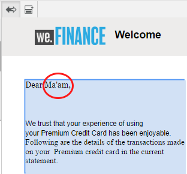
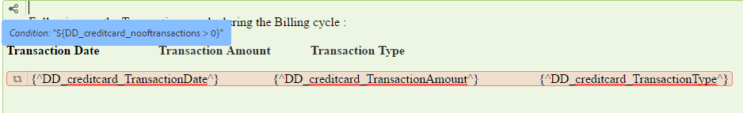

# Condição embutida e repetição em Comunicações interativas e cartas{#inline-condition-and-repeat-in-interactive-communications-and-letters}

## Condições em linha {#inline-conditions}

O AEM Forms permite usar condições em linha em módulos de texto para automatizar a renderização do texto que depende do contexto ou dos dados associados ao modelo de dados de formulário (em Comunicação interativa) ou ao dicionário de dados (em letras). A condição em linha exibe o conteúdo específico com base na avaliação da condição ser verdadeiro ou falso.

As condições executam cálculos em valores de dados fornecidos pelo modelo de dados de formulário/Dicionário de dados ou pelos usuários finais. Usando condições em linha, você pode economizar tempo e reduzir erros humanos, enquanto cria comunicações/cartas altamente contextuais e personalizadas interativas.

Para obter mais informações, consulte:

* [Criar uma comunicação interativa](../../forms/using/create-interactive-communication.md)
* [Visão geral do gerenciamento de correspondência](/help/forms/using/cm-overview.md)
* [Texto em Comunicações interativas](../../forms/using/texts-interactive-communications.md)

### Exemplo: Uso de regras para condicionar texto em linha na Comunicação Interativa {#example-using-rules-to-conditionalize-inline-text-in-interactive-communication}

Para condicionalizar uma frase, parágrafo ou string de texto em uma Comunicação interativa, é possível criar uma regra no fragmento de documento de texto apropriado. O exemplo a seguir usa uma regra para exibir um número gratuito somente para os recipients dos EUA da Comunicação interativa.

Para obter mais informações, consulte Criar regra no texto em [Textos em Comunicações interativas](../../forms/using/texts-interactive-communications.md).

Depois de incluir o fragmento de texto em uma Comunicação interativa e o Agente usar a interface do usuário do agente para preparar uma Comunicação interativa, os dados (modelo de dados de formulário) para os recipients são avaliados e o texto é mostrado somente para os recipients nos EUA.

### Exemplo: Uso da condição em linha em uma carta para renderizar o endereço apropriado {#example-using-inline-condition-in-a-letter-to-render-the-appropriate-address}

Você pode inserir uma condição em linha em uma carta inserindo a condição em linha no módulo de texto apropriado. O exemplo a seguir usa duas condições para avaliar e exibir o endereço apropriado, Senhor ou Senhora, em uma carta baseada no elemento DD Gênero. Usando etapas semelhantes, você pode criar outras condições.

>[!NOTE]
>
>Se os ativos existentes incluírem expressões de condição antiga/repetição (pré 6.2 SP1 CFP 4), os ativos exibirão a sintaxe antiga de condição e repetição. No entanto, a condição antiga/repetição funciona. As expressões condição nova e antiga/repetição são compatíveis entre si para criar uma combinação aninhada de expressões antigas e novas de condição/repetição.

1. No módulo de texto relevante, selecione a parte de texto que deseja condicionar e toque em **Condition**.

   

   A caixa de diálogo Condição é exibida com uma condição vazia.

   

   >[!NOTE]
   >
   >Não é possível salvar uma expressão condicional vazia ou inválida. Tem de haver uma expressão condicional válida dentro de `${}` para guardar a expressão.

1. Faça o seguinte para criar uma condição para avaliar se o texto selecionado/condicionado aparece na letra e toque na marca de seleção para salvar a expressão:

   Toque duas vezes em um elemento DD para inseri-lo na condição. Insira o operador apropriado e construa a seguinte condição na caixa de diálogo.

   ```javascript
   ${DD_creditcard_Gender=="Male"}
   ```

   Para obter mais informações sobre como criar a expressão, consulte **Criação de expressões e funções remotas com o construtor de expressões** em [Construtor de expressões](../../forms/using/expression-builder.md). O valor especificado na expressão deve ser suportado para o elemento no dicionário de dados. Para obter mais informações, consulte [Dicionário de dados](../../forms/using/data-dictionary.md).

   Depois que a condição é inserida, você pode passar o mouse sobre a alça à esquerda da condição para visualizá-la. Toque na alça para exibir o menu pop-up da condição, que permite editar ou remover a condição.

    

1. Insira uma condição semelhante selecionando o texto `Ma'am`.

   ```javascript
   ${DD_creditcard_Gender == "Female"}
   ```

1. Pré-visualize a letra relevante e observe que o texto é renderizado de acordo com a condição em linha. Você pode inserir o valor do elemento DD Gênero usando:

   * Um arquivo de dados XML de amostra criado com base no dicionário de dados relevante ao visualizar a carta com dados de amostra.
   * Um arquivo de dados XML anexado ao dicionário de dados relevante.

   Para obter mais informações, consulte [Dicionário de dados](../../forms/using/data-dictionary.md).

   

## Repetir {#repeat}

Você pode ter informações dinâmicas em sua Comunicação/carta interativa, como transações em uma declaração de cartão de crédito, cuja instância ou ocorrência pode continuar mudando com cada carta gerada. Usando a repetição, você pode formatar e estruturar essas informações dinâmicas no fragmento do documento de texto.

Além disso, você pode especificar a regra/condição na construção de repetição para condicionar as informações/entradas renderizadas na Comunicação/letra interativa.

### Exemplo: Usando a repetição em uma Comunicação Interativa para formatar, estruturar e exibir uma lista de transações de cartão de crédito {#example-using-repeat-in-an-interactive-communication-to-format-structure-and-display-a-list-of-credit-card-transactions}

O exemplo a seguir fornece as etapas para usar repetição para estruturar e renderizar as transações de cartão de crédito em uma Comunicação Interativa.

1. Em um fragmento de documento de texto baseado no modelo de dados de formulário, insira os objetos de modelo de dados de formulário relevantes (e o texto incorporado necessário para os rótulos, como neste exemplo):

   

   >[!NOTE]
   >
   >O conteúdo repetível deve incluir pelo menos uma propriedade do tipo Collection.

1. Selecione o conteúdo no qual aplicar repetição.

   

1. Toque em Repetir.

   A caixa de diálogo Repetir é exibida.

   

1. Selecione Quebra de linha como separador e, se necessário, toque em Adicionar condição para criar uma regra. Também é possível usar o texto como separador e especificar os caracteres de texto a serem usados como separador.

   A caixa de diálogo Criar regra é exibida.

1. Crie uma regra para exibir transações datadas de 28 de fevereiro de 2018 para incluir as transações somente para o mês de março na Comunicação interativa.

   >[!NOTE]
   >
   >Este exemplo assume que o Agente criará a declaração no final de março de 2018. Caso contrário, você poderá criar outra regra para incluir transações antes de 2018-04-01 para excluir transações após março de 2018.

   

1. Salve a condição/regra e salve a repetição. A repetição condicional é aplicada ao conteúdo selecionado.

   

   Ao passar o mouse sobre ele, o fragmento do documento de texto exibe a Condição e o separador usado na repetição aplicada ao conteúdo.

1. Salve o fragmento do documento de texto e visualize a Comunicação interativa relevante. Dependendo dos dados no modelo de dados de formulário, a repetição aplicada nos elementos renderiza os detalhes da transação da seguinte maneira na visualização:

   

### Exemplo: Usar a repetição em uma carta para formatar, estruturar e exibir uma lista de transações de cartão de crédito {#example-using-repeat-in-a-letter-to-format-structure-and-display-a-list-of-credit-card-transactions}

O exemplo a seguir fornece as etapas para usar a repetição para estruturar e renderizar as transações com cartão de crédito em uma carta. Usando etapas semelhantes, você pode usar a repetição em um cenário diferente.

1. Abra (ao editar ou criar) um módulo de texto que tenha elementos de DD que renderizem dados repetidos/dinâmicos e incorporem o texto necessário ao redor dos elementos de DD. Por exemplo, um módulo de texto tem os seguintes elementos de DD para criar um demonstrativo de transações em um cartão de crédito:

   ```javascript
   {^DD_creditcard_TransactionDate^} {^DD_creditcard_TransactionAmount^}
   {^DD_creditcard_TransactionType^}
   ```

   Esses elementos de DD renderizam uma lista das transações feitas no cartão de crédito com as seguintes informações:

   Data da transação, Valor da transação e Tipo de transação (Débito ou Crédito)

1. Incorpore o texto dentro dos elementos de DD para tornar a declaração mais legível, como a seguir:

   

   ```javascript
   Date: {^DD_creditcard_TransactionDate^} Amount (USD): {^DD_creditcard_TransactionAmount^} Transaction Type: {^DD_creditcard_TransactionType^}
   ```

   O trabalho de renderização de uma declaração bem formatada, no entanto, ainda não foi feito. Se você renderizar uma carta com base no trabalho feito até o momento, ela aparecerá da seguinte maneira:

   

   Para repetir o texto estático junto com os elementos DD, é necessário aplicar a repetição conforme explicado nas etapas adicionais.

1. Selecione o texto estático, bem como os elementos de DD que deseja repetir, conforme mostrado abaixo:

   

1. Toque em **Repetir**. A caixa de diálogo Repetir é exibida com uma condição em linha vazia.

   

1. Se necessário, insira uma condição para renderizar seletivamente as transações, por exemplo, para renderizar valores de transação maiores que 50 centavos:

   ```javascript
   ${DD_creditcard_TransactionAmount > 0.5}
   ```

   Caso contrário, se você não precisar renderizar as informações (aqui as transações) seletivamente, mantenha a condição vazia, excluindo o seguinte na caixa de diálogo: `${}`. Salvar uma expressão de repetição é ativado quando a janela de expressão de repetição está vazia (sem ${} quando nenhuma repetição é necessária) ou quando contém uma condição válida para repetição.

1. Selecione um separador para formatar o texto dinâmico e toque na marca de seleção para guardar:

   * **Quebra** de linha: Insere quebra de linha após cada entrada de transação na carta de saída.
   * **Texto**: Insere o caractere de texto especificado após cada entrada de transação na letra de saída.

   Depois que a condição é inserida, o texto com repetição é realçado em vermelho e uma alça é exibida à esquerda. Você pode passar o mouse sobre a alça à esquerda da repetição para exibir a construção repetida.

   

   Toque no identificador para exibir o menu pop-up da repetição, o que permite editar ou remover a construção repetida.

   

1. Visualize a carta relevante e observe que o texto é renderizado de acordo com a repetição. Você pode inserir o valor de elementos DD usando:

   * Um arquivo de dados XML de amostra criado com base no dicionário de dados relevante ao visualizar a carta com dados de amostra.
   * Um arquivo de dados XML anexado ao dicionário de dados relevante.

   Para obter mais informações, consulte [Dicionário de dados](https://helpx.adobe.com/aem-forms/6-2/data-dictionary.html).

   

   O texto estático se repete com os detalhes da transação. O texto estático repetido é facilitado pela repetição aplicada ao texto no presente procedimento. A condição, ${DD_creditcard_TransactionAmount > 0.5}, garante que as transações abaixo de USD.5 não sejam renderizadas na carta.

   >[!NOTE]
   >
   >Você pode inserir uma condição e repetir somente ao criar ou editar o módulo de texto relevante. Ao visualizar a carta, embora seja possível fazer edições no módulo de texto, não é possível inserir uma condição ou repetir.

## Uso de condição em linha e repetição - alguns casos de uso {#using-inline-condition-and-repeat-some-use-cases}

### Repetir dentro da condição {#repeat-within-condition}

Pode ser necessário usar a repetição em uma condição. O Gerenciamento de correspondência permite usar repetições em uma construção de condição em linha.

Por exemplo, a seguir é repetida (formatada em vermelho) em uma condição (formatada em verde).

Enquanto a repetição renderiza as transações do cartão de crédito, a condição ${DD_creditcard_nooftransactions > 0} garante que a construção repetida seja renderizada somente se houver pelo menos uma transação.



Da mesma forma, de acordo com seu requisito, é possível criar:

* Uma ou mais condições em uma condição
* Uma ou mais condições em uma repetição
* Uma combinação de condições e repetição de uma situação ou repetição

### Condição em linha vazia {#empty-inline-condition}

Talvez seja necessário inserir condições em linha vazias e incorporar texto e elementos DD posteriormente. O Gerenciamento de correspondência permite fazer isso.


No entanto, é recomendável que, se possível, você insira os elementos text e DD primeiro no módulo de texto com a formatação pretendida, como marcadores, e aplique uma condição em linha depois.
