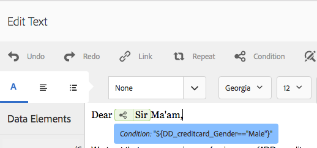
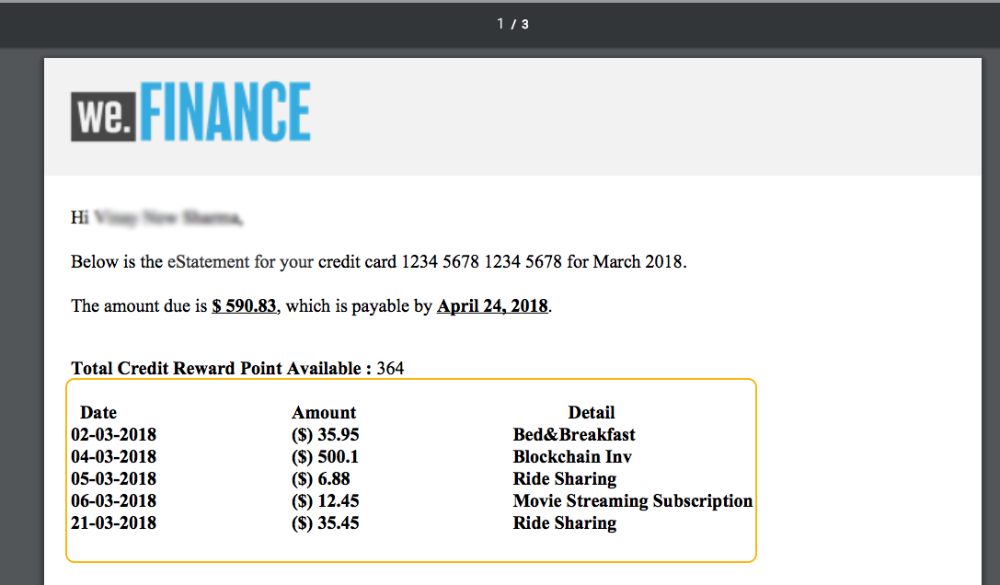
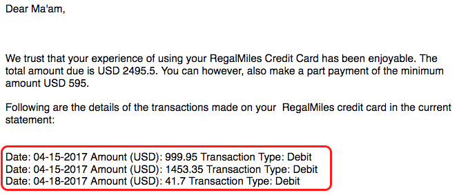

# Condição em linha e repetição em comunicações interativas e cartas{#inline-condition-and-repeat-in-interactive-communications-and-letters}

## Condições em linha {#inline-conditions}

O AEM Forms permite usar condições em linha em módulos de texto para automatizar a renderização de texto que depende do contexto ou dos dados associados ao modelo de dados de formulário (na Comunicação interativa) ou ao dicionário de dados (em letras). A condição em linha exibe um conteúdo específico com base na avaliação da condição como verdadeiro ou falso.

As condições executam cálculos nos valores de dados fornecidos pelo modelo/dicionário de dados do formulário ou pelos usuários finais. Usando condições em linha, você pode economizar tempo e reduzir erros humanos, enquanto cria comunicações/cartas interativas altamente contextuais e personalizadas.

Para obter mais informações, consulte:

* [Criar uma comunicação interativa](../../forms/using/create-interactive-communication.md)
* [Visão geral do gerenciamento de correspondência](/help/forms/using/cm-overview.md)
* [Texto em comunicações interativas](../../forms/using/texts-interactive-communications.md)

### Exemplo: usar regras para condicionar o texto em linha na Comunicação interativa {#example-using-rules-to-conditionalize-inline-text-in-interactive-communication}

Para condicionalizar uma frase, parágrafo ou string de texto em uma Comunicação interativa, você pode criar uma regra no fragmento de documento de texto apropriado. O exemplo a seguir usa uma regra para exibir um número de chamada gratuita somente para os recipients dos EUA da Comunicação interativa.

Para obter mais informações, consulte Criar regra no texto em [Textos em comunicações interativas](../../forms/using/texts-interactive-communications.md).

Depois de incluir o fragmento de texto em uma comunicação interativa e o agente usar a interface do usuário do agente para preparar uma comunicação interativa, os dados (modelo de dados de formulário) dos recipients serão avaliados e o texto será exibido apenas para os recipients nos EUA.

### Exemplo: usar a condição em linha em uma correspondência para renderizar o endereço apropriado  {#example-using-inline-condition-in-a-letter-to-render-the-appropriate-address}

Você pode inserir a condição em linha em uma correspondência inserindo a condição em linha no módulo de texto apropriado. O exemplo a seguir usa duas condições para avaliar e exibir o endereço apropriado, Senhor ou Senhora, em uma carta com base no elemento DD Gênero. Usando etapas semelhantes, você pode criar outras condições.

>[!NOTE]
>
>Se os ativos existentes incluírem expressões antigas de condição/repetição (pré 6.2 SP1 CFP 4), os ativos exibirão uma sintaxe antiga de condição e serão repetidos. No entanto, a condição/repetição antiga funciona. As expressões nova e antiga condição/repetição são compatíveis entre si para criar uma combinação aninhada de expressões antigas e novas condição/repetição.

1. No módulo de texto relevante, selecione a parte do texto que deseja condicionar e toque em **Condição**.

   

   A caixa de diálogo Condição é exibida com uma condição vazia.

   

   >[!NOTE]
   >
   >Não é possível salvar uma expressão condicional vazia ou inválida. Deve haver uma expressão condicional válida dentro de `${}` para salvar a expressão.

1. Faça o seguinte para construir uma condição para avaliar se o texto selecionado/condicionado aparece na correspondência e toque na marca de seleção para salvar a expressão:

   Toque duas vezes em um elemento DD para inseri-lo na condição. Insira o operador apropriado e crie a seguinte condição na caixa de diálogo.

   ```javascript
   ${DD_creditcard_Gender=="Male"}
   ```

   Para obter mais informações sobre como criar a expressão, consulte **Criar expressões e funções remotas com o construtor de expressões** in [Construtor de expressões](../../forms/using/expression-builder.md). O valor especificado na expressão deve ser suportado para o elemento no dicionário de dados. Para obter mais informações, consulte [Dicionário de dados](../../forms/using/data-dictionary.md).

   Depois que a condição for inserida, você poderá passar o mouse sobre a alça à esquerda da condição para visualizá-la. Toque na alça para exibir o menu pop-up da condição, que permite editar ou remover a condição.

    

1. Inserir condição semelhante selecionando o texto `Ma'am`.

   ```javascript
   ${DD_creditcard_Gender == "Female"}
   ```

1. Pré-visualize a correspondência relevante e observe que o texto é renderizado de acordo com a condição em linha. Você pode inserir o valor do elemento DD Gênero usando:

   * Um arquivo de dados XML de amostra criado com base no dicionário de dados relevante ao visualizar a correspondência com dados de amostra.
   * Um arquivo de dados XML anexado ao dicionário de dados relevante.

   Para obter mais informações, consulte [Dicionário de dados](../../forms/using/data-dictionary.md).

   

## Repetir {#repeat}

Você pode ter informações dinâmicas em sua Comunicação/carta interativa, como transações em um demonstrativo de cartão de crédito, cuja instância ou ocorrência pode continuar mudando com cada carta gerada. Usando a opção repetir, é possível formatar e estruturar essas informações dinâmicas no fragmento de documento de texto.

Além disso, você pode especificar a regra/condição na construção de repetição para condicionar as informações/entradas renderizadas na Comunicação/correspondência interativa.

### Exemplo: usar repetir em uma Comunicação Interativa para formatar, estruturar e exibir uma lista de transações de cartão de crédito {#example-using-repeat-in-an-interactive-communication-to-format-structure-and-display-a-list-of-credit-card-transactions}

O exemplo a seguir fornece as etapas para usar a opção repetir para estruturar e renderizar as transações de cartão de crédito em uma Comunicação Interativa.

1. Em um fragmento de documento de texto baseado em modelo de dados de formulário, insira os objetos de modelo de dados de formulário relevantes (e o texto incorporado necessário para os rótulos, como neste exemplo):

   

   >[!NOTE]
   >
   >O conteúdo repetível deve incluir pelo menos uma propriedade do tipo Collection.

1. Selecione o conteúdo no qual aplicar a repetição.

   

1. Toque em Repetir.

   A caixa de diálogo Repetir é exibida.

   

1. Selecione Quebra de linha como separador e, se necessário, toque em Adicionar condição para criar uma regra. Também é possível usar o texto como separador e especificar os caracteres de texto a serem usados como separador.

   A caixa de diálogo Criar regra é exibida.

1. Crie uma regra para exibir transações com data posterior a 28 de fevereiro de 2018 para incluir as transações somente para o mês de março na Comunicação interativa.

   >[!NOTE]
   >
   >Este exemplo pressupõe que o agente criará a instrução no final de março de 2018. Caso contrário, você poderá criar outra regra para incluir transações anteriores a 04/2018 para excluir transações após março de 2018.

   

1. Salve a condição/regra e salve a repetição. A repetição condicional é aplicada ao conteúdo selecionado.

   

   Ao passar o mouse, o fragmento do documento de texto exibe a Condição e o separador usados na repetição aplicada ao conteúdo.

1. Salve o fragmento do documento de texto e visualize a comunicação interativa relevante. Dependendo dos dados no modelo de dados de formulário, a repetição aplicada nos elementos renderiza os detalhes da transação semelhantes aos seguintes na visualização:

   

### Exemplo: usando repetir em uma correspondência para formatar, estruturar e exibir uma lista de transações de cartão de crédito {#example-using-repeat-in-a-letter-to-format-structure-and-display-a-list-of-credit-card-transactions}

O exemplo a seguir fornece as etapas para usar repetir para estruturar e renderizar as transações de cartão de crédito em uma correspondência. Usando etapas semelhantes, você pode usar a repetição em um cenário diferente.

1. Abra (ao editar ou criar) um módulo de texto que tenha elementos de DD que renderizam dados repetidos/dinâmicos e incorporam o texto necessário ao redor dos elementos de DD. Por exemplo, um módulo de texto tem os seguintes elementos de DD para criar um demonstrativo de transações em um cartão de crédito:

   ```javascript
   {^DD_creditcard_TransactionDate^} {^DD_creditcard_TransactionAmount^}
   {^DD_creditcard_TransactionType^}
   ```

   Esses elementos de DD renderizam uma lista das transações feitas no cartão de crédito com as seguintes informações:

   Data da transação, Quantia da transação e Tipo de transação (Débito ou Crédito)

1. Incorpore o texto nos elementos DD para tornar a declaração mais legível, como a seguir:

   

   ```javascript
   Date: {^DD_creditcard_TransactionDate^} Amount (USD): {^DD_creditcard_TransactionAmount^} Transaction Type: {^DD_creditcard_TransactionType^}
   ```

   No entanto, o trabalho de renderizar uma instrução bem formatada ainda não foi feito. Se você renderizar uma carta com base no trabalho feito até agora, ela será exibida da seguinte forma:

   

   Para repetir o texto estático junto com os elementos DD, é necessário aplicar repetir conforme explicado nas etapas seguintes.

1. Selecione o texto estático e os elementos de DD que deseja repetir, conforme mostrado abaixo:

   

1. Toque **Repetir**. A caixa de diálogo Repetir é exibida com uma condição em linha vazia.

   

1. Se necessário, insira uma condição para renderizar seletivamente as transações, como para renderizar valores de transação maiores que 50 centavos:

   ```javascript
   ${DD_creditcard_TransactionAmount > 0.5}
   ```

   Caso contrário, se você não precisar renderizar as informações (aqui, transações) seletivamente, mantenha a condição vazia ao excluir o seguinte na caixa de diálogo: `${}`. Salvar uma expressão de repetição é permitido quando a janela de expressão de repetição está vazia (sem ${} quando nenhuma repetição é necessária) ou quando contém uma condição válida para repetição.

1. Selecione um separador para formatar o texto dinâmico e toque na marca de seleção para salvar:

   * **Quebra de linha**: insere quebra de linha após cada entrada de transação na carta de saída.
   * **Texto**: insere o caractere de texto especificado após cada entrada de transação na letra de saída.

   Depois que a condição for inserida, o texto com repeat será realçado em vermelho e um identificador será exibido à esquerda. Você pode passar o mouse sobre a alça à esquerda da repetição para visualizar a construção de repetição.

   

   Toque na alça para exibir o menu pop-up da repetição, que permite editar ou remover a construção de repetição.

   

1. Visualize a correspondência relevante e observe que o texto é renderizado de acordo com a repetição. Você pode inserir o valor de elementos DD usando:

   * Um arquivo de dados XML de amostra criado com base no dicionário de dados relevante ao visualizar a correspondência com dados de amostra.
   * Um arquivo de dados XML anexado ao dicionário de dados relevante.

   Para obter mais informações, consulte [Dicionário de dados](https://helpx.adobe.com/aem-forms/6-2/data-dictionary.html).

   

   O texto estático se repete com os detalhes da transação. A repetição de texto estático é facilitada pela repetição aplicada ao texto neste procedimento. A condição, ${DD_creditcard_TransactionAmount > 0.5}, garante que as transações inferiores a US$ 0,5 não sejam renderizadas na carta.

   >[!NOTE]
   >
   >Você pode inserir uma condição e repetir apenas ao criar ou editar o módulo de texto relevante. Ao visualizar a correspondência, embora você possa fazer edições no módulo de texto, não é possível inserir uma condição ou repetir.

## Uso da condição em linha e repetição - alguns casos de uso  {#using-inline-condition-and-repeat-some-use-cases}

### Repetir na condição {#repeat-within-condition}

Talvez seja necessário usar a repetição em uma condição. O Gerenciamento de correspondência permite usar a repetição em uma construção de condição em linha.

Por exemplo, o seguinte é repetido (formatado em vermelho) em uma condição (formatado em verde).

Enquanto a repetição renderiza as transações de cartão de crédito, a condição ${DD_creditcard_nooftransactions > 0} garante que a construção repeat seja renderizada somente se houver pelo menos uma transação.


Da mesma forma, de acordo com sua necessidade, você pode criar:

* Uma ou mais condições em uma condição
* Uma ou mais condições em uma repetição
* Uma combinação de condições e repetir dentro de uma condição ou repetição

### Condição embutida vazia {#empty-inline-condition}

Talvez seja necessário inserir condições em linha vazias e incorporar texto e elementos de DD posteriormente. O Gerenciamento de correspondência permite fazer isso.


No entanto, é recomendável que, se possível, você insira o texto e os elementos de DD primeiro no módulo de texto com a formatação desejada, como marcadores, e aplique uma condição em linha posteriormente.
