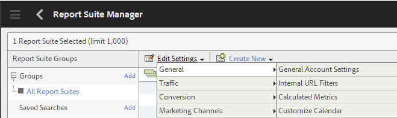

# Configuração de análises e relatórios{#configuring-analytics-and-reports}

O AEM Forms integra-se ao Adobe Analytics, que permite capturar e rastrear métricas de desempenho para seus formulários e documentos publicados. O objetivo da análise dessas métricas é tomar decisões informadas com base nos dados sobre as alterações necessárias para tornar os formulários ou o documento mais utilizáveis.

>[!NOTE]
>
>O recurso de análise no AEM Forms está disponível como parte do pacote complementar do AEM Forms. Para obter informações sobre como instalar o pacote complementar, consulte [Instalação e configuração do AEM Forms](../../forms/using/installing-configuring-aem-forms-osgi.md).
>
>Além do pacote complementar, você precisa de uma conta do Adobe Analytics e privilégios de administrador na instância do AEM. Para obter informações sobre a solução, consulte [Adobe Analytics](https://www.adobe.com/solutions/digital-analytics.html).

## Visão geral {#overview}

Você pode usar o Adobe Analytics para descobrir padrões de interação e problemas que os usuários enfrentam ao usar formulários adaptáveis, formulários HTML5 e comunicação interativa. O Adobe Analytics rastreia e armazena informações sobre os seguintes parâmetros:

* **Tempo** médio de preenchimento: Tempo médio gasto para preencher o formulário.
* **Representações**: Número de vezes que um formulário é aberto.
* **Rascunhos**: Número de vezes que um formulário é salvo no estado de rascunho.
* **Envios**: Número de vezes que um formulário é enviado.
* **Abortar**: Número de vezes que os usuários saem sem preencher o formulário.

Você pode personalizar o Adobe Analytics para adicionar/remover mais parâmetros. Juntamente com as informações acima, o relatório contém as seguintes informações sobre cada painel do HTML5 e formulário adaptável:

* **Hora**: Tempo gasto no painel e nos campos do painel.
* **Erro**: Número de erros encontrados no painel e nos campos do painel.
* **Ajuda**: Número de vezes que um usuário abre a ajuda de um painel e dos campos do painel.

## Criação de conjunto de relatórios {#creating-report-suite}

Os dados do Analytics são armazenados em repositórios específicos do cliente chamados de conjuntos de relatórios. Para criar um conjunto de relatórios e usar o Adobe Analytics, é necessário ter uma conta válida da Adobe Marketing Cloud. Antes de executar as etapas a seguir, verifique se você tem uma conta válida da Adobe Marketing Cloud.

Execute as seguintes etapas para criar um conjunto de relatórios.

1. Faça logon em [https://sc.omniture.com/login/](https://sc.omniture.com/login/)
1. Na Marketing Cloud, selecione **Admin** > Console **de** administração > Conjuntos **de** relatórios.
1. Selecione **Criar novo** > Conjunto **de** relatórios no Gerenciador de conjunto de relatórios.

   

   Criar novo conjunto de relatórios

1. Verifique se a primeira lista suspensa está definida como **Criar de um modelo** e selecione **Comércio**.
1. Localize o campo ID **do conjunto de** relatórios e adicione uma nova ID do conjunto de relatórios. Por exemplo, JJEsquire. Uma ID do conjunto de relatórios é exibida abaixo do campo ID do conjunto de relatórios. Inclui um prefixo automático, que geralmente é o nome da empresa.
1. Adicionar novo Título **** do Site. Por exemplo, JJEsquire Getting Started Suite. Esse título é usado na interface do usuário do Analytics. Use a ID do conjunto de relatórios em seu código.
1. Selecione um Fuso **horário** na lista suspensa. Todos os dados que entram neste conjunto de relatórios são registrados com base no fuso horário definido.
1. Deixe vazios os campos URL **** básico e Página **** padrão. Esses dois valores são usados apenas na interface da Adobe Marketing Cloud para vincular ao seu site.
1. Deixe a Data de **ativação** definida como hoje. A Data de ativação determina o dia em que o conjunto de relatórios é ativado.
1. No campo Visualizações de página **estimadas por dia** , digite 100. Use este campo para estimar o número de visualizações de página que você antecipa para seu site por dia. Essa estimativa permite que a Adobe instale a quantidade apropriada de hardware para processar os dados que você coletará.
1. Selecione uma Moeda **** Base na lista suspensa. Todos os dados monetários que entram neste conjunto de relatórios são convertidos e armazenados neste formato de moeda.
1. Clique em **Criar conjunto de relatórios** . Você deve ver a atualização da página com uma mensagem informando que o conjunto de relatórios foi criado com êxito.
1. Selecione o conjunto de relatórios recém-criado. Navegue até **Editar configurações** > **Geral** > Configurações **** gerais da conta.

   

   Configurações gerais da conta

1. Na tela Configurações gerais da conta, ative o Relatórios **geográfico e clique em****Salvar.**
1. Navegue até **Editar configurações** > **Tráfego** > Variáveis **** de tráfego.
1. No conjunto de relatórios, configure e ative as seguintes variáveis de tráfego.

   * **formName**: Identificador de um formulário adaptável.
   * **formInstance**: Identificador de uma instância de formulário adaptável. Ative os relatórios de Caminho para essa variável.
   * **fieldName**: Identificador de um campo de formulário adaptável. Ative os relatórios de Caminho para essa variável.
   * **panelName**: Identificador de um painel de formulário adaptável. Ative os relatórios de Caminho para essa variável.
   * **formTitle**: Título do formulário.
   * **fieldTitle**: Título do campo de formulário.
   * **panelTitle**: Título do painel de formulários.
   * **analyticsVersion**: Versão de análise de formulário.

1. Navegue até **Editar configurações** > **Conversão** > Eventos **de** sucesso. Defina e ative os seguintes eventos bem-sucedidos:

   | Evento bem-sucedido | Tipo |
   |---|---|
   | abandono | Contador |
   | renderizar | Contador |
   | panelVisit | Contador |
   | fieldVisit | Contador |
   | save | Contador |
   | erro | Contador |
   | ajuda | Contador |
   | submit | Contador |
   | timeSpent | Numérico |

   >[!NOTE]
   >
   >Um número de evento e um número de propriedade usados para configurar a análise do AEM Forms devem ser diferentes do número de evento e do número de propriedade usados na configuração de análise [do](/help/sites-administering/adobeanalytics.md) AEM.

1. Faça logout da conta da Adobe Marketing Cloud.

## Criando Configuração do Serviço Cloud {#creating-cloud-service-configuration}

A configuração do Serviço em nuvem é uma informação sobre sua conta do Adobe Analytics. A configuração permite que o Adobe Experience Manager (AEM) se conecte ao Adobe Analytics. Crie uma configuração separada para cada conta do Analytics usada.

1. Faça logon na instância do autor do AEM como administrador.
1. No canto superior esquerdo, clique em **Adobe Experience Manager** > **Ferramentas**  > **Implantação** > Serviços **em** nuvem.
1. Localize o ícone **do Adobe Analytics** . Clique em **Mostrar configurações** e prossiga para clicar em **[+]** para adicionar uma nova configuração.

   Se você for um usuário iniciante, clique em **Configurar agora**.

1. Adicione um Título à sua nova configuração (o preenchimento do campo Nome é opcional). Por exemplo, a configuração Minha análise. Clique em **Criar**.

1. Quando o painel Editar abrir na página de configuração, preencha os campos:

   * **Empresa**: Seu nome de empresa, como mostrado no Adobe Analytics.
   * **Nome de usuário**: O nome usado para fazer logon no Adobe Analytics.
   * **Senha**: A senha do Adobe Analytics para a conta acima.
   * **Data center**: O data center de sua conta do Adobe Analytics.

1. Clique em **Conectar-se ao Analytics**. Uma caixa de diálogo é exibida com a mensagem informando que a conexão foi bem-sucedida. Clique em **OK**.

## Criando a estrutura de serviço da nuvem {#creating-cloud-service-framework}

Uma estrutura do Adobe Analytics é um conjunto de mapeamentos entre as variáveis do Adobe Analytics e as variáveis do AEM. Use uma estrutura para configurar como seus formulários preenchem dados para os relatórios do Adobe Analytics. As estruturas estão associadas a uma configuração do Adobe Analytics. É possível criar várias estruturas para cada configuração.

1. No console de serviços em nuvem do AEM, clique em **Mostrar configurações**, em Adobe Analytics.
1. Clique no link **[+]** ao lado da configuração do Analytics.

   

   Configuração do Adobe Analytics

1. Digite um **Título** e um **Nome** para a estrutura, selecione **Adobe Analytics** Framework e clique em **Criar**. A estrutura é aberta para edição.
1. Na seção Report Suites do pod lateral, clique em **Adicionar item** e use o menu suspenso para selecionar a ID do Report Suite (por exemplo, JJEsquire) com a qual a estrutura interagirá.
1. Ao lado da ID do conjunto de relatórios, selecione as instâncias do servidor para as quais deseja enviar informações para o conjunto de relatórios.

   

1. Arraste um componente **de Análise de** formulário da **outra** categoria de SideKick até a estrutura.
1. Para mapear variáveis do Analytics com variáveis definidas no componente, arraste uma variável do AEM Content Finder para um campo no componente de rastreamento.

   

1. Ative a estrutura usando a guia **** de página no sidekick e clique em **Ativar estrutura**.

## Configuração do serviço de configuração do AEM Forms Analytics {#configuring-aem-forms-analytics-configuration-service}

1. Na instância do autor, abra o Gerenciador de configuração do console da Web do AEM em `https://<server>:<port>;/system/console/configMgr`.
1. Localizar e abrir a configuração do AEM Forms Analytics

   

   Serviço de configuração do AEM Forms Analytics

1. Especifique os valores apropriados para os campos a seguir e clique em **Salvar**.

   * **Estrutura** do SiteCatalyst: Selecione a estrutura/configuração definida na seção Configurar uma estrutura para rastreamento.
   * **Linha de base** de rastreamento de tempo do campo: Especifique a duração, em segundos, após a qual a visita de campo deve ser rastreada. O valor padrão é 0. Quando o valor for maior que 0 (zero), dois eventos de rastreamento separados serão enviados para o servidor do Adobe Analytics. O primeiro evento instrui o servidor do Analytics a parar de rastrear o campo encerrado. O segundo evento é enviado depois que a duração especificada decorre. O segundo evento instrui o servidor do Analytics a rastrear o start do campo visitado. O uso de dois eventos separados ajuda a medir com precisão o tempo gasto em um campo. Quando o valor for 0 (zero), um único evento de rastreamento será enviado para o servidor do Adobe Analytics.

   * **Cron** de sincronização de relatórios do Analytics: Especifique a expressão cron para obter relatórios do Adobe Analytics. O valor padrão é 0 0 2 ? * *.

   * **Tempo limite de busca do relatório:** Especifique a duração, em segundos, para aguardar que o servidor responda ao relatório de análise. O tempo padrão é de 120 segundos.
   >[!NOTE]
   >
   >Pode levar até 10 segundos a mais para a operação de busca de relatório de tempo limite e depois o número especificado de segundos.

1. Repita a etapa 1-3 na instância de publicação para configurar a análise.

Agora, você pode ativar a análise para formulários e gerar um relatório de análise.

## Habilitar análise para um formulário ou documento {#enabling-analytics-for-a-form-or-document}

1. Faça logon no portal do AEM em `https://[hostname]:'port'`.
1. Clique em **Formulários > Formulários e Documentos**, selecione um formulário ou documento e clique em **Ativar o Analytics**. A análise está ativada.

   

   Habilitar análise para um formulário

   **A.** Ative o botão **B do Analytics.** Formulário selecionado

   Para obter informações detalhadas sobre como visualizar relatórios de análise de formulários, consulte [Visualizar e entender relatórios de análise de formulários AEM](../../forms/using/view-understand-aem-forms-analytics-reports.md)

