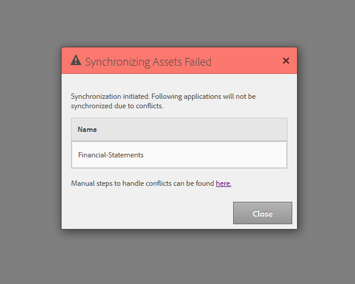

# Configuração do programador de sincronização {#configuring-the-synchronization-scheduler}

Por padrão, o programador de sincronização é executado após cada 3 minutos para sincronizar todos os ativos modificados e atualizados no repositório por meio do LiveCycle Workbench 11. Os aplicativos que contêm formulários e recursos ficam visíveis na interface do usuário do AEM Forms quando o processo de sincronização é concluído.

## Alterar intervalo do programador de sincronização {#change-interval-of-the-synchronization-scheduler}

Execute as seguintes etapas para alterar o intervalo do programador de sincronização:

1. Faça logon no AEM Configuration Manager. O URL do Configuration Manager é `https://[Server]:[Port]/lc/system/console/configMgr`

1. Localize e abra o pacote **FormsManagerConfiguration** .

1. Especifique um novo valor para a opção Frequência **do Agendador de** Sincronização.

   A unidade da frequência é minutos. Por exemplo, para configurar o agendador para ser executado após cada 60 minutos, especifique 60.

## Sincronizar ativos {#synchronizing-assets}

Você pode usar a opção **Sincronizar ativos do repositório** para sincronizar manualmente os ativos. Execute as seguintes etapas para sincronizar manualmente os ativos:

1. Faça logon no AEM Forms. O URL padrão é `https://[Server]:[Port]/lc/aem/forms/`.

   

   **** Figura: Interface do usuário do *AEM Forms*

1. Clique no ícone  na barra de ferramentas. Se você não tiver nenhum ativo no caminho configurado pela última vez, a caixa de diálogo será exibida abaixo. Clique em **Iniciar** para iniciar a sincronização.

   

   **** Figura: Caixa de diálogo *Sincronização*

## Erro de sincronização de solução de problemas {#troubleshooting-synchronization-error}

Você pode criar novos aplicativos no designer de fluxo de trabalho (LiveCycle Workbench).

Se o aplicativo recém-criado e uma pasta em /content/dam/formsanddocuments tiver um nome idêntico, um erro &quot;*Um ativo com o mesmo nome que este aplicativo já existe no nível raiz.*&quot; está registrado.

Para resolver o conflito, renomeie o aplicativo e sincronize manualmente os ativos.

**** Figura: Caixa de diálogo *Conflitos na sincronização de ativos*
