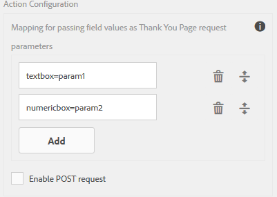

# Configuração da ação Enviar{#configuring-the-submit-action}

## Introdução para enviar ações {#introduction-to-submit-actions}

Uma ação de envio é acionada quando um usuário clica no botão Enviar em um formulário adaptável. É possível configurar a ação de envio no formulário adaptável. Os formulários adaptativos fornecem algumas ações de envio prontas para uso. Você pode copiar e estender as ações de envio padrão para criar sua própria ação de envio. No entanto, com base em seus requisitos, você pode gravar e registrar sua própria ação de envio para processar dados no formulário enviado. A ação de envio pode usar submissão síncrona ou assíncrona.

É possível configurar uma ação de envio na seção **Envio** das propriedades do Container de formulário adaptável, na barra lateral.

Configurar ação de envio

As ações de envio padrão disponíveis com formulários adaptáveis são:

* Enviar para o ponto de extremidade REST
* Enviar e-mail
* Enviar PDF por email
* Chamar um fluxo de trabalho de formulários
* Enviar usando modelo de dados do formulário
* Ação de envio do Portal de formulários
* Chamar um fluxo de trabalho do AEM

>[!NOTE]
>
>A ação Enviar PDF por email de envio é aplicável somente aos formulários adaptáveis que usam o modelo XFA como modelo de formulário.

>[!NOTE]
>
>Verifique se o [AEM_Installation_Diretory]\crx-quickstart\temp\datamanager\ASM folder
>existe. O diretório é necessário para armazenar temporariamente anexos. Se o diretório não existir, crie-o.

>[!CAUTION]
>
>Se você [pré-preencher](../../forms/using/prepopulate-adaptive-form-fields.md) um modelo de formulário, modelo de dados de formulário ou formulário adaptável com base em schemas com queixa de dados XML ou JSON para um schema (schema XML, schema JSON, modelo de formulário ou modelo de dados de formulário) que sejam dados não contém tags &lt;afData>, &lt;afBoundData> e &lt;/afUnboundData>, então os dados dos campos não vinculados (campos não vinculados) são campos de formulário adaptáveis sem a propriedade [bindref](../../forms/using/prepopulate-adaptive-form-fields.md) ) do formulário adaptável.

Você pode gravar uma ação de envio personalizada para formulários adaptáveis para atender ao seu caso de uso. Para obter mais informações, consulte Ação de [gravação de envio personalizado para formulários](../../forms/using/custom-submit-action-form.md)adaptáveis.

## Enviar para o ponto de extremidade REST {#submit-to-rest-endpoint}

A opção **Enviar ao ponto de extremidade** REST envia os dados preenchidos no formulário para uma página de confirmação configurada como parte da solicitação HTTP GET. É possível adicionar o nome dos campos a serem solicitados. O formato da solicitação é:

`{fieldName}={request parameter name}`

Conforme mostrado na imagem abaixo, `param1` e `param2` são passados como parâmetros com valores copiados dos campos **caixa de texto** e **caixa numérica** para a próxima ação.

Você também pode **ativar a solicitação** POST e fornecer um URL para postar a solicitação. Para enviar dados ao servidor AEM que hospeda o formulário, use um caminho relativo correspondente ao caminho raiz do servidor AEM. Por exemplo, /content/forms/af/SampleForm.html. Para enviar dados a qualquer outro servidor, use o caminho absoluto.

Configurando a Ação de Submeter do Rest Endpoint

>[!NOTE]
Para passar os campos como parâmetros em um URL REST, todos os campos devem ter nomes de elementos diferentes, mesmo se os campos forem colocados em painéis diferentes.

### Postar dados enviados em um recurso ou ponto final de repouso externo  {#post-submitted-data-to-a-resource-or-external-rest-end-point-nbsp}

Use a ação **Enviar para ponto de extremidade** REST para postar os dados enviados para um URL restante. O URL pode ser de um servidor interno (o servidor no qual o formulário é renderizado) ou externo.

Para postar dados em um servidor interno, forneça o caminho do recurso. Os dados são postados no caminho do recurso. Por exemplo, /content/restEndPoint. Para essas solicitações de publicação, as informações de autenticação da solicitação de envio são usadas.

Para postar dados em um servidor externo, forneça um URL. O formato do URL é https://host:port/path_to_rest_end_point. Certifique-se de configurar o caminho para lidar com a solicitação POST anonimamente.

No exemplo acima, as informações digitadas pelo usuário `textbox` são capturadas usando o parâmetro `param1`. A sintaxe para publicar dados capturados usando `param1` é:

`String data=request.getParameter("param1");`

Da mesma forma, os parlamentares usados para postar dados XML e anexos são `dataXml` e `attachments`.

Por exemplo, você usa esses dois parâmetros no script para analisar os dados em um ponto de extremidade de repouso. Use a seguinte sintaxe para armazenar e analisar os dados:

`String data=request.getParameter("dataXml");`
`String att=request.getParameter("attachments");`

Neste exemplo, `data` armazena os dados XML e `att` armazena os dados anexos.

## Enviar e-mail {#send-email}

A ação **Enviar envio por email** envia um email para um ou mais recipient após o envio bem-sucedido do formulário. O email gerado pode conter dados de formulário em um formato predefinido.

>[!NOTE]
Todos os campos de formulário devem ter nomes de elementos diferentes, mesmo se forem colocados em painéis diferentes), para incluir dados de formulário em um email.

## Send PDF via Email {#send-pdf-via-email}

A ação **Enviar PDF por email** envia um email com um PDF contendo dados de formulário para um ou mais recipient no envio bem-sucedido do formulário.

>[!NOTE]
Esta ação de envio está disponível para formulários adaptáveis baseados em XFA e formulários de adaptação baseados em XSD que têm o Documento do modelo de Registro.

## Invoke a forms workflow {#invoke-a-forms-workflow}

A opção **Enviar para envio do fluxo de trabalho** do Forms envia um xml de dados e anexos de arquivo (se houver) para um processo Adobe LiveCycle ou AEM Forms no JEE.

Para obter informações sobre como configurar a ação Enviar para envio de fluxo de trabalho de formulários, consulte [Enviar e processar seus dados de formulário usando workflows](../../forms/using/submit-form-data-livecycle-process.md)de formulário.

## Enviar usando modelo de dados do formulário {#submit-using-form-data-model}

A ação **Enviar usando o Modelo** de Dados de Formulário grava dados de formulário adaptáveis enviados para o objeto de modelo de dados especificado em um modelo de dados de formulário para sua fonte de dados. Ao configurar a ação de envio, você pode escolher um objeto de modelo de dados cujos dados enviados você deseja gravar de volta em sua fonte de dados.

Além disso, é possível enviar um anexo de formulário usando um modelo de dados de formulário e um Documento de Registro (DoR) para a fonte de dados.

Para obter informações sobre o modelo de dados de formulário, consulte Integração [de dados do](../../forms/using/data-integration.md)AEM Forms.

## Ação de envio do Portal de formulários {#forms-portal-submit-action}

A opção **Forms Portal Submit Action** (Enviar ação do portal de formulários) disponibiliza os dados do formulário por meio de um portal AEM Forms.

Para obter mais informações sobre o Portal de formulários e a ação de envio, consulte [Rascunhos e componentes](../../forms/using/draft-submission-component.md)de envio.

## Invoke an AEM Workflow {#invoke-an-aem-workflow}

A ação **Chamar um envio de fluxo de trabalho** do AEM associa um formulário adaptável a um fluxo de trabalho do AEM. Quando um formulário é submetido, o fluxo de trabalho associado é start automaticamente no nó de processamento. Além disso, coloca o arquivo de dados, os anexos e o documento de Registro, se aplicável, no local da carga do fluxo de trabalho.

Antes de usar a ação **Chamar um fluxo de trabalho** do AEM, [defina as configurações](../../forms/using/configuring-the-processing-server-url-.md)do AEM DS. Para obter informações sobre como criar um fluxo de trabalho do AEM, consulte workflows centrados em [formulários no OSGi](../../forms/using/aem-forms-workflow.md).

## Revalidação do lado do servidor em forma adaptativa {#server-side-revalidation-in-adaptive-form}

Normalmente, em qualquer sistema de captura de dados online, os desenvolvedores colocam algumas validações JavaScript no lado do cliente para impor algumas regras de negócios. Mas nos navegadores modernos, os usuários finais têm como contornar essas validações e fazer envios manualmente usando várias técnicas, como o Console de Ferramentas de Desenvolvimento do Navegador da Web. Essas técnicas também são válidas para formas adaptativas. Um desenvolvedor de formulários pode criar várias lógicas de validação, mas, tecnicamente, os usuários finais podem ignorar essas lógicas de validação e enviar dados inválidos para o servidor. Dados inválidos quebrariam as regras comerciais que um autor de formulários aplicou.

O recurso de revalidação do lado do servidor também permite executar as validações fornecidas por um autor de formulários adaptáveis ao projetar um formulário adaptável no servidor. Evita qualquer possível comprometimento de envios de dados e violações de regras comerciais representadas em termos de validações de formulários.

### O que validar no Servidor? {#what-to-validate-on-server-br}

Todas as validações de campo prontas (OTB) de um formulário adaptável que são executadas novamente no servidor são:

* Obrigatório
* Cláusula de Validação de Imagem
* Expressão de validação

### Ativando a validação no servidor {#enabling-server-side-validation-br}

Use a opção **Revalidar no servidor** em Container de formulário adaptável na barra lateral para ativar ou desativar a validação no servidor para o formulário atual.

Ativação da validação no servidor

Se o usuário final ignorar essas validações e enviar os formulários, o servidor executará novamente a validação. Se a validação falhar na extremidade do servidor, a transação de envio será interrompida. O usuário final é apresentado novamente ao formulário original. Os dados capturados e enviados são apresentados ao usuário como um erro.

### Suporte a funções personalizadas em Expressões de validação {#supporting-custom-functions-in-validation-expressions-br}

Às vezes, no caso de regras **de validação** complexas, o script de validação exato reside em funções personalizadas e o autor chama essas funções personalizadas da expressão de validação de campo. Para tornar essa biblioteca de funções personalizada conhecida e disponível ao executar validações no servidor, o autor do formulário pode configurar o nome da biblioteca do cliente AEM na guia **Básico** das propriedades do Container de formulário adaptável, como mostrado abaixo.

Suporte a funções personalizadas em Expressões de validação

O autor pode configurar a biblioteca customJavaScript por formulário adaptável. Na biblioteca, mantenha somente as funções reutilizáveis, que têm dependência de bibliotecas de terceiros jquery e underscore.js.

## Manipulação de erros na ação de envio {#error-handling-on-submit-action}

Como parte das diretrizes de segurança e proteção do AEM, configure páginas de erro personalizadas, como 404.jsp e 500.jsp. Esses manipuladores são chamados ao enviar um formulário de erro 404 ou 500. Os manipuladores também são chamados quando esses códigos de erro são acionados no nó Publicar.

Para obter mais informações, consulte [Personalização de páginas mostrada pelo manipulador](/help/sites-developing/customizing-errorhandler-pages.md)de erros.
