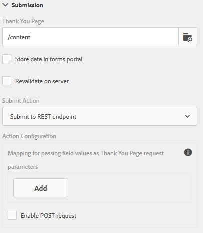

# Configuração da ação Enviar{#configuring-the-submit-action}

## Introdução ao envio de ações {#introduction-to-submit-actions}

Uma ação Enviar é acionada quando um usuário clica no botão Enviar em um formulário adaptável. É possível configurar a ação de envio no formulário adaptável. Os formulários adaptáveis fornecem algumas ações de envio prontas para uso. Você pode copiar e estender as ações de envio padrão para criar sua própria ação de envio. No entanto, com base em suas necessidades, você pode gravar e registrar sua própria ação de envio para processar dados no formulário enviado. A ação de envio pode usar [envio síncrono ou assíncrono](../../forms/using/asynchronous-submissions-adaptive-forms.md).

Você pode configurar uma ação de envio no **Submissão** seção das propriedades do Contêiner de formulário adaptável, na barra lateral.

Configurar ação de envio

As ações de envio padrão disponíveis com formulários adaptáveis são:

* Enviar para ponto de extremidade REST
* Enviar e-mail
* Enviar PDF via Email
* Chamar um Forms Workflow
* Enviar usando modelo de dados do formulário
* Ação de envio do portal do Forms
* Chamar um fluxo de trabalho AEM

>[!NOTE]
>
>A ação Enviar PDF por envio de email é aplicável somente a formulários adaptáveis que usam o modelo XFA como modelo de formulário.

>[!NOTE]
>
>Certifique-se de que [AEM_Installation_Diretory]\crx-quickstart\temp\datamanager\ASM folder
>existe. O diretório é necessário para armazenar anexos temporariamente. Se o diretório não existir, crie-o.

>[!CAUTION]
>
>Se você [preenchimento prévio](../../forms/using/prepopulate-adaptive-form-fields.md) um modelo de formulário, modelo de dados de formulário ou formulário adaptável baseado em esquema com reclamação de dados XML ou JSON para um esquema (esquema XML, esquema JSON, modelo de formulário ou modelo de dados de formulário) que não contenha dados &lt;afdata>, &lt;afbounddata>e &lt;/afunbounddata> tags , em seguida, os dados de campos não limitados (campos não limitados são campos de formulário adaptáveis sem [bindref](../../forms/using/prepopulate-adaptive-form-fields.md) propriedade) do formulário adaptável é perdido.

Você pode escrever uma ação de envio personalizada para formulários adaptáveis para atender ao seu caso de uso. Para obter mais informações, consulte [Gravação da ação de Enviar personalizado para formulários adaptáveis](../../forms/using/custom-submit-action-form.md).

## Enviar para ponto de extremidade REST {#submit-to-rest-endpoint}

O **Enviar para ponto de extremidade REST** a opção enviar passa os dados preenchidos no formulário para uma página de confirmação configurada como parte da solicitação HTTP GET. É possível adicionar o nome dos campos a serem solicitados. O formato da solicitação é:

`{fieldName}={request parameter name}`

Conforme mostrado na imagem abaixo, `param1` e `param2` são transmitidos como parâmetros com valores copiados do **caixa de texto** e **caixa numérica** campos para a próxima ação.

Você também pode **Habilitar solicitação de POST** e forneça um URL para postar a solicitação. Para enviar dados para o servidor do Experience Manager que hospeda o formulário, use um caminho relativo correspondente ao caminho raiz do servidor do Experience Manager. Por exemplo, /content/forms/af/SampleForm.html. Para enviar dados para qualquer outro servidor, use o caminho absoluto.

Configurar a ação de envio do ponto de extremidade restante

>[!NOTE]
Para transmitir os campos como parâmetros em um URL REST, todos os campos devem ter nomes de elemento diferentes, mesmo se os campos forem colocados em painéis diferentes.

### Postar dados enviados para um recurso ou ponto final de repouso externo  {#post-submitted-data-to-a-resource-or-external-rest-end-point-nbsp}

Use o **Enviar para Ponto de Extremidade REST** para postar os dados enviados em um URL restante. O URL pode ser de um servidor interno (o servidor no qual o formulário é renderizado) ou externo.

Para postar dados em um servidor interno, forneça o caminho do recurso. Os dados são postados no caminho do recurso. Por exemplo, /content/restEndPoint. Para essas solicitações de publicação, as informações de autenticação da solicitação de envio são usadas.

Para postar dados em um servidor externo, forneça um URL. O formato do URL é https://host:port/path_to_rest_end_point. Certifique-se de configurar o caminho para lidar com a solicitação POST anonimamente.

No exemplo acima, o usuário inseriu informações em `textbox` é capturado usando o parâmetro `param1`. Sintaxe para postar dados capturados usando `param1` é:

`String data=request.getParameter("param1");`

Da mesma forma, os parâmetros usados para publicar dados e anexos XML são `dataXml` e `attachments`.

Por exemplo, esses dois parâmetros são usados no script para analisar os dados em um ponto de extremidade de repouso. Use a seguinte sintaxe para armazenar e analisar os dados:

`String data=request.getParameter("dataXml");`
`String att=request.getParameter("attachments");`

Neste exemplo, `data` armazena os dados XML, e `att` armazena dados de anexo.

## Enviar e-mail {#send-email}

O **Enviar Email** enviar ação envia um email para um ou mais recipients após o envio bem-sucedido do formulário. O email gerado pode conter dados de formulário em um formato predefinido.

>[!NOTE]
Todos os campos de formulário devem ter nomes de elemento diferentes, mesmo que sejam colocados em painéis diferentes), para incluir dados de formulário em um email.

## Enviar PDF via Email {#send-pdf-via-email}

O **Enviar PDF via Email** a ação enviar envia um email com um PDF contendo dados de formulário para um ou mais recipients no envio bem-sucedido do formulário.

>[!NOTE]
Essa ação de envio está disponível para formulários adaptáveis baseados em XFA e formulários de adaptação baseados em XSD que têm o modelo Documento de registro.

## Chamar um Forms Workflow {#invoke-a-forms-workflow}

O **Enviar para o Forms Workflow** a opção enviar envia um xml de dados e anexos de arquivo (se houver) para um LiveCycle Adobe ou AEM Forms existente no processo JEE.

Para obter informações sobre como configurar a ação Enviar para Forms Workflow, consulte [Envio e processamento de dados de formulário usando fluxos de trabalho de formulários](../../forms/using/submit-form-data-livecycle-process.md).

## Enviar usando modelo de dados do formulário {#submit-using-form-data-model}

O **Enviar usando o Modelo de dados de formulário** enviar gravações de ações enviadas para dados de formulário adaptável do objeto de modelo de dados especificado em um modelo de dados de formulário para sua fonte de dados. Ao configurar a ação de envio, você pode escolher um objeto de modelo de dados cujos dados enviados deseja gravar de volta em sua fonte de dados.

Além disso, é possível enviar um anexo de formulário usando um modelo de dados de formulário e um Documento de registro (DoR) para a fonte de dados.

Para obter informações sobre o modelo de dados de formulário, consulte [Integração de dados do AEM Forms](../../forms/using/data-integration.md).

## Ação de envio do portal do Forms {#forms-portal-submit-action}

O **Ação de envio do portal do Forms** torna os dados do formulário disponíveis por meio de um Portal do AEM Forms.

Para obter mais informações sobre o Portal do Forms e enviar a ação, consulte [Componentes de rascunhos e envios](../../forms/using/draft-submission-component.md).

## Chamar um fluxo de trabalho AEM {#invoke-an-aem-workflow}

O **[!UICONTROL Chamar um fluxo de trabalho AEM]** Enviar ação associa um Formulário adaptável a um [Fluxo de trabalho AEM](/help/sites-developing/workflows-models.md). Quando um formulário é enviado, o fluxo de trabalho associado é iniciado automaticamente na instância do autor. Você pode salvar o arquivo de dados, os anexos e o Documento de registro na pasta relativa ou sob a carga do fluxo de trabalho ou em uma variável. Se o workflow estiver marcado para armazenamento de dados externo, a opção de variável estará disponível e não a opção de carga. Você pode selecionar na lista de variáveis disponíveis para o modelo de fluxo de trabalho. Se o workflow estiver marcado para armazenamento de dados externo em um estágio posterior e não no momento da criação do workflow, verifique se as configurações de variável necessárias estão em vigor.

Antes de usar o **Chamar um fluxo de trabalho AEM** apresentar ação, [definir as configurações do Experience Manager DS](../../forms/using/configuring-the-processing-server-url-.md). Para obter informações sobre como criar um Fluxo de Trabalho AEM, consulte [Fluxos de trabalho centrados em formulários no OSGi](../../forms/using/aem-forms-workflow.md).

A Ação de envio coloca o seguinte no local da carga do fluxo de trabalho. No entanto, observe que somente a opção Variable é exibida se o modelo de workflow estiver marcado para armazenamento de dados externo, e não a opção payload.

* **Arquivo de dados**: Ele contém os dados enviados para o formulário adaptável. Você pode usar o **[!UICONTROL Caminho do arquivo de dados]** para especificar o nome do arquivo e o caminho do arquivo em relação à carga útil. Por exemplo, a variável `/addresschange/data.xml` caminho cria uma pasta chamada `addresschange` e o coloca em relação à carga útil. Também é possível especificar somente `data.xml` para enviar apenas dados enviados sem criar uma hierarquia de pastas. Use a opção de variável e selecione a variável na lista de variáveis disponíveis para o modelo de workflow.

>[!NOTE]
As variáveis podem ser usadas independentemente de o modelo de fluxo de trabalho estar marcado para armazenamento externo de dados ou não.

* **Anexos**: Você pode usar o **[!UICONTROL Caminho do anexo]** para especificar o nome da pasta para armazenar os anexos carregados no Formulário adaptável. A pasta é criada em relação à carga. Se o workflow estiver marcado para armazenamento externo de dados, use a opção de variável e selecione a variável na lista de variáveis disponíveis para o modelo de workflow.

* **Documento de registro**: Ele contém o Documento de registro gerado para o formulário adaptável. Você pode usar o **[!UICONTROL Documento de caminho de registro]** para especificar o nome do arquivo Documento de registro e o caminho do arquivo em relação à carga útil. Por exemplo, a variável `/addresschange/DoR.pdf` caminho cria uma pasta chamada `addresschange` relativo à carga e posiciona a variável `DoR.pdf` relativo à carga. Também é possível especificar somente `DoR.pdf` para salvar somente o Documento de registro sem criar uma hierarquia de pasta. Se o workflow estiver marcado para armazenamento externo de dados, use a opção de variável e selecione a variável na lista de variáveis disponíveis para o modelo de workflow.

## Revalidação do lado do servidor em forma adaptável {#server-side-revalidation-in-adaptive-form}

Normalmente, em qualquer sistema de captura de dados online, os desenvolvedores colocam algumas validações de JavaScript no lado do cliente para impor algumas regras de negócios. Mas nos navegadores modernos, os usuários finais têm como ignorar essas validações e fazer envios manualmente usando várias técnicas, como o Console DevTools do navegador Web. Essas técnicas também são válidas para formulários adaptáveis. Um desenvolvedor de formulários pode criar várias lógicas de validação, mas tecnicamente os usuários finais podem ignorar essas lógicas de validação e enviar dados inválidos para o servidor. Dados inválidos quebrariam as regras de negócios que um autor de formulários executou.

O recurso de revalidação do lado do servidor também permite executar as validações fornecidas por um autor de formulários adaptáveis ao projetar um formulário adaptável no servidor. Impede qualquer possível comprometimento de envios de dados e violações de regras comerciais representadas em termos de validações de formulários.

### O que validar no Servidor? {#what-to-validate-on-server-br}

Todas as validações de campo prontas para uso (OOTB) de um formulário adaptável que são executadas novamente no servidor são:

* Obrigatório
* Cláusula de Imagem de Validação
* Expressão de validação

### Habilitar validação do lado do servidor {#enabling-server-side-validation-br}

Use o **Revalidar no servidor** em Contêiner de formulário adaptável na barra lateral para ativar ou desativar a validação do lado do servidor para o formulário atual.

Ativação da validação no lado do servidor

Se o usuário final ignorar essas validações e enviar os formulários, o servidor executará novamente a validação. Se a validação falhar no final do servidor, a transação de envio será interrompida. O usuário final é apresentado ao formulário original novamente. Os dados capturados e enviados são apresentados ao usuário como um erro.

>[!NOTE]
A validação do lado do servidor valida o modelo de formulário. É recomendável criar uma biblioteca cliente separada para validações e não misturá-la com outras coisas, como estilo de HTML e manipulação de DOM na mesma biblioteca do cliente.

### Suporte a funções personalizadas nas expressões de validação {#supporting-custom-functions-in-validation-expressions-br}

Às vezes, se houver regras de validação complexas, o script de validação exato residirá em funções personalizadas e o autor chamará essas funções personalizadas da expressão de validação de campo. Para tornar essa biblioteca de funções personalizada conhecida e disponível ao executar validações do lado do servidor, o autor do formulário pode configurar o nome AEM biblioteca do cliente no **Básico** das propriedades do Contêiner de formulário adaptável, conforme mostrado abaixo.

Suporte a funções personalizadas nas expressões de validação

O autor pode configurar a biblioteca JavaScript personalizada por formulário adaptável. Na biblioteca, mantenha somente as funções reutilizáveis, que têm dependência em bibliotecas de terceiros jquery e underscore.js.

## Tratamento de erros na ação de envio {#error-handling-on-submit-action}

Como parte das diretrizes de segurança e proteção do Experience Manager, configure páginas de erro personalizadas, como 404.jsp e 500.jsp. Esses manipuladores são chamados quando um erro de formulário 404 ou 500 é enviado. Os manipuladores também são chamados quando esses códigos de erro são acionados no nó Publicar .

Para obter mais informações, consulte [Personalização de páginas mostradas pelo Manipulador de erros](/help/sites-developing/customizing-errorhandler-pages.md).
