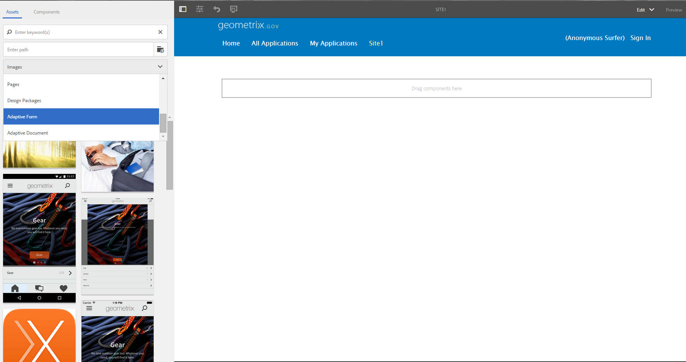

# Crie um formulário adaptável usando um conjunto de formulários adaptáveis{#create-an-adaptive-form-using-a-set-of-adaptive-forms}

## Visão geral {#overview}

Em um fluxo de trabalho, como um aplicativo para abrir uma conta bancária, seus usuários preenchem vários formulários. Em vez de solicitar que eles preencham um conjunto de formulários, é possível empilhar os formulários juntos e criar um formulário grande (formulário pai). Quando você adiciona um formulário adaptável ao formulário maior, ele é adicionado como um painel (formulário filho). Adicione um conjunto de formulários filhos para criar um formulário pai. Você pode mostrar ou ocultar painéis com base na entrada do usuário. Botões do formulário pai, como Enviar e redefinir, substituem os botões do formulário filho. Para adicionar um formulário adaptável no formulário pai, arraste e solte o formulário adaptável do navegador de ativos (como fragmentos de formulário adaptável).

Os recursos disponíveis são:

* Criação independente
* Mostrar/ocultar formulários apropriados
* Carregamento lento

Recursos como criação independente e carregamento lento oferecem melhorias de desempenho em relação ao uso de componentes individuais para criar o formulário pai.

>[!NOTE]
>
>Não é possível usar formulários/fragmentos adaptáveis baseados em XFA como formulários filhos ou pais.

## Nos bastidores {#behind-the-scenes}

É possível adicionar formulários e fragmentos adaptáveis baseados em XSD no formulário pai. A estrutura do formulário pai é igual a [qualquer formulário adaptável](../../forms/using/prepopulate-adaptive-form-fields.md). Ao adicionar um formulário adaptável como um formulário filho, ele é adicionado como um painel no formulário pai. Os dados de um formulário filho vinculado são armazenados na raiz `data`da seção `afBoundData` do schema XML do formulário pai.

Por exemplo, seus clientes preenchem um formulário de aplicativo. Os dois primeiros campos do formulário são nome e identidade. Seu XML é:

```xml
<afData>
    <afUnboundData>
        <data />
    </afUnboundData>
    <afBoundData>
        <data xmlns:xfa="https://www.xfa.org/schema/xfa-data/1.0/">
            <applicantName>Sarah Rose</applicantName>
            <applicantId>1234</applicantId>
        </data>
    </afBoundData>
</afData>
```

Você adiciona outro formulário no aplicativo que permite que seus clientes preencham seus endereços de escritório. A raiz do schema do formulário filho é `officeAddress`. Aplique `bindref` `/application/officeAddress` ou `/officeAddress`. Se `bindref`não for fornecido, o formulário filho será adicionado como a subárvore `officeAddress`. Consulte o XML do formulário abaixo:

```xml
<afData>
    <afUnboundData>
        <data />
    </afUnboundData>
    <afBoundData>
        <data xmlns:xfa="https://www.xfa.org/schema/xfa-data/1.0/">
            <applicantName>Sarah Rose</applicantName>
            <applicantId>1234</applicantId>
            <officeAddress>
                <addressLine>1, Geometrixx City</addressLine>
                <zip>11111</zip>
            </officeAddress>
        </data>
    </afBoundData>
</afData>
```

Se você inserir outro formulário que permite que seus clientes forneçam o endereço residencial, aplique `bindref` `/application/houseAddress or /houseAddress.`O XML será semelhante a:

```xml
<afData>
    <afUnboundData>
        <data />
    </afUnboundData>
    <afBoundData>
        <data xmlns:xfa="https://www.xfa.org/schema/xfa-data/1.0/">
            <applicantName>Sarah Rose</applicantName>
            <applicantId>1234</applicantId>
            <officeAddress>
                <addressLine>1, Geometrixx City</addressLine>
                <zip>11111</zip>
            </officeAddress>
            <houseAddress>
                <addressLine>2, Geometrixx City</addressLine>
                <zip>11111</zip>
            </houseAddress>
        </data>
    </afBoundData>
</afData>
```

Se você quiser manter o mesmo nome da subraiz que a raiz do schema ( `Address`neste exemplo), use os vínculos indexados.

Por exemplo, aplique bindrefs `/application/address[1]` ou `/address[1]` e `/application/address[2]` ou `/address[2]`. O XML do formulário é:

```xml
<afData>
    <afUnboundData>
        <data />
    </afUnboundData>
    <afBoundData>
        <data xmlns:xfa="https://www.xfa.org/schema/xfa-data/1.0/">
            <applicantName>Sarah Rose</applicantName>
            <applicantId>1234</applicantId>
            <address>
                <addressLine>1, Geometrixx City</addressLine>
                <zip>11111</zip>
            </address>
            <address>
                <addressLine>2, Geometrixx City</addressLine>
                <zip>11111</zip>
            </address>
        </data>
    </afBoundData>
</afData>
```

É possível alterar a subárvore padrão do formulário/fragmento adaptável usando a propriedade `bindRef`. A propriedade `bindRef` permite especificar o caminho que aponta para um local na estrutura em árvore do schema XML.

Se o formulário filho estiver desvinculado, seus dados serão armazenados na raiz `data`da seção `afUnboundData` do schema XML do formulário pai.

É possível adicionar um formulário adaptável como um formulário filho várias vezes. Certifique-se de que `bindRef` seja modificado corretamente para que cada instância usada do formulário adaptável aponte para uma subraiz diferente na raiz de dados.

>[!NOTE]
>
>Se formulários/fragmentos diferentes forem mapeados para a mesma subraiz, os dados serão substituídos.

## Adicionar um formulário adaptável como um formulário filho usando o navegador de ativos {#adding-an-adaptive-form-as-a-child-form-using-asset-browser}

Execute as seguintes etapas para adicionar um formulário adaptável como um formulário filho usando o navegador de ativos.

1. Abra o formulário pai no modo de edição.
1. Na barra lateral, clique em **Assets** . Em Ativos, selecione **Formulário adaptável** no menu suspenso.
   [ ](assets/asset-1.png)

1. Arraste e solte o formulário adaptável que deseja adicionar como um formulário filho.
   [ ](assets/drag-drop-1.png)siteO formulário adaptativo que soltar é adicionado como um formulário filho.

