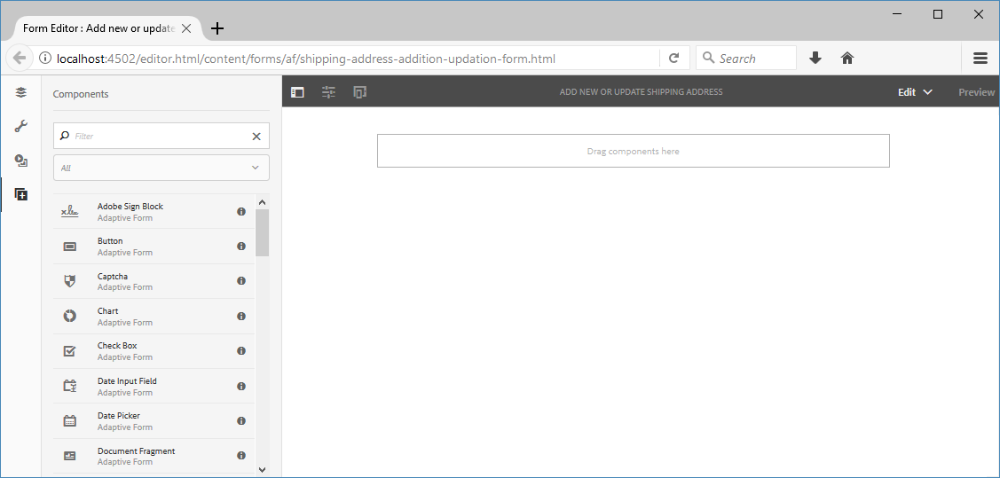

# Tutorial: Criar um formulário adaptável {#do-not-publish-tutorial-create-an-adaptive-form}

Este tutorial é uma etapa da série [Criar seu primeiro formulário](/help/forms/using/create-your-first-adaptive-form.md) adaptável. É recomendável seguir a série em sequência cronológica para entender, executar e demonstrar o caso de uso do tutorial completo.

## Sobre o tutorial {#about-the-tutorial}

Formulários adaptáveis são formulários de nova geração que são dinâmicos e responsivos. Você pode usar os formulários adaptativos para fornecer experiências personalizadas. Também é possível integrar formulários adaptáveis às estatísticas de uso [!DNL Adobe Analytics] e [!DNL Adobe Campaign] à gestão de campanha. Para obter mais informações sobre recursos de formulários adaptáveis, consulte [Introdução à criação de formulários](/help/forms/using/introduction-forms-authoring.md)adaptáveis.

É mais fácil criar e gerenciar formulários quando um processo adequado é seguido. Neste artigo, você aprenderá a:

* [Crie um formulário adaptável que permita ao cliente adicionar um endereço de entrega](/help/forms/using/create-adaptive-form.md#step-create-the-adaptive-form)

* [Campos de layout de um formulário adaptável para exibir e aceitar informações de um cliente](/help/forms/using/create-adaptive-form.md#step-add-header-and-footer)

* [Criar ação de envio para enviar um email contendo conteúdo de formulário](/help/forms/using/create-adaptive-form.md#step-add-components-to-capture-and-display-information)
* [Pré-visualização e envio de um formulário adaptável](/help/forms/using/create-adaptive-form.md)

Você terá um formulário semelhante ao seguinte no final do artigo:\

## Etapa 1: Criar o formulário adaptativo {#step-create-the-adaptive-form}

1. Faça logon na instância do autor AEM e navegue até **[!UICONTROL Adobe Experience Manager]** > **[!UICONTROL Forms]** > **[!UICONTROL Forms e Documentos]**. O URL padrão é [http://localhost:4502/aem/forms.html/content/dam/formsanddocuments](http://localhost:4502/aem/forms.html/content/dam/formsanddocuments).
1. Toque em **[!UICONTROL Criar]** e selecione Formulário **** adaptável. Uma opção para selecionar um modelo é exibida. Toque no modelo **[!UICONTROL em branco]** para selecioná-lo e toque em **[!UICONTROL Avançar]**.

1. Uma opção para **[!UICONTROL Adicionar propriedades]** é exibida. Os campos **[!UICONTROL Título]** e **[!UICONTROL Nome]** são obrigatórios:

   * **Título:** Especifique `Add new or update shipping address` no campo **[!UICONTROL Título]** . O campo de título especifica o nome de exibição do formulário. O título ajuda a identificar o formulário na interface do [!DNL Forms] usuário AEM.
   * **Nome:** Especifique `shipping-address-add-update-form` no campo **[!UICONTROL Nome]** . O campo Nome especifica o nome do formulário. Um nó com o nome especificado é criado no repositório. À medida que você digita um título, o valor do campo de nome é gerado automaticamente. Você pode alterar o valor sugerido. O campo de nome pode incluir somente caracteres alfanuméricos, hífens e sublinhados. Todas as entradas inválidas são substituídas por um hífen.

1. Toque em **[!UICONTROL Criar]**. Um formulário adaptável é criado e uma caixa de diálogo para abrir o formulário para edição é exibida. Toque em **[!UICONTROL Abrir]** para abrir o formulário recém-criado em uma nova guia. O formulário é aberto para edição. Ela também exibe a barra lateral para personalizar o formulário recém-criado de acordo com as necessidades.

   Para obter informações sobre a interface adaptativa de criação de formulários e os componentes disponíveis, consulte [Introdução à criação de formulários](/help/forms/using/creating-adaptive-form.md)adaptáveis.

   

## Etapa 2: Adicionar cabeçalho e rodapé {#step-add-header-and-footer}

AEM [!DNL Forms] fornece vários componentes para exibir informações em um formulário adaptável. Os componentes Cabeçalho e Rodapé ajudam a fornecer uma aparência consistente a um formulário. Um cabeçalho normalmente inclui o logotipo de uma empresa, o título do formulário e o resumo. Um rodapé normalmente inclui informações de direitos autorais e links para outras páginas.

1. Toque em  lateral > . O navegador de componentes é aberto. Arraste o componente **[!UICONTROL Cabeçalho]** do navegador de componentes para o formulário adaptável.
1. Toque em **[!UICONTROL Logotipo]**. A barra de ferramentas é exibida. Toque em  na barra de ferramentas, digite **We.Retail** e toque em .

1. Toque em Imagem. A barra de ferramentas é exibida. Toque em . O navegador de propriedades é aberto à esquerda da tela. **[!UICONTROL Procure]** e carregue a imagem do logotipo. Toque em . A imagem é exibida no cabeçalho.

   Você pode tocar em Obter arquivo para baixar o logotipo usado neste artigo se não tiver um.

   [Obter arquivo](assets/logo.png)

1. Arraste o componente **[!UICONTROL Rodapé]** de  para a forma adaptável. Nesse estágio, o formulário tem a seguinte aparência:

   

## Etapa 3: Adicionar componentes para capturar e exibir informações {#step-add-components-to-capture-and-display-information}

Os componentes são blocos componentes de um formulário adaptável. AEM [!DNL Forms] fornece vários componentes para capturar e exibir informações em um formulário adaptável. É possível arrastar os componentes de  para um formulário. Para saber mais sobre os componentes disponíveis e a funcionalidade correspondente, consulte [Introdução à criação de formulários](/help/forms/using/introduction-forms-authoring.md)adaptáveis.

1. Arraste o componente **[!UICONTROL Caixa]** numérica para o formulário adaptável. Coloque-o antes do componente de rodapé. Abra as propriedades do componente, altere o **[!UICONTROL Título]** do componente para **`Customer ID`**, altere o Nome **[!UICONTROL do]** elemento para **`customer_ID`**, ative a opção Campo **** obrigatório, ative a opção **[!UICONTROL Usar tipo]** de entrada de número HTML5 e toque em aem_6_3_forms_save.
1. Arraste três componentes da caixa de texto para o formulário adaptável. Coloque-os antes do componente de rodapé. Defina as seguintes propriedades para essas caixas de texto.:

   <table> 
    <tbody> 
     <tr> 
      <td><b>Propriedade</b></td> 
      <td><b>Caixa de Texto 1 </b></td> 
      <td><b>Caixa de Texto 2 </b></td> 
      <td><b>Caixa de Texto 3</b></td> 
     </tr> 
     <tr> 
      <td>Título</td> 
      <td>Nome  </td> 
      <td>Endereço de envio</td> 
      <td>Estado</td> 
     </tr> 
     <tr> 
      <td>Nome do elemento</td> 
      <td>customer_Name  </td> 
      <td>customer_Shipping_Address</td> 
      <td>customer_State</td> 
     </tr> 
     <tr> 
      <td>Campo obrigatório</td> 
      <td>Ativado</td> 
      <td>Ativado</td> 
      <td>Ativado</td> 
     </tr> 
     <tr> 
      <td>Allow multiple lines  </td> 
      <td>Desativado</td> 
      <td>Ativado</td> 
      <td>Desativado</td> 
     </tr> 
    </tbody> 
   </table>

1. Arraste um componente Caixa **[!UICONTROL numérica]** antes do componente de rodapé. Abra as propriedades do componente, defina os valores listados na tabela abaixo, Toque em .

   | Propriedade | Valor |
   |---|---|
   | Título | CEP |
   | Nome do elemento | customer_ZIPCode |
   | Número máximo de dígitos | 6 |
   | Campo obrigatório | Ativado |
   | Tipo de padrão de exibição | Sem padrão |

1. Arraste um componente de **[!UICONTROL email]** antes do componente de rodapé. Abra as propriedades do componente, defina os valores listados na tabela abaixo e toque em .

   | Propriedade | Valor |
   |---|---|
   | Título | E-mail |
   | Nome do elemento | customer_Email |
   | Campo obrigatório | Ativado |

1. Arraste um componente Anexo **[!UICONTROL de arquivo]** antes do componente de rodapé. Abra as propriedades do componente, defina os valores listados na tabela abaixo e toque em .

   <table> 
    <tbody> 
     <tr> 
      <td><b>Propriedade</b></td> 
      <td><b>Valor</b></td> 
     </tr> 
     <tr> 
      <td>Título</td> 
      <td>Prova de endereços aprovada pelo governo  </td> 
     </tr> 
     <tr> 
      <td>Nome do elemento</td> 
      <td>customer_Address_Prova</td> 
     </tr> 
     <tr> 
      <td>Campo obrigatório</td> 
      <td>Ativado</td> 
     </tr> 
    </tbody> 
   </table>

1. Arraste um componente **[!UICONTROL Botão]** Enviar para o formulário adaptável. Coloque-o antes do componente de rodapé. Abra as propriedades do componente, altere Nome do elemento para `address_addition_update_submit`, toque em . O layout do formulário está completo e o formulário tem a seguinte aparência:

   

## Etapa 4: Configurar ação de envio para o formulário adaptável {#step-configure-submit-action-for-the-adaptive-form}

Uma ação de envio é acionada quando um usuário toca no botão Enviar em um formulário adaptável. É possível usar uma ação de envio para salvar dados de formulário no repositório local, enviar dados de formulário para um terminal REST, enviar dados de formulário como email e muito mais. Formulários adaptáveis fornecem mais algumas ações de envio prontas para uso. Para obter informações detalhadas, consulte [Configuração da ação](/help/forms/using/configuring-submit-actions.md)Enviar.

Usando as etapas a seguir, é possível configurar a ação de envio por email e a ação de envio de demonstração do formulário:

1. Configure o servidor de email. Para obter detalhes, consulte [Configuração de notificação](/help/sites-administering/notification.md)por email.

1. Toque em **[!UICONTROL Container]** de formulário no navegador Conteúdo e toque em . O navegador de propriedades é aberto à esquerda.
1. Vá até **[!UICONTROL Enviar]** > **[!UICONTROL Enviar ação]**. Selecione **[!UICONTROL Enviar email]**. Especifique os seguintes valores e toque em .

   | Propriedade | Valor |
   |--- |--- |
   | De | `donotreply@weretail.com` |
   | Para | `${customer_Email}` |
   | Assunto | Confirmação: Você adicionou o endereço de envio no site We.Retail. |
   | Modelo do e-mail | Oi `${customer_Name}`, o seguinte endereço é adicionado como endereço de entrega da sua conta:  `${customer_Name}`, `${customer_Shipping_Address}`, `${customer_State}`, `${customer_ZIPCode}`  Regards, We.Retail |
   | Incluir anexos | Ativado |

   Seu formulário está pronto. Agora, você pode pré-visualização o formulário e testar a funcionalidade. Se você tiver usado o nome mencionado no tutorial e acessado o formulário no computador que executa AEM [!DNL Forms] servidor, o formulário estará disponível em [http://localhost:4502/editor.html/content/forms/af/shipping-address-add-update-form.html](http://localhost:4502/editor.html/content/forms/af/shipping-address-add-update-form.html).

## Etapa 5: Pré-visualização e envie o formulário adaptativo {#step-preview-and-submit-the-adaptive-form}

É possível usar a opção **** Pré-visualização para avaliar a aparência e o comportamento de um formulário. É possível enviar um formulário no modo de pré-visualização e também verificar as validações aplicadas a um formulário. Por exemplo, se um erro for exibido quando um campo obrigatório for deixado em branco.

Formulários adaptáveis também oferecem uma opção para emular a experiência de um formulário para vários dispositivos. Por exemplo, iPhone, iPad e Desktop. É possível usar as opções de **[!UICONTROL Pré-visualização]** e **[!UICONTROL Emulador]** de  em conjunto para pré-visualização de um formulário para dispositivos de tamanhos de tela diferentes.

1. Toque na opção **[!UICONTROL Pré-visualização]** no lado direito do editor de formulários. O formulário é aberto no modo de pré-visualização. Se você tiver usado o nome mencionado no tutorial, o URL de pré-visualização do formulário será [http://localhost:4502/content/dam/formsanddocuments/shipping-address-add-update-form/jcr:content?wcmmode=disabled](http://localhost:4502/content/dam/formsanddocuments/shipping-address-addition-updation-form/jcr:content?wcmmode=disabled)
1. Use a  para visualização da aparência do formulário em vários dispositivos.
1. Preencha os campos do formulário e toque em **[!UICONTROL Enviar]**. O formulário é enviado e você é redirecionado para a página **Agradecimentos** padrão. Você também pode especificar uma página de agradecimento personalizada. Para obter detalhes, consulte [Configuração da página](/help/forms/using/configuring-redirect-page.md)de redirecionamento.

O formulário adaptável para adicionar um endereço está pronto. Se você tiver usado o nome mencionado no tutorial e acessado o formulário na máquina que executa o servidor AEM Forms, o formulário estará disponível em [http://localhost:4502/editor.html/content/forms/af/shipping-address-add-update-form.html](http://localhost:4502/editor.html/content/forms/af/shipping-address-add-update-form.html).
