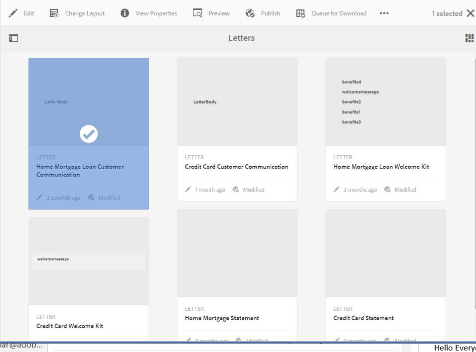
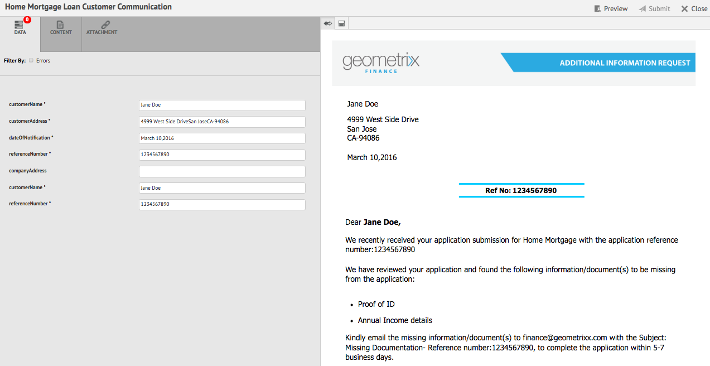
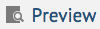

# Criar correspondência{#create-correspondence}

## Criar correspondência na interface do usuário Criar correspondência {#create-correspondence-in-the-create-correspondence-user-interface}

Depois que um modelo de [carta é criado no Gerenciamento](../../forms/using/create-letter.md)de Correspondência, o usuário final/agente/ajustador de solicitação pode abrir a carta na interface de usuário Criar Correspondência e criar uma correspondência inserindo dados, configurando o conteúdo e gerenciando anexos. Por fim, o agente ou o regulador de reivindicações pode gerenciar o conteúdo no modo de pré-visualização e enviar a carta.

### Pré-visualização de uma correspondência {#preview-a-correspondence}

Selecione a letra para pré-visualização usando as seguintes etapas:

1. Na página Letras, toque em **Selecionar**.
1. Selecione a letra apropriada tocando nela.

   

   Selecionar carta

1. Para uma carta baseada no Dicionário de dados, selecione **Pré-visualização** > **Pré-visualização**. Ou, para uma carta não baseada em Dicionário de dados, selecione **Pré-visualização**. You can also hover over a letter (without selecting it) and tap the Letter Preview icon to preview it.

   >[!NOTE]
   >
   >Se um dicionário de dados não estiver associado à letra, a pré-visualização da letra será aberta. Caso contrário, se a letra for baseada no dicionário de dados, o Gerenciamento de correspondência exibirá as opções Pré-visualização e Personalizado no menu Pré-visualização e você poderá selecionar uma das duas opções. Você também pode associar dados de teste a um Dicionário de dados. Quando o Dicionário de [dados tiver associado os dados](../../forms/using/data-dictionary.md#p-working-with-test-data-p)de teste e, ao selecionar a opção pré-visualização, a pré-visualização normal será aberta com os dados de teste preenchidos.

1. Para poder renderizar uma correspondência ao visualizá-la, você deve ser um administrador ou uma parte de um dos seguintes grupos:

   * usuários de formulários (para pré-visualização na instância do autor)
   * cm-agent-users (para execução na instância de publicação)
   Se você não tiver as permissões necessárias, solicite ao administrador o acesso apropriado. Para obter mais informações sobre como criar e adicionar usuários a grupos, consulte [Adicionar usuários ou grupos a um grupo](/help/sites-administering/security.md). Se você tentar renderizar uma correspondência sem ter as permissões apropriadas, a página de erro 404 será exibida.

1. Se você selecionou **Pré-visualização** > **Personalizado**, uma caixa de diálogo será aberta. Na caixa de diálogo, selecione um arquivo de dados, correspondente ao dicionário de dados, para pré-visualização a carta e, em seguida, selecione **Pré-visualização**. Um arquivo de dados é criado com base em um dicionário de dados para uma carta específica. Para obter mais informações sobre o arquivo de dados, consulte Dicionário [de](../../forms/using/data-dictionary.md#p-working-with-test-data-p)dados.

   

1. A letra pré-visualização HTML (pré-visualização de formulários móveis) é aberta com a guia Dados em foco por padrão.

   Para obter mais informações sobre formulários móveis e os recursos compatíveis, consulte Diferenciação de [recursos entre formulários](https://helpx.adobe.com/livecycle/help/mobile-forms/feature-differentiation-mobile-forms-pdf.html)móveis e formulários PDF.

   Há três guias: dados, conteúdo e anexos. Se não houver elementos de dados (variáveis de espaço reservado e campos de layout), a letra será aberta diretamente com a guia Conteúdo exibida. A guia Anexos está disponível somente quando os anexos estão presentes ou o acesso à biblioteca está ativado.

   >[!NOTE]

   >Para obter mais informações sobre como alternar entre o modo de representação HTML ou PDF da pré-visualização de letra, consulte [Alterar modo de representação de letra](#changerenditionmode). Para obter mais informações sobre o suporte a PDF no Gerenciamento de correspondência e no AEM, consulte [Descontinuação de plug-ins do navegador NPAPI e seu impacto](https://helpx.adobe.com/aem-forms/kb/discontinuation-of-npapi-plugins-impact-on-aem-forms.html) e formulários [PDF para formulários](https://helpx.adobe.com/aem-forms/kb/pdf-forms-to-html5-forms.html)HTML5.

### Enter data {#enterdata}

Na guia Dados, preencha os campos de layout e os espaços reservados disponíveis.

1. Insira as variáveis de dados e conteúdo nos campos, conforme necessário. Preencha todos os campos obrigatórios marcados com um asterisco (*) para ativar o botão **Enviar** .

   Toque em um valor de campo de dados na pré-visualização de letra HTML para realçar o campo de dados correspondente na guia Dados.

    

### Gerenciar conteúdo {#managecontent}

Na guia conteúdo, gerencie o conteúdo, como fragmentos de documento e variáveis de conteúdo, na carta.

1. Select **Content**. O Gerenciamento de correspondência exibe a guia de conteúdo da carta.

   

1. Edite os módulos de conteúdo, conforme necessário, na guia Conteúdo. Para trazer o foco para o módulo de conteúdo relevante na hierarquia de conteúdo, você pode tocar na linha ou parágrafo relevante na pré-visualização da letra ou tocar no módulo de conteúdo diretamente na hierarquia Conteúdo.

   Por exemplo, a linha &quot;Nós revisamos... &quot; é selecionado no gráfico abaixo e o módulo de conteúdo relevante é selecionado na guia Conteúdo.

   

   Na guia Conteúdo ou Dados, ao tocar em Realçar módulos selecionados ( ) no canto superior esquerdo da pré-visualização de letras HTML, você pode desativar ou ativar a funcionalidade para ir para o módulo de conteúdo/dados quando o texto, parágrafo ou campo de dados relevante for selecionado na pré-visualização de letras.

   Para obter mais informações sobre as ações disponíveis para vários módulos na interface do usuário Criar correspondência, consulte [Ações e informações disponíveis na interface](#actions-and-info-available-in-the-create-correspondence-content-tab)do usuário Criar correspondência.

1. Para localizar módulos de conteúdo, use o campo Localizar. Digite o nome completo ou parcial do módulo de conteúdo para procurá-lo na correspondência.
1. Toque no ícone Exibir ( ) na frente de uma área de lista, texto, condição ou público alvo para exibi-la ou ocultá-la na letra.
1. Para editar um módulo de texto incorporado ou editável, toque no ícone **Editar** relevante ( ) ou clique com o duplo no módulo de texto relevante na pré-visualização de letras.

   O sistema exibe um editor de texto para editar e formatar o texto.

   O verificador ortográfico padrão em seu navegador verifica a ortografia no Editor de texto. Para gerenciar a ortografia e a verificação gramatical, edite as configurações do verificador ortográfico do seu navegador ou instale plug-ins/suplementos do navegador para verificar a ortografia e a gramática.

   Você também pode usar os vários atalhos de teclado no editor de texto para gerenciar, editar e formatar o texto. Para obter mais informações sobre atalhos de teclado do Editor [de](/help/forms/using/keyboard-shortcuts.md#correspondence-management) texto em Atalhos de teclado do Gerenciamento de correspondência.

   

   Você pode reutilizar um ou mais parágrafos de texto que existem em outra aplicação do documento. Você pode copiar e colar texto diretamente, como do MS Word, páginas HTML ou qualquer outro aplicativo.

   É possível copiar e colar um ou mais parágrafos de texto em um módulo de texto editável. Por exemplo, você pode ter um documento do MS Word com uma lista com marcadores de provas de residência aceitáveis como:

   

   Você pode copiar e colar diretamente o texto do documento do MS Word em um módulo de texto editável. A formatação, como lista com marcadores, fonte e cor do texto, é retida no módulo de texto.

   

   >[!NOTE]
   >
   >Entretanto, a formatação do texto colado tem algumas [limitações](https://helpx.adobe.com/aem-forms/kb/cm-copy-paste-text-limitations.html).

   Você pode recuar o texto e os números na sua carta usando a tecla Tab. Por exemplo, você pode usar a tecla Tab para alinhar várias colunas de texto em uma lista em um formato tabular.

   

   Exemplo: Uso da tecla Tab para alinhar várias colunas de texto em um formato tabular

   >[!NOTE]
   >
   >Para obter mais informações sobre como configurar o espaçamento entre guias para seus módulos de texto e letras, consulte [Mais informações sobre como usar o espaçamento entre guias para organizar o texto](https://helpx.adobe.com/aem-forms/kb/cm-tab-spacing-limitations.html).

1. Se necessário, inserir caracteres especiais na correspondência. Por exemplo, é possível usar a paleta Caracteres especiais para inserir:

   * Símbolos monetários como €, ¥ e £
   * Símbolos matemáticos como ∑, √,  e ^
   * Símbolos de pontuação como ‟ e&quot;
   

   O Gerenciamento de correspondência tem suporte integrado para 210 caracteres especiais. O administrador pode [adicionar suporte para caracteres especiais mais/personalizados por personalização](../../forms/using/custom-special-characters.md).

1. Para realçar\enfatizar partes de texto em um módulo incorporado editável, selecione o texto e toque em Realçar cor.

   

   Você pode tocar diretamente em uma cor básica `**[A]**` presente na paleta Cores básicas ou tocar em **Selecionar** depois de usar o controle deslizante `**[B]**` para escolher o tom apropriado da cor.

   Opcionalmente, você também pode ir para a guia Avançado para selecionar a Matiz, a Luminosidade e a Saturação apropriadas `**[C]**` para criar a cor precisa e, em seguida, tocar em Selecionar `**[D]**` para aplicar a cor para realçar o texto.

   

1. Faça as alterações de conteúdo e formato apropriadas e toque em **Salvar**. Toque em ( ) para mover-se entre módulos de texto editáveis ou toque em **Salvar e Avançar** para salvar as alterações e ir para o próximo módulo de texto editável.
1. O sistema também exibe as variáveis não preenchidas para cada uma das ramificações. Quando não há variáveis não preenchidas, as variáveis não preenchidas são exibidas como 0. Se houver uma variável não preenchida, você pode tocar em uma ramificação para expandi-la e localizar a variável não preenchida. Use a barra de ferramentas de conteúdo para Excluir conteúdo, aumentar/diminuir o recuo do conteúdo e inserir quebras de página antes/depois do conteúdo.

   É possível inserir quebras de página acima e abaixo dos módulos de dados mesmo quando eles fazem parte de listas e condições.

1. Tap Open/Close Content Variable ( ) to open the content variables and fill them appropriately.
1. Depois de preencher a variável não preenchida corretamente, a contagem da variável não preenchida é definida como 0.

   Na interface do usuário Criar correspondência, a contagem de variáveis não preenchidas é exibida em cada nível da hierarquia de qualquer módulo que contenha pelo menos uma variável. Se um módulo contiver variáveis não preenchidas, a contagem será exibida nos níveis de variável, módulo, área do público alvo e modelo de carta.

   A contagem de variáveis não preenchidas inclui:

   * Somente variáveis de dicionário de dados e espaço reservado desprotegidas. A contagem de variáveis não inclui variáveis de dicionário de dados protegidas ou de layout.
   * Campos obrigatórios.
   * Campos de layout se forem obrigatórios e vinculados ao usuário.
   * Somente instâncias de variáveis exclusivas. Se um módulo, área de público alvo ou modelo de carta contiver duas ou mais instâncias da mesma variável, a contagem será exibida como 1 (uma). No entanto, para cada uma das instâncias, a contagem é exibida como 1.
   A contagem de variáveis não preenchidas não inclui módulos desmarcados. Se um módulo estiver incluído em um modelo de carta, mas não estiver na letra, a contagem de variáveis não preenchidas neste módulo não será exibida.

   Para a área do público alvo, módulo e variável, a contagem é exibida à direita de cada objeto no modelo de letra. However, for the complete template, the count is displayed in the Create Correspondence status bar.

   Os módulos em um modelo de carta exibem a contagem de variáveis não preenchidas conforme descrito abaixo:

   * **Texto** Exibe a soma das variáveis exclusivas de espaço reservado não preenchido e dos elementos de dicionário de dados contidos no módulo de texto.
   * **Condição** Exibe a soma das variáveis de condição não preenchidas exclusivas contidas na condição e as variáveis contidas nos módulos resultantes.
   * **Lista** Exibe a soma de todas as variáveis não preenchidas exclusivas contidas nos módulos atribuídos à lista.
   * **Área** do Público alvo Exibe a soma de todas as variáveis não preenchidas exclusivas contidas nos módulos atribuídos à área do público alvo.
   Observe o seguinte em relação às variáveis com valores padrão:

   * O padrão de um campo de variável Booliana é *false*. However, the variable is considered to be unfilled. This implies that the variable count includes all Boolean variable fields with value *false*.

   * O padrão de um campo de variável numérica é *0 (zero)*. No entanto, a variável é considerada como não preenchida. Isso implica que a contagem de variáveis inclui todos os campos de variável numérica com valor *0 (zero)*.

#### Ações e informações disponíveis na guia Criar conteúdo de correspondência {#actions-and-info-available-in-the-create-correspondence-content-tab}

**Área de destino**

* Inserir linha em branco: Insere uma nova linha em branco.
* Inserir texto em linha: Insere o novo módulo de texto.
* Bloqueio do pedido (informações): Indica que a ordem do conteúdo não pode ser alterada.
* Valores não preenchidos (informações): Indica o número de variáveis não preenchidas na área do público alvo.

**Module**

* Seleção (ícone de olho): Inclui\exclui o módulo da letra.
* Ignorar marcadores (aplicável para módulos de lista e seus módulos filho): Ignora marcadores em um módulo específico.
* Quebra de página antes (aplicável para módulos filho da área do público alvo): Insere uma quebra de página antes do módulo.
* Quebra de página após (aplicável para módulos filho da área do público alvo): Insere uma quebra de página antes do módulo.
* Valores não preenchidos (informações): Indica o número de variáveis não preenchidas na área do público alvo.
* Editar (somente módulos de texto): Abra o editor de Rich Text para editar o módulo de texto.
* Painel de dados (módulos de texto e condição): Abra todas as variáveis do módulo.

**Módulo de Lista**

* Inserir linha em branco: Insere uma nova linha em branco.
* Biblioteca de conteúdo: Abre a biblioteca de conteúdo para adicionar módulos à lista.
* Configuração de Lista (somente lista aninhada):
* Bloqueio do pedido (informações): Indica que a ordem dos itens de lista não pode ser alterada.

### Gerenciar anexos {#manage-attachments}

1. Selecione **Anexos**. O Gerenciamento de correspondência exibe os anexos disponíveis, conforme configurado durante a criação do modelo de carta.
1. Você pode optar por não enviar um anexo juntamente com a letra tocando no ícone de visualização e tocar na cruz no anexo para excluí-lo da letra. Para os anexos especificados, ao criar um modelo de carta, como Obrigatório, os ícones Visualização e Excluir são desativados.
1. Toque no ícone Acesso à biblioteca ( ) para acessar a Biblioteca de conteúdo para inserir ativos DAM como anexos.

   >[!NOTE]
   >
   >O ícone de Acesso à biblioteca está disponível somente quando o acesso à biblioteca foi ativado durante a criação da carta.

1. Se a ordem dos anexos não tiver sido bloqueada durante a criação da correspondência, você poderá reordenar os anexos selecionando um anexo e tocando nas setas para baixo e para cima.

   Para obter mais informações, consulte [delivery](#attachmentdelivery)Anexo.

### Gerenciar conteúdo na pré-visualização e enviar a carta {#manage-content-in-preview-and-submit-the-letter}

É possível fazer alterações relacionadas ao layout e ao conteúdo para garantir que a letra seja a aparência desejada e envie-a para os vários processos de publicação.

1. Para realçar todo o conteúdo editável na letra, toque em **Realçar seções** editáveis.

   O conteúdo editável da carta é realçado com fundo cinza.

   

1. Edite os módulos de conteúdo, conforme necessário, na guia Conteúdo. Para trazer o foco para o módulo de conteúdo relevante na hierarquia de conteúdo, você pode tocar na linha ou parágrafo relevante na pré-visualização da letra ou tocar no módulo de conteúdo diretamente na hierarquia Conteúdo.

   Por exemplo, a linha &quot;Para permitir o acesso...&quot; for selecionado no gráfico abaixo e o módulo de conteúdo correspondente for selecionado na guia Conteúdo.

   Ao tocar em Realçar módulos selecionados no conteúdo ( selecionado), você pode desativar ou ativar a funcionalidade para realçar o módulo de conteúdo na guia Conteúdo quando o texto, parágrafo ou campo de dados relevante for tocado na pré-visualização da letra.

   Para obter mais informações sobre as ações disponíveis para vários módulos na interface do usuário Criar correspondência, consulte [Ações e informações disponíveis na interface](#actions-and-info-available-in-the-create-correspondence-content-tab)do usuário Criar correspondência.

1. Para adicionar uma quebra de página à letra, toque no local em que deseja inserir uma quebra de página e selecione Quebra de página antes ou Quebra de página depois ( ).

   Um espaço reservado para quebra de página explícito é inserido na letra. Para visualização de como uma quebra de página explícita afeta a letra, consulte a pré-visualização de PDF nivelada.

   >[!NOTE]
   >
   >Como os formulários móveis não suportam quebras de página, os cabeçalhos e rodapés são exibidos apenas uma vez. Entretanto, é possível definir explicitamente cabeçalhos e rodapés no layout (por página) para que apareçam na pré-visualização de formulários móveis. Além disso, as páginas em branco na letra, se houver, não aparecem na pré-visualização de formulários do Mobile.

   

1. Para salvar a carta como um rascunho, no qual você pode continuar trabalhando posteriormente, toque em Salvar como rascunho. Para usar essa opção, sua carta precisa ser [publicada](../../forms/using/publishing-unpublishing-forms.md#publishanasset). Para obter mais informações, consulte Instância de rascunho em [Salvar rascunhos e enviar instâncias](#savingdrafts)de carta.

   

   The Draft Letter Name dialog appears with the letter instance id. You can, optionally edit this ID. Make a note of the letter Id and then tap **Done**. You can later use this ID to [reload the draft letter](submit-letter-topostprocess.md#reloaddraft).

1. To preview the letter as a flattened PDF with the exact layout and page breaks as it will be submitted, tap ( ) Preview.

   The letter appears as a flattened PDF. The flattened PDF is the exact representation of the letter as it will be submitted with the correct fonts, breaks, and layout of the letter.

   >[!NOTE]
   >
   >If you are using Mozilla Firefox and HTML rendition type, to preview the letter as flattened PDF, ensure that you use the native browser plug-in and not the Acrobat plugin. To select the native browser plug-in, go to Mozilla Firefox&#39;s settings and for content type PDF, select Preview in Firefox.

1. If you find the flattened PDF preview to be satisfactory, tap **Submit** to submit the letter. Or to make changes to the letter, tap **Exit Preview** to go back to the Create Correspondence UI preview of the letter to make changes in the letter. When you tap Submit, if the Manage Letter Instance configuration is enabled on the Publish instance, the submit letter instance is generated.

   For more information, see Draft Instance under Saving drafts and submitting letter instances.

   You can also save the letter as a draft to make changes to the letter later.

   Depois de fazer as alterações necessárias, você pode enviar a carta da pré-visualização HTML5 ou tocar em Pré-visualização novamente para revisar a saída de PDF nivelado.

   Para obter informações sobre diferenças entre formulários HTML5 e PDF, consulte Diferenciação de [recursos entre formulários HTML5 e formulários](../../forms/using/feature-differentiation-html5-forms-pdf-forms.md)PDF.

## Salvar rascunhos e enviar instâncias de carta {#savingdrafts}

When a letter is rendered in the Create Correspondence user interface, you can save the letter as being viewed.

Há dois tipos de instâncias de carta que podem ser salvas: Instância de rascunho e instância de envio.

* **Draft Instance**: Draft instance captures the current state of the letter you are previewing. To save a draft instance, first ensure that the letter and all the assets the letter references are in Published state. For information on publishing a letter, see [Publish an asset](../../forms/using/publishing-unpublishing-forms.md#publishanasset). You need to Publish a letter before you could save it as a draft, because when you publish a letter, you create a version of the letter, its dependent assets, and data at that point. The published version of a letter cannot be edited by you or another user and can be restored later without any unexpected discrepancies from the published version. You can return to this instance later and continue from where you left.

* **Submit Instance**: Submit instances captures the state of letter as it is submitted. Submit instance stores the PDF state of the letter instance after it is post processed along with the data entered by user in the Create Correspondence user interface.

Essas instâncias só podem ser salvas quando a carta estiver sendo visualizada na instância de publicação. Por padrão, salvar em instâncias é desativado. Para ativar a gravação de instâncias de carta, execute as seguintes etapas.

1. No AEM, abra a Configuração do console da Web do Adobe Experience Manager para seu servidor usando o seguinte URL: https://&lt;servidor>:&lt;porta>/&lt;caminho de contexto>/system/console/configMgr
1. Localize Configurações **[!UICONTROL de gerenciamento de]** correspondência e clique nela.
1. Marque **[!UICONTROL Gerenciar instâncias de carta na configuração de publicação]** e clique em **[!UICONTROL Salvar]**.

Quando a gravação de instâncias de carta estiver ativada, você terá a opção de selecionar onde salvar as instâncias de carta. Há duas opções para salvar as instâncias de carta: Salvar local ou Salvar remotamente.

### Salvar local {#local-save}

As instâncias de carta são salvas na instância de publicação e são replicadas revertidas na instância do autor.

### Salvar remoto {#remote-save}

Essa opção existe para pessoas que têm preocupações sobre como salvar dados do usuário em instâncias de publicação, que em geral estão fora do firewall corporativo. Quando o salvamento remoto é ativado, as instâncias de carta não são salvas na instância de publicação, mas são salvas remotamente no autor do processamento especificado pelas configurações do SDK do LiveCycle Client.

#### Ativar salvamento remoto {#enable-remote-save}

1. No AEM, abra a Configuração do console da Web do Adobe Experience Manager para seu servidor usando o seguinte URL: `https://<server>:<port>/<contextpath>/system/console/configMgr`
1. Procure Configurações **[!UICONTROL de gerenciamento de]** correspondência e clique nele.
1. Localize a configuração de Salvar **** Remoto, marque-a e clique em **[!UICONTROL Salvar]**.

#### Especificar configurações do autor de processamento {#specify-processing-author-settings}

1. No AEM, abra a Configuração do console da Web do Adobe Experience Manager para seu servidor usando o seguinte URL: `https://<server>:<port>/<contextpath>/system/console/configMgr`

   

1. Nesta página, localize a Configuração do SDK do Adobe LiveCycle Client e expanda-a clicando nela.

1. No URL do Servidor de processamento, digite o nome do servidor do LiveCycle, forneça as informações de logon e clique em **Salvar**.

   

1. Se necessário, defina o nome de usuário e a senha com os quais você deseja acessar o servidor.

#### delivery de anexo {#attachmentdelivery}

* Os anexos da carta estão disponíveis no processo de publicação no PDF, que é criado após o envio da carta.
* Quando a Carta é renderizada usando APIs do lado do servidor como um PDF interativo ou não interativo, o PDF renderizado contém anexos como anexos de PDF.
* Quando um processo de publicação associado a um modelo de carta é carregado como parte das operações Enviar ou Concluir correspondência usando a interface de usuário Criar correspondência, os anexos são transmitidos como Lista&lt;com.adobe.idp.Documento> no parâmetro AttachmentDocs.
* Mecanismos de delivery prontos para uso, como email e Impressão, também fornecem anexos juntamente com o PDF da correspondência gerada.

## Modos de representação da pré-visualização de letras: pré-visualização de formulários móveis e pré-visualização de PDF {#rendition-modes-of-letter-preview-mobile-forms-preview-and-pdf-preview}

O Gerenciamento de correspondência de formulários AEM exibe uma letra como HTML na interface Criar correspondência. No entanto, o Gerenciamento de correspondência ainda oferece suporte para reverter para a pré-visualização PDF em vez da pré-visualização HTML. Para obter mais informações sobre como alternar entre os modos de pré-visualização HTML e PDF, consulte [Alterar modo de representação da letra](#changerenditionmode).

Veja a seguir os benefícios e a funcionalidade disponíveis na pré-visualização de HTML e PDF.

**Benefícios de formulários móveis/pré-visualização HTML**

* **Toque em um valor de campo de dados para realçar o campo** de dados correspondente: Na interface do usuário Criar correspondência, é possível tocar em um valor de campo de dados na letra para realçar o campo de dados correspondente na guia Dados. Para obter mais informações, consulte [Inserir dados](#enterdata).

* **Suporte** a navegador: O navegador retira o suporte para NPAPI gradualmente, o que afeta a pré-visualização de letras do PDF. A pré-visualização de letras de formulários HTML/móveis não é afetada por isso.
* **Highlight editable content in a letter**: In the Create Correspondence user interface, you can tap Highlight Editable Content to highlight all the editable content in the letter in gray. For more information, see [Manage content](#managecontent).

`<li>` `<li>Benefits of HTML preview  <ul>   <li>Right to left</li>   <li>NPAPI</li>   <li>Highlight Editable Content</li>  </ul> </li>` `<li>Benefits of PDF preview  <ul>   <li>Page Break</li>   <li>Final Preview</li>  </ul> </li>`
`<li>` `<li>Benefits of HTML preview  <ul>   <li>Right to left</li>   <li>NPAPI</li>   <li>Highlight Editable Content</li>  </ul> </li>` `<li>Benefits of PDF preview  <ul>   <li>Page Break</li>   <li>Final Preview</li>  </ul> </li>`  **Benefits of PDF preview**

* **Page break**: In the PDF preview, you can view exactly how the page breaks in the letter affect its output.
* **pré-visualização** final: Na pré-visualização do PDF, é possível visualização a formatação exata e a aparência da letra, à medida que ela aparecerá em sua saída.

Para obter informações sobre suporte a scripts em formulários PDF, consulte Suporte [a](https://help.adobe.com/en_US/livecycle/11.0/ScriptingSupport/index.html)scripts.

For more information on scripting support in HTML5 forms, see [Scripting support for HTML5 forms](/help/forms/using/scripting-support.md).

### Change rendition mode of letter {#changerenditionmode}

Por padrão, a interface de usuário Criar correspondência usa os formulários HTML ou móveis para renderizar a pré-visualização da carta. A pré-visualização de formulários móveis não tem problemas de renderização em nenhum navegador, pois usa o plug-in nativo do navegador e não requer plug-ins adicionais. É possível alterar o modo de pré-visualização de letras para PDF. Entretanto, as restrições do navegador podem criar problemas para diferentes recursos da pré-visualização interativa de PDF da carta.

Para obter mais informações sobre a compatibilidade do navegador com a pré-visualização de letras, consulte [Descontinuação dos plug-ins do navegador NPAPI e seu impacto](https://helpx.adobe.com/aem-forms/kb/discontinuation-of-npapi-plugins-impact-on-aem-forms.html).

Para alterar o modo de pré-visualização da letra, execute as seguintes etapas:

1. Vá para `https://[system]:'port'/system/console/configMgr` e, se necessário, faça logon como Administrador.
1. Go to **[!UICONTROL Correspondence Management Configurations]** > **[!UICONTROL Rendition Type]** and select **HTML Rendition** (Default) or **PDF Rendition**.
1. Clique em **[!UICONTROL Salvar]**.

