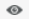
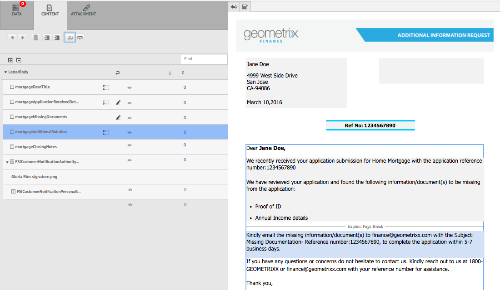
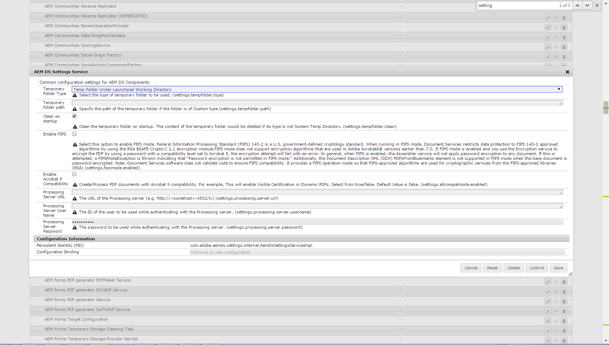

# Criar correspondência{#create-correspondence}

## Criar correspondência na interface do usuário Criar correspondência {#create-correspondence-in-the-create-correspondence-user-interface}

Depois que um [modelo de carta é criado no Gerenciamento de correspondência](../../forms/using/create-letter.md), o usuário final/agente/ajuste de solicitação pode abrir a carta na interface do usuário Criar correspondência e criar uma correspondência inserindo dados, configurando o conteúdo e gerenciando anexos. Por fim, o regulador ou agente de crédito pode gerenciar o conteúdo no modo de visualização e enviar a carta.

### Visualizar uma correspondência {#preview-a-correspondence}

Selecione a carta para pré-visualizar usando as seguintes etapas:

1. Na página Cartas, toque em **Selecionar**.
1. Selecione a carta apropriada tocando nela.

   

   Selecionar letra

1. Para uma carta baseada no Dicionário de dados, selecione **Visualizar** > **Visualizar**. Ou para uma carta não baseada em dicionário de dados, selecione **Visualizar**. Você também pode passar o mouse sobre uma carta (sem selecioná-la) e tocar no ícone Exibição da carta para visualizá-la.

   >[!NOTE]
   >
   >Se um dicionário de dados não estiver associado à carta, a visualização da carta será aberta. Caso contrário, se a letra for baseada no dicionário de dados, o Gerenciamento de correspondência exibirá as opções Visualizar e Personalizado no menu Visualizar e você poderá selecionar uma das duas opções. Também é possível associar dados de teste a um Dicionário de dados. Quando o [Dicionário de dados tiver associado os dados de teste](../../forms/using/data-dictionary.md#p-working-with-test-data-p), em seguida, ao selecionar a opção de visualização, a visualização normal será aberta com os dados de teste preenchidos.

1. Para poder renderizar uma correspondência ao visualizá-la, você deve ser um administrador ou parte de um dos seguintes grupos:

   * usuários de formulários (para visualização na instância do autor)
   * cm-agent-users (para representação na instância de publicação)

   Se você não tiver as permissões necessárias, solicite ao administrador o acesso apropriado. Para obter mais informações sobre como criar e adicionar usuários a grupos, consulte [Adicionar usuários ou grupos a um grupo](/help/sites-administering/security.md). Se você tentar renderizar uma correspondência sem ter as permissões apropriadas, a página de erro 404 será exibida.

1. Se você selecionou **Visualizar** > **Personalizado**, uma caixa de diálogo é aberta. Na caixa de diálogo, selecione um arquivo de dados, correspondente ao dicionário de dados, para visualizar a carta e selecione **Visualizar**. Um arquivo de dados é criado com base em um dicionário de dados de uma carta específica. Para obter mais informações sobre o arquivo de dados, consulte [Dicionário de dados](../../forms/using/data-dictionary.md#p-working-with-test-data-p).

   

1. A letra Visualização HTML (visualização de formulários móveis) é aberta com a guia Dados em foco por padrão.

   Para obter mais informações sobre formulários móveis e os recursos que eles suportam, consulte [Diferenciação de recursos entre o Mobile Forms e o PDF forms](https://helpx.adobe.com/livecycle/help/mobile-forms/feature-differentiation-mobile-forms-pdf.html).

   Há três guias: dados, conteúdo e anexos. Se não houver elementos de dados (variáveis de espaço reservado e campos de layout), a letra será aberta diretamente com a guia Conteúdo exibida. A guia Anexos só está disponível quando os anexos estão presentes ou o acesso à biblioteca está ativado.

   >[!NOTE]
   >
   >Para obter mais informações sobre como alternar entre o modo de representação HTML ou PDF da visualização de letra, consulte [Alterar modo de representação da letra](#changerenditionmode). Para obter mais informações sobre o suporte a PDF no Gerenciamento de correspondência e AEM, consulte [Descontinuação dos plug-ins de navegador NPAPI e seu impacto](https://helpx.adobe.com/aem-forms/kb/discontinuation-of-npapi-plugins-impact-on-aem-forms.html) e [PDF forms para HTML5 Forms](https://helpx.adobe.com/aem-forms/kb/pdf-forms-to-html5-forms.html).

### Inserir dados {#enterdata}

Na guia Data , preencha os campos de layout e os espaços reservados disponíveis.

1. Insira os dados e as variáveis de conteúdo nos campos, conforme necessário. Preencha todos os campos obrigatórios marcados com um asterisco (*) para ativar o botão **Submit**.

   Toque em um valor de campo de dados na visualização da carta HTML para realçar o campo de dados correspondente na guia Data .

    

### Gerenciar conteúdo {#managecontent}

Na guia conteúdo , gerencie o conteúdo, como fragmentos de documento e variáveis de conteúdo na carta.

1. Selecione **Content**. O Gerenciamento de correspondência exibe a guia de conteúdo da carta.

   

1. Edite os módulos de conteúdo, conforme necessário, na guia Content . Para trazer o foco para o módulo de conteúdo relevante na hierarquia do conteúdo, você pode tocar na linha relevante ou no parágrafo na visualização da carta ou tocar no módulo de conteúdo diretamente na hierarquia Conteúdo.

   Por exemplo, a linha &quot;Revisamos...&quot; é selecionada no gráfico abaixo e o módulo de conteúdo relevante é selecionado na guia Conteúdo.

   

   Na guia Content or Data , ao tocar em Realçar Módulos Selecionados ( ) no canto superior esquerdo da visualização da letra HTML, você pode desativar ou ativar a funcionalidade para ir para o módulo de conteúdo/dados quando o texto, parágrafo ou campo de dados relevante for selecionado na visualização da letra.

   Para obter mais informações sobre as ações disponíveis para vários módulos na interface do usuário Criar correspondência, consulte [Ações e informações disponíveis na interface do usuário Criar correspondência](#actions-and-info-available-in-the-create-correspondence-content-tab).

1. Para localizar módulos de conteúdo, use o campo Localizar . Insira o nome completo ou parcial ou o título do módulo de conteúdo para pesquisá-lo na correspondência.
1. Toque no ícone Exibir ( ) na frente de uma lista, texto, condição ou área de destino para exibi-la ou ocultá-la na letra.
1. Para editar um módulo de texto embutido ou editável, toque no ícone **Edit** relevante ( ) ou clique duas vezes no módulo de texto relevante na visualização de carta.

   O sistema exibe um editor de texto para editar e formatar o texto.

   O verificador ortográfico padrão em seu navegador verifica a ortografia no Editor de texto. Para gerenciar a verificação ortográfica e gramatical, você pode editar as configurações do verificador ortográfico do seu navegador ou instalar plug-ins/endereços do navegador para verificar a ortografia e a gramática.

   Você também pode usar os vários atalhos de teclado no editor de texto para gerenciar, editar e formatar o texto. Para obter mais informações sobre os atalhos de teclado do [Editor de Texto](/help/forms/using/keyboard-shortcuts.md#correspondence-management) em Atalhos de teclado do Correspondence Management.

   

   Você pode querer reutilizar um ou mais parágrafos de texto que existem em outra aplicação do documento. Você pode copiar e colar texto diretamente, como de MS Word, páginas HTML ou qualquer outro aplicativo.

   Você pode copiar e colar um ou mais parágrafos de texto em um módulo de texto editável. Por exemplo, você pode ter um documento do MS Word com uma lista com marcadores de provas de residência aceitáveis como:

   

   Você pode copiar e colar diretamente o texto do documento do MS Word em um módulo de texto editável. A formatação, como lista com marcadores, fonte e cor do texto, é retida no módulo de texto.

   

   >[!NOTE]
   >
   >No entanto, a formatação do texto colado tem algumas [limitações](https://helpx.adobe.com/aem-forms/kb/cm-copy-paste-text-limitations.html).

   Você pode recuar o texto e os números na carta usando a tecla Tab. Por exemplo, você pode usar a tecla Tab para alinhar várias colunas de texto em uma lista em um formato tabular.

   

   Exemplo: Uso da tecla Tab para alinhar várias colunas de texto em um formato tabular

   >[!NOTE]
   >
   >Para obter mais informações sobre como configurar o espaçamento entre guias para seus módulos de texto e letras, consulte [Mais informações sobre como usar o espaçamento entre guias para organizar o texto](https://helpx.adobe.com/aem-forms/kb/cm-tab-spacing-limitations.html).

1. Se necessário, inserir caracteres especiais na correspondência. Por exemplo, é possível usar a paleta Caracteres especiais para inserir:

   * Símbolos monetários como €, ¥ e £
   * Símbolos matemáticos como ∑, Lei e ^
   * Símbolos de pontuação como ‟ e&quot;

   

   O Gerenciamento de correspondência tem suporte integrado para 210 caracteres especiais. O administrador pode [adicionar suporte para caracteres especiais mais/personalizados por personalização](../../forms/using/custom-special-characters.md).

1. Para realçar\enfatizar partes do texto em um módulo em linha editável, selecione o texto e toque em Realçar cor.

   

   Você pode tocar diretamente em uma cor básica `**[A]**` presente na paleta Cores básicas ou tocar em **Selecionar** depois de usar o controle deslizante `**[B]**` para escolher a sombra apropriada da cor.

   Como opção, você também pode ir para a guia Avançado para selecionar a Matiz, a Luminosidade e a Saturação apropriadas `**[C]**` para criar a cor precisa e, em seguida, tocar em Selecionar `**[D]**` para aplicar a cor para realçar o texto.

   

1. Faça as alterações apropriadas de conteúdo e formato e toque em **Salvar**. Toque em ( ) para se mover entre módulos de texto editáveis ou toque em **Salvar e Próximo** para salvar as alterações e ir para o próximo módulo de texto editável.
1. O sistema também exibe as variáveis não preenchidas para cada ramificação. Quando não há variáveis não preenchidas, as variáveis não preenchidas são mostradas como 0. Se houver uma variável não preenchida, é possível tocar em uma ramificação para expandi-la e localizar a variável não preenchida. Use a barra de ferramentas de conteúdo para Excluir conteúdo, aumentar/diminuir o recuo do conteúdo e inserir quebras de página antes/depois do conteúdo.

   É possível inserir quebras de página nos módulos de dados acima e abaixo mesmo quando fizerem parte de listas e condições.

1. Toque em Abrir/fechar a variável de conteúdo ( ) para abrir as variáveis de conteúdo e preenchê-las adequadamente.
1. Depois de preencher a variável não preenchida corretamente, a contagem da variável não preenchida será definida como 0.

   Na interface do usuário Criar correspondência, a contagem de variáveis não preenchidas é exibida em cada nível da hierarquia de qualquer módulo que contenha pelo menos uma variável. Se um módulo contiver variáveis não preenchidas, a contagem será exibida no nível da variável, do módulo, da área de destino e do template de letra.

   A contagem de variáveis não preenchidas inclui:

   * Somente dicionário de dados desprotegido e variáveis de espaço reservado. A contagem de variáveis não inclui o layout ou as variáveis protegidas do dicionário de dados.
   * Campos obrigatórios.
   * Campos de layout, se forem obrigatórios e vinculados ao usuário.
   * Somente instâncias de variáveis exclusivas. Se um módulo, área de destino ou modelo de letra contiver duas ou mais instâncias da mesma variável, a contagem será exibida como 1 (uma). No entanto, para cada uma das instâncias, a contagem é exibida como 1.

   A contagem de variáveis não preenchidas não inclui módulos desmarcados. Se um módulo for incluído em um template de letra, mas não estiver na letra, a contagem de variáveis não preenchidas neste módulo não será exibida.

   Para a área de destino, módulo e variável, a contagem é exibida à direita de cada objeto no template de letra. No entanto, para o modelo completo, a contagem é exibida na barra de status Criar correspondência .

   Os módulos em um template de carta exibem a contagem de variáveis não preenchidas conforme descrito abaixo:

   * **** TextoExibe a soma das variáveis exclusivas não preenchidas de espaço reservado e dos elementos de dicionário de dados contidos no módulo de texto.
   * **** CondiçãoExibe a soma das variáveis de condição não preenchidas exclusivas contidas na condição e as variáveis contidas nos módulos resultantes.
   * **** ListaExibe a soma de todas as variáveis não preenchidas exclusivas contidas nos módulos atribuídos à lista.
   * **Área de** destinoExibe a soma de todas as variáveis não preenchidas exclusivas contidas nos módulos atribuídos à área de destino.

   Observe o seguinte em relação às variáveis com valores padrão:

   * Um campo de variável booleana assume como padrão *false*. No entanto, a variável é considerada como não preenchida. Isso implica que a contagem de variáveis inclui todos os campos de variável Booleana com valor *false*.

   * Um campo de variável numérica assume como padrão *0 (zero)*. No entanto, a variável é considerada como não preenchida. Isso implica que a contagem de variáveis inclua todos os campos de variável numérica com valor *0 (zero)*.

#### Ações e informações disponíveis na guia Criar conteúdo de correspondência {#actions-and-info-available-in-the-create-correspondence-content-tab}

**Área de destino**

* Inserir Linha em Branco: Insere uma nova linha em branco.
* Inserir texto em linha: Insere um novo módulo de texto.
* Bloqueio de pedido (informações): Indica que a ordem do conteúdo não pode ser alterada.
* Valores não preenchidos (informações): Indica o número de variáveis não preenchidas na área de destino.

**Módulo**

* Seleção (ícone de olhos): Inclui\exclui módulo da letra.
* Ignorar marcadores (aplicável para módulos de lista e seus módulos filhos): Ignora marcadores em um módulo específico.
* Quebra de página antes (aplicável para módulos filho da área de destino): Insere quebra de página antes do módulo .
* Quebra de página após (aplicável para módulos filho da área de destino): Insere quebra de página antes do módulo .
* Valores não preenchidos (informações): Indica o número de variáveis não preenchidas na área de destino.
* Editar (apenas módulos de texto): Abra o editor de rich text para editar o módulo de texto.
* Painel de dados (módulos de texto e condição): Abra todas as variáveis do módulo.

**Módulo de lista**

* Inserir Linha em Branco: Insere uma nova linha em branco.
* Biblioteca de conteúdo: Abre a biblioteca de conteúdo para adicionar módulos à lista.
* Configuração de lista (somente lista aninhada):
* Bloqueio de pedido (informações): Indica que a ordem dos itens da lista não pode ser alterada.

### Gerenciar anexos {#manage-attachments}

1. Selecione **Attachments**. O Gerenciamento de correspondência exibe os anexos disponíveis, conforme configurado ao criar o modelo de carta.
1. Você pode optar por não enviar um anexo junto com a carta, tocando no ícone de exibição e tocar na cruz no anexo para excluí-lo da carta. Para os anexos especificados, ao criar um modelo de carta, como Obrigatório, os ícones Exibir e Excluir são desativados.
1. Toque no ícone Acesso à biblioteca ( ) para acessar a Biblioteca de conteúdo para inserir ativos DAM como anexos.

   >[!NOTE]
   >
   >O ícone Acesso à biblioteca está disponível somente quando o acesso à biblioteca foi ativado durante a criação da carta.

1. Se a ordem dos anexos não tiver sido bloqueada durante a criação da correspondência, é possível reordenar os anexos selecionando um anexo e tocando nas setas para baixo e para cima.

   Para obter mais informações, consulte [Attachment delivery](#attachmentdelivery).

### Gerenciar conteúdo na visualização e enviar a carta {#manage-content-in-preview-and-submit-the-letter}

É possível fazer alterações relacionadas ao layout e ao conteúdo para garantir que a letra seja a aparência desejada e enviá-la para os vários processos de publicação.

1. Para realçar todo o conteúdo editável na letra, toque em **Realçar seções editáveis**.

   O conteúdo editável da carta é destacado com fundo cinza.

   

1. Edite os módulos de conteúdo, conforme necessário, na guia Content . Para trazer o foco para o módulo de conteúdo relevante na hierarquia do conteúdo, você pode tocar na linha relevante ou no parágrafo na visualização da carta ou tocar no módulo de conteúdo diretamente na hierarquia Conteúdo.

   Por exemplo, a linha &quot;Para permitir que a gente acesse...&quot; é selecionado no gráfico abaixo e o módulo de conteúdo correspondente é selecionado na guia Content .

   Ao tocar em Realçar módulos selecionados no conteúdo ( ), você pode desativar ou ativar a funcionalidade para realçar o módulo de conteúdo na guia Conteúdo quando o texto, parágrafo ou campo de dados relevante for tocado na visualização da carta.

   Para obter mais informações sobre as ações disponíveis para vários módulos na interface do usuário Criar correspondência, consulte [Ações e informações disponíveis na interface do usuário Criar correspondência](#actions-and-info-available-in-the-create-correspondence-content-tab).

1. Para adicionar uma quebra de página à letra, toque onde deseja inserir uma quebra de página e selecione Quebra de página antes ou Quebra de página depois ( ).

   Um espaço reservado para quebra de página explícito é inserido na carta. Para visualizar como uma quebra de página explícita afeta a letra, consulte a visualização em PDF nivelada.

   >[!NOTE]
   >
   >Como os formulários móveis não suportam quebras de página, os cabeçalhos e rodapés são exibidos apenas uma vez. No entanto, é possível definir explicitamente os cabeçalhos e rodapés no layout (por página) para serem exibidos na visualização de formulários móveis. Além disso, as páginas em branco na carta, se houver, não aparecem na visualização de Formulários móveis.

   

1. Para salvar a carta como rascunho, que pode ser usado posteriormente, toque em Salvar como rascunho. Para usar essa opção, sua carta precisa ser [publicada](../../forms/using/publishing-unpublishing-forms.md#publishanasset). Para obter mais informações, consulte Instância de rascunho em [Salvar rascunhos e enviar instâncias de carta](#savingdrafts).

   

   A caixa de diálogo Nome da Carta de Rascunho é exibida com a ID da instância da letra. Como opção, você pode editar essa ID. Anote a ID da letra e toque em **Concluído**. Posteriormente, você pode usar essa ID para [recarregar a letra de rascunho](submit-letter-topostprocess.md#reloaddraft).

1. Para visualizar a carta como um PDF nivelado com o layout exato e as quebras de página como serão enviadas, toque em ( ) Visualizar.

   A letra aparece como um PDF nivelado. O PDF nivelado é a representação exata da carta, pois será enviada com as fontes, quebras e layout corretos da letra.

   >[!NOTE]
   >
   >Se você estiver usando o Mozilla Firefox e o tipo de representação HTML, para visualizar a carta como PDF nivelado, certifique-se de usar o plug-in nativo do navegador e não o plug-in Acrobat. Para selecionar o plug-in nativo do navegador, vá para as configurações do Mozilla Firefox e, para o tipo de conteúdo PDF, selecione Visualizar no Firefox.

1. Se a visualização de PDF nivelada for satisfatória, toque em **Enviar** para enviar a carta. Ou para fazer alterações na carta, toque em **Sair da Visualização** para retornar à visualização Criar interface de usuário de correspondência da carta para fazer alterações na carta. Ao tocar em Enviar, se a configuração Gerenciar instância da carta estiver ativada na instância Publicar, a instância da carta de envio será gerada.

   Para obter mais informações, consulte Instância de rascunho em Salvar rascunhos e enviar instâncias de carta.

   Você também pode salvar a carta como rascunho para fazer alterações à carta posteriormente.

   Depois de fazer as alterações necessárias, você pode enviar a carta da visualização de HTML5 ou tocar em Visualizar novamente para revisar a saída do PDF nivelado.

   Para obter informações sobre diferenças entre formulários HTML5 e PDF forms, consulte [Diferenciação de recursos entre formulários HTML5 e PDF forms](../../forms/using/feature-differentiation-html5-forms-pdf-forms.md).

## Salvar rascunhos e enviar instâncias de carta {#savingdrafts}

Quando uma carta é renderizada na interface do usuário Criar correspondência, você pode salvar a carta como visualizada.

Há dois tipos de instâncias de carta que podem ser salvas: Instância de rascunho e instância de envio.

* **Instância** de rascunho: A instância de rascunho captura o estado atual da carta que você está visualizando. Para salvar uma instância de rascunho, primeiro verifique se a carta e todos os ativos aos quais a carta faz referência estão no estado Publicado . Para obter informações sobre como publicar uma carta, consulte [Publicar um ativo](../../forms/using/publishing-unpublishing-forms.md#publishanasset). Você precisa Publicar uma carta antes de poder salvá-la como rascunho, pois ao publicar uma carta, você cria uma versão da carta, seus ativos dependentes e dados nesse momento. A versão publicada de uma carta não pode ser editada por você ou por outro usuário e pode ser restaurada posteriormente sem discrepâncias inesperadas da versão publicada. Você pode retornar a essa instância posteriormente e continuar de onde parou.

* **Enviar instância**: As instâncias de envio capturam o estado da carta conforme ela é enviada. A instância de envio armazena o estado PDF da instância da carta depois que ela é processada juntamente com os dados inseridos pelo usuário na interface do usuário Criar correspondência .

Essas instâncias só podem ser salvas quando a carta estiver sendo visualizada na instância de publicação. Por padrão, salvar em instâncias é desativado. Para habilitar o salvamento de instâncias de carta, execute as seguintes etapas.

1. Em AEM, abra a Configuração do Adobe Experience Manager Web Console para seu servidor usando o seguinte URL: https://&lt;server>:&lt;port>/&lt;contextpath>/system/console/configMgr
1. Localize **[!UICONTROL Configurações de gerenciamento de correspondência]** e clique nele.
1. Marque **[!UICONTROL Gerenciar instâncias de carta na configuração Publicar]** e clique em **[!UICONTROL Salvar]**.

Quando o salvamento de instâncias de carta estiver ativado, você terá a opção de selecionar onde salvar as instâncias de carta. Há duas opções para salvar as instâncias de carta: Salvar local ou Salvar remotamente.

### Salvar local {#local-save}

As instâncias de carta são salvas na instância de publicação e são replicadas inversamente na instância do autor.

### Salvar remotamente {#remote-save}

Essa opção existe para pessoas que têm preocupações sobre como salvar dados de usuários em instâncias de publicação, que em geral estão fora do firewall corporativo. Quando o salvamento remoto é ativado, as instâncias de carta não são salvas na instância de publicação, mas são remotamente salvas no autor de processamento especificado por meio das configurações do SDK do cliente do LiveCycle.

#### Habilitar salvamento remoto {#enable-remote-save}

1. Em AEM, abra a Configuração do Adobe Experience Manager Web Console para seu servidor usando o seguinte URL: `https://<server>:<port>/<contextpath>/system/console/configMgr`
1. Procure por **[!UICONTROL Configurações de gerenciamento de correspondência]** e clique nele.
1. Localize a configuração **[!UICONTROL Salvar remoto]**, marque-a e clique em **[!UICONTROL Salvar]**.

#### Especificar as configurações do autor de processamento {#specify-processing-author-settings}

1. Em AEM, abra a Configuração do Adobe Experience Manager Web Console para seu servidor usando o seguinte URL: `https://<server>:<port>/<contextpath>/system/console/configMgr`

   

1. Nesta página, localize a Configuração do SDK do cliente do Adobe LiveCycle e expanda-a clicando nela.

1. No URL do Servidor de processamento, insira o nome do servidor do LiveCycle, forneça as informações de logon e clique em **Salvar**.

   

1. Se necessário, defina o nome de usuário e a senha com os quais deseja acessar o servidor.

#### Entrega do anexo {#attachmentdelivery}

* Os anexos da carta estão disponíveis no processo de publicação no PDF, que é criado após o envio da carta.
* Quando a Carta é renderizada usando APIs do lado do servidor como um PDF interativo ou não interativo, o PDF renderizado contém anexos como anexos PDF.
* Quando um processo de publicação associado a um modelo de carta é carregado como parte das operações Enviar ou Concluir Correspondência usando a interface do usuário Criar Correspondência , os anexos são passados como o parâmetro List&lt;com.adobe.idp.Document> no AttachmentDocs .
* Mecanismos de delivery prontos para uso, como email e Impressão, também entregam anexos junto com o PDF da correspondência gerada.

## Modos de representação da visualização de letras: Visualização de formulários móveis e visualização de PDF {#rendition-modes-of-letter-preview-mobile-forms-preview-and-pdf-preview}

O Gerenciamento de correspondência do AEM Forms exibe uma carta como HTML na interface do usuário Criar correspondência. No entanto, o Gerenciamento de correspondência ainda oferece suporte à reversão para a visualização de PDF em vez da visualização de HTML. Para obter mais informações sobre como alternar entre os modos de visualização HTML e PDF, consulte [Alterar modo de representação da letra](#changerenditionmode).

A seguir estão os benefícios e a funcionalidade disponíveis na visualização HTML e PDF.

**Benefícios dos formulários móveis/visualização HTML**

* **Toque em um valor de campo de dados para realçar o campo** de dados correspondente: Na interface do usuário Criar correspondência, é possível tocar em um valor de campo de dados na carta para realçar o campo de dados correspondente na guia Dados . Para obter mais informações, consulte [Inserir dados](#enterdata).

* **Suporte** ao navegador: O navegador interrompe o suporte para NPAPI gradualmente, afetando a visualização de PDF da carta. A visualização de letras de formulários HTML/móveis não é afetada por isso.
* **Destaque o conteúdo editável em uma carta**: Na interface do usuário Criar correspondência, toque em Realçar conteúdo editável para realçar todo o conteúdo editável na carta em cinza. Para obter mais informações, consulte [Gerenciar conteúdo](#managecontent).

`<li>` `<li>Benefits of HTML preview  <ul>   <li>Right to left</li>   <li>NPAPI</li>   <li>Highlight Editable Content</li>  </ul> </li>` `<li>Benefits of PDF preview  <ul>   <li>Page Break</li>   <li>Final Preview</li>  </ul> </li>`
`<li>` `<li>Benefits of HTML preview  <ul>   <li>Right to left</li>   <li>NPAPI</li>   <li>Highlight Editable Content</li>  </ul> </li>` `<li>Benefits of PDF preview  <ul>   <li>Page Break</li>   <li>Final Preview</li>  </ul> </li>`  **Benefícios da visualização de PDF**

* **Quebra** de página: Na visualização PDF, é possível visualizar exatamente como as quebras de página na letra afetam sua saída.
* **Visualização** final: Na visualização do PDF, é possível exibir a formatação exata e a aparência da letra, já que ela aparecerá em sua saída.

Para obter informações sobre o suporte a scripts no PDF forms, consulte [Suporte a scripts](https://help.adobe.com/en_US/livecycle/11.0/ScriptingSupport/index.html).

Para obter mais informações sobre o suporte a scripts em formulários HTML5, consulte [Suporte a scripts para formulários HTML5](/help/forms/using/scripting-support.md).

### Alterar o modo de representação da letra {#changerenditionmode}

Por padrão, a interface do usuário Criar correspondência usa o HTML ou formulários móveis para renderizar a visualização da carta. A visualização de formulários móveis não apresenta problemas de renderização em nenhum navegador, pois usa o plug-in nativo do navegador e não requer plug-ins adicionais. Você pode alterar o modo de visualização de letras para PDF. No entanto, as restrições do navegador podem criar problemas para diferentes recursos da visualização interativa do PDF da carta.

Para obter mais informações sobre a compatibilidade do navegador com a visualização de carta, consulte [Descontinuação dos plug-ins do navegador NPAPI e seu impacto](https://helpx.adobe.com/aem-forms/kb/discontinuation-of-npapi-plugins-impact-on-aem-forms.html).

Para alterar o modo de visualização da carta, conclua as seguintes etapas:

1. Vá para `https://[system]:'port'/system/console/configMgr` e, se necessário, faça logon como Admin.
1. Vá para **[!UICONTROL Configurações de gerenciamento de correspondência]** > **[!UICONTROL Tipo de representação]** e selecione **Representação HTML** (Padrão) ou **Representação PDF**.
1. Clique em **[!UICONTROL Salvar]**.

