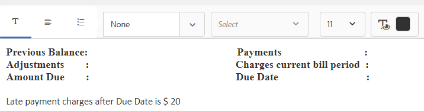

# Tutorial: Criar fragmentos de documento{#tutorial-create-document-fragments}

Este tutorial é uma etapa da série [Criar sua primeira comunicação interativa](/help/forms/using/create-your-first-interactive-communication.md). É recomendável seguir a série em sequência cronológica para entender, executar e demonstrar o caso de uso do tutorial completo.

Os fragmentos de documento são componentes reutilizáveis de uma correspondência que são usados para compor uma comunicação interativa. Os fragmentos de documento são dos seguintes tipos:

* Texto - Um ativo de texto é um conteúdo que consiste em um ou mais parágrafos de texto. Um parágrafo pode ser estático ou dinâmico.
* Lista - a Lista é um grupo de fragmentos de documento, incluindo texto, listas, condições e imagens.
* Condição - As condições permitem que você defina qual conteúdo será incluído na Comunicação interativa com base nos dados recebidos do Modelo de dados de formulário.

Este tutorial o orienta pelas etapas para criar vários fragmentos de documento de texto com base na anatomia fornecida na seção [Planejar a comunicação interativa](/help/forms/using/planning-interactive-communications.md). No final deste tutorial, você poderá:

* Criar fragmentos de documento
* Criar variáveis
* Criar e aplicar regras

Esta é a lista de fragmentos de documento criados neste tutorial:

* [Detalhes da lista](../../forms/using/create-document-fragments.md#step-create-bill-details-text-document-fragment)
* [Detalhes do cliente](../../forms/using/create-document-fragments.md#step-create-customer-details-text-document-fragment)
* [Resumo da fatura](../../forms/using/create-document-fragments.md#step-create-bill-summary-text-document-fragment)
* [Resumo das taxas](../../forms/using/create-document-fragments.md#step-create-summary-of-charges-text-document-fragment)

Cada fragmento de documento inclui campos com texto estático, dados recebidos do modelo de dados de formulário e dados inseridos usando a interface do usuário do agente. Todos esses campos foram descritos na seção [Planeje a seção Comunicação Interativa](/help/forms/using/planning-interactive-communications.md).

Ao criar fragmentos de documento neste tutorial, as variáveis são criadas para campos que recebem dados usando a interface do usuário do agente.

Use **FDM_Create_First_IC**, conforme descrito na seção [Criar modelo de dados de formulário](../../forms/using/create-form-data-model0.md), como o modelo de dados de formulário para criar fragmentos de documento neste tutorial.

## Etapa 1: Criar fragmento de documento de texto Detalhes da Lista {#step-create-bill-details-text-document-fragment}

O fragmento do documento Detalhes da Lista inclui os seguintes campos:

| Texto | Fonte de Dados |
|---|---|
| N.o da fatura | IU do agente |
| Período de Cobrança | IU do agente |
| Data da Cobrança | IU do agente |
| Seu plano | Modelo de dados de formulário |

Execute as seguintes etapas para criar variáveis para campos com a interface do usuário do agente como a fonte de dados, criar texto estático e usar elementos de modelo de dados de formulário no fragmento do documento:

1. Selecione **[!UICONTROL Forms]** > **[!UICONTROL Fragmentos de Documento]**.

1. Selecione **Criar** > **Texto**.
1. Especifique as seguintes informações:

   1. Digite **bill_details_first_ic** como o nome no campo **Title**. O título é preenchido automaticamente no campo **Nome**.

   1. Selecione **Modelo de Dados de Formulário** na seção **Modelo de Dados**.

   1. Selecione **FDM_Create_First_IC** como o modelo de dados de formulário e toque em **Selecionar**.

   1. Toque em **Next**.

1. Selecione a guia **Variáveis** no painel esquerdo e toque em **Criar**.
1. Na seção **Criar variável**:

   1. Digite **Invoicenumber** como o nome da variável.
   1. Selecione **String** como tipo.
   1. Toque em **Criar**.

   

   Repita as etapas 4 e 5 para criar as seguintes variáveis:

   * Período de cobrança: Tipo de string
   * Data da Lista: Tipo de data

   

1. Crie texto estático para os seguintes campos usando o painel direito:

   * N.o da fatura
   * Período de Cobrança
   * Data da Cobrança
   * Seu plano

   

1. Posicione o cursor ao lado do campo **NFF nº** e clique com o duplo na variável **InvoiceNumber** da guia **Variables** no painel esquerdo.
1. Coloque o cursor ao lado do campo **Período de Faturamento** e clique com o duplo na variável **Período de Faturamento**.
1. Coloque o cursor ao lado do campo **Data da Faturamento** e clique com o duplo na variável **Data da Faturamento**.
1. Selecione a guia **Objetos do modelo de dados** no painel esquerdo.
1. Coloque o cursor ao lado do campo **Seu Plano** e clique com o duplo na propriedade **customer** > **customerplan**.

   

1. Clique em **Salvar** para criar o fragmento de documento de texto Detalhes da Lista.

## Etapa 2: Criar fragmento de documento de texto de Detalhes do Cliente {#step-create-customer-details-text-document-fragment}

O fragmento do documento Detalhes do cliente inclui os seguintes campos:

| Texto | Fonte de Dados |
|---|---|
| Nome do cliente | Modelo de dados de formulário |
| Endereço | Modelo de dados de formulário |
| Local de fornecimento | IU do agente |
| Código do Estado | IU do agente |
| Número do celular | Modelo de dados de formulário |
| Número de contato alternativo | Modelo de dados de formulário |
| Número do Relacionamento | Modelo de dados de formulário |
| Número de conexões | IU do agente |

Execute as seguintes etapas para criar variáveis para campos com a interface do usuário do agente como a fonte de dados, criar texto estático e usar elementos de modelo de dados de formulário no fragmento do documento:

1. Selecione **[!UICONTROL Forms]** > **[!UICONTROL Fragmentos de Documento]**.
1. Selecione **Criar** > **Texto**.
1. Especifique as seguintes informações:

   1. Digite **customer_details_first_ic** como o nome no campo **Title**. O título é preenchido automaticamente no campo **Nome**.

   1. Selecione **Modelo de Dados de Formulário** na seção **Modelo de Dados**.

   1. Selecione **FDM_Create_First_IC** como o modelo de dados de formulário e toque em **Selecionar**.

   1. Toque em **Next**.

1. Selecione a guia **Variáveis** no painel esquerdo e toque em **Criar**.
1. Na seção **Criar variável**:

   1. Digite **PláacesSupply** como o nome da variável.
   1. Selecione **String** como tipo.
   1. Toque em **Criar**.

   Repita as etapas 4 e 5 para criar as seguintes variáveis:

   * Status: Tipo de número
   * Conexões de números: Tipo de número

1. Selecione a guia **Objetos do modelo de dados**, posicione o cursor no painel direito e clique com o duplo na propriedade **customer** > **name**.
1. Pressione Enter para mover o cursor para a linha seguinte e clique com o duplo na propriedade **customer** > **address**.
1. Crie texto estático para os seguintes campos usando o painel direito:

   * Número do celular
   * Número de contato alternativo
   * Local de fornecimento
   * Número do Relacionamento
   * Código do Estado
   * Número de conexões

   

1. Coloque o cursor ao lado do campo **Número do celular** e clique com o duplo na propriedade **customer** > **mobilenum**.
1. Coloque o cursor ao lado do campo **Número de contato alternativo** e clique com o duplo na propriedade** customer** > **alternatemobilenumber**.
1. Coloque o cursor ao lado do campo **Número do Relacionamento** e clique com o duplo na propriedade **customer** > **relation number**.
1. Selecione a guia **Variáveis**, posicione o cursor ao lado do campo **Local do Suprimento** e clique com o duplo na variável **Placnecply**.
1. Coloque o cursor ao lado do campo **Código de Estado** e clique com o duplo na variável **Status**.
1. Posicione o cursor ao lado do campo **Número de conexões** e clique com o duplo na variável **Números de conexões**.

   

1. Clique em **Salvar** para criar o fragmento de documento de texto Detalhes do cliente.

## Etapa 3: Criar fragmento de documento de texto Resumo de Lista {#step-create-bill-summary-text-document-fragment}

O fragmento do documento Resumo da Lista inclui os seguintes campos:

| Texto | Fonte de Dados |
|---|---|
| Saldo anterior | IU do agente |
| Pagamentos | IU do agente |
| Ajustamentos | IU do agente |
| Encargos do período de faturamento atual | Modelo de dados de formulário |
| Valor Devido | IU do agente |
| Data de vencimento | IU do agente |

Execute as seguintes etapas para criar variáveis para campos com a interface do usuário do agente como a fonte de dados, criar texto estático e usar elementos de modelo de dados de formulário no fragmento do documento:

1. Selecione **[!UICONTROL Forms]** > **[!UICONTROL Fragmentos de Documento]**.
1. Selecione **Criar** > **Texto**.
1. Especifique as seguintes informações:

   1. Digite **bill_summary_first_ic** como o nome no campo **Title**. O título é preenchido automaticamente no campo **Nome**.

   1. Selecione **Modelo de Dados de Formulário** na seção **Modelo de Dados**.

   1. Selecione **FDM_Create_First_IC** como o modelo de dados de formulário e toque em **Selecionar**.

   1. Toque em **Next**.

1. Selecione a guia **Variáveis** no painel esquerdo e toque em **Criar**.
1. Na seção **Criar variável**:

   1. Digite **Previousbalance** como o nome da variável.
   1. Selecione **Number** como tipo.
   1. Toque em **Criar**.

   Repita as etapas 4 e 5 para criar as seguintes variáveis:

   * Pagamentos: Tipo de número
   * Ajustamentos: Tipo de número
   * Montante devido: Tipo de número
   * Duedate: Tipo de data

1. Crie texto estático para os seguintes campos usando o painel direito:

   * Saldo anterior
   * Pagamentos
   * Ajustamentos
   * Encargos do período de faturamento atual
   * Valor Devido
   * Data de vencimento
   * Encargos de pagamento atrasados após a Data de Vencimento é $ 20

   

1. Coloque o cursor ao lado do campo **Saldo anterior** e clique com o duplo na variável **Saldo anterior**.
1. Coloque o cursor ao lado do campo **Pagamentos** e clique com o duplo na variável **Pagamentos**.
1. Coloque o cursor ao lado do campo **Ajustes** e clique com o duplo na variável **Ajustes**.
1. Posicione o cursor ao lado do campo **Valor devido** e clique com o duplo na variável **Valor devido**.
1. Coloque o cursor ao lado do campo **Data de Vencimento** e clique com o duplo na variável **Duedate**.
1. Selecione a guia **Objetos do Modelo de Dados**, posicione o cursor ao lado do campo **Encargos do período de faturamento atual** no painel direito e clique com o duplo do mouse na propriedade **bill** > **usagecharges**.

   

1. Clique em **Salvar** para criar o fragmento de documento de texto Detalhes do cliente.

## Etapa 4: Criar Resumo do fragmento de documento de texto de encargos {#step-create-summary-of-charges-text-document-fragment}

O fragmento Resumo dos encargos do documento inclui os seguintes campos:

| Texto | Fonte de Dados |
|---|---|
| Taxas de chamada | Modelo de dados de formulário |
| Taxas de chamada de conferência | Modelo de dados de formulário |
| Encargos SMS | Modelo de dados de formulário |
| Taxas de Internet Móvel | Modelo de dados de formulário |
| Taxas de roaming nacionais | Modelo de dados de formulário |
| Taxas de roaming internacionais | Modelo de dados de formulário |
| Encargos de Serviços de Valor Agregado | Modelo de dados de formulário |
| Total de Encargos | Modelo de dados de formulário |
| TOTAL A PAGAR | Modelo de dados de formulário |

Execute as seguintes etapas para criar texto estático e usar elementos de modelo de dados de formulário no fragmento do documento:

1. Selecione **[!UICONTROL Forms]** > **[!UICONTROL Fragmentos de Documento]**.
1. Selecione **Criar** > **Texto**.
1. Especifique as seguintes informações:

   1. Digite **summary_charge_first_ic** como o nome no campo **Title**. O título é preenchido automaticamente no campo Nome.

   1. Selecione **Modelo de Dados de Formulário** na seção **Modelo de Dados**.

   1. Selecione **FDM_Create_First_IC** como o modelo de dados de formulário e toque em **Selecionar**.

   1. Toque em **Next**.

1. Crie texto estático para os seguintes campos usando o painel direito:

   * Taxas de chamada
   * Taxas de chamada de conferência
   * Encargos SMS
   * Taxas de Internet Móvel
   * Taxas de roaming nacionais
   * Taxas de roaming internacionais
   * Encargos de Serviços de Valor Agregado
   * Total de Encargos
   * TOTAL A PAGAR

   

1. Selecione a guia **Objetos do modelo de dados**.
1. Coloque o cursor ao lado do campo **Charges de chamada** e clique com o duplo na propriedade **bill** > **callcharge**.
1. Coloque o cursor ao lado do campo **Taxas de Chamada de Conferência** e clique com o duplo na propriedade **bill** > **confcallcharge**.
1. Coloque o cursor ao lado do campo **Encargos SMS** e clique com o duplo na propriedade **bill** > **smscharges**.
1. Posicione o cursor ao lado do campo **Taxas de Internet Móvel** e clique com o duplo na propriedade **bill** > **internetcharge**.
1. Coloque o cursor ao lado do campo **Encargos de roaming nacional** e clique com o duplo na propriedade **bill** > **roamingnational**.
1. Coloque o cursor ao lado do campo **Encargos de roaming internacionais** e clique com o duplo na propriedade **bill** > **roamingintnl**.
1. Coloque o cursor ao lado do campo **Encargos de serviços de valor agregado** e clique com o duplo na propriedade **bill** > **vas**.
1. Coloque o cursor ao lado do campo **Total de encargos** e clique com o duplo na propriedade **bill** > **usagecharges**.
1. Coloque o cursor ao lado do campo **TOTAL PAYABLE** e clique com o duplo na propriedade **bill** > **usagecharges**.

   

1. Selecione o texto na linha **Encargos de Serviços de Valor Acrescentado** e toque em **Criar Regra** para criar uma condição com base na qual a linha é exibida na Comunicação Interativa:
1. Na janela pop-up **Criar regra**:

   1. Selecione **Modelos de dados e variáveis** e **listas** > **cobranças**.

   1. Selecione **como operador é menor que**.
   1. Selecione **Number** e insira o valor como **60**.

   Com base nessa condição, a linha Encargos de Serviços de Valor Agregado é exibida somente se o valor do campo Encargos de Chamada for menor que 60.

   

1. Clique em **Salvar** para criar o fragmento de documento de texto Resumo de encargos.
