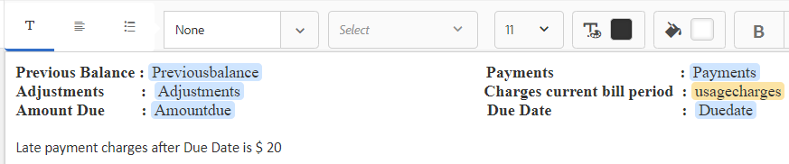

# Tutorial: Criar fragmentos de documento{#tutorial-create-document-fragments}

Este tutorial é uma etapa do [Criar sua primeira comunicação interativa](/help/forms/using/create-your-first-interactive-communication.md) série. É recomendável seguir a série em sequência cronológica para entender, executar e demonstrar o caso de uso tutorial completo.

Fragmentos de documento são componentes reutilizáveis de uma correspondência usados para compor uma Comunicação interativa. Os fragmentos de documento são dos seguintes tipos:

* Texto - Um ativo de texto é um conteúdo que consiste em um ou mais parágrafos de texto. Um parágrafo pode ser estático ou dinâmico.
* Lista - Lista é um grupo de fragmentos de documento, incluindo texto, listas, condições e imagens.
* Condição - As condições permitem definir qual conteúdo é incluído na Comunicação interativa com base nos dados recebidos do Modelo de dados de formulário.

Este tutorial o orienta pelas etapas para criar vários fragmentos de documento de texto com base na anatomia fornecida em [Planejar a comunicação interativa](/help/forms/using/planning-interactive-communications.md) seção. Ao final deste tutorial, você poderá:

* Criar fragmentos de documento
* Criar variáveis
* Criar e aplicar regras

Esta é a lista de fragmentos de documento criados neste tutorial:

* [Detalhes da fatura](../../forms/using/create-document-fragments.md#step-create-bill-details-text-document-fragment)
* [Detalhes do cliente](../../forms/using/create-document-fragments.md#step-create-customer-details-text-document-fragment)
* [Resumo da fatura](../../forms/using/create-document-fragments.md#step-create-bill-summary-text-document-fragment)
* [Resumo dos encargos](../../forms/using/create-document-fragments.md#step-create-summary-of-charges-text-document-fragment)

Cada fragmento de documento inclui campos com texto estático, dados recebidos do modelo de dados de formulário e dados inseridos usando a interface do agente. Todos esses campos foram descritos na variável [Planejar a comunicação interativa](/help/forms/using/planning-interactive-communications.md) seção.

Ao criar fragmentos de documento neste tutorial, as variáveis são criadas para campos que recebem dados usando a interface do agente.

Use **FDM_Create_First_IC**, conforme descrito no [Criar modelo de dados de formulário](../../forms/using/create-form-data-model0.md) , como o modelo de dados de formulário para criar fragmentos de documento neste tutorial.

## Etapa 1: Criar fragmento do documento de texto Detalhes da Lista {#step-create-bill-details-text-document-fragment}

O fragmento de documento Detalhes da Lista inclui os seguintes campos:

| Texto | Fonte de Dados |
|---|---|
| Números da fatura | IU do agente |
| Período de Faturamento | IU do agente |
| Data da Cobrança | IU do agente |
| Seu plano | Modelo de dados do formulário |

Execute as etapas a seguir para criar variáveis para campos com a interface do usuário do agente como a fonte de dados, criar texto estático e usar elementos do modelo de dados de formulário no fragmento do documento:

1. Selecionar **[!UICONTROL Forms]** > **[!UICONTROL Fragmentos de documento]**.

1. Selecionar **Criar** > **Texto**.
1. Especifique as seguintes informações:

   1. Enter **bill_details_first_ic** como o nome no **Título** campo. O título é preenchido automaticamente no **Nome** campo.

   1. Selecionar **Modelo de dados do formulário** do **Modelo de dados** seção.

   1. Selecionar **FDM_Create_First_IC** como modelo de dados de formulário e toque em **Selecionar**.

   1. Toque **Próximo**.

1. Selecione o **Variáveis** no painel esquerdo e toque em **Criar**.
1. No **Criar variável** seção:

   1. Enter **Invoicenumber** como o nome da variável.
   1. Selecionar **String** como tipo.
   1. Toque **Criar**.

   

   Repita as etapas 4 e 5 para criar as seguintes variáveis:

   * Período: Tipo de string
   * Data da Lista: Tipo de data

   

1. Crie texto estático para os seguintes campos usando o painel direito:

   * Números da fatura
   * Período de Faturamento
   * Data da Cobrança
   * Seu plano

   

1. Coloque o cursor próximo à **Números da fatura** e clique duas vezes no **NúmeroFatura** da variável **Variáveis** no painel esquerdo.
1. Coloque o cursor próximo à **Período de Faturamento** e clique duas vezes no **Período** variável.
1. Coloque o cursor próximo à **Data da Cobrança** e clique duas vezes no **Data da Cobrança** variável.
1. Selecione o **Objetos do modelo de dados** no painel esquerdo.
1. Coloque o cursor próximo à **Seu plano** e clique duas vezes no **cliente** > **customerplan** propriedade.

   

1. Clique em **Salvar** para criar o fragmento do documento de texto Detalhes da Lista.

## Etapa 2: Criar fragmento do documento de texto Detalhes do cliente {#step-create-customer-details-text-document-fragment}

O fragmento de documento Detalhes do cliente inclui os seguintes campos:

| Texto | Fonte de Dados |
|---|---|
| Nome do cliente | Modelo de dados do formulário |
| Endereço | Modelo de dados do formulário |
| Local de fornecimento | IU do agente |
| Código do Estado | IU do agente |
| Número do celular | Modelo de dados do formulário |
| Número de Contato Alternativo | Modelo de dados do formulário |
| Número do relacionamento | Modelo de dados do formulário |
| Número de Conexões | IU do agente |

Execute as etapas a seguir para criar variáveis para campos com a interface do usuário do agente como a fonte de dados, criar texto estático e usar elementos do modelo de dados de formulário no fragmento do documento:

1. Selecionar **[!UICONTROL Forms]** > **[!UICONTROL Fragmentos de documento]**.
1. Selecionar **Criar** > **Texto**.
1. Especifique as seguintes informações:

   1. Enter **customer_details_first_ic** como o nome no **Título** campo. O título é preenchido automaticamente no **Nome** campo.

   1. Selecionar **Modelo de dados do formulário** do **Modelo de dados** seção.

   1. Selecionar **FDM_Create_First_IC** como modelo de dados de formulário e toque em **Selecionar**.

   1. Toque **Próximo**.

1. Selecione o **Variáveis** no painel esquerdo e toque em **Criar**.
1. No **Criar variável** seção:

   1. Enter **Placupply** como o nome da variável.
   1. Selecionar **String** como tipo.
   1. Toque **Criar**.

   Repita as etapas 4 e 5 para criar as seguintes variáveis:

   * Código de estado: Tipo de número
   * Numerconexões: Tipo de número

1. Selecione o **Objetos do modelo de dados** , coloque o cursor no painel direito e clique duas vezes na guia **cliente** > **name** propriedade.
1. Pressione Enter para mover o cursor para a linha seguinte e clique duas vezes no botão **cliente** > **endereço** propriedade.
1. Crie texto estático para os seguintes campos usando o painel direito:

   * Número do celular
   * Número de Contato Alternativo
   * Local de fornecimento
   * Número do relacionamento
   * Código do Estado
   * Número de conexões

   

1. Coloque o cursor próximo à **Número do celular** e clique duas vezes no **cliente** > **mobilenum** propriedade.
1. Coloque o cursor próximo à **Número de Contato Alternativo** e clique duas vezes no** customer** > **alternatemobilenumber** propriedade.
1. Coloque o cursor próximo à **Número do relacionamento** e clique duas vezes no **cliente** > **relationNumber** propriedade.
1. Selecione o **Variáveis** , coloque o cursor próximo ao **Local de fornecimento** e clique duas vezes no **Placupply** variável.
1. Coloque o cursor próximo à **Código do Estado** e clique duas vezes no **Statecode** variável.
1. Coloque o cursor próximo à **Número de Conexões** e clique duas vezes no **Numererconnections** variável.

   

1. Clique em **Salvar** para criar o fragmento do documento de texto Detalhes do cliente .

## Etapa 3: Criar fragmento de documento de Resumo de Lista {#step-create-bill-summary-text-document-fragment}

O fragmento de documento Resumo da Lista inclui os seguintes campos:

| Texto | Fonte de Dados |
|---|---|
| Saldo anterior | IU do agente |
| Pagamentos | IU do agente |
| Ajustamentos | IU do agente |
| Encargos do período de faturamento atual | Modelo de dados do formulário |
| Valor devido | IU do agente |
| Data de vencimento | IU do agente |

Execute as etapas a seguir para criar variáveis para campos com a interface do usuário do agente como a fonte de dados, criar texto estático e usar elementos do modelo de dados de formulário no fragmento do documento:

1. Selecionar **[!UICONTROL Forms]** > **[!UICONTROL Fragmentos de documento]**.
1. Selecionar **Criar** > **Texto**.
1. Especifique as seguintes informações:

   1. Enter **bill_summary_first_ic** como o nome no **Título** campo. O título é preenchido automaticamente no **Nome** campo.

   1. Selecionar **Modelo de dados do formulário** do **Modelo de dados** seção.

   1. Selecionar **FDM_Create_First_IC** como modelo de dados de formulário e toque em **Selecionar**.

   1. Toque **Próximo**.

1. Selecione o **Variáveis** no painel esquerdo e toque em **Criar**.
1. No **Criar variável** seção:

   1. Enter **Saldo anterior** como o nome da variável.
   1. Selecionar **Número** como tipo.
   1. Toque **Criar**.

   Repita as etapas 4 e 5 para criar as seguintes variáveis:

   * Pagamentos: Tipo de número
   * Ajustamentos: Tipo de número
   * Montante devido: Tipo de número
   * Duedata: Tipo de data

1. Crie texto estático para os seguintes campos usando o painel direito:

   * Saldo anterior
   * Pagamentos
   * Ajustamentos
   * Encargos do período de faturamento atual
   * Valor devido
   * Data de vencimento
   * Encargos por pagamento atrasado após Data de Vencimento é $ 20

   

1. Coloque o cursor próximo à **Saldo anterior** e clique duas vezes no **Saldo anterior** variável.
1. Coloque o cursor próximo à **Pagamentos** e clique duas vezes no **Pagamentos** variável.
1. Coloque o cursor próximo à **Ajustamentos** e clique duas vezes no **Ajustamentos** variável.
1. Coloque o cursor próximo à **Valor devido** e clique duas vezes no **Montantes devidos** variável.
1. Coloque o cursor próximo à **Data de vencimento** e clique duas vezes no **Duedate** variável.
1. Selecione o **Objetos do modelo de dados** , coloque o cursor próximo ao **Encargos do período de faturamento atual** no painel direito e clique duas vezes no **contas** > **usagecharges** propriedade.

   

1. Clique em **Salvar** para criar o fragmento do documento de texto Detalhes do cliente .

## Etapa 4: Criar Resumo do fragmento do documento de texto de encargos {#step-create-summary-of-charges-text-document-fragment}

O fragmento do documento Resumo de encargos inclui os seguintes campos:

| Texto | Fonte de Dados |
|---|---|
| Encargos de Chamada | Modelo de dados do formulário |
| Encargos de Chamada em Conferência | Modelo de dados do formulário |
| Encargos SMS | Modelo de dados do formulário |
| Tarifas de Internet Móvel | Modelo de dados do formulário |
| Encargos de roaming nacional | Modelo de dados do formulário |
| Encargos de roaming internacional | Modelo de dados do formulário |
| Encargos de Serviços de Valor Acrescentado | Modelo de dados do formulário |
| Encargos Totais | Modelo de dados do formulário |
| TOTAL A PAGAR | Modelo de dados do formulário |

Execute as seguintes etapas para criar texto estático e usar elementos do modelo de dados de formulário no fragmento do documento:

1. Selecionar **[!UICONTROL Forms]** > **[!UICONTROL Fragmentos de documento]**.
1. Selecionar **Criar** > **Texto**.
1. Especifique as seguintes informações:

   1. Enter **summary_charge_first_ic** como o nome no **Título** campo. O título é preenchido automaticamente no campo Nome .

   1. Selecionar **Modelo de dados do formulário** do **Modelo de dados** seção.

   1. Selecionar **FDM_Create_First_IC** como modelo de dados de formulário e toque em **Selecionar**.

   1. Toque **Próximo**.

1. Crie texto estático para os seguintes campos usando o painel direito:

   * Encargos de Chamada
   * Encargos de Chamada em Conferência
   * Encargos SMS
   * Tarifas de Internet Móvel
   * Encargos de roaming nacional
   * Encargos de roaming internacional
   * Encargos de Serviços de Valor Acrescentado
   * Encargos Totais
   * TOTAL A PAGAR

   

1. Selecione o **Objetos do modelo de dados** guia .
1. Coloque o cursor próximo à **Encargos de Chamada** e clique duas vezes no **contas** > **encargos** propriedade.
1. Coloque o cursor próximo à **Encargos de Chamada em Conferência** e clique duas vezes no **contas** > **confcallloading** propriedade.
1. Coloque o cursor próximo à **Encargos SMS** e clique duas vezes no **contas** > **pesadas** propriedade.
1. Coloque o cursor próximo à **Tarifas de Internet Móvel** e clique duas vezes no **contas** > **internetargas** propriedade.
1. Coloque o cursor próximo à **Encargos de roaming nacional** e clique duas vezes no **contas** > **roamingnational** propriedade.
1. Coloque o cursor próximo à **Encargos de roaming internacional** e clique duas vezes no **contas** > **roamingintnl** propriedade.
1. Coloque o cursor próximo à **Encargos de Serviços de Valor Acrescentado** e clique duas vezes no **contas** > **tela** propriedade.
1. Coloque o cursor próximo à **Encargos Totais** e clique duas vezes no **contas** > **usagecharges** propriedade.
1. Coloque o cursor próximo à **TOTAL A PAGAR** e clique duas vezes no **contas** > **usagecharges** propriedade.

   

1. Selecione o texto no **Encargos de Serviços de Valor Acrescentado** e toque **Criar regra** para criar uma condição com base na qual a linha é exibida na Comunicação interativa:
1. No **Criar regra** janela pop-up:

   1. Selecionar **Modelos de dados e variáveis** e depois **contas** > **encargos**.

   1. Selecionar **é menor que** como operador.
   1. Selecionar **Número** e insira o valor como **60º**.

   Com base nessa condição, a linha Encargos de Serviços de Valor Agregado é exibida somente se o valor do campo Encargos de Chamada for menor que 60.

   

1. Clique em **Salvar** para criar o fragmento de documento Resumo de encargos.
