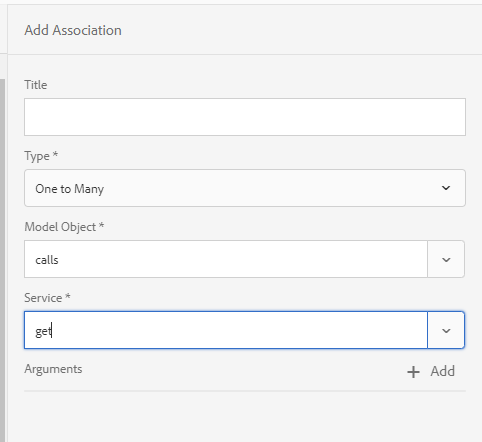

# Tutorial: criar modelo de dados do formulário no AEM Forms{#tutorial-create-form-data-model}


Este tutorial é uma etapa da série [Criar sua primeira Comunicação Interativa](/help/forms/using/create-your-first-interactive-communication.md). É recomendável seguir a série em sequência cronológica para entender, executar e demonstrar o caso de uso completo do tutorial.

## Sobre o tutorial {#about-the-tutorial}

O módulo de integração de dados do AEM Forms permite criar um modelo de dados de formulário a partir de diferentes fontes de dados de back-end, como perfil de usuário AEM, serviços Web RESTful, serviços Web baseados em SOAP, serviços OData e bancos de dados relacionais. Você pode configurar serviços e objetos de modelo de dados em um modelo de dados de formulário e associá-lo a um formulário adaptável. Os campos de formulário adaptável são vinculados às propriedades do objeto de modelo de dados. Os serviços permitem preencher previamente o formulário adaptável e gravar dados do formulário enviado de volta no objeto de modelo de dados.

Para obter mais informações sobre a integração de dados de formulário e o modelo de dados de formulário, consulte [Integração de dados do AEM Forms](https://helpx.adobe.com/experience-manager/6-3/forms/using/data-integration.html).

Este tutorial percorre as etapas para preparar, criar, configurar e associar um modelo de dados de formulário a uma comunicação interativa. Ao final deste tutorial, você será capaz de:

* [Configurar o banco de dados](../../forms/using/create-form-data-model0.md#step-set-up-the-database)
* [Configurar o banco de dados MySQL como fonte de dados](../../forms/using/create-form-data-model0.md#step-configure-mysql-database-as-data-source)
* [Criar modelo de dados de formulário](../../forms/using/create-form-data-model0.md#step-create-form-data-model)
* [Configurar modelo de dados do formulário](../../forms/using/create-form-data-model0.md#step-configure-form-data-model)
* [Testar modelo de dados do formulário](../../forms/using/create-form-data-model0.md#step-test-form-data-model-and-services)

O modelo de dados de formulário é semelhante ao seguinte:


**A.** Fontes de dados **B.** Esquemas de fonte de dados **C.** Serviços disponíveis **D.** Objetos de modelo de dados **E.** Serviços configurados

## Pré-requisitos {#prerequisites}

Antes de começar, verifique se você tem o seguinte:

* Banco de dados MySQL com dados de exemplo, conforme declarado na seção [Configurar o banco de dados](../../forms/using/create-form-data-model0.md#step-set-up-the-database).
* Pacote OSGi para o driver JDBC MySQL, conforme explicado em [Agrupando o driver do banco de dados JDBC](https://helpx.adobe.com/experience-manager/6-3/help/sites-developing/jdbc.html#bundling-the-jdbc-database-driver)

## Etapa 1: configurar o banco de dados {#step-set-up-the-database}

Um banco de dados é essencial para criar uma comunicação interativa. Este tutorial usa um banco de dados para exibir o Modelo de dados de formulário e os recursos de persistência das Comunicações interativas. Configurar um banco de dados contendo tabelas de clientes, faturamentos e chamadas.
A imagem a seguir ilustra dados de exemplo para a tabela do cliente:


Use a instrução DDL a seguir para criar a tabela **customer** no banco de dados.

```sql
CREATE TABLE `customer` (
   `mobilenum` int(11) NOT NULL,
   `name` varchar(45) NOT NULL,
   `address` varchar(45) NOT NULL,
   `alternatemobilenumber` int(11) DEFAULT NULL,
   `relationshipnumber` int(11) DEFAULT NULL,
   `customerplan` varchar(45) DEFAULT NULL,
   PRIMARY KEY (`mobilenum`),
   UNIQUE KEY `mobilenum_UNIQUE` (`mobilenum`)
 ) ENGINE=InnoDB DEFAULT CHARSET=utf8
```

Use a instrução DDL a seguir para criar a tabela **listas** no banco de dados.

```sql
CREATE TABLE `bills` (
   `billplan` varchar(45) NOT NULL,
   `latepayment` decimal(4,2) NOT NULL,
   `monthlycharges` decimal(4,2) NOT NULL,
   `billdate` date NOT NULL,
   `billperiod` varchar(45) NOT NULL,
   `prevbal` decimal(4,2) NOT NULL,
   `callcharges` decimal(4,2) NOT NULL,
   `confcallcharges` decimal(4,2) NOT NULL,
   `smscharges` decimal(4,2) NOT NULL,
   `internetcharges` decimal(4,2) NOT NULL,
   `roamingnational` decimal(4,2) NOT NULL,
   `roamingintnl` decimal(4,2) NOT NULL,
   `vas` decimal(4,2) NOT NULL,
   `discounts` decimal(4,2) NOT NULL,
   `tax` decimal(4,2) NOT NULL,
   PRIMARY KEY (`billplan`)
 ) ENGINE=InnoDB DEFAULT CHARSET=utf8
```

Use a instrução DDL a seguir para criar a tabela **chamadas** no banco de dados.

```sql
CREATE TABLE `calls` (
   `mobilenum` int(11) DEFAULT NULL,
   `calldate` date DEFAULT NULL,
   `calltime` varchar(45) DEFAULT NULL,
   `callnumber` int(11) DEFAULT NULL,
   `callduration` varchar(45) DEFAULT NULL,
   `callcharges` decimal(4,2) DEFAULT NULL,
   `calltype` varchar(45) DEFAULT NULL
 ) ENGINE=InnoDB DEFAULT CHARSET=utf8
```

A tabela **chamadas** inclui os detalhes da chamada, como data, hora, número, duração e encargos. A tabela **customer** está vinculada à tabela de chamadas usando o campo Celular (mobilenum). Para cada número de celular listado na tabela **customer**, há vários registros na tabela **calls**. Por exemplo, você pode recuperar os detalhes da chamada do número de celular **1457892541** referindo-se à tabela **chamadas**.

A tabela **faturas** inclui os detalhes da fatura, como data da fatura, período da fatura, encargos mensais e encargos de chamada. A tabela **customer** está vinculada à tabela **bill** usando o campo Plano de Cobrança. Há um plano associado a cada cliente na tabela **cliente**. A tabela **contas** inclui os detalhes de preço de todos os planos existentes. Por exemplo, você pode recuperar os detalhes do plano para **Sarah** da tabela **customer** e usar esses detalhes para recuperar os detalhes de preço da tabela **bill**.

## Etapa 2: configurar o banco de dados MySQL como fonte de dados {#step-configure-mysql-database-as-data-source}

É possível configurar diferentes tipos de fontes de dados para criar um modelo de dados de formulário. Para este tutorial, você configurará o banco de dados MySQL que está configurado e preenchido com dados de amostra. Para obter informações sobre outras fontes de dados com suporte e como configurá-las, consulte [Integração de Dados do AEM Forms](https://helpx.adobe.com/experience-manager/6-3/forms/using/data-integration.html).

Faça o seguinte para configurar o banco de dados MySQL:

1. Instale o driver JDBC para o banco de dados MySQL como um pacote OSGi:

   1. Faça logon na instância do autor do AEM Forms como administrador e acesse os pacotes de console da Web AEM. A URL padrão é [https://localhost:4502/system/console/bundles](https://localhost:4502/system/console/bundles).
   1. Selecione **Instalar/Atualizar**. Uma caixa de diálogo **Carregar/Instalar Pacotes** é exibida.

   1. Selecione **Escolher Arquivo** para procurar e selecionar o pacote OSGi do driver JDBC MySQL. Selecione **Iniciar Pacote** e **Atualizar Pacotes** e selecione **Instalar** ou **Atualizar**. Verifique se o driver JDBC da Oracle Corporation para MySQL está ativo. O driver está instalado.

1. Configure o banco de dados MySQL como uma fonte de dados:

   1. Vá para o console da Web do AEM em [https://localhost:4502/system/console/configMgr](https://localhost:4502/system/console/configMgr).
   1. Localize a configuração **Fonte de Dados Pooled da Conexão Apache Sling**. Selecione para abrir a configuração no modo de edição.
   1. Na caixa de diálogo de configuração, especifique os seguintes detalhes:

      * **Nome da fonte de dados:** Você pode especificar qualquer nome. Por exemplo, especifique **MySQL**.

      * **Nome da propriedade de serviço DataSource**: especifique o nome da propriedade de serviço que contém o nome DataSource. É especificado ao registrar a instância da fonte de dados como serviço OSGi. Por exemplo, **datasource.name**.

      * **Classe do driver JDBC**: especifique o nome da classe Java do driver JDBC. Para o banco de dados MySQL, especifique **com.mysql.jdbc.Driver**.

      * **URI de conexão JDBC**: especifique a URL de conexão do banco de dados. Para o banco de dados MySQL executado na porta 3306 e no esquema teleca, a URL é: `jdbc:mysql://'server':3306/teleca?autoReconnect=true&useUnicode=true&characterEncoding=utf-8`
      * **Nome de usuário:** Nome de usuário do banco de dados. É necessário habilitar o driver JDBC para estabelecer uma conexão com o banco de dados.
      * **Senha:** Senha do banco de dados. É necessário habilitar o driver JDBC para estabelecer uma conexão com o banco de dados.
      * **Testar ao Emprestar:** Habilitar a opção **Testar ao Emprestar**.

      * **Testar ao Retornar:** Habilitar a opção **Testar ao Retornar**.

      * **Consulta de Validação:** especifique uma consulta SQL SELECT para validar as conexões do pool. A consulta deve retornar pelo menos uma linha. Por exemplo, **selecione &#42; do cliente**.

      * **Isolamento de Transação**: Defina o valor como **READ_COMMITTED**.

   Deixe as outras propriedades com os [valores](https://tomcat.apache.org/tomcat-7.0-doc/jdbc-pool.html) padrão e selecione **Salvar**.

   Uma configuração semelhante à seguinte é criada.

   

## Etapa 3: Criar modelo de dados de formulário {#step-create-form-data-model}

O AEM Forms fornece uma interface de usuário intuitiva para [criar um modo de dados de formulário](https://helpx.adobe.com/experience-manager/6-3/forms/using/data-integration.html#main-pars_header_1524967585)l a partir de fontes de dados configuradas. É possível usar várias fontes de dados em um modelo de dados de formulário. Para o caso de uso deste tutorial, você usará o MySQL como fonte de dados.

Faça o seguinte para criar o modelo de dados de formulário:

1. Na instância do autor AEM, navegue até **Forms** > **Integrações de Dados**.
1. Selecione **Criar** > **Modelo de Dados de Formulário**.
1. No assistente Criar modelo de dados de formulário, especifique um **nome** para o modelo de dados de formulário. Por exemplo, **FDM_Create_First_IC**. Selecione **Próximo**.
1. A tela selecionar fonte de dados lista todas as fontes de dados configuradas. Selecione a fonte de dados **MySQL** e selecione **Criar**.

   

1. Clique em **Concluído**. O modelo de dados de formulário **FDM_Create_First_IC** foi criado.

## Etapa 4: configurar o modelo de dados de formulário {#step-configure-form-data-model}

A configuração do modelo de dados de formulário inclui:

* [adição de objetos e serviços de modelo de dados](#add-data-model-objects-and-services)
* [criação de propriedades filho computadas para o objeto de modelo de dados](#create-computed-child-properties-for-data-model-object)
* [adição de associações entre objetos de modelo de dados](#add-associations-between-data-model-objects)
* [edição de propriedades do objeto de modelo de dados](#edit-data-model-object-properties)
* [configuração de serviços para objetos de modelo de dados](#configure-services)

### Adicionar objetos e serviços de modelo de dados {#add-data-model-objects-and-services}

1. Na instância do autor do AEM, navegue até **Forms** > **Integrações de Dados**. A URL padrão é [https://localhost:4502/aem/forms.html/content/dam/formsanddocuments-fdm](https://localhost:4502/aem/forms.html/content/dam/formsanddocuments-fdm).
1. O modelo de dados de formulário **FDM_Create_First_IC** criado anteriormente está listado aqui. Selecione e selecione **Editar**.

   A fonte de dados selecionada **MySQL** é exibida no painel **Fontes de Dados**.

   

1. Expanda a árvore de fonte de dados **MySQL**. Selecione os seguintes serviços e objetos de modelo de dados do esquema **teleca**:

   * **Objetos do modelo de dados**:

      * faturas
      * chamadas
      * cliente

   * **Serviços:**

      * obter
      * atualizar

   Selecione **Adicionar Selecionados** para adicionar objetos e serviços de modelo de dados selecionados ao modelo de dados de formulário.

   

   Os objetos de modelo de dados de listas, chamadas e clientes são exibidos no painel direito na guia **Modelo**. Os serviços de obtenção e atualização são exibidos na guia **Serviços**.

   

### Criar propriedades filho computadas para o objeto de modelo de dados {#create-computed-child-properties-for-data-model-object}

Uma propriedade calculada é aquela cujo valor é calculado com base em uma regra ou expressão. Usando uma regra, você pode definir o valor de uma propriedade calculada como uma cadeia de caracteres literal, um número, o resultado de uma expressão matemática ou o valor de outra propriedade no modelo de dados de formulário.

Com base no caso de uso, crie a propriedade computada filho **usagecharges** no objeto de modelo de dados **bills** usando a seguinte expressão matemática:

* encargos de utilização = encargos das chamadas + encargos das chamadas em conferência + encargos SMS + encargos da internet móvel + itinerância nacional + itinerância internacional + SAV (todas estas propriedades existem no objeto de modelo de dados faturas)
Para obter mais informações sobre a propriedade computada filho **usagecharges**, consulte [Planejar a Comunicação Interativa](/help/forms/using/planning-interactive-communications.md).

Execute as seguintes etapas para criar propriedades-filho calculadas para o objeto de modelo de dados de listas:

1. Marque a caixa de seleção na parte superior do objeto de modelo de dados **listas** para selecioná-lo e selecione **Criar propriedade secundária**.
1. No painel **Criar Propriedade Filho**:

   1. Insira **encargos de uso** como o nome da propriedade filho.
   1. Habilitar **Computado**.
   1. Selecione **Flutuante** como o tipo e selecione **Concluído** para adicionar a propriedade filho ao objeto de modelo de dados **contas**.

   

1. Selecione **Editar regra** para abrir o Editor de regras.
1. Selecione **Criar**. A janela de regra **Definir Valor** é aberta.
1. No menu suspenso Selecionar opção, selecione **Expressão matemática**.

   

1. Na expressão matemática, selecione **chamcharge** e **confcallcharge** como primeiro e segundo objetos, respectivamente. Selecione **mais** como operador. Selecione dentro da expressão matemática e selecione **Estender Expressão** para adicionar objetos **smscharge**, **internetcharge**, **roamingnational**, **roamingintnl** e **vas** à expressão.

   A imagem a seguir descreve a expressão matemática no editor de regras:

   

1. Selecione **Concluído**. A regra é criada no Editor de regras.
1. Selecione **Fechar** para fechar a janela do Editor de Regras.

### Adicionar associações entre objetos de modelo de dados {#add-associations-between-data-model-objects}

Depois que os objetos do modelo de dados tiverem sido definidos, você poderá criar associações entre eles. A associação pode ser um para um ou um para muitos. Por exemplo, pode haver vários dependentes associados a um funcionário. É chamada de associação um para muitos e é representada por 1:n na linha que conecta os objetos do modelo de dados associados. No entanto, se uma associação retornar um nome de funcionário exclusivo para uma determinada ID de funcionário, ela será chamada de associação um para um.

Ao adicionar objetos de modelo de dados associados em uma fonte de dados a um modelo de dados de formulário, suas associações são mantidas e exibidas como conectadas por linhas de seta.

Com base no caso de uso, crie as seguintes associações entre os objetos do modelo de dados:

| Associação | Objetos do modelo de dados |
|---|---|
| 1:n | cliente: chamadas (várias chamadas podem ser associadas a um cliente em uma fatura mensal) |
| 1:1 | cliente:listas (Um faturamento é associado a um cliente para um determinado mês) |

Execute as seguintes etapas para criar associações entre objetos de modelo de dados:

1. Marque a caixa de seleção na parte superior do objeto de modelo de dados **cliente** para selecioná-lo e selecione **Adicionar Associação**. O painel de propriedades **Adicionar Associação** é aberto.
1. No painel **Adicionar Associação**:

   * Especifique um título para a associação. É um campo opcional.
   * Selecione **Um para Muitos** na lista suspensa **Tipo**.

   * Selecione **chamadas** da lista suspensa **Objeto de Modelo**.

   * Selecione **get** da lista suspensa **Serviço**.

   * Selecione **Adicionar** para vincular o objeto de modelo de dados **cliente** ao objeto de modelo de dados **chamadas** usando uma propriedade. Com base no caso de uso, o objeto de modelo de dados de chamadas deve ser vinculado à propriedade de número de celular no objeto de modelo de dados do cliente. A caixa de diálogo **Adicionar Argumento** é aberta.

   

1. Na caixa de diálogo **Adicionar argumento**:

   * Selecione **mobilenum** na lista suspensa **Nome**. A propriedade de número de celular é uma propriedade comum disponível no cliente e chama objetos de modelo de dados. Como resultado, é usado para criar uma associação entre o cliente e chamar objetos de modelo de dados.
Para cada número de celular disponível no objeto de modelo de dados do cliente, há vários registros de chamada disponíveis na tabela de chamadas.

   * Especifique um título opcional e uma descrição para o argumento.
   * Selecione **cliente** na lista suspensa **Ligando a**.

   * Selecione **mobilenum** na lista suspensa **Valor de Associação**.

   * Selecione **Adicionar**.

   

   A propriedade mobilenum é exibida na seção **Argumentos**.

   

1. Selecione **Concluído** para criar uma associação 1:n entre o cliente e objetos de modelo de dados de chamadas.

   Depois de criar uma associação entre o cliente e chamar objetos de modelo de dados, crie uma associação 1:1 entre o cliente e os objetos de modelo de dados de faturamento.

1. Marque a caixa de seleção na parte superior do objeto de modelo de dados **cliente** para selecioná-lo e selecione **Adicionar Associação**. O painel de propriedades **Adicionar Associação** é aberto.
1. No painel **Adicionar Associação**:

   * Especifique um título para a associação. É um campo opcional.
   * Selecione **Um para Um** na lista suspensa **Tipo**.

   * Selecione **contas** da lista suspensa **Objeto de Modelo**.

   * Selecione **get** da lista suspensa **Serviço**. A propriedade **billplan**, que é a chave primária para a tabela de contas, já está disponível na seção **Argumentos**.
Os objetos de modelo de dados de listas e clientes são vinculados usando as propriedades billplan (listas) e customerplan (cliente), respectivamente. Crie um vínculo entre essas propriedades para recuperar os detalhes do plano para qualquer cliente disponível no banco de dados MySQL.

   * Selecione **cliente** na lista suspensa **Ligando a**.

   * Selecione **customerplan** na lista suspensa **Valor de Associação**.

   * Selecione **Concluído** para criar uma associação entre as propriedades billplan e customerplan.

   

   A imagem a seguir descreve as associações entre os objetos do modelo de dados e as propriedades usadas para criar associações entre eles:

   

### Editar propriedades do objeto de modelo de dados {#edit-data-model-object-properties}

Depois de criar associações entre o cliente e outros objetos de modelo de dados, edite as propriedades do cliente para definir a propriedade com base na qual os dados são recuperados do objeto de modelo de dados. Com base no caso de uso, o número de celular é usado como a propriedade para recuperar dados do objeto de modelo de dados do cliente.

1. Marque a caixa de seleção na parte superior do objeto de modelo de dados **customer** para selecioná-lo e selecione **Editar Propriedades**. O painel **Editar Propriedades** é aberto.
1. Especifique **customer** como o **objeto de Modelo de Nível Superior**.
1. Selecione **get** da lista suspensa **Serviço de Leitura**.
1. Na seção **Argumentos**:

   * Selecione **Solicitar atributo** na lista suspensa **Ligando a**.

   * Especifique **mobilenum** como o Valor de Associação.

1. Selecione **atualizar** na lista suspensa Serviço **Gravar**.
1. Na seção **Argumentos**:

   * Para a propriedade **mobilenum**, selecione **customer** na lista suspensa **Ligando a**.

   * Selecione **mobilenum** na lista suspensa **Valor de Associação**.

1. Selecione **Concluído** para salvar as propriedades.

   

1. Marque a caixa de seleção na parte superior do objeto de modelo de dados **calls** para selecioná-lo e selecione **Editar Propriedades**. O painel **Editar Propriedades** é aberto.
1. Desabilite o **objeto de modelo de nível superior** para o objeto de modelo de dados **calls**.
1. Selecione **Concluído**.

   Repita as etapas 8 - 10 para configurar as propriedades do objeto de modelo de dados **listas**.

### Configurar serviços {#configure-services}

1. Vá para a guia **Serviços**.
1. Selecione o serviço **get** e selecione **Editar Propriedades**. O painel **Editar Propriedades** é aberto.
1. No painel **Editar Propriedades**:

   * Insira um título opcional e uma descrição.
   * Selecione **cliente** na lista suspensa **Objeto de modelo de saída**.

   * Selecione **Concluído** para salvar as propriedades.

   

1. Selecione o serviço **atualizar** e selecione **Editar Propriedades**. O painel **Editar Propriedades** é aberto.
1. No painel **Editar Propriedades**:

   * Insira um título opcional e uma descrição.
   * Selecione **cliente** na lista suspensa **Objeto de Modelo de Entrada**.

   * Selecione **Concluído**.
   * Selecione **Salvar** para salvar o modelo de dados de formulário.

   

## Etapa 5: testar o modelo de dados e os serviços do formulário {#step-test-form-data-model-and-services}

Você pode testar o objeto de modelo de dados e os serviços para verificar se o modelo de dados de formulário está configurado corretamente.

Faça o seguinte para executar o teste:

1. Vá para a guia **Modelo**, selecione o objeto de modelo de dados **cliente** e selecione **Testar Objeto de Modelo**.
1. Na janela **Testar Modelo de Dados de Formulário**, selecione **Ler objeto de modelo** na lista suspensa **Selecionar Modelo/Serviço**.
1. Na seção **Input**, especifique um valor para a propriedade **mobilenum** que existe no banco de dados MySQL configurado e selecione **Test**.

   Os detalhes do cliente associados à propriedade mobilenum especificada são obtidos e exibidos na seção Saída, como mostrado abaixo. Feche a caixa de diálogo.

   

1. Vá para a guia **Serviços**.
1. Selecione o serviço **get** e selecione **Testar Serviço.**
1. Na seção **Input**, especifique um valor para a propriedade **mobilenum** que existe no banco de dados MySQL configurado e selecione **Test**.

   Os detalhes do cliente associados à propriedade mobilenum especificada são obtidos e exibidos na seção Saída, como mostrado abaixo. Feche a caixa de diálogo.

   

### Editar e salvar dados de amostra {#edit-and-save-sample-data}

O editor do modelo de dados de formulário permite gerar dados de amostra para todas as propriedades do objeto de modelo de dados, incluindo propriedades computadas, em um modelo de dados de formulário. É um conjunto de valores aleatórios que estão em conformidade com o tipo de dados configurado para cada propriedade. Também é possível editar e salvar os dados, que são retidos mesmo que você gere novamente os dados de amostra.

Faça o seguinte para gerar, editar e salvar dados de amostra:

1. Na página do modelo de dados de formulário, selecione **Editar Dados de Exemplo**. Ele gera e exibe os dados de amostra na janela Editar dados de amostra.

   

1. Na janela **Editar Dados de Exemplo**, edite os dados, conforme necessário, e selecione **Salvar**. Feche a janela.
